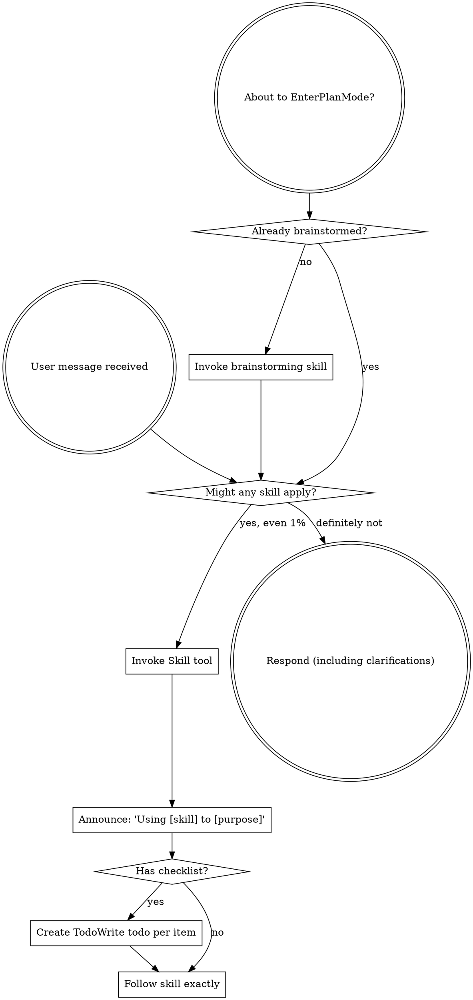

Reading additional input from stdin...
OpenAI Codex v0.128.0 (research preview)
--------
workdir: C:\Users\Jake Diggity\Documents\GitHub\FINAL TRY
model: gpt-5.5
provider: openai
approval: never
sandbox: workspace-write [workdir, /tmp, C:\Users\Jake Diggity\.codex\memories]
reasoning effort: xhigh
reasoning summaries: none
session id: 019e0ab4-1b54-72c1-a17b-0a58e9396c48
--------
user
Review the topic. Give brief verdict per sub-question (Q1, Q2, Q3) plus integrated framework recommendation. Under 600 words. Be opinionated. Cite NES asm files (reference/aldonunez/Z_04.asm) or RoomRom/src/ paths where relevant.

<stdin>
# Debate: Phase 7 Task 7.1 framework

**Date:** 2026-05-09
**Phase:** 7 (Enemies By Behavior Family)
**Task:** 7.1 (Enemy Framework — BLOCKING for parallel family fan-out)
**Master plan tier:** "Sonnet + Codex debate Tier 2"

## Three sub-questions, integrated verdict

### Q1 — enemy_state.h alias collision resolution

134 in-scope OBJ(0x0412) collisions per master plan. Sonnet evidence:
`ENEMY_FLYER_SPEED_FRAC` and `ENEMY_PUSH_TIMER` both map to slot 0x0412.

- (a) tagged-union per-enemy-family — NES Z_04.asm uses overlapping object scratch space (same memory, different meaning per type).
- (b) separate sub-arrays per family — wastes RAM, eliminates aliasing.
- (c) flat byte-slot array + per-enemy-type accessor macros that document the alias.

### Q2 — roomrom_rng.h design

Required exports: `rng_seed` / `rng_next` / `rng_peek` + `PROBE_RNG_SEED` probe address.

- (a) port NES Z1 Random helper byte-for-byte (LSR/EOR taps, single-byte state).
- (b) 16-bit LFSR (Galois).
- (c) xorshift32.

Constraint: enemy spawn positions, drop tables, and direction-pick math
must match NES exactly when seeded the same. NES uses 1-byte state;
widening breaks parity.

### Q3 — enemy_parity_matrix.md scope

Per master plan: per enemy: source room(s), spawn rule, RNG seed
positions, movement timer cadence, hitbox dimensions, damage value,
drop table, required probe id.

- (a) hand-author all rows now from NES asm reading (~30+ enemies, ~3 hours).
- (b) generate skeleton from existing `src/game/enemies/*_runtime.c` + NES asm grep, hand-fill probe ids as Phase 1.5 captures land.
- (c) defer the matrix until first family lands and grow incrementally.

## Project context

- 433 drained C functions across 7 subsystems exist.
- Phase 6 just closed (commit `d185fbb3`).
- Sole build target `Debug.md`.
- NES accuracy as spec, Genesis-native impl.
- CLAUDE.md priority: long-term outcome > coding practice > efficiency > NES accuracy.

## Format

Brief verdict per sub-question + integrated framework recommendation.
Under 600 words total per round.
</stdin>
codex
I’ll quickly inspect the relevant local references so the verdict can cite the project’s actual NES and RoomRom surfaces rather than relying on the debate text alone.
exec
"C:\\WINDOWS\\System32\\WindowsPowerShell\\v1.0\\powershell.exe" -Command "Get-Content -LiteralPath 'C:\\Users\\Jake Diggity\\.codex\\plugins\\cache\\openai-curated\\superpowers\\f812c146\\skills\\using-superpowers\\SKILL.md'" in C:\Users\Jake Diggity\Documents\GitHub\FINAL TRY
 succeeded in 694ms:
---
name: using-superpowers
description: Use when starting any conversation - establishes how to find and use skills, requiring Skill tool invocation before ANY response including clarifying questions
---

<SUBAGENT-STOP>
If you were dispatched as a subagent to execute a specific task, skip this skill.
</SUBAGENT-STOP>

<EXTREMELY-IMPORTANT>
If you think there is even a 1% chance a skill might apply to what you are doing, you ABSOLUTELY MUST invoke the skill.

IF A SKILL APPLIES TO YOUR TASK, YOU DO NOT HAVE A CHOICE. YOU MUST USE IT.

This is not negotiable. This is not optional. You cannot rationalize your way out of this.
</EXTREMELY-IMPORTANT>

## Instruction Priority

Superpowers skills override default system prompt behavior, but **user instructions always take precedence**:

1. **User's explicit instructions** (CLAUDE.md, GEMINI.md, AGENTS.md, direct requests) — highest priority
2. **Superpowers skills** — override default system behavior where they conflict
3. **Default system prompt** — lowest priority

If CLAUDE.md, GEMINI.md, or AGENTS.md says "don't use TDD" and a skill says "always use TDD," follow the user's instructions. The user is in control.

## How to Access Skills

**In Claude Code:** Use the `Skill` tool. When you invoke a skill, its content is loaded and presented to you—follow it directly. Never use the Read tool on skill files.

**In Copilot CLI:** Use the `skill` tool. Skills are auto-discovered from installed plugins. The `skill` tool works the same as Claude Code's `Skill` tool.

**In Gemini CLI:** Skills activate via the `activate_skill` tool. Gemini loads skill metadata at session start and activates the full content on demand.

**In other environments:** Check your platform's documentation for how skills are loaded.

## Platform Adaptation

Skills use Claude Code tool names. Non-CC platforms: see `references/copilot-tools.md` (Copilot CLI), `references/codex-tools.md` (Codex) for tool equivalents. Gemini CLI users get the tool mapping loaded automatically via GEMINI.md.

# Using Skills

## The Rule

**Invoke relevant or requested skills BEFORE any response or action.** Even a 1% chance a skill might apply means that you should invoke the skill to check. If an invoked skill turns out to be wrong for the situation, you don't need to use it.



## Red Flags

These thoughts mean STOP—you're rationalizing:

| Thought | Reality |
|---------|---------|
| "This is just a simple question" | Questions are tasks. Check for skills. |
| "I need more context first" | Skill check comes BEFORE clarifying questions. |
| "Let me explore the codebase first" | Skills tell you HOW to explore. Check first. |
| "I can check git/files quickly" | Files lack conversation context. Check for skills. |
| "Let me gather information first" | Skills tell you HOW to gather information. |
| "This doesn't need a formal skill" | If a skill exists, use it. |
| "I remember this skill" | Skills evolve. Read current version. |
| "This doesn't count as a task" | Action = task. Check for skills. |
| "The skill is overkill" | Simple things become complex. Use it. |
| "I'll just do this one thing first" | Check BEFORE doing anything. |
| "This feels productive" | Undisciplined action wastes time. Skills prevent this. |
| "I know what that means" | Knowing the concept ≠ using the skill. Invoke it. |

## Skill Priority

When multiple skills could apply, use this order:

1. **Process skills first** (brainstorming, debugging) - these determine HOW to approach the task
2. **Implementation skills second** (frontend-design, mcp-builder) - these guide execution

"Let's build X" → brainstorming first, then implementation skills.
"Fix this bug" → debugging first, then domain-specific skills.

## Skill Types

**Rigid** (TDD, debugging): Follow exactly. Don't adapt away discipline.

**Flexible** (patterns): Adapt principles to context.

The skill itself tells you which.

## User Instructions

Instructions say WHAT, not HOW. "Add X" or "Fix Y" doesn't mean skip workflows.
. : File C:\Users\Jake Diggity\Documents\WindowsPowerShell\Microsoft.PowerShell_profile.ps1 cannot be loaded because 
running scripts is disabled on this system. For more information, see about_Execution_Policies at 
https:/go.microsoft.com/fwlink/?LinkID=135170.
At line:1 char:3
+ . 'C:\Users\Jake Diggity\Documents\WindowsPowerShell\Microsoft.PowerS ...
+   ~~~~~~~~~~~~~~~~~~~~~~~~~~~~~~~~~~~~~~~~~~~~~~~~~~~~~~~~~~~~~~~~~~~
    + CategoryInfo          : SecurityError: (:) [], PSSecurityException
    + FullyQualifiedErrorId : UnauthorizedAccess

codex
Using `superpowers:using-superpowers` for the required startup check; no implementation workflow applies because this is an architecture verdict, so I’m just gathering citations.
exec
"C:\\WINDOWS\\System32\\WindowsPowerShell\\v1.0\\powershell.exe" -Command 'rg -n "ENEMY_FLYER_SPEED_FRAC|ENEMY_PUSH_TIMER|0x0412|rng_seed|rng_next|rng_peek|PROBE_RNG_SEED|enemy_state|enemy_parity" RoomRom/src src reference -S' in C:\Users\Jake Diggity\Documents\GitHub\FINAL TRY
exec
"C:\\WINDOWS\\System32\\WindowsPowerShell\\v1.0\\powershell.exe" -Command 'rg -n "Random|random|rng|RNG|Obj|0412|Flyer|PUSH|PUSH_TIMER|SPEED_FRAC|Enemy" reference/aldonunez/Z_04.asm' in C:\Users\Jake Diggity\Documents\GitHub\FINAL TRY
exec
"C:\\WINDOWS\\System32\\WindowsPowerShell\\v1.0\\powershell.exe" -Command "rg --files RoomRom/src src reference | rg \"(enemy|enemies|rng|probe|runtime|state|parity|Z_04\\.asm)"'$"' in C:\Users\Jake Diggity\Documents\GitHub\FINAL TRY
 succeeded in 1281ms:
3:.INCLUDE "ObjVars.inc"
34:.IMPORT DoObjectsCollide
35:.IMPORT DrawObjectMirrored
36:.IMPORT DrawObjectNotMirrored
37:.IMPORT DrawObjectWithAnimAndSpecificSprites
39:.IMPORT GetObjectMiddle
56:.IMPORT Anim_AdvanceAnimCounterAndSetObjPosForSpriteDescriptor
57:.IMPORT Anim_FetchObjPosForSpriteDescriptor
58:.IMPORT Anim_SetObjHFlipForSpriteDescriptor
59:.IMPORT AnimateItemObject
60:.IMPORT AnimateObjectWalking
61:.IMPORT ChangeTileObjTiles
77:.IMPORT MoveObject
78:.IMPORT Obj_Shove
79:.IMPORT ResetObjMetastate
80:.IMPORT ResetObjMetastateAndTimer
81:.IMPORT ResetObjState
83:.IMPORT ReverseObjDir
85:.IMPORT SetTypeAndClearObject
126:.EXPORT RevealAndFlagSecretStairsObj
184:    LDA ObjInvincibilityTimer, X
193:    LDA ObjMetastate, X
203:    STA ObjQSpeedFrac, X
204:    JMP ResetObjMetastate
212:    LDA ObjDir, X
220:    SBC ObjX, X
232:    STY ObjDir, X
239:    SBC ObjY, X
243:    STY ObjDir, X
253:    STA ObjDir, X
262:    STA ObjDir, X
263:    JSR AnimateObjectWalking
266:    LDA ObjType, X
274:    JMP DrawObjectNotMirrored
282:    STA ObjTurnRate, X
283:    LDA ObjShoveDir, X
285:    JMP Obj_Shove
291:    ORA ObjStunTimer, X
303:    LDA ObjTurnTimer, X
305:    DEC ObjTurnTimer, X
308:    LDA ObjShoveDir, X
317:    LDA ObjQSpeedFrac, X
319:    LDA ObjGridOffset, X
324:    STA ObjGridOffset, X
325:    ; If turn rate < a random value, or Link's state = $FF;
328:    LDA ObjTurnRate, X
329:    CMP Random+1, X
331:    LDA ObjState
339:    SBC ObjX, X
355:    CMP ObjY, X
365:    SBC ObjY, X
380:    CMP ObjX, X
387:    STY ObjDir, X
388:    ; Set turn timer to a random value.
390:    LDA Random, X
391:    STA ObjTurnTimer, X
395:    STA ObjWantsToShoot, X
404:    STA ObjWantsToShoot, X
407:    LDA ObjTurnTimer, X
417:    LDA ObjDir, X
425:    LDA ObjType+1, X
431:    LDA ObjState, X
437:    LDA ObjShoveDir, X
445:    LDA ObjQSpeedFrac, X
447:    LDA ObjGridOffset, X
452:    STA ObjGridOffset, X
456:    LDA ObjState
468:    LDY ObjY, X
469:    CMP ObjY, X
471:    LDA ObjY, X
488:    LDY ObjX, X
489:    CMP ObjX, X
491:    LDA ObjX, X
514:    STA ObjWantsToShoot, X
522:    INC ObjWantsToShoot, X
524:    STA ObjDir, X
528:    LDA ObjDir, X
529:    STA ObjInputDir, X
535:    LDY ObjType, X
542:    ; If a random value <> $23 nor $77, then return.
544:    LDA Random, X
556:    LDY ObjTimer, X
564:    ORA ObjStunTimer, X
574:    STA ObjState, X
578:    STA ObjWantsToShoot, X
582:    STA ObjRefId, Y
586:    STA ObjRefId, X
590:    STA a:ObjState, Y
594:    STA ObjQSpeedFrac, Y
598:    STA ObjMovingLimit, Y
602:    STA ObjMetastate, Y
606:    STA ObjAnimCounter, Y
607:    ; Have the monster wait a random amount of time, up to $3F frames.
609:    LDA Random, X
611:    STA ObjTimer, X
619:    LDA ObjState, X
636:    LDA ObjX
637:    CMP ObjX, X
640:    LDA ObjY
644:    SBC ObjY, X
651:    LDA ObjY
654:    CMP ObjY, X
660:    LDA ObjX
662:    SBC ObjX, X
684:    LDA ObjInputDir
691:    INC ObjPushTimer, X
694:    LDY ObjPushTimer, X
701:    STA ObjDir, X
702:    INC ObjState, X
705:    JSR ChangeTileObjTiles
707:    JSR Anim_FetchObjPosForSpriteDescriptor
710:    JMP DrawObjectNotMirrored
716:    STA ObjPushTimer, X
723:    LDA ObjDir, X
725:    JSR MoveObject
729:    LDA ObjGridOffset, X
744:    JSR ChangeTileObjTiles
745:    INC ObjState, X
756:DrawObjectNotMirroredOverLink:
763:DrawObjectMirroredOverLink:
770:    LDY ObjType, X
778:    JMP DrawObjectWithAnimAndSpecificSprites
797:    JSR SetTypeAndClearObject
805:    LDA ObjX, X
808:    STA a:ObjX, Y
809:    LDA ObjY, X
810:    STA a:ObjY, Y
823:    LDA ObjDir, X
827:    LDA ObjState, X
834:    LDA ObjType, X
840:    LDA ObjTimer, X
845:    CMP ObjectFirstUnwalkableTile
855:    JSR MoveObject
863:    LDA ObjType, X
880:    JSR Anim_FetchObjPosForSpriteDescriptor
890:    LDY ObjType, X
902:    JMP DrawObjectNotMirrored
907:    LDA ObjType, X
920:    LDA Shot_ObjBounceDir, X
925:    LDA ObjY, X
928:    STA ObjY, X
929:    LDA ObjX, X
932:    STA ObjX, X
936:    LDA Shot_ObjBounceDist, X
939:    STA Shot_ObjBounceDist, X
960:    STA Shot_ObjBounceDist, X
968:    LDA ObjDir
969:    STA Shot_ObjBounceDir, X
971:    STA ObjState, X
983:    LDA ObjState, X
989:    STA Fireball_ObjPosFracX, X
990:    STA Fireball_ObjPosFracY, X
997:    STA Fireball_ObjDirToTargetX, X
999:    STA Fireball_ObjDirToTargetY, X
1003:    STA ObjDir, X
1009:    STA Fireball_ObjQSpeedX, X
1011:    STA Fireball_ObjQSpeedY, X
1016:    STA ObjState, X
1017:    STA ObjTimer, X
1026:    LDA ObjTimer, X
1030:    LDA ObjDir, X
1042:    LDA Fireball_ObjDirToTargetX, X
1047:    LDA Fireball_ObjQSpeedX, X
1048:    LDY Fireball_ObjPosFracX, X
1050:    STA Fireball_ObjPosFracX, X
1053:    LDA Fireball_ObjDirToTargetY, X
1058:    LDA Fireball_ObjQSpeedY, X
1059:    LDY Fireball_ObjPosFracY, X
1061:    STA Fireball_ObjPosFracY, X
1081:    STA ObjQSpeedFrac, X
1083:    STA ObjPosFrac, X
1084:    JSR MoveObject
1087:    LDA ObjPosFrac, X
1092:    STA ObjQSpeedFrac, X
1096:    ; Choose one of eight random directions.
1098:    LDA Random, X
1102:    STA ObjDir, X
1103:    JSR ResetFlyerState
1107:    STA Flyer_ObjSpeed, X
1115:    STA Flyer_ObjSpeed, X
1121:    LDA ObjType, X
1142:    JSR AnimateAndDrawCommonObject
1151:    LDA ObjType, X
1174:AnimateAndDrawCommonObject:
1175:    JSR Anim_AdvanceAnimCounterAndSetObjPosForSpriteDescriptor
1176:    JSR Anim_SetObjHFlipForSpriteDescriptor
1178:    JMP DrawObjectNotMirrored
1188:    JSR MoveFlyer
1190:    JSR Anim_FetchObjPosForSpriteDescriptor
1194:    LDA Flyer_ObjDistTraveled, X
1197:    JSR DrawObjectMirrored
1202:    LDA Flyer_ObjFlyingState, X
1205:    .ADDR Flyer_SpeedUp
1206:    .ADDR Flyer_KeeseDecideState
1207:    .ADDR Flyer_Chase
1208:    .ADDR Flyer_Wander
1209:    .ADDR Flyer_SlowDown
1210:    .ADDR Flyer_Delay
1212:Flyer_KeeseDecideState:
1213:    ; Go to the next state randomly:
1214:    ; Random >= $A0: 2
1215:    ; Random >= $20: 3
1221:    LDA Random+1, X
1223:    BCS Flyer_SetStateAndTurns  ; If >= $A0, go to state 2.
1226:    BCS Flyer_SetStateAndTurns  ; If >= $20, go to state 3.
1228:Flyer_SetStateAndTurns:
1230:    STA Flyer_ObjFlyingState, X
1232:    STA Flyer_ObjTurns, X
1238:    JSR Anim_FetchObjPosForSpriteDescriptor
1248:    JMP DrawObjectMirrored
1251:    LDA ObjState, X
1267:    INC ObjState, X
1275:    INC RoomObjCount
1281:    LDA ObjDir, X
1287:    STA a:ObjDir, Y
1294:    STA a:ObjDir, Y
1306:    STA a:ObjState, Y
1309:    LDA ObjGridOffset, X
1310:    STA ObjGridOffset, Y
1316:    LDA ObjState, X
1324:    LDA ObjMetastate, X
1326:    LDA ObjInvincibilityTimer, X
1335:    LDA ObjY, X
1346:    LDA ObjX, X
1368:    AND ObjDir
1370:    INC ObjState, X
1372:    INC ObjState, X
1378:    STA ObjState, X
1387:    LDA ObjX, X
1391:    STA ObjX, X
1392:    JSR Anim_FetchObjPosForSpriteDescriptor
1406:    JSR DrawObjectNotMirrored
1408:    STA ObjX, X
1414:    LDY ObjState, X
1422:    LDA ObjTimer, X
1433:    LDA ObjX, X
1437:    STA ObjX, X
1440:    LDA ObjY, X
1444:    STA ObjY, X
1448:    STA ObjGridOffset, X
1449:    INC ObjState, X
1460:    STA ObjQSpeedFrac, X
1462:    STA ObjTimer, X
1463:    INC ObjState, X
1476:    STA ObjQSpeedFrac, X
1479:    LDA ObjTimer, X
1483:    STA ObjTurnRate, X
1487:    LDA ObjGridOffset, X
1488:    ORA ObjTimer, X
1490:    ; Choose a random index (0 to 3) to look up an amount of time.
1492:    LDA Random, X
1497:    LDA ObjType, X
1511:    STA ObjTimer, X
1525:    STA ObjQSpeedFrac, X
1528:    LDA ObjDir, X
1532:    LDA ObjGridOffset, X
1537:    CMP ObjectFirstUnwalkableTile
1547:    JSR MoveObject
1551:    LDA ObjGridOffset, X
1555:    STA ObjGridOffset, X
1561:    ; CheckMonsterCollisions calls GetObjectMiddle which
1564:    LDA ObjX, X
1566:    LDA ObjY, X
1657:    LDY Statue_ObjFireballTimer, X
1660:    STA Statue_ObjFireballTimer, X
1666:    ; If the random value for this fireball index >= $F0, go loop again.
1669:    LDA Random, X
1673:    ; the random value.
1678:    STA Statue_ObjFireballTimer, X
1697:    JSR Anim_FetchObjPosForSpriteDescriptor
1706:    STA ObjX, X
1712:    STA ObjY, X
1784:    ; Turn the random value at this index into a $10 pixel aligned X coordinate.
1788:    LDA a:Random, Y
1790:    STA ObjX, X
1794:    ; Turn the random value into a $10 pixel aligned Y coordinate.
1797:    LDA a:Random, Y
1809:    STA ObjY, X
1822:    JMP SetTypeAndClearObject
1841:    JSR ResetObjMetastateAndTimer
1843:    ; Set a random starting direction.
1845:    LDA Random+1, X
1849:    STA ObjDir, X
1854:    STA ObjTimer, X
1863:    JSR ResetObjMetastateAndTimer
1874:    STA ObjQSpeedFrac, X
1885:    STA ObjTimer, X
1886:    JSR ResetObjState
1887:    STA ObjAnimFrame, X         ; Reset movement frame.
1889:    STA ObjAnimCounter, X
1895:    JSR ResetObjMetastateAndTimer
1897:    STA ObjDir, X
1898:EndInitFlyer:
1899:    JSR ResetFlyerState
1903:    STA Flyer_ObjSpeed, X
1914:    STA ObjX, X
1916:    STA ObjY, X
1934:    LDA ObjState, X
1937:    LDA ObjTimer, X
1945:    STA ObjTimer, X
1951:    LDA ObjState, X
1960:    STA ObjTurnRate, X
1979:    LDA ObjType, X
1988:    LDA ObjShootTimer, X
1990:    ; and a random value < $F8, then return.
1992:    LDA Random, X
2023:    LDA ObjInvincibilityTimer, X
2027:    LDY ObjShootTimer, X
2034:    LDA ObjWantsToShoot, X
2041:    STA ObjShootTimer, X
2054:    ORA ObjStunTimer, X
2066:    STA ObjWantsToShoot, X
2075:    STA ObjQSpeedFrac, X
2097:    STA ObjTimer, X
2106:    STA ObjQSpeedFrac, X
2110:    LDA ObjTimer, X
2114:    LDA a:ObjState, X
2127:    LDA ObjDir, X
2135:    LDY ObjRefId, X
2136:    LDA ObjType, Y
2138:    STA ObjTimer, X
2147:    LDA a:ObjState, X
2171:    LDA ObjTimer, X
2174:    ; go set the timer to wait a random amount of time.
2178:    BEQ @RandomizeTimer
2189:    JSR SetTypeAndClearObject
2190:    ; Give the boulder a random X coordinate in the same half
2193:    LDA Random+1, X
2195:    CPY #$80                    ; If chase target X < $80, mask Random with $7F.
2203:    STA ObjX, X
2207:    STA ObjY, X
2208:    ; Set the boulder set's timer to ((Random + 8) AND $1F).
2210:    LDX CurObjIndex
2213:    ADC Random+1, X
2215:    STA ObjTimer, X
2218:@RandomizeTimer:
2219:    ; Randomize the object timer.
2221:    LDA ObjTimer, X
2223:    ADC Random+1, X
2224:    STA ObjTimer, X
2254:    LDA ObjShoveDir, X
2267:    ORA ObjStunTimer, X
2271:    LDA ObjState, X
2277:    LDA ObjTimer, X
2289:    LDA ObjDir, X
2294:    CMP ObjX, X
2299:    ORA ObjDir, X
2300:    STA ObjDir, X
2304:    INC ObjState, X
2322:    LDA Jumper_ObjReversalCount, X
2325:    LDA ObjDir, X
2327:    STA ObjDir, X
2329:    STA Jumper_ObjReversalCount, X
2340:    LDY ObjDir, X
2341:    LDA ObjY, X
2344:    STA Jumper_ObjTargetY, X
2349:    STA Jumper_ObjSpeedWholeY, X
2362:    JSR BoundFlyer
2368:    INC Jumper_ObjReversalCount, X
2376:    STA Jumper_ObjReversalCount, X
2391:    ADC ObjDir, X
2402:    LDA ObjDir, X
2409:    ADC ObjX, X
2410:    STA ObjX, X
2414:    LDA Jumper_ObjSpeedWholeY, X
2421:    LDA ObjY, X
2423:    SBC Jumper_ObjTargetY, X
2431:    JSR ResetObjState
2432:    LDY ObjType, X
2437:    ; t := (Random + $10)
2443:    ADC Random+1, X
2451:    LDY ObjType, X
2457:    ; If Random < $A0, then go use this t.
2459:    LDY Random+1, X
2466:    STA ObjTimer, X
2468:    JSR Anim_FetchObjPosForSpriteDescriptor
2475:    LDA ObjType, X
2482:    LDA ObjState, X
2486:    LDY ObjTimer, X
2494:    JSR Anim_AdvanceAnimCounterAndSetObjPosForSpriteDescriptor
2495:    LDA ObjAnimFrame, X
2497:    JMP DrawObjectMirroredAndCheckCollisions
2503:    JSR Anim_AdvanceAnimCounterAndSetObjPosForSpriteDescriptor
2504:    LDA ObjAnimFrame, X         ; The animation frame determines the frame image.
2505:    JSR DrawObjectNotMirroredAndCheckLinkCollision
2508:    LDA ObjY, X
2523:    LDA ObjType, X
2534:    LDA ObjType, X
2537:    LDA ObjDir, X
2540:    STA ObjDir, X
2554:    LDA Jumper_ObjSpeedWholeY, X
2555:    ADC ObjY, X
2556:    STA ObjY, X
2559:    LDA Jumper_ObjSpeedFracY, X
2562:    STA Jumper_ObjSpeedFracY, X
2565:    LDA Jumper_ObjSpeedWholeY, X
2567:    STA Jumper_ObjSpeedWholeY, X
2579:    LDA Jumper_ObjSpeedFracY, X
2583:    STA Jumper_ObjSpeedWholeY, X
2586:    STA Jumper_ObjSpeedFracY, X
2601:    STA ObjTurnRate, X
2606:    LDA ObjTimer, X
2610:    LDA ObjType, X
2613:    LDY ObjState, X
2621:    ; The frame image number is being assigned to ObjDir.
2624:    LDA ObjY, X
2625:    CMP ObjY
2629:    STY ObjDir, X
2633:    LDA ObjState, X
2640:    STA ObjState, X
2645:    STA ObjQSpeedFrac, X
2647:    STA ObjTimer, X
2652:    LDY ObjState, X
2662:    JSR Anim_AdvanceAnimCounterAndSetObjPosForSpriteDescriptor
2665:    LDA ObjState, X
2668:    ; (front or back), which was stored in ObjDir above.
2670:    LDY ObjType, X
2673:    LDY ObjState, X
2678:    LDA ObjDir, X
2694:    ADC ObjAnimFrame, X
2696:    JSR DrawObjectMirrored
2701:    LDA ObjType, X
2704:    LDA ObjState, X
2710:    LDA ObjState, X
2717:    LDA ObjMetastate, X
2721:    LDA ObjType, X
2738:    LDA ObjState, X
2757:    LDA ObjDir
2758:    STA ObjDir, X
2759:    ; Randomly (>= $C0) face the opposite direction -- toward Link.
2761:    LDA Random+1, X
2764:    JSR ReverseObjDir
2768:    LDA ObjDir, X
2773:    LDA ObjX
2774:    STA ObjX, X
2779:    LDA ObjDir, X
2787:    LDA ObjY
2795:    STA ObjY, X
2809:    LDA ObjY
2810:    STA ObjY, X
2820:    LDA ObjDir, X
2828:    LDA ObjX
2839:    STA ObjX, X
2866:    CMP ObjectFirstUnwalkableTile
2873:    STA ObjAnimCounter, X
2881:    JSR ReverseObjDir
2885:    LDA ObjState, X
2892:    LDA ObjShoveDir, X
2894:    JSR Obj_Shove
2902:    ORA ObjStunTimer, X
2908:    LDA ObjDir, X
2911:    CMP ObjectFirstUnwalkableTile
2917:    JSR MoveObject
2920:    LDA ObjGridOffset, X
2923:    STA ObjGridOffset, X
2928:    STA ObjTimer, X
2933:    LDA ObjTimer, X
2941:    LDA ObjState, X
2949:    STA ObjState, X
2955:    STA ObjQSpeedFrac, X
2957:    STA ObjTimer, X
2959:    LDY ObjState, X
2971:    LDY ObjType, X
2976:    STA ObjTurnRate, X
2982:    LDY ObjType, X
2993:    JSR Anim_FetchObjPosForSpriteDescriptor
2996:    LDA ObjDir, X
3021:    DEC ObjAnimCounter, X
3024:    STA ObjAnimCounter, X
3035:    EOR ObjAnimFrame, X
3036:    STA ObjAnimFrame, X
3042:    ADC ObjAnimFrame, X
3046:    LDA ObjDir, X
3052:    JSR DrawObjectNotMirrored
3063:DrawObjectMirroredAndCheckCollisions:
3064:    JSR DrawObjectMirrored
3074:    LDA ObjMetastate, X
3081:@LoopObject:
3082:    LDA ObjType, Y
3086:    STA ObjMetastate, Y
3089:    BNE @LoopObject
3094:    JSR Anim_FetchObjPosForSpriteDescriptor
3099:    LDA ObjDir, X
3110:    LDA ObjDir, X
3119:    LDA ObjDir, X
3140:DrawObjectNotMirroredAndCheckLinkCollision:
3141:    JSR DrawObjectNotMirrored
3151:    ; In UpdateObject, this object was flagged "initialized".
3154:    LDA ObjTimer, X
3155:    STA ObjUninitialized, X
3163:    LDA ObjType, X
3187:    LDA ObjX, X
3192:    LDA ObjY, X
3204:    STA ObjY+19
3205:    LDA ObjX, X
3206:    STA ObjX+19
3209:    STY ObjState+19
3251:    JSR ChangeTileObjTiles
3260:    STA ObjGridOffset, X
3261:    ; Set a speed (q-speed fraction) randomly:
3262:    ; $20 if random value < $80
3266:    LDY Random+1, X
3271:    STA ObjQSpeedFrac, X
3276:    STA ObjInputDir, X
3277:    STA ObjDir, X
3280:    LDA ObjTimer, X
3285:    LDA ObjType, X
3297:    LDA ObjUninitialized, X
3299:    JSR ResetObjMetastateAndTimer
3300:    JMP EndInitFlyer
3306:    LDA ObjShoveDir, X
3313:    DEC ObjAnimCounter, X
3318:    STA ObjAnimCounter, X
3329:    LDA ObjAnimFrame, X
3331:    STA ObjAnimFrame, X
3333:    JSR Anim_FetchObjPosForSpriteDescriptor
3334:    LDY ObjDir, X
3343:    ADC ObjAnimFrame, X
3344:    JSR DrawObjectNotMirrored
3348:    LDA ObjTimer, X
3355:    LDA ObjMetastate, X
3358:    STA ObjType, X
3369:    LDA ObjState+1
3375:    LDA ObjY
3380:    LDA ObjX
3388:    INC ObjState+1
3390:    STA ObjState
3408:    INC ObjState+1
3410:    STA ObjTimer+1
3424:    LDA ObjTimer+1
3428:    INC ObjState+1
3430:    STA ObjState
3437:    STY ObjInputDir
3442:    LDA ObjState
3444:    STY ObjState
3449:    STA ObjState
3453:    LDX CurObjIndex
3471:    LDA ObjState, X
3480:    ; Object slot <> 2. If the state of the heart in slot 2 = 0, then
3486:    LDA ObjState+2
3496:    LDA ObjAngleWhole+2
3502:    INC ObjState, X
3506:    STA ObjDir, X
3510:    STA ObjAngleWhole, X
3513:    LDA ObjX+1
3514:    STA ObjX, X
3517:    LDA ObjY+1
3520:    STA ObjY, X
3527:    JSR DecreaseObjectAngle
3534:    JSR RotateObjectLocation
3535:    STA ObjY, X
3539:    JSR Anim_FetchObjPosForSpriteDescriptor
3543:    LDX CurObjIndex
3544:    JSR DrawObjectNotMirrored
3561:    LDA ObjState, X
3568:    LDA ObjType, X
3582:    LDA ObjX
3583:    CMP ObjX, X
3590:    LDA ObjY
3594:    SBC ObjY, X
3609:    LDA ObjInputDir
3619:    STA ObjDir, X
3620:    INC ObjState, X
3624:    STA TileObjRoomId, X
3630:    JSR ChangeTileObjTiles
3639:    LDA ObjDir, X
3641:    JSR MoveObject
3644:    JSR Anim_FetchObjPosForSpriteDescriptor
3646:    JSR DrawObjectNotMirrored
3650:    LDA ObjGridOffset, X
3660:    LDA TileObjRoomId, X
3668:    LDY ObjType, X
3683:    JSR ChangeTileObjTiles
3690:    LDY TileObjRoomId, X
3692:    STA ObjX, X
3693:    STY ObjY, X
3699:RevealSecretTileObj:
3701:    JSR ChangeTileObjTiles
3715:    LDA a:ObjState, Y
3719:    LDA a:ObjState, Y
3728:    JSR CheckTileObjWeaponCollision
3731:    JSR RevealAndFlagSecretTileObj
3745:    LDA a:ObjState, Y
3749:    LDA a:ObjState, Y
3758:    LDA a:ObjTimer, Y
3763:    JSR CheckTileObjWeaponCollision
3770:RevealAndFlagSecretStairsObj:
3776:RevealAndFlagSecretTileObj:
3777:    JSR RevealSecretTileObj
3796:CheckTileObjWeaponCollision:
3797:    LDA a:ObjX, Y
3801:    LDA a:ObjY, Y
3807:    JSR GetObjectMiddle
3809:    JMP DoObjectsCollide
3859:    LDA ObjState, X
3875:    CMP ObjX
3879:    STA ObjX, X
3884:    LDA ObjY
3894:    STY ObjState, X
3899:    STA ObjY, X
3904:    STA ObjState
3908:    STA ObjDir
3915:    LDY ObjState, X
3920:    DEC ObjY, X
3921:    DEC ObjY
3925:    LDA ObjY
3938:    INC ObjY, X
3939:    INC ObjY
3943:    LDA ObjY
3949:    STA ObjGridOffset
3952:    STA ObjState
3953:    STA ObjState, X
3962:    JSR AnimateObjectWalking
3973:    JSR MoveFlyer
3975:    JSR Anim_FetchObjPosForSpriteDescriptor
3980:    LDA Flyer_ObjDistTraveled, X
3985:    LDA Flyer_ObjFlyingState, X
3988:    .ADDR Flyer_SpeedUp
3989:    .ADDR Flyer_GhiniDecideState
3990:    .ADDR Flyer_Chase
3991:    .ADDR Flyer_Wander
3992:    .ADDR Flyer_SlowDown
3993:    .ADDR Flyer_Delay
3995:Flyer_GhiniDecideState:
3996:    ; Go to the next state randomly:
3997:    ; Random >= $A0: 2
3998:    ; Random >= $08: 3
4004:    LDA Random, X
4012:    JMP Flyer_SetFlyingStateAnd6Turns    ; Go set the state we determined.
4018:    LDA ObjShoveDir, X
4020:    JSR Obj_Shove
4029:    ORA ObjStunTimer, X
4034:    JSR MoveFlyer
4036:    JSR Anim_FetchObjPosForSpriteDescriptor
4040:    LDA Flyer_ObjDistTraveled, X
4042:    JSR DrawObjectMirrored
4046:    LDA Flyer_ObjFlyingState, X
4055:    LDA Flyer_ObjFlyingState, X
4058:    .ADDR Flyer_SpeedUp
4059:    .ADDR Flyer_PeahatDecideState
4060:    .ADDR Flyer_Chase
4061:    .ADDR Flyer_Wander
4062:    .ADDR Flyer_SlowDown
4063:    .ADDR Flyer_Delay
4065:Flyer_PeahatDecideState:
4066:    ; Go to the next state randomly:
4067:    ; Random >= $B0: 2
4068:    ; Random >= $20: 3
4074:    LDA Random, X
4076:    BCS Flyer_SetFlyingStateAnd6Turns    ; If >= $B0, go to state 2.
4079:    BCS Flyer_SetFlyingStateAnd6Turns    ; If >= $20, go to state 3.
4081:Flyer_SetFlyingStateAnd6Turns:
4083:    STA Flyer_ObjFlyingState, X
4085:    STA Flyer_ObjTurns, X
4122:    LDA ObjState, X
4131:    LDA ObjTimer+1
4135:    LDA ObjState
4148:    LDA ObjX
4154:    LDA ObjY
4164:    LDA ObjX
4173:    LDA ObjY
4175:    LDA ObjX
4187:    STA ObjY, X
4198:    LDA ObjY
4207:    LDA ObjX
4209:    LDA ObjY
4221:    STA ObjY, X
4226:    STA ObjX, X
4229:    LDY Wallmaster_ObjStep, X
4232:    STA ObjDir, X
4239:    STA ObjTimer+1
4241:    STA ObjQSpeedFrac, X
4243:    STA ObjAnimCounter, X
4247:    STA ObjGridOffset, X
4248:    STA Wallmaster_ObjTilesCrossed, X
4249:    STA ObjAnimFrame, X
4252:    INC ObjState, X
4258:    LDA ObjShoveDir, X
4260:    JSR Obj_Shove
4269:    ORA ObjStunTimer, X
4271:    LDA ObjDir, X
4273:    JSR MoveObject
4277:    LDA ObjGridOffset, X
4286:    STA ObjGridOffset, X
4289:    INC Wallmaster_ObjStep, X
4292:    LDY Wallmaster_ObjStep, X
4295:    STA ObjDir, X
4298:    INC Wallmaster_ObjTilesCrossed, X
4302:    LDA Wallmaster_ObjTilesCrossed, X
4309:    LDA ObjCaptureTimer, X
4320:    STA ObjState
4324:    STA ObjState, X
4330:    LDA ObjCaptureTimer, X
4336:    LDA ObjCaptureTimer, X
4339:    STA ObjState
4341:    STA ObjShoveDir
4349:    LDA ObjAnimFrame, X
4350:    JSR DrawObjectNotMirrored
4365:    LDX CurObjIndex
4366:    LDA ObjAnimFrame, X
4392:    LDA ObjX, X
4393:    STA ObjX
4394:    LDA ObjY, X
4395:    STA ObjY
4398:    LDX CurObjIndex
4403:    STA ObjAnimFrame, X
4404:    JSR DrawObjectNotMirroredOverLink
4417:    JSR Anim_AdvanceAnimCounterAndSetObjPosForSpriteDescriptor
4420:    LDY Wallmaster_ObjStep, X
4452:    STA Wallmaster_ObjStep, X
4457:    LDY ObjInputDir
4466:    LDY ObjDir
4470:    LDA Wallmaster_ObjStep, X
4473:    STA Wallmaster_ObjStep, X
4499:    LDA Wallmaster_ObjStep, X
4502:    STA Wallmaster_ObjStep, X
4540:    STA ObjHP, X
4545:    STA ObjHP, X
4552:    LDA ObjDir, X
4553:    STA ObjInputDir, X
4558:    ORA ObjStunTimer, X
4563:    LDA ObjGridOffset, X
4566:    STA ObjGridOffset, X
4569:    ; set timer to a random value up to $3F, and turn to face
4572:    LDA ObjQSpeedFrac, X
4575:    LDA ObjTimer, X
4577:    LDA Random, X
4579:    STA ObjTimer, X
4585:    CMP ObjDir, X
4588:    STA ObjQSpeedFrac, X
4592:    LDA ObjQSpeedFrac, X
4595:    LDA ObjGridOffset, X
4600:    LDA ObjX
4602:    SBC ObjX, X
4609:    STA ObjDir, X
4612:    LDA ObjY
4613:    CMP ObjY, X
4616:    LSR ObjDir, X
4621:    STA ObjQSpeedFrac, X
4624:    JSR Anim_AdvanceAnimCounterAndSetObjPosForSpriteDescriptor
4627:    LDA ObjDir, X
4645:    LDA ObjAnimFrame, X
4646:    JSR DrawObjectNotMirrored
4653:    LDA ObjY
4655:    SBC ObjY, X
4662:    STA ObjDir, X
4666:    LDA ObjX
4667:    CMP ObjX, X
4675:    JSR AnimateAndDrawCommonObject
4685:    ; If shoot timer = 0 and Random < $F8, then return.
4687:    LDA ObjShootTimer, X
4689:    LDA Random, X
4698:    LDA ObjInvincibilityTimer, X
4702:    LDY ObjShootTimer, X
4707:    LDA ObjWantsToShoot, X
4717:    STA ObjShootTimer, X
4728:    ORA ObjStunTimer, X
4742:    STA ObjTimer, X
4752:    STA ObjWantsToShoot, X
4759:    STA ObjQSpeedFrac, X
4765:    ; Object slots $A to 1 will be used.
4772:    STA a:ObjX+1, Y
4774:    STA a:ObjY+1, Y
4779:    STA a:ObjDir+1, Y
4780:    STA Moldorm_ObjBounceDir+1, Y
4781:    STA ObjMetastate+1, Y
4782:    STA ObjUninitialized+1, Y
4785:    LDA ObjAttr+1
4786:    STA ObjAttr+1, Y
4789:    LDA ObjHP+1
4790:    STA ObjHP+1, Y
4794:    STA Flyer_ObjSpeed+1, Y
4796:    STA Flyer_ObjFlyingState+1, Y
4798:    STA ObjType+1, Y
4803:    ; Choose a random 8-way direction for the head segments
4806:    LDA Random+5
4810:    STA ObjDir+5
4811:    STA Moldorm_ObjOldDir+5     ; Also store the current direction as the old direction.
4812:    LDA Random+10
4816:    STA ObjDir+10
4817:    STA Moldorm_ObjOldDir+10    ; Also store the current direction as the old direction.
4821:    ; (Flyer_Chase, Flyer_Wander) is called and returns;
4824:    ; randomly and set timer to $10.
4827:    STA Flyer_ObjTurns+5
4828:    STA Flyer_ObjTurns+10
4832:    STA RoomObjCount
4839:    STA ObjInvincibilityMask, X
4845:    STA ObjX, X
4847:    STA ObjY, X
4853:    ; Set a random 8-way direction.
4855:    LDA Random, X
4859:    STA ObjDir, X
4865:    STA Digdogger_ObjSpeedFrac, X
4871:    STA Digdogger_ObjTargetSpeedFrac, X
4886:    STA ObjType, X
4896:    ; Randomly face left or right.
4899:    LDA Random, X
4904:    STY ObjDir, X
4910:    LDA ObjDir, X
4917:    JSR MoveFlyer
4927:    LDA ObjDir, X
4929:    LDA ObjTimer, X
4933:    STA ObjTimer, X
4935:    STA ObjDir, X
4938:    LDA ObjMetastate, X
4950:    STA ObjHP, X
4961:    LDA ObjType+1, Y
4970:    STA a:ObjTimer+1, Y
4974:    LDA ObjInvincibilityTimer, X
4975:    STA ObjInvincibilityTimer+1, Y
4976:    LDA ObjX, X
4977:    STA a:ObjX+1, Y
4978:    LDA ObjY, X
4979:    STA a:ObjY+1, Y
4991:    STA ObjType+1, Y
4995:    JSR ResetObjMetastate
5000:    LDA Flyer_ObjFlyingState, X
5019:    JSR Flyer_Chase
5023:    LDA ObjTimer, X
5028:    JSR Flyer_MoldormDecideState
5030:    STA ObjTimer, X
5050:    LDA ObjDir-1, X
5063:    ; Turn randomly while flying, as usual.
5065:    JSR Flyer_Wander
5083:    LDA ObjTimer, X
5088:    LDA ObjTimer, X
5096:    LDA Moldorm_ObjBounceDir, X
5098:    STA ObjDir, X
5100:    STA Moldorm_ObjBounceDir, X
5116:    LDA Moldorm_ObjOldDir+2, Y
5117:    STA Moldorm_ObjOldDir+1, Y
5118:    STA a:ObjDir+1, Y
5128:    LDA ObjDir, X
5129:    STA Moldorm_ObjOldDir, X
5133:Flyer_MoldormDecideState:
5137:    ; If Random >= $40, go to flying state 2, else 3.
5142:    LDA Random, X
5148:    STA Flyer_ObjFlyingState, X
5150:    STA Flyer_ObjTurns, X
5171:    LDA Digdogger_ObjIsChild, X
5177:    STA ObjTimer, X
5184:    LDA ObjTimer, X
5196:    LDA Digdogger_ObjIsChild, X
5198:    STA Digdogger_ObjIsChild, X
5211:    STA RoomObjCount            ; Replace the object count with the number of children.
5220:    STA ObjType, X
5224:    INC Digdogger_ObjTargetSpeedWhole, X
5228:    STA Digdogger_ObjIsChild, X
5232:    STA Digdogger_ObjSpeedFlag, X
5235:    LDA ObjX+1
5236:    STA ObjX, X
5237:    LDA ObjY+1
5238:    STA ObjY, X
5250:    STA ObjType, X
5270:    ORA ObjStunTimer, X
5280:    ; and randomly choose to turn toward Link or randomly.
5282:    LDA ObjTimer, X
5285:    STA ObjTimer, X
5286:    LDA Random, X
5289:    JSR TurnRandomlyDir8
5295:    LDA Digdogger_ObjIsChild, X
5297:    JSR BoundFlyer
5304:    LDA ObjX, X
5306:    LDA ObjY, X
5311:    STA Digdogger_ObjCurPart, X
5320:    LDY Digdogger_ObjCurPart, X
5323:    LDA ObjX, X
5326:    STA ObjX, X
5327:    LDA ObjY, X
5330:    STA ObjY, X
5333:    JSR BoundFlyer
5337:    INC Digdogger_ObjCurPart, X
5338:    LDA Digdogger_ObjCurPart, X
5344:    STA ObjY, X
5346:    STA ObjX, X
5351:    LDA ObjX, X
5353:    LDA ObjY, X
5359:    STA ObjY, X
5360:    LDA ObjX, X
5363:    STA ObjX, X
5366:    LDA Digdogger_ObjIsChild, X
5368:    LDA ObjType, X
5374:    STA ObjType, X
5376:    STA Digdogger_ObjIsChild, X
5381:    STA ObjType, X
5383:    STA Digdogger_ObjIsChild, X
5387:    STA ObjY, X
5389:    STA ObjX, X
5393:    LDA Digdogger_ObjSpeedFlag, X
5402:    INC Digdogger_ObjSpeedFrac, X
5404:    INC Digdogger_ObjSpeedWhole, X
5408:    LDA Digdogger_ObjSpeedFrac, X
5409:    CMP Digdogger_ObjTargetSpeedFrac, X
5411:    LDA Digdogger_ObjSpeedWhole, X
5412:    CMP Digdogger_ObjTargetSpeedWhole, X
5416:    INC Digdogger_ObjSpeedFlag, X
5425:    DEC Digdogger_ObjSpeedFrac, X
5426:    LDA Digdogger_ObjSpeedFrac, X
5435:    LDA Digdogger_ObjSpeedFrac, X
5436:    CMP Digdogger_ObjTargetSpeedFrac, X
5438:    LDA Digdogger_ObjSpeedWhole, X
5439:    CMP Digdogger_ObjTargetSpeedWhole, X
5443:    DEC Digdogger_ObjSpeedFlag, X
5448:    STA Digdogger_ObjTargetSpeedFrac, X
5450:    STA Digdogger_ObjTargetSpeedWhole, X
5453:    LDA Digdogger_ObjIsChild, X
5455:    INC Digdogger_ObjTargetSpeedWhole, X
5472:    LDA Digdogger_ObjSpeedFrac, X
5475:    ADC $0412, X
5476:    STA $0412, X
5479:    LDA Digdogger_ObjSpeedWhole, X
5493:    LDA ObjDir, X
5496:    LDA ObjX, X
5499:    STA ObjX, X
5503:    LDA ObjDir, X
5507:    LDA ObjX, X
5509:    STA ObjX, X
5513:    LDA ObjDir, X
5517:    LDA ObjY, X
5519:    STA ObjY, X
5523:    LDA ObjDir, X
5527:    LDA ObjY, X
5529:    STA ObjY, X
5531:    JMP Anim_FetchObjPosForSpriteDescriptor
5544:    JSR Anim_AdvanceAnimCounterAndSetObjPosForSpriteDescriptor
5547:    LDA Digdogger_ObjIsChild, X
5556:    LDA ObjX, X
5562:    LDA ObjY, X
5578:    JSR DrawObjectNotMirrored
5593:    LDA ObjAnimFrame, X
5594:    JMP DrawObjectMirrored
5616:    LDA ObjGridOffset, X
5618:    ; Set a random distance to move of 7 or $F pixels.
5620:    LDA Random, X
5624:    STA ObjGridOffset, X
5626:    ; Randomly head left or right.
5631:    STY ObjDir, X
5643:    LDA ObjX, X
5647:    STA ObjX, X
5649:    STA ObjDir, X
5658:    STA ObjX, X
5660:    STA ObjDir, X
5665:    STA ObjGridOffset, X
5670:    LDY ObjDir, X
5674:    LDA ObjX, X
5677:    STA ObjX, X
5680:    DEC ObjGridOffset, X
5688:    LDA ObjTimer, X
5692:    ; Set the timer to a random time, at least $70 frames.
5694:    LDA Random, X
5696:    STA ObjTimer, X
5701:    STA Aquamentus_ObjFireballOffset, Y
5706:    STA Aquamentus_ObjFireballOffset, Y
5711:    STA Aquamentus_ObjFireballOffset, Y
5720:@LoopObject:
5723:    LDA ObjType, X
5725:    BNE @NextLoopObject
5730:    BCS @NextLoopObject
5733:    LDA ObjY, X
5735:    ADC Aquamentus_ObjFireballOffset, X
5736:    STA ObjY, X
5737:@NextLoopObject:
5741:    BPL @LoopObject
5744:    LDX CurObjIndex
5786:    LDA ObjX, X
5793:    LDA ObjY, X
5806:    LDA ObjInvincibilityTimer, X
5823:    LDY ObjTimer, X
5869:    LDA ObjState, X
5888:    LDA ObjDir, X
5891:    LDA ObjX, X
5894:    STA ObjX, X
5900:    STA ObjTurnRate, X
5909:    ADC ObjX, X
5910:    STA ObjX, X
5916:    STA ObjDir, X
5926:    LDY a:ObjStunTimer, X
5931:    STA a:ObjStunTimer, X
5936:    LDA Dodongo_ObjBloatedSubstate, X
5951:    LDY Dodongo_ObjBloatedTimer, X
5957:    LDY Dodongo_ObjBloatedSubstate, X
5959:    STA Dodongo_ObjBloatedTimer, X
5968:    STA a:ObjState, Y
5971:    LDA Dodongo_ObjBombHits, X
5974:    STA Dodongo_ObjBombHits, X
5980:    INC Dodongo_ObjBloatedSubstate, X
5983:    LDA Dodongo_ObjBloatedSubstate, X
5996:    LDY Dodongo_ObjBombHits, X
6000:    STA Dodongo_ObjBloatedSubstate, X
6004:    DEC Dodongo_ObjBloatedTimer, X
6011:    JSR ResetObjState           ; Go to state 0.
6012:    STA Dodongo_ObjBloatedSubstate, X    ; Reset bloated substate.
6021:    LDA ObjInvincibilityTimer, X
6025:    LDA ObjDir, X
6031:    LDA ObjX, X
6035:    STA ObjX, X
6040:    STA ObjX, X
6043:    LDA ObjInvincibilityTimer, X
6057:    STA ObjInvincibilityMask, X
6061:    LDA ObjState, X
6068:    STA ObjInvincibilityMask, X
6069:    JSR GetObjectMiddle
6088:    LDA ObjState, X
6093:    LDA ObjX, X
6096:    LDY ObjDir, X
6104:    LDA ObjY, X
6112:    LDA a:ObjX, Y
6117:    LDA a:ObjY, Y
6122:    LDA a:ObjState, Y
6141:    STA ObjState, X
6161:    LDA ObjDir, X
6200:    INC ObjState, X
6205:    STA a:ObjState, Y
6206:    STA Dodongo_ObjBloatedSubstate, X
6304:    LDA ObjDir, X
6309:    LDY ObjState, X
6321:    LDY Dodongo_ObjBloatedSubstate, X
6369:    JSR Anim_FetchObjPosForSpriteDescriptor
6385:    JSR DrawObjectMirrored
6391:    JSR DrawObjectNotMirrored
6397:    LDA ObjDir, X
6405:    LDA ObjX, X
6429:    JMP DrawObjectNotMirrored
6450:    STA ObjInvincibilityMask, X
6454:    LDY ObjType, X
6461:    STA ObjQSpeedFrac, X
6469:    JSR Anim_AdvanceAnimCounterAndSetObjPosForSpriteDescriptor
6470:    JSR Anim_SetObjHFlipForSpriteDescriptor
6472:    JMP DrawObjectNotMirrored
6481:    STA ObjStunTimer, X
6483:    JSR Anim_AdvanceAnimCounterAndSetObjPosForSpriteDescriptor
6486:    LDA ObjDir, X
6499:    LDY ObjAnimFrame, X
6508:    LDY ObjDir, X
6513:    JSR DrawObjectNotMirrored
6541:    ORA ObjStunTimer, X
6555:    LDA ObjState, X
6566:    LDA ObjRemDistance, X
6570:    DEC ObjRemDistance, X
6574:    LDA ObjY, X
6577:    STA ObjY, X
6587:    LDA PolsVoice_ObjLastTile, X
6597:    LDA ObjDir, X
6603:    LDA ObjDir, X
6605:    STA ObjDir, X
6613:    STA ObjDir, X
6622:    LDA ObjState, X
6626:    INC ObjState, X
6629:    LDY ObjDir, X
6633:    LDA ObjY, X
6647:    STA PolsVoice_ObjSpeedWhole, X
6651:    LDA ObjY, X
6654:    STA PolsVoice_ObjTargetY, X
6659:    STY ObjDir, X
6662:    JSR Anim_AdvanceAnimCounterAndSetObjPosForSpriteDescriptor
6663:    LDA ObjAnimFrame, X
6664:    JSR DrawObjectMirrored
6671:    STA ObjInvincibilityMask, X
6678:    LDA PolsVoice_ObjSpeedFrac, X
6681:    STA PolsVoice_ObjSpeedFrac, X
6684:    LDA PolsVoice_ObjSpeedWhole, X
6686:    STA PolsVoice_ObjSpeedWhole, X
6690:    ADC ObjY, X
6691:    STA ObjY, X
6694:    LDA PolsVoice_ObjSpeedWhole, X
6698:    LDA ObjY, X
6699:    CMP PolsVoice_ObjTargetY, X
6704:    STA ObjState, X
6707:    STA PolsVoice_ObjSpeedFrac, X
6708:    STA PolsVoice_ObjSpeedWhole, X
6709:    ; Choose a random direction to face in.
6711:    LDA Random, X
6715:    STA ObjDir, X
6716:    ; Randomly set distance-to-move to $30 or $70.
6718:    LDA Random, X
6721:    STA ObjRemDistance, X
6727:    LDA ObjX, X
6731:    STA ObjX, X
6737:    LDA ObjY, X
6745:    STA ObjY, X
6760:    LDA ObjX, X
6764:    STA ObjX, X
6767:    LDA ObjY, X
6771:    STA ObjY, X
6778:    STA ObjY, X
6780:    STA ObjX, X
6795:    LDA ObjCollidedTile, X
6798:    CMP ObjectFirstUnwalkableTile
6801:    STA PolsVoice_ObjLastTile, X
6810:    LDY ObjDir, X
6812:    LDA ObjX, X
6815:    STA ObjX, X
6821:    LDA ObjCaptureTimer, X
6828:    DEC ObjAnimCounter, X
6831:    STA ObjAnimCounter, X
6832:    LDY ObjAnimFrame, X
6836:    STA ObjAnimFrame, X
6840:    JSR Anim_FetchObjPosForSpriteDescriptor
6841:    LDA ObjAnimFrame, X
6842:    JSR DrawObjectMirrored
6846:    LDA ObjCaptureTimer, X
6851:    LDA ObjX
6852:    STA ObjX, X
6853:    LDA ObjY
6854:    STA ObjY, X
6858:    STA ObjTimer
6859:    STA ObjMetastate
6860:    STA ObjShoveDir
6861:    STA ObjShoveDistance
6864:    STA ObjAnimFrame, X
6866:    STA ObjAnimCounter, X
6877:    CMP ObjAnimFrame, X
6879:    DEC ObjAnimCounter, X
6882:    STA ObjAnimCounter, X
6883:    INC ObjAnimFrame, X
6887:    INC ObjCaptureTimer, X
6890:    LDA ObjCaptureTimer, X
6898:    STA ObjCaptureTimer, X
6903:    JSR Anim_FetchObjPosForSpriteDescriptor
6904:    LDA ObjAnimFrame, X
6905:    JSR DrawObjectMirroredOverLink
6910:    LDA ObjMetastate, X
6922:    LDA ObjState, X
6932:    INC RoomObjCount
6954:    LDA ObjState, X
6970:    ORA ObjStunTimer, X
6974:    LDA ObjDir, X
6980:    LDA ObjGridOffset, X
6986:    LDA ObjY, X
6989:    STA ObjY, X
6997:    LDA ObjState, X
7002:    LDA ObjMetastate, X
7007:    LDA ObjInvincibilityTimer, X
7009:    INC ObjState, X
7015:    JSR Anim_AdvanceAnimCounterAndSetObjPosForSpriteDescriptor
7019:    LDA ObjDir, X
7024:    ADC ObjAnimFrame, X
7025:    JMP DrawObjectMirrored
7049:    LDA ObjRemDistance, X
7058:    LDA ObjTimer, X
7065:    LDA ObjRemDistance, X
7067:    DEC ObjRemDistance, X
7073:    JSR BlueWizzrobe_AlignWithNearestSquareAndRandomizeTimer
7110:    LDA Wizzrobe_ObjLastTile, X
7120:    LDA ObjRemDistance, X
7130:    LDY ObjDir, X
7136:    STA ObjDir, X
7146:    STA ObjDir, X
7160:    INC BlueWizzrobe_ObjTurnCounter, X
7166:    LDA BlueWizzrobe_ObjTurnCounter, X
7173:    LDA BlueWizzrobe_ObjTurnCounter, X
7179:    LDY ObjX, X
7180:    CPY ObjX
7190:    LDY ObjY, X
7191:    CPY ObjY
7197:    CMP ObjDir, X
7201:    STA ObjDir, X
7220:    LDY ObjDir, X
7221:    LDA ObjX, X
7224:    STA ObjX, X
7225:    LDA ObjY, X
7228:    STA ObjY, X
7242:    ; Choose a random value between 0 and 3 that will be used
7245:    LDA Random, X
7248:    ; The random value implies a random direction.
7250:    ; the random direction.
7252:    LDA ObjX, X
7256:    STA ObjX, X
7258:    ; the random direction.
7260:    LDA ObjY, X
7264:    STA ObjY, X
7265:    TYA                         ; Save the random index.
7267:    ; Test the walkability in the random direction chosen.
7272:    PLA                         ; Restore the random index.
7275:    STA ObjY, X
7277:    STA ObjX, X
7280:    BCS BlueWizzrobe_AlignWithNearestSquareAndRandomizeTimer
7281:    ; Set the random diagonal direction.
7284:    STA ObjDir, X
7289:    STA ObjRemDistance, X
7292:    LDA BlueWizzrobe_ObjTurnCounter, X
7294:    STA BlueWizzrobe_ObjTurnCounter, X
7300:BlueWizzrobe_AlignWithNearestSquareAndRandomizeTimer:
7301:    ; Set a random timer >= $70.
7303:    LDA Random, X
7306:    STA ObjTimer, X
7311:    LDA ObjX, X
7315:    STA ObjX, X
7319:    LDA ObjY, X
7329:    STA ObjY, X
7347:    LDY ObjDir, X
7361:    LDA ObjX, X
7365:    STA ObjX, X
7368:    LDA ObjY, X
7372:    STA ObjY, X
7375:    STA ObjY, X
7377:    STA ObjX, X
7388:    LDA ObjCollidedTile, X
7391:    CMP ObjectFirstUnwalkableTile
7394:    STA Wizzrobe_ObjLastTile, X
7401:    LDA ObjRemDistance, X
7409:    LDA ObjY, X
7412:    LDA ObjY
7420:    LDY ObjX, X
7421:    CPY ObjX
7428:    CMP ObjDir, X
7437:    LDA ObjX, X
7440:    LDA ObjX
7447:    LDY ObjY, X
7448:    CPY ObjY
7455:    CMP ObjDir, X
7484:    INC RedWizzrobe_ObjAnimCounter, X
7485:    DEC ObjState, X
7488:    LDA ObjState, X
7520:    LDA ObjState, X
7524:    STA ObjState, X
7529:    INC RedWizzrobe_ObjFadeCounter, X
7537:    LDY ObjState, X
7542:    ; Face in a random direction.
7544:    LDA Random, X
7545:    PHA                         ; Save the random value.
7549:    STA ObjDir, X
7550:    PLA                         ; Restore the random value.
7551:    ; Use a random value from 0 to $F to index into an array of offsets.
7555:    LDA ObjX
7560:    STA ObjX, X
7563:    LDA ObjY
7581:    INC ObjState, X
7590:    LDA ObjState, X
7599:    STA ObjInvincibilityMask, X
7600:    JSR GetObjectMiddle
7603:    LDA ObjInvincibilityTimer, X
7620:    LDA RedWizzrobe_ObjAnimCounter, X
7625:    JSR Anim_FetchObjPosForSpriteDescriptor
7628:    LDA ObjDir, X
7633:    LDA ObjDir, X
7638:    JMP DrawObjectNotMirrored
7644:    JMP DrawObjectMirrored
7663:    STA ObjX+1, X               ; I don't think this one is needed.
7671:    STA ObjY+1, X               ; I don't think this one is needed.
7682:    STA ObjHP+1, X
7686:    STA ObjMetastate+1, X
7687:    STA ObjUninitialized+2, X   ; UNKNOWN: Is this a mistake? (+2 instead of +1)
7691:    STA ObjInvincibilityMask+1, X
7750:    ; Choose a random 8-way direction.
7752:    LDA Random, X
7756:    STA ObjDir, X
7758:    ; Object slots 5 to 1 are accessed.
7764:    LDA ObjDir+1
7765:    STA a:ObjDir+1, Y
7769:    STA ObjType+1, Y
7773:    STA ObjInvincibilityMask+1, Y
7780:    STA Manhandla_ObjFrame+1, Y
7784:    STA ObjMetastate+1, Y
7785:    STA ObjUninitialized+1, Y
7788:    LDA ObjAttr+1
7789:    STA ObjAttr+1, Y
7790:    LDA ObjHP+1
7791:    STA ObjHP+1, Y
7798:    LDA ObjX+5
7801:    STA a:ObjX+1, Y
7802:    LDA ObjY+5
7805:    STA a:ObjY+1, Y
7809:    STA Manhandla_ObjSpeedFrac+1, Y
7820:    STA ObjInvincibilityMask, X
7823:    INC Gohma_ObjShootTimer, X
7827:    STA ObjX, X
7829:    STA ObjY, X
7830:    JMP ResetObjMetastateAndTimer
7839:    STA Flyer_ObjSpeed, X
7857:    LDA Manhandla_ObjSpeedFrac+1, Y
7860:    STA Manhandla_ObjSpeedFrac+1, Y
7863:    LDA Manhandla_ObjSpeedWhole+1, Y
7865:    STA Manhandla_ObjSpeedWhole+1, Y
7882:    ; 2. randomly choose to turn toward Link or turn randomly
7885:    LDA ObjTimer, X
7888:    STA ObjTimer, X
7889:    LDA Random, X
7892:    JSR TurnRandomlyDir8
7894:    LDA ObjDir+5
7906:    LDA ObjDir, X
7914:    LDA ObjDir, X
7922:    LDA Manhandla_ObjFrameAccum, X
7932:    LDA Manhandla_ObjFrame, X
7935:    STA Manhandla_ObjFrame, X
7946:    LDA Manhandla_ObjFrame, X
7947:    CMP Manhandla_ObjPrevFrame, X
7951:    STA Manhandla_ObjPrevFrame, X
7959:    ; If the random value for the next slot up < $E0,
7964:    LDA Random+1, X
7967:    LDA ObjType+7
7981:    LDA ObjDir, X
7983:    LDA ObjTimer, X
7987:    STA ObjTimer, X
7989:    STA ObjDir, X
7995:    STA ObjInvincibilityTimer, X
8000:    LDA ObjMetastate, X
8010:    STA ObjMetastate, X
8026:    LDA ObjType+1, Y
8051:    STA ObjType+5
8053:    STA ObjMetastate+5
8054:    STA ObjTimer+5
8064:    STA ObjType, X
8073:    STA a:ObjDir+1, Y
8096:    LDA Manhandla_ObjSpeedFrac, X
8099:    ADC Manhandla_ObjSpeedAccum, X
8100:    STA Manhandla_ObjSpeedAccum, X
8103:    LDA Manhandla_ObjSpeedWhole, X
8117:    LDA ObjDir, X
8120:    LDA ObjX, X
8123:    STA ObjX, X
8127:    LDA ObjDir, X
8131:    LDA ObjX, X
8133:    STA ObjX, X
8137:    LDA ObjDir, X
8141:    LDA ObjY, X
8143:    STA ObjY, X
8147:    LDA ObjDir, X
8151:    LDA ObjY, X
8153:    STA ObjY, X
8156:    ; - a random value between 0 and 3
8159:    LDA Random+1, X
8163:    ADC Manhandla_ObjFrameAccum, X
8164:    STA Manhandla_ObjFrameAccum, X
8165:    JSR BoundFlyer
8169:    JMP Anim_FetchObjPosForSpriteDescriptor
8172:    JSR Anim_FetchObjPosForSpriteDescriptor
8175:    LDA Manhandla_ObjFrame, X
8202:    JMP DrawObjectMirrored
8205:    JMP DrawObjectNotMirrored
8208:    ; If flagged not to continue straight, then choose a random facing direction.
8210:    LDA Gohma_ObjGoStraight, X
8212:    ; If Random:
8218:    LDY Random, X
8226:    STA ObjDir, X
8229:    INC Gohma_ObjGoStraight, X
8237:    LDA Gohma_ObjMoveAccum, X
8240:    STA Gohma_ObjMoveAccum, X
8246:    INC Gohma_ObjDistTraveled, X
8253:    LDA ObjDir, X
8256:    INC ObjX, X
8263:    DEC ObjX, X
8270:    INC ObjY, X
8277:    DEC ObjY, X
8281:    LDA Gohma_ObjDistTraveled, X
8288:    STA Gohma_ObjDistTraveled, X
8289:    JSR ReverseObjDir8
8290:    LDA Gohma_ObjSprints, X
8291:    INC Gohma_ObjSprints, X
8293:    ; should randomly change direction.
8298:    STA Gohma_ObjGoStraight, X
8303:    ; set it to a random value at least $C0; and set the timer for
8309:    LDA Gohma_ObjNextOpenEyeCounter, X
8312:    STA Gohma_ObjEyeOpenTimer, X
8314:    ORA Random, X
8315:    STA Gohma_ObjNextOpenEyeCounter, X
8322:    DEC Gohma_ObjNextOpenEyeCounter, X
8327:    LDA Gohma_ObjEyeOpenTimer, X
8331:    DEC Gohma_ObjEyeOpenTimer, X
8344:    STA Gohma_ObjEyeState, X
8348:    DEC Gohma_ObjShootTimer, X
8353:    STA Gohma_ObjShootTimer, X
8359:    LDA Gohma_ObjEyeState, X
8368:    INC Gohma_ObjEyeAnimCounter, X
8369:    LDA Gohma_ObjEyeAnimCounter, X
8376:    STA Gohma_ObjEyeAnimCounter, X
8377:    LDA Gohma_ObjEyeState, X
8394:    JSR Anim_FetchObjPosForSpriteDescriptor
8397:    JSR DrawObjectMirrored
8399:    JSR Anim_AdvanceAnimCounterAndSetObjPosForSpriteDescriptor
8414:    LDA ObjX, X
8420:    LDA ObjY, X
8434:    JSR Anim_SetObjHFlipForSpriteDescriptor
8437:    ADC ObjAnimFrame, X
8441:    JMP DrawObjectNotMirrored
8448:    LDA ObjType, X
8456:    LDA ObjX, X
8463:    STA ObjX, X
8473:    LDA ObjX, X
8476:    STA ObjX, X
8482:    STA ObjX, X
8492:    STA a:ObjState, Y
8494:    STA ObjAnimCounter, Y
8506:    LDA Gohma_ObjEyeState, X
8511:    LDA a:ObjDir, Y
8529:    JSR MoveFlyer
8531:    ; and Random < $20,
8535:    LDA Flyer_ObjDistTraveled, X
8538:    LDA Random+1, X
8541:    LDA ObjType+11
8547:    JSR Anim_AdvanceAnimCounterAndSetObjPosForSpriteDescriptor
8548:    LDA ObjAnimFrame, X
8549:    JSR DrawObjectMirrored
8554:    JSR ResetObjMetastate
8556:    STA ObjInvincibilityTimer, X
8560:    LDA Flyer_ObjFlyingState, X
8563:    .ADDR Flyer_SpeedUp
8564:    .ADDR Flyer_GleeokHeadDecideState
8565:    .ADDR Flyer_Chase
8566:    .ADDR Flyer_Wander
8568:Flyer_GleeokHeadDecideState:
8569:    ; Go to the next flying state randomly:
8570:    ; Random < $D0: 2
8576:    LDA Random+1, X
8581:    JMP Flyer_SetStateAndTurns
8604:    ; Subtract $42 (Gleeok1) from ObjType[1].
8606:    LDA ObjType+1
8634:    STA a:ObjX+1, Y
8636:    STA a:ObjY+1, Y
8638:    STA Gleeok_ObjHeadInfo, Y
8654:    ; If Random < $20, and there's no object (fireball) in slot $B,
8657:    LDA Random, X
8660:    LDA ObjType+11
8672:    LDA a:ObjX+1, Y
8674:    LDA a:ObjY+1, Y
8676:    LDA Gleeok_ObjHeadInfo, Y
8720:    LDA ObjX+5
8722:    SBC ObjX+1
8748:    LDA ObjY+5
8750:    SBC ObjY+1
8770:    LDA ObjX+1, X
8772:    SBC ObjX+2, X
8782:    LDA ObjX+2, X
8786:    CMP ObjX+1, X
8793:    STY ObjX+2, X
8798:    LDA ObjY+1, X
8800:    SBC ObjY+2, X
8810:    LDA ObjY+2, X
8814:    CMP ObjY+1, X
8821:    STY ObjY+2, X
8851:    LDA ObjX+1
8860:    LDY ObjX+2, X
8862:    CMP ObjX+2, X
8869:    STY ObjX+2, X
8877:    LDA ObjY+3, X
8878:    CMP ObjY+2, X
8880:    CMP ObjY+4, X
8882:    INC ObjY+3, X
8886:    CMP ObjY+2, X
8888:    CMP ObjY+4, X
8890:    DEC ObjY+3, X
8942:    LDA ObjX+3, X
8944:    SBC ObjX+3, X               ; UNKNOWN: This should probably be ObjX+2, as with ObjY below.
8962:    LDA ObjY+3, X
8964:    SBC ObjY+2, X
8995:    ; Randomly, 50% of the time, go move away from the next segment horizontally.
8997:    LDA Random
9001:    LDA ObjY+2, X
9005:    CMP ObjY+3, X
9014:    STY ObjY+2, X
9021:    LDA ObjY+2, X
9025:    CMP ObjY+3, X
9032:    LDA ObjX+2, X
9036:    CMP ObjX+3, X
9042:    LDA ObjX+2, X
9046:    CMP ObjX+3, X
9054:    STY ObjX+2, X
9058:    ; Randomly, 50% of the time, go move toward the next segment horizontally.
9061:    LDA Random
9135:    LDA a:ObjShoveDir, X
9150:    LDA ObjMetastate, X
9155:    STA ObjHP, X                ; TODO: I don't see why this is needed, since it won't go in this obj slot.
9176:    STA ObjUninitialized, X
9179:    LDA ObjX+5
9180:    STA ObjX, X
9181:    LDA ObjY+5
9182:    STA ObjY, X
9186:    STA ObjType, X
9222:    LDA ObjType+1
9231:    JMP ResetObjMetastate
9234:    JSR ResetObjMetastate
9258:    STA ObjMetastate+1
9266:    STA ObjType+1, Y
9275:    LDA Gleeok_ObjHeadDelay
9279:    LDA ObjX+5
9280:    LDY Gleeok_ObjHeadSpeedX
9282:    STA ObjX+5
9285:    LDA ObjY+5
9286:    LDY Gleeok_ObjHeadSpeedY
9288:    STA ObjY+5
9292:    INC Gleeok_ObjHeadDirChangeCounter
9293:    LDA Gleeok_ObjHeadDirChangeCounter
9300:    STA Gleeok_ObjHeadDirChangeCounter
9304:    INC Gleeok_ObjHeadDirCounterH
9305:    LDA Gleeok_ObjHeadDirCounterH
9309:    STA Gleeok_ObjHeadDirCounterH
9310:    LDA Gleeok_ObjHeadSpeedX
9312:    STA Gleeok_ObjHeadSpeedX
9317:    INC Gleeok_ObjHeadDirCounterV
9318:    LDA Gleeok_ObjHeadDirCounterV
9322:    STA Gleeok_ObjHeadDirCounterV
9323:    LDA Gleeok_ObjHeadSpeedY
9325:    STA Gleeok_ObjHeadSpeedY
9330:    DEC Gleeok_ObjHeadDelay
9433:    LDA ObjInvincibilityTimer+5
9489:    STA ObjX, X
9491:    STA ObjY, X
9493:    STA ObjType, X
9499:    STA ObjType+1
9510:    STA a:ObjX+1, Y
9512:    STA a:ObjY+1, Y
9514:    STA a:ObjDir+1, Y
9517:    STA ObjMetastate+1, Y
9518:    STA ObjUninitialized+1, Y
9522:    LDA ObjAttr+1
9523:    STA ObjAttr+1, Y
9524:    LDA ObjHP+1
9525:    STA ObjHP+1, Y
9526:    LDA ObjType+1
9527:    STA ObjType+1, Y
9533:    STA ObjDir+5
9535:    STA ObjDir+10
9540:    LDA ObjType+1
9549:    STA RoomObjCount
9556:    STA ObjInvincibilityMask, X
9560:    STA ObjX, X
9562:    STA ObjY, X
9564:    STA ObjDir, X
9568:    STA Flyer_ObjSpeed, X
9575:    STA ObjTimer+1, X
9580:    LDY ObjType+1
9591:    STA ObjType, Y
9593:    STA ObjInvincibilityMask, Y
9601:    STA ObjInvincibilityMask, X
9605:    STA ObjState
9608:    STA ObjTimer
9615:    JMP ResetObjMetastateAndTimer
9619:    LDA ObjState, X
9625:    LDA ObjX
9630:    LDA ObjY
9636:    INC ObjState, X
9638:    STA ObjState
9642:    STA ObjX
9643:    STA ObjY
9645:    STA ObjDir
9653:    STA ObjTimer, X
9663:    LDA ObjTimer, X
9669:    STA ObjState
9677:    STA ObjX+12
9679:    STA ObjX+13
9686:    JSR AnimateAndDrawCommonObject
9691:    LDA ObjMetastate, X
9693:SetDeadDummyObjType:
9695:    STA ObjType, X
9703:    LDA ObjDir, X
9719:    LDA ObjX, X
9726:    STA ObjX, X
9744:    STA ObjX, X
9745:    LDA ObjDir, X               ; Save the facing direction.
9749:    STA ObjDir, X
9752:    LDA ObjMetastate, X
9761:    STA ObjHP, X
9775:    LDA ObjType+1, Y
9781:    STA a:ObjTimer+1, Y
9785:    LDA ObjInvincibilityTimer, X
9786:    STA ObjInvincibilityTimer+1, Y
9787:    LDA ObjX, X
9788:    STA a:ObjX+1, Y
9789:    LDA ObjY, X
9790:    STA a:ObjY+1, Y
9802:    STA ObjType+1, Y
9803:    JMP ResetObjMetastate
9811:    LDA ObjX, X
9817:    LDA ObjY, X
9837:    LDA a:ObjDir+2, Y
9838:    STA a:ObjDir+1, Y
9844:    LDA ObjX, X
9850:    LDA ObjY, X
9857:    LDA ObjDir, X
9861:    LDA ObjDir, X
9871:    LDA Random, X
9874:    ; Otherwise, we randomly choose a perpendicular direction.
9877:    LDA ObjDir, X
9878:    ; Load the next random number into Y register.
9880:    LDY Random+1, X
9917:    STA ObjDir, X
9930:    LDA ObjDir, X
9951:    CMP ObjectFirstUnwalkableTile
9971:    LDA ObjX
9973:    SBC ObjX, X
9981:    LDA ObjY
9983:    SBC ObjY, X
9996:    BIT ObjDir
10021:    LDA ObjDir, X
10024:    LDA ObjX, X
10027:    STA ObjX, X
10031:    LDA ObjDir, X
10035:    LDA ObjX, X
10037:    STA ObjX, X
10041:    LDA ObjDir, X
10045:    LDA ObjY, X
10047:    STA ObjY, X
10051:    LDA ObjDir, X
10055:    LDA ObjY, X
10057:    STA ObjY, X
10076:    STA Flyer_ObjOffsetX, X
10077:    STA Flyer_ObjOffsetY, X
10078:    JSR MoveFlyer
10080:    JSR AnimateAndDrawCommonObject
10086:    LDA ObjType+1, Y
10109:    LDA ObjTimer+1, X
10110:    ORA ObjAngleWhole+3
10112:    LDA Patra_ObjManeuverIndex, X
10114:    STA Patra_ObjManeuverIndex, X
10120:    STA ObjTimer+1, X
10125:    LDA Flyer_ObjFlyingState, X
10128:    .ADDR Flyer_SpeedUp
10129:    .ADDR Flyer_PatraDecideState
10130:    .ADDR Flyer_Chase
10131:    .ADDR Flyer_Wander
10133:Flyer_PatraDecideState:
10134:    ; Go to the next state randomly:
10135:    ; Random >= $40: 2
10141:    LDA Random, X
10147:    STA Flyer_ObjFlyingState, X
10149:    STA Flyer_ObjTurns, X
10167:    LDA ObjState, X
10182:    LDA ObjState+2
10197:    LDA ObjAngleWhole+2
10206:    INC ObjState+1
10210:    INC ObjState, X
10214:    STA ObjDir, X
10218:    STA ObjAngleWhole, X
10222:    LDA ObjX+1
10223:    STA ObjX, X
10228:    LDY ObjType, X
10237:    LDA ObjY+1
10240:    STA ObjY, X
10247:    LDA ObjX, X
10249:    ADC Flyer_ObjOffsetX+1
10250:    STA ObjX, X
10251:    LDA ObjY, X
10253:    ADC Flyer_ObjOffsetY+1
10254:    STA ObjY, X
10263:    LDY ObjType, X
10268:    JSR DecreaseObjectAngle
10272:    LDY Patra_ObjManeuverIndex+1
10277:    LDA ObjType, X
10295:    JSR RotateObjectLocation
10296:    STA ObjY, X
10301:    LDA ObjState+1
10306:    LDA ObjMetastate, X
10308:    JSR SetDeadDummyObjType
10317:    JSR Anim_AdvanceAnimCounterAndSetObjPosForSpriteDescriptor
10318:    LDA ObjAnimFrame, X
10319:    JMP DrawObjectNotMirrored
10339:    LDA ObjTimer
10372:    STA ObjTimer
10398:    LDA ObjTimer
10406:    STA ObjState
10416:    STA Ganon_ObjAnimationFrame, X
10425:    LDA Ganon_ObjPhase, X
10431:    LDA ObjState, X
10437:    LDA ObjTimer, X
10442:    ; Else timer = 1. Fall thru and randomize Ganon's location,
10448:; Put Ganon at Y=$A0, and a random X of $30 or $B0.
10450:Ganon_RandomizeLocation:
10452:    STA ObjY, X
10457:    STA ObjX, X
10462:    ; when Ganon is hit, he appears in a random pose.
10464:    INC Ganon_ObjAnimationFrame, X
10467:    LDA Ganon_ObjAnimationFrame, X
10471:    STA Ganon_ObjAnimationFrame, X
10476:    STA ObjRemDistance, X
10498:    DEC ObjState, X
10503:    JSR Ganon_RandomizeLocation
10510:    LDA ObjState, X
10525:    INC Ganon_ObjPhase, X
10528:    LDA Ganon_ObjPhase, X
10531:    STA Ganon_ObjPhase, X
10546:    LDA ObjX, X
10548:    STA ObjX, X
10549:    LDA ObjY, X
10551:    STA ObjY, X
10560:    LDA Ganon_ObjPhase, X
10572:    LDA ObjX, X
10573:    STA ObjX+19
10574:    LDA ObjY, X
10575:    STA ObjY+19
10578:    INC ObjType
10601:    LDA ObjX, X
10604:    STA a:ObjX+2, Y
10605:    LDA ObjY, X
10607:    STA a:ObjY+2, Y
10611:    STA a:ObjDir+2, Y
10631:    LDY Ganon_ObjCloudDist, X
10638:    JSR DrawObjectMirrored
10650:    LDA Ganon_ObjCloudDist, X
10655:    DEC Ganon_ObjCloudDist, X
10671:    LDA ObjX, X
10680:    LDA ObjY, X
10687:    LDA CurObjIndex
10693:    STX CurObjIndex
10711:    JSR Anim_FetchObjPosForSpriteDescriptor
10731:    STA CurObjIndex
10738:    LDA ObjX, X
10740:    SBC Ganon_ObjCloudDist, X
10748:    LDA ObjX, X
10750:    ADC Ganon_ObjCloudDist, X
10758:    LDA ObjY, X
10760:    SBC Ganon_ObjCloudDist, X
10768:    LDA ObjY, X
10770:    ADC Ganon_ObjCloudDist, X
10796:    LDA ObjX, X
10802:    LDA ObjY, X
10818:    LDA Ganon_ObjAnimationFrame, X
10829:    JSR DrawObjectNotMirrored
10842:    LDA ObjX, X
10846:    LDA ObjY, X
10860:    LDA ObjInvincibilityTimer
10872:    LDA ObjState, X
10877:    LDA ObjTimer, X
10887:    LDA ObjMetastate, X
10890:    STA ObjHP, X
10891:    DEC ObjState, X
10897:    LDA ObjInvincibilityTimer, X
10901:    STA ObjTimer, X
10905:    JSR ResetObjMetastate
10926:    LDA a:ObjState, Y
10936:    INC Ganon_ObjPhase, X
10940:    STA ObjInvincibilityTimer, X
10944:    STA Ganon_ObjCloudDist, X
10991:    LDX CurObjIndex
10995:    JSR Anim_FetchObjPosForSpriteDescriptor
10997:    JMP DrawObjectNotMirrored
11002:    LDA ObjState+19
11009:    STA ObjState+19
11084:; Top drop an item, a random value must be less than the
11111:    LDA Item_ObjMonsterType, X
11181:    ; But there is a random chance that the item drop will be canceled.
11185:    BCC @RandomlyCancel
11204:@RandomlyCancel:
11205:    ; If the random value >= drop item rate for the monster's group,
11209:    LDA Random, X
11213:    ; Set ObjItemLifetime to $FF.
11216:    STA Item_ObjItemLifetime, X
11217:    ; Set ObjItemId.
11220:    STA Item_ObjItemId, X
11225:    JMP SetUpFairyObject
11233:ItemTakerObjSlots:
11242:    DEC Item_ObjItemLifetime, X
11246:    LDA Item_ObjItemLifetime, X
11250:    LDA Item_ObjItemId, X
11253:    JSR AnimateItemObject
11257:    JSR UpdateFairyObject
11261:    LDA ObjState
11278:    LDA ObjX
11280:    LDA ObjY
11285:    LDX ItemTakerObjSlots-1, Y
11286:    LDA ObjX, X
11287:    STA ObjX
11288:    LDA ObjY, X
11289:    STA ObjY
11295:    LDA ObjState, X
11301:    LDX CurObjIndex
11302:    LDA Item_ObjItemId, X
11309:    STA ObjY
11311:    STA ObjX
11312:    LDX CurObjIndex             ; Reload object index in X.
11316:    LDA Item_ObjItemId, X
11329:    STA ObjType, X
11331:    STA ObjTimer, X
11332:    STA ObjState, X
11333:    STA ObjInvincibilityTimer, X
11335:    STA ObjUninitialized, X
11337:    STA ObjMetastate, X
11355:    LDA ObjWantsToShoot, X
11398:    JSR SetTypeAndClearObject
11402:    LDX CurObjIndex
11404:    STA a:ObjState, Y
11406:    STA a:ObjTimer, Y
11409:    LDA ObjDir, X
11410:    STA a:ObjDir, Y
11411:    LDA ObjX, X
11412:    STA a:ObjX, Y
11413:    LDA ObjY, X
11414:    STA a:ObjY, Y
11473:SetUpFairyObject:
11478:    JSR ResetFlyerState
11482:    STA ObjDir, X
11486:    STA Flyer_ObjSpeed, X
11493:ResetFlyerState:
11495:    STA Flyer_ObjSpeedFrac, X
11496:    STA Flyer_ObjTurns, X
11497:    STA Flyer_ObjDistTraveled, X
11498:    STA Flyer_ObjFlyingState, X
11499:    STA ObjInvincibilityTimer, X
11505:UpdateFairyObject:
11507:    JSR MoveFlyer
11509:    JSR Anim_FetchObjPosForSpriteDescriptor
11522:    LDA Flyer_ObjFlyingState, X
11525:    .ADDR Flyer_SpeedUp
11526:    .ADDR Flyer_FairyDecideState
11527:    .ADDR Flyer_DoNothing
11528:    .ADDR Flyer_Wander
11530:Flyer_FairyDecideState:
11534:    STA Flyer_ObjFlyingState, X
11536:    STA Flyer_ObjTurns, X
11537:Flyer_DoNothing:
11543:Flyer_Delay:
11544:    ; Delay until ObjTimer[X] expires. Then go to flying state 0.
11546:    LDA ObjTimer, X
11549:    STA Flyer_ObjFlyingState, X
11553:Flyer_SlowDown:
11557:    DEC Flyer_ObjSpeed, X
11560:Flyer_SpeedUp:
11564:    INC Flyer_ObjSpeed, X
11566:    LDA Flyer_ObjSpeed, X
11568:    BNE Flyer_CompareMaxSpeed
11570:    ; Set a random timer between $40 and $7F.
11572:    LDA Random, X
11575:    STA ObjTimer, X
11579:Flyer_SetFlyingState:
11580:    STA Flyer_ObjFlyingState, X
11584:Flyer_CompareMaxSpeed:
11588:    JMP Flyer_SetFlyingState
11590:MoveFlyer:
11593:    LDA Flyer_ObjSpeed, X
11596:    ADC Flyer_ObjSpeedFrac, X
11597:    STA Flyer_ObjSpeedFrac, X
11607:    LDA ObjDir, X
11610:    INC ObjX, X
11611:    INC Flyer_ObjOffsetX, X
11618:    DEC ObjX, X
11619:    DEC Flyer_ObjOffsetX, X
11626:    INC ObjY, X
11627:    INC Flyer_ObjOffsetY, X
11634:    DEC ObjY, X
11635:    DEC Flyer_ObjOffsetY, X
11640:    INC Flyer_ObjDistTraveled, X
11641:    JSR BoundFlyer
11649:BoundFlyer:
11650:    LDA ObjDir, X
11655:    LDA ObjType, X
11664:ReverseObjDir8:
11667:    JSR GetObjDir8Index
11676:    LDA ObjType, X
11682:    STA ObjDir, X
11696:    STA Moldorm_ObjBounceDir, X
11707:Flyer_Chase:
11708:    LDA ObjTimer, X
11713:    DEC Flyer_ObjTurns, X
11717:    JMP Flyer_SetFlyingState
11723:    STA ObjTimer, X
11737:    CMP ObjX, X
11755:    CMP ObjY, X
11768:    JSR GetObjDir8Index
11820:    STA ObjDir, X
11838:; Delay and turn randomly a number of times.
11844:Flyer_Wander:
11845:    LDA ObjTimer, X
11850:    DEC Flyer_ObjTurns, X
11858:    STA ObjTimer, X
11859:TurnRandomlyDir8:
11860:    ; Turn according to a random value:
11865:    JSR GetObjDir8Index
11866:    LDA Random+1, X
11883:GetObjDir8Index:
11886:    LDA ObjDir, X
11911:RotateObjectLocation:
11918:    LDA ObjAngleWhole, X
11927:    LDA ObjQSpeedFrac, X
11934:    LDA ObjAngleWhole, X
11940:    LDA $0412, X
11943:    STA $0412, X
11946:    LDA ObjX, X
11954:    LDA $0412, X
11957:    STA $0412, X
11960:    LDA ObjX, X
11963:    STA ObjX, X
11969:    LDA ObjAngleWhole, X
11978:    LDA ObjQSpeedFrac, X
11985:    LDA ObjAngleWhole, X
11999:    LDA ObjY, X
12013:    LDA ObjY, X
12055:DecreaseObjectAngle:
12057:    LDA ObjAngleFrac, X
12060:    STA ObjAngleFrac, X
12063:    LDA ObjAngleWhole, X
12068:    STA ObjAngleWhole, X
. : File C:\Users\Jake Diggity\Documents\WindowsPowerShell\Microsoft.PowerShell_profile.ps1 cannot be loaded because 
running scripts is disabled on this system. For more information, see about_Execution_Policies at 
https:/go.microsoft.com/fwlink/?LinkID=135170.
At line:1 char:3
+ . 'C:\Users\Jake Diggity\Documents\WindowsPowerShell\Microsoft.PowerS ...
+   ~~~~~~~~~~~~~~~~~~~~~~~~~~~~~~~~~~~~~~~~~~~~~~~~~~~~~~~~~~~~~~~~~~~
    + CategoryInfo          : SecurityError: (:) [], PSSecurityException
    + FullyQualifiedErrorId : UnauthorizedAccess

 succeeded in 1297ms:
src\frontend\frontend_runtime.c:8:#include "enemy_state.h"
src\frontend\frontend_runtime.c:339:        RAM(0x0412 + i) = 0;
src\frontend\frontend_runtime.c:363:        RAM(0x0412 + i) = 0;
src\game\world\trap_dispatch.c:19:#include "enemy_state.h"       /* ENEMY_COLLIDED_TILE, ENEMY_ALIVE_FLAG */
src\game\world\sprite_dispatch.c:11:#include "enemy_state.h"       /* ENEMY_PLAYER_OBJ_X, ENEMY_DIR, ENEMY_SCRATCH_Y, ENEMY_FRAME_FLAGS */
src\game\world\progress_dispatch.c:18:#include "enemy_state.h"       /* LINK_X, LINK_Y, OBJ_X, OBJ_Y */
src\game\enemies\enemy_dispatch.c:10:#include "enemy_state.h"       /* ENEMY_OAM_HIDE_*, ENEMY_SFX_*, ENEMY_NEXT_SHOT_SLOT, ENEMY_X/Y, ENEMY_DIR, ENEMY_RNG_A/B, ENEMY_FRAME_FLAGS, ENEMY_BLOCKED_FLAG, ENEMY_AI_STATE, ENEMY_TURN_TIMER, ENEMY_INVINCIBILITY, ENEMY_TYPE, ENEMY_CUR_SPRITE_ATTR_ROW, ENEMY_MOVE_TIMER */
src\game\room\room_dispatch.c:28:#include "enemy_state.h"        /* SAVE_SLOT_QUEST */
src\game\room\room_dispatch.c:722:        RAM(0x0412u) =
src\abi\nes_ram_mirror.h:90: *   Phase 7  — enemy_state.h  (resolves OBJ(0x0412) alias collision)
src\game\combat\collision_dispatch.c:11:#include "enemy_state.h"       /* ENEMY_GLEEOK_NECK_Y_PTR_LO/HI, ENEMY_COLLIDED_TILE, ENEMY_DARK_ROOM_FLAG, ENEMY_CANDLE_ROOM_ID, ENEMY_PLAYER_OBJ_X/Y */
src\oracle\world\sprite_runtime.c:4:#include "enemy_state.h"
src\game\cave\uw_person_dispatch.c:32:#include "enemy_state.h"            /* ENEMY_STATUE_PERSON_FIREBALLS */
src\state\enemy_state.h:21:#define ENEMY_PUSH_TIMER(slot)          OBJ(0x0412, (slot))
src\state\enemy_state.h:22:#define ENEMY_FLYER_SPEED_FRAC(slot)    OBJ(0x0412, (slot))
src\state\enemy_state.h:90:#define ENEMY_JUMPER_VSPEED_HI(slot)    OBJ(0x0412, (slot))
src\state\enemy_state.h:108:#define ENEMY_GOHMA_DIST_TRAVELED(slot) OBJ(0x0412, (slot))   /* aliases ENEMY_PUSH_TIMER */
src\oracle\room\room_load_runtime.c:2:#include "enemy_state.h"
src\state\trap_state.h:5:#include "enemy_state.h"
src\state\room_state.h:62:#define ROOM_PUSH_TIMER                RAM(0x0412)
src\oracle\enemies\c_wanderer.c:1:#include "enemy_state.h"
src\oracle\enemies\enemy_block_runtime.c:6: * world_state.h and redefine the LINK_X/LINK_Y macros from enemy_state.h.
src\oracle\enemies\enemy_block_runtime.c:109:    ENEMY_PUSH_TIMER(slot) = (unsigned char)(ENEMY_PUSH_TIMER(slot) + 1);
src\oracle\enemies\enemy_block_runtime.c:110:    if (ENEMY_PUSH_TIMER(slot) < 0x10) {
src\oracle\combat\collision_runtime.c:3:#include "enemy_state.h"
src\oracle\enemies\enemy_boss_runtime.c:409:    step = ENEMY_PUSH_TIMER(slot);
src\oracle\enemies\enemy_flyer_runtime.c:132:    ENEMY_PUSH_TIMER(slot) = 0;
src\oracle\enemies\enemy_flyer_runtime.c:140:    ENEMY_PUSH_TIMER(slot) = 0;
src\oracle\enemies\enemy_flyer_runtime.c:176:    unsigned int sum = (unsigned int)(ENEMY_AIR_SPEED(slot) & 0xE0u) + ENEMY_FLYER_SPEED_FRAC(slot);
src\oracle\enemies\enemy_flyer_runtime.c:180:    ENEMY_FLYER_SPEED_FRAC(slot) = (unsigned char)sum;
src\oracle\cave\uw_person_runtime.c:9:#include "enemy_state.h"
src\oracle\enemies\enemy_manhandla_runtime.c:180:    speed_sum = (unsigned int)ENEMY_PUSH_TIMER(slot)
src\oracle\enemies\enemy_manhandla_runtime.c:182:    ENEMY_PUSH_TIMER(slot) = (unsigned char)speed_sum;
src\oracle\enemies\enemy_projectile_runtime.c:294:        OBJ(0x0412, slot) = COMBAT_ABS_DY; /* horizontal direction */
src\oracle\enemies\enemy_projectile_runtime.c:323:        ENEMY_FRAME_FLAGS = OBJ(0x0412, slot);
src\oracle\enemies\enemy_runtime_private.h:5:#include "enemy_state.h"
src\oracle\enemies\enemy_walker_runtime.c:197:        } else if (OBJ(0x0412, slot) == 0) {
src\oracle\enemies\enemy_walker_runtime.c:230:    OBJ(0x0412, slot) = 0;
src\oracle\enemies\enemy_wallmaster_runtime.c:33: *                    ENEMY_PUSH_TIMER(slot))
src\oracle\enemies\enemy_wallmaster_runtime.c:48: *     ENEMY_PUSH_TIMER(slot)   = final instr offset (base + optional +8 / +$10)
src\oracle\enemies\enemy_wallmaster_runtime.c:61:    ENEMY_PUSH_TIMER(slot) = (unsigned char)instr_offset;
src\oracle\enemies\enemy_wallmaster_runtime.c:73:        ENEMY_PUSH_TIMER(slot) = (unsigned char)(ENEMY_PUSH_TIMER(slot) + 0x08);
src\oracle\enemies\enemy_wallmaster_runtime.c:89:        ENEMY_PUSH_TIMER(slot) = (unsigned char)(ENEMY_PUSH_TIMER(slot) + 0x10);
src\oracle\enemies\enemy_wanderer_runtime.c:146:        ENEMY_PUSH_TIMER(slot) = 1;
src\oracle\enemies\enemy_wanderer_runtime.c:151:    ENEMY_PUSH_TIMER(slot) = 0;
src\oracle\enemies\enemy_wanderer_runtime.c:238:        ENEMY_PUSH_TIMER(slot) = 0;
src\oracle\enemies\enemy_wanderer_runtime.c:242:            ENEMY_PUSH_TIMER(slot) = (unsigned char)(ENEMY_PUSH_TIMER(slot) + 1);
src\oracle\enemies\enemy_wanderer_runtime.c:295:            ENEMY_PUSH_TIMER(slot) = 0;
. : File C:\Users\Jake Diggity\Documents\WindowsPowerShell\Microsoft.PowerShell_profile.ps1 cannot be loaded because 
running scripts is disabled on this system. For more information, see about_Execution_Policies at 
https:/go.microsoft.com/fwlink/?LinkID=135170.
At line:1 char:3
+ . 'C:\Users\Jake Diggity\Documents\WindowsPowerShell\Microsoft.PowerS ...
+   ~~~~~~~~~~~~~~~~~~~~~~~~~~~~~~~~~~~~~~~~~~~~~~~~~~~~~~~~~~~~~~~~~~~
    + CategoryInfo          : SecurityError: (:) [], PSSecurityException
    + FullyQualifiedErrorId : UnauthorizedAccess

2026-05-09T03:07:36.428640Z ERROR codex_core::tools::router: error=Exit code: 1
Wall time: 1.3 seconds
Output:
. : File C:\Users\Jake Diggity\Documents\WindowsPowerShell\Microsoft.PowerShell_profile.ps1 cannot be loaded because 
running scripts is disabled on this system. For more information, see about_Execution_Policies at 
https:/go.microsoft.com/fwlink/?LinkID=135170.
At line:1 char:3
+ . 'C:\Users\Jake Diggity\Documents\WindowsPowerShell\Microsoft.PowerS ...
+   ~~~~~~~~~~~~~~~~~~~~~~~~~~~~~~~~~~~~~~~~~~~~~~~~~~~~~~~~~~~~~~~~~~~
    + CategoryInfo          : SecurityError: (:) [], PSSecurityException
    + FullyQualifiedErrorId : UnauthorizedAccess

 exited 1 in 1348ms:
. : File C:\Users\Jake Diggity\Documents\WindowsPowerShell\Microsoft.PowerShell_profile.ps1 cannot be loaded because 
running scripts is disabled on this system. For more information, see about_Execution_Policies at 
https:/go.microsoft.com/fwlink/?LinkID=135170.
At line:1 char:3
+ . 'C:\Users\Jake Diggity\Documents\WindowsPowerShell\Microsoft.PowerS ...
+   ~~~~~~~~~~~~~~~~~~~~~~~~~~~~~~~~~~~~~~~~~~~~~~~~~~~~~~~~~~~~~~~~~~~
    + CategoryInfo          : SecurityError: (:) [], PSSecurityException
    + FullyQualifiedErrorId : UnauthorizedAccess

codex
The local `enemy_state.h` already encodes the disputed 0x0412 aliases, and the runtime files use both semantic names and raw `OBJ(0x0412, slot)`. I’m narrowing the NES references now to the exact routines that justify the recommendation.
exec
"C:\\WINDOWS\\System32\\WindowsPowerShell\\v1.0\\powershell.exe" -NoProfile -Command "Get-Content -LiteralPath 'src\\state\\enemy_state.h' | Select-Object -First 140" in C:\Users\Jake Diggity\Documents\GitHub\FINAL TRY
exec
"C:\\WINDOWS\\System32\\WindowsPowerShell\\v1.0\\powershell.exe" -NoProfile -Command "Get-Content -LiteralPath 'reference\\aldonunez\\Z_04.asm' | Select-Object -Skip 11480 -First 95" in C:\Users\Jake Diggity\Documents\GitHub\FINAL TRY
exec
"C:\\WINDOWS\\System32\\WindowsPowerShell\\v1.0\\powershell.exe" -NoProfile -Command 'rg -n "rng_seed|rng_next|rng_peek|PROBE_RNG_SEED|RandomSeed|Random|LFSR|rand" src reference -S' in C:\Users\Jake Diggity\Documents\GitHub\FINAL TRY
exec
"C:\\WINDOWS\\System32\\WindowsPowerShell\\v1.0\\powershell.exe" -NoProfile -Command "Get-Content -LiteralPath 'reference\\aldonunez\\Z_04.asm' | Select-Object -Skip 670 -First 65" in C:\Users\Jake Diggity\Documents\GitHub\FINAL TRY
 succeeded in 1122ms:
src\audio_driver.asm:544:; register resets the LFSR, so we also cache the last-written control byte and
src\audio_driver.asm:1176:;     last-written byte — writing it re-seeds the SN76489 LFSR which would
src\audio_driver.asm:1205:    ; Write control byte only if different from cached value (preserves LFSR).
src\c_shims.asm:111:    xdef    c_ganon_randomize_location
src\c_shims.asm:292:    xdef    c_walker_alt_dir_get_random_perpendicular
src\c_shims.asm:591:    xref    z04_ganon_randomize_location
src\c_shims.asm:769:    xref    z07_walker_alt_dir_get_random_perpendicular
src\c_shims.asm:1651:; Ganon_RandomizeLocation — D2=slot.
src\c_shims.asm:1652:c_ganon_randomize_location:
src\c_shims.asm:1656:    jsr     z04_ganon_randomize_location
src\c_shims.asm:3093:; Walker_AltDir_GetRandomObjPerpendicularDir — D2=slot, returns dir in D0.
src\c_shims.asm:3094:c_walker_alt_dir_get_random_perpendicular:
src\c_shims.asm:3098:    jsr     z07_walker_alt_dir_get_random_perpendicular
src\c_shims.asm:5495:    xdef    c_turn_randomly_dir8
src\c_shims.asm:5500:    xref    TurnRandomlyDir8
src\c_shims.asm:5508:; TurnRandomlyDir8 — D2=slot.
src\c_shims.asm:5509:c_turn_randomly_dir8:
src\c_shims.asm:5511:    jsr     TurnRandomlyDir8
src\gen\z_07.c:93:unsigned char z07_walker_alt_dir_get_random_perpendicular(unsigned int slot) {
src\gen\z_07.c:95:    return enemy_walker_alt_dir_get_random_perpendicular(slot);
src\gen\z_07.c:97:    return enrt_walker_alt_dir_get_random_perpendicular(slot);
src\gen\z_04.c:56:void z04_ganon_randomize_location(unsigned int slot) {
src\gen\z_04.c:57:    enrt_ganon_randomize_location(slot);
reference\aldonunez\Z_07.asm:497:    BNE @ScrambleRandom
reference\aldonunez\Z_07.asm:499:@ScrambleRandom:
reference\aldonunez\Z_07.asm:500:    LDX #$18                    ; Scramble the random array.
reference\aldonunez\Z_07.asm:509:    BEQ @LoopRandom
reference\aldonunez\Z_07.asm:511:@LoopRandom:
reference\aldonunez\Z_07.asm:515:    BNE @LoopRandom
reference\aldonunez\Z_07.asm:1884:    ; Set the chase long-timer to a random value between 0 and 7.
reference\aldonunez\Z_07.asm:1886:    LDA Random+1
reference\aldonunez\Z_07.asm:3032:    .ADDR Walker_AltDir_GetRandomObjPerpendicularDir
reference\aldonunez\Z_07.asm:3037:Walker_AltDir_GetRandomObjPerpendicularDir:
reference\aldonunez\Z_07.asm:3039:    LDA Random, X
reference\aldonunez\Z_07.asm:4158:    ; Set a timer for the thrower based on a random value:
reference\aldonunez\Z_07.asm:4164:    LDA Random, X
reference\aldonunez\Z_07.asm:5525:    ; Set the monsters-from-edges long timer to a random value
reference\aldonunez\Z_07.asm:5528:    LDA Random+1, X
reference\aldonunez\Z_05.asm:7431:    STA Random
reference\sega2f.htm:14066:sample note in the &quot;Grand Piano&quot; voice (Page 27)</span></p>
src\zelda_translated\z_07.asm:55:Random                                  equ $0018  ; NES RAM offset
src\zelda_translated\z_07.asm:1622:    bne  _L_z07_IsrNmi_ScrambleRandom
src\zelda_translated\z_07.asm:1625:_L_z07_IsrNmi_ScrambleRandom:
src\zelda_translated\z_07.asm:1636:    beq  _L_z07_IsrNmi_LoopRandom
src\zelda_translated\z_07.asm:1639:_L_z07_IsrNmi_LoopRandom:
src\zelda_translated\z_07.asm:1648:    bne  _L_z07_IsrNmi_LoopRandom
src\zelda_translated\z_07.asm:3160:    ; Set the chase long-timer to a random value between 0 and 7.
src\zelda_translated\z_07.asm:4308:    dc.l    Walker_AltDir_GetRandomObjPerpendicularDir   ; jump table entry (32-bit for _m68k_tablejump)
src\zelda_translated\z_07.asm:4314:Walker_AltDir_GetRandomObjPerpendicularDir:
src\zelda_translated\z_07.asm:4315:    jmp     c_walker_alt_dir_get_random_perpendicular
src\zelda_translated\z_07.asm:5538:    ; Set a timer for the thrower based on a random value:
src\zelda_translated\z_07.asm:7252:    ; Set the monsters-from-edges long timer to a random value
src\zelda_translated\z_04.asm:270:    ; If turn rate < a random value, or Link's state = $FF;
src\zelda_translated\z_04.asm:352:    ; Set turn timer to a random value.
src\zelda_translated\z_04.asm:420:    ; If a random value <> $23 nor $77, then return.
src\zelda_translated\z_04.asm:498:    ; Have the monster wait a random amount of time, up to $3F frames.
src\zelda_translated\z_04.asm:1023:    ; Turn the random value at this index into a $10 pixel aligned X coordinate.
src\zelda_translated\z_04.asm:1034:    ; Turn the random value into a $10 pixel aligned Y coordinate.
src\zelda_translated\z_04.asm:1145:    ; and a random value < $F8, then return.
src\zelda_translated\z_04.asm:1759:    ; Randomly (>= $C0) face the opposite direction -- toward Link.
src\zelda_translated\z_04.asm:2279:    ; Set a speed (q-speed fraction) randomly:
src\zelda_translated\z_04.asm:2280:    ; $20 if random value < $80
src\zelda_translated\z_04.asm:3664:    ; Choose a random 8-way direction for the head segments
src\zelda_translated\z_04.asm:3689:    ; randomly and set timer to $10.
src\zelda_translated\z_04.asm:3896:    ; Turn randomly while flying, as usual.
src\zelda_translated\z_04.asm:4141:    ; and randomly choose to turn toward Link or randomly.
src\zelda_translated\z_04.asm:4154:    jsr     TurnRandomlyDir8
src\zelda_translated\z_04.asm:4603:    ; Set a random distance to move of 7 or $F pixels.
src\zelda_translated\z_04.asm:4612:    ; Randomly head left or right.
src\zelda_translated\z_04.asm:4694:    ; Set the timer to a random time, at least $70 frames.
src\zelda_translated\z_04.asm:5478:    ; Choose a random direction to face in.
src\zelda_translated\z_04.asm:5488:    ; Randomly set distance-to-move to $30 or $70.
src\zelda_translated\z_04.asm:5783:    jsr     BlueWizzrobe_AlignWithNearestSquareAndRandomizeTimer
src\zelda_translated\z_04.asm:6013:    ; Choose a random value between 0 and 3 that will be used
src\zelda_translated\z_04.asm:6020:    ; The random value implies a random direction.
src\zelda_translated\z_04.asm:6022:    ; the random direction.
src\zelda_translated\z_04.asm:6032:    ; the random direction.
src\zelda_translated\z_04.asm:6045:    ; Test the walkability in the random direction chosen.
src\zelda_translated\z_04.asm:6063:    jmp  BlueWizzrobe_AlignWithNearestSquareAndRandomizeTimer
src\zelda_translated\z_04.asm:6065:    ; Set the random diagonal direction.
src\zelda_translated\z_04.asm:6091:BlueWizzrobe_AlignWithNearestSquareAndRandomizeTimer:
src\zelda_translated\z_04.asm:6092:    ; Set a random timer >= $70.
src\zelda_translated\z_04.asm:6397:    ; Face in a random direction.
src\zelda_translated\z_04.asm:6409:    ; Use a random value from 0 to $F to index into an array of offsets.
src\zelda_translated\z_04.asm:6838:    ; and Random < $20,
src\zelda_translated\z_04.asm:7082:    ; Randomly, 50% of the time, go move away from the next segment horizontally.
src\zelda_translated\z_04.asm:8125:    ; Else timer = 1. Fall thru and randomize Ganon's location,
src\zelda_translated\z_04.asm:8133:; Put Ganon at Y=$A0, and a random X of $30 or $B0.
src\zelda_translated\z_04.asm:8136:Ganon_RandomizeLocation:
src\zelda_translated\z_04.asm:8137:    jmp     c_ganon_randomize_location
src\zelda_translated\z_04.asm:8141:    ; when Ganon is hit, he appears in a random pose.
src\zelda_translated\z_04.asm:8191:    jsr     Ganon_RandomizeLocation
src\zelda_translated\z_04.asm:8793:; Top drop an item, a random value must be less than the
src\zelda_translated\z_04.asm:8914:    ; But there is a random chance that the item drop will be canceled.
src\zelda_translated\z_04.asm:8918:    bcs  _L_z04_SetUpDroppedItem_RandomlyCancel
src\zelda_translated\z_04.asm:8940:_L_z04_SetUpDroppedItem_RandomlyCancel:
src\zelda_translated\z_04.asm:8941:    ; If the random value >= drop item rate for the monster's group,
src\zelda_translated\z_04.asm:9503:; Delay and turn randomly a number of times.
src\zelda_translated\z_04.asm:9529:TurnRandomlyDir8:
src\zelda_translated\z_04.asm:9530:    ; Turn according to a random value:
src\zelda_translated\z_04.asm:9538:    bcc  _L_z04_TurnRandomlyDir8_SetDir
src\zelda_translated\z_04.asm:9541:    bcc  _L_z04_TurnRandomlyDir8_SetDir
src\zelda_translated\z_04.asm:9545:_L_z04_TurnRandomlyDir8_SetDir:
src\zelda_translated\z_01.asm:369:    ; instead of choosing random amounts for the money game.
src\zelda_translated\z_01.asm:373:    ; Determine an index randomly with increasing probability,
src\zelda_translated\z_01.asm:376:    ;   If $FF < Random, then go use index 6.
src\zelda_translated\z_01.asm:413:    ; With the first bit of another random number, choose 10 or 40
src\zelda_translated\z_01.asm:414:    ; to put in [046F]. This is a random amount to lose.
src\zelda_translated\z_01.asm:427:    ; With a different bit of the second random number,
reference\aldonunez\Z_04.asm:325:    ; If turn rate < a random value, or Link's state = $FF;
reference\aldonunez\Z_04.asm:329:    CMP Random+1, X
reference\aldonunez\Z_04.asm:388:    ; Set turn timer to a random value.
reference\aldonunez\Z_04.asm:390:    LDA Random, X
reference\aldonunez\Z_04.asm:542:    ; If a random value <> $23 nor $77, then return.
reference\aldonunez\Z_04.asm:544:    LDA Random, X
reference\aldonunez\Z_04.asm:607:    ; Have the monster wait a random amount of time, up to $3F frames.
reference\aldonunez\Z_04.asm:609:    LDA Random, X
reference\aldonunez\Z_04.asm:1096:    ; Choose one of eight random directions.
reference\aldonunez\Z_04.asm:1098:    LDA Random, X
reference\aldonunez\Z_04.asm:1213:    ; Go to the next state randomly:
reference\aldonunez\Z_04.asm:1214:    ; Random >= $A0: 2
reference\aldonunez\Z_04.asm:1215:    ; Random >= $20: 3
reference\aldonunez\Z_04.asm:1221:    LDA Random+1, X
reference\aldonunez\Z_04.asm:1490:    ; Choose a random index (0 to 3) to look up an amount of time.
reference\aldonunez\Z_04.asm:1492:    LDA Random, X
reference\aldonunez\Z_04.asm:1666:    ; If the random value for this fireball index >= $F0, go loop again.
reference\aldonunez\Z_04.asm:1669:    LDA Random, X
reference\aldonunez\Z_04.asm:1673:    ; the random value.
reference\aldonunez\Z_04.asm:1784:    ; Turn the random value at this index into a $10 pixel aligned X coordinate.
reference\aldonunez\Z_04.asm:1788:    LDA a:Random, Y
reference\aldonunez\Z_04.asm:1794:    ; Turn the random value into a $10 pixel aligned Y coordinate.
reference\aldonunez\Z_04.asm:1797:    LDA a:Random, Y
reference\aldonunez\Z_04.asm:1843:    ; Set a random starting direction.
reference\aldonunez\Z_04.asm:1845:    LDA Random+1, X
reference\aldonunez\Z_04.asm:1990:    ; and a random value < $F8, then return.
reference\aldonunez\Z_04.asm:1992:    LDA Random, X
reference\aldonunez\Z_04.asm:2174:    ; go set the timer to wait a random amount of time.
reference\aldonunez\Z_04.asm:2178:    BEQ @RandomizeTimer
reference\aldonunez\Z_04.asm:2190:    ; Give the boulder a random X coordinate in the same half
reference\aldonunez\Z_04.asm:2193:    LDA Random+1, X
reference\aldonunez\Z_04.asm:2195:    CPY #$80                    ; If chase target X < $80, mask Random with $7F.
reference\aldonunez\Z_04.asm:2208:    ; Set the boulder set's timer to ((Random + 8) AND $1F).
reference\aldonunez\Z_04.asm:2213:    ADC Random+1, X
reference\aldonunez\Z_04.asm:2218:@RandomizeTimer:
reference\aldonunez\Z_04.asm:2219:    ; Randomize the object timer.
reference\aldonunez\Z_04.asm:2223:    ADC Random+1, X
reference\aldonunez\Z_04.asm:2437:    ; t := (Random + $10)
reference\aldonunez\Z_04.asm:2443:    ADC Random+1, X
reference\aldonunez\Z_04.asm:2457:    ; If Random < $A0, then go use this t.
reference\aldonunez\Z_04.asm:2459:    LDY Random+1, X
reference\aldonunez\Z_04.asm:2759:    ; Randomly (>= $C0) face the opposite direction -- toward Link.
reference\aldonunez\Z_04.asm:2761:    LDA Random+1, X
reference\aldonunez\Z_04.asm:3261:    ; Set a speed (q-speed fraction) randomly:
reference\aldonunez\Z_04.asm:3262:    ; $20 if random value < $80
reference\aldonunez\Z_04.asm:3266:    LDY Random+1, X
reference\aldonunez\Z_04.asm:3996:    ; Go to the next state randomly:
reference\aldonunez\Z_04.asm:3997:    ; Random >= $A0: 2
reference\aldonunez\Z_04.asm:3998:    ; Random >= $08: 3
reference\aldonunez\Z_04.asm:4004:    LDA Random, X
reference\aldonunez\Z_04.asm:4066:    ; Go to the next state randomly:
reference\aldonunez\Z_04.asm:4067:    ; Random >= $B0: 2
reference\aldonunez\Z_04.asm:4068:    ; Random >= $20: 3
reference\aldonunez\Z_04.asm:4074:    LDA Random, X
reference\aldonunez\Z_04.asm:4569:    ; set timer to a random value up to $3F, and turn to face
reference\aldonunez\Z_04.asm:4577:    LDA Random, X
reference\aldonunez\Z_04.asm:4685:    ; If shoot timer = 0 and Random < $F8, then return.
reference\aldonunez\Z_04.asm:4689:    LDA Random, X
reference\aldonunez\Z_04.asm:4803:    ; Choose a random 8-way direction for the head segments
reference\aldonunez\Z_04.asm:4806:    LDA Random+5
reference\aldonunez\Z_04.asm:4812:    LDA Random+10
reference\aldonunez\Z_04.asm:4824:    ; randomly and set timer to $10.
reference\aldonunez\Z_04.asm:4853:    ; Set a random 8-way direction.
reference\aldonunez\Z_04.asm:4855:    LDA Random, X
reference\aldonunez\Z_04.asm:4896:    ; Randomly face left or right.
reference\aldonunez\Z_04.asm:4899:    LDA Random, X
reference\aldonunez\Z_04.asm:5063:    ; Turn randomly while flying, as usual.
reference\aldonunez\Z_04.asm:5137:    ; If Random >= $40, go to flying state 2, else 3.
reference\aldonunez\Z_04.asm:5142:    LDA Random, X
reference\aldonunez\Z_04.asm:5280:    ; and randomly choose to turn toward Link or randomly.
reference\aldonunez\Z_04.asm:5286:    LDA Random, X
reference\aldonunez\Z_04.asm:5289:    JSR TurnRandomlyDir8
reference\aldonunez\Z_04.asm:5618:    ; Set a random distance to move of 7 or $F pixels.
reference\aldonunez\Z_04.asm:5620:    LDA Random, X
reference\aldonunez\Z_04.asm:5626:    ; Randomly head left or right.
reference\aldonunez\Z_04.asm:5692:    ; Set the timer to a random time, at least $70 frames.
reference\aldonunez\Z_04.asm:5694:    LDA Random, X
reference\aldonunez\Z_04.asm:6177:    ; because the operands are in a small range.
reference\aldonunez\Z_04.asm:6709:    ; Choose a random direction to face in.
reference\aldonunez\Z_04.asm:6711:    LDA Random, X
reference\aldonunez\Z_04.asm:6716:    ; Randomly set distance-to-move to $30 or $70.
reference\aldonunez\Z_04.asm:6718:    LDA Random, X
reference\aldonunez\Z_04.asm:7073:    JSR BlueWizzrobe_AlignWithNearestSquareAndRandomizeTimer
reference\aldonunez\Z_04.asm:7242:    ; Choose a random value between 0 and 3 that will be used
reference\aldonunez\Z_04.asm:7245:    LDA Random, X
reference\aldonunez\Z_04.asm:7248:    ; The random value implies a random direction.
reference\aldonunez\Z_04.asm:7250:    ; the random direction.
reference\aldonunez\Z_04.asm:7258:    ; the random direction.
reference\aldonunez\Z_04.asm:7265:    TYA                         ; Save the random index.
reference\aldonunez\Z_04.asm:7267:    ; Test the walkability in the random direction chosen.
reference\aldonunez\Z_04.asm:7272:    PLA                         ; Restore the random index.
reference\aldonunez\Z_04.asm:7280:    BCS BlueWizzrobe_AlignWithNearestSquareAndRandomizeTimer
reference\aldonunez\Z_04.asm:7281:    ; Set the random diagonal direction.
reference\aldonunez\Z_04.asm:7300:BlueWizzrobe_AlignWithNearestSquareAndRandomizeTimer:
reference\aldonunez\Z_04.asm:7301:    ; Set a random timer >= $70.
reference\aldonunez\Z_04.asm:7303:    LDA Random, X
reference\aldonunez\Z_04.asm:7542:    ; Face in a random direction.
reference\aldonunez\Z_04.asm:7544:    LDA Random, X
reference\aldonunez\Z_04.asm:7545:    PHA                         ; Save the random value.
reference\aldonunez\Z_04.asm:7550:    PLA                         ; Restore the random value.
reference\aldonunez\Z_04.asm:7551:    ; Use a random value from 0 to $F to index into an array of offsets.
reference\aldonunez\Z_04.asm:7750:    ; Choose a random 8-way direction.
reference\aldonunez\Z_04.asm:7752:    LDA Random, X
reference\aldonunez\Z_04.asm:7882:    ; 2. randomly choose to turn toward Link or turn randomly
reference\aldonunez\Z_04.asm:7889:    LDA Random, X
reference\aldonunez\Z_04.asm:7892:    JSR TurnRandomlyDir8
reference\aldonunez\Z_04.asm:7959:    ; If the random value for the next slot up < $E0,
reference\aldonunez\Z_04.asm:7964:    LDA Random+1, X
reference\aldonunez\Z_04.asm:8156:    ; - a random value between 0 and 3
reference\aldonunez\Z_04.asm:8159:    LDA Random+1, X
reference\aldonunez\Z_04.asm:8208:    ; If flagged not to continue straight, then choose a random facing direction.
reference\aldonunez\Z_04.asm:8212:    ; If Random:
reference\aldonunez\Z_04.asm:8218:    LDY Random, X
reference\aldonunez\Z_04.asm:8293:    ; should randomly change direction.
reference\aldonunez\Z_04.asm:8303:    ; set it to a random value at least $C0; and set the timer for
reference\aldonunez\Z_04.asm:8314:    ORA Random, X
reference\aldonunez\Z_04.asm:8531:    ; and Random < $20,
reference\aldonunez\Z_04.asm:8538:    LDA Random+1, X
reference\aldonunez\Z_04.asm:8569:    ; Go to the next flying state randomly:
reference\aldonunez\Z_04.asm:8570:    ; Random < $D0: 2
reference\aldonunez\Z_04.asm:8576:    LDA Random+1, X
reference\aldonunez\Z_04.asm:8654:    ; If Random < $20, and there's no object (fireball) in slot $B,
reference\aldonunez\Z_04.asm:8657:    LDA Random, X
reference\aldonunez\Z_04.asm:8995:    ; Randomly, 50% of the time, go move away from the next segment horizontally.
reference\aldonunez\Z_04.asm:8997:    LDA Random
reference\aldonunez\Z_04.asm:9058:    ; Randomly, 50% of the time, go move toward the next segment horizontally.
reference\aldonunez\Z_04.asm:9061:    LDA Random
reference\aldonunez\Z_04.asm:9871:    LDA Random, X
reference\aldonunez\Z_04.asm:9874:    ; Otherwise, we randomly choose a perpendicular direction.
reference\aldonunez\Z_04.asm:9878:    ; Load the next random number into Y register.
reference\aldonunez\Z_04.asm:9880:    LDY Random+1, X
reference\aldonunez\Z_04.asm:10134:    ; Go to the next state randomly:
reference\aldonunez\Z_04.asm:10135:    ; Random >= $40: 2
reference\aldonunez\Z_04.asm:10141:    LDA Random, X
reference\aldonunez\Z_04.asm:10442:    ; Else timer = 1. Fall thru and randomize Ganon's location,
reference\aldonunez\Z_04.asm:10448:; Put Ganon at Y=$A0, and a random X of $30 or $B0.
reference\aldonunez\Z_04.asm:10450:Ganon_RandomizeLocation:
reference\aldonunez\Z_04.asm:10462:    ; when Ganon is hit, he appears in a random pose.
reference\aldonunez\Z_04.asm:10503:    JSR Ganon_RandomizeLocation
reference\aldonunez\Z_04.asm:11084:; Top drop an item, a random value must be less than the
reference\aldonunez\Z_04.asm:11181:    ; But there is a random chance that the item drop will be canceled.
reference\aldonunez\Z_04.asm:11185:    BCC @RandomlyCancel
reference\aldonunez\Z_04.asm:11204:@RandomlyCancel:
reference\aldonunez\Z_04.asm:11205:    ; If the random value >= drop item rate for the monster's group,
reference\aldonunez\Z_04.asm:11209:    LDA Random, X
reference\aldonunez\Z_04.asm:11570:    ; Set a random timer between $40 and $7F.
reference\aldonunez\Z_04.asm:11572:    LDA Random, X
reference\aldonunez\Z_04.asm:11838:; Delay and turn randomly a number of times.
reference\aldonunez\Z_04.asm:11859:TurnRandomlyDir8:
reference\aldonunez\Z_04.asm:11860:    ; Turn according to a random value:
reference\aldonunez\Z_04.asm:11866:    LDA Random+1, X
src\zelda_translated\patches\z_07_patch_rng.md:4:**Routine:** `_L_z07_IsrNmi_LoopRandom` (transpiled from `@LoopRandom` in `reference/aldonunez/Z_07.asm:511`)
src\zelda_translated\patches\z_07_patch_rng.md:10:_L_z07_IsrNmi_LoopRandom:
src\zelda_translated\patches\z_07_patch_rng.md:16:    bne  _L_z07_IsrNmi_LoopRandom
src\zelda_translated\patches\z_07_patch_rng.md:22:(`Random` at `$18–$24`). Each `ROR $00,X` reads carry, rotates the memory
src\zelda_translated\patches\z_07_patch_rng.md:31:therefore zeros bytes 1..7 of `Random`.
src\zelda_translated\patches\z_07_patch_rng.md:33:All enemy-AI code reads `Random, X` (X = object slot 1..8) and gets
src\zelda_translated\patches\z_07_patch_rng.md:34:`$00` every frame — so every enemy makes the same "random" decision,
src\zelda_translated\patches\z_07_patch_rng.md:45:_L_z07_IsrNmi_LoopRandom:
src\zelda_translated\patches\z_07_patch_rng.md:54:    bne  _L_z07_IsrNmi_LoopRandom
src\zelda_translated\patches\z_07_patch_rng.md:66:   `_L_z07_IsrNmi_LoopRandom`.
src\zelda_translated\patches\z_07_patch_rng.md:68:   `bne  _L_z07_IsrNmi_LoopRandom` with the six-line sequence above
reference\aldonunez\Z_01.asm:188:    ; instead of choosing random amounts for the money game.
reference\aldonunez\Z_01.asm:192:    ; Determine an index randomly with increasing probability,
reference\aldonunez\Z_01.asm:195:    ;   If $FF < Random, then go use index 6.
reference\aldonunez\Z_01.asm:200:    CMP Random+1
reference\aldonunez\Z_01.asm:221:    ; With the first bit of another random number, choose 10 or 40
reference\aldonunez\Z_01.asm:222:    ; to put in [046F]. This is a random amount to lose.
reference\aldonunez\Z_01.asm:224:    LDA Random+2
reference\aldonunez\Z_01.asm:233:    ; With a different bit of the second random number,
reference\aldonunez\Z_01.asm:237:    LDA Random+2
reference\Disassembly by Trax\zelda1rammap.txt:14:18,X: Individual Randomizer (18-23)
reference\Disassembly by Trax\zelda1rammap.txt:211:523: Randomizer
reference\Disassembly by Trax\zelda1bank1.txt:1661:6067: AD 2305	LDA $0523	; Randomizer
reference\Disassembly by Trax\zelda1bank1.txt:1666:*** Bridge here to make Whistle Warping less random ***
reference\Disassembly by Trax\zelda1bank1.txt:1714:60B1: AD 2305	LDA $0523	; Randomizer
reference\Disassembly by Trax\zelda1bank1.txt:1765:60F5: EE 2305	INC $0523	; Randomizer
reference\Disassembly by Trax\zelda1bank1.txt:1803:612F: AD 2305	LDA $0523	; Randomizer
reference\Disassembly by Trax\zelda1bank4.txt:745:1041D: B5 18	LDA $18,X	; Individual Randomizer
reference\Disassembly by Trax\zelda1bank4.txt:1959:10D20: B4 19	LDY $19,X	; Individual Randomizer
reference\Disassembly by Trax\zelda1bank4.txt:2255:130DD: B5 18	LDA $18,X	; Individual Randomizer
src\game\enemies\enemy_dispatch.h:46:/* Pick a random perpendicular direction for slot via ENEMY_RNG_A and
src\game\enemies\enemy_dispatch.h:48: * NES WalkerAltDirGetRandomPerpendicular. drain at enemy_wanderer_runtime.c:25-31. */
src\game\enemies\enemy_dispatch.h:49:unsigned char enemy_walker_alt_dir_get_random_perpendicular(unsigned int slot);
src\game\enemies\enemy_dispatch.h:68:/* Ganon randomize: Y=$A0, X=GanonStartXs[sprite_attr_row & 1] ($30 or $B0).
src\game\enemies\enemy_dispatch.h:70:void enemy_ganon_randomize_location(unsigned int slot);
src\game\enemies\enemy_dispatch.c:56: * Used by walker_alt_dir_get_random_perpendicular. */
src\game\enemies\enemy_dispatch.c:77:unsigned char enemy_walker_alt_dir_get_random_perpendicular(unsigned int slot)
src\game\enemies\enemy_dispatch.c:80:     * WalkerAltDirGetRandomPerpendicular.
src\game\enemies\enemy_dispatch.c:135:void enemy_ganon_randomize_location(unsigned int slot)
src\state\cave_state.h:37:    uint8_t random_a;       /* NES $0019 */
src\state\cave_state.h:38:    uint8_t random_b;       /* NES $001A */
src\state\cave_state.h:78:static inline uint8_t  cave_random_a_get(void)            { return RAM(0x0019); }
src\state\cave_state.h:79:static inline void     cave_random_a_set(uint8_t v)       { RAM(0x0019) = v; }
src\state\cave_state.h:80:static inline uint8_t  cave_random_b_get(void)            { return RAM(0x001A); }
src\state\cave_state.h:81:static inline void     cave_random_b_set(uint8_t v)       { RAM(0x001A) = v; }
src\oracle\enemies\enemy_boss_runtime.c:238:void enrt_ganon_randomize_location(unsigned int slot) {
src\oracle\enemies\enemy_boss_runtime.c:538: *   1. Movement: either pick a new random direction, or accumulate
src\oracle\enemies\enemy_boss_runtime.c:541: *      reversal randomizes the next direction.
src\oracle\enemies\enemy_boss_runtime.c:592:     * If the previous sprint count was odd, flag a random direction next. */
src\oracle\enemies\enemy_boss_runtime.c:604:     * and reload the next-open-eye counter to (0xC0 | random). */
src\oracle\enemies\enemy_manhandla_runtime.c:21:    unsigned char rand_idx;
src\oracle\enemies\enemy_manhandla_runtime.c:25:    rand_idx = (unsigned char)(ENEMY_RNG_A(slot) & 0x07u);
src\oracle\enemies\enemy_manhandla_runtime.c:26:    ENEMY_DIR(slot) = Directions8[rand_idx];
src\oracle\enemies\enemy_manhandla_runtime.c:72:                c_turn_randomly_dir8(slot);
src\oracle\enemies\enemy_runtime.h:61:void enrt_ganon_randomize_location(unsigned int slot);
src\oracle\enemies\enemy_runtime.h:139:unsigned char enrt_walker_alt_dir_get_random_perpendicular(unsigned int slot);
src\oracle\enemies\enemy_runtime_private.h:64:extern void c_turn_randomly_dir8(unsigned int slot);
src\oracle\enemies\enemy_wanderer_runtime.c:25:unsigned char enrt_walker_alt_dir_get_random_perpendicular(unsigned int slot) {
src\oracle\enemies\enemy_wanderer_runtime.h:8:unsigned char enrt_walker_alt_dir_get_random_perpendicular(unsigned int slot);
reference\aldonunez\Variables.inc:8:Random := $18
src\state\scratch_state.h:53: * Per reference/aldonunez/Variables.inc:8 — `Random := $18`. NES code
src\state\scratch_state.h:54: * reads Random+0/+1/+2 for three decorrelated PRNG bytes.
src\state\scratch_state.h:57: *   CAVE_RANDOM_A → ZP_RNG_A ($0019 = Random+1)
src\state\scratch_state.h:58: *   CAVE_RANDOM_B → ZP_RNG_B ($001A = Random+2)
src\state\scratch_state.h:59: *   ENEMY_RNG_A   → ZP_RNG_BASE ($0018 = Random+0) — DIFFERENT from cave
src\state\scratch_state.h:60: *   ENEMY_RNG_B   → ZP_RNG_A ($0019 = Random+1)
src\state\scratch_state.h:63: * + ZP_RNG_B which named Random+1/+2. Drained code that needs Random+0
src\state\scratch_state.h:67:#define ZP_RNG_BASE  RAM(0x0018)   /* NES Random+0 */
src\state\scratch_state.h:68:#define ZP_RNG_A     RAM(0x0019)   /* NES Random+1 */
src\state\scratch_state.h:69:#define ZP_RNG_B     RAM(0x001A)   /* NES Random+2 */

 succeeded in 1220ms:
#ifndef ENEMY_STATE_H
#define ENEMY_STATE_H

#include "platform_abi.h"
#include "scratch_state.h"

/* Enemy/object state map for promoted z_04 gameplay code. Keep names
 * close to gameplay meaning so owned C stops depending on raw offsets.
 */
#define ENEMY_DIR(slot)                 OBJ(0x0098, (slot))
#define ENEMY_STATE_TIMER(slot)         OBJ(0x00AC, (slot))
#define ENEMY_LIFE(slot)                OBJ(0x00BF, (slot))
#define ENEMY_X(slot)                   OBJ(NES_OBJ_X, (slot))
#define ENEMY_Y(slot)                   OBJ(NES_OBJ_Y, (slot))
#define ENEMY_RNG_A(slot)               OBJ(0x0018, (slot))
#define ENEMY_RNG_B(slot)               OBJ(0x0019, (slot))
#define ENEMY_MOVE_TIMER(slot)          OBJ(0x0028, (slot))
#define ENEMY_STUN_TIMER(slot)          OBJ(0x003D, (slot))
#define ENEMY_TYPE(slot)                OBJ(NES_OBJ_TYPE, (slot))
#define ENEMY_METASTATE(slot)           OBJ(0x0405, (slot))
#define ENEMY_PUSH_TIMER(slot)          OBJ(0x0412, (slot))
#define ENEMY_FLYER_SPEED_FRAC(slot)    OBJ(0x0412, (slot))
#define ENEMY_AIR_SPEED(slot)           OBJ(0x041F, (slot))
#define ENEMY_TURN_TIMER(slot)          OBJ(0x042C, (slot))
#define ENEMY_FLAP_PHASE(slot)          OBJ(0x0437, (slot))
#define ENEMY_AI_STATE(slot)            OBJ(0x0444, (slot))
#define ENEMY_BLOATED_TIMER(slot)       OBJ(0x045E, (slot))
#define ENEMY_FLYER_X_FINE(slot)        OBJ(0x046B, (slot))
#define ENEMY_BOUNCE_FLAGS(slot)        OBJ(0x0478, (slot))
#define ENEMY_FLYER_Y_FINE(slot)        OBJ(0x0478, (slot))
#define ENEMY_CHARGE_SPEED(slot)        OBJ(0x0485, (slot))
#define ENEMY_COLLIDED_TILE(slot)       OBJ(0x049E, (slot))
#define ENEMY_INVINCIBILITY(slot)       OBJ(0x04B2, (slot))
#define ENEMY_MAX_AIR_SPEED             RAM(0x04D1)
#define ENEMY_HIT_REACTION(slot)        OBJ(0x04F0, (slot))
#define ENEMY_ALIVE_FLAG(slot)          OBJ(0x0492, (slot))
#define ENEMY_DRAW_FRAME(slot)          OBJ(0x03E4, (slot))
#define ENEMY_WALK_SPEED(slot)          OBJ(0x03BC, (slot))
#define ENEMY_ANIM_TIMER(slot)          OBJ(0x03D0, (slot))
#define ENEMY_PUSH_DIR_SCRATCH(slot)    OBJ(0x03F8, (slot))
#define ENEMY_SHOT_COUNT                RAM(0x034C)
#define ENEMY_ROOM_MONSTER_FLAG         RAM(0x0514)
#define ENEMY_OAM_HIDE_0                RAM(0x0240)
#define ENEMY_OAM_HIDE_1                RAM(0x0244)
#define ENEMY_SFX_SECRET                RAM(0x0602)
#define ENEMY_SFX_BOSS_CRY              RAM(0x0601)
#define ENEMY_SFX_BOSS_CRY_FLAGS        RAM(0x0603)
#define ENEMY_SFX_PARRY                 RAM(0x0604)
#define ENEMY_BOULDER_SET_COUNT         RAM(0x0515)
#define ENEMY_CANDLE_FADE_TRIGGER       RAM(0x051C)
#define ENEMY_CANDLE_FADE_PHASE         RAM(0x051E)
#define ENEMY_CANDLE_STATE              RAM(0x051F)
#define ENEMY_CANDLE_ROOM_ID            RAM(0x00EB)
#define ENEMY_PAUSE_FLAG                RAM(0x066C)
#define ENEMY_FREEZE_FLAG               RAM(0x0506)
#define ENEMY_COLLISION_FLAG            ZP_TMP6
#define ENEMY_BLOCKED_FLAG              ZP_TMPE
#define ENEMY_BUBBLE_EFFECT             RAM(0x004C)
#define ENEMY_LEEVER_TIMER              RAM(0x004D)
#define ENEMY_BUBBLE_STATUS             RAM(0x052E)
#ifndef LINK_X
#define LINK_X                          RAM(0x0061)
#endif
#ifndef LINK_Y
#define LINK_Y                          RAM(0x0062)
#endif
/* SAVE_SLOT_INDEX is defined in item_state.h (canonical owner). Pulled
 * in transitively via the include below so existing enemy_*_runtime.c
 * consumers don't need their own #include. */
#include "item_state.h"
#define SAVE_SLOT_QUEST(slot)           RAM(0x062D + (slot))
#define ENEMY_GLEEOK_HEAD_TIMER         RAM(0x0418)
#define ENEMY_GLEEOK_SEG_X(slot)        OBJ(0x0072, (slot))
#define ENEMY_GLEEOK_SEG_X_TARGET(slot) OBJ(0x0073, (slot))
#define ENEMY_GLEEOK_SEG_Y(slot)        OBJ(0x0086, (slot))
#define ENEMY_GLEEOK_SEG_Y_TARGET(slot) OBJ(0x0087, (slot))
#define ENEMY_MANHANDLA_SEGMENT_DIED_FLAG RAM(0x0383)
#define ENEMY_MANHANDLA_FRAME_ACCUM(slot) OBJ(0x0451, (slot))
#define ENEMY_MANHANDLA_FRAME_ATTR(slot)  OBJ(0x0478, (slot))
#define ENEMY_LAMNOLA_SPEED             RAM(0x04E6)
#define ENEMY_LAMNOLA_TYPE              RAM(0x04E7)
#define ENEMY_LAMNOLA_VIABLE_DIR_MASK   RAM(0x050F)
#define ENEMY_PLAYER_OBJ_X              RAM(0x0070)
#define ENEMY_PLAYER_OBJ_Y              RAM(0x0084)
#define ENEMY_VIRE_SPLIT_TYPE           ZP_TMP0
#define ENEMY_STATUE_PERSON_FIREBALLS   RAM(0x04CC)
#define ENEMY_STATUE_FIREBALL_TIMER(idx) RAM(0x04E8 + (idx))
#define ENEMY_JUMPER_TARGET_Y(slot)     OBJ(0x0444, (slot))
#define ENEMY_JUMPER_REVERSALS(slot)    OBJ(0x0451, (slot))
#define ENEMY_JUMPER_VSPEED_HI(slot)    OBJ(0x0412, (slot))
#define ENEMY_JUMPER_VSPEED_LO(slot)    OBJ(0x041F, (slot))
#define ENEMY_JUMPER_SHOVE(slot)        OBJ(0x00C0, (slot))
#define ENEMY_JUMPER_BLOCKED_FLAG       ZP_TMPF
/* Gleeok shared/global state */
#define ENEMY_GLEEOK_NECK_INDEX         RAM(0x04D7)
#define ENEMY_GLEEOK_REF_SEG_DIST       RAM(0x04D8)
#define ENEMY_GLEEOK_REF_LIMIT_H_3      RAM(0x04DD)
#define ENEMY_GLEEOK_REF_LIMIT_V_3      RAM(0x04DE)
#define ENEMY_GLEEOK_WRITHE_CNTR        RAM(0x04E6)
#define ENEMY_GLEEOK_ANIM_CNTR          RAM(0x0510)
#define ENEMY_GLEEOK_DEAD_NECK_MASK     RAM(0x0511)
#define ENEMY_GLEEOK_HEAD_X             RAM(0x0075)   /* OBJ(0x70, 5) */
#define ENEMY_GLEEOK_HEAD_Y             RAM(0x0089)   /* OBJ(0x84, 5) */
#define ENEMY_GLEEOK_BASE_X             RAM(0x0071)   /* OBJ(0x70, 1) */
#define ENEMY_GLEEOK_BASE_Y             RAM(0x0085)   /* OBJ(0x84, 1) */
#define ENEMY_OBJ_SHOVE_DIR(slot)       OBJ(0x00C0, (slot))
#define ENEMY_GOHMA_GO_STRAIGHT(slot)   OBJ(0x0451, (slot))
#define ENEMY_GOHMA_DIST_TRAVELED(slot) OBJ(0x0412, (slot))   /* aliases ENEMY_PUSH_TIMER */
#define ENEMY_GOHMA_OPEN_EYE_TIMER(slot)   OBJ(0x0444, (slot))   /* aliases ENEMY_AI_STATE */
#define ENEMY_GOHMA_NEXT_OPEN_EYE(slot)    OBJ(0x042C, (slot))   /* aliases ENEMY_TURN_TIMER */
#define ENEMY_GOHMA_SPRINTS(slot)          OBJ(0x045E, (slot))   /* aliases ENEMY_BLOATED_TIMER */
#define ENEMY_GOHMA_EYE_FRAME(slot)        OBJ(0x046B, (slot))
#define ENEMY_GOHMA_CLOSED_EYE_CNTR(slot)  OBJ(0x0478, (slot))   /* aliases ENEMY_BOUNCE_FLAGS */
#define ENEMY_GOHMA_SHOOT_TIMER(slot)      OBJ(0x0380, (slot))   /* aliases ENEMY_BOSS_HP_PHASE */
#define ENEMY_GOHMA_MOVE_ACCUM(slot)       OBJ(0x041F, (slot))   /* aliases ENEMY_AIR_SPEED */
/* Gleeok per-segment data when loaded into the working slot 1..6 area */
#define ENEMY_GLEEOK_NECK_X_PTR_LO      ZP_TMP0
#define ENEMY_GLEEOK_NECK_X_PTR_HI      ZP_TMP1
#define ENEMY_GLEEOK_NECK_Y_PTR_LO      ZP_TMP2
#define ENEMY_GLEEOK_NECK_Y_PTR_HI      ZP_TMP3
#define ENEMY_GLEEOK_NECK_M_PTR_LO      ZP_TMP4
#define ENEMY_GLEEOK_NECK_M_PTR_HI      ZP_TMP5
#define NES_RAM_BASE                    0x0000u  /* RAM() already adds the FF0000 base */
#define ENEMY_MANHANDLA_SEG_DIR(slot)   OBJ(0x0099, (slot))
#define ENEMY_DARK_ROOM_FLAG            RAM(0x0010)
#define ENEMY_THROWER_SLOT              RAM(0x0340)
#define ENEMY_NEXT_SHOT_SLOT            RAM(0x0059)
#define ENEMY_SHOT_TYPE_SCRATCH         ZP_TMP0
#define ENEMY_SCRATCH_X                 ZP_TMP0
#define ENEMY_SCRATCH_Y                 ZP_TMP1
#define ENEMY_ATTR_SCRATCH              ZP_TMP4
#define ENEMY_FRAME_FLAGS               ZP_TMPF
#define ENEMY_CUR_SPRITE_ATTR_ROW       RAM(0x0015)
#define ENEMY_DUNGEON_TILE_FLOOR        RAM(0x034A)
#define ENEMY_BOSS_HP_PHASE(slot)       OBJ(0x0380, (slot))
#define ENEMY_SECRET_KIND               RAM(0x04CD)
#define ENEMY_DIGDOGGER_COUNT           RAM(0x0507)

#endif

 succeeded in 1240ms:
    BPL :+
    INY
    JSR Negate
:
    ; If the distance >= $11, then go reset the push timer and return.
    ;
    CMP #$11
    BCS ResetPushTimer
    ; At this point, Link is aligned with the block.
    ;
    ; If the input direction is not the required direction based on
    ; Link's placement; then go reset the push timer and return.
    ;
    LDA ObjInputDir
    CMP BlockPushDirections, Y
    BNE ResetPushTimer
    ; Link is truly pushing the block.
    ;
    ; Increase the push timer.
    ;
    INC ObjPushTimer, X
    ; If the push timer still < $10, return.
    ;
    LDY ObjPushTimer, X
    CPY #$10
    BCC L10262_Exit
    ; Link has pushed enough.
    ; Set the block's direction to Link's, set state 1,
    ; and change tiles at the source to a floor tile.
    ;
    STA ObjDir, X
    INC ObjState, X
    INC ReturnToBank4           ; Switch back to bank 4 when returning from the call below.
    LDA #$74                    ; Floor tile tile
    JSR ChangeTileObjTiles
DrawBlock:
    JSR Anim_FetchObjPosForSpriteDescriptor
    DEC $01                     ; Decrement sprite Y, to draw at the object's true Y.
    LDA #$00                    ; Frame image 0
    JMP DrawObjectNotMirrored

ResetPushTimer:
    ; Reset the push timer.
    ;
    LDA #$00
    STA ObjPushTimer, X
L10262_Exit:
    RTS

UpdateBlock1Moving:
    ; Move in the block's direction, and draw.
    ;
    LDA ObjDir, X
    STA $0F
    JSR MoveObject
    JSR DrawBlock
    ; If the block has not moved $10 pixels, then return.
    ;
    LDA ObjGridOffset, X
    CMP #$10
    BEQ :+
    CMP #$F0
    BNE UpdateBlock2Done
:
    ; The block has moved enough.

 succeeded in 1352ms:
    LDA #$08
    STA ObjDir, X
    ; Set flying speed fraction to $7F.
    ;
    LDA #$7F
    STA Flyer_ObjSpeed, X
    ; Set maximum speed fraction to $A0.
    ;
    LDA #$A0
    STA FlyingMaxSpeedFrac
    RTS

ResetFlyerState:
    LDA #$00
    STA Flyer_ObjSpeedFrac, X
    STA Flyer_ObjTurns, X
    STA Flyer_ObjDistTraveled, X
    STA Flyer_ObjFlyingState, X
    STA ObjInvincibilityTimer, X
    RTS

; Params:
; X: object index
;
UpdateFairyObject:
    JSR ControlFairyFlight
    JSR MoveFlyer
DrawFairy:
    JSR Anim_FetchObjPosForSpriteDescriptor
    JSR Anim_SetSpriteDescriptorRedPaletteRow
    ; Every 4 frames, switch between the two sprite frames.
    ;
    ASL
    AND FrameCounter
    LSR
    LSR
    STA $0C
    LDY #$14
    JMP Anim_WriteItemSprites

ControlFairyFlight:
    LDA Flyer_ObjFlyingState, X
    JSR TableJump
ControlFairyFlight_JumpTable:
    .ADDR Flyer_SpeedUp
    .ADDR Flyer_FairyDecideState
    .ADDR Flyer_DoNothing
    .ADDR Flyer_Wander

Flyer_FairyDecideState:
    ; Set up 6 turns, and go to state 3.
    ;
    LDA #$03
    STA Flyer_ObjFlyingState, X
    LDA #$06
    STA Flyer_ObjTurns, X
Flyer_DoNothing:
    RTS

Directions8:
    .BYTE $08, $09, $01, $05, $04, $06, $02, $0A

Flyer_Delay:
    ; Delay until ObjTimer[X] expires. Then go to flying state 0.
    ;
    LDA ObjTimer, X
    BNE :+
    LDA #$00
    STA Flyer_ObjFlyingState, X
:
    RTS

Flyer_SlowDown:
    ; Decrease speed each frame.
    ; When it goes below a threshold ($20), go to flying state 5.
    ;
    DEC Flyer_ObjSpeed, X
    JMP :+

Flyer_SpeedUp:
    ; Increase speed each frame.
    ; When it reaches a threshold, go to flying state 1.
    ;
    INC Flyer_ObjSpeed, X
:
    LDA Flyer_ObjSpeed, X
    AND #$E0
    BNE Flyer_CompareMaxSpeed
    ; (whole_speed & $E0) = 0
    ; Set a random timer between $40 and $7F.
    ;
    LDA Random, X
    AND #$3F
    ORA #$40
    STA ObjTimer, X

exec
"C:\\WINDOWS\\System32\\WindowsPowerShell\\v1.0\\powershell.exe" -NoProfile -Command "Get-Content -LiteralPath 'reference\\aldonunez\\Z_07.asm' | Select-Object -Skip 485 -First 40" in C:\Users\Jake Diggity\Documents\GitHub\FINAL TRY
exec
"C:\\WINDOWS\\System32\\WindowsPowerShell\\v1.0\\powershell.exe" -NoProfile -Command "Get-Content -LiteralPath 'src\\zelda_translated\\patches\\z_07_patch_rng.md' | Select-Object -First 80" in C:\Users\Jake Diggity\Documents\GitHub\FINAL TRY
exec
"C:\\WINDOWS\\System32\\WindowsPowerShell\\v1.0\\powershell.exe" -NoProfile -Command "Get-Content -LiteralPath 'src\\oracle\\enemies\\enemy_wanderer_runtime.c' | Select-Object -First 80" in C:\Users\Jake Diggity\Documents\GitHub\FINAL TRY
exec
"C:\\WINDOWS\\System32\\WindowsPowerShell\\v1.0\\powershell.exe" -NoProfile -Command "Get-Content -LiteralPath 'src\\game\\enemies\\enemy_dispatch.c' | Select-Object -First 170" in C:\Users\Jake Diggity\Documents\GitHub\FINAL TRY
 succeeded in 931ms:
    LDA $00, X
    BEQ :+
    DEC $00, X
:
    DEX
    CPX $00
    BNE @LoopTimer
@CheckInput:
    ; Sprite 0 is used for scrolling. Input isn't checked while scrolling.
    ;
    LDA IsSprite0CheckActive
    BNE @ScrambleRandom
    JSR ReadInputs
@ScrambleRandom:
    LDX #$18                    ; Scramble the random array.
    LDY #$0D
    LDA $00, X
    AND #$02
    STA $00
    LDA $01, X
    AND #$02
    EOR $00
    CLC
    BEQ @LoopRandom
    SEC
@LoopRandom:
    ROR $00, X
    INX
    DEY
    BNE @LoopRandom
    LDA #$00
    JSR SwitchBank
    JSR DriveAudio
    INC FrameCounter
    LDA IsUpdatingMode
    BNE @Update
    JSR InitializeGameOrMode
    JMP @EnableNMI

@Update:

 succeeded in 910ms:
#include "enemy_runtime_private.h"
#include "legacy_bridge.h"

/* Wallmaster scratch aliases reused by enrt_update_goriya distance calc.
 * Same definitions as in enemy_walker_runtime.c / enemy_wallmaster_runtime.c.
 */
#define WALLMASTER_MINOR_MAJOR_MIN     RAM(0x0000)
#define WALLMASTER_MAJOR_MINOR_MIN     RAM(0x0001)
#define WALLMASTER_INSTR_AXIS          RAM(0x0002)
#define WALLMASTER_INSTR_MINOR_MIN     RAM(0x0003)

/* ---- Plan C: drained from z_07 (walker_alt_dir cluster) --------------- */

unsigned int enrt_walker_alt_dir_get_opposite(void) {
    unsigned char dir = ENEMY_FRAME_FLAGS;
    if (dir & 0x0A)
        return dir >> 1;
    return (dir << 1) & 0xFF;
}

void enrt_walker_alt_dir_end_loop(void) {
    ENEMY_BLOCKED_FLAG = 0;
}

unsigned char enrt_walker_alt_dir_get_random_perpendicular(unsigned int slot) {
    unsigned char rnd = ENEMY_RNG_A(slot);
    unsigned char dir = ENEMY_DIR(slot);
    unsigned int idx = (rnd & 0x80) ? 0 : 1;
    if (dir & 0x0C) idx += 2;
    return ReverseDirections[idx];
}

/* ---- Plan C: drained from z_04 (Common Wanderer / Goriya family) ------ */

/* Forward decls so the dispatchers can reference each other. */
void enrt_wanderer_target_player(unsigned int slot);
void enrt_walker_set_input_dir_and_try_shooting_boomerang(unsigned int slot);

/* UpdateCommonWanderer — D0 = turn rate, D2 = slot.
 *   Stores turn rate at $041F+slot, dispatches to shove / pause / target-player.
 *   Mirror of wanderer_update_common in c_wanderer.c (kept in sync; this is
 *   the drained owner now that the asm body is being replaced).
 */
void enrt_update_common_wanderer(unsigned int turn_rate, unsigned int slot) {
    ENEMY_AIR_SPEED(slot) = (unsigned char)turn_rate;
    if (OBJ(0x00C0, slot) != 0) {
        c_obj_shove(slot);
        return;
    }
    if ((ENEMY_PAUSE_FLAG | ENEMY_STUN_TIMER(slot)) != 0)
        return;
    enrt_wanderer_target_player(slot);
}

/* Wanderer_TargetPlayer — turn-toward-player AI for common wanderers.
 *   - Decrement turn timer ($0478) if non-zero.
 *   - Run Walker_Move; bail if being shoved.
 *   - If speed=0 or between-grid, just push input dir = facing dir.
 *   - Else maybe pick a new facing direction toward Link based on RNG and
 *     distance heuristics, set "wants to shoot" flag, then dispatch to the
 *     boomerang/shoot path.
 */
void enrt_wanderer_target_player(unsigned int slot) {
    unsigned char d3_dir = 0;        /* chosen direction once SetDirTowardTarget runs */
    int set_dir = 0;                 /* whether we should set facing/timer/shoot */

    /* Decrement turn timer if non-zero (uses $0478 = ENEMY_BOUNCE_FLAGS cell). */
    if (ENEMY_BOUNCE_FLAGS(slot) != 0) {
        ENEMY_BOUNCE_FLAGS(slot) = (unsigned char)(ENEMY_BOUNCE_FLAGS(slot) - 1);
    }

    c_walker_move(slot);

    /* If being shoved, return (do not chain into SetInputDir). */
    if (OBJ(0x00C0, slot) != 0)
        return;

    /* If speed = 0 or sub-tile grid offset != 0, fall through to SetInputDir. */
    if (ENEMY_WALK_SPEED(slot) == 0)
        goto set_input_dir;

 succeeded in 970ms:
# z_07 patch — RNG scramble loop carry preservation

**File:** `src/zelda_translated/z_07.asm`
**Routine:** `_L_z07_IsrNmi_LoopRandom` (transpiled from `@LoopRandom` in `reference/aldonunez/Z_07.asm:511`)
**Milestone:** T38 enemy AI

## What the transpiler emits

```asm
_L_z07_IsrNmi_LoopRandom:
    move.b  ($00,A4,D2.W),D1
    roxr.b  #1,D1   ; ROR $00,X
    move.b  D1,($00,A4,D2.W)
    addq.b  #1,D2
    subq.b  #1,D3
    bne  _L_z07_IsrNmi_LoopRandom
```

## Why this breaks

The 6502 loop rotates 13 consecutive bytes through the carry bit
(`Random` at `$18–$24`). Each `ROR $00,X` reads carry, rotates the memory
byte, and writes the new carry — the carry chain is what makes the
scrambled value flow between bytes.

On M68K, `roxr.b` uses the **X flag** as the carry. But `addq.b #1,D2`
and `subq.b #1,D3` both **modify X** as a side effect of their
arithmetic result. So after the first iteration X is reset (to 0, since
D3 doesn't underflow on the way down from 13), and every subsequent
`roxr` rotates a 0 bit in from the top. Each frame the NMI handler
therefore zeros bytes 1..7 of `Random`.

All enemy-AI code reads `Random, X` (X = object slot 1..8) and gets
`$00` every frame — so every enemy makes the same "random" decision,
which presented as all Octoroks in room `$76` moving in lockstep after
T38's transpiler fix for `.LOBYTES`/`.HIBYTES` corrected their spawn
positions.

## Patch

Preserve X across the index updates by capturing it to a scratch
register (`D6`) with `SCS`, then restoring before the loop branch:

```asm
_L_z07_IsrNmi_LoopRandom:
    move.b  ($00,A4,D2.W),D1
    roxr.b  #1,D1
    move.b  D1,($00,A4,D2.W)
    scs     D6              ; D6.b = $FF if X(C)=1, else $00
    addq.b  #1,D2
    subq.b  #1,D3           ; sets Z from D3 (not used -- BNE retests below)
    add.b   D6,D6            ; $FF -> X=1, $00 -> X=0; clobbers N/Z
    tst.b   D3              ; re-set Z for the loop branch
    bne  _L_z07_IsrNmi_LoopRandom
```

`scs` stores $FF or $00 based on the carry flag (which equals X after
`roxr`). After the `addq/subq` have run their course, `add.b D6,D6`
shifts the saved value back into X (byte add with $FF sets X, with $00
clears it). `tst.b D3` then restores Z for the loop branch.

## Re-apply recipe

1. Run the transpiler: `build.bat` (or `python tools/transpile_6502.py --all --no-stubs`).
2. Open `src/zelda_translated/z_07.asm`, locate label
   `_L_z07_IsrNmi_LoopRandom`.
3. Replace the three lines `addq.b  #1,D2` / `subq.b  #1,D3` /
   `bne  _L_z07_IsrNmi_LoopRandom` with the six-line sequence above
   (`scs D6` + `addq` + `subq` + `add.b D6,D6` + `tst.b D3` + `bne`).

## Long-term fix

Teach `transpile_6502.py` that any M68K instruction that clobbers X
must cache X across the clobber whenever the preceding `ROXR/ROXL` was
part of a memory-indexed rotate loop (6502 `ROR zp,X` / `ROL zp,X`
inside a `DEY/BNE` or `INX/CPX` loop). Simplest implementation: detect
the ROR/ROL memory-indexed mode and emit `scs D6` immediately after,
then whenever the next branch condition needs Z it emits `add.b D6,D6`
+ `tst.b` pair. Fall-through cost is tiny and always correct.

 succeeded in 957ms:
/* enemy_dispatch.c — native enemy subsystem dispatch (Phase 4).
 *
 * Phase 4 first enemy batch: 5 trivial leaf helpers. Pure C, no
 * shims. Drain MATCH per finding 4_7n.
 */

#include "enemy_dispatch.h"
#include <stdint.h>            /* uint8_t */
#include "platform_abi.h"      /* RAM, OBJ, NES_OBJ_TYPE */
#include "enemy_state.h"       /* ENEMY_OAM_HIDE_*, ENEMY_SFX_*, ENEMY_NEXT_SHOT_SLOT, ENEMY_X/Y, ENEMY_DIR, ENEMY_RNG_A/B, ENEMY_FRAME_FLAGS, ENEMY_BLOCKED_FLAG, ENEMY_AI_STATE, ENEMY_TURN_TIMER, ENEMY_INVINCIBILITY, ENEMY_TYPE, ENEMY_CUR_SPRITE_ATTR_ROW, ENEMY_MOVE_TIMER */
#include "combat_state.h"      /* MON_SUBSTATE, COMBAT_PART_INDEX, OBJ_DIR */
#include "core/core_dispatch.h"  /* core_anim_set_sprite_desc_attrs */
#include "world/progress_dispatch.h"  /* progress_get_room_flag_uw_item_state */
#include "combat/combat_dispatch.h"   /* combat_deal_damage */

unsigned int enemy_find_empty_monster_slot(void)
{
    /* drain at enemy_runtime.c:12-20. NES FindEmptyMonsterSlot.
     * Scan slots 11..1 (skip slot 0 = Link); first empty slot wins. */
    for (signed char i = 11; i >= 1; i--) {
        if (OBJ(NES_OBJ_TYPE, (unsigned char)i) == 0u) {
            ENEMY_NEXT_SHOT_SLOT = (unsigned char)i;
            return (unsigned int)(unsigned char)i;
        }
    }
    return 0u;
}

void enemy_hide_sprites_over_link(void)
{
    /* drain at enemy_common_runtime.c:4-7. */
    ENEMY_OAM_HIDE_0 = 0xF8u;
    ENEMY_OAM_HIDE_1 = 0xF8u;
}

void enemy_play_secret_found_tune(void)
{
    /* drain at enemy_common_runtime.c:9-11. */
    ENEMY_SFX_SECRET = 4u;
}

void enemy_play_boss_death_cry(void)
{
    /* drain at enemy_common_runtime.c:13-16. */
    ENEMY_SFX_BOSS_CRY = 2u;
    ENEMY_SFX_BOSS_CRY_FLAGS = 0x80u;
}

void enemy_gohma_play_parry_tune(void)
{
    /* drain at enemy_common_runtime.c:18-20. */
    ENEMY_SFX_PARRY = 1u;
}

/* NES Z_01.asm ReverseDirections (line 3003): $08 $04 $02 $01.
 * Used by walker_alt_dir_get_random_perpendicular. */
static const unsigned char k_reverse_directions[4] = {
    0x08u, 0x04u, 0x02u, 0x01u
};

unsigned int enemy_walker_alt_dir_get_opposite(void)
{
    /* drain at enemy_wanderer_runtime.c:14-19. NES WalkerAltDirGetOpposite. */
    const unsigned char dir = ENEMY_FRAME_FLAGS;
    if (dir & 0x0Au) {
        return (unsigned int)(dir >> 1);
    }
    return (unsigned int)((dir << 1) & 0xFFu);
}

void enemy_walker_alt_dir_end_loop(void)
{
    /* drain at enemy_wanderer_runtime.c:21-23. */
    ENEMY_BLOCKED_FLAG = 0u;
}

unsigned char enemy_walker_alt_dir_get_random_perpendicular(unsigned int slot)
{
    /* drain at enemy_wanderer_runtime.c:25-31. NES
     * WalkerAltDirGetRandomPerpendicular.
     *
     *   rnd = ENEMY_RNG_A(slot)
     *   dir = ENEMY_DIR(slot)
     *   idx = (rnd & $80) ? 0 : 1
     *   if (dir & $0C) idx += 2     ; vertical movement → use second pair
     *   return ReverseDirections[idx] */
    const unsigned char rnd = (unsigned char)ENEMY_RNG_A(slot);
    const unsigned char dir = (unsigned char)ENEMY_DIR(slot);
    unsigned int idx = (rnd & 0x80u) ? 0u : 1u;
    if (dir & 0x0Cu) {
        idx += 2u;
    }
    return k_reverse_directions[idx];
}

/* NES Z_04.asm TektiteStartingDirs (line 1832): $01 $02 $05 $0A. */
static const unsigned char k_tektite_starting_dirs[4] = {
    0x01u, 0x02u, 0x05u, 0x0Au
};

/* NES Z_04.asm GanonStartXs (line 10488): $30 $B0. */
static const unsigned char k_ganon_start_xs[2] = { 0x30u, 0xB0u };

void enemy_flyer_set_state_and_turns(unsigned int state, unsigned int slot)
{
    /* drain at enemy_boss_runtime.c:88-91. */
    ENEMY_AI_STATE(slot) = (uint8_t)state;
    ENEMY_TURN_TIMER(slot) = 6u;
}

void enemy_anim_set_sprite_desc_level_palette_row(void)
{
    /* drain at enemy_boss_runtime.c:98-100. NES — boss palette row 3. */
    (void)core_anim_set_sprite_desc_attrs(3u);
}

void enemy_init_aquamentus(unsigned int slot)
{
    /* drain at enemy_boss_runtime.c:102-107. */
    ENEMY_INVINCIBILITY(slot) = 0xE2u;
    ENEMY_SFX_BOSS_CRY = 16u;
    ENEMY_X(slot) = 0xB0u;
    ENEMY_Y(slot) = 0x80u;
}

void enemy_init_tektite(unsigned int slot)
{
    /* drain at enemy_boss_runtime.c:119-124. NES InitTektite. */
    const unsigned char rnd = (unsigned char)(ENEMY_RNG_B(slot) & 0x03u);
    const unsigned char dir = k_tektite_starting_dirs[rnd];
    ENEMY_DIR(slot) = dir;
    ENEMY_MOVE_TIMER(slot) = (uint8_t)(dir << 2);
}

void enemy_ganon_randomize_location(unsigned int slot)
{
    /* drain at enemy_boss_runtime.c:238-241. */
    ENEMY_Y(slot) = 0xA0u;
    ENEMY_X(slot) = k_ganon_start_xs[ENEMY_CUR_SPRITE_ATTR_ROW & 0x01u];
}

void enemy_jumper_point_boulder_downward(unsigned int slot)
{
    /* drain at enemy_boss_runtime.c:243-247. NES — only if type == $20. */
    if (ENEMY_TYPE(slot) != 0x20u) {
        return;
    }
    ENEMY_DIR(slot) = (uint8_t)((ENEMY_DIR(slot) & 0x03u) | 0x04u);
}

void enemy_set_dead_dummy_obj_type(unsigned int slot)
{
    /* drain at enemy_boss_runtime.c:361-363. */
    ENEMY_TYPE(slot) = 93u;
}

void enemy_play_boss_hit_cry_if_needed(unsigned int slot)
{
    /* drain at enemy_boss_runtime.c:374-377. */
    if (ENEMY_HIT_REACTION(slot) == 0x10u) {
        ENEMY_SFX_BOSS_CRY = 2u;
    }
}

void enemy_ganon_get_cur_cloud_bottom(unsigned int slot)
{
    /* drain at enemy_boss_runtime.c:379-381. */
    ENEMY_SCRATCH_Y =
        (uint8_t)((unsigned char)ENEMY_Y(slot) +
                  (unsigned char)ENEMY_BOUNCE_FLAGS(slot));

exec
"C:\\WINDOWS\\System32\\WindowsPowerShell\\v1.0\\powershell.exe" -NoProfile -Command 'Get-ChildItem -Name' in C:\Users\Jake Diggity\Documents\GitHub\FINAL TRY
exec
"C:\\WINDOWS\\System32\\WindowsPowerShell\\v1.0\\powershell.exe" -NoProfile -Command "rg -n \"OBJ\\(0x0412|ENEMY_PUSH_TIMER|ENEMY_FLYER_SPEED_FRAC|ENEMY_JUMPER_VSPEED_HI|ENEMY_GOHMA_DIST_TRAVELED\" src\\oracle\\enemies src\\game\\enemies src\\state -S" in C:\Users\Jake Diggity\Documents\GitHub\FINAL TRY
exec
"C:\\WINDOWS\\System32\\WindowsPowerShell\\v1.0\\powershell.exe" -NoProfile -Command 'rg -n "PROBE_|probe|Debug|PARITY|parity|enemy_parity" src tools docs reference -S' in C:\Users\Jake Diggity\Documents\GitHub\FINAL TRY
 succeeded in 930ms:
src\oracle\enemies\enemy_block_runtime.c:109:    ENEMY_PUSH_TIMER(slot) = (unsigned char)(ENEMY_PUSH_TIMER(slot) + 1);
src\oracle\enemies\enemy_block_runtime.c:110:    if (ENEMY_PUSH_TIMER(slot) < 0x10) {
src\oracle\enemies\enemy_flyer_runtime.c:132:    ENEMY_PUSH_TIMER(slot) = 0;
src\oracle\enemies\enemy_flyer_runtime.c:140:    ENEMY_PUSH_TIMER(slot) = 0;
src\oracle\enemies\enemy_flyer_runtime.c:176:    unsigned int sum = (unsigned int)(ENEMY_AIR_SPEED(slot) & 0xE0u) + ENEMY_FLYER_SPEED_FRAC(slot);
src\oracle\enemies\enemy_flyer_runtime.c:180:    ENEMY_FLYER_SPEED_FRAC(slot) = (unsigned char)sum;
src\oracle\enemies\enemy_boss_runtime.c:45:    ENEMY_Y(slot) = (unsigned char)(ENEMY_Y(slot) + ENEMY_JUMPER_VSPEED_HI(slot));
src\oracle\enemies\enemy_boss_runtime.c:49:    ENEMY_JUMPER_VSPEED_HI(slot) =
src\oracle\enemies\enemy_boss_runtime.c:50:        (unsigned char)(ENEMY_JUMPER_VSPEED_HI(slot) + (unsigned char)(sum >> 8));
src\oracle\enemies\enemy_boss_runtime.c:52:    speed_hi = (signed char)ENEMY_JUMPER_VSPEED_HI(slot);
src\oracle\enemies\enemy_boss_runtime.c:57:    ENEMY_JUMPER_VSPEED_HI(slot) = (unsigned char)max_speed_hi;
src\oracle\enemies\enemy_boss_runtime.c:173:    ENEMY_JUMPER_VSPEED_HI(slot) = (unsigned char)enrt_jumper_start_speeds_hi[kind];
src\oracle\enemies\enemy_boss_runtime.c:188:        ENEMY_JUMPER_VSPEED_HI(slot) = (unsigned char)enrt_jumper_start_speeds_hi[kind];
src\oracle\enemies\enemy_boss_runtime.c:205:    if ((signed char)ENEMY_JUMPER_VSPEED_HI(slot) < 0) {
src\oracle\enemies\enemy_boss_runtime.c:409:    step = ENEMY_PUSH_TIMER(slot);
src\oracle\enemies\enemy_boss_runtime.c:577:    ENEMY_GOHMA_DIST_TRAVELED(slot)++;
src\oracle\enemies\enemy_boss_runtime.c:588:    if (ENEMY_GOHMA_DIST_TRAVELED(slot) != 0x20)
src\oracle\enemies\enemy_boss_runtime.c:593:    ENEMY_GOHMA_DIST_TRAVELED(slot) = 0;
src\state\enemy_state.h:21:#define ENEMY_PUSH_TIMER(slot)          OBJ(0x0412, (slot))
src\state\enemy_state.h:22:#define ENEMY_FLYER_SPEED_FRAC(slot)    OBJ(0x0412, (slot))
src\state\enemy_state.h:90:#define ENEMY_JUMPER_VSPEED_HI(slot)    OBJ(0x0412, (slot))
src\state\enemy_state.h:108:#define ENEMY_GOHMA_DIST_TRAVELED(slot) OBJ(0x0412, (slot))   /* aliases ENEMY_PUSH_TIMER */
src\oracle\enemies\enemy_manhandla_runtime.c:180:    speed_sum = (unsigned int)ENEMY_PUSH_TIMER(slot)
src\oracle\enemies\enemy_manhandla_runtime.c:182:    ENEMY_PUSH_TIMER(slot) = (unsigned char)speed_sum;
src\oracle\enemies\enemy_projectile_runtime.c:294:        OBJ(0x0412, slot) = COMBAT_ABS_DY; /* horizontal direction */
src\oracle\enemies\enemy_projectile_runtime.c:323:        ENEMY_FRAME_FLAGS = OBJ(0x0412, slot);
src\oracle\enemies\enemy_walker_runtime.c:197:        } else if (OBJ(0x0412, slot) == 0) {
src\oracle\enemies\enemy_walker_runtime.c:230:    OBJ(0x0412, slot) = 0;
src\oracle\enemies\enemy_wallmaster_runtime.c:33: *                    ENEMY_PUSH_TIMER(slot))
src\oracle\enemies\enemy_wallmaster_runtime.c:48: *     ENEMY_PUSH_TIMER(slot)   = final instr offset (base + optional +8 / +$10)
src\oracle\enemies\enemy_wallmaster_runtime.c:61:    ENEMY_PUSH_TIMER(slot) = (unsigned char)instr_offset;
src\oracle\enemies\enemy_wallmaster_runtime.c:73:        ENEMY_PUSH_TIMER(slot) = (unsigned char)(ENEMY_PUSH_TIMER(slot) + 0x08);
src\oracle\enemies\enemy_wallmaster_runtime.c:89:        ENEMY_PUSH_TIMER(slot) = (unsigned char)(ENEMY_PUSH_TIMER(slot) + 0x10);
src\oracle\enemies\enemy_wanderer_runtime.c:146:        ENEMY_PUSH_TIMER(slot) = 1;
src\oracle\enemies\enemy_wanderer_runtime.c:151:    ENEMY_PUSH_TIMER(slot) = 0;
src\oracle\enemies\enemy_wanderer_runtime.c:238:        ENEMY_PUSH_TIMER(slot) = 0;
src\oracle\enemies\enemy_wanderer_runtime.c:242:            ENEMY_PUSH_TIMER(slot) = (unsigned char)(ENEMY_PUSH_TIMER(slot) + 1);
src\oracle\enemies\enemy_wanderer_runtime.c:295:            ENEMY_PUSH_TIMER(slot) = 0;

 succeeded in 1840ms:
.claude
.claude-octopus
.pytest_cache
.superpowers
.vscode
build
builds
data
debates
docs
midi
reference
reports
roms
RoomRom
sgdk
src
tools
__pycache__
.active_scope
.gitignore
.gitmodules
build.bat
build_all.bat
build_all.ps1
CLAUDE.md
conftest.py
Debug.bat
README.md

 succeeded in 2918ms:
tools\advance_and_capture_nes.lua:40:-- Palette domain probe (size-gated to avoid 4KB-domain warnings).
tools\analyze_intro_continuity.py:15:GEN_ROWWRITE = ROOT / "builds" / "reports" / "intro_window" / "intro_rowwrite_probe.csv"
tools\analyze_intro_continuity.py:184:        probe_rec = rowwrite.get(frame) if rowwrite else None
tools\analyze_intro_continuity.py:185:        probe_line_write = 0
tools\analyze_intro_continuity.py:186:        if probe_rec:
tools\analyze_intro_continuity.py:187:            probe_line_write = int(
tools\analyze_intro_continuity.py:188:                probe_rec.get("lineRecordHit", 0) > 0
tools\analyze_intro_continuity.py:189:                or probe_rec.get("lineAdvanced", 0) > 0
tools\analyze_intro_continuity.py:190:                or probe_rec.get("subphase2Hits", 0) > 1
tools\analyze_intro_continuity.py:192:        wrote_line = int(inferred_line_write or probe_line_write)
tools\analyze_intro_continuity.py:208:            "probeLineWrite": probe_line_write,
tools\analyze_intro_continuity.py:232:            "lineWrite", "probeLineWrite", "lineSelectAdvance",
tools\analyze_intro_continuity.py:251:                row["probeLineWrite"],
tools\analyze_intro_scroll_window.py:14:PROBE_CSV = REPORT_DIR / "intro_window_probe.csv"
tools\analyze_intro_scroll_window.py:49:def load_probe(path: Path) -> dict[int, dict[str, int]]:
tools\analyze_intro_scroll_window.py:122:    gen_probe = load_probe(PROBE_CSV)
tools\analyze_intro_scroll_window.py:136:        probe_rec = gen_probe.get(gen_frame)
tools\analyze_intro_scroll_window.py:137:        if not nes_rec or not gen_rec or not probe_rec:
tools\analyze_intro_scroll_window.py:180:        pinned = probe_rec["hintPendSplit"] != 0
tools\analyze_intro_scroll_window.py:201:            "vsram0": probe_rec["vsram0"],
tools\analyze_intro_scroll_window.py:202:            "hintQCount": probe_rec["hintQCount"],
tools\analyze_intro_scroll_window.py:203:            "hintPendSplit": probe_rec["hintPendSplit"],
tools\analyze_intro_scroll_window.py:204:            "introScrollMode": probe_rec["introScrollMode"],
tools\analyze_intro_late_probe.py:10:REPORT_DIR = ROOT / "builds" / "reports" / "intro_late_probe"
tools\analyze_intro_late_probe.py:11:STATE_CSV = REPORT_DIR / "intro_late_probe_state.csv"
tools\analyze_intro_late_probe.py:12:OUT_MD = REPORT_DIR / "intro_late_probe_summary.md"
tools\analyze_intro_late_probe.py:13:OUT_CSV = REPORT_DIR / "intro_late_probe_summary.csv"
tools\analyze_intro_late_probe.py:76:        raise SystemExit("late probe state CSV is empty")
src\abi\platform_abi.h:6: * 1. Debug.md build (default, NO -DROOMROM_BUILD): A4-pinned `nes_ram`.
src\abi\platform_abi.h:45:/* Debug.md variant: A4-register pinned. Boot shell loads A4 = $FF0000
src\abi\nes_ram_mirror.h:26: *                    v  (where parity with transpiled NES code matters)
src\zelda_translated\z_07.asm:7154:    ; (Debug instrumentation at $FF0500/0501/0508/050E/050F/0510
tools\bizhawk_attribute_probe.lua:1:-- bizhawk_attribute_probe.lua
tools\bizhawk_attribute_probe.lua:19:local OUT_PATH = OUT_DIR .. "bizhawk_attribute_probe.txt"
tools\bizhawk_attribute_probe.lua:21:dofile(ROOT .. "tools/probe_addresses.lua")
tools\bizhawk_attribute_probe.lua:67:    log("Attribute probe  T20  —  " .. FRAMES .. " frames")
src\zelda_translated\z_05.asm:6432:    move.b  (A2,D3.W),D0                ; PATCH P34f: descriptor read (NES parity)
docs\targets.md:3:**Authority:** User pivot 2026-05-08 — single sole ROM: `Debug.md`.
docs\targets.md:12:| `Debug.md` | `builds/Debug.md` | `Debug.bat` |
docs\targets.md:14:`Debug.bat` is the only build script. It wraps
docs\targets.md:17:ROM. All daily work — gameplay, sprite, palette, scene, parity probes —
docs\targets.md:18:hits `Debug.md`.
docs\targets.md:29:  inside `Debug.md`)
docs\targets.md:31:  `RoomRom/src/` are still authoritative and link into `Debug.md`)
docs\targets.md:32:- `CombinedDebug.md` / `CombinedDebug.bat` / `combined_debug` (renamed
docs\targets.md:33:  2026-05-08 to `Debug.md` / `Debug.bat` / `debug`)
docs\targets.md:43:`Debug.md` boots through the real Title (intro phase machine,
docs\targets.md:56:cross-platform parity diff is for gameplay scenes only.
docs\targets.md:63:`Debug.md`. State contract for promoted modules: typed C structs per
src\zelda_translated\patches\z_05_patch_P38_check_tile_object.md:53:This is the byte-level source of the room76 parity report's 220 plane
src\genesis_shell.asm:401:    ; port at $A130F1 is set to $01 (verified by bizhawk_sram_smoke probe:
src\genesis_shell.asm:420:    ; covering NES $6000-$67FF).  Purpose: gives the smoke probe a
src\genesis_shell.asm:495:    addq.b  #1,($00FF1003).l        ; Phase 2.4: NMI probe counter
src\genesis_shell.asm:516:    ; toolchain integration is live. Observable at &c_probe_counter
src\genesis_shell.asm:519:    jsr     c_probe_tick
src\genesis_shell.asm:578:; registers to a known RAM block at $FF0900 before spinning.  The T5 probe
src\genesis_shell.asm:654:    move.b  #$BB,($00FF07F2).l       ; probe: trampoline entered
src\genesis_shell.asm:835:    ; authoritative for parity comparison — it IS updated by LayOutRoom
src\genesis_shell.asm:940:    move.b  #$CC,($00FF07F2).l       ; probe: fs trampoline entered
tools\audit\primedirective\prime_refresh.py:52:    "11": "Debug.md Frontend Gap-Fill + Regression Lock",
tools\audit\primedirective\prime_refresh.py:63:    "focused_probe_set",
tools\audit\primedirective\prime_refresh.py:68:    "PROBE_CYCLE_LIMIT_envelope",
tools\audit\primedirective\prime_refresh.py:71:    "rerun_probes_and_matrix",
src\gen\z_01.c:38: * z01_init_cave is the Debug.md transpile-bridge entry point for cave
src\gen\z_01.c:42: * src/game/cave/ behind NATIVE_CAVE so Debug.md keeps shipping while the
src\gen\z_01.c:43: * native path bakes in Debug.md.
src\gen\z_01.c:83: *                               until that lands — gated to keep Debug.md
src\gen\z_01.c:211: * Default OFF — Debug.md uses oracle worldrt_get_object_middle (drain
src\gen\z_01.c:213: * Debug.md must compile + link src/game/world/world_dispatch.c (build.bat
tools\audit\merge_readiness.py:13:  Provenance  : has a parity-oracle-schema instance per Phase 1.5
tools\audit\merge_readiness.py:19:  parity oracle   : Phase 1.5 capture pass-rate (placeholder until Phase 1.5
tools\audit\merge_readiness.py:21:  determinism     : Debug.md SHA256 stability across same-source rebuild
tools\audit\merge_readiness.py:102:    p = REPO / "builds" / "Debug.md"
tools\audit\merge_readiness.py:145:        f"- **Debug.md SHA256 (first 12):** `{title_sha}`",
tools\bizhawk_fs1_diag.lua:22:-- Launched like other probes via EmuHawk --lua=...
tools\bizhawk_fs1_diag.lua:28:dofile(ROOT .. "tools/probe_addresses.lua")
tools\bizhawk_fs1_diag.lua:34:-- ── Memory helpers (same fallback pattern as other probes) ───────────────
tools\bizhawk_fs1_diag.lua:81:-- Same Start window the Phase 1 verify probe uses, then coast a bit to
tools\bizhawk_frontend_transition_nes_capture.lua:7:        return env_root .. "\\tools\\probe_root.lua"
tools\bizhawk_frontend_transition_nes_capture.lua:15:    return tools_dir .. "\\probe_root.lua"
src\state\player_state.c:13:/* player_state_size_invariant probe (compile-time).
tools\bizhawk_frontend_transition_gen_capture.lua:7:        return env_root .. "\\tools\\probe_root.lua"
tools\bizhawk_frontend_transition_gen_capture.lua:15:    return tools_dir .. "\\probe_root.lua"
tools\bizhawk_frontend_transition_gen_capture.lua:30:    local f = io.open(repo_path("builds\\Debug.lst"), "r")
src\state\palette_tick.c:5: * boss-flash, hit-invuln) and Debug.md frontend (intro item flash)
src\state\palette_state.h:112:    /* Identification. Stable string for logging + parity-oracle diff. */
src\state\palette_state.h:149: * boss flash, hit-invuln) and Debug.md frontend (intro item flash) call
tools\bizhawk_frontend_selector_probe.lua:1:-- bizhawk_frontend_selector_probe.lua
tools\bizhawk_frontend_selector_probe.lua:9:        return env_root .. "\\tools\\probe_root.lua"
tools\bizhawk_frontend_selector_probe.lua:17:    return tools_dir .. "\\probe_root.lua"
tools\bizhawk_frontend_selector_probe.lua:21:local OUT_TXT = repo_path("builds\\reports\\frontend_selector_probe.txt")
src\game\world\world_dispatch.h:4: * Both ROMs link this. Debug.md (post-cutover) replaces
src\state\link_state.h:17: * obvious in drained C and parity oracle traces.
tools\bizhawk_frontend_rombuf_probe.lua:3:local OUT_TXT = ROOT .. "\\builds\\reports\\frontend_rombuf_probe.txt"
tools\bizhawk_frontend_rombuf_probe.lua:39:end, ADDR_TRANSFER_CUR_TILEBUF, "frontend_curbuf_probe", M68K)
tools\bizhawk_frontend_rombuf_probe.lua:51:end, ADDR_TRANSFER_TILEBUF, "frontend_rombuf_probe", M68K)
tools\bizhawk_dynbuf_probe.lua:1:-- bizhawk_dynbuf_probe.lua
tools\bizhawk_dynbuf_probe.lua:7:local OUT_PATH = OUT_DIR .. "bizhawk_dynbuf_probe.txt"
src\game\world\trap_dispatch.c:349:     * Link_EndMoveAndAnimate, RunCrossRoomTasks. Debug.md
tools\bizhawk_cram_trace_probe.lua:1:-- bizhawk_cram_trace_probe.lua
tools\bizhawk_cram_trace_probe.lua:5:local REPORT = ROOT .. "builds/reports/bizhawk_cram_trace_probe.txt"
tools\bizhawk_cram_trace_probe.lua:109:print("CRAM trace probe written to: " .. REPORT)
docs\best_practices.md:44:- smoke/probe helpers
docs\best_practices.md:59:This gives cleaner ownership, easier parity checks, and better optimization surfaces.
docs\best_practices.md:111:- run focused probe or smoke
docs\best_practices.md:155:- [ ] Is there a focused smoke/probe plan for this batch?
docs\best_practices.md:216:- [ ] Is a smoke/probe run with each meaningful batch?
docs\best_practices.md:219:- [ ] Is the smoke/probe suite kept current as the port evolves?
docs\best_practices.md:289:- smoke/probe coverage exists for the batch
tools\bizhawk_cram0_trace_probe.lua:1:-- bizhawk_cram0_trace_probe.lua
tools\bizhawk_cram0_trace_probe.lua:5:local REPORT = ROOT .. "builds/reports/bizhawk_cram0_trace_probe.txt"
tools\bizhawk_chr_upload_probe.lua:1:-- bizhawk_chr_upload_probe.lua
tools\bizhawk_chr_upload_probe.lua:36:local OUT_PATH = OUT_DIR .. "bizhawk_chr_upload_probe.txt"
tools\bizhawk_chr_upload_probe.lua:38:dofile(ROOT .. "tools/probe_addresses.lua")  -- sets LOOPFOREVER, EXC_BUS, EXC_ADDR, EXC_DEF
tools\bizhawk_chr_upload_probe.lua:104:    log("CHR Upload probe  T16/T17a  —  " .. FRAMES .. " frames")
docs\sgdk_audit.md:42:3. Update this doc (`docs/sgdk_audit.md`) with the new pin record + reason for the bump (security, parity, build break, owner-approved feature need) + tested matrix at the new SHA.
docs\sgdk_audit.md:43:4. Regenerate parity oracle baselines (Rule SGDK-2).
tools\bizhawk_chr_loop_count_probe.lua:1:-- bizhawk_chr_loop_count_probe.lua
tools\bizhawk_chr_loop_count_probe.lua:6:local REPORT = ROOT .. "builds/reports/bizhawk_chr_loop_count_probe.txt"
docs\audit\title_roomrom_parity_gap.md:1:# Title.md vs RoomRom — parity gap audit
docs\audit\title_roomrom_parity_gap.md:40:not exist; real path is `tools\probes\check_data_manifest.py` (already
docs\audit\title_roomrom_parity_gap.md:179:1. ✅ **Fix `RoomRom\build.bat` to use `tools\probes\check_data_manifest.py`** — done in this commit. Gate now fires (verified 64-file match GREEN).
docs\audit\title_roomrom_parity_gap.md:193:4. **Add Phase 3 cave + Phase 4 dispatcher integration probes** before
docs\audit\title_roomrom_parity_gap.md:194:   accepting further drain closures. Two bundled probes (one per phase)
docs\audit\title_roomrom_parity_gap.md:201:ACTION 4 splits into two probes (Phase 3, Phase 4) that should land before
src\game\room\room_dispatch.c:3: * Drain MATCH (verified-by-use; in production via Debug.md gameplay).
src\game\README.md:25:`src/oracle/` empty + both ROMs pass parity oracle harness on shared `src/game/`. At that point oracle/ retires, drain becomes pure git history.
src\game\README.md:34:6. Verify: `build_all.ps1` GREEN + per-RAM-cell parity oracle trace.
tools\audit\drain_findings\phase_4_task_4_2_bombable_walls.md:68:| Verify each bombable wall class | NONE | Test/probe — BizHawk script per wall instance |
tools\audit\drain_findings\phase_4_task_4_2_bombable_walls.md:79:### Gate 2 (per-RAM-cell parity oracle, before Task 4.2 phase exit)
tools\audit\drain_findings\phase_4_task_4_2_bombable_walls.md:82:- Diff via `tools/parity/diff.py`. Expected: bit 5 of room flag byte transitions 0→1 on both, room marked visited.
tools\audit\drain_findings\phase_4_task_4_2_bombable_walls.md:84:### Gate 3 (per-scenario parity oracle, before milestone tag)
tools\audit\drain_findings\phase_4_task_4_2_bombable_walls.md:85:- BizHawk Lua probe: fresh boot → walk to overworld room with bombable wall (e.g. Level-1 entrance secret) → place bomb → wait for detonation → verify reveal sprite + SRAM persist.
tools\audit\drain_findings\phase_4_task_4_2_bombable_walls.md:86:- Bundle screenshot + SAT + SRAM dump + RAM trace per memory rule `feedback_one_big_probe`.
tools\audit\drain_findings\phase_4_task_4_2_bombable_walls.md:98:| Gate 2 RAM trace + Gate 3 screenshot | 2 | `tools/parity/` instances + commit |
docs\audit\state_contract.md:37:                 v  (where parity matters)
docs\audit\state_contract.md:82:2. Add inline accessors that map struct field reads/writes to existing `nes_ram[]` offsets where parity requires the same byte location.
docs\audit\state_contract.md:86:6. Run subsystem probe set to confirm no behavior change.
docs\audit\sram_map.md:75:S1's SRAM fixture test (`tools/probes/sram_layout_test.c`) asserts:
tools\audit\drain_findings\g3_item_take_item_externs.md:13:CombinedDebug.md:
tools\audit\drain_findings\g3_item_take_item_externs.md:40:1. Linking the 5 extern tables into RoomRom + CombinedDebug build.
src\sgdk_adapter\render_adapter.c:41: * CombinedDebug links one render ABI, so the stride has to follow the mode. */
docs\audit\sgdk_integration.md:136:- **Rationale:** A git submodule pinned to the SGDK release tag (`v2.00`) gives fresh-clone reproducibility with a single `git submodule update --init` step, keeps the FINAL TRY repository small (~600 KB vs ~10 MB for an in-tree copy), and makes intentional upgrades explicit (change the submodule SHA, re-run `git submodule update`, rebuild and re-run all parity probes). A setup-script approach was rejected because it introduces a network dependency at build time, which conflicts with the project's reproducibility rule (spec Section 0). An in-tree copy was rejected because SGDK's `sample/` and `doc/` directories bloat the repo for no benefit; the submodule approach provides the same determinism with a single pointer commit. One-developer workflow on Windows: `git submodule update --init` is a one-time step that Git for Windows handles identically to Linux. The submodule will be registered as `sgdk/` at the repo root, matching SGDK's own expected directory name for its makefile chain.
docs\audit\s2_close.md:14:- `6f120e94 s2.A`: `tools/build_data.py` orchestrator + `tools/probes/check_data_manifest.py`
docs\audit\s2_close.md:40:- `20d7a4c0 s2.D3`: NES capture probe `tools/probes/bizhawk_capture_nes.lua`
docs\audit\s2_close.md:84:### Title + FS are customized designs, NOT NES-parity targets
docs\audit\s2_close.md:90:project -- they are not NES-parity targets.
docs\audit\s2_close.md:99:close should make this explicit. Until then: **do not introduce a NES-parity
docs\audit\s2_close.md:108:- `tools/probes/bizhawk_capture_nes.lua` ships the NES capture in the schema
docs\audit\s2_close.md:175:- [x] NES capture probe shipped (`bizhawk_capture_nes.lua`) + schema validated.
docs\audit\s2_close.md:184:| Q4 | NES->Genesis tile mapping + cross-platform diff | **Closed at S2**: `data/chr/MANIFEST.json` tile_index_map + NES capture probe ships. Cross-platform diff operational for gameplay scenes. Title/FS exempt by design (see major decisions above). |
docs\audit\s2_close.md:195:4. **NES-parity scope clarification** (spec Section 5 amendment) -- deferred
src\game\hud\hud_dispatch.h:7: * NES OAM/transfer-buf mirror (used by Debug.md). RoomRom may bind
docs\audit\s1_close.md:8:fail on frontend MMIO regressions, parity-schema framework locked.
docs\audit\s1_close.md:32:- `5ea80caf s1.C3`: SRAM layout fixture (`tools/probes/sram_layout_test.c`) compile-time `_Static_assert` on the locked SRAM map.
docs\audit\s1_close.md:44:### Phase E — SRAM runtime probe
docs\audit\s1_close.md:45:- `6f9beb7b s1.E1`: `tools/probes/run_sram_test.lua`. Verifies sentinel bytes at bus `$203FF9/$FFB/$FFD/$FFF` and that `_sram_load_save_slots` populates the RAM mirror at `$FF6000`. Plan's `#ifdef SRAM_TEST_MODE` dual-build path deferred until S8a creates the OptionsState struct.
docs\audit\s1_close.md:48:- `30eade09 s1.F1`: canonical scenario probe (`capture_canonical.lua`) + 8 deterministic baseline `.bin` dumps. Replaces plan's 10 `.bk2` movie files with one Lua probe -- text-diffable, version-controllable, no manual recording. 8 of 10 plan scenarios covered (deferred: `fs_file_delete_confirm`, `fs_registered_file_start` — both need pre-seeded SRAM).
docs\audit\s1_close.md:61:- `bb2b2605 s1.H1`: parity schema framework. `tools/probes/normalize_nes.py`, `normalize_gen.py`, `diff_normalized.py`. Schema shape from spec Section 0 locked (`bg_tile`, `bg_palette`, `bg_priority`, `sprite[]`, `scroll`, `state`). NES->Genesis tile-id mapping deferred to S2 (data extraction owns the CHR correspondence; until `data/chr/MANIFEST.json` ties Genesis VRAM tile index back to NES tile id, cross-platform `bg_tile` diff is structural-only).
docs\audit\s1_close.md:68:- **Cutover commits regenerate baselines.** Function-call overhead in adapter code shifts setup-time within VBlank windows; byte-level pre-vs-post-cutover parity is over-strict. Determinism + visual sanity are the gates. See memory `feedback_cutover_baseline_regen.md`.
docs\audit\s1_close.md:69:- **F1 movies replaced by single Lua probe.** Plan's 10-`.bk2`-file approach replaced with `capture_canonical.lua` (text-diffable, version-controllable, no manual recording). 8 scenarios covered; 2 SRAM-dependent ones (`fs_file_delete_confirm`, `fs_registered_file_start`) deferred until S8a's save flow exists.
docs\audit\s1_close.md:92:- [x] Title + intro + FS play identically (verified by canonical scenario probe).
docs\audit\s1_close.md:93:- [x] Genesis-vs-Genesis logical parity diff = 0 across 8 of 10 canonical scenarios. 2 SRAM-dependent scenarios deferred (see F1).
docs\audit\s1_close.md:94:- [x] SRAM fixture passes (compile-time static asserts at C3, runtime sentinel + mirror probe at E1).
docs\audit\s1_close.md:101:| Q4 | Normalized parity schema lock | **Schema shape locked at H1**; NES->Genesis tile mapping deferred to S2 (data extraction). Schema is structurally sufficient for cross-platform diff once tile mapping fills in. |
docs\audit\s1_close.md:105:1. NES capture lua (`tools/probes/bizhawk_capture_nes.lua`) — placeholder schema documented in `normalize_nes.py`; small follow-up.
docs\NES_CONVERTER.md:24:16. [Probe / Test Harness](#probe--test-harness)
docs\NES_CONVERTER.md:609:Read `$FF0904` in your Lua probe script to see exactly which instruction triggered the fault.
docs\NES_CONVERTER.md:697:Use BizHawk's Lua scripting to run automated smoke tests after each build. A probe script:
docs\NES_CONVERTER.md:707:EmuHawk.exe --lua=probe.lua rom.bin
tools\audit\primedirective\schema.json:66:              "focused_probe_set": {"enum": ["pending", "passed", "failed", "not_applicable"]},
tools\audit\primedirective\schema.json:71:              "PROBE_CYCLE_LIMIT_envelope": {"enum": ["pending", "passed", "failed", "not_applicable"]},
tools\audit\primedirective\schema.json:74:              "rerun_probes_and_matrix": {"enum": ["pending", "passed", "failed", "not_applicable"]},
docs\mathproblem.md:125:Curated cycle profiler at `tools/cycle_probe.lua` measured 300 logical
tools\bizhawk_nmi_duration_probe.lua:1:-- bizhawk_nmi_duration_probe.lua
tools\bizhawk_nmi_duration_probe.lua:5:local REPORT = ROOT .. "builds/reports/bizhawk_nmi_duration_probe.txt"
tools\bizhawk_nmi_duration_probe.lua:9:-- Auto-discover IsrNmi from probe_addresses.lua
tools\bizhawk_nmi_duration_probe.lua:10:dofile(ROOT .. "tools/probe_addresses.lua")
tools\bizhawk_nmi_duration_probe.lua:71:        print("NMI duration probe written to: " .. REPORT)
docs\audit\s0_close.md:8:post-build phase-sequence probe is a pre-existing flaky check not introduced by S0; the lint
docs\audit\s0_close.md:9:hook now runs before that probe so it fires on every successful build regardless.
docs\audit\s0_close.md:42:- [`abi_probe.md`](abi_probe.md) — proven calling convention
docs\audit\s0_close.md:46:- [`parity_schema_check.md`](parity_schema_check.md) — schema validation deferred to S1
docs\audit\s0_close.md:52:(post-S0 SGDK vendoring closed Q8/Q9/Q10). Only Q4 (parity schema
docs\audit\s0_close.md:55:`parity_schema_check.md`.
docs\audit\s0_close.md:62:`tools/probes/scan_legacy_callers.py` produces the same count for the
docs\audit\s0_close.md:72:6. **Open:** Run `tools/probes/sram_layout_test.c` (created in S1) against the locked SRAM map (S1 deliverable).
tools\bizhawk_nmi3_diag_probe.lua:1:-- bizhawk_nmi3_diag_probe.lua
tools\bizhawk_nmi3_diag_probe.lua:6:local REPORT = ROOT .. "builds/reports/bizhawk_nmi3_diag_probe.txt"
docs\audit\redux_touchpoints.md:3:Generated by `tools/probes/scan_redux_touchpoints.py`.
docs\audit\README.md:4:Each file is generated by a script under `tools/probes/`. Regenerate via the
docs\audit\README.md:16:| `abi_probe.md` | hand-recorded from `abi_probe.c` listing | Compiler ABI proof |
docs\audit\parity_schema_check.md:1:<!-- docs/audit/parity_schema_check.md -->
docs\audit\parity_schema_check.md:17:2. Implement minimal `tools/probes/normalize_nes.py` and
docs\audit\parity_schema_check.md:18:   `tools/probes/normalize_gen.py` that emit the schema for the chosen
docs\audit\parity_schema_check.md:20:3. Run `tools/probes/diff_normalized.py` and confirm the schema fields match
tools\bizhawk_nes_palette_probe.lua:1:-- bizhawk_nes_palette_probe.lua
tools\bizhawk_nes_palette_probe.lua:4:-- Outputs to builds/reports/bizhawk_nes_palette_probe.txt
tools\bizhawk_nes_palette_probe.lua:10:local OUT_PATH = OUT_DIR .. "bizhawk_nes_palette_probe.txt"
docs\audit\palette_toggle_inventory.md:7:- **Toggle id**: stable string for logging + parity-oracle diff
docs\audit\palette_toggle_inventory.md:13:- **Probe**: parity probe id that asserts the cadence
docs\audit\palette_toggle_inventory.md:34:3. Per-toggle implementation + probe: start with `intro_item_flash_8f` (best-documented; memory `project_intro_item_flash` has the full NES trace). Add probe `intro_item_flash_8frame_cycle` per Phase 1.5 capture pipeline.
docs\audit\palette_toggle_inventory.md:36:5. Phase 2.6.5 close-gate: all 6 toggles implemented + probes pass + diff against `build/generated/nes_reference/` captures (where Phase 1.5 captures exist).
docs\audit\palette_toggle_inventory.md:42:Without Phase 2.6.5: visually-identical Genesis renderer that loses every palette animation. With Phase 2.6.5: NES parity preserved through the new tile-index world.
docs\audit\legacy_callers.md:3:Generated by `tools/probes/scan_legacy_callers.py`. Regenerate after every drain.
tools\bizhawk_nes_nametable_capture.lua:132:-- Show nametable rows 5-10 (title logo area, same as T21 probe)
docs\audit\genesis_budget_baseline.md:7:Per-subsystem `PROBE_CYCLE_LIMIT` enforcement runs inline from Phase 6 onward
docs\audit\genesis_budget_baseline.md:18:  `tools/cycle_probe.lua` + `tools/cycle_profile_report.py` against a stable
docs\audit\genesis_budget_baseline.md:44:Each phase that has cycle-budget probes emits files to:
docs\audit\genesis_budget_baseline.md:101:7. Confirm per-subsystem PROBE_CYCLE_LIMIT envelope was not exceeded (Workstream F cycle gate).
tools\bizhawk_nametable_probe.lua:1:-- bizhawk_nametable_probe.lua
tools\bizhawk_nametable_probe.lua:28:-- index). Retired 2026-04-16 after scanner fix revealed the probe was
tools\bizhawk_nametable_probe.lua:33:local OUT_PATH = OUT_DIR .. "bizhawk_nametable_probe.txt"
tools\bizhawk_nametable_probe.lua:35:dofile(ROOT .. "tools/probe_addresses.lua")  -- sets LOOPFOREVER, EXC_BUS, EXC_ADDR, EXC_DEF
tools\bizhawk_nametable_probe.lua:82:    log("Nametable probe  T18  —  " .. FRAMES .. " frames")
docs\audit\frontend_deps.md:3:Generated by `tools/probes/scan_frontend_deps.py`.
tools\bizhawk_mmc1_probe.lua:1:-- bizhawk_mmc1_probe.lua
tools\bizhawk_mmc1_probe.lua:36:local OUT_PATH = OUT_DIR .. "bizhawk_mmc1_probe.txt"
tools\bizhawk_mmc1_probe.lua:38:dofile(ROOT .. "tools/probe_addresses.lua")  -- sets LOOPFOREVER, EXC_BUS, EXC_ADDR, EXC_DEF, ISRRESET, RUNGAME, ISRNMI
tools\bizhawk_mmc1_probe.lua:91:    log("MMC1 State probe  T11b  —  " .. FRAMES .. " frames")
docs\audit\file_classification.md:3:Generated by `tools/probes/classify_files.py`.
docs\superpowers\captures\2026-04-24-idle-run.txt:26:Next debug steps (Task 26 visual parity + instrumentation probe):
tools\bizhawk_intro_window_probe_early.lua:1:-- Hardcoded early intro-window state probe.
tools\bizhawk_intro_window_probe_early.lua:5:local OUT_CSV = OUT_DIR .. "/intro_window_probe_early.csv"
tools\bizhawk_intro_window_probe.lua:8:local OUT_CSV = OUT_DIR .. "/intro_window_probe.csv"
docs\audit\emulators.md:18:  parity probes load NES content.
docs\audit\emulators.md:28:deterministic. Parity probes that capture NES PPU output must read pixels via
docs\audit\emulators.md:31:and "what the probe captures" identical.
docs\audit\emulators.md:33:If parity tooling needs the palette out-of-band (e.g. for offline
docs\audit\emulators.md:47:The `CODEX_BIZHAWK_ROOT` env var is required; without it `probe_root.lua`
docs\audit\emulators.md:53:distribution and the unmodified `config.ini`. Parity probes verify against
docs\SPEC.md:29:12. [Probe Registry](#probe-registry)
docs\SPEC.md:64:builds/Debug_raw.md  →  fix_checksum.py  →  builds/Debug.md  (Genesis ROM)
docs\SPEC.md:336:| T22 | Title parity | RAM checkpoint: Genesis RAM vs NES trace at title screen | ✓ PASS (8/8 — mode=$00, TCP=$5A, init=$A5, display frame 32, draw mode=1 valid) |
docs\SPEC.md:347:| T28 | Title input | Can navigate title screen, press Start | ⚠ In Progress (story-soak probe now reproduces a deterministic stall instead of a Start-gating failure: no exception, but `NMI` and `CheckInput` stop advancing at frame 2107 while `DemoPhase=$01` / `DemoSubphase=$02` in `builds/reports/bizhawk_t28_title_input_probe.txt`. Legacy title-mode assumptions are stale because natural T30 flow reaches menu/file-select/gameplay modes. Start *is* detected enough to drive the `attract-mode-exit hook` silencing title music — commit `fa0526d8`.) |
docs\SPEC.md:348:| T29 | File select | File select screen renders; can start Quest 1 | ⚠ In Progress (operational evidence is present via natural T30 flow: Mode `$01` and register mode `$0E` are observed before gameplay. Dedicated T29 refresh is still pending final threshold tuning; latest `builds/reports/bizhawk_t29_file_select_probe.txt` is 6/7 PASS with only `T29_NMI_CONTINUOUS` failing. Diary re-integration in merge `1e20d1c1 T27_T29 Phases 1+2+6+7 (Zelda27.48-27.56)`.) |
docs\SPEC.md:354:| T30 | Room load | Room $77 (opening screen) loads without exception | PASS (8/8 in `builds/reports/bizhawk_t30_room_load_probe.txt`: natural path reaches Mode 3/Submode 8, leaves Submode 8, and reaches Mode 5 with no exception.) |
docs\SPEC.md:355:| T31 | Room render | Room $77 BG tiles and palette correct | ✓ PASS — parity green: 0 tile mismatches (stages 1-3), 0 palette mismatches. Screenshot: `builds/reports/bizhawk_t31_room77.png` (Mode5, roomId=$77). Report: `builds/reports/room77_parity_report.txt` |
docs\SPEC.md:356:| T32 | Room parity | RAM checkpoint: Genesis RAM vs NES trace at room $77 | ✓ PASS — transfer_stream_mismatch_count=0, producer_match=True, 27/27 events. RAM dump: `builds/reports/bizhawk_t32_ram_ff0000_ff07ff.bin`. Report: `builds/reports/room77_parity_report.txt` |
docs\SPEC.md:358:| T34 | D-pad movement | Link moves through overworld room | ✓ PASS (8/8 — NES reference vs Genesis byte-parity all 361 frames across scripted D→L→U→R square walk in room $77: baseline (x=$78,y=$8D,dir=$00), obj_x, obj_y, obj_dir, held-buttons, no-exception. Root cause fixed: transpiler SBC X-flag polarity — `subx.b` now wrapped with `eori #$10,CCR` pair to match 6502 SBC borrow semantics. Report: `builds/reports/t34_movement_parity_report.txt`) |
docs\SPEC.md:359:| T35 | Screen scroll | Left transition from room $77 into overworld room $76 completes correctly; scroll settles and final room graphics match NES | ✓ PASS (9/9 — T35 parity report, NES vs Gen across 540 frames. Final room $76, mode $05, Link (x=$B2,y=$8D,dir=$00) byte-exact. Ramp allows ±2 frame phase tolerance (Gen skips sprite-0-hit raster split). Two root causes fixed: (1) `_ppu_read_2` stub — added bit-6 toggle so sprite-0-hit wait loops (`WaitAndScrollToSplitBottom`) + wait-for-clear (`IsrNmi_WaitVBlankEnd`) both terminate; (2) transpiler patch P7 — insert explicit `rts` between `GetObjectMiddle` tail and `ObjTypeToDamagePoints` data, because NES relied on first data byte `$60` being an implicit RTS opcode while M68K reads it as `BRA.s` and runs data as code. Report: `builds/reports/bizhawk_t35_scroll_parity_report.txt`) |
docs\SPEC.md:360:| T36 | Cave enter | Can enter first cave (room $76) and exit | Partial — 8/9 PASS (`bizhawk_t36_cave_parity_report.txt`). Enter / interior textbox / exit / round-trip all green. Residual `T36_CAVE_INTERIOR_MATCH` fails at t=307 with 1-frame obj-y phase offset: Gen runs sub=4 row-copy without frame-skip gate that NES has (finishes 2 frames early), Gen's sub=7 handler takes 2 frames longer than NES; net phase converges by t=308 with both platforms at (x=$70,y=$DB). Gameplay-correct; only strict-equality sampling at t=307 catches the transient. Three root-cause hypotheses disproved (Stage K MMC1 bank-window — `08bcc5fb`; Stage L T8 NMI cadence — `90a53d63`; Stage M T8-unrelated — `06701015`). Parked per stuck-rule. Separate issue: Room $76 *overworld* parity (left transition from $77) still fails `ROUTE_TRANSITION_SETTLE` — Genesis stalls at Mode 7 Sub 0 (EnterRoom init), NES advances to Mode 5. See `builds/reports/room76_parity_report.txt`. Orthogonal to T36 cave entry which uses the stair→cave flow. |
docs\SPEC.md:362:Note: room $76 is both the left-adjacent overworld room from the opening room $77 and the room containing the first cave. Adjacency is proven by room-id offset logic and the left-navigation probe, not by the cave milestone alone.
docs\SPEC.md:370:| T34 movement parity (9/9) | PASS | `builds/reports/t34_movement_parity_report.txt` |
docs\SPEC.md:371:| T35 scroll parity (9/9) | PASS | `builds/reports/bizhawk_t35_scroll_parity_report.txt` |
docs\SPEC.md:372:| Room $77 parity | PASS | `builds/reports/room77_parity_report.txt` |
docs\SPEC.md:373:| Room $76 parity | **FAIL** (ROUTE_TRANSITION_SETTLE, pre-existing) | `builds/reports/room76_parity_report.txt:140` |
docs\SPEC.md:383:| T37 | Sword pickup | Sword pickup sequence triggers correctly | ✓ PASS (9/9 — byte-exact NES vs Gen across 1400 frames; inv_sword 0→$01 at t=606 on both platforms, delta=+0f; round-trip end (r$77,m$05,x$40,y$4D) matches. Scenario fix: align_x_sword cut 25→5 frames to respect NES 8px tile-snap (Link was overshooting $78→$80). Report: `builds/reports/bizhawk_t37_sword_parity_report.txt`) |
docs\SPEC.md:385:| T39 | HUD | Hearts, rupee count, map render correctly | PASS — Stage B (`97f6fb7b`) + Stage C (`85a18e5e`) HUD-row guard covers rows 0-3 unconditionally and rows 4-6 when `GameMode=$0B`, `GameMode=$10` (stair transition), or `TargetMode=$0B` (cave-entry in flight). All three T39 waypoints captured on Zelda27.176 show HUD intact + cave/overworld content correct: pre (t=40, mode$05): hearts/letters/map indicator/triangle preserved; in (t=500, mode$0B): HUD + cave interior + full "IT'S DANGEROUS TO GO ALONE" textbox; post (t=820, mode$05/target$0B): HUD + cave residue mid-transition (expected). T36 parity steady 8/9. Regression baseline: 4 PASS / 3 FAIL pre-existing (T8 NMI cadence, T12/T13 VRAM mapping drift — all predate Stage B, confirmed on pre-fix Zelda27.178). See `builds/reports/t39_stage_b_fix.md` and `builds/reports/t39_stage_c_fix.md`. **P45 (2026-04-18, `75602a8e`):** relaxed the Stage B/C HUD-row-0-3 unconditional block in `_transfer_tilebuf_fast` to cave-mode-only — the unconditional block was swallowing legitimate OW HUD text writes (`$206F` row-3 "B A", `$20A0` row-5 "LIFE") so NES rendered "B A"/"LIFE" but Gen rendered "UU" and blank in their slots. After P45, Gen HUD matches NES glyphs exactly. |
docs\SPEC.md:407:**As of 2026-04-14** — room $77 BG parity is fully green. Palette cache (NT_ATTR_CACHE_BASE), bank window, and transfer interpreter fixes landed. T30/T31/T32/T33/T34 all PASS. Audio tier T42–T44 complete (merged from main). Next graphics target: T35 screen scroll — left transition from room $77 into room $76.
docs\SPEC.md:409:- **Last continuously-verified milestone (green probe chain):** T34 (D-pad movement parity — 8/8 PASS). Verified probes T1–T27 still hold per the table below; T30/T31/T32/T33/T34 green via parity reports.
docs\SPEC.md:411:- **In progress:** T28 (story-scroll stall reproduced at frame 2107 with no exception), T29 (natural file-select flow works but probe threshold still flags `T29_NMI_CONTINUOUS`).
docs\SPEC.md:412:- **Probe pass:** T30 (8/8 PASS), T31 (parity green: 0 tile/palette mismatches across stages 1-3), T32 (transfer stream 27/27 matched, producer_match=True), T33 (7/7 Link spawn), T34 (8/8 D-pad movement parity — byte-exact NES vs Gen across 361 frames).
docs\SPEC.md:413:- **Transition note:** room $77 steady-state parity is green, but room-to-room transition ownership remains separate work. Mode 4/6/7 transition choreography and dynamic transfer lifetime are in scope for room $76.
docs\SPEC.md:442:| D-pad Movement T34 | 8 gates | 8/8 PASS (byte-parity NES vs Gen, 361 frames; SBC X-flag polarity fix in transpiler) |
docs\SPEC.md:450:- **Movement infra proven:** T34 PASS (D-pad, collision, position parity). Room load T30 PASS.
docs\SPEC.md:452:- **Acceptance gates:** T35 probe passes, T34 stays 8/8, T30 stays 8/8.
docs\SPEC.md:472:All 16 BG CRAM entries receive Genesis color `$0222` (dark red) instead of correct Zelda title screen colors. Confirmed via two probes:
docs\SPEC.md:474:1. **Sentinel table probe**: Replaced palette entries $00/$0F/$10/$36 with visually distinctive values. All 16 CRAM entries still wrote $0002 (the $00 sentinel = NES dark gray), proving D0=0 for every palette write.
docs\SPEC.md:475:2. **ASM debug store probe**: Added `move.b D0,(A0,D3.W)` before the NES→Genesis lookup. Confirmed D0=$00 for CRAM addr 0–6 (palette 0 slots 0–3).
docs\SPEC.md:521:| `tools/bizhawk_cram_trace_probe.lua` | Traces every CRAM change across 250 frames |
docs\SPEC.md:522:| `tools/bizhawk_vdp_reg_trace_probe.lua` | Tracks R02/R15/R16 for unexpected values, 400 frames |
docs\SPEC.md:523:| `tools/bizhawk_subphase_timing_probe.lua` | Verifies one subphase per NMI, palette timing |
docs\SPEC.md:527:The original "Verification Pending" list below was written against Zelda27.12. The project has since moved to Zelda27.66 (worktree) / Zelda27.93 (`main`) with T21/T22/T26 still green in the probe table and the audio tier T42–T44 shipped on top of that title screen, so the palette contention / VDP register corruption diagnosed here is no longer blocking. The specific CRAM[0]=$0ACE post-fix check has not been re-recorded against a current build — treat this section as historical context for Bug B / Bug C rather than an open task.
docs\SPEC.md:539:All probes in `tools/`, run via `tools/run_all_probes.bat`.
docs\SPEC.md:543:- **`tools/probe_addresses.lua`** — reads `builds/Debug.lst` and exports symbol addresses (`LOOPFOREVER`, `EXC_BUS`, `EXC_ADDR`, `EXC_DEF`, `ISRRESET`, `RUNGAME`, `ISRNMI`). All probes `dofile()` this instead of hardcoding addresses (addresses shift every build as code grows).
docs\SPEC.md:547:| `bizhawk_boot_probe.lua` | T7/T8/T9/T10/T11 | `builds/reports/bizhawk_boot_probe.txt` |
docs\SPEC.md:548:| `bizhawk_ppu_latch_probe.lua` | T12 | `builds/reports/bizhawk_ppu_latch_probe.txt` |
docs\SPEC.md:549:| `bizhawk_ppu_increment_probe.lua` | T13 | `builds/reports/bizhawk_ppu_increment_probe.txt` |
docs\SPEC.md:550:| `bizhawk_ppu_ctrl_probe.lua` | T14 | `builds/reports/bizhawk_ppu_ctrl_probe.txt` |
docs\SPEC.md:551:| `bizhawk_scroll_latch_probe.lua` | T15 | `builds/reports/bizhawk_scroll_latch_probe.txt` |
docs\SPEC.md:552:| `bizhawk_mmc1_probe.lua` | T11b | `builds/reports/bizhawk_mmc1_probe.txt` |
docs\SPEC.md:553:| `bizhawk_chr_upload_probe.lua` | T16/T17a | `builds/reports/bizhawk_chr_upload_probe.txt` |
docs\SPEC.md:554:| `bizhawk_nametable_probe.lua` | T18 | `builds/reports/bizhawk_nametable_probe.txt` |
docs\SPEC.md:555:| `bizhawk_palette_probe.lua` | T19 | `builds/reports/bizhawk_palette_probe.txt` |
docs\SPEC.md:556:| `bizhawk_attribute_probe.lua` | T20 | `builds/reports/bizhawk_attribute_probe.txt` |
docs\SPEC.md:557:| `bizhawk_t22_title_ram_probe.lua` | T22 | `builds/reports/bizhawk_t22_title_ram_probe.txt` |
docs\SPEC.md:558:| `bizhawk_t23_oam_dma_probe.lua` | T23 | `builds/reports/bizhawk_t23_oam_dma_probe.txt` |
docs\SPEC.md:559:| `bizhawk_t24_sprite_decode_probe.lua` | T24 | `builds/reports/bizhawk_t24_sprite_decode_probe.txt` |
docs\SPEC.md:560:| `bizhawk_t25_sprite_palette_probe.lua` | T25 | `builds/reports/bizhawk_t25_sprite_palette_probe.txt` |
docs\SPEC.md:561:| `bizhawk_t26_title_sprites_probe.lua` | T26 | `builds/reports/bizhawk_t26_title_sprites_probe.txt` |
docs\SPEC.md:562:| `bizhawk_t27_controller_probe.lua` | T27 | `builds/reports/bizhawk_t27_controller_probe.txt` |
docs\SPEC.md:563:| `bizhawk_t28_title_input_probe.lua` | T28 | `builds/reports/bizhawk_t28_title_input_probe.txt` |
docs\SPEC.md:564:| `bizhawk_t29_file_select_probe.lua` | T29 | `builds/reports/bizhawk_t29_file_select_probe.txt` |
docs\SPEC.md:565:| `bizhawk_t30_room_load_probe.lua` | T30/T31/T32 | `builds/reports/bizhawk_t30_room_load_probe.txt` |
docs\SPEC.md:566:| `bizhawk_t33_link_spawn_probe.lua` | T33 | `builds/reports/bizhawk_t33_link_spawn_probe.txt` |
docs\SPEC.md:567:| `bizhawk_t34_movement_{nes,gen}_capture.lua` + `compare_t34_movement_parity.py` | T34 | `builds/reports/t34_movement_parity_report.txt` |
docs\SPEC.md:568:| `bizhawk_t35_scroll_{nes,gen}_capture.lua` + `compare_t35_scroll_parity.py` | T35 | `builds/reports/bizhawk_t35_scroll_parity_report.txt` |
docs\SPEC.md:569:| `bizhawk_room77_{nes,gen}_capture.lua` + `compare_room77_parity.py` | Room $77 / $76 (T31/T32/T36 proxy) | `builds/reports/room77_parity_report.txt`, `room76_parity_report.txt` |
docs\SPEC.md:570:| `bizhawk_vdp_reg_trace_probe.lua` | Bug B diag (not in runner) | `builds/reports/bizhawk_vdp_reg_trace_probe.txt` |
docs\SPEC.md:571:| `bizhawk_subphase_timing_probe.lua` | Bug C diag (not in runner) | `builds/reports/bizhawk_subphase_timing_probe.txt` |
docs\SPEC.md:573:`run_all_probes.bat` executes every probe in this table as a single unified gate. Single-Lua probes scan their own report for `: ALL PASS` / `: FAIL`; parity gates run an NES-side capture, a Gen-side capture, then a Python comparator that writes the same convention. `run_all_gates.bat` is a thin wrapper that builds first, calls `run_all_probes.bat`, then runs the perf sample.
docs\SPEC.md:577:- `bizhawk_t30_room_load_probe.lua` room gate uses `RoomId` at NES RAM `$00EB`.
docs\SPEC.md:582:- Every probe writes `[PASS]` or `[FAIL]` lines
docs\SPEC.md:584:- `run_all_probes.bat` scans for these lines to determine pass/fail
docs\SPEC.md:592:EmuHawk.exe --lua=<absolute_path_to_probe.lua> <absolute_path_to_Debug.md>
docs\SPEC.md:596:ROM filename: `builds/Debug.md` (not `.bin`). No `--headless` flag.
docs\SPEC.md:604:**Runner:** `tools/run_all_probes.bat` → `builds/reports/regression_summary.txt`
docs\SPEC.md:613:- 0 = all probes pass
src\game\combat\collision_dispatch.c:4: * (verified-by-use; in production via Debug.md gameplay).
tools\bizhawk_intro_state_probe.lua:14:local OUT = "C:/Users/Jake Diggity/Documents/GitHub/FINAL TRY/builds/reports/intro_state_probe.txt"
tools\bizhawk_intro_rowwrite_probe.lua:8:local OUT_CSV = OUT_DIR .. "/intro_rowwrite_probe.csv"
tools\bizhawk_intro_rowwrite_probe.lua:9:local LST_PATH = ROOT .. "builds/Debug.lst"
docs\superpowers\decisions\2026-05-07-chr-budget-lock.md:9:- [build/probes/ph5/task_chr/audit_bg_subpal_refs.json](../../../build/probes/ph5/task_chr/audit_bg_subpal_refs.json)
docs\superpowers\decisions\2026-05-07-chr-budget-lock.md:10:- [build/probes/ph5/task_chr/sprite_subpal_census.json](../../../build/probes/ph5/task_chr/sprite_subpal_census.json)
docs\superpowers\decisions\2026-05-07-chr-budget-lock.md:143:8. ✅ CombinedDebug.bat clean + ph5.4-9 gates GREEN.
tools\audit\drain_findings\3_4n_f_cave_init_ram_coherency.md:56:## RoomRom probe
tools\audit\drain_findings\3_4n_f_cave_init_ram_coherency.md:58:`RoomRom/probe_scene_cave_toggle.lua` exercises SCENE_CAVE wiring
tools\bizhawk_intro_prearm_handoff_probe.lua:7:local OUT_DIR = ROOT .. "builds/reports/intro_prearm_handoff_probe"
tools\bizhawk_intro_prearm_handoff_probe.lua:8:local OUT_TXT = OUT_DIR .. "/probe_log.txt"
tools\bizhawk_boot_probe.lua:1:-- bizhawk_boot_probe.lua
tools\bizhawk_boot_probe.lua:8:-- T11 RAM snapshot parity   — pre-PPU init values match expected NES boot state
tools\bizhawk_boot_probe.lua:30:local OUT_PATH = OUT_DIR .. "bizhawk_boot_probe.txt"
tools\bizhawk_boot_probe.lua:32:dofile(ROOT .. "\\tools\\probe_addresses.lua")  -- sets LOOPFOREVER, EXC_BUS, EXC_ADDR, EXC_DEF, ISRRESET, RUNGAME, ISRNMI
tools\bizhawk_boot_probe.lua:97:    log("Boot probe  T7/T8/T9/T10/T11  —  " .. FRAMES .. " frames")
tools\bizhawk_boot_probe.lua:115:    -- This is the correct comparison point for T11 parity checks.
tools\bizhawk_boot_probe.lua:397:    -- T11 — RAM snapshot parity (pre-PPU init scope)
tools\bizhawk_boot_probe.lua:423:        record("T11_PPUCTRL_PARITY", FAIL, "snapshot not captured (LoopForever hook may have missed)")
tools\bizhawk_boot_probe.lua:425:        record("T11_PPUCTRL_PARITY", PASS, "snap $FF00FF=$B0 matches NES boot value (ClearAllAudioAndVideo+RunGame)")
tools\bizhawk_boot_probe.lua:427:        record("T11_PPUCTRL_PARITY", FAIL,
tools\bizhawk_intro_order_probe.lua:6:local OUT = ROOT .. "builds/reports/intro_order_probe.txt"
tools\audit\drain_findings\3_4n_cave_draw_person_native.md:52:SAT-output parity proof.
tools\bizhawk_intro_late_probe.lua:6:local OUT_DIR = ROOT .. "builds/reports/intro_late_probe"
tools\bizhawk_intro_late_probe.lua:7:local OUT_CSV = OUT_DIR .. "/intro_late_probe_state.csv"
tools\bizhawk_intro_late_probe.lua:77:local probe = {}
tools\bizhawk_intro_late_probe.lua:81:  local rec = probe[frame]
tools\bizhawk_intro_late_probe.lua:93:  probe[frame] = rec
src\game\cave\cave_dispatch.h:3: * Both ROMs link this. Debug.md (post-cutover) replaces
src\game\cave\cave_dispatch.h:19: * Phase 12 promotion target: this file becomes Debug.md's primary
src\game\cave\cave_dispatch.h:29: * is a public header included by both Debug.md (no SGDK_GCC) and RoomRom
src\game\cave\cave_dispatch.h:54: * or Debug.md gamemode dispatch) handles the actual scene swap. */
src\game\cave\cave_dispatch.h:76: * impl. Debug.md gates this via NATIVE_CAVE_DRAW (default OFF), so
tools\audit\drain_findings\3_4n_b_cave_draw_items_native.md:61:parity proof.
tools\bizhawk_intro_jump_probe_early.lua:1:-- Hardcoded early-story jump probe.
tools\bizhawk_intro_jump_probe_early.lua:6:local OUT_DIR = ROOT .. "builds/reports/intro_jump_probe_early"
tools\bizhawk_bg_chr_probe.lua:3:local OUT = "C:/Users/Jake Diggity/Documents/GitHub/FINAL TRY/builds/reports/bg_chr_probe.txt"
tools\bizhawk_intro_jump_probe.lua:6:local OUT_DIR = ROOT .. "builds/reports/intro_jump_probe"
tools\bizhawk_intro_jump_probe.lua:7:local OUT_CSV = OUT_DIR .. "/intro_jump_probe.csv"
docs\audit\drain_findings\phase6_task_6_9.md:17:## Verified parity — Wand (Rod) magic-shot
docs\audit\drain_findings\phase6_task_6_9.md:79:- Magic-shot probe goal: extend `tools/debug/probes/probe_magic_shot.lua`
docs\audit\drain_findings\phase6_task_6_8.md:26:| OW teleport / room load on whirlwind X = $F0 | Cross-room load not implemented in RoomRom debug harness (probe loads single fixed room $73) | Phase 8 (Overworld scrolling) |
docs\audit\drain_findings\phase6_task_6_8.md:45:- No probe possible until activation primitive exists.
tools\bizhawk_intro_hook_probe.lua:6:local OUT_DIR = ROOT .. "builds/reports/intro_hook_probe"
tools\bizhawk_intro_hook_probe.lua:7:local OUT_CSV = OUT_DIR .. "/intro_hook_probe.csv"
tools\bizhawk_intro_hook_probe.lua:24:local LIST_PATH = ROOT .. "builds/Debug.lst"
docs\audit\drain_findings\phase6_task_6_7.md:8:## Verified parity
docs\audit\drain_findings\phase6_task_6_7.md:48:- Visual probe regression: candle was ALREADY visually verified in
tools\bizhawk_audio_probe.lua:3:local OUT = "C:/Users/Jake Diggity/Documents/GitHub/FINAL TRY/builds/reports/audio_probe.txt"
tools\bizhawk_audio_probe.lua:31:log("=== HINT rate probe ===")
docs\superpowers\plans\2026-05-02-title-roomrom-full-port-master-plan.md:1:# Debug.md Full Zelda Port Master Implementation Plan
docs\superpowers\plans\2026-05-02-title-roomrom-full-port-master-plan.md:15:| `Debug.md` | `builds/Debug.md` | `Debug.bat` |
docs\superpowers\plans\2026-05-02-title-roomrom-full-port-master-plan.md:17:`Debug.bat` wraps `tools/debug/build_debug.py`, links the SGDK boot, the
docs\superpowers\plans\2026-05-02-title-roomrom-full-port-master-plan.md:28:  `Debug.md`)
docs\superpowers\plans\2026-05-02-title-roomrom-full-port-master-plan.md:30:  in `RoomRom/src/` are still authoritative and link into `Debug.md`)
docs\superpowers\plans\2026-05-02-title-roomrom-full-port-master-plan.md:31:- `CombinedDebug.md` / `CombinedDebug.bat` / `combined_debug` (renamed
docs\superpowers\plans\2026-05-02-title-roomrom-full-port-master-plan.md:32:  2026-05-08 to `Debug.md` / `Debug.bat` / `debug`)
docs\superpowers\plans\2026-05-02-title-roomrom-full-port-master-plan.md:35:"CombinedDebug.md", read it as `Debug.md`. Wherever it says
docs\superpowers\plans\2026-05-02-title-roomrom-full-port-master-plan.md:36:`RoomRom\build.bat`, `build.bat`, or `CombinedDebug.bat`, read it as
docs\superpowers\plans\2026-05-02-title-roomrom-full-port-master-plan.md:37:`Debug.bat`. Wherever it says `tools/combined_debug/` or
docs\superpowers\plans\2026-05-02-title-roomrom-full-port-master-plan.md:48:clean `Debug.bat` build.
docs\superpowers\plans\2026-05-02-title-roomrom-full-port-master-plan.md:52:**Architecture:** Single ROM `Debug.md`. Title-path C (intro, story
docs\superpowers\plans\2026-05-02-title-roomrom-full-port-master-plan.md:59:**Tech Stack:** SGDK/m68k GCC, BizHawk Lua probes, Python asset extractors/generators/verifiers, PowerShell/Batch build launchers, C gameplay/runtime modules, Genesis `.md` output.
docs\superpowers\plans\2026-05-02-title-roomrom-full-port-master-plan.md:74:- [ ] Every code phase closes with build, probe, screenshot/state evidence, `superpowers:requesting-code-review`, and an atomic commit.
docs\superpowers\plans\2026-05-02-title-roomrom-full-port-master-plan.md:75:- [ ] Keep 1-player NES parity protected. Redux options and 4-player mode are option-driven divergence only.
docs\superpowers\plans\2026-05-02-title-roomrom-full-port-master-plan.md:79:- [ ] **Rule SGDK-2 (Version Pin).** SGDK submodule SHA is pinned in `tools/sgdk_pin.json`. The reasoning lives in `docs/sgdk_audit.md`. `build.bat` hard-fails when the submodule HEAD diverges from the pin. Bumps require: (a) `--accept-sgdk-bump` flag, (b) updated `docs/sgdk_audit.md`, (c) regenerated parity oracle baselines, (d) regenerated `Final.md` checksum — all in one commit.
docs\superpowers\plans\2026-05-02-title-roomrom-full-port-master-plan.md:81:- [ ] **Rule SGDK-4 (Audio Migration Trigger).** Custom driver is the default. XGM2 migration of any audio subsystem (or whole-driver flip) requires ADR approval, triggered by ANY 2 of the following firing within a rolling 90-day window: (a) `audio_tick` >10% frame budget, (b) parity-oracle song failure surviving 1 debug cycle, (c) driver footprint >8KB, (d) ≥3 unfixable `audio-parity` issues open >30d. Documented in `docs/audio_migration_trigger.md`.
docs\superpowers\plans\2026-05-02-title-roomrom-full-port-master-plan.md:82:- [ ] **Rule SGDK-5 (Fork Policy).** Project owner is the sole decision-maker for forking SGDK. Qualifying conditions: security CVE (no upstream patch 14d), parity blocker (upstream rejected/stalled 30d), reproducibility break (upstream refuses fix), build-breaker (no upstream response 14d). Patch must be <200 LOC and touch no SGDK public ABI. Performance alone is not fork-worthy — hand-roll behind the adapter under Rule SGDK-3 instead. Fork lives at `vendor/sgdk-fork/` with `PATCHES/`; every release attempts clean rebase against upstream and auto-PRs un-fork on success.
docs\superpowers\plans\2026-05-02-title-roomrom-full-port-master-plan.md:83:- [ ] **Rule WT-1 (Substrate Single-Writer).** Shared substrate (`src/sgdk_adapter/`, `src/abi/`, `src/state/`, `data/`, `src/audio_driver.asm`) is edited from `main` worktree only. RoomRom worktrees rebase on `main` to consume substrate changes. Single-writer invariant prevents semantically-valid divergent edits at runtime. Substrate edits are verified by a single clean `Debug.bat` build (the dual-ROM gate `tools/gates/check_substrate_dual_rom.py` is retired with the dual-ROM era, see Sole Build Target Amendment 2026-05-08).
docs\superpowers\plans\2026-05-02-title-roomrom-full-port-master-plan.md:86:- [ ] **Rule WT-4 (Banned Legacy Build Aliases).** Per Sole Build Target Amendment 2026-05-08, `Debug.bat` MUST emit only `Debug.md` and its sidecar artifacts. The retired aliases `whatif.*`, `Title.md` / `Title.lst` / `Title.elf` / `Title.o`, `RoomRom.md`, `CombinedDebug.md` / `CombinedDebug.bat`, and `combined_debug` MUST NOT appear as a build target, output filename, staging copy, variable, identifier, comment, or active-doc reference. Enforced by `tools/gates/check_banned_filename.py`; CI fails on any active-code reintroduction outside the historical-allowlist directories.
docs\superpowers\plans\2026-05-02-title-roomrom-full-port-master-plan.md:87:- [ ] **Rule BT-1 (Sole Build Target — HARD).** Per Sole Build Target Amendment 2026-05-08, **100% of phase work targets `Debug.md`**. The only build script is `Debug.bat`. The prior three-target world (`Title.md` / `RoomRom.md` / `CombinedDebug.md`) is dead; the original RoomRom-vs-Title decision rule no longer applies. The Title-side ABI (intro / story scroll / file select) and the RoomRom gameplay runtime are both linked into the same `Debug.md` ROM by `tools/debug/build_debug.py`; the A+B+C chord at `PHASE_TITLE_DISPLAY` enters the RoomRom runtime in-ROM. "Title.md build clean" is meaningless under the sole-target policy and MUST NOT be cited as evidence — only `Debug.md` evidence counts. Cross-reference: memory `feedback_combined_debug_only` (now upgraded to `Debug.md` sole target).
docs\superpowers\plans\2026-05-02-title-roomrom-full-port-master-plan.md:102:  - **Gate 2 (per-RAM-cell trace, before phase exit):** snapshot named NES RAM cells after N frames; diff Genesis vs NES capture using parity oracle schema.
docs\superpowers\plans\2026-05-02-title-roomrom-full-port-master-plan.md:103:  - **Gate 3 (per-scenario parity oracle, before milestone tag):** end-to-end input scripts + checkpoint screenshot + RAM diff via `tools/parity/diff.py`.
docs\superpowers\plans\2026-05-02-title-roomrom-full-port-master-plan.md:111:0. **Build the sole target per Rule BT-1.** Run `Debug.bat`. There is no other ROM and no other build script under the Sole Build Target Amendment 2026-05-08; the prior RoomRom-vs-Title decision is dead.
docs\superpowers\plans\2026-05-02-title-roomrom-full-port-master-plan.md:113:2. Run the focused probe set.
docs\superpowers\plans\2026-05-02-title-roomrom-full-port-master-plan.md:114:3. Capture screenshot/state evidence; emit a parity-oracle-schema instance per probe (Task 2.8).
docs\superpowers\plans\2026-05-02-title-roomrom-full-port-master-plan.md:118:7. Confirm per-subsystem `PROBE_CYCLE_LIMIT` envelope was not exceeded (Workstream F cycle gate).
docs\superpowers\plans\2026-05-02-title-roomrom-full-port-master-plan.md:121:10. Re-run the focused probe set + regression matrix after fixes.
docs\superpowers\plans\2026-05-02-title-roomrom-full-port-master-plan.md:141:- [ ] Each worker returns changed paths, build/probe evidence, and unresolved risks.
docs\superpowers\plans\2026-05-02-title-roomrom-full-port-master-plan.md:146:Every BizHawk probe follows the one-launch bundle rule from memory rule `feedback_one_big_probe`:
docs\superpowers\plans\2026-05-02-title-roomrom-full-port-master-plan.md:148:- [ ] One probe per BizHawk launch.
docs\superpowers\plans\2026-05-02-title-roomrom-full-port-master-plan.md:150:- [ ] Record source ROM SHA-256, generated asset manifest hash, emulator name/version/core, frame number, target ROM hash, and probe script hash in every report.
docs\superpowers\plans\2026-05-02-title-roomrom-full-port-master-plan.md:151:- [ ] Deterministic probes expose RNG seed injection or record the exact seeded state before first gameplay frame.
docs\superpowers\plans\2026-05-02-title-roomrom-full-port-master-plan.md:152:- [ ] Enemy, boss, drop, recorder, gambling, and room-spawn probes must run from a deterministic seed harness.
docs\superpowers\plans\2026-05-02-title-roomrom-full-port-master-plan.md:186:- Modify: `tools/run_all_probes.bat`
docs\superpowers\plans\2026-05-02-title-roomrom-full-port-master-plan.md:187:- Modify: `tools/run_all_probes.ps1`
docs\superpowers\plans\2026-05-02-title-roomrom-full-port-master-plan.md:190:- Modify: Lua probes that read `builds/whatif.lst`
docs\superpowers\plans\2026-05-02-title-roomrom-full-port-master-plan.md:197:- [ ] Classify each reference as build output, probe input, documentation, historical note, or compatibility alias.
docs\superpowers\plans\2026-05-02-title-roomrom-full-port-master-plan.md:199:- [ ] Mark active build/probe references for renaming.
docs\superpowers\plans\2026-05-02-title-roomrom-full-port-master-plan.md:208:- [ ] **NO compatibility aliases.** `build.bat` MUST emit only `Title.md` / `Title.lst` / `Title.o` / `Title.elf`. The legacy `whatif.*` alias is removed permanently per user hard rule (debate 004, 2026-05-02). Every probe and launcher must reference `Title.*` directly. Enforced by `tools/gates/check_no_whatif.py` (CI fail on any `whatif` reference outside `debates/` and `docs/archive/`).
docs\superpowers\plans\2026-05-02-title-roomrom-full-port-master-plan.md:213:- [ ] Update `tools/probe_addresses.lua` to read `builds\Title.lst`. No `whatif.lst` fallback (legacy alias dead per Task 0.2).
docs\superpowers\plans\2026-05-02-title-roomrom-full-port-master-plan.md:217:- [ ] Run the fastest boot/title probe to confirm scripts resolve the new ROM name.
docs\superpowers\plans\2026-05-02-title-roomrom-full-port-master-plan.md:235:- [ ] Confirm compatibility aliases still exist if any old probe needs them.
docs\superpowers\plans\2026-05-02-title-roomrom-full-port-master-plan.md:236:- [ ] Run one title/frontend BizHawk probe.
docs\superpowers\plans\2026-05-02-title-roomrom-full-port-master-plan.md:240:- [ ] Commit docs/build/probe rename as `build: rename main frontend target to Title.md`.
docs\superpowers\plans\2026-05-02-title-roomrom-full-port-master-plan.md:445:- [ ] Bundle screenshot + PPU + OAM + PALRAM + CIRAM + RAM + frame counter + input log + seed in a SINGLE BizHawk launch (memory rule `feedback_one_big_probe`).
docs\superpowers\plans\2026-05-02-title-roomrom-full-port-master-plan.md:498:- [ ] Add `src/abi/nes_ram_mirror.h` skeleton: typed accessors that map struct field reads/writes to existing `nes_ram[]` offsets where parity requires the same byte location.
docs\superpowers\plans\2026-05-02-title-roomrom-full-port-master-plan.md:531:- [ ] Run item probes: sword, beam, boomerang, arrow, bomb, explosion.
docs\superpowers\plans\2026-05-02-title-roomrom-full-port-master-plan.md:555:- [ ] Write or finish NES PALRAM capture probe for original overworld rooms.
docs\superpowers\plans\2026-05-02-title-roomrom-full-port-master-plan.md:556:- [ ] Write or finish NES PALRAM capture probe for Redux overworld rooms.
docs\superpowers\plans\2026-05-02-title-roomrom-full-port-master-plan.md:614:- [ ] Add probes:
docs\superpowers\plans\2026-05-02-title-roomrom-full-port-master-plan.md:630:- [ ] Probe Link, sword, beam, arrow, boomerang, bomb, and explosion in a combined stress scene; if the scene cannot display every object at once without exceeding hardware limits, split into `combat_projectiles` and `combat_explosives` stress probes.
docs\superpowers\plans\2026-05-02-title-roomrom-full-port-master-plan.md:631:- [ ] Dump CRAM and SAT for each probe.
docs\superpowers\plans\2026-05-02-title-roomrom-full-port-master-plan.md:640:- [ ] Create `tools/parity/schema.json` defining the canonical diff schema:
docs\superpowers\plans\2026-05-02-title-roomrom-full-port-master-plan.md:655:- [ ] Implement `tools/parity/diff.py` that loads two schema instances (NES capture vs Genesis probe) and emits structured diff with field paths and tolerances per field.
docs\superpowers\plans\2026-05-02-title-roomrom-full-port-master-plan.md:661:- [ ] Implement `tools/parity/genesis_probe.lua` that emits a schema instance from a Genesis BizHawk run.
docs\superpowers\plans\2026-05-02-title-roomrom-full-port-master-plan.md:662:- [ ] Implement `tools/parity/nes_to_schema.py` that converts an NES capture bundle (Phase 1.5 output) into a schema instance.
docs\superpowers\plans\2026-05-02-title-roomrom-full-port-master-plan.md:663:- [ ] Define `tools/parity/expected_failures.yaml` for known intentional divergences (Title.md customization, Redux toggles, multiplayer mode).
docs\superpowers\plans\2026-05-02-title-roomrom-full-port-master-plan.md:664:- [ ] Add to phase close gate: every parity claim cites `parity/diff.py` output.
docs\superpowers\plans\2026-05-02-title-roomrom-full-port-master-plan.md:665:- [ ] Commit as `tools: add parity oracle schema`.
docs\superpowers\plans\2026-05-02-title-roomrom-full-port-master-plan.md:684:- Probes: `RoomRom/probe_nes_cave_manifest.lua`, `RoomRom/probe_roomrom_caves.lua`
docs\superpowers\plans\2026-05-02-title-roomrom-full-port-master-plan.md:806:- [ ] **Gate 2 (per-RAM-cell trace):** parity oracle scenario `cave_state_trace_60f` snapshots `$00EB` (RoomId), `$00AC` (CavePersonState), `$0413` (CaveFlags), `$0421-$0438` (cave shop ware state), `$046C-$0471` (money game), `$066D` (LinkRupees) across 60 frames — diff Genesis vs NES.
docs\superpowers\plans\2026-05-02-title-roomrom-full-port-master-plan.md:831:  - [ ] Per-byte legend mapping save fields to NES SRAM offsets where parity matters.
docs\superpowers\plans\2026-05-02-title-roomrom-full-port-master-plan.md:836:- [ ] Add power-cycle round-trip probe `sram_round_trip_probe`.
docs\superpowers\plans\2026-05-02-title-roomrom-full-port-master-plan.md:872:- [ ] Verify each bombable wall class — Gate 2 RAM trace + Gate 3 BizHawk probe per `feedback_one_big_probe`.
docs\superpowers\plans\2026-05-02-title-roomrom-full-port-master-plan.md:942:- [ ] For each room, assert render parity still holds.
docs\superpowers\plans\2026-05-02-title-roomrom-full-port-master-plan.md:980:- [ ] Add `tools/parity/verify_uw_collision.py` that compares generated grids against NES BizHawk RAM probes at the in-RAM collision range across canonical UW captures.
docs\superpowers\plans\2026-05-02-title-roomrom-full-port-master-plan.md:982:- [ ] Verify Level 1 rooms via parity oracle (Task 2.8).
docs\superpowers\plans\2026-05-02-title-roomrom-full-port-master-plan.md:983:- [ ] Verify all 9 dungeons × 2 quests by smoke probe.
docs\superpowers\plans\2026-05-02-title-roomrom-full-port-master-plan.md:984:- [ ] Add probe `uw_collision_no_walk_through_walls` covering at least 8 known special-case rooms.
docs\superpowers\plans\2026-05-02-title-roomrom-full-port-master-plan.md:1008:- **Build targets**: `RoomRom.md` AND `CombinedDebug.md` (per-commit parity; CombinedDebug is the ship product per user 2026-05-06)
docs\superpowers\plans\2026-05-02-title-roomrom-full-port-master-plan.md:1017:- [ ] BizHawk probe `RoomRom/probe_warp_l1_entrance.lua` (Gate B + C).
docs\superpowers\plans\2026-05-02-title-roomrom-full-port-master-plan.md:1018:- [ ] In-ROM metadata probe under `ROOMROM_PROBE_METADATA` flag (Gate D).
docs\superpowers\plans\2026-05-02-title-roomrom-full-port-master-plan.md:1019:- [ ] CombinedDebug regression at phase-close (Title-side ABI intact).
docs\superpowers\plans\2026-05-02-title-roomrom-full-port-master-plan.md:1023:Deferred (logged as `phases[5].deferrals[]`): UW→OW exit, mode $10 visible semantics (stairs anim / palette mask / fade), Boot N NES-side parity probe, tile-mutation publish, real `SaveKillCount` body, L2-L9 manifest growth, Q2 entry, cave entry (selector ≥ 0x40), NV-RAM persistence of save state, Title.md mode-$10 compatibility.
docs\superpowers\plans\2026-05-02-title-roomrom-full-port-master-plan.md:1117:- [ ] Add probe `player_state_size_invariant` asserting `sizeof(PlayerState) * 4 + headroom < SRAM region for multiplayer`.
docs\superpowers\plans\2026-05-02-title-roomrom-full-port-master-plan.md:1130:- [ ] Add canonical movement probes.
docs\superpowers\plans\2026-05-02-title-roomrom-full-port-master-plan.md:1207:- [ ] Verify each item with a canonical probe.
docs\superpowers\plans\2026-05-02-title-roomrom-full-port-master-plan.md:1218:- [ ] Verify pause screen parity.
docs\superpowers\plans\2026-05-02-title-roomrom-full-port-master-plan.md:1238:**Goal:** Implement all non-boss enemies with family-level probes and shared behavior modules.
docs\superpowers\plans\2026-05-02-title-roomrom-full-port-master-plan.md:1246:**Why:** Five parallel family agents (walkers, flyers, projectile, special, aquatic) cannot fan out until shared interfaces are committed. Without committed RNG header, each agent invents a local seed function and probes will desync. Without committed parity matrix, "probe each behavior" is unenforceable. Sonnet + Codex debate Tier 2.
docs\superpowers\plans\2026-05-02-title-roomrom-full-port-master-plan.md:1255:  - [ ] `#define PROBE_RNG_SEED ((volatile uint16_t*)0x...)` accessible from BizHawk Lua.
docs\superpowers\plans\2026-05-02-title-roomrom-full-port-master-plan.md:1257:- [ ] **Commit `docs/audit/enemy_parity_matrix.md`** before family dispatch. Per enemy: source room(s), spawn rule, RNG seed positions, movement timer cadence, hitbox dimensions, damage value, drop table, required probe id from Phase 1.5 captures.
docs\superpowers\plans\2026-05-02-title-roomrom-full-port-master-plan.md:1262:- [ ] Add `tools/parity/enemy_diff.py` consuming Task 2.8 schema.
docs\superpowers\plans\2026-05-02-title-roomrom-full-port-master-plan.md:1263:- [ ] Commit as `enemy: framework + rng header + parity matrix`. No Task 7.2 begins until this commit lands.
docs\superpowers\plans\2026-05-02-title-roomrom-full-port-master-plan.md:1336:**Goal:** Implement every boss with independent AI, render, damage, and room-clear probes.
docs\superpowers\plans\2026-05-02-title-roomrom-full-port-master-plan.md:1474:- [ ] Add power-cycle probe.
docs\superpowers\plans\2026-05-02-title-roomrom-full-port-master-plan.md:1504:- [ ] For every option, add a probe or screenshot gate.
docs\superpowers\plans\2026-05-02-title-roomrom-full-port-master-plan.md:1528:- [ ] Verify parity.
docs\superpowers\plans\2026-05-02-title-roomrom-full-port-master-plan.md:1575:- [ ] Add probe `fs_silent_or_explicit_song`: enter file select, capture `SongRequest`, assert it matches the FS song id (or silence id) — NOT the title id.
docs\superpowers\plans\2026-05-02-title-roomrom-full-port-master-plan.md:1622:- [ ] Run audio event log probes for every discrete SFX and music transition event.
docs\superpowers\plans\2026-05-02-title-roomrom-full-port-master-plan.md:1623:- [ ] Run VBlank budget probe with dense audio.
docs\superpowers\plans\2026-05-02-title-roomrom-full-port-master-plan.md:1632:**Goal:** Treat the mostly-built title/file-select work as an existing frontend and close remaining gaps with regression probes before final gameplay merge.
docs\superpowers\plans\2026-05-02-title-roomrom-full-port-master-plan.md:1695:- [ ] It has two consecutive green RoomRom probe runs from a clean build.
docs\superpowers\plans\2026-05-02-title-roomrom-full-port-master-plan.md:1700:- [ ] Its NES reference provenance is recorded in the phase report (Phase 1.5 capture id + parity oracle diff result).
docs\superpowers\plans\2026-05-02-title-roomrom-full-port-master-plan.md:1759:- [ ] Add final ROM probes.
docs\superpowers\plans\2026-05-02-title-roomrom-full-port-master-plan.md:1763:- [ ] Run RoomRom gameplay probes.
docs\superpowers\plans\2026-05-02-title-roomrom-full-port-master-plan.md:1764:- [ ] Run Title.md frontend probes.
docs\superpowers\plans\2026-05-02-title-roomrom-full-port-master-plan.md:1765:- [ ] Run Final.md boot-to-gameplay probe.
docs\superpowers\plans\2026-05-02-title-roomrom-full-port-master-plan.md:1766:- [ ] Run Final.md cave probe.
docs\superpowers\plans\2026-05-02-title-roomrom-full-port-master-plan.md:1767:- [ ] Run Final.md dungeon Level 1 probe.
docs\superpowers\plans\2026-05-02-title-roomrom-full-port-master-plan.md:1768:- [ ] Run Final.md save/load probe.
docs\superpowers\plans\2026-05-02-title-roomrom-full-port-master-plan.md:1783:- [ ] Preserve 1-player behavior through accessors and probes even though `players[0]` becomes part of a four-player array.
docs\superpowers\plans\2026-05-02-title-roomrom-full-port-master-plan.md:1788:- [ ] Verify 1-player probes unchanged.
docs\superpowers\plans\2026-05-02-title-roomrom-full-port-master-plan.md:1819:- [ ] Add multiplayer-specific probes.
docs\superpowers\plans\2026-05-02-title-roomrom-full-port-master-plan.md:1844:  - [ ] Write a Lua probe script `dungeon_<level>_q<n>.lua` that loads the save state, injects the minimal critical-path input sequence (enter boss room, deliver required hits, capture room-clear flag, capture reward), and emits a parity-oracle schema instance.
docs\superpowers\plans\2026-05-02-title-roomrom-full-port-master-plan.md:1848:- [ ] Each harness consumes Phase 1.5 NES reference captures + Task 2.8 parity oracle schema for diff.
docs\superpowers\plans\2026-05-02-title-roomrom-full-port-master-plan.md:1883:**Goal:** Use Genesis hardware strengths deliberately after correctness is proven, with measurements and parity gates protecting NES-faithful mode.
docs\superpowers\plans\2026-05-02-title-roomrom-full-port-master-plan.md:1885:**Timing model:** Phase 15a is inline optimization that happens during Phases 2-6 when the optimization is structurally required or trivially local: VRAM map ownership, Window-plane HUD, DMA chunking for large scene loads, CRAM ownership, and sprite atlas layout. Phase 15b is this measured re-pass after Phase 14, where broad rewrites are allowed only when probes show a real budget or hardware risk.
docs\superpowers\plans\2026-05-02-title-roomrom-full-port-master-plan.md:1900:- [ ] Add Final.md perf capture probe after Phase 12 exists.
docs\superpowers\plans\2026-05-02-title-roomrom-full-port-master-plan.md:1937:- [ ] Add regression probe comparing post-DMA plane/CRAM/SAT dumps to pre-DMA dumps.
docs\superpowers\plans\2026-05-02-title-roomrom-full-port-master-plan.md:1949:- [ ] Add stale-CHR probe for scene transitions.
docs\superpowers\plans\2026-05-02-title-roomrom-full-port-master-plan.md:1960:- [ ] Add stress probe for enemy-heavy rooms.
docs\superpowers\plans\2026-05-02-title-roomrom-full-port-master-plan.md:1961:- [ ] Add stress probe for boss + projectiles.
docs\superpowers\plans\2026-05-02-title-roomrom-full-port-master-plan.md:1962:- [ ] Add stress probe for 4-player + enemies.
docs\superpowers\plans\2026-05-02-title-roomrom-full-port-master-plan.md:2019:- [ ] Add controller stress probe for four active players.
docs\superpowers\plans\2026-05-02-title-roomrom-full-port-master-plan.md:2079:- [ ] Remove obsolete aliases if all probes migrated.
docs\superpowers\plans\2026-05-02-title-roomrom-full-port-master-plan.md:2080:- [ ] Delete `whatif.md`, `whatif.lst`, `whatif.elf`, and `whatif.o` compatibility aliases after every active probe and launcher uses `Title.*` or `Final.*`.
docs\superpowers\plans\2026-05-02-title-roomrom-full-port-master-plan.md:2127:- [ ] Run smoke probe.
docs\superpowers\plans\2026-05-02-title-roomrom-full-port-master-plan.md:2165:- [ ] Enforce one BizHawk launch per probe report with bundled screenshot, SAT, CRAM, plane/Window dumps, RAM/state bytes, and input log.
docs\superpowers\plans\2026-05-02-title-roomrom-full-port-master-plan.md:2166:- [ ] Accept and record a deterministic RNG seed for enemy, boss, drop, gambling, and timing-sensitive probes.
docs\superpowers\plans\2026-05-02-title-roomrom-full-port-master-plan.md:2167:- [ ] Every new subsystem gets a probe before it is called complete.
docs\superpowers\plans\2026-05-02-title-roomrom-full-port-master-plan.md:2207:**Why:** Per-phase gates close phases independently, but Phase N can silently break Phase M's probe. Without a global regression matrix, drift is invisible until release.
docs\superpowers\plans\2026-05-02-title-roomrom-full-port-master-plan.md:2210:- [x] Discover every probe under `builds/reports/` and `tools/parity/`. **Implemented: discovers parity-oracle pairs (`build/generated/parity/*_nes.json` + `*_gen.json`), archived report pairs (`builds/reports/**/*_gen.json`), binary baselines (`tools/probes/baselines/*.bin`), and screenshot baselines (`tools/probes/baselines/*.png`).**
docs\superpowers\plans\2026-05-02-title-roomrom-full-port-master-plan.md:2211:- [x] Run each probe against current build of every active target (Title.md, RoomRom.md, Final.md when it exists). **Implemented: infers target from scenario_id prefix; skips with `SKIP: ROM missing` when the target ROM has not been built.**
docs\superpowers\plans\2026-05-02-title-roomrom-full-port-master-plan.md:2212:- [x] Diff each probe's current output against its archived report using parity oracle (Task 2.8). **Implemented: dispatches to `tools/parity/diff.py` for parity-oracle probes, byte-exact diff for binary baselines, SHA-256 / pixel-L1 for screenshot baselines.**
docs\superpowers\plans\2026-05-02-title-roomrom-full-port-master-plan.md:2213:- [x] Emit `builds/reports/regression_matrix.md` with green/red per probe. **Implemented: also emits `regression_matrix.json` companion for CI. See `tools/regression_matrix_README.md` for output format and CI job spec.**
docs\superpowers\plans\2026-05-02-title-roomrom-full-port-master-plan.md:2214:- [x] Required green before any phase-close commit. New probes are added incrementally; existing probes never silently regress. **Enforced: exit code 1 on any unexpected red; expected failures require explicit `expected_failures.yaml` entries with `owner_phase`.**
docs\superpowers\plans\2026-05-02-title-roomrom-full-port-master-plan.md:2215:- [x] Add per-subsystem `PROBE_CYCLE_LIMIT` enforcement: every probe records CPU cycles for the subsystem under test, fails close gate if cycles exceed published budget at `builds/reports/perf/genesis_budget_baseline.md`. (Gemini debate add, Codex hybrid: cycle limits enforced inline from Phase 6 onward, not deferred to Phase 15b.) **Implemented: `tools/per_subsystem_cycle_check.py` reads `docs/audit/genesis_budget_baseline.md` (skeleton checked in; `builds/reports/perf/genesis_budget_baseline.md` as fallback) and compares against `builds/reports/perf/<phase>_<scene>.json` measurements. Budget values are TBD until Phase 15.2.**
docs\superpowers\plans\2026-05-02-title-roomrom-full-port-master-plan.md:2216:- [ ] Phase 16.5 polish pass removes any probes the matrix marks chronically flaky; do not delete probes silently.
docs\superpowers\plans\2026-05-02-title-roomrom-full-port-master-plan.md:2249:- [x] Covers overworld, dungeon, Link/items/combat, enemies (RNG header gated, parity matrix gated), bosses, HUD/options/save, audio (legal policy + FS routing locked), frontend, integration (incremental promotion gate, no late bulk), multiplayer (shape in Phase 6, implementation post-Phase-17), completion (per-dungeon save-state harness), Genesis-specific optimization (15a inline + 15b regression-matrix-driven), hardware, and release.
docs\superpowers\plans\2026-05-02-title-roomrom-full-port-master-plan.md:2251:- [x] Keeps 1-player NES parity protected and uses a parity oracle schema mechanically rather than per-task improvisation.
docs\superpowers\plans\2026-05-02-title-roomrom-full-port-master-plan.md:2252:- [x] Keeps 4-player mode isolated from NES parity.
tools\bizhawk_attr_exec_probe.lua:1:-- bizhawk_attr_exec_probe.lua (v2)
tools\bizhawk_attr_exec_probe.lua:5:local REPORT = ROOT .. "builds/reports/bizhawk_attr_exec_probe.txt"
tools\bizhawk_attr_exec_probe.lua:140:print("Attr exec probe v2 written to: " .. REPORT)
docs\audit\drain_findings\phase6_task_6_6.md:8:## Verified parity
docs\audit\drain_findings\phase6_task_6_6.md:44:- Visual probe (deferred): `tools/debug/probes/probe_arrow_visual.lua` once
docs\audit\drain_findings\phase6_task_6_6.md:46:  from Task 6.4 / 6.5 visual probes.
docs\superpowers\plans\2026-05-02-roomrom-sprite-chr-expansion-plan.md:19:**Tech Stack:** SGDK m68k gcc (existing toolchain), Python 3 generator scripts (existing pattern in `RoomRom/tools/`), BizHawk Lua probes (existing pattern), build via `RoomRom/build.bat`.
docs\superpowers\plans\2026-05-02-roomrom-sprite-chr-expansion-plan.md:30:- `RoomRom/probe_roomrom_sprite_subpal.lua` — visual probe firing each B-item against NES side-by-side capture
docs\superpowers\plans\2026-05-02-roomrom-sprite-chr-expansion-plan.md:56:- Probe: existing `RoomRom/probe_roomrom_bomb.lua`, `RoomRom/probe_roomrom_boomerang_b.lua`
docs\superpowers\plans\2026-05-02-roomrom-sprite-chr-expansion-plan.md:69:- [ ] **Step 0.2: Run boomerang probe, save baseline screenshots.**
docs\superpowers\plans\2026-05-02-roomrom-sprite-chr-expansion-plan.md:73:cp RoomRom/probe_roomrom_boomerang_b.lua C:/tmp/probe_roomrom_boomerang_b.lua
docs\superpowers\plans\2026-05-02-roomrom-sprite-chr-expansion-plan.md:80:Start-Process -FilePath 'C:\Users\Jake Diggity\Documents\GitHub\VDP rebirth tools and asms\BizHawk-2.11-win-x64\EmuHawk.exe' -ArgumentList '--lua=C:\tmp\probe_roomrom_boomerang_b.lua','C:\tmp\RoomRom.md' -WorkingDirectory 'C:\Users\Jake Diggity\Documents\GitHub\VDP rebirth tools and asms\BizHawk-2.11-win-x64'
docs\superpowers\plans\2026-05-02-roomrom-sprite-chr-expansion-plan.md:91:- [ ] **Step 0.3: Run bomb probe, save baseline screenshots.**
docs\superpowers\plans\2026-05-02-roomrom-sprite-chr-expansion-plan.md:94:cp RoomRom/probe_roomrom_bomb.lua C:/tmp/probe_roomrom_bomb.lua
docs\superpowers\plans\2026-05-02-roomrom-sprite-chr-expansion-plan.md:98:Launch EmuHawk via PowerShell with the bomb probe. Wait for `C:/tmp/roomrom_bomb_f80.png`. Copy:
docs\superpowers\plans\2026-05-02-roomrom-sprite-chr-expansion-plan.md:699:- [ ] **Step 5.5: Bomb visual probe.**
docs\superpowers\plans\2026-05-02-roomrom-sprite-chr-expansion-plan.md:703:cp RoomRom/probe_roomrom_bomb.lua C:/tmp/probe_roomrom_bomb.lua
docs\superpowers\plans\2026-05-02-roomrom-sprite-chr-expansion-plan.md:766:- [ ] **Step 6.4: Boomerang visual probe.**
docs\superpowers\plans\2026-05-02-roomrom-sprite-chr-expansion-plan.md:770:cp RoomRom/probe_roomrom_boomerang_b.lua C:/tmp/probe_roomrom_boomerang_b.lua
docs\superpowers\plans\2026-05-02-roomrom-sprite-chr-expansion-plan.md:832:Boot, swing sword down/up/left/right, screenshot via existing `RoomRom/probe_roomrom_*` if there's a sword probe; otherwise eyeball.
docs\superpowers\plans\2026-05-02-roomrom-sprite-chr-expansion-plan.md:1149:- §Phase 5 step 6 (emu smoke): Tasks 4-7 each include a probe step.
tools\bizhawk_attr_diag_probe.lua:1:-- bizhawk_attr_diag_probe.lua
tools\bizhawk_attr_diag_probe.lua:5:local REPORT = ROOT .. "builds/reports/bizhawk_attr_diag_probe.txt"
tools\bizhawk_gen_capture_debug_wrap.lua:1:-- Debug wrapper to surface Lua errors from the Genesis room capture.
docs\audit\drain_findings\phase6_task_6_5.md:8:## Verified parity
docs\audit\drain_findings\phase6_task_6_5.md:47:- Visual probe (deferred): `tools/debug/probes/probe_bomb_visual.lua` once
docs\audit\drain_findings\phase6_task_6_5.md:49:  visual probe; same blocker applies here.
docs\superpowers\plans\2026-05-01-roomrom-bg-palette-chr-expansion.md:9:**Tech Stack:** SGDK (Genesis), C (RoomRom render path), Python 3 (CHR + palette generators), BizHawk Lua (NES PALRAM probe), vasm (legacy ASM, untouched), Windows batch (build).
docs\superpowers\plans\2026-05-01-roomrom-bg-palette-chr-expansion.md:32:- Read: `RoomRom/out/nes_item_chr_manifest_probe_orig.json`
docs\superpowers\plans\2026-05-01-roomrom-bg-palette-chr-expansion.md:33:- Read: `RoomRom/out/nes_item_chr_manifest_probe_redux.json`
docs\superpowers\plans\2026-05-01-roomrom-bg-palette-chr-expansion.md:37:Run: `ls RoomRom/out/nes_item_chr_pt0_*.bin RoomRom/out/nes_item_chr_manifest_probe_*.json`
docs\superpowers\plans\2026-05-01-roomrom-bg-palette-chr-expansion.md:336:MANIFEST_ORIG = ROOT / "out" / "nes_item_chr_manifest_probe_orig.json"
docs\superpowers\plans\2026-05-01-roomrom-bg-palette-chr-expansion.md:337:MANIFEST_REDUX = ROOT / "out" / "nes_item_chr_manifest_probe_redux.json"
docs\superpowers\plans\2026-05-01-roomrom-bg-palette-chr-expansion.md:420:### Task 2.1: Write probe_nes_bg_palette_manifest.lua
docs\superpowers\plans\2026-05-01-roomrom-bg-palette-chr-expansion.md:423:- Create: `RoomRom/probe_nes_bg_palette_manifest.lua`
docs\superpowers\plans\2026-05-01-roomrom-bg-palette-chr-expansion.md:425:- [ ] **Step 1: Read existing OW probe for reference**
docs\superpowers\plans\2026-05-01-roomrom-bg-palette-chr-expansion.md:427:Find an existing RoomRom probe lua (e.g. `RoomRom/probe_nes_uw_l1_floodwalk.lua` if present, or any `probe_nes_*.lua`). Note the BizHawk API patterns: `memory.usememorydomain("PALRAM")`, `joypad.set`, frame stepping.
docs\superpowers\plans\2026-05-01-roomrom-bg-palette-chr-expansion.md:429:- [ ] **Step 2: Write the OW palette probe**
docs\superpowers\plans\2026-05-01-roomrom-bg-palette-chr-expansion.md:431:Create `RoomRom/probe_nes_bg_palette_manifest.lua`:
docs\superpowers\plans\2026-05-01-roomrom-bg-palette-chr-expansion.md:434:-- BG palette manifest probe.
docs\superpowers\plans\2026-05-01-roomrom-bg-palette-chr-expansion.md:448:local TELEPORT_ENABLE = 0x064E      -- Z1 cheat hook (per existing teleport probes)
docs\superpowers\plans\2026-05-01-roomrom-bg-palette-chr-expansion.md:460:    -- Match the teleport pattern from the existing UW probe.
docs\superpowers\plans\2026-05-01-roomrom-bg-palette-chr-expansion.md:516:(Notes: PALRAM domain dump is the user-required source. 12-frame settle matches spec. Teleport hook uses Z1 RAM `$00EB`; confirm the existing teleport mechanism in other RoomRom probes — adapt if RoomRom uses a different teleport address such as `$064E`/`$0606`.)
docs\superpowers\plans\2026-05-01-roomrom-bg-palette-chr-expansion.md:518:- [ ] **Step 3: Verify probe parses**
docs\superpowers\plans\2026-05-01-roomrom-bg-palette-chr-expansion.md:520:Run BizHawk with the probe via the bizhawkScript skill. Initial run on vanilla Z1 ROM with `ROOMROM_ROM_LABEL=orig`. Confirm `RoomRom/out/nes_bg_palette_manifest_orig.json` written and parseable:
docs\superpowers\plans\2026-05-01-roomrom-bg-palette-chr-expansion.md:528:- [ ] **Step 4: Run probe on redux ROM**
docs\superpowers\plans\2026-05-01-roomrom-bg-palette-chr-expansion.md:530:Re-launch BizHawk with redux ROM loaded, `ROOMROM_ROM_LABEL=redux`. Run probe. Confirm `nes_bg_palette_manifest_redux.json` written, 128 entries.
docs\superpowers\plans\2026-05-01-roomrom-bg-palette-chr-expansion.md:535:git add RoomRom/probe_nes_bg_palette_manifest.lua RoomRom/out/nes_bg_palette_manifest_orig.json RoomRom/out/nes_bg_palette_manifest_redux.json
docs\superpowers\plans\2026-05-01-roomrom-bg-palette-chr-expansion.md:1926:### Task 5.2: NES side-by-side acceptance probe
docs\superpowers\plans\2026-05-01-roomrom-bg-palette-chr-expansion.md:1929:- Create: `RoomRom/probe_nes_genesis_palette_match.lua`
docs\superpowers\plans\2026-05-01-roomrom-bg-palette-chr-expansion.md:1934:Create `RoomRom/probe_nes_genesis_palette_match.lua`. The probe:
docs\superpowers\plans\2026-05-01-roomrom-bg-palette-chr-expansion.md:1943:-- Set ROOMROM_PROBE_LABEL=l1_r0_nes (or _gen, etc)
docs\superpowers\plans\2026-05-01-roomrom-bg-palette-chr-expansion.md:1944:local label = os.getenv("ROOMROM_PROBE_LABEL") or "l1_r0_nes"
docs\superpowers\plans\2026-05-01-roomrom-bg-palette-chr-expansion.md:1975:Run probe twice per room (NES + Gen). Save 12 JSONs total.
docs\superpowers\plans\2026-05-01-roomrom-bg-palette-chr-expansion.md:2052:git add RoomRom/probe_nes_genesis_palette_match.lua RoomRom/tools/verify_palette_match.py RoomRom/out/match_*.json
docs\superpowers\plans\2026-05-01-roomrom-bg-palette-chr-expansion.md:2053:git commit -m "roomrom: NES↔Genesis palette match probe + verifier (6 sample rooms)"
tools\bizhawk_fs2_keyboard.lua:104:log("=== fs2_keyboard probe start ===")
tools\bizhawk_hv_counter_probe.lua:6:local OUT = ROOT .. "builds/reports/hv_counter_probe.txt"
tools\bizhawk_hint_probe.lua:1:-- bizhawk_hint_probe.lua
tools\bizhawk_hint_probe.lua:5:local REPORT = "C:/Users/Jake Diggity/Documents/GitHub/FINAL TRY/builds/reports/hint_probe.txt"
tools\bizhawk_fs2_probe.lua:1:-- bizhawk_fs2_probe.lua
tools\bizhawk_fs2_probe.lua:14:local OUT_PATH = OUT_DIR .. "fs2_probe_" .. tag .. ".txt"
tools\bizhawk_fs2_probe.lua:162:local ss_path = "fs2_probe_" .. tag .. ".png"
docs\superpowers\plans\2026-04-30-uw-door-priority.md:7:**Architecture:** Probe-first localisation of the failure (F1–F5), then a native C rewrite of `sprrt_show_link_sprites_behind_horizontal_doors` that scans the NES OAM shadow dynamically (instead of hardcoding `$0240+10/14`) and ORs `$20` into Link's actual slots when his X is at a horizontal screen edge. Existing Genesis pipeline (`_compose_bg_tile_word` BG-priority + `_oam_dma` honors NES OAM bit 5 ⇒ clears Genesis SAT bit 15) carries the priority through unchanged. Top/bottom doors deliberately not handled — NES parity.
docs\superpowers\plans\2026-04-30-uw-door-priority.md:9:**Tech Stack:** C99 (sgcc / m68k), vasm Motorola syntax, BizHawk Lua probes, SGDK 2.00, Genesis VDP (Plane A + SAT).
docs\superpowers\plans\2026-04-30-uw-door-priority.md:17:- **Create:** `RoomRom/probe_uw_door_priority.lua` — diagnostic probe; walks Link to a left UW doorway and dumps OAM/SAT/NT/screenshot.
docs\superpowers\plans\2026-04-30-uw-door-priority.md:18:- **Create:** `RoomRom/probe_uw_door_priority_verify.lua` — post-fix verification probe; walks Link to left **and** right doorways, dumps + screenshots.
docs\superpowers\plans\2026-04-30-uw-door-priority.md:22:- **Output dir:** `tools/out/` (probe JSON + PNG drop here).
docs\superpowers\plans\2026-04-30-uw-door-priority.md:26:## Task 1: Diagnostic probe — capture pre-fix state
docs\superpowers\plans\2026-04-30-uw-door-priority.md:29:- Create: `RoomRom/probe_uw_door_priority.lua`
docs\superpowers\plans\2026-04-30-uw-door-priority.md:30:- Output: `tools/out/uw_door_probe.json`, `tools/out/uw_door_probe.png`
docs\superpowers\plans\2026-04-30-uw-door-priority.md:32:- [ ] **Step 1: Read existing probe template**
docs\superpowers\plans\2026-04-30-uw-door-priority.md:34:Run: `cat "RoomRom/probe_nes_uw_walk_diag.lua"` (use Read tool on absolute path)
docs\superpowers\plans\2026-04-30-uw-door-priority.md:37:- [ ] **Step 2: Write the probe Lua**
docs\superpowers\plans\2026-04-30-uw-door-priority.md:39:Create `RoomRom/probe_uw_door_priority.lua` with content:
docs\superpowers\plans\2026-04-30-uw-door-priority.md:42:-- probe_uw_door_priority.lua
docs\superpowers\plans\2026-04-30-uw-door-priority.md:47:local OUT_JSON = OUT_DIR .. "/uw_door_probe.json"
docs\superpowers\plans\2026-04-30-uw-door-priority.md:48:local OUT_PNG  = OUT_DIR .. "/uw_door_probe.png"
docs\superpowers\plans\2026-04-30-uw-door-priority.md:58:-- Reuse the working sequence from probe_nes_uw_walk_diag.lua; copy the
docs\superpowers\plans\2026-04-30-uw-door-priority.md:140:print("uw_door_probe done: " .. OUT_JSON)
docs\superpowers\plans\2026-04-30-uw-door-priority.md:144:- [ ] **Step 3: Launch probe via bizhawkScript skill**
docs\superpowers\plans\2026-04-30-uw-door-priority.md:148:cmd.exe /c "cd /d C:\BizHawk && set CODEX_BIZHAWK_ROOT=C:\BizHawk && set CODEX_OUT=C:\Users\Jake Diggity\Documents\GitHub\FINAL TRY\tools\out && EmuHawk.exe --lua=\"C:\Users\Jake Diggity\Documents\GitHub\FINAL TRY\RoomRom\probe_uw_door_priority.lua\""
docs\superpowers\plans\2026-04-30-uw-door-priority.md:155:- [ ] **Step 4: Read probe output**
docs\superpowers\plans\2026-04-30-uw-door-priority.md:157:Run (Read tool) on `tools/out/uw_door_probe.json`. Inspect:
docs\superpowers\plans\2026-04-30-uw-door-priority.md:158:- Is `linkX` ≤ $18 (probe reached threshold)?
docs\superpowers\plans\2026-04-30-uw-door-priority.md:165:Write findings to a temporary scratch file `tools/out/uw_door_probe_findings.md`:
docs\superpowers\plans\2026-04-30-uw-door-priority.md:166:- F1 if `mode == 0` or probe never reached threshold (call site never fires)
docs\superpowers\plans\2026-04-30-uw-door-priority.md:172:- [ ] **Step 6: Commit probe + findings**
docs\superpowers\plans\2026-04-30-uw-door-priority.md:175:git add RoomRom/probe_uw_door_priority.lua tools/out/uw_door_probe_findings.md
docs\superpowers\plans\2026-04-30-uw-door-priority.md:177:diag: UW door priority probe + baseline findings
docs\superpowers\plans\2026-04-30-uw-door-priority.md:179:Single-shot Lua probe walks Link to left UW doorway, dumps NES OAM,
docs\superpowers\plans\2026-04-30-uw-door-priority.md:195:This task targets failure mode **F2** (most likely). If the probe in Task 1 classifies the failure as F3/F4/F5, see Task 5 for the alternate fix path; this task is still useful as hardening and should still ship.
docs\superpowers\plans\2026-04-30-uw-door-priority.md:295:## Task 3: Verification probe — left + right doorways
docs\superpowers\plans\2026-04-30-uw-door-priority.md:298:- Create: `RoomRom/probe_uw_door_priority_verify.lua`
docs\superpowers\plans\2026-04-30-uw-door-priority.md:301:- [ ] **Step 1: Write verify probe**
docs\superpowers\plans\2026-04-30-uw-door-priority.md:303:Create `RoomRom/probe_uw_door_priority_verify.lua`:
docs\superpowers\plans\2026-04-30-uw-door-priority.md:306:-- probe_uw_door_priority_verify.lua
docs\superpowers\plans\2026-04-30-uw-door-priority.md:332:-- Boot sequence: same as probe_uw_door_priority.lua. Copy verbatim.
docs\superpowers\plans\2026-04-30-uw-door-priority.md:333:-- (Reuse exact frame counts from probe_uw_door_priority.lua to stay in sync.)
docs\superpowers\plans\2026-04-30-uw-door-priority.md:361:- [ ] **Step 2: Launch probe**
docs\superpowers\plans\2026-04-30-uw-door-priority.md:363:Same launch pattern as Task 1 Step 3, but with `probe_uw_door_priority_verify.lua` as the script path.
docs\superpowers\plans\2026-04-30-uw-door-priority.md:380:git add RoomRom/probe_uw_door_priority_verify.lua tools/out/uw_door_priority_verify_*.json tools/out/uw_door_priority_verify_*.png
docs\superpowers\plans\2026-04-30-uw-door-priority.md:382:diag: UW door priority verify probe — left+right doorway captures
docs\superpowers\plans\2026-04-30-uw-door-priority.md:399:**Files:** none modified; probe-only.
docs\superpowers\plans\2026-04-30-uw-door-priority.md:403:Use the existing `probe_nes_uw_l1_floodwalk.lua` sequence (or an extension of it) to navigate Link to any L1 room with a wallmaster. Hold direction toward a wall for several seconds until the wallmaster grabs Link.
docs\superpowers\plans\2026-04-30-uw-door-priority.md:425:- [ ] Run probe to confirm which branch is active (check `CHR_EXPANSION_ENABLED` define in `genesis_shell.asm`).
docs\superpowers\plans\2026-04-30-uw-door-priority.md:427:- [ ] Patch the broken branch; rebuild; re-run verify probe.
docs\superpowers\plans\2026-04-30-uw-door-priority.md:433:- [ ] Rebuild; re-run verify probe.
docs\superpowers\plans\2026-04-30-uw-door-priority.md:437:- [ ] Pull the canonical UW arch tile from `data/sprite_chr/` reference dump (or NES ROM via `RoomRom/probe_nes_uw_chr_dump.lua`).
docs\superpowers\plans\2026-04-30-uw-door-priority.md:438:- [ ] Compare byte-for-byte to the in-build CHR (Genesis VRAM dump from probe). Identify which 4bpp pixels are color-0 in our build but non-zero on NES.
docs\superpowers\plans\2026-04-30-uw-door-priority.md:440:- [ ] Rebuild; re-run verify probe.
docs\superpowers\plans\2026-04-30-uw-door-priority.md:471:Top/bottom doorways unchanged (NES parity). Wallmaster grab
docs\superpowers\plans\2026-04-30-uw-door-priority.md:484:- [UW door priority — native dynamic OAM scan](project_uw_door_priority.md) — sprrt_show_link_sprites_behind_horizontal_doors rewritten 2026-04-30 to scan all 64 NES OAM slots by Link-position match instead of hardcoded $0240+10/14; horizontal-only NES parity; pipeline relies on _oam_dma bit-5 honor + Plane A high-prio
tools\bizhawk_intro_handoff_capture.lua:1:-- Intro handoff state capture probe.
tools\bizhawk_intro_handoff_capture.lua:2:-- Boots ROM, pulses Start repeatedly from frame 90-260 (matching T29 probe
tools\bizhawk_intro_handoff_capture.lua:18:-- Debug: log env vars to JSON for verification
tools\bizhawk_intro_handoff_capture.lua:39:-- "M68K BUS" at 0xFF0000+offset.  Mirrors the T29 probe's try_read pattern.
tools\bizhawk_phase3_navigation_probe.lua:2:local OUT_PATH = OUT_DIR .. "bizhawk_phase3_navigation_probe.txt"
tools\bizhawk_phase3_navigation_probe.lua:76:    log("WHAT IF Phase 3 navigation probe: PASS")
tools\bizhawk_phase3_navigation_probe.lua:81:    log("WHAT IF Phase 3 navigation probe: FAIL - " .. tostring(err))
docs\superpowers\plans\2026-04-30-roomrom-s7-sword-fix.md:18:BizHawk Lua (NES probe), `RoomRom\build.bat`, NES Zelda 1 USA ROM as
docs\superpowers\plans\2026-04-30-roomrom-s7-sword-fix.md:28:single-shot Lua probes against BizHawk (NES capture and Genesis SAT
docs\superpowers\plans\2026-04-30-roomrom-s7-sword-fix.md:30:with an emulator probe step that produces evidence saved to
docs\superpowers\plans\2026-04-30-roomrom-s7-sword-fix.md:38:- `RoomRom/probe_nes_sword_capture.lua` — NES OAM + PPU pattern capture
docs\superpowers\plans\2026-04-30-roomrom-s7-sword-fix.md:41:- `RoomRom/probe_roomrom_sword_sat.lua` — Genesis SAT slot 1 verifier.
docs\superpowers\plans\2026-04-30-roomrom-s7-sword-fix.md:45:  per facing (probe output, gitignored or committed per existing
docs\superpowers\plans\2026-04-30-roomrom-s7-sword-fix.md:103:### Task 2: NES sword-capture probe (boot + inventory force)
docs\superpowers\plans\2026-04-30-roomrom-s7-sword-fix.md:106:- Create: `RoomRom/probe_nes_sword_capture.lua`
docs\superpowers\plans\2026-04-30-roomrom-s7-sword-fix.md:108:- [ ] **Step 1: Write the probe scaffold**
docs\superpowers\plans\2026-04-30-roomrom-s7-sword-fix.md:111:-- probe_nes_sword_capture.lua
docs\superpowers\plans\2026-04-30-roomrom-s7-sword-fix.md:151:                                       -- (probe records both, picks the one moving).
docs\superpowers\plans\2026-04-30-roomrom-s7-sword-fix.md:210:    -- Same flow as probe_nes_uw_chr_dump.lua. Lifted verbatim.
docs\superpowers\plans\2026-04-30-roomrom-s7-sword-fix.md:285:Set env and launch BizHawk with the probe via the bizhawkScript pattern
docs\superpowers\plans\2026-04-30-roomrom-s7-sword-fix.md:291:"$CODEX_BIZHAWK_ROOT/EmuHawk.exe" --lua="$(pwd)/RoomRom/probe_nes_sword_capture.lua" \
docs\superpowers\plans\2026-04-30-roomrom-s7-sword-fix.md:306:### Task 3: NES sword-capture probe (capture loop + JSON output)
docs\superpowers\plans\2026-04-30-roomrom-s7-sword-fix.md:309:- Modify: `RoomRom/probe_nes_sword_capture.lua` (append below the
docs\superpowers\plans\2026-04-30-roomrom-s7-sword-fix.md:435:- [ ] **Step 2: Run the probe, capture output**
docs\superpowers\plans\2026-04-30-roomrom-s7-sword-fix.md:446:adjust the probe, repeat. Do not move on to patching C.
docs\superpowers\plans\2026-04-30-roomrom-s7-sword-fix.md:493:git add RoomRom/probe_nes_sword_capture.lua \
docs\superpowers\plans\2026-04-30-roomrom-s7-sword-fix.md:497:git commit -m "RoomRom S7 fix probe: capture NES sword OAM + PPU pattern table 0"
docs\superpowers\plans\2026-04-30-roomrom-s7-sword-fix.md:514:     * NES tile IDs verified by live OAM capture (probe_nes_sword.lua). */
docs\superpowers\plans\2026-04-30-roomrom-s7-sword-fix.md:543:     * Verified 2026-04-30 via probe_nes_sword_capture.lua (output:
docs\superpowers\plans\2026-04-30-roomrom-s7-sword-fix.md:589: * NES tile IDs sourced from live capture (probe_nes_sword.lua, 2026-04-30):
docs\superpowers\plans\2026-04-30-roomrom-s7-sword-fix.md:690:     * (Probe-confirmed orientation; flip if probe verdict says
docs\superpowers\plans\2026-04-30-roomrom-s7-sword-fix.md:922: * $20/$21, verified 2026-04-30 via probe_nes_sword_capture.lua —
docs\superpowers\plans\2026-04-30-roomrom-s7-sword-fix.md:954:Verified by probe_nes_sword_capture.lua — see
docs\superpowers\plans\2026-04-30-roomrom-s7-sword-fix.md:955:tools/out/nes_sword_capture.json (committed in the prior probe commit)."
docs\superpowers\plans\2026-04-30-roomrom-s7-sword-fix.md:963:- Create: `RoomRom/probe_roomrom_sword_sat.lua`
docs\superpowers\plans\2026-04-30-roomrom-s7-sword-fix.md:968:-- probe_roomrom_sword_sat.lua
docs\superpowers\plans\2026-04-30-roomrom-s7-sword-fix.md:1093:    --lua="$(pwd)/RoomRom/probe_roomrom_sword_sat.lua" \
docs\superpowers\plans\2026-04-30-roomrom-s7-sword-fix.md:1134:git add RoomRom/probe_roomrom_sword_sat.lua \
docs\superpowers\plans\2026-04-30-roomrom-s7-sword-fix.md:1166:<hash>  RoomRom S7 fix probe: capture NES sword OAM + PPU pattern table 0
docs\superpowers\plans\2026-04-30-roomrom-s7-sword-fix.md:1177:- `RoomRom/probe_nes_sword_capture.lua`
docs\superpowers\plans\2026-04-30-roomrom-s7-sword-fix.md:1178:- `RoomRom/probe_roomrom_sword_sat.lua`
docs\audit\drain_findings\phase6_task_6_4.md:8:## Verified parity
tools\bizhawk_room77_gen_capture.lua:2:-- Capture deterministic room-target Genesis artifacts for strict BG-only parity.
tools\bizhawk_room77_gen_capture.lua:17:        return env_root .. "\\tools\\probe_root.lua"
tools\bizhawk_room77_gen_capture.lua:28:    return tools_dir .. "\\probe_root.lua"
tools\bizhawk_room77_gen_capture.lua:31:dofile(repo_path("tools\\probe_addresses.lua"))
tools\bizhawk_room77_gen_capture.lua:84:    local f = io.open(repo_path("builds\\Debug.lst"), "r")
docs\superpowers\plans\2026-04-30-roomrom-s3-walk-animation.md:9:**Tech Stack:** SGDK 2.00, C, M68K, BizHawk Lua probes for tile-ID capture.
docs\superpowers\plans\2026-04-30-roomrom-s3-walk-animation.md:19:| `RoomRom/probe_nes_link_dirs.lua` | **create** (T1) | Drive Link in each direction in NES Zelda 1, dump OAM |
docs\superpowers\plans\2026-04-30-roomrom-s3-walk-animation.md:23:| `RoomRom/probe_roomrom_link_visible.lua` | modify | capture each facing |
docs\superpowers\plans\2026-04-30-roomrom-s3-walk-animation.md:30:- Create: `C:/tmp/probe_nes_link_dirs.lua` (staged probe; do not commit)
docs\superpowers\plans\2026-04-30-roomrom-s3-walk-animation.md:34:- [ ] **Step 1: Write probe `C:/tmp/probe_nes_link_dirs.lua`.**
docs\superpowers\plans\2026-04-30-roomrom-s3-walk-animation.md:37:-- probe_nes_link_dirs.lua: boot Z1 to overworld, walk Link in each
docs\superpowers\plans\2026-04-30-roomrom-s3-walk-animation.md:154:- [ ] **Step 2: Run the probe.**
docs\superpowers\plans\2026-04-30-roomrom-s3-walk-animation.md:159:powershell -Command "Start-Process -FilePath 'C:\Users\Jake Diggity\Documents\GitHub\VDP rebirth tools and asms\BizHawk-2.11-win-x64\EmuHawk.exe' -ArgumentList '--lua=C:\tmp\probe_nes_link_dirs.lua','C:\tmp\zelda1.nes' -WorkingDirectory 'C:\Users\Jake Diggity\Documents\GitHub\VDP rebirth tools and asms\BizHawk-2.11-win-x64'"
docs\superpowers\plans\2026-04-30-roomrom-s3-walk-animation.md:175:- [ ] **Step 5: No commit (probe is staged-only, dumps in /c/tmp).**
docs\superpowers\plans\2026-04-30-roomrom-s3-walk-animation.md:478:- Modify: `RoomRom/probe_roomrom_link_visible.lua`
docs\superpowers\plans\2026-04-30-roomrom-s3-walk-animation.md:480:- [ ] **Step 1: Replace probe contents to capture each facing in turn.**
docs\superpowers\plans\2026-04-30-roomrom-s3-walk-animation.md:483:-- probe_roomrom_link_visible.lua: verify S3 walk anim across 4 facings.
docs\superpowers\plans\2026-04-30-roomrom-s3-walk-animation.md:500:client.screenshot(OUTDIR .. "/probe_s3_00_idle_down.png")
docs\superpowers\plans\2026-04-30-roomrom-s3-walk-animation.md:502:hold("Right", 24); client.screenshot(OUTDIR .. "/probe_s3_01_walk_right_a.png")
docs\superpowers\plans\2026-04-30-roomrom-s3-walk-animation.md:503:hold("Right",  8); client.screenshot(OUTDIR .. "/probe_s3_02_walk_right_b.png")
docs\superpowers\plans\2026-04-30-roomrom-s3-walk-animation.md:504:wait(40);          client.screenshot(OUTDIR .. "/probe_s3_03_idle_right.png")
docs\superpowers\plans\2026-04-30-roomrom-s3-walk-animation.md:506:hold("Down",  24); client.screenshot(OUTDIR .. "/probe_s3_04_walk_down.png")
docs\superpowers\plans\2026-04-30-roomrom-s3-walk-animation.md:507:hold("Up",    24); client.screenshot(OUTDIR .. "/probe_s3_05_walk_up.png")
docs\superpowers\plans\2026-04-30-roomrom-s3-walk-animation.md:508:hold("Left",  24); client.screenshot(OUTDIR .. "/probe_s3_06_walk_left.png")
docs\superpowers\plans\2026-04-30-roomrom-s3-walk-animation.md:509:wait(40);          client.screenshot(OUTDIR .. "/probe_s3_07_idle_left.png")
docs\superpowers\plans\2026-04-30-roomrom-s3-walk-animation.md:512:press("Right"); client.screenshot(OUTDIR .. "/probe_s3_08_teleport.png")
docs\superpowers\plans\2026-04-30-roomrom-s3-walk-animation.md:514:print("S3 probe done")
docs\superpowers\plans\2026-04-30-roomrom-s3-walk-animation.md:521:git -C "..." add RoomRom/probe_roomrom_link_visible.lua
docs\superpowers\plans\2026-04-30-roomrom-s3-walk-animation.md:522:git -C "..." commit -m "RoomRom S3: probe captures each facing + idle face + TELEPORT"
docs\superpowers\plans\2026-04-30-roomrom-s3-walk-animation.md:527:## Task 6: Run probe + visual verify
docs\superpowers\plans\2026-04-30-roomrom-s3-walk-animation.md:531:- [ ] **Step 1: Stage ROM + probe to /c/tmp, launch BizHawk per bizhawkScript skill.**
tools\bizhawk_intro_hblank_row_probe.lua:6:local OUT_DIR = ROOT .. "builds/reports/intro_hblank_row_probe"
tools\bizhawk_intro_hblank_row_probe.lua:7:local OUT_TXT = OUT_DIR .. "/probe_log.txt"
tools\bizhawk_intro_hblank_row_probe.lua:65:end, ADDR_P2, "intro_hblank_row_probe_p2", "M68K BUS")
tools\bizhawk_regnames_probe.lua:1:-- bizhawk_regnames_probe.lua
tools\bizhawk_regnames_probe.lua:5:local REPORT = ROOT .. "builds/reports/bizhawk_regnames_probe.txt"
docs\audit\drain_findings\phase6_task_6_3.md:8:## Verified parity
tools\bizhawk_phase3_left_navigation_probe.lua:2:local OUT_PATH = OUT_DIR .. "bizhawk_phase3_left_navigation_probe.txt"
tools\bizhawk_phase3_left_navigation_probe.lua:69:    log("WHAT IF Phase 3 left navigation probe: PASS")
tools\bizhawk_phase3_left_navigation_probe.lua:74:    log("WHAT IF Phase 3 left navigation probe: FAIL - " .. tostring(err))
docs\superpowers\plans\2026-04-30-roomrom-s2-link-movement.md:9:**Tech Stack:** SGDK 2.00, C, M68K, `RoomRom/build.bat`. Verification = build + visual probe + Read PNG.
docs\superpowers\plans\2026-04-30-roomrom-s2-link-movement.md:22:| `RoomRom/probe_roomrom_link_visible.lua` | modify | extend to verify movement and clamp |
docs\superpowers\plans\2026-04-30-roomrom-s2-link-movement.md:135: * PRG $D15B to PRG $807F (verified via /spritefix probe). */
docs\superpowers\plans\2026-04-30-roomrom-s2-link-movement.md:355:## Task 5: Extend probe to verify movement and clamp
docs\superpowers\plans\2026-04-30-roomrom-s2-link-movement.md:358:- Modify: `RoomRom/probe_roomrom_link_visible.lua`
docs\superpowers\plans\2026-04-30-roomrom-s2-link-movement.md:360:- [ ] **Step 1: Replace probe contents with movement-aware version.**
docs\superpowers\plans\2026-04-30-roomrom-s2-link-movement.md:363:-- probe_roomrom_link_visible.lua
docs\superpowers\plans\2026-04-30-roomrom-s2-link-movement.md:397:client.screenshot(OUTDIR .. "/probe_link_00_spawn.png")
docs\superpowers\plans\2026-04-30-roomrom-s2-link-movement.md:400:hold("Right", 60); client.screenshot(OUTDIR .. "/probe_link_01_walk_right.png")
docs\superpowers\plans\2026-04-30-roomrom-s2-link-movement.md:403:hold("Down", 60);  client.screenshot(OUTDIR .. "/probe_link_02_walk_down.png")
docs\superpowers\plans\2026-04-30-roomrom-s2-link-movement.md:406:hold("Down", 240); client.screenshot(OUTDIR .. "/probe_link_03_clamp_bottom.png")
docs\superpowers\plans\2026-04-30-roomrom-s2-link-movement.md:409:hold("Up", 300);   client.screenshot(OUTDIR .. "/probe_link_04_clamp_top.png")
docs\superpowers\plans\2026-04-30-roomrom-s2-link-movement.md:412:press("B"); client.screenshot(OUTDIR .. "/probe_link_05_uw.png")
docs\superpowers\plans\2026-04-30-roomrom-s2-link-movement.md:414:print("probe done")
docs\superpowers\plans\2026-04-30-roomrom-s2-link-movement.md:421:git -C "<worktree>" add RoomRom/probe_roomrom_link_visible.lua
docs\superpowers\plans\2026-04-30-roomrom-s2-link-movement.md:422:git -C "<worktree>" commit -m "RoomRom: extend probe to verify movement + clamp + UW transition"
docs\superpowers\plans\2026-04-30-roomrom-s2-link-movement.md:427:## Task 6: Run probe and verify visually
docs\superpowers\plans\2026-04-30-roomrom-s2-link-movement.md:431:- [ ] **Step 1: Stage ROM + run probe via bizhawkScript skill pattern.**
docs\superpowers\plans\2026-04-30-roomrom-s2-link-movement.md:436:cp "<worktree>/RoomRom/probe_roomrom_link_visible.lua" /c/tmp/probe_link.lua
docs\superpowers\plans\2026-04-30-roomrom-s2-link-movement.md:439:Edit `/c/tmp/probe_link.lua` to hard-code `OUTDIR = "C:/tmp"` for path safety.
docs\superpowers\plans\2026-04-30-roomrom-s2-link-movement.md:446:- `probe_link_00_spawn.png` → Link at center (128, 88)
docs\superpowers\plans\2026-04-30-roomrom-s2-link-movement.md:447:- `probe_link_01_walk_right.png` → Link visibly right of center, no tile garbage
docs\superpowers\plans\2026-04-30-roomrom-s2-link-movement.md:448:- `probe_link_02_walk_down.png` → Link visibly below + right
docs\superpowers\plans\2026-04-30-roomrom-s2-link-movement.md:449:- `probe_link_03_clamp_bottom.png` → Link at y=208, did not exit playfield
docs\superpowers\plans\2026-04-30-roomrom-s2-link-movement.md:450:- `probe_link_04_clamp_top.png` → Link at y=32, did not enter HUD
docs\superpowers\plans\2026-04-30-roomrom-s2-link-movement.md:451:- `probe_link_05_uw.png` → UW scene with Link visible, palette intact
docs\superpowers\plans\2026-04-30-roomrom-s2-link-movement.md:455:Use the existing `/c/tmp/nes_link_overworld.png` as the canonical Link shape. Genesis Link in `probe_link_00_spawn.png` should be visually equivalent (allowing for Genesis CRAM color quantization).
tools\bizhawk_record_parse_probe.lua:1:-- bizhawk_record_parse_probe.lua
tools\bizhawk_record_parse_probe.lua:12:local REPORT = ROOT .. "builds/reports/bizhawk_record_parse_probe.txt"
tools\bizhawk_record_parse_probe.lua:116:print("Record parse probe written to: " .. REPORT)
tools\bizhawk_subphase_timing_probe.lua:1:-- bizhawk_subphase_timing_probe.lua
tools\bizhawk_subphase_timing_probe.lua:7:local REPORT = ROOT .. "builds/reports/bizhawk_subphase_timing_probe.txt"
docs\audit\drain_findings\phase6_task_6_2.md:8:## Verified parity
docs\superpowers\plans\2026-04-30-roomrom-s1-sprite-link.md:5:**Goal:** Stand up the sprite/OAM pipeline in the RoomRom test harness and render a single static Link sprite over the BG plane, in both OW and UW scenes, with no regressions to existing BG/HUD parity.
docs\superpowers\plans\2026-04-30-roomrom-s1-sprite-link.md:9:**Tech Stack:** SGDK 2.00 (pinned), C, Motorola 68000 cross-compile via `RoomRom/build.bat`. Verification = build clean + Lua probe screenshots inspected via `Read`. No unit-test framework in this codebase; "test" means observable visual behavior.
docs\superpowers\plans\2026-04-30-roomrom-s1-sprite-link.md:38:| `RoomRom/probe_roomrom_link_visible.lua` | **create** | BizHawk probe: boot ROM, capture OW + UW screenshots, dump VDP regs |
docs\superpowers\plans\2026-04-30-roomrom-s1-sprite-link.md:97:- [ ] **Step 6: Run BizHawk probe to spot-check OW room 0x77 and UW L1 entry for BG color regression.**
docs\superpowers\plans\2026-04-30-roomrom-s1-sprite-link.md:448:## Task 8: Author verification probe
docs\superpowers\plans\2026-04-30-roomrom-s1-sprite-link.md:451:- Create: `RoomRom/probe_roomrom_link_visible.lua`
docs\superpowers\plans\2026-04-30-roomrom-s1-sprite-link.md:455:- [ ] **Step 1: Write the probe.**
docs\superpowers\plans\2026-04-30-roomrom-s1-sprite-link.md:458:-- probe_roomrom_link_visible.lua
docs\superpowers\plans\2026-04-30-roomrom-s1-sprite-link.md:476:client.screenshot(OUTDIR .. "/probe_link_ow.png")
docs\superpowers\plans\2026-04-30-roomrom-s1-sprite-link.md:485:client.screenshot(OUTDIR .. "/probe_link_uw.png")
docs\superpowers\plans\2026-04-30-roomrom-s1-sprite-link.md:488:local f = io.open(OUTDIR .. "/probe_link_cram.txt", "w")
docs\superpowers\plans\2026-04-30-roomrom-s1-sprite-link.md:497:print("probe done; screenshots written to " .. OUTDIR)
docs\superpowers\plans\2026-04-30-roomrom-s1-sprite-link.md:506:git add RoomRom/probe_roomrom_link_visible.lua
docs\superpowers\plans\2026-04-30-roomrom-s1-sprite-link.md:507:git commit -m "RoomRom: add probe_roomrom_link_visible Lua probe for S1 verify"
docs\superpowers\plans\2026-04-30-roomrom-s1-sprite-link.md:512:## Task 9: Run the probe and inspect
docs\superpowers\plans\2026-04-30-roomrom-s1-sprite-link.md:516:- [ ] **Step 1: Launch BizHawk with RoomRom.md and the probe (bizhawkScript skill).**
docs\superpowers\plans\2026-04-30-roomrom-s1-sprite-link.md:518:Set `CODEX_BIZHAWK_ROOT` to the repo root so the probe writes into `RoomRom/out/`. Use the same launch pattern as other probes in the codebase (the bizhawkScript skill describes it). Run in background so the loop control returns.
docs\superpowers\plans\2026-04-30-roomrom-s1-sprite-link.md:523:Read C:/Users/Jake Diggity/Documents/GitHub/FINAL TRY/RoomRom/out/probe_link_ow.png
docs\superpowers\plans\2026-04-30-roomrom-s1-sprite-link.md:524:Read C:/Users/Jake Diggity/Documents/GitHub/FINAL TRY/RoomRom/out/probe_link_uw.png
docs\superpowers\plans\2026-04-30-roomrom-s1-sprite-link.md:550:- [ ] **Step 1: Extend the probe (or write a one-off) to cycle B (scene), C (ROM variant), A (UW level), Start (quest).**
docs\superpowers\plans\2026-04-30-roomrom-s1-sprite-link.md:552:Drive each toggle, capture one screenshot per state. Confirm Link is present in every screenshot. The simplest form is a short script appended to the existing probe; or a new `probe_roomrom_link_toggles.lua` if cleaner.
tools\bizhawk_phase3_dungeon_probe.lua:2:local OUT_PATH = OUT_DIR .. "bizhawk_phase3_dungeon_probe.txt"
tools\bizhawk_phase3_dungeon_probe.lua:120:    log("WHAT IF Phase 3 dungeon probe: PASS")
tools\bizhawk_phase3_dungeon_probe.lua:123:local function run_probe()
tools\bizhawk_phase3_dungeon_probe.lua:127:run_probe()
docs\audit\drain_findings\phase6_task_6_11.md:88:- Visual probe (post-impl): `tools/debug/probes/probe_death_visual.lua`
tools\bizhawk_phase3_down_transition_probe.lua:2:local OUT_PATH = OUT_DIR .. "bizhawk_phase3_down_transition_probe.txt"
docs\superpowers\plans\2026-04-29-roomrom-overworld.md:16:- Create: `RoomRom/probe_roomrom_all.lua`
docs\superpowers\plans\2026-04-29-roomrom-overworld.md:19:- [x] Add a Lua probe that boots RoomRom, navigates from room `0x77` to each target room using held D-pad taps, and dumps Plane A cells `(cols 0..31, rows 2..23)` plus CRAM.
docs\superpowers\plans\2026-04-29-roomrom-overworld.md:41:- [x] Boot only `RoomRom/out/RoomRom.md` with `RoomRom/probe_roomrom_all.lua`.
docs\audit\drain_findings\phase6_task_6_10_6_step_a.md:19:## Focused probe
docs\audit\drain_findings\phase6_task_6_10_6_step_a.md:21:Probe script: `tools/debug/probes/probe_phase6_step_a.lua`
docs\audit\drain_findings\phase6_task_6_10_6_step_a.md:22:ROM: `builds/Debug.md` (sole target).
docs\audit\drain_findings\phase6_task_6_10_6_step_a.md:25:1. Boot Debug.md, hold A+B+C chord 90 frames to enter RoomRom gameplay.
docs\audit\drain_findings\phase6_task_6_10_6_step_a.md:54:- Gate 3 (per-scenario oracle): deferred to milestone tag (full status-bar parity post-Step B).
tools\bizhawk_tile_4a0_probe.lua:4:local OUT = "C:/Users/Jake Diggity/Documents/GitHub/FINAL TRY/builds/reports/tile_4a0_probe.txt"
tools\bizhawk_phase3_down_navigation_probe.lua:2:local OUT_PATH = OUT_DIR .. "bizhawk_phase3_down_navigation_probe.txt"
tools\bizhawk_phase3_down_navigation_probe.lua:93:    log("WHAT IF Phase 3 down navigation probe: PASS")
tools\bizhawk_phase3_down_navigation_probe.lua:98:    log("WHAT IF Phase 3 down navigation probe: FAIL - " .. tostring(err))
src\frontend\intro\intro_handoff.h:4: * path. C side handles VDP cleanup and probe markers, then calls the
docs\superpowers\plans\2026-04-28-s3-overworld-room-render.md:7:**Goal:** Native overworld renderer + 4-direction room-to-room navigation. Start room ($77) renders pixel-identical to NES. All 128 rooms render via batch probe with zero normalized tile/palette/attribute mismatch. D-pad press at a room edge scrolls to the adjacent room with NES-style smooth scroll.
docs\superpowers\plans\2026-04-28-s3-overworld-room-render.md:11:- Start-room renders pixel-identical (RGB parity) to NES.
docs\superpowers\plans\2026-04-28-s3-overworld-room-render.md:12:- `tools/probes/batch_room_render.py` renders all 128 overworld rooms from extracted data; zero normalized tile/palette/attribute mismatches across the full set.
docs\superpowers\plans\2026-04-28-s3-overworld-room-render.md:13:- Four-direction scroll between rooms via native scroll API; transition probe captures scroll register progression frame-by-frame and matches NES.
docs\superpowers\plans\2026-04-28-s3-overworld-room-render.md:25:A2. **Per-room verification probe.** `tools/probes/probe_room_render.py` takes a room id, instructs the ROM to render that room (via a debug-only entry hook), captures via `bizhawk_capture_gen.lua` + `normalize_gen.py`. Diff against NES capture from `bizhawk_capture_nes.lua` + `normalize_nes.py`.
docs\superpowers\plans\2026-04-28-s3-overworld-room-render.md:29:### Phase B — Batch all-128 probe (~2 days)
docs\superpowers\plans\2026-04-28-s3-overworld-room-render.md:31:B1. **`tools/probes/batch_room_render.py`** drives the ROM through every overworld room via Lua-scripted memory pokes (set `CurRoom` byte then trigger render). Captures + diffs each.
docs\superpowers\plans\2026-04-28-s3-overworld-room-render.md:62:D4. **Acceptance:** transition probe captures scroll register progression every frame during a known room transition; diff against NES capture matches frame-for-frame.
docs\superpowers\plans\2026-04-28-s3-overworld-room-render.md:66:E1. Run all probes (start room, batch 128, smooth-scroll transition). All PASS.
docs\superpowers\plans\2026-04-28-s3-overworld-room-render.md:67:E2. Update canonical scenario probe: add new "overworld_start_room" scenario; lock baseline.
docs\superpowers\plans\2026-04-28-s3-overworld-room-render.md:73:- Spec Section 5 ("pixel-perfect to NES on canonical screens") -- needs amendment to exempt title + FS (per memory `project_title_screen_goal.md`). Gameplay scenes (S3 onward) still parity-gated.
docs\superpowers\plans\2026-04-28-s3-overworld-room-render.md:82:- [ ] Start room (NES $77) RGB-parity to NES (`probe_room_render.py`).
docs\superpowers\plans\2026-04-28-s3-overworld-room-render.md:84:- [ ] 4-direction scroll between rooms; per-frame scroll register progression matches NES (transition probe).
tools\bizhawk_sram_smoke.lua:18:--      representative of real cart behavior. This probe ignores them.
tools\bizhawk_sram_smoke.lua:20:-- This probe validates:
tools\bizhawk_sram_smoke.lua:59:log("=== sram_smoke probe start ===")
tools\bizhawk_t5_ppu_probe.lua:1:-- bizhawk_t5_ppu_probe.lua
tools\bizhawk_t5_ppu_probe.lua:14:local OUT_PATH   = OUT_DIR .. "bizhawk_t5_ppu_probe.txt"
tools\bizhawk_t5_ppu_probe.lua:15:local FALLBACK   = ROOT .. "bizhawk_t5_ppu_probe_fallback.txt"
tools\bizhawk_t5_ppu_probe.lua:113:    log("T5 PPU probe starting — advancing 60 frames")
docs\audit\drain_findings\phase6_task_6_10.md:12:## Verified parity (debug-mode only)
docs\audit\drain_findings\phase6_task_6_10.md:54:- Visual probe (post-impl): `tools/debug/probes/probe_pause_visual.lua`
docs\audit\drain_findings\phase6_task_6_10.md:63:- Gate 3: deferred to milestone tag (full pause-screen parity).
tools\bizhawk_sram_save.lua:4:-- This probe validates the full SRAM commit path added in P21:
tools\bizhawk_sram_save.lua:69:log("=== sram_save probe start ===")
docs\superpowers\plans\2026-04-28-s2-data-extraction.md:37:A2. **Add `tools/probes/check_data_manifest.py`** verifier. Re-runs `build_data.py` to a temp dir, compares to committed `data/MANIFEST.sha256`, fails on any divergence.
docs\superpowers\plans\2026-04-28-s2-data-extraction.md:41:A4. **Lock NES ROM provenance check.** `tools/probes/locate_reference_rom.py` already exists per S0; verify it's called by every extractor before reading ROM bytes.
docs\superpowers\plans\2026-04-28-s2-data-extraction.md:76:  - `tools/probes/bizhawk_capture_nes.lua` -- write the NES capture probe matching the format documented in `normalize_nes.py`.
docs\superpowers\plans\2026-04-28-s2-data-extraction.md:91:- [x] NES capture probe shipped + schema validated end-to-end.
tools\bizhawk_record_inputs.lua:20:        return env_root .. "\\tools\\probe_root.lua"
tools\bizhawk_record_inputs.lua:29:    return tools_dir .. "\\probe_root.lua"
docs\audit\drain_findings\phase6_task_6_1.md:24:## Verified parity (shape + invariants)
docs\audit\drain_findings\phase6_task_6_1.md:69:- Runtime probe: not required for shape-only landing; deferred to
docs\audit\drain_findings\phase6_task_6_1.md:78:  invariant + cell-name parity. Will be re-validated under Phase 6
tools\bizhawk_t38_enemy_nes_capture.lua:5:-- bizhawk_T38_cave_gen_capture.lua for byte-parity comparison by
tools\bizhawk_t38_enemy_nes_capture.lua:6:-- tools/compare_T38_cave_parity.py.
tools\bizhawk_t38_enemy_nes_capture.lua:17:        return env_root .. "\\tools\\probe_root.lua"
tools\bizhawk_t38_enemy_nes_capture.lua:28:    return tools_dir .. "\\probe_root.lua"
tools\bizhawk_phase3_cave_room7C_probe.lua:2:local OUT_PATH = OUT_DIR .. "bizhawk_phase3_cave_room7C_probe.txt"
tools\bizhawk_phase3_cave_room7C_probe.lua:208:    log("WHAT IF Phase 3 cave room7C probe: PASS")
tools\bizhawk_phase3_cave_room7C_probe.lua:213:    log("WHAT IF Phase 3 cave room7C probe: FAIL - " .. tostring(err))
src\frontend\intro\intro_handoff.c:34:    nes_ram[0x07F2] = 0xAA;   /* probe: handoff begun */
docs\superpowers\plans\2026-04-28-s1-reorg-sgdk-integration.md:5:**Goal:** Reorganize `src/` into the role-based layout from spec Section 6, vendor SGDK as the platform/render layer, retarget the existing native frontend (title + intro + FS) onto SGDK calls, and add the SRAM-fixture + frontend-lint guardrails. Ship a ROM that plays title/intro/FS identically to the locked baseline (logical parity diff = 0 across the 10 canonical movies) on top of SGDK.
docs\superpowers\plans\2026-04-28-s1-reorg-sgdk-integration.md:10:3. **Frontend cutover** (Phases F + G) — frontend code migrates from raw VDP writes onto SGDK API; lint graduates warn → fail; canonical-movie parity diff = 0.
docs\superpowers\plans\2026-04-28-s1-reorg-sgdk-integration.md:41:- `tools/probes/lint_legacy_symbols.py` — flags graduate from warn to fail per spec Section 8.1
docs\superpowers\plans\2026-04-28-s1-reorg-sgdk-integration.md:45:- `tools/probes/sram_layout_test.c` — SRAM fixture
docs\superpowers\plans\2026-04-28-s1-reorg-sgdk-integration.md:46:- `tools/probes/movies/{10 .bk2 files}` — canonical input movies
docs\superpowers\plans\2026-04-28-s1-reorg-sgdk-integration.md:47:- `tools/probes/diff_capture.py`, `tools/probes/normalize_*.py` — parity tooling
docs\superpowers\plans\2026-04-28-s1-reorg-sgdk-integration.md:61:- [ ] **Step 3: Verify probe scripts still pass.** `cd tools/probes && python -m pytest -q`. Expect: 24 passed.
docs\superpowers\plans\2026-04-28-s1-reorg-sgdk-integration.md:67:**Files:** 3 deletions (per fixed `tools/probes/classify_files.py` and refreshed `docs/audit/file_classification.md`).
docs\superpowers\plans\2026-04-28-s1-reorg-sgdk-integration.md:91:- [ ] **Step 1: Re-run lint.** `python tools/probes/lint_legacy_symbols.py`.
docs\superpowers\plans\2026-04-28-s1-reorg-sgdk-integration.md:92:- [ ] **Step 2: Compare new caller count to baseline 372.** If unchanged, cruft files held no legacy callers (expected). If dropped, regenerate `docs/audit/legacy_callers.md` via `python tools/probes/scan_legacy_callers.py` and commit.
docs\superpowers\plans\2026-04-28-s1-reorg-sgdk-integration.md:94:### Task A4: Re-run all S0 probe scripts to refresh audit reports
docs\superpowers\plans\2026-04-28-s1-reorg-sgdk-integration.md:98:- [ ] **Step 1:** From `tools/probes/`: `python snapshot_repo_tree.py`, `python scan_legacy_callers.py`, `python scan_frontend_deps.py`, `python scan_build_order.py`, `python classify_files.py`, `python scan_redux_touchpoints.py`.
docs\superpowers\plans\2026-04-28-s1-reorg-sgdk-integration.md:246:- `tools/probes/sram_layout_test.c`
docs\superpowers\plans\2026-04-28-s1-reorg-sgdk-integration.md:318:- `tools/probes/sram_layout_test.c` — extend to runtime test mode (mode 1 = compile-time asserts already done in C3; mode 2 = runtime byte-pattern roundtrip)
docs\superpowers\plans\2026-04-28-s1-reorg-sgdk-integration.md:319:- `tools/probes/run_sram_test.lua` (new) — BizHawk Lua probe that loads ROM, exercises SRAM read/write, dumps result
docs\superpowers\plans\2026-04-28-s1-reorg-sgdk-integration.md:322:- [ ] **Step 2:** Write Lua probe that boots the SRAM-test-mode ROM, waits N frames, captures BizHawk's SRAM domain, compares to expected pattern.
docs\superpowers\plans\2026-04-28-s1-reorg-sgdk-integration.md:332:The actual code change. Frontend stops writing raw `VDP_CTRL_WORD` and calls SGDK + adapters instead. Per spec Section 7 S1, this must end with logical-parity diff = 0 against baseline ROM on the 10 canonical movie set.
docs\superpowers\plans\2026-04-28-s1-reorg-sgdk-integration.md:337:- `tools/probes/movies/title_idle.bk2`
docs\superpowers\plans\2026-04-28-s1-reorg-sgdk-integration.md:338:- `tools/probes/movies/title_to_file_select.bk2`
docs\superpowers\plans\2026-04-28-s1-reorg-sgdk-integration.md:339:- `tools/probes/movies/intro_story_page_1.bk2`
docs\superpowers\plans\2026-04-28-s1-reorg-sgdk-integration.md:340:- `tools/probes/movies/fs_fresh_cursor.bk2`
docs\superpowers\plans\2026-04-28-s1-reorg-sgdk-integration.md:341:- `tools/probes/movies/fs_cursor_wrap.bk2`
docs\superpowers\plans\2026-04-28-s1-reorg-sgdk-integration.md:342:- `tools/probes/movies/fs_name_entry_create.bk2`
docs\superpowers\plans\2026-04-28-s1-reorg-sgdk-integration.md:343:- `tools/probes/movies/fs_name_entry_backspace.bk2`
docs\superpowers\plans\2026-04-28-s1-reorg-sgdk-integration.md:344:- `tools/probes/movies/fs_file_delete_cancel.bk2`
docs\superpowers\plans\2026-04-28-s1-reorg-sgdk-integration.md:345:- `tools/probes/movies/fs_file_delete_confirm.bk2`
docs\superpowers\plans\2026-04-28-s1-reorg-sgdk-integration.md:346:- `tools/probes/movies/fs_registered_file_start.bk2`
docs\superpowers\plans\2026-04-28-s1-reorg-sgdk-integration.md:352:### Task F2: Diff capture probe
docs\superpowers\plans\2026-04-28-s1-reorg-sgdk-integration.md:355:- `tools/probes/diff_capture.py` — byte-diff two BizHawk capture dumps, report mismatches
docs\superpowers\plans\2026-04-28-s1-reorg-sgdk-integration.md:359:- [ ] **Step 3: Commit.** `git commit -m "s1.F2: diff_capture.py (Genesis-vs-Genesis logical parity)"`.
docs\superpowers\plans\2026-04-28-s1-reorg-sgdk-integration.md:371:- [ ] **Step 4: Commit.** `git commit -m "s1.F3: title cutover onto SGDK (parity 0)"`.
docs\superpowers\plans\2026-04-28-s1-reorg-sgdk-integration.md:378:- [ ] **Step 5: Commit.** `git commit -m "s1.F4: intro cutover onto SGDK (parity 0)"`.
docs\superpowers\plans\2026-04-28-s1-reorg-sgdk-integration.md:385:- [ ] **Step 5: Commit.** `git commit -m "s1.F5: FS cutover onto SGDK (parity 0)"`.
docs\superpowers\plans\2026-04-28-s1-reorg-sgdk-integration.md:392:- [ ] **Step 5: Commit.** `git commit -m "s1.F6: frontend handoff cutover onto SGDK (parity 0)"`.
docs\superpowers\plans\2026-04-28-s1-reorg-sgdk-integration.md:402:**Files modified:** `tools/probes/lint_legacy_symbols.py`
docs\superpowers\plans\2026-04-28-s1-reorg-sgdk-integration.md:417:### Task H1: Q4 normalized parity schema validation
docs\superpowers\plans\2026-04-28-s1-reorg-sgdk-integration.md:422:- `tools/probes/normalize_nes.py`
docs\superpowers\plans\2026-04-28-s1-reorg-sgdk-integration.md:423:- `tools/probes/normalize_gen.py`
docs\superpowers\plans\2026-04-28-s1-reorg-sgdk-integration.md:424:- `tools/probes/diff_normalized.py`
docs\superpowers\plans\2026-04-28-s1-reorg-sgdk-integration.md:425:- `docs/audit/parity_schema_check.md` — extend with actual results
docs\superpowers\plans\2026-04-28-s1-reorg-sgdk-integration.md:430:- [ ] **Step 4: Commit.** `git commit -m "s1.H1: parity schema validated; Q4 resolved"`.
docs\superpowers\plans\2026-04-28-s1-reorg-sgdk-integration.md:439:- [ ] **Step 4: Commit.** `git commit -m "s1.H2: 10-movie canonical parity archive"`.
docs\superpowers\plans\2026-04-28-s1-reorg-sgdk-integration.md:451:- [ ] **Step 4: Commit + tag.** `git commit -m "s1: close-out summary"`, `git tag -a s1-closed -m "S1 (Reorg + SGDK Integration) complete; frontend on SGDK with parity = 0"`.
docs\superpowers\plans\2026-04-28-s1-reorg-sgdk-integration.md:474:Recommended: **superpowers:subagent-driven-development**, same pattern as S0. Each task gets its own implementer + spec reviewer + code-quality reviewer. Phase F task gates on parity probe = 0 before next task.
tools\bizhawk_t38_enemy_gen_capture.lua:6:-- Pairs with the NES capture for byte-parity comparison.
tools\bizhawk_t38_enemy_gen_capture.lua:17:        return env_root .. "\\tools\\probe_root.lua"
tools\bizhawk_t38_enemy_gen_capture.lua:28:    return tools_dir .. "\\probe_root.lua"
tools\bizhawk_t38_enemy_gen_capture.lua:605:            -- Mirror NES probe: Select moves cursor to End slot ($03), then Start commits.
tools\bizhawk_t38_enemy_gen_capture.lua:669:                -- T38: sync RNG to match NES probe's T0 seed so scrambles
tools\bizhawk_phase3_cave_room7B_probe.lua:2:local OUT_PATH = OUT_DIR .. "bizhawk_phase3_cave_room7B_probe.txt"
tools\bizhawk_phase3_cave_room7B_probe.lua:221:local function run_probe()
tools\bizhawk_phase3_cave_room7B_probe.lua:248:    log("WHAT IF Phase 3 cave room7B probe: PASS")
tools\bizhawk_phase3_cave_room7B_probe.lua:251:run_probe()
docs\superpowers\plans\2026-04-27-s0-inventory-guardrails.md:5:**Goal:** Produce the audit documents, ABI proof, lint guardrail, and locked Reference Contract values that gate S1 of the Native Genesis Rewrite spec. No source code is moved or rewritten in S0; only inventory, probes, and spec updates.
docs\superpowers\plans\2026-04-27-s0-inventory-guardrails.md:7:**Architecture:** Generate everything via Python scripts in `tools/probes/` whose outputs are committed under `docs/audit/`. Hook the legacy-symbol lint into `build.bat` as warning-only. Use the existing toolchain (m68k-elf-gcc from SGDK, vasmm68k_mot, Python 3.12+) to build a tiny ABI probe whose listing is inspected to fill Section 4.5 placeholders. Update the design spec inline as values become known.
docs\superpowers\plans\2026-04-27-s0-inventory-guardrails.md:19:- `tools/probes/__init__.py` — empty marker for package
docs\superpowers\plans\2026-04-27-s0-inventory-guardrails.md:20:- `tools/probes/_common.py` — shared helpers (path roots, file scanning, classifier rules)
docs\superpowers\plans\2026-04-27-s0-inventory-guardrails.md:21:- `tools/probes/snapshot_repo_tree.py` — produces `docs/audit/repo_tree.txt`
docs\superpowers\plans\2026-04-27-s0-inventory-guardrails.md:22:- `tools/probes/scan_legacy_callers.py` — produces `docs/audit/legacy_callers.md`
docs\superpowers\plans\2026-04-27-s0-inventory-guardrails.md:23:- `tools/probes/scan_frontend_deps.py` — produces `docs/audit/frontend_deps.md`
docs\superpowers\plans\2026-04-27-s0-inventory-guardrails.md:24:- `tools/probes/scan_build_order.py` — produces `docs/audit/build_order.md`
docs\superpowers\plans\2026-04-27-s0-inventory-guardrails.md:25:- `tools/probes/classify_files.py` — produces `docs/audit/file_classification.md`
docs\superpowers\plans\2026-04-27-s0-inventory-guardrails.md:26:- `tools/probes/scan_redux_touchpoints.py` — produces `docs/audit/redux_touchpoints.md`
docs\superpowers\plans\2026-04-27-s0-inventory-guardrails.md:27:- `tools/probes/lint_legacy_symbols.py` — warning-only lint, hooks into build.bat
docs\superpowers\plans\2026-04-27-s0-inventory-guardrails.md:28:- `tools/probes/abi_probe.c` — ABI smoke test
docs\superpowers\plans\2026-04-27-s0-inventory-guardrails.md:29:- `tools/probes/abi_probe.build.bat` — standalone build script for the probe (uses m68k-elf-gcc)
docs\superpowers\plans\2026-04-27-s0-inventory-guardrails.md:30:- `tools/probes/locate_reference_rom.py` — NES ROM resolver with SHA256 verify
docs\superpowers\plans\2026-04-27-s0-inventory-guardrails.md:31:- `tools/probes/test_lint_legacy_symbols.py` — unit test for the lint
docs\superpowers\plans\2026-04-27-s0-inventory-guardrails.md:32:- `tools/probes/test_classify_files.py` — unit test for the classifier
docs\superpowers\plans\2026-04-27-s0-inventory-guardrails.md:40:- `docs/audit/abi_probe.md`
docs\superpowers\plans\2026-04-27-s0-inventory-guardrails.md:56:- Create: `tools/probes/__init__.py`
docs\superpowers\plans\2026-04-27-s0-inventory-guardrails.md:57:- Create: `tools/probes/_common.py`
docs\superpowers\plans\2026-04-27-s0-inventory-guardrails.md:63:# tools/probes/__init__.py
docs\superpowers\plans\2026-04-27-s0-inventory-guardrails.md:64:"""S0 audit + lint probes.
docs\superpowers\plans\2026-04-27-s0-inventory-guardrails.md:74:# tools/probes/_common.py
docs\superpowers\plans\2026-04-27-s0-inventory-guardrails.md:75:"""Shared helpers for S0 audit probes."""
docs\superpowers\plans\2026-04-27-s0-inventory-guardrails.md:87:TOOLS_PROBES = REPO_ROOT / "tools" / "probes"
docs\superpowers\plans\2026-04-27-s0-inventory-guardrails.md:131:Each file is generated by a script under `tools/probes/`. Regenerate via the
docs\superpowers\plans\2026-04-27-s0-inventory-guardrails.md:143:| `abi_probe.md` | hand-recorded from `abi_probe.c` listing | Compiler ABI proof |
docs\superpowers\plans\2026-04-27-s0-inventory-guardrails.md:149:Run: `ls tools/probes/ docs/audit/`
docs\superpowers\plans\2026-04-27-s0-inventory-guardrails.md:155:git add tools/probes/__init__.py tools/probes/_common.py docs/audit/README.md
docs\superpowers\plans\2026-04-27-s0-inventory-guardrails.md:156:git commit -m "s0: bootstrap audit + probes infrastructure"
docs\superpowers\plans\2026-04-27-s0-inventory-guardrails.md:165:- Create: `tools/probes/snapshot_repo_tree.py`
docs\superpowers\plans\2026-04-27-s0-inventory-guardrails.md:171:# tools/probes/snapshot_repo_tree.py
docs\superpowers\plans\2026-04-27-s0-inventory-guardrails.md:207:Run: `cd tools/probes && python snapshot_repo_tree.py`
docs\superpowers\plans\2026-04-27-s0-inventory-guardrails.md:218:git add tools/probes/snapshot_repo_tree.py docs/audit/repo_tree.txt
docs\superpowers\plans\2026-04-27-s0-inventory-guardrails.md:441:- Create: `tools/probes/locate_reference_rom.py`
docs\superpowers\plans\2026-04-27-s0-inventory-guardrails.md:442:- Create: `tools/probes/test_locate_reference_rom.py`
docs\superpowers\plans\2026-04-27-s0-inventory-guardrails.md:470:# tools/probes/test_locate_reference_rom.py
docs\superpowers\plans\2026-04-27-s0-inventory-guardrails.md:509:Run: `cd tools/probes && python -m pytest test_locate_reference_rom.py -v`
docs\superpowers\plans\2026-04-27-s0-inventory-guardrails.md:515:# tools/probes/locate_reference_rom.py
docs\superpowers\plans\2026-04-27-s0-inventory-guardrails.md:577:Run: `cd tools/probes && python -m pytest test_locate_reference_rom.py -v`
docs\superpowers\plans\2026-04-27-s0-inventory-guardrails.md:597:git add tools/probes/locate_reference_rom.py tools/probes/test_locate_reference_rom.py .gitignore docs/superpowers/specs/2026-04-27-native-genesis-rewrite-design.md
docs\superpowers\plans\2026-04-27-s0-inventory-guardrails.md:639:(Section 0). All Genesis-vs-Genesis logical parity checks in S1 diff against
docs\superpowers\plans\2026-04-27-s0-inventory-guardrails.md:642:WHAT IF builds are **not** the parity baseline.
docs\superpowers\plans\2026-04-27-s0-inventory-guardrails.md:721:Record the values to be used for **all** RGB parity captures:
docs\superpowers\plans\2026-04-27-s0-inventory-guardrails.md:743:These values are inputs to `tools/probes/diff_capture.py` and any RGB-parity
docs\superpowers\plans\2026-04-27-s0-inventory-guardrails.md:744:probe added in S1+. Changing any of them requires a spec amendment and a
docs\superpowers\plans\2026-04-27-s0-inventory-guardrails.md:761:## Task 8: Build ABI probe
docs\superpowers\plans\2026-04-27-s0-inventory-guardrails.md:765:- Create: `tools/probes/abi_probe.c`
docs\superpowers\plans\2026-04-27-s0-inventory-guardrails.md:766:- Create: `tools/probes/abi_probe.build.bat`
docs\superpowers\plans\2026-04-27-s0-inventory-guardrails.md:767:- Create: `docs/audit/abi_probe.md`
docs\superpowers\plans\2026-04-27-s0-inventory-guardrails.md:770:- [ ] **Step 1: Write the probe source**
docs\superpowers\plans\2026-04-27-s0-inventory-guardrails.md:773:/* tools/probes/abi_probe.c
docs\superpowers\plans\2026-04-27-s0-inventory-guardrails.md:800:u32 (*const abi_probe_table[3])(void) = {
docs\superpowers\plans\2026-04-27-s0-inventory-guardrails.md:811:rem tools/probes/abi_probe.build.bat — compile the ABI probe and emit a listing.
docs\superpowers\plans\2026-04-27-s0-inventory-guardrails.md:818:set "OUT=%ROOT%\builds\abi_probe"
docs\superpowers\plans\2026-04-27-s0-inventory-guardrails.md:827:echo [1/2] Compiling abi_probe.c with -S to produce assembly listing...
docs\superpowers\plans\2026-04-27-s0-inventory-guardrails.md:829:    "%~dp0abi_probe.c" -o "%OUT%\abi_probe.s"
docs\superpowers\plans\2026-04-27-s0-inventory-guardrails.md:832:echo [2/2] Compiling abi_probe.c to .o and dumping with objdump...
docs\superpowers\plans\2026-04-27-s0-inventory-guardrails.md:834:    "%~dp0abi_probe.c" -o "%OUT%\abi_probe.o"
docs\superpowers\plans\2026-04-27-s0-inventory-guardrails.md:837:"%M68K_BIN%\objdump.exe" -d "%OUT%\abi_probe.o" > "%OUT%\abi_probe.disasm.txt"
docs\superpowers\plans\2026-04-27-s0-inventory-guardrails.md:839:echo Listing:  %OUT%\abi_probe.s
docs\superpowers\plans\2026-04-27-s0-inventory-guardrails.md:840:echo Disasm:   %OUT%\abi_probe.disasm.txt
docs\superpowers\plans\2026-04-27-s0-inventory-guardrails.md:844:- [ ] **Step 3: Run the probe build**
docs\superpowers\plans\2026-04-27-s0-inventory-guardrails.md:846:Run: `tools\probes\abi_probe.build.bat`
docs\superpowers\plans\2026-04-27-s0-inventory-guardrails.md:847:Expected: produces `builds/abi_probe/abi_probe.s` and `builds/abi_probe/abi_probe.disasm.txt`. No errors.
docs\superpowers\plans\2026-04-27-s0-inventory-guardrails.md:851:Open `builds/abi_probe/abi_probe.s`. Record:
docs\superpowers\plans\2026-04-27-s0-inventory-guardrails.md:862:- [ ] **Step 5: Write `docs/audit/abi_probe.md`**
docs\superpowers\plans\2026-04-27-s0-inventory-guardrails.md:865:<!-- docs/audit/abi_probe.md -->
docs\superpowers\plans\2026-04-27-s0-inventory-guardrails.md:868:Source: `tools/probes/abi_probe.c`
docs\superpowers\plans\2026-04-27-s0-inventory-guardrails.md:869:Listing: `builds/abi_probe/abi_probe.s`
docs\superpowers\plans\2026-04-27-s0-inventory-guardrails.md:870:Disasm:  `builds/abi_probe/abi_probe.disasm.txt`
docs\superpowers\plans\2026-04-27-s0-inventory-guardrails.md:899:exercise struct returns; the rule stands by spec, not by probe.
docs\superpowers\plans\2026-04-27-s0-inventory-guardrails.md:914:git add tools/probes/abi_probe.c tools/probes/abi_probe.build.bat docs/audit/abi_probe.md docs/superpowers/specs/2026-04-27-native-genesis-rewrite-design.md
docs\superpowers\plans\2026-04-27-s0-inventory-guardrails.md:915:git commit -m "s0: ABI probe + listing recorded; lock calling convention"
docs\superpowers\plans\2026-04-27-s0-inventory-guardrails.md:924:- Create: `tools/probes/scan_legacy_callers.py`
docs\superpowers\plans\2026-04-27-s0-inventory-guardrails.md:930:# tools/probes/scan_legacy_callers.py
docs\superpowers\plans\2026-04-27-s0-inventory-guardrails.md:1007:    lines.append("Generated by `tools/probes/scan_legacy_callers.py`. Regenerate after every drain.")
docs\superpowers\plans\2026-04-27-s0-inventory-guardrails.md:1040:Run: `cd tools/probes && python scan_legacy_callers.py`
docs\superpowers\plans\2026-04-27-s0-inventory-guardrails.md:1051:git add tools/probes/scan_legacy_callers.py docs/audit/legacy_callers.md
docs\superpowers\plans\2026-04-27-s0-inventory-guardrails.md:1061:- Create: `tools/probes/scan_frontend_deps.py`
docs\superpowers\plans\2026-04-27-s0-inventory-guardrails.md:1067:# tools/probes/scan_frontend_deps.py
docs\superpowers\plans\2026-04-27-s0-inventory-guardrails.md:1101:    lines.append("Generated by `tools/probes/scan_frontend_deps.py`.")
docs\superpowers\plans\2026-04-27-s0-inventory-guardrails.md:1166:Run: `cd tools/probes && python scan_frontend_deps.py`
docs\superpowers\plans\2026-04-27-s0-inventory-guardrails.md:1177:git add tools/probes/scan_frontend_deps.py docs/audit/frontend_deps.md
docs\superpowers\plans\2026-04-27-s0-inventory-guardrails.md:1187:- Create: `tools/probes/scan_build_order.py`
docs\superpowers\plans\2026-04-27-s0-inventory-guardrails.md:1202:# tools/probes/scan_build_order.py
docs\superpowers\plans\2026-04-27-s0-inventory-guardrails.md:1239:    out.append("Generated by `tools/probes/scan_build_order.py` from `build.bat`.")
docs\superpowers\plans\2026-04-27-s0-inventory-guardrails.md:1273:Run: `cd tools/probes && python scan_build_order.py`
docs\superpowers\plans\2026-04-27-s0-inventory-guardrails.md:1284:git add tools/probes/scan_build_order.py docs/audit/build_order.md
docs\superpowers\plans\2026-04-27-s0-inventory-guardrails.md:1294:- Create: `tools/probes/classify_files.py`
docs\superpowers\plans\2026-04-27-s0-inventory-guardrails.md:1295:- Create: `tools/probes/test_classify_files.py`
docs\superpowers\plans\2026-04-27-s0-inventory-guardrails.md:1301:# tools/probes/test_classify_files.py
docs\superpowers\plans\2026-04-27-s0-inventory-guardrails.md:1337:Run: `cd tools/probes && python -m pytest test_classify_files.py -v`
docs\superpowers\plans\2026-04-27-s0-inventory-guardrails.md:1343:# tools/probes/classify_files.py
docs\superpowers\plans\2026-04-27-s0-inventory-guardrails.md:1412:    lines.append("Generated by `tools/probes/classify_files.py`.")
docs\superpowers\plans\2026-04-27-s0-inventory-guardrails.md:1447:Run: `cd tools/probes && python -m pytest test_classify_files.py -v`
docs\superpowers\plans\2026-04-27-s0-inventory-guardrails.md:1452:Run: `cd tools/probes && python classify_files.py`
docs\superpowers\plans\2026-04-27-s0-inventory-guardrails.md:1458:git add tools/probes/classify_files.py tools/probes/test_classify_files.py docs/audit/file_classification.md
docs\superpowers\plans\2026-04-27-s0-inventory-guardrails.md:1473:- Create: `tools/probes/scan_redux_touchpoints.py`
docs\superpowers\plans\2026-04-27-s0-inventory-guardrails.md:1480:# tools/probes/scan_redux_touchpoints.py
docs\superpowers\plans\2026-04-27-s0-inventory-guardrails.md:1528:    lines.append("Generated by `tools/probes/scan_redux_touchpoints.py`.")
docs\superpowers\plans\2026-04-27-s0-inventory-guardrails.md:1552:Run: `cd tools/probes && python scan_redux_touchpoints.py`
docs\superpowers\plans\2026-04-27-s0-inventory-guardrails.md:1567:- **out-of-scope** — Redux feature we explicitly don't want (e.g. mechanic changes that conflict with parity goals)
docs\superpowers\plans\2026-04-27-s0-inventory-guardrails.md:1631:S1's SRAM fixture test (`tools/probes/sram_layout_test.c`) asserts:
docs\superpowers\plans\2026-04-27-s0-inventory-guardrails.md:1641:git add tools/probes/scan_redux_touchpoints.py docs/audit/redux_touchpoints.md docs/audit/sram_map.md
docs\superpowers\plans\2026-04-27-s0-inventory-guardrails.md:1651:- Create: `tools/probes/lint_legacy_symbols.py`
docs\superpowers\plans\2026-04-27-s0-inventory-guardrails.md:1652:- Create: `tools/probes/test_lint_legacy_symbols.py`
docs\superpowers\plans\2026-04-27-s0-inventory-guardrails.md:1658:# tools/probes/test_lint_legacy_symbols.py
docs\superpowers\plans\2026-04-27-s0-inventory-guardrails.md:1708:Run: `cd tools/probes && python -m pytest test_lint_legacy_symbols.py -v`
docs\superpowers\plans\2026-04-27-s0-inventory-guardrails.md:1714:# tools/probes/lint_legacy_symbols.py
docs\superpowers\plans\2026-04-27-s0-inventory-guardrails.md:1814:Run: `cd tools/probes && python -m pytest test_lint_legacy_symbols.py -v`
docs\superpowers\plans\2026-04-27-s0-inventory-guardrails.md:1819:Run: `cd tools/probes && python lint_legacy_symbols.py`
docs\superpowers\plans\2026-04-27-s0-inventory-guardrails.md:1830:"%PYTHON%" "%ROOT%\tools\probes\lint_legacy_symbols.py"
docs\superpowers\plans\2026-04-27-s0-inventory-guardrails.md:1842:git add tools/probes/lint_legacy_symbols.py tools/probes/test_lint_legacy_symbols.py build.bat
docs\superpowers\plans\2026-04-27-s0-inventory-guardrails.md:1861:3. **ABI proof** — resolved by Task 8; cite `docs/audit/abi_probe.md`.
docs\superpowers\plans\2026-04-27-s0-inventory-guardrails.md:1862:4. **Normalized parity schema lock** — see Step 2 below.
docs\superpowers\plans\2026-04-27-s0-inventory-guardrails.md:1867:- [ ] **Step 2: Sanity-check the normalized parity schema (Q4)**
docs\superpowers\plans\2026-04-27-s0-inventory-guardrails.md:1869:Pick a single screen pair where current FINAL TRY ROM and NES ROM agree visually (e.g. title-screen-idle frame 60). Manually capture both via BizHawk: PNG screenshot + RAM/VRAM/CRAM/SAT dump. Walk the schema fields by hand and confirm a normalized representation can be produced from both that matches on `bg_tile`, `bg_palette`, `sprite[]`, `scroll`. Record the result in `docs/audit/parity_schema_check.md` (one-page note).
docs\superpowers\plans\2026-04-27-s0-inventory-guardrails.md:1920:- [`abi_probe.md`](abi_probe.md)
docs\superpowers\plans\2026-04-27-s0-inventory-guardrails.md:1923:- [`parity_schema_check.md`](parity_schema_check.md)
docs\superpowers\plans\2026-04-27-s0-inventory-guardrails.md:1930:3. ABI proof: see `abi_probe.md`
docs\superpowers\plans\2026-04-27-s0-inventory-guardrails.md:1931:4. Normalized parity schema: confirmed sufficient (or extended; see `parity_schema_check.md`)
docs\superpowers\plans\2026-04-27-s0-inventory-guardrails.md:1950:git add docs/audit/s0_close.md docs/audit/parity_schema_check.md docs/audit/audio_split_plan.md docs/superpowers/specs/2026-04-27-native-genesis-rewrite-design.md
docs\superpowers\plans\2026-04-27-s0-inventory-guardrails.md:2037:- `abi_probe.md`
docs\superpowers\plans\2026-04-27-s0-inventory-guardrails.md:2038:- `parity_schema_check.md`
docs\superpowers\plans\2026-04-27-s0-inventory-guardrails.md:2073:cd tools/probes
docs\superpowers\plans\2026-04-27-s0-inventory-guardrails.md:2091:- [ ] Every spec deliverable in S0 has a matching task: repo tree (T2), legacy callers (T9), frontend deps (T10), build order (T11), file classification (T12), Redux touchpoints + SRAM map (T12.5), lint (T13), abi probe (T8), locate_reference_rom (T4), Section 0 placeholders filled (T3, T4, T5, T6, T7), Section 4.5 placeholders filled (T3, T8), Section 12 resolved (T14).
docs\superpowers\plans\2026-04-27-s0-inventory-guardrails.md:2096:- [ ] No source code outside `tools/probes/`, `docs/audit/`, the spec, `.gitignore`, and one `build.bat` line is modified.
tools\bizhawk_phase3_cave_room78_probe.lua:2:local OUT_PATH = OUT_DIR .. "bizhawk_phase3_cave_room78_probe.txt"
tools\bizhawk_phase3_cave_room78_probe.lua:202:    log("WHAT IF Phase 3 cave room78 probe: PASS")
tools\bizhawk_phase3_cave_room78_probe.lua:207:    log("WHAT IF Phase 3 cave room78 probe: FAIL - " .. tostring(err))
tools\bizhawk_sprite_sat_probe.lua:1:-- bizhawk_sprite_sat_probe.lua
tools\bizhawk_sprite_sat_probe.lua:9:local OUT_PATH = OUT_DIR .. "bizhawk_sprite_sat_probe.txt"
tools\bizhawk_sprite_sat_probe.lua:11:dofile(ROOT .. "tools/probe_addresses.lua")
tools\bizhawk_sprite_sat_probe.lua:105:    local ss_path = OUT_DIR .. "screenshot_sat_probe.png"
docs\audit\drain_findings\phase6_evidence\phase6_step_a_focused.log:1:== Phase 6 Step A focused probe ==
tools\bizhawk_phase3_cave_room76_probe.lua:2:local OUT_PATH = OUT_DIR .. "bizhawk_phase3_cave_room76_probe.txt"
tools\bizhawk_phase3_cave_room76_probe.lua:196:    log("WHAT IF Phase 3 cave room76 probe: PASS")
tools\bizhawk_phase3_cave_room76_probe.lua:201:    log("WHAT IF Phase 3 cave room76 probe: FAIL - " .. tostring(err))
docs\superpowers\plans\2026-04-27-native-file-select.md:9:**Tech Stack:** M68K GCC freestanding (`-m68000 -ffreestanding -nostdlib -ffixed-a4`), vasm Motorola syntax for ASM, Python 3 for asset extraction, BizHawk Lua for RAM probes + golden-frame capture, vasm + ld for ROM build, fix_checksum.py for header.
docs\superpowers\plans\2026-04-27-native-file-select.md:25:- `src/fs_phase.c/.h` — phase enum (`FS_LOAD`, `FS_NAV`, `FS_COPY_SRC`, `FS_COPY_DST`, `FS_ERASE_PICK`, `FS_ERASE_CONFIRM`, `FS_OPTIONS`, `FS_HANDOFF`), dispatcher, RAM probe write at `$07F0`.
docs\superpowers\plans\2026-04-27-native-file-select.md:45:- `probe_phase_sequence.lua` — boot ROM, scripted input, sample `$07F0..$07FF` every 30 frames, write CSV.
docs\superpowers\plans\2026-04-27-native-file-select.md:46:- `check_probe_sequence.py` — read CSV, assert phase byte sequence matches expected.
docs\superpowers\plans\2026-04-27-native-file-select.md:47:- `probe_options_persist.lua` — flip OPTIONS values via input, soft-reset, verify SRAM persistence + magic header.
docs\superpowers\plans\2026-04-27-native-file-select.md:49:- `probe_handoff.lua` (v6) — boot main ROM, intro→FS handoff verify.
docs\superpowers\plans\2026-04-27-native-file-select.md:68:| #7 Cursor wrap | v2 — match Redux: top↔bottom wrap (verify via Lua probe of NES Redux ROM) |
docs\superpowers\plans\2026-04-27-native-file-select.md:70:| #9 Static UI tilemap layout | v1 Task R9 — extract NES nametable via Lua probe at FS frame 60 |
docs\superpowers\plans\2026-04-27-native-file-select.md:108:- [ ] **Step 1: Write Lua probe to dump OAM at FS frame 60**
docs\superpowers\plans\2026-04-27-native-file-select.md:125:- [ ] **Step 2: Run probe**
docs\superpowers\plans\2026-04-27-native-file-select.md:138:- [ ] **Step 4: Commit probe + spec update**
docs\superpowers\plans\2026-04-27-native-file-select.md:142:git commit -m "probe: lock TBD #8 heart cursor sprite tile index"
docs\superpowers\plans\2026-04-27-native-file-select.md:150:- [ ] **Step 1: Write Lua probe to dump NES nametable at FS frame 60**
docs\superpowers\plans\2026-04-27-native-file-select.md:165:- [ ] **Step 2: Run probe**
docs\superpowers\plans\2026-04-27-native-file-select.md:177:git commit -m "probe: dump Redux FS nametable for tilemap extraction"
docs\superpowers\plans\2026-04-27-native-file-select.md:871:**Gate:** RAM probe `$07F0` = `FS_NAV` after frame 60. Probe `$07F1` cycles 0→6→0 under scripted D-Pad input.
docs\superpowers\plans\2026-04-27-native-file-select.md:913:### Task v2.2: `src/fs_phase.c` dispatcher with RAM probe
docs\superpowers\plans\2026-04-27-native-file-select.md:921:/* src/fs_phase.c — phase dispatcher with RAM probe at $07F0/$07F1. */
docs\superpowers\plans\2026-04-27-native-file-select.md:961:git commit -m "fs/phase: FS_LOAD→FS_NAV dispatcher + RAM probe"
docs\superpowers\plans\2026-04-27-native-file-select.md:1155:### Task v2.5: Layer 1 RAM probe — phase sequence test
docs\superpowers\plans\2026-04-27-native-file-select.md:1158:- Create: `tools/file_select_test/probe_phase_sequence.lua`
docs\superpowers\plans\2026-04-27-native-file-select.md:1159:- Create: `tools/file_select_test/check_probe_sequence.py`
docs\superpowers\plans\2026-04-27-native-file-select.md:1161:- [ ] **Step 1: Lua probe**
docs\superpowers\plans\2026-04-27-native-file-select.md:1164:-- tools/file_select_test/probe_phase_sequence.lua
docs\superpowers\plans\2026-04-27-native-file-select.md:1210:# tools/file_select_test/check_probe_sequence.py
docs\superpowers\plans\2026-04-27-native-file-select.md:1238:- [ ] **Step 3: Run probe (expect FAIL first iter — sanity check the test wires up)**
docs\superpowers\plans\2026-04-27-native-file-select.md:1240:Quick sanity: if any wiring is wrong (probe address, RAM domain, cursor write order), the test surfaces it.
docs\superpowers\plans\2026-04-27-native-file-select.md:1243:"%BIZHAWK_DIR%\EmuHawk.exe" --lua=tools/file_select_test/probe_phase_sequence.lua tools/file_select_demo/out/fs_demo.md
docs\superpowers\plans\2026-04-27-native-file-select.md:1244:python tools/file_select_test/check_probe_sequence.py
docs\superpowers\plans\2026-04-27-native-file-select.md:1249:- [ ] **Step 4: Commit probe + checker**
docs\superpowers\plans\2026-04-27-native-file-select.md:1252:git add tools/file_select_test/probe_phase_sequence.lua tools/file_select_test/check_probe_sequence.py
docs\superpowers\plans\2026-04-27-native-file-select.md:1253:git commit -m "fs/test: Layer 1 RAM probe — phase byte + cursor sequence (v2 gate)"
docs\superpowers\plans\2026-04-27-native-file-select.md:1286:- [ ] **Step 2: Build + verify probe still passes**
docs\superpowers\plans\2026-04-27-native-file-select.md:1290:python tools/file_select_test/check_probe_sequence.py
docs\superpowers\plans\2026-04-27-native-file-select.md:1306:**Gate:** Layer 1 RAM probe + Layer 4 SRAM persist test pass.
docs\superpowers\plans\2026-04-27-native-file-select.md:1523:- Create: `tools/file_select_test/probe_options_persist.lua`
docs\superpowers\plans\2026-04-27-native-file-select.md:1526:- [ ] **Step 1: Lua probe**
docs\superpowers\plans\2026-04-27-native-file-select.md:1529:-- probe_options_persist.lua — boot, cycle PLAYERS, soft-reset, verify SRAM byte.
docs\superpowers\plans\2026-04-27-native-file-select.md:1593:"%BIZHAWK_DIR%\EmuHawk.exe" --lua=tools/file_select_test/probe_options_persist.lua tools/file_select_demo/out/fs_demo.md
docs\superpowers\plans\2026-04-27-native-file-select.md:1595:git add tools/file_select_test/probe_options_persist.lua tools/file_select_test/check_options_persist.py
docs\superpowers\plans\2026-04-27-native-file-select.md:1603:**Gate:** RAM probe phase byte sequence under scripted COPY+ERASE input. SRAM byte-compare verifies copy semantics.
docs\superpowers\plans\2026-04-27-native-file-select.md:1822:### Task v4.4: COPY flow probe test
docs\superpowers\plans\2026-04-27-native-file-select.md:1825:- Create: `tools/file_select_test/probe_copy_flow.lua`
docs\superpowers\plans\2026-04-27-native-file-select.md:1830:-- probe_copy_flow.lua: cursor to COPY, A, pick slot 0 as src, A, pick slot 1 as dst, A.
docs\superpowers\plans\2026-04-27-native-file-select.md:1880:"%BIZHAWK_DIR%\EmuHawk.exe" --lua=tools/file_select_test/probe_copy_flow.lua tools/file_select_demo/out/fs_demo.md
docs\superpowers\plans\2026-04-27-native-file-select.md:1882:git add tools/file_select_test/probe_copy_flow.lua tools/file_select_test/check_copy_flow.py
docs\superpowers\plans\2026-04-27-native-file-select.md:1883:git commit -m "fs/test: COPY flow probe — phase returns to NAV after dst pick"
docs\superpowers\plans\2026-04-27-native-file-select.md:1890:**Gate:** golden frame on FS_OPTIONS screen, RAM probe on `s_fs_options_cursor` skips headers correctly.
docs\superpowers\plans\2026-04-27-native-file-select.md:1985:    /* Visible debug — write submenu cursor to NES RAM[$07F3] for probe. */
docs\superpowers\plans\2026-04-27-native-file-select.md:2176:### Task v5a.4: OPTIONS golden frame + cursor probe
docs\superpowers\plans\2026-04-27-native-file-select.md:2179:- Create: `tools/file_select_test/probe_options_cursor.lua`
docs\superpowers\plans\2026-04-27-native-file-select.md:2185:-- probe_options_cursor.lua
docs\superpowers\plans\2026-04-27-native-file-select.md:2232:"%BIZHAWK_DIR%\EmuHawk.exe" --lua=tools/file_select_test/probe_options_cursor.lua tools/file_select_demo/out/fs_demo.md
docs\superpowers\plans\2026-04-27-native-file-select.md:2234:git add tools/file_select_test/probe_options_cursor.lua tools/file_select_test/check_options_cursor.py
docs\superpowers\plans\2026-04-27-native-file-select.md:2249:- Create: `tools/file_select_test/probe_options_commit.lua`
docs\superpowers\plans\2026-04-27-native-file-select.md:2255:-- probe_options_commit.lua
docs\superpowers\plans\2026-04-27-native-file-select.md:2293:"%BIZHAWK_DIR%\EmuHawk.exe" --lua=tools/file_select_test/probe_options_commit.lua tools/file_select_demo/out/fs_demo.md
docs\superpowers\plans\2026-04-27-native-file-select.md:2295:git add tools/file_select_test/probe_options_commit.lua tools/file_select_test/check_options_commit.py
docs\superpowers\plans\2026-04-27-native-file-select.md:2380:- Create: `tools/file_select_test/probe_low_hp_sfx.lua`
docs\superpowers\plans\2026-04-27-native-file-select.md:2387:-- probe_low_hp_sfx.lua
docs\superpowers\plans\2026-04-27-native-file-select.md:2407:"%BIZHAWK_DIR%\EmuHawk.exe" --lua=tools/file_select_test/probe_low_hp_sfx.lua tools/file_select_demo/out/fs_demo.md
docs\superpowers\plans\2026-04-27-native-file-select.md:2415:git add tools/file_select_test/probe_low_hp_sfx.lua
docs\superpowers\plans\2026-04-27-native-file-select.md:2628:    nes_ram[0x07F2] = 0xAA;   /* probe: handoff begun */
docs\superpowers\plans\2026-04-27-native-file-select.md:2722:- Create: `tools/file_select_test/probe_handoff.lua`
docs\superpowers\plans\2026-04-27-native-file-select.md:2728:-- probe_handoff.lua: boot main ROM, advance through intro, Start, FS, A on slot.
docs\superpowers\plans\2026-04-27-native-file-select.md:2776:"%BIZHAWK_DIR%\EmuHawk.exe" --lua=tools/file_select_test/probe_handoff.lua builds/whatif.md
docs\superpowers\plans\2026-04-27-native-file-select.md:2778:git add tools/file_select_test/probe_handoff.lua tools/file_select_test/check_handoff_contract.py
docs\superpowers\plans\2026-04-27-native-file-select.md:2785:- Create: `tools/file_select_test/probe_gameplay_entry.lua`
docs\superpowers\plans\2026-04-27-native-file-select.md:2790:-- probe_gameplay_entry.lua
docs\superpowers\plans\2026-04-27-native-file-select.md:2806:"%BIZHAWK_DIR%\EmuHawk.exe" --lua=tools/file_select_test/probe_gameplay_entry.lua builds/whatif.md
docs\superpowers\plans\2026-04-27-native-file-select.md:2807:git add tools/file_select_test/probe_gameplay_entry.lua
docs\superpowers\plans\2026-04-27-native-file-select.md:2818:Mirror `tools/intro_test/run_full.bat`. Run probe_phase_sequence + probe_options_persist + probe_options_commit + probe_handoff + probe_gameplay_entry. Each followed by its check_*.py.
docs\superpowers\plans\2026-04-27-native-file-select.md:2824:git commit -m "fs/test: run_full.bat orchestrates Layer 1+3+4 + visual probes"
docs\superpowers\plans\2026-04-27-native-file-select.md:2835:echo [fs_demo] running Layer 1 + Layer 4 probes
docs\superpowers\plans\2026-04-27-native-file-select.md:2836:"%BIZHAWK_EXE%" --lua=%ROOT%\tools\file_select_test\probe_phase_sequence.lua %OUT_DIR%\fs_demo.md
docs\superpowers\plans\2026-04-27-native-file-select.md:2837:"%PYTHON%" %ROOT%\tools\file_select_test\check_probe_sequence.py || exit /b 1
docs\superpowers\plans\2026-04-27-native-file-select.md:2838:"%BIZHAWK_EXE%" --lua=%ROOT%\tools\file_select_test\probe_options_persist.lua %OUT_DIR%\fs_demo.md
docs\superpowers\plans\2026-04-27-native-file-select.md:2861:"%BIZHAWK_EXE%" --lua=%ROOT%\tools\file_select_test\probe_handoff.lua %OUT_DIR%\whatif.md
docs\superpowers\plans\2026-04-27-native-file-select.md:2887:| Q6 OPTIONS categories inline, cursor skip | v5a.1 row table, v5a.4 probe |
tools\bizhawk_phase3_cave_room75_probe.lua:2:local OUT_PATH = OUT_DIR .. "bizhawk_phase3_cave_room75_probe.txt"
tools\bizhawk_phase3_cave_room75_probe.lua:221:local function run_probe()
tools\bizhawk_phase3_cave_room75_probe.lua:248:    log("WHAT IF Phase 3 cave room75 probe: PASS")
tools\bizhawk_phase3_cave_room75_probe.lua:251:run_probe()
docs\audit\drain_findings\phase6_diff_vs_nes_reference.md:204:- First-boot fallback `max == 0 → max = cur = 3`. NES never runs with `max == 0` because `InitMode_StatusBar` writes `0x33` at boot. RoomRom carries the same boot default in `inventory.c:37`, so the fallback only fires if a probe pokes `$00` — defensive, not a parity issue.
docs\audit\drain_findings\phase6_diff_vs_nes_reference.md:222:**Verdict**: EXTEND. Step A deliberately diverges from NES routing to unlock observation; routing parity is the Step B deliverable. Stance noted in the Step A doc.
tools\bizhawk_scroll_probe.lua:1:-- bizhawk_scroll_probe.lua
tools\bizhawk_scroll_probe.lua:5:local REPORT = REPORT_DIR .. "\\scroll_probe.txt"
tools\bizhawk_scroll_probe.lua:82:            print("Scroll probe saved to: " .. REPORT)
docs\superpowers\plans\2026-04-26-native-intro-main-rom.md:11:**Tech Stack:** vasm Motorola syntax assembler (`vasmm68k_mot`), m68k-elf gcc (SGDK toolchain), m68k-elf-ld with `build/genesis.ld`, BizHawk Lua scripts for verification, Python 3 for asset extraction and probe analysis.
docs\superpowers\plans\2026-04-26-native-intro-main-rom.md:35:| `tools/intro_test/probe_phase_sequence.lua` | Create | Layer 1 RAM probe: assert phase byte sequence + handoff marker. |
docs\superpowers\plans\2026-04-26-native-intro-main-rom.md:36:| `tools/intro_test/probe_start_handoff.lua` | Create | Layer 3a handoff_contract test: per-phase Start injection, assert contract bytes. |
docs\superpowers\plans\2026-04-26-native-intro-main-rom.md:38:| `tools/intro_test/check_probe_sequence.py` | Create | Build-step assertion: parse probe CSV, fail build on sequence mismatch. |
docs\superpowers\plans\2026-04-26-native-intro-main-rom.md:94:    jsr     c_probe_tick
docs\superpowers\plans\2026-04-26-native-intro-main-rom.md:122:    jsr     c_probe_tick
docs\superpowers\plans\2026-04-26-native-intro-main-rom.md:207:**Goal:** Native code owns the reset path. intro_main installs nothing yet — just spins in a wait_vblank loop and writes a probe byte to prove control reached it. Transpiled code never runs.
docs\superpowers\plans\2026-04-26-native-intro-main-rom.md:238: *   - Writes a "we are alive" probe byte to nes_ram[$07FF].
docs\superpowers\plans\2026-04-26-native-intro-main-rom.md:258:    nes_ram[0x07FF] = 0xA1;   /* probe: intro_main entered */
docs\superpowers\plans\2026-04-26-native-intro-main-rom.md:259:    nes_ram[0x07F1] = 0;      /* frame-tick probe (low byte) */
docs\superpowers\plans\2026-04-26-native-intro-main-rom.md:307:- [ ] **Step 6: Boot in BizHawk and verify probes**
docs\superpowers\plans\2026-04-26-native-intro-main-rom.md:328:intro_main is a stub that proves control transfer via probe bytes at
docs\superpowers\plans\2026-04-26-native-intro-main-rom.md:347:**Goal:** intro_main calls `intro_phase_init()` once and `intro_phase_step()` each vblank. Phase machine has all phases declared but each phase body is a placeholder that just writes a probe byte and counts down to the next phase. Proves the dispatcher works end-to-end before lifting any of the heavy phase code.
docs\superpowers\plans\2026-04-26-native-intro-main-rom.md:473:60 frames and writes its enum to nes_ram[$07F0] for probe verification.
docs\superpowers\plans\2026-04-26-native-intro-main-rom.md:556:Replace the placeholder body of `src/intro_phase.c` with the real one lifted from `tools/intro_demo/intro_phase.c` (lines 1-73), but keep the probe byte writes. Concretely:
docs\superpowers\plans\2026-04-26-native-intro-main-rom.md:1045: * path. C side handles VDP cleanup and probe markers, then calls the
docs\superpowers\plans\2026-04-26-native-intro-main-rom.md:1085:    nes_ram[0x07F2] = 0xAA;   /* probe: handoff begun */
docs\superpowers\plans\2026-04-26-native-intro-main-rom.md:1173:; For Task 8 it just sets the handoff probe marker and stops, so we can
docs\superpowers\plans\2026-04-26-native-intro-main-rom.md:1210:a stub for Task 8 — sets probe marker then halts so we can verify the
docs\superpowers\plans\2026-04-26-native-intro-main-rom.md:1255:    move.b  #$BB,($00FF07F2).l       ; probe: trampoline entered
docs\superpowers\plans\2026-04-26-native-intro-main-rom.md:1333:## Task 10: Layer 1 RAM probe test + build-step gate
docs\superpowers\plans\2026-04-26-native-intro-main-rom.md:1336:- Create: `tools/intro_test/probe_phase_sequence.lua`
docs\superpowers\plans\2026-04-26-native-intro-main-rom.md:1337:- Create: `tools/intro_test/check_probe_sequence.py`
docs\superpowers\plans\2026-04-26-native-intro-main-rom.md:1338:- Modify: `build.bat` (add post-link probe step)
docs\superpowers\plans\2026-04-26-native-intro-main-rom.md:1342:- [ ] **Step 1: Write `tools/intro_test/probe_phase_sequence.lua`**
docs\superpowers\plans\2026-04-26-native-intro-main-rom.md:1345:-- probe_phase_sequence.lua
docs\superpowers\plans\2026-04-26-native-intro-main-rom.md:1385:- [ ] **Step 2: Write `tools/intro_test/check_probe_sequence.py`**
docs\superpowers\plans\2026-04-26-native-intro-main-rom.md:1389:"""Asserts phase byte sequence in the probe CSV matches expected.
docs\superpowers\plans\2026-04-26-native-intro-main-rom.md:1400:The probe samples every 60 frames so transient phases (TITLE_LOAD,
docs\superpowers\plans\2026-04-26-native-intro-main-rom.md:1416:        print(f"FAIL: {DONE_PATH} missing — probe run did not complete")
docs\superpowers\plans\2026-04-26-native-intro-main-rom.md:1438:            print(f"FAIL: phase {required} never observed in probe sequence")
docs\superpowers\plans\2026-04-26-native-intro-main-rom.md:1467:Add a `.gitignore` so probe outputs don't get committed:
docs\superpowers\plans\2026-04-26-native-intro-main-rom.md:1476:- [ ] **Step 4: Add probe-run step to `build.bat`**
docs\superpowers\plans\2026-04-26-native-intro-main-rom.md:1481:echo [5/5] Running phase-sequence probe...
docs\superpowers\plans\2026-04-26-native-intro-main-rom.md:1484:"%BIZHAWK_EXE%" --lua="%ROOT%\tools\intro_test\probe_phase_sequence.lua" "%OUT_ROM%"
docs\superpowers\plans\2026-04-26-native-intro-main-rom.md:1485:"%PYTHON%" "%ROOT%\tools\intro_test\check_probe_sequence.py"
docs\superpowers\plans\2026-04-26-native-intro-main-rom.md:1487:    echo [5/5] FAIL: probe sequence assertion failed
docs\superpowers\plans\2026-04-26-native-intro-main-rom.md:1490:echo [5/5] OK: phase probe passed
docs\superpowers\plans\2026-04-26-native-intro-main-rom.md:1500:    echo WARNING: BizHawk not found — skipping intro probe
docs\superpowers\plans\2026-04-26-native-intro-main-rom.md:1502:    rem ... probe step here ...
docs\superpowers\plans\2026-04-26-native-intro-main-rom.md:1521:git add tools/intro_test/probe_phase_sequence.lua \
docs\superpowers\plans\2026-04-26-native-intro-main-rom.md:1522:        tools/intro_test/check_probe_sequence.py \
docs\superpowers\plans\2026-04-26-native-intro-main-rom.md:1526:test: Layer 1 phase-sequence probe gates main ROM build
docs\superpowers\plans\2026-04-26-native-intro-main-rom.md:1529:for 4000 frames, dumps to CSV. Python check_probe_sequence.py asserts
docs\superpowers\plans\2026-04-26-native-intro-main-rom.md:1542:- Create: `tools/intro_test/probe_start_handoff.lua`
docs\superpowers\plans\2026-04-26-native-intro-main-rom.md:1548:- [ ] **Step 1: Write `tools/intro_test/probe_start_handoff.lua`**
docs\superpowers\plans\2026-04-26-native-intro-main-rom.md:1551:-- probe_start_handoff.lua
docs\superpowers\plans\2026-04-26-native-intro-main-rom.md:1683:    "%BIZHAWK_EXE%" --lua="%ROOT%\tools\intro_test\probe_start_handoff.lua" "%OUT_ROM%"
docs\superpowers\plans\2026-04-26-native-intro-main-rom.md:1703:git add tools/intro_test/probe_start_handoff.lua \
docs\superpowers\plans\2026-04-26-native-intro-main-rom.md:1734:- [ ] **Step 2: Run Layer 1 probe against smoke ROM**
docs\superpowers\plans\2026-04-26-native-intro-main-rom.md:1737:cp tools/intro_demo/out/intro_demo.md /tmp/probe_target.md
docs\superpowers\plans\2026-04-26-native-intro-main-rom.md:1738:# Or modify probe_phase_sequence.lua to take ROM as an argument; details depend
docs\superpowers\plans\2026-04-26-native-intro-main-rom.md:1742:Run the same `probe_phase_sequence.lua` against `intro_demo.md`. Assert phase sequence completes — same expectations as main ROM, since they share `src/intro_phase.c`.
docs\superpowers\plans\2026-04-26-native-intro-main-rom.md:1781:- [x] Layer 1 RAM probes (Task 10)
tools\bizhawk_phase3_cave_room71_probe.lua:2:local OUT_PATH = OUT_DIR .. "bizhawk_phase3_cave_room71_probe.txt"
tools\bizhawk_phase3_cave_room71_probe.lua:221:local function run_probe()
tools\bizhawk_phase3_cave_room71_probe.lua:248:    log("WHAT IF Phase 3 cave room71 probe: PASS")
tools\bizhawk_phase3_cave_room71_probe.lua:251:run_probe()
tools\bizhawk_scroll_latch_probe.lua:1:-- bizhawk_scroll_latch_probe.lua
tools\bizhawk_scroll_latch_probe.lua:37:local OUT_PATH = OUT_DIR .. "bizhawk_scroll_latch_probe.txt"
tools\bizhawk_scroll_latch_probe.lua:39:dofile(ROOT .. "tools/probe_addresses.lua")  -- sets LOOPFOREVER, EXC_BUS, EXC_ADDR, EXC_DEF, ISRRESET, RUNGAME, ISRNMI
tools\bizhawk_scroll_latch_probe.lua:89:    log("Scroll Latch probe  T15  —  " .. FRAMES .. " frames")
tools\bizhawk_record_bootflow.lua:5:-- T35 capture probes replay verbatim instead of running their own boot-time
docs\superpowers\plans\2026-04-26-intro-title-screen.md:9:**Tech Stack:** Genesis 68K bare metal (gcc-m68k, vasm), Python 3 asset generators, BizHawk Lua probes for verification. No libgcc — avoid 32-bit multiply/divide.
docs\superpowers\plans\2026-04-26-intro-title-screen.md:17:- **Verify**: build + run + Lua probe + visual side-by-side. No unit test framework — Genesis ROM tests are runtime probes.
docs\superpowers\plans\2026-04-26-intro-title-screen.md:30:- Lua probe (write inline to `/c/tmp/dump_title_palram.lua`)
docs\superpowers\plans\2026-04-26-intro-title-screen.md:42:- [ ] **Step 2: Write Lua probe**
docs\superpowers\plans\2026-04-26-intro-title-screen.md:1050:- [ ] **Step 5: Verify with Lua probe (read CRAM at frame 50, screenshot)**
docs\superpowers\plans\2026-04-26-intro-title-screen.md:1053:-- /c/tmp/probe_title_load.lua
docs\superpowers\plans\2026-04-26-intro-title-screen.md:1054:local OUT = "C:/tmp/probe_title_load.log"
docs\superpowers\plans\2026-04-26-intro-title-screen.md:1064:client.screenshot("C:/tmp/probe_title_f50.png")
docs\superpowers\plans\2026-04-26-intro-title-screen.md:1069:Run probe via bizhawkScript skill pattern. Expect CRAM to match `intro_title_palette[0..7]`. Screenshot should resemble NES title (no sprites yet).
docs\superpowers\plans\2026-04-26-intro-title-screen.md:1217:Take a Genesis screenshot at frame 100 (via Lua probe) and place next to `tools/intro_demo/nes_loop/nes_f00100.png`. Sprite positions should align; colors will likely differ until palette tuning. Document any discrepancies in commit message.
docs\superpowers\plans\2026-04-26-intro-title-screen.md:1278:- [ ] **Step 3: Lua probe — verify CRAM slot pal1[2] cycles across frames**
docs\superpowers\plans\2026-04-26-intro-title-screen.md:1281:-- /c/tmp/probe_glow.lua
docs\superpowers\plans\2026-04-26-intro-title-screen.md:1282:local OUT = "C:/tmp/probe_glow.log"
docs\superpowers\plans\2026-04-26-intro-title-screen.md:1667:- [ ] **Step 1: Capture reference frames via Lua probe**
docs\superpowers\plans\2026-04-26-intro-title-screen.md:1670:-- /c/tmp/probe_milestones.lua
docs\superpowers\plans\2026-04-26-intro-title-screen.md:1674:    client.screenshot(string.format("C:/tmp/probe_milestone_f%05d.png", s))
docs\superpowers\plans\2026-04-26-intro-title-screen.md:1681:Place each Genesis `probe_milestone_f*.png` next to corresponding `tools/intro_demo/nes_loop/nes_f*.png`. For each milestone, note "OK" or "off by N frames forward/backward".
docs\superpowers\plans\2026-04-26-intro-title-screen.md:1687:Each adjustment: change constant, rebuild, reboot, re-probe.
tools\bizhawk_phase3_cave_room70_probe.lua:2:local OUT_PATH = OUT_DIR .. "bizhawk_phase3_cave_room70_probe.txt"
tools\bizhawk_phase3_cave_room70_probe.lua:208:    log("WHAT IF Phase 3 cave room70 probe: PASS")
tools\bizhawk_phase3_cave_room70_probe.lua:213:    log("WHAT IF Phase 3 cave room70 probe: FAIL - " .. tostring(err))
tools\bizhawk_phase3_cave_room67_probe.lua:2:local OUT_PATH = OUT_DIR .. "bizhawk_phase3_cave_room67_probe.txt"
tools\bizhawk_phase3_cave_room67_probe.lua:221:    log("WHAT IF Phase 3 cave room67 probe: PASS")
tools\bizhawk_phase3_cave_room67_probe.lua:226:    log("WHAT IF Phase 3 cave room67 probe: FAIL - " .. tostring(err))
docs\superpowers\plans\2026-04-24-intro-native-rewrite.md:9:**Tech Stack:** C (m68k-elf-gcc), vasm Motorola asm, Python 3 (extract tool), BizHawk Lua (probes), Genesis VDP (YM2612/PSG reused via existing native player).
docs\superpowers\plans\2026-04-24-intro-native-rewrite.md:40:- `tools/capture_intro_handoff_state.py` — orchestrates handoff-state capture via existing probes
docs\superpowers\plans\2026-04-24-intro-native-rewrite.md:48:- `tools/bizhawk_intro_state_probe.lua`
docs\superpowers\plans\2026-04-24-intro-native-rewrite.md:52:- `tools/bizhawk_intro_hook_probe.lua`
docs\superpowers\plans\2026-04-24-intro-native-rewrite.md:100:### Task 1: Capture legacy handoff state via probe
docs\superpowers\plans\2026-04-24-intro-native-rewrite.md:112:Drives a BizHawk probe that boots the current ROM, simulates the Start-skip
docs\superpowers\plans\2026-04-24-intro-native-rewrite.md:152:    probe = Path(__file__).parent / "bizhawk_intro_state_probe.lua"
docs\superpowers\plans\2026-04-24-intro-native-rewrite.md:153:    if not probe.exists():
docs\superpowers\plans\2026-04-24-intro-native-rewrite.md:154:        print(f"error: probe not found: {probe}", file=sys.stderr)
docs\superpowers\plans\2026-04-24-intro-native-rewrite.md:157:    # Existing probe writes its dump to a known temp path.
docs\superpowers\plans\2026-04-24-intro-native-rewrite.md:164:    cmd = [str(emuhawk), f"--lua={probe}", args.rom]
docs\superpowers\plans\2026-04-24-intro-native-rewrite.md:170:        print(f"error: probe did not emit {args.out}", file=sys.stderr)
docs\superpowers\plans\2026-04-24-intro-native-rewrite.md:179:- [ ] **Step 2: Extend probe to honor env-var output**
docs\superpowers\plans\2026-04-24-intro-native-rewrite.md:181:Read `tools/bizhawk_intro_state_probe.lua` to confirm the dump path is fixed. If so, append an env-var override block near the top:
docs\superpowers\plans\2026-04-24-intro-native-rewrite.md:188:  -- when the probe arms its freeze condition on file-select entry.
docs\superpowers\plans\2026-04-24-intro-native-rewrite.md:189:  -- Implementation follows existing probe's dump routine pattern.
docs\superpowers\plans\2026-04-24-intro-native-rewrite.md:193:If the probe already has this pattern, skip. If not, add it minimally — do not rewrite the probe.
docs\superpowers\plans\2026-04-24-intro-native-rewrite.md:209:Expected: JSON file written with all 9 RAM addresses and their captured values. If the probe times out or a value is missing, investigate before proceeding — **do not guess values**.
docs\superpowers\plans\2026-04-24-intro-native-rewrite.md:220:git add tools/capture_intro_handoff_state.py tools/bizhawk_intro_state_probe.lua docs/superpowers/captures/2026-04-24-intro-handoff-state.json
docs\superpowers\plans\2026-04-24-intro-native-rewrite.md:221:git commit -m "intro: capture legacy handoff state bytes via bizhawk probe"
docs\superpowers\plans\2026-04-24-intro-native-rewrite.md:242:- [ ] **Step 2: Extend probe to emit CHR + CRAM at the same freeze point**
docs\superpowers\plans\2026-04-24-intro-native-rewrite.md:244:Extend `tools/bizhawk_intro_state_probe.lua` to honor `INTRO_CHR_DUMP` / `INTRO_CRAM_DUMP` env vars. Use BizHawk's `memory.read_bytes_as_array` on the domain `VRAM` for CHR and `CRAM` for palette. Write as raw bytes.
docs\superpowers\plans\2026-04-24-intro-native-rewrite.md:270:        tools/bizhawk_intro_state_probe.lua
docs\superpowers\plans\2026-04-24-intro-native-rewrite.md:1669:    /* 6. Write authoritative state bytes captured by probe during Task 1. */
docs\superpowers\plans\2026-04-24-intro-native-rewrite.md:1872:### Task 26: Visual parity checkpoints
docs\superpowers\plans\2026-04-24-intro-native-rewrite.md:1894:Append summary to `docs/superpowers/captures/2026-04-24-visual-parity.txt` and commit.
docs\superpowers\plans\2026-04-24-intro-native-rewrite.md:1964:- [ ] **Step 1: Run state probe against new ROM**
docs\superpowers\plans\2026-04-24-intro-native-rewrite.md:2053:### Task 32 (gated): Runtime path-map probe
docs\superpowers\plans\2026-04-24-intro-native-rewrite.md:2057:- [ ] **Step 1: Run hook probe**
docs\superpowers\plans\2026-04-24-intro-native-rewrite.md:2061:"$CODEX_BIZHAWK_ROOT/EmuHawk.exe" --lua=tools/bizhawk_intro_hook_probe.lua builds/whatif.bin
docs\superpowers\plans\2026-04-24-intro-native-rewrite.md:2063:Expected: probe emits a CSV of touched symbols during idle-run.
docs\superpowers\plans\2026-04-24-intro-native-rewrite.md:2069:- [ ] **Step 3: Commit probe output**
docs\superpowers\plans\2026-04-24-intro-native-rewrite.md:2072:git add docs/superpowers/captures/2026-04-24-path-map-probe.csv
docs\superpowers\plans\2026-04-24-intro-native-rewrite.md:2073:git commit -m "intro: runtime path-map probe — identify deletion-safe symbols"
tools\bizhawk_phase3_cave_probe.lua:2:local OUT_PATH = OUT_DIR .. "bizhawk_phase3_cave_probe.txt"
tools\bizhawk_phase3_cave_probe.lua:230:    log("WHAT IF Phase 3 cave probe: PASS")
tools\bizhawk_phase3_cave_probe.lua:235:    log("WHAT IF Phase 3 cave probe: FAIL - " .. tostring(err))
tools\bizhawk_t37_sword_nes_capture.lua:5:-- bizhawk_T37_cave_gen_capture.lua for byte-parity comparison by
tools\bizhawk_t37_sword_nes_capture.lua:6:-- tools/compare_T37_cave_parity.py.
tools\bizhawk_t37_sword_nes_capture.lua:17:        return env_root .. "\\tools\\probe_root.lua"
tools\bizhawk_t37_sword_nes_capture.lua:28:    return tools_dir .. "\\probe_root.lua"
src\oracle\enemies\enemy_wanderer_runtime.c:173:     * indexing to keep parity with the asm callers; if it turns out to be
docs\superpowers\plans\2026-04-23-infra-first-promotion-scaffold.md:9:**Tech Stack:** C (`m68k-elf-gcc`), M68K assembly (`vasm`), Windows batch (`cmd.exe /c`), Python 3 standard library only (no PyYAML), BizHawk Lua probes, existing Python parity/perf comparators.
docs\superpowers\plans\2026-04-23-infra-first-promotion-scaffold.md:59:- `tools/compare_t34_movement_parity.py`
docs\superpowers\plans\2026-04-23-infra-first-promotion-scaffold.md:69:- Output: `builds/reports/t34_movement_parity_report.txt`
docs\superpowers\plans\2026-04-23-infra-first-promotion-scaffold.md:113:- [ ] **Step 5: Compare parity**
docs\superpowers\plans\2026-04-23-infra-first-promotion-scaffold.md:118:python .\tools\compare_t34_movement_parity.py
docs\superpowers\plans\2026-04-23-infra-first-promotion-scaffold.md:124:T34_PARITY: ALL PASS
docs\superpowers\plans\2026-04-23-infra-first-promotion-scaffold.md:1593:- [ ] Focused smoke/probe plan named (T34, cave, enemy spawn, etc.).
docs\superpowers\plans\2026-04-23-infra-first-promotion-scaffold.md:1618:- [ ] Targeted parity probe passes (T34 or subsystem-specific).
docs\superpowers\plans\2026-04-23-infra-first-promotion-scaffold.md:1629:- [ ] Smoke/probe coverage exists for the batch.
docs\superpowers\plans\2026-04-23-infra-first-promotion-scaffold.md:1667:- Output: `builds/reports/t34_movement_parity_report.txt`
docs\superpowers\plans\2026-04-23-infra-first-promotion-scaffold.md:1688:- [ ] **Step 3: Re-run T34 parity probe**
docs\superpowers\plans\2026-04-23-infra-first-promotion-scaffold.md:1693:python .\tools\compare_t34_movement_parity.py
docs\superpowers\plans\2026-04-23-infra-first-promotion-scaffold.md:1696:Expected: `T34_PARITY: ALL PASS`.
docs\superpowers\plans\2026-04-23-infra-first-promotion-scaffold.md:1722:If `builds/reports/perf_baseline.json` or parity-report files refreshed,
tools\bizhawk_t37_sword_gen_capture.lua:6:-- Pairs with the NES capture for byte-parity comparison.
tools\bizhawk_t37_sword_gen_capture.lua:17:        return env_root .. "\\tools\\probe_root.lua"
tools\bizhawk_t37_sword_gen_capture.lua:28:    return tools_dir .. "\\probe_root.lua"
tools\bizhawk_t37_sword_gen_capture.lua:557:            -- Mirror NES probe: Select moves cursor to End slot ($03), then Start commits.
src\oracle\enemies\enemy_wallmaster_runtime.c:110:        unsigned char probe = (unsigned char)(sx + WallmasterSpriteRelExtents[i]);
src\oracle\enemies\enemy_wallmaster_runtime.c:111:        if (probe >= 0xE9 || probe < 0x18) {
tools\bizhawk_phase1_verify.lua:2:-- Phase 1 diary re-integration verification probe.
tools\bizhawk_phase1_verify.lua:27:dofile(ROOT .. "tools/probe_addresses.lua")
tools\bizhawk_phase1_verify.lua:38:-- Memory helpers (fallback across domains, same approach as boot probe).
tools\bizhawk_phase1_verify.lua:109:log(string.format("Phase 1 verify probe  —  %d frames", FRAMES))
docs\superpowers\plans\2026-04-22-c-first-promotion-pipeline-phase1.md:5:**Goal:** Establish the first real promoted C subsystem by moving object movement/runtime logic out of bank-owned generated code into a hand-owned module, while preserving current build/parity behavior on the `m68k-elf-gcc` toolchain.
docs\superpowers\plans\2026-04-22-c-first-promotion-pipeline-phase1.md:7:**Architecture:** This plan deliberately does not try to port the whole game in one pass. It creates one owned subsystem, `object_runtime`, and routes existing bank-facing symbols through thin wrappers so the game still links and probes still work. That proves the long-term promotion model with minimal ABI churn: owned C module at center, generated bank C as compatibility layer, asm left untouched unless strictly necessary.
docs\superpowers\plans\2026-04-22-c-first-promotion-pipeline-phase1.md:9:**Tech Stack:** C (`m68k-elf-gcc`), M68K assembly (`vasm`), batch build scripts, BizHawk Lua probes, Python parity/perf comparators
docs\superpowers\plans\2026-04-22-c-first-promotion-pipeline-phase1.md:46:- `tools/compare_t34_movement_parity.py`
docs\superpowers\plans\2026-04-22-c-first-promotion-pipeline-phase1.md:59:- Read: `tools/compare_t34_movement_parity.py`
docs\superpowers\plans\2026-04-22-c-first-promotion-pipeline-phase1.md:62:- Output: `builds/reports/t34_movement_parity_report.txt`
docs\superpowers\plans\2026-04-22-c-first-promotion-pipeline-phase1.md:96:- [ ] **Step 4: Compare current movement parity**
docs\superpowers\plans\2026-04-22-c-first-promotion-pipeline-phase1.md:101:<resolved-python> .\tools\compare_t34_movement_parity.py
docs\superpowers\plans\2026-04-22-c-first-promotion-pipeline-phase1.md:107:T34_PARITY: ALL PASS
docs\superpowers\plans\2026-04-22-c-first-promotion-pipeline-phase1.md:504:### Task 5: Verify parity and perf after the first promoted subsystem lands
docs\superpowers\plans\2026-04-22-c-first-promotion-pipeline-phase1.md:507:- Output: `builds/reports/t34_movement_parity_report.txt`
docs\superpowers\plans\2026-04-22-c-first-promotion-pipeline-phase1.md:541:- [ ] **Step 4: Re-run parity comparison**
docs\superpowers\plans\2026-04-22-c-first-promotion-pipeline-phase1.md:546:<resolved-python> .\tools\compare_t34_movement_parity.py
docs\superpowers\plans\2026-04-22-c-first-promotion-pipeline-phase1.md:552:T34_PARITY: ALL PASS
tools\bizhawk_t36_state_log.lua:9:        return env_root .. "\\tools\\probe_root.lua"
tools\bizhawk_t36_state_log.lua:15:    return tools_dir .. "\\probe_root.lua"
tools\bizhawk_phase12_probe.lua:1:-- bizhawk_phase12_probe.lua
tools\bizhawk_phase12_probe.lua:2:-- Phase 12 combined alignment + typing probe.
tools\bizhawk_phase12_probe.lua:12:-- Output: builds/reports/phase12_probe.txt
tools\bizhawk_phase12_probe.lua:15:local OUT  = ROOT .. "builds\\reports\\phase12_probe.txt"
tools\bizhawk_phase12_probe.lua:46:log(string.format("=== Phase 12 probe — Zelda27.86 + Lua-only ==="))
tools\bizhawk_phase12_probe.lua:276:log("=== phase12 probe end ===")
tools\bizhawk_phase10_fs2_probe.lua:1:-- bizhawk_phase10_fs2_probe.lua
tools\bizhawk_phase10_fs2_probe.lua:2:-- Phase 10.1 — File Select 2 / REGISTER YOUR NAME (GameMode=$0E) diagnostic probe.
tools\bizhawk_phase10_fs2_probe.lua:69:log("=== fs2_p10_diag probe start ===")
tools\bizhawk_phase10_fs2_probe.lua:267:-- Row 3 probes
tools\bizhawk_t36_statewrite_bp.lua:10:        return env_root .. "\\tools\\probe_root.lua"
tools\bizhawk_t36_statewrite_bp.lua:15:    return (source:match("^(.*)\\[^\\]+$")) .. "\\probe_root.lua"
tools\bizhawk_phase10_fs1_probe.lua:1:-- bizhawk_phase10_fs1_probe.lua
tools\bizhawk_phase10_fs1_probe.lua:2:-- Phase 10.1 — File Select 1 (GameMode=$01) diagnostic probe.
tools\bizhawk_phase10_fs1_probe.lua:64:log("=== fs1_p10_diag probe start ===")
tools\bizhawk_ppu_latch_probe.lua:1:-- bizhawk_ppu_latch_probe.lua
tools\bizhawk_ppu_latch_probe.lua:50:local OUT_PATH = OUT_DIR .. "bizhawk_ppu_latch_probe.txt"
tools\bizhawk_ppu_latch_probe.lua:52:dofile(ROOT .. "tools/probe_addresses.lua")  -- sets LOOPFOREVER, EXC_BUS, EXC_ADDR, EXC_DEF, ISRRESET, RUNGAME, ISRNMI
tools\bizhawk_ppu_latch_probe.lua:122:    log("PPU Latch probe  T12  —  " .. FRAMES .. " frames")
src\debug\a4_probe_main.c:11:#define PROBE_BASE ((volatile u8 *) 0x00FF7000UL)
src\debug\a4_probe_main.c:30:static void probe_write_u16(u16 offset, u16 value)
src\debug\a4_probe_main.c:32:    PROBE_BASE[offset + 0U] = (u8) (value >> 8);
src\debug\a4_probe_main.c:33:    PROBE_BASE[offset + 1U] = (u8) value;
src\debug\a4_probe_main.c:36:static void probe_write_u32(u16 offset, u32 value)
src\debug\a4_probe_main.c:38:    PROBE_BASE[offset + 0U] = (u8) (value >> 24);
src\debug\a4_probe_main.c:39:    PROBE_BASE[offset + 1U] = (u8) (value >> 16);
src\debug\a4_probe_main.c:40:    PROBE_BASE[offset + 2U] = (u8) (value >> 8);
src\debug\a4_probe_main.c:41:    PROBE_BASE[offset + 3U] = (u8) value;
src\debug\a4_probe_main.c:44:static void probe_publish(void)
src\debug\a4_probe_main.c:46:    PROBE_BASE[0] = 0xA4U;
src\debug\a4_probe_main.c:47:    PROBE_BASE[1] = 0x4AU;
src\debug\a4_probe_main.c:48:    probe_write_u16(2U, s_frame);
src\debug\a4_probe_main.c:49:    probe_write_u16(4U, s_fail_stage);
src\debug\a4_probe_main.c:50:    probe_write_u32(6U, s_last_a4);
src\debug\a4_probe_main.c:51:    PROBE_BASE[10] = ABS_RAM[0x0012U];
src\debug\a4_probe_main.c:52:    PROBE_BASE[11] = ABS_RAM[0x0013U];
src\debug\a4_probe_main.c:53:    PROBE_BASE[12] = s_fail_stage ? 0xEEU : ((s_frame >= PASS_FRAME_LIMIT) ? 1U : 0U);
src\debug\a4_probe_main.c:54:    PROBE_BASE[13] = (u8) s_state;
src\debug\a4_probe_main.c:55:    PROBE_BASE[14] = roomrom_debug_get_scene();
src\debug\a4_probe_main.c:56:    PROBE_BASE[15] = roomrom_debug_get_room_id();
src\debug\a4_probe_main.c:57:    probe_write_u16(16U, (u16)roomrom_debug_get_link_x());
src\debug\a4_probe_main.c:58:    probe_write_u16(18U, (u16)roomrom_debug_get_link_y());
src\debug\a4_probe_main.c:61:static void probe_fail(u16 stage)
src\debug\a4_probe_main.c:69:static void probe_check(u16 stage)
src\debug\a4_probe_main.c:74:        probe_fail(stage);
src\debug\a4_probe_main.c:75:        probe_publish();
src\debug\a4_probe_main.c:83:        probe_fail((u16) (stage | 0x8000U));
src\debug\a4_probe_main.c:86:    probe_publish();
src\debug\a4_probe_main.c:120:    probe_check(2U);
src\debug\a4_probe_main.c:123:    probe_check(3U);
src\debug\a4_probe_main.c:135:        probe_publish();
src\debug\a4_probe_main.c:144:    probe_check(1U);
src\debug\a4_probe_main.c:157:            probe_check(4U);
tools\bizhawk_phantom_diag_probe.lua:1:-- bizhawk_phantom_diag_probe.lua
tools\bizhawk_phantom_diag_probe.lua:6:local REPORT = ROOT .. "builds/reports/bizhawk_phantom_diag_probe.txt"
tools\bizhawk_phantom_diag_probe.lua:123:        print("Phantom diag probe written to: " .. REPORT)
tools\bizhawk_scroll_cadence_probe.lua:10:--   The earlier probe logged $00FD (CurHScroll / $2005 first write), which
tools\bizhawk_ppu_increment_probe.lua:1:-- bizhawk_ppu_increment_probe.lua
tools\bizhawk_ppu_increment_probe.lua:29:-- History: original probe asserted VRAM[$2000..$2802] = $2424 at seven
tools\bizhawk_ppu_increment_probe.lua:46:local OUT_PATH = OUT_DIR .. "bizhawk_ppu_increment_probe.txt"
tools\bizhawk_ppu_increment_probe.lua:48:dofile(ROOT .. "tools/probe_addresses.lua")  -- sets LOOPFOREVER, EXC_BUS, EXC_ADDR, EXC_DEF, ISRRESET, RUNGAME, ISRNMI
tools\bizhawk_ppu_increment_probe.lua:108:    log("PPU Increment probe  T13  —  " .. FRAMES .. " frames")
tools\bizhawk_perf_sample.lua:12:-- so perf samples are aligned with parity baseline.
tools\bizhawk_perf_sample.lua:18:        return env_root .. "\\tools\\probe_root.lua"
tools\bizhawk_perf_sample.lua:29:    return tools_dir .. "\\probe_root.lua"
tools\bizhawk_ppu_ctrl_probe.lua:1:-- bizhawk_ppu_ctrl_probe.lua
tools\bizhawk_ppu_ctrl_probe.lua:35:local OUT_PATH = OUT_DIR .. "bizhawk_ppu_ctrl_probe.txt"
tools\bizhawk_ppu_ctrl_probe.lua:37:dofile(ROOT .. "tools/probe_addresses.lua")  -- sets LOOPFOREVER, EXC_BUS, EXC_ADDR, EXC_DEF, ISRRESET, RUNGAME, ISRNMI
tools\bizhawk_ppu_ctrl_probe.lua:87:    log("PPU Ctrl probe  T14  —  " .. FRAMES .. " frames")
tools\bizhawk_sat_probe.lua:2:local OUT = "C:/Users/Jake Diggity/Documents/GitHub/FINAL TRY/builds/reports/sat_probe.txt"
tools\bizhawk_phase4_movement_probe.lua:2:local OUT_PATH = OUT_DIR .. "bizhawk_phase4_movement_probe.txt"
tools\bizhawk_phase4_movement_probe.lua:53:    log("WHAT IF Phase 4 movement probe: PASS")
tools\bizhawk_phase4_movement_probe.lua:58:    log("WHAT IF Phase 4 movement probe: FAIL - " .. tostring(err))
tools\bizhawk_palette_probe.lua:1:-- bizhawk_palette_probe.lua
tools\bizhawk_palette_probe.lua:19:local OUT_PATH = OUT_DIR .. "bizhawk_palette_probe.txt"
tools\bizhawk_palette_probe.lua:21:dofile(ROOT .. "tools/probe_addresses.lua")
tools\bizhawk_palette_probe.lua:67:    log("Palette probe  T19  —  " .. FRAMES .. " frames")
tools\bizhawk_phase3_vram_stage_probe.lua:2:local OUT_PATH = OUT_DIR .. "bizhawk_phase3_vram_stage_probe.txt"
tools\bizhawk_room77_nes_capture.lua:2:-- Capture deterministic NES room-target artifacts for strict BG-only parity.
tools\bizhawk_room77_nes_capture.lua:19:        return env_root .. "\\tools\\probe_root.lua"
tools\bizhawk_room77_nes_capture.lua:30:    return tools_dir .. "\\probe_root.lua"
tools\bizhawk_palette_debug_probe.lua:1:-- bizhawk_palette_debug_probe.lua
tools\bizhawk_palette_debug_probe.lua:7:local OUT_PATH = OUT_DIR .. "bizhawk_palette_debug_probe.txt"
tools\bizhawk_palette_debug_probe.lua:59:    log("Palette Debug Probe  —  frame " .. frame)
tools\bizhawk_phase3_up_navigation_probe.lua:2:local OUT_PATH = OUT_DIR .. "bizhawk_phase3_up_navigation_probe.txt"
tools\bizhawk_phase3_up_navigation_probe.lua:96:    log("WHAT IF Phase 3 up navigation probe: PASS")
tools\bizhawk_phase3_up_navigation_probe.lua:101:    log("WHAT IF Phase 3 up navigation probe: FAIL - " .. tostring(err))
tools\bizhawk_palette_d0_trace_probe.lua:1:-- bizhawk_palette_d0_trace_probe.lua
tools\bizhawk_palette_d0_trace_probe.lua:8:local OUT_PATH = OUT_DIR .. "bizhawk_palette_d0_trace_probe.txt"
tools\bizhawk_palette_d0_trace_probe.lua:35:local function probe_reg_names()
tools\bizhawk_palette_d0_trace_probe.lua:89:        reg_ok = probe_reg_names()
docs\audit\capture_geometry.md:11:| Backdrop / transparent color | NES `$3F00` (universal background) → Genesis CRAM byte 0 (palette 0, index 0). Both treated as the canonical backdrop in the normalized parity schema. |
docs\audit\capture_geometry.md:25:## Implications for parity tooling
docs\audit\capture_geometry.md:27:- `tools/probes/normalize_nes.py` must crop to `(0, 8, 256, 232)` (NES native is
docs\audit\capture_geometry.md:31:- `tools/probes/normalize_gen.py` captures the full H32 viewport `(0, 0, 256, 224)`.
docs\audit\capture_geometry.md:32:- `tools/probes/diff_capture.py` operates on the cropped 256×224 RGB buffers
docs\audit\capture_geometry.md:33:  for screenshot parity, and on the full plane/SAT/CRAM byte streams for
docs\audit\capture_geometry.md:34:  logical parity.
tools\bizhawk_palette_d0_debug_probe.lua:1:-- bizhawk_palette_d0_debug_probe.lua
tools\bizhawk_palette_d0_debug_probe.lua:8:local OUT_PATH = OUT_DIR .. "bizhawk_palette_d0_debug_probe.txt"
tools\bizhawk_palette_d0_debug_probe.lua:35:log("Palette D0 Debug Probe  -- reads debug buf at $FF0900 after frame 95")
tools\bizhawk_palette_d0_debug_probe.lua:43:        log("--- Debug buf $FF0900..$FF091F (raw D0 per CRAM slot) at frame 96 ---")
tools\bizhawk_t36_input_recorder.lua:10:        return env_root .. "\\tools\\probe_root.lua"
tools\bizhawk_t36_input_recorder.lua:16:    return tools_dir .. "\\probe_root.lua"
tools\bizhawk_overworld_visible_sweep_nes.lua:5:        return env_root .. "\\tools\\probe_root.lua"
tools\bizhawk_overworld_visible_sweep_nes.lua:16:    return tools_dir .. "\\probe_root.lua"
tools\bizhawk_t36_click_probe.lua:1:-- bizhawk_t36_click_probe.lua
tools\bizhawk_t36_click_probe.lua:2:-- Click anywhere on the emulated screen; probe logs pixel coords, 16x16
tools\bizhawk_t36_click_probe.lua:13:        return env_root .. "\\tools\\probe_root.lua"
tools\bizhawk_t36_click_probe.lua:19:    return tools_dir .. "\\probe_root.lua"
tools\bizhawk_t36_click_probe.lua:29:log("T36 click probe. LEFT-CLICK on screen to log coords. Close BizHawk to save.")
docs\audit\build_order.md:3:Generated by `tools/probes/scan_build_order.py` from `build.bat`.
tools\bizhawk_overworld_visible_sweep_gen.lua:5:        return env_root .. "\\tools\\probe_root.lua"
tools\bizhawk_overworld_visible_sweep_gen.lua:16:    return tools_dir .. "\\probe_root.lua"
docs\audit\build_chain_decision.md:26:- **No transpile / extract / lint hook points.** Our `build.bat` runs `tools/transpile_6502.py`, `tools/extract_intro_assets.py`, `tools/extract_fs_assets.py`, `tools/emit_gen_wrappers.py --check`, `tools/probes/lint_legacy_symbols.py`, `tools/probes/phase_sequence_probe.py`. None of these are makefile.gen targets. Re-wrapping them as makefile rules is doable but is its own multi-day refactor.
docs\audit\build_chain_decision.md:28:- **`-O3 -flto -ffunction-sections --gc-sections` differs from current `-O2`.** ROM bytes will drift to a new baseline. Anticipated by plan C2 step 5 ("ROM hash will likely DIFFER from baseline... acceptable IF visual movies still play"), but a forced drift before canonical movies exist (Phase F1) means visual verification is the only safety net during the rewire — and BizHawk-Lua probes against undefined "expected" output cannot catch regressions.
docs\audit\build_chain_decision.md:44:- **All transpile / extract / lint / probe hooks intact.** No re-plumbing.
docs\audit\build_chain_decision.md:65:2. Hash stability through C2 is high-value. Phase F's parity acceptance is "Genesis-vs-Genesis byte-identical" against the locked baseline (spec Section 0). Drifting the baseline at C2 (as plan C2 step 5 anticipates) replaces a reliable equality check with a "looks right in BizHawk" judgement call. We should defer all baseline drift to Phase F where the change is intentional and per-call-site verifiable, not bundle it with build-chain swaps.
tools\bizhawk_t36_cave_nes_capture.lua:5:-- bizhawk_t36_cave_gen_capture.lua for byte-parity comparison by
tools\bizhawk_t36_cave_nes_capture.lua:6:-- tools/compare_t36_cave_parity.py.
tools\bizhawk_t36_cave_nes_capture.lua:17:        return env_root .. "\\tools\\probe_root.lua"
tools\bizhawk_t36_cave_nes_capture.lua:28:    return tools_dir .. "\\probe_root.lua"
tools\bizhawk_nt_palette_probe.lua:1:-- bizhawk_nt_palette_probe.lua
tools\bizhawk_nt_palette_probe.lua:5:local REPORT = ROOT .. "builds/reports/bizhawk_nt_palette_probe.txt"
tools\bizhawk_nt_palette_probe.lua:52:print("NT palette probe written to: " .. REPORT)
docs\audit\baseline_rom.md:12:(Section 0). All Genesis-vs-Genesis logical parity checks in S1 diff against
docs\audit\baseline_rom.md:15:WHAT IF builds are **not** the parity baseline.
tools\bizhawk_nt_diag_probe.lua:1:-- bizhawk_nt_diag_probe.lua
tools\bizhawk_nt_diag_probe.lua:6:local REPORT = ROOT .. "builds/reports/bizhawk_nt_diag_probe.txt"
tools\bizhawk_nt_diag_probe.lua:121:print("NT diagnostic probe written to: " .. REPORT)
tools\bizhawk_t36_cave_gen_capture.lua:6:-- Pairs with the NES capture for byte-parity comparison.
tools\bizhawk_t36_cave_gen_capture.lua:17:        return env_root .. "\\tools\\probe_root.lua"
tools\bizhawk_t36_cave_gen_capture.lua:28:    return tools_dir .. "\\probe_root.lua"
tools\bizhawk_t36_cave_gen_capture.lua:549:            -- Mirror NES probe: Select moves cursor to End slot ($03), then Start commits.
tools\bizhawk_nmi_trace_probe.lua:1:-- bizhawk_nmi_trace_probe.lua
tools\bizhawk_nmi_trace_probe.lua:6:local OUT_PATH = ROOT .. "builds\\reports\\bizhawk_nmi_trace_probe.txt"
tools\bizhawk_nmi_trace_probe.lua:11:dofile(ROOT .. "tools/probe_addresses.lua")
tools\bizhawk_nmi_trace_probe.lua:33:-- Helper for exec hooks (same pattern as boot probe)
tools\bizhawk_t33_link_spawn_probe.lua:19:local REPORT_PATH     = WORKTREE .. "builds\\reports\\bizhawk_t33_link_spawn_probe.txt"
tools\bizhawk_t33_link_spawn_probe.lua:326:    fh = io.open("bizhawk_t33_link_spawn_probe.txt", "w")
docs\audit\autonomous_session_2026-05-02.md:30:**Whatif alias removal:** 199 files migrated from `whatif.*` to `Title.*` (117 .bat + 82 .lua/.py + probe debug names). build.bat emits Title.* only. `check_no_whatif.py` enforces in CI.
tools\bizhawk_t35_writebp_gen.lua:11:        return env_root .. "\\tools\\probe_root.lua"
tools\bizhawk_t35_writebp_gen.lua:16:    return (source:match("^(.*)\\[^\\]+$")) .. "\\probe_root.lua"
tools\bizhawk_phase3_room_fidelity_probe.lua:2:local OUT_PATH = OUT_DIR .. "bizhawk_phase3_room_fidelity_probe.json"
tools\bizhawk_t30_room_load_probe.lua:1:-- bizhawk_t30_room_load_probe.lua
tools\bizhawk_t30_room_load_probe.lua:4:-- This probe uses a natural frontend path:
tools\bizhawk_t30_room_load_probe.lua:19:        return env_root .. "\\tools\\probe_root.lua"
tools\bizhawk_t30_room_load_probe.lua:30:    return tools_dir .. "\\probe_root.lua"
tools\bizhawk_t30_room_load_probe.lua:33:dofile(repo_path("tools\\probe_addresses.lua"))
tools\bizhawk_t30_room_load_probe.lua:36:local OUT_TXT = repo_path("builds\\reports\\bizhawk_t30_room_load_probe.txt")
tools\bizhawk_t30_room_load_probe.lua:227:record(lines, "T30/T31/T32 probe: room-load progression (natural path)")
tools\bizhawk_phase3_transition_probe.lua:2:local OUT_PATH = OUT_DIR .. "bizhawk_phase3_transition_probe.txt"
tools\bizhawk_phase3_overworld_full_probe.lua:2:local OUT_PATH = OUT_DIR .. "bizhawk_phase3_overworld_full_probe.json"
tools\bizhawk_phase3_overworld_full_probe.lua:185:        error("scene never settled before full probe")
tools\bizhawk_t35_scroll_nes_capture.lua:5:-- bizhawk_t35_scroll_gen_capture.lua for byte-parity comparison by
tools\bizhawk_t35_scroll_nes_capture.lua:6:-- tools/compare_t35_scroll_parity.py.
tools\bizhawk_t35_scroll_nes_capture.lua:17:        return env_root .. "\\tools\\probe_root.lua"
tools\bizhawk_t35_scroll_nes_capture.lua:28:    return tools_dir .. "\\probe_root.lua"
tools\bizhawk_phase3_room_probe.lua:2:local OUT_PATH = OUT_DIR .. "bizhawk_phase3_room_probe.txt"
tools\bizhawk_phase3_room_probe.lua:87:    log("WHAT IF Phase 3 room probe: PASS")
tools\bizhawk_phase3_room_probe.lua:92:    log("WHAT IF Phase 3 room probe: FAIL - " .. tostring(err))
tools\bizhawk_t29_file_select_probe.lua:1:-- bizhawk_t29_file_select_probe.lua
tools\bizhawk_t29_file_select_probe.lua:4:-- This probe does not force GameMode/Submode values.
tools\bizhawk_t29_file_select_probe.lua:16:        return env_root .. "\\tools\\probe_root.lua"
tools\bizhawk_t29_file_select_probe.lua:27:    return tools_dir .. "\\probe_root.lua"
tools\bizhawk_t29_file_select_probe.lua:30:dofile(repo_path("tools\\probe_addresses.lua"))
tools\bizhawk_t29_file_select_probe.lua:33:local OUT_TXT = repo_path("builds\\reports\\bizhawk_t29_file_select_probe.txt")
tools\bizhawk_t29_file_select_probe.lua:138:record(lines, "T29 file-select probe (natural title->frontend flow)")
tools\bizhawk_t35_scroll_gen_capture.lua:6:-- Pairs with the NES capture for byte-parity comparison.
tools\bizhawk_t35_scroll_gen_capture.lua:17:        return env_root .. "\\tools\\probe_root.lua"
tools\bizhawk_t35_scroll_gen_capture.lua:28:    return tools_dir .. "\\probe_root.lua"
tools\bizhawk_t35_scroll_gen_capture.lua:397:            -- Mirror NES probe: Select moves cursor to End slot ($03), then Start commits.
docs\audit\abi_probe.md:1:<!-- docs/audit/abi_probe.md -->
docs\audit\abi_probe.md:4:**Source:** `tools/probes/abi_probe.c`
docs\audit\abi_probe.md:5:**Listing:** `builds/abi_probe/abi_probe.s`
docs\audit\abi_probe.md:6:**Disasm:** `builds/abi_probe/abi_probe.disasm.txt`
docs\audit\abi_probe.md:31:None observed — all three functions are leaf functions at -O1 that only use D0/D1. The contractual callee-saved set per System V m68k ABI is `D2-D7/A2-A6`; GCC emits MOVEM to preserve these only when a function actually uses them. The callee-saved contract is enforced by the ABI, not by the probe (which is too small to exercise it). See Section 4.5.
docs\audit\abi_probe.md:44:exercise struct returns; the rule stands by spec, not by probe.
tools\bizhawk_t25_sprite_palette_probe.lua:1:-- bizhawk_t25_sprite_palette_probe.lua
tools\bizhawk_t25_sprite_palette_probe.lua:11:-- This probe verifies:
tools\bizhawk_t25_sprite_palette_probe.lua:28:local OUT_PATH = OUT_DIR .. "bizhawk_t25_sprite_palette_probe.txt"
tools\bizhawk_t25_sprite_palette_probe.lua:30:dofile(ROOT .. "tools/probe_addresses.lua")
tools\bizhawk_t24_sprite_decode_probe.lua:1:-- bizhawk_t24_sprite_decode_probe.lua
tools\bizhawk_t24_sprite_decode_probe.lua:27:local OUT_PATH = OUT_DIR .. "bizhawk_t24_sprite_decode_probe.txt"
tools\bizhawk_t24_sprite_decode_probe.lua:29:dofile(ROOT .. "tools/probe_addresses.lua")
tools\bizhawk_t28_title_input_probe.lua:1:-- bizhawk_t28_title_input_probe.lua
tools\bizhawk_t28_title_input_probe.lua:18:        return env_root .. "\\tools\\probe_root.lua"
tools\bizhawk_t28_title_input_probe.lua:29:    return tools_dir .. "\\probe_root.lua"
tools\bizhawk_t28_title_input_probe.lua:32:dofile(repo_path("tools\\probe_addresses.lua"))
tools\bizhawk_t28_title_input_probe.lua:35:local OUT_TXT = repo_path("builds\\reports\\bizhawk_t28_title_input_probe.txt")
tools\bizhawk_t28_title_input_probe.lua:114:record(lines, "T28 story-soak probe (no Start press)")
docs\audio_migration_trigger.md:10:| 2 | Parity-oracle song failure | survives 1 full debug cycle (one fix attempt; failure persists across the next `parity_oracle_diff.py` run) | `tools/parity_oracle_diff.py` | nightly CI |
docs\audio_migration_trigger.md:12:| 4 | Unfixable parity bugs | ≥ 3 issues with `audio-parity` label, open >30 days, accumulated within the rolling 90d window | manual sweep | first of each month |
docs\audio_migration_trigger.md:24:- "XGM2 is more LLM-friendly" — true (Gemini's r1/r2 argument), but does not justify discarding NES parity. LLM ergonomics is a Prime Directive #6 consideration, subordinated to NES accuracy (#4) and Genesis-native impl (#5).
docs\audio_migration_trigger.md:25:- A single parity bug — must survive 1 debug cycle before counting toward trigger #2.
tools\bizhawk_t23_oam_dma_probe.lua:1:-- bizhawk_t23_oam_dma_probe.lua
tools\bizhawk_t23_oam_dma_probe.lua:19:local OUT_PATH = OUT_DIR .. "bizhawk_t23_oam_dma_probe.txt"
tools\bizhawk_t23_oam_dma_probe.lua:21:dofile(ROOT .. "tools/probe_addresses.lua")
tools\bizhawk_t35_postscroll_probe.lua:1:-- bizhawk_t35_postscroll_probe.lua
tools\bizhawk_t35_postscroll_probe.lua:2:-- Stage C probe: post-scroll freeze + t=333 corruption diagnosis.
tools\bizhawk_t35_postscroll_probe.lua:8:-- Writes one line per frame to builds/reports/t35_postscroll_probe.txt.
tools\bizhawk_t35_postscroll_probe.lua:14:        return env_root .. "\\tools\\probe_root.lua"
tools\bizhawk_t35_postscroll_probe.lua:19:    return (source:match("^(.*)\\[^\\]+$")) .. "\\probe_root.lua"
tools\bizhawk_t35_postscroll_probe.lua:26:local OUT = repo_path("builds\\reports\\t35_postscroll_probe.txt")
tools\bizhawk_t35_postscroll_probe.lua:73:log("T35 Stage C postscroll probe — per-frame PC+SR+RAM sampling")
tools\bizhawk_t27_controller_probe.lua:1:-- bizhawk_t27_controller_probe.lua
tools\bizhawk_t27_controller_probe.lua:10:-- Note: T27 with actual button presses requires user interaction. This probe
tools\bizhawk_t27_controller_probe.lua:15:local OUT_PATH = OUT_DIR .. "bizhawk_t27_controller_probe.txt"
tools\bizhawk_t27_controller_probe.lua:17:dofile(ROOT .. "tools/probe_addresses.lua")
tools\bizhawk_t22_title_ram_probe.lua:1:-- bizhawk_t22_title_ram_probe.lua
tools\bizhawk_t22_title_ram_probe.lua:30:local OUT_PATH = OUT_DIR .. "bizhawk_t22_title_ram_probe.txt"
tools\bizhawk_t22_title_ram_probe.lua:32:dofile(ROOT .. "tools/probe_addresses.lua")
tools\bizhawk_t26_title_sprites_probe.lua:1:-- bizhawk_t26_title_sprites_probe.lua
tools\bizhawk_t26_title_sprites_probe.lua:14:local OUT_PATH = OUT_DIR .. "bizhawk_t26_title_sprites_probe.txt"
tools\bizhawk_t26_title_sprites_probe.lua:16:dofile(ROOT .. "tools/probe_addresses.lua")
tools\bizhawk_t34_movement_nes_capture.lua:5:-- for byte-for-byte parity comparison by tools/compare_t34_movement_parity.py.
tools\bizhawk_t34_movement_nes_capture.lua:16:        return env_root .. "\\tools\\probe_root.lua"
tools\bizhawk_t34_movement_nes_capture.lua:27:    return tools_dir .. "\\probe_root.lua"
tools\bizhawk_sword_probe.lua:3:local OUT = "C:/Users/Jake Diggity/Documents/GitHub/FINAL TRY/builds/reports/sword_probe.txt"
tools\bizhawk_t35_diag_gen.lua:2:-- Minimal replay-and-dump probe. Replays tools/bootflow_gen.txt and dumps
tools\bizhawk_t35_diag_gen.lua:11:        return env_root .. "\\tools\\probe_root.lua"
tools\bizhawk_t35_diag_gen.lua:16:    return (source:match("^(.*)\\[^\\]+$")) .. "\\probe_root.lua"
tools\bizhawk_t35_curcol_bp.lua:2:-- Narrow probe: log all writes to $FF00E8 (CurColumn), $FF0013 (GameSubmode),
tools\bizhawk_t35_curcol_bp.lua:11:        return env_root .. "\\tools\\probe_root.lua"
tools\bizhawk_t35_curcol_bp.lua:16:    return (source:match("^(.*)\\[^\\]+$")) .. "\\probe_root.lua"
tools\bizhawk_t34_movement_gen_capture.lua:5:-- bizhawk_t34_movement_nes_capture.lua for byte-parity comparison.
tools\bizhawk_t34_movement_gen_capture.lua:16:        return env_root .. "\\tools\\probe_root.lua"
tools\bizhawk_t34_movement_gen_capture.lua:27:    return tools_dir .. "\\probe_root.lua"
tools\bizhawk_t34_movement_gen_capture.lua:332:    -- T34 fresh-register flow: shortcut removed. See NES probe for rationale.
src\frontend\fs\fs_phase.h:6: * RAM probe contract (visible to BizHawk Lua test rig):
src\frontend\fs\fs_phase.c:1:/* src/fs_phase.c — phase dispatcher + RAM probe writes.
src\frontend\fs\fs_phase.c:3: * RAM probe at $00FF07F0/F1 readable from BizHawk Lua via "68K RAM" domain
src\frontend\fs\fs_phase.c:24:    /* RAM probe contract: $07F0=phase, $07F1=cursor, $07F2=players value */
tools\bizhawk_vram_timeline_probe.lua:1:-- bizhawk_vram_timeline_probe.lua
tools\bizhawk_vram_timeline_probe.lua:5:local REPORT = ROOT .. "builds/reports/bizhawk_vram_timeline_probe.txt"
tools\bizhawk_vram_timeline_probe.lua:83:print("VRAM timeline probe written to: " .. REPORT)
tools\bizhawk_vram_diag_probe.lua:1:-- bizhawk_vram_diag_probe.lua
tools\bizhawk_vram_diag_probe.lua:6:local REPORT = ROOT .. "builds/reports/bizhawk_vram_diag_probe.txt"
tools\bizhawk_vram_diag_probe.lua:208:print("VRAM diag probe written to: " .. REPORT)
tools\capture_intro_handoff_state.py:31:    probe = Path(__file__).parent / "bizhawk_intro_handoff_capture.lua"
tools\capture_intro_handoff_state.py:32:    if not probe.exists():
tools\capture_intro_handoff_state.py:33:        print(f"error: probe not found: {probe}", file=sys.stderr)
tools\capture_intro_handoff_state.py:43:    cmd = [str(emuhawk), f"--lua={probe}", args.rom]
tools\capture_intro_handoff_state.py:49:        print(f"error: probe did not emit {args.out}", file=sys.stderr)
tools\capture_intro_handoff_state.py:55:        print(f"error: probe reported failure: {data['error']}", file=sys.stderr)
tools\bizhawk_vram_cram_dump_probe.lua:1:-- bizhawk_vram_cram_dump_probe.lua
tools\bizhawk_vram_cram_dump_probe.lua:11:dofile(ROOT .. "tools/probe_addresses.lua")
tools\bizhawk_vdp_write_probe.lua:1:-- bizhawk_vdp_write_probe.lua
tools\bizhawk_vdp_write_probe.lua:7:local OUT_PATH = OUT_DIR .. "bizhawk_vdp_write_probe.txt"
docs\archive\handoffs\RESUME.md:49:- Hardcode `REPO_ROOT` fallback in Lua probes — `$env:CODEX_BIZHAWK_ROOT` doesn't propagate via PowerShell Start-Process
src\frontend\fs\fs_main.c:122:     * wired and the trampoline runs (probe CC, vblank_mode=01), but the
tools\bizhawk_vdp_state_probe.lua:1:-- bizhawk_vdp_state_probe.lua
tools\bizhawk_vdp_state_probe.lua:5:local REPORT = ROOT .. "builds/reports/bizhawk_vdp_state_probe.txt"
tools\bizhawk_vdp_state_probe.lua:204:print("VDP state probe written to: " .. REPORT)
docs\archive\handoffs\CODEX_HANDOFF.md:72:BizHawk lua probe at `RoomRom/probe_roomrom.lua`. Launch pattern:
docs\archive\handoffs\CODEX_HANDOFF.md:76:$lua = "C:\Users\Jake Diggity\Documents\GitHub\FINAL TRY\RoomRom\probe_roomrom.lua"
docs\archive\handoffs\CODEX_HANDOFF.md:91:| `RoomRom/probe_roomrom.lua` | BizHawk screenshot probe |
docs\archive\handoffs\CODEX_HANDOFF.md:115:   - **S3.A3**: `probe_room_render.py` diff=0 check for room 0x77
tools\bizhawk_vdp_reg_trace_probe.lua:1:-- bizhawk_vdp_reg_trace_probe.lua
tools\bizhawk_vdp_reg_trace_probe.lua:8:local REPORT = ROOT .. "builds/reports/bizhawk_vdp_reg_trace_probe.txt"
src\nes_io.asm:192:; NT_CACHE ($FF0840-$FF0FBF), probe counters ($FF1000-), FileBChecksums
src\nes_io.asm:1847:    addq.b  #1,($00FF100A).l    ; Phase 2.4: input-poll probe counter
src\nes_io.asm:2105:    ; but fs2_probe confirmed VSRAM=8 during file-select, proving the lift
src\nes_io.asm:2330:; Expected state at LoopForever (T11b probe):
tools\bizhawk_vdp_probe.lua:2:local OUT_PATH = OUT_DIR .. "bizhawk_vdp_probe.txt"
tools\bizhawk_t26_nmi_diag_probe.lua:1:-- bizhawk_t26_nmi_diag_probe.lua
tools\bizhawk_t26_nmi_diag_probe.lua:8:local OUT_PATH = OUT_DIR .. "bizhawk_t26_nmi_diag_probe.txt"
tools\bizhawk_t26_nmi_diag_probe.lua:10:dofile(ROOT .. "tools/probe_addresses.lua")
tools\bizhawk_vdp_data_intercept_probe.lua:1:-- bizhawk_vdp_data_intercept_probe.lua
tools\bizhawk_vdp_data_intercept_probe.lua:8:local OUT_PATH = OUT_DIR .. "bizhawk_vdp_data_intercept_probe.txt"
tools\bizhawk_title_vram_diag.lua:13:local LISTING    = ROOT .. "builds/Debug.lst"
tools\bizhawk_title_vram_diag.lua:80:        error("title_vram_diag: symbol '" .. name .. "' missing from builds/Debug.lst")
docs\archive\diaries\T27_T29_FRONTEND_DIARY.md:18:  - `builds/reports/file_select_ram_parity.txt`
docs\archive\diaries\T27_T29_FRONTEND_DIARY.md:41:- The older T27/T28/T29 BizHawk probes still have stale assumptions and hardcoded repo paths.
docs\archive\diaries\T27_T29_FRONTEND_DIARY.md:44:**Next action:** Patch the controller shim to use the correct Genesis joypad data port, update the T27/T28/T29 probes and runners to match current repo semantics, then rebuild and rerun the frontend checks.
docs\archive\diaries\T27_T29_FRONTEND_DIARY.md:50:**Current hypothesis:** If `_ctrl_strobe` reads the real joypad data port and the legacy probes stop assuming the old path/mode layout, T27 should become trustworthy and T28/T29 should reveal whether the title exit path is actually working.
docs\archive\diaries\T27_T29_FRONTEND_DIARY.md:56:- `tools/probe_addresses.lua`
docs\archive\diaries\T27_T29_FRONTEND_DIARY.md:57:- `tools/bizhawk_t27_controller_probe.lua`
docs\archive\diaries\T27_T29_FRONTEND_DIARY.md:58:- `tools/bizhawk_t28_title_input_probe.lua`
docs\archive\diaries\T27_T29_FRONTEND_DIARY.md:59:- `tools/bizhawk_t29_file_select_probe.lua`
docs\archive\diaries\T27_T29_FRONTEND_DIARY.md:60:- `tools/run_bizhawk_t27_controller_probe.bat`
docs\archive\diaries\T27_T29_FRONTEND_DIARY.md:61:- `tools/run_bizhawk_t28_title_input_probe.bat`
docs\archive\diaries\T27_T29_FRONTEND_DIARY.md:62:- `tools/run_bizhawk_t29_file_select_probe.bat`
docs\archive\diaries\T27_T29_FRONTEND_DIARY.md:69:- Switched `probe_addresses.lua` and the legacy T27/T28/T29 probes to `WHATIF_ROOT`-aware root resolution
docs\archive\diaries\T27_T29_FRONTEND_DIARY.md:70:- Corrected stale probe assumptions:
docs\archive\diaries\T27_T29_FRONTEND_DIARY.md:79:**What I learned:** The controller fix and the probe cleanup belong in the same attempt; otherwise the first post-fix measurements would still be polluted by stale runner/path/mode assumptions.
docs\archive\diaries\T27_T29_FRONTEND_DIARY.md:87:**Current hypothesis:** The patched controller path and probe cleanup should now be present in the active ROM, so T27 can tell us whether the input layer itself is fixed.
docs\archive\diaries\T27_T29_FRONTEND_DIARY.md:91:**Commands / probes run:**
docs\archive\diaries\T27_T29_FRONTEND_DIARY.md:107:**What I learned:** The controller/probe patch compiles into the ROM cleanly, so any remaining failures from this point forward are runtime behavior issues rather than assembly or integration breakage.
docs\archive\diaries\T27_T29_FRONTEND_DIARY.md:109:**Next action:** Run the new T27 controller probe runner and compare the no-input state against the pre-patch `ButtonsDown=$CF` behavior.
docs\archive\diaries\T27_T29_FRONTEND_DIARY.md:119:**Commands / probes run:**
docs\archive\diaries\T27_T29_FRONTEND_DIARY.md:122:tools\run_bizhawk_t27_controller_probe.bat
docs\archive\diaries\T27_T29_FRONTEND_DIARY.md:132:**What I learned:** The frontend probe plumbing still depended on a stale launcher assumption even after the Lua probes and runners were updated. This was a tooling failure, not evidence against the controller hypothesis.
docs\archive\diaries\T27_T29_FRONTEND_DIARY.md:156:**Observed result:** Launcher patch applied cleanly. No probe rerun yet.
docs\archive\diaries\T27_T29_FRONTEND_DIARY.md:166:**Current hypothesis:** The controller data path itself may already be fixed, but the legacy T27 probe is still failing two checks because this ROM does not currently write the debug counters it expects at `$FF1003` and `$FF100A`.
docs\archive\diaries\T27_T29_FRONTEND_DIARY.md:168:**Files touched:** None during the probe run.
docs\archive\diaries\T27_T29_FRONTEND_DIARY.md:170:**Commands / probes run:**
docs\archive\diaries\T27_T29_FRONTEND_DIARY.md:173:tools\run_bizhawk_t27_controller_probe.bat
docs\archive\diaries\T27_T29_FRONTEND_DIARY.md:193:**What I learned:** The controller hypothesis got stronger, not weaker. The no-input bytes are now correct and the serial read path completes, but the probe was still reading dead instrumentation addresses.
docs\archive\diaries\T27_T29_FRONTEND_DIARY.md:203:**Current hypothesis:** If the ROM writes real NMI and input-poll counters, the updated T27/T28/T29 probes can measure actual frontend activity instead of stale assumptions.
docs\archive\diaries\T27_T29_FRONTEND_DIARY.md:214:- Incremented `$FF100A` from `_ctrl_strobe` in `src/nes_io.asm` as a probe-visible input-poll counter
docs\archive\diaries\T27_T29_FRONTEND_DIARY.md:218:**What I learned:** The cheapest safe place to restore the old probe observability is the Genesis shell and NES I/O shim, not hand-edited translated Zelda banks.
docs\archive\diaries\T27_T29_FRONTEND_DIARY.md:220:**Next action:** Rebuild the ROM again and rerun T27 to confirm the probe now reports both clean input bytes and live frame/input activity.
docs\archive\diaries\T27_T29_FRONTEND_DIARY.md:226:**Current hypothesis:** With the controller port corrected and the missing probe counters restored, the Genesis frontend should now satisfy the full T27 controller sanity gate.
docs\archive\diaries\T27_T29_FRONTEND_DIARY.md:228:**Files touched:** None during the probe run.
docs\archive\diaries\T27_T29_FRONTEND_DIARY.md:230:**Commands / probes run:**
docs\archive\diaries\T27_T29_FRONTEND_DIARY.md:233:tools\run_bizhawk_t27_controller_probe.bat
docs\archive\diaries\T27_T29_FRONTEND_DIARY.md:246:  - `builds/reports/bizhawk_t27_controller_probe.txt`
docs\archive\diaries\T27_T29_FRONTEND_DIARY.md:250:**Next action:** Run the T28 title-input probe and see whether a real Start edge now advances the title flow out of `GameMode=$00`.
docs\archive\diaries\T27_T29_FRONTEND_DIARY.md:256:**Current hypothesis:** The controller fix is good enough to fire the title exit path, and the remaining T28 failures may now be a real frontend stall or just probe thresholds that no longer match the current pacing of the transition.
docs\archive\diaries\T27_T29_FRONTEND_DIARY.md:258:**Files touched:** None during the probe run.
docs\archive\diaries\T27_T29_FRONTEND_DIARY.md:260:**Commands / probes run:**
docs\archive\diaries\T27_T29_FRONTEND_DIARY.md:263:tools\run_bizhawk_t28_title_input_probe.bat
docs\archive\diaries\T27_T29_FRONTEND_DIARY.md:283:  - `builds/reports/bizhawk_t28_title_input_probe.txt`
docs\archive\diaries\T27_T29_FRONTEND_DIARY.md:287:**Next action:** Run the T29 file-select probe next. If it reaches a stable `GameMode=$01` state, then T28's remaining failures are likely stale or overly strict observability checks; if it does not, add targeted menu-state instrumentation.
docs\archive\diaries\T27_T29_FRONTEND_DIARY.md:293:**Current hypothesis:** The frontend is now reaching file-select mode, and the remaining T29 failure is probe-side counter math rather than a regression in the ROM.
docs\archive\diaries\T27_T29_FRONTEND_DIARY.md:295:**Files touched:** None during the probe run.
docs\archive\diaries\T27_T29_FRONTEND_DIARY.md:297:**Commands / probes run:**
docs\archive\diaries\T27_T29_FRONTEND_DIARY.md:300:tools\run_bizhawk_t29_file_select_probe.bat
docs\archive\diaries\T27_T29_FRONTEND_DIARY.md:320:  - `builds/reports/bizhawk_t29_file_select_probe.txt`
docs\archive\diaries\T27_T29_FRONTEND_DIARY.md:322:**What I learned:** The ROM is definitely entering and rendering file-select/menu state. The negative NMI delta is a probe bug caused by treating an 8-bit wraparound counter as a signed linear value.
docs\archive\diaries\T27_T29_FRONTEND_DIARY.md:334:**Commands / probes run:**
docs\archive\diaries\T27_T29_FRONTEND_DIARY.md:359:**Next action:** Run the full file-select parity compare against the existing NES reference, then fix the legacy T29 probe's wraparound math so the lightweight probe agrees with the checkpoint harness.
docs\archive\diaries\T27_T29_FRONTEND_DIARY.md:365:**Current hypothesis:** The T29 frontend milestone is implemented, but the RAM parity report may still show expected Genesis-vs-NES differences in save/name/menu state that are outside the controller/title handoff fix.
docs\archive\diaries\T27_T29_FRONTEND_DIARY.md:369:**Commands / probes run:**
docs\archive\diaries\T27_T29_FRONTEND_DIARY.md:397:  - `builds/reports/file_select_ram_parity.txt`
docs\archive\diaries\T27_T29_FRONTEND_DIARY.md:399:**What I learned:** This pass fixed the title-to-file-select implementation, but it did not solve full NES RAM parity for the menu state. The remaining differences are concentrated in save/name/UI state, not in the ability to reach or interact with file-select.
docs\archive\diaries\T27_T29_FRONTEND_DIARY.md:401:**Next action:** Fix the legacy T28/T29 probe counter math and rerun them so the smoke probes agree with the now-passing stable checkpoint harness.
docs\archive\diaries\T27_T29_FRONTEND_DIARY.md:407:**Current hypothesis:** The remaining failures in the lightweight probes are tooling issues only: 8-bit counter wraparound and thresholds that were too strict for the current probe-visible counters.
docs\archive\diaries\T27_T29_FRONTEND_DIARY.md:411:- `tools/bizhawk_t27_controller_probe.lua`
docs\archive\diaries\T27_T29_FRONTEND_DIARY.md:412:- `tools/bizhawk_t28_title_input_probe.lua`
docs\archive\diaries\T27_T29_FRONTEND_DIARY.md:413:- `tools/bizhawk_t29_file_select_probe.lua`
docs\archive\diaries\T27_T29_FRONTEND_DIARY.md:417:- Added wrap-safe 8-bit counter delta helpers to the legacy probes.
docs\archive\diaries\T27_T29_FRONTEND_DIARY.md:419:- Rewrote the T29 probe into a clean ASCII version while preserving the updated root resolution, Start injection cleanup, and `GameMode=$01` expectations.
docs\archive\diaries\T27_T29_FRONTEND_DIARY.md:423:tools\run_bizhawk_t28_title_input_probe.bat
docs\archive\diaries\T27_T29_FRONTEND_DIARY.md:424:tools\run_bizhawk_t29_file_select_probe.bat
docs\archive\diaries\T27_T29_FRONTEND_DIARY.md:435:  - `builds/reports/bizhawk_t28_title_input_probe.txt`
docs\archive\diaries\T27_T29_FRONTEND_DIARY.md:436:  - `builds/reports/bizhawk_t29_file_select_probe.txt`
docs\archive\diaries\T27_T29_FRONTEND_DIARY.md:438:**What I learned:** The lightweight milestone probes and the stricter checkpoint harness now tell the same story: the Genesis build reliably exits title and reaches a stable file-select/menu state.
docs\archive\diaries\T27_T29_FRONTEND_DIARY.md:440:**Next action:** Close out this pass with the diary and report that T27-T29 frontend implementation is working, while noting that full file-select RAM parity still remains a separate follow-up lane.
docs\archive\diaries\T27_T29_FRONTEND_DIARY.md:452:- `tools/bizhawk_t27_select_mapping_probe.lua`
docs\archive\diaries\T27_T29_FRONTEND_DIARY.md:453:- `tools/run_bizhawk_t27_select_mapping_probe.bat`
docs\archive\diaries\T27_T29_FRONTEND_DIARY.md:463:- Added a dedicated BizHawk probe and runner for the `Genesis C -> Select` mapping.
docs\archive\diaries\T27_T29_FRONTEND_DIARY.md:476:tools\run_bizhawk_t27_select_mapping_probe.bat
docs\archive\diaries\T27_T29_FRONTEND_DIARY.md:477:tools\run_bizhawk_t29_file_select_probe.bat
docs\archive\diaries\T27_T29_FRONTEND_DIARY.md:483:- The first `C -> Select` probe did not see bit `$04`, but it did consistently observe `$20` in both `ButtonsPressed` and `ButtonsDown`.
docs\archive\diaries\T27_T29_FRONTEND_DIARY.md:486:  - `builds/reports/bizhawk_t27_select_mapping_probe.txt`
docs\archive\diaries\T27_T29_FRONTEND_DIARY.md:487:  - `builds/reports/bizhawk_t29_file_select_probe.txt`
docs\archive\diaries\T27_T29_FRONTEND_DIARY.md:491:**Next action:** Correct the new probe to check Zelda's packed Select semantic (`$20`) instead of the raw latch bit (`$04`), then rerun it for a real pass/fail result.
docs\archive\diaries\T27_T29_FRONTEND_DIARY.md:497:**Current hypothesis:** If the new controller mapping is correct, checking Zelda's packed Select semantic (`$20`) should make the dedicated verification probe pass immediately.
docs\archive\diaries\T27_T29_FRONTEND_DIARY.md:501:- `tools/bizhawk_t27_select_mapping_probe.lua`
docs\archive\diaries\T27_T29_FRONTEND_DIARY.md:505:- Updated the probe to expect Select as `$20` in `ButtonsPressed` / `ButtonsDown` after Zelda-side input packing.
docs\archive\diaries\T27_T29_FRONTEND_DIARY.md:509:tools\run_bizhawk_t27_select_mapping_probe.bat
docs\archive\diaries\T27_T29_FRONTEND_DIARY.md:514:- The probe passed all checks.
docs\archive\diaries\T27_T29_FRONTEND_DIARY.md:521:  - `builds/reports/bizhawk_t27_select_mapping_probe.txt`
docs\archive\diaries\T27_T29_FRONTEND_DIARY.md:525:**Next action:** Report the finished remap and keep the dedicated probe/runner available for future input regressions.
docs\archive\diaries\T27_T29_FRONTEND_DIARY.md:535:- `tools/bizhawk_file_select_visual_probe_genesis.lua`
docs\archive\diaries\T27_T29_FRONTEND_DIARY.md:536:- `tools/bizhawk_file_select_visual_probe_nes.lua`
docs\archive\diaries\T27_T29_FRONTEND_DIARY.md:537:- `tools/run_bizhawk_file_select_visual_probe_genesis.bat`
docs\archive\diaries\T27_T29_FRONTEND_DIARY.md:538:- `tools/run_bizhawk_file_select_visual_probe_nes.bat`
docs\archive\diaries\T27_T29_FRONTEND_DIARY.md:540:**Commands / probes run:**
docs\archive\diaries\T27_T29_FRONTEND_DIARY.md:543:cmd /c tools\run_bizhawk_file_select_visual_probe_genesis.bat
docs\archive\diaries\T27_T29_FRONTEND_DIARY.md:544:powershell -ExecutionPolicy Bypass -File tools\launch_bizhawk.ps1 -RomPath "Legend of Zelda, The (USA).nes" -LuaPath "tools\bizhawk_file_select_visual_probe_nes.lua" -Wait
docs\archive\diaries\T27_T29_FRONTEND_DIARY.md:589:cmd /c tools\run_bizhawk_t29_file_select_probe.bat
docs\archive\diaries\T27_T29_FRONTEND_DIARY.md:590:cmd /c tools\run_bizhawk_file_select_visual_probe_genesis.bat
docs\archive\diaries\T27_T29_FRONTEND_DIARY.md:629:cmd /c tools\run_bizhawk_t29_file_select_probe.bat
docs\archive\diaries\T27_T29_FRONTEND_DIARY.md:630:cmd /c tools\run_bizhawk_file_select_visual_probe_genesis.bat
docs\archive\diaries\T27_T29_FRONTEND_DIARY.md:642:  - `builds/reports/bizhawk_t29_file_select_probe.txt`
docs\archive\diaries\T27_T29_FRONTEND_DIARY.md:648:**Next action:** Report the file-select visual fix, noting that the acceptance evidence is probe-side (`SAT` + `CRAM` + T29 pass) because BizHawk's scripted screenshot path was not reliable for the file-select frame in this environment.
docs\archive\diaries\T27_T29_FRONTEND_DIARY.md:671:- No build or probe ran yet in this sub-attempt; this was the screenshot/code-diff pass that produced the implementation shape.
docs\archive\diaries\T27_T29_FRONTEND_DIARY.md:675:**Next action:** Rebuild, add a dedicated Mode E visual probe, and verify that the frontend patch does not regress T29.
docs\archive\diaries\T27_T29_FRONTEND_DIARY.md:681:**Current hypothesis:** A dedicated Mode E visual probe can enter register-name deterministically, dump `NES OAM` shadow plus Genesis `SAT/CRAM`, and prove whether the palette bridge fix lands without relying on flaky screenshots.
docs\archive\diaries\T27_T29_FRONTEND_DIARY.md:685:- `tools/bizhawk_register_name_visual_probe_genesis.lua`
docs\archive\diaries\T27_T29_FRONTEND_DIARY.md:686:- `tools/run_bizhawk_register_name_visual_probe_genesis.bat`
docs\archive\diaries\T27_T29_FRONTEND_DIARY.md:690:- Added a new Genesis-only Mode E probe and runner:
docs\archive\diaries\T27_T29_FRONTEND_DIARY.md:691:  - `cmd /c tools\run_bizhawk_register_name_visual_probe_genesis.bat`
docs\archive\diaries\T27_T29_FRONTEND_DIARY.md:707:**What I learned:** The probe itself is useful as a future artifact sink, but the Mode E timing problem is not worth burning more time on right now. Manual entry is the faster and safer verification path for this specific screen.
docs\archive\diaries\T27_T29_FRONTEND_DIARY.md:709:**Next action:** Keep the probe for later, but stop optimizing its timing loop. Rebuild the ROM with the Mode E/F palette bridge patch, confirm T29 still passes, and use manual `Start` entry plus a fresh Genesis capture to validate the visual result.
docs\archive\diaries\T27_T29_FRONTEND_DIARY.md:720:- `tools/bizhawk_register_name_visual_probe_genesis.lua`
docs\archive\diaries\T27_T29_FRONTEND_DIARY.md:727:cmd /c tools\run_bizhawk_t29_file_select_probe.bat
docs\archive\diaries\T27_T29_FRONTEND_DIARY.md:728:cmd /c tools\run_bizhawk_register_name_visual_probe_genesis.bat
docs\archive\diaries\T27_T29_FRONTEND_DIARY.md:735:- The automated Mode E probe still times out in the same transition state, so it did not become a trustworthy acceptance check in this pass.
docs\archive\diaries\T27_T29_FRONTEND_DIARY.md:737:**What I learned:** The code-side visual fix is in the build and did not regress the title/file-select chain. The remaining blocker is probe timing, not the frontend patch itself.
docs\archive\diaries\T27_T29_FRONTEND_DIARY.md:759:cmd /c tools\run_bizhawk_t29_file_select_probe.bat
docs\archive\diaries\T27_T29_FRONTEND_DIARY.md:782:**Current hypothesis:** Some of the earlier probe traces that appeared to “naturally” reach `GameMode=$0E` were actually influenced by manual `Start` input while the emulator was running.
docs\archive\diaries\T27_T29_FRONTEND_DIARY.md:795:- That means the earlier apparent automatic Mode E transitions should not be treated as deterministic probe evidence.
docs\archive\diaries\T27_T29_FRONTEND_DIARY.md:820:- Relaxed the Mode E visual probe to capture the first visible `GameMode=$0E` frame and dumped live OAM/SAT/CRAM.
docs\archive\diaries\T27_T29_FRONTEND_DIARY.md:828:- Rebuilt and reran the safe frontend probe:
docs\archive\diaries\T27_T29_FRONTEND_DIARY.md:833:cmd /c tools\run_bizhawk_t29_file_select_probe.bat
docs\archive\diaries\T27_T29_FRONTEND_DIARY.md:834:cmd /c tools\run_bizhawk_register_name_visual_probe_genesis.bat
docs\archive\diaries\T27_T29_FRONTEND_DIARY.md:869:cmd /c tools\run_bizhawk_t29_file_select_probe.bat
docs\archive\diaries\T27_T29_FRONTEND_DIARY.md:900:cmd /c tools\run_bizhawk_t29_file_select_probe.bat
docs\archive\diaries\T27_T29_FRONTEND_DIARY.md:943:cmd /c tools\run_bizhawk_t29_file_select_probe.bat
docs\archive\diaries\T27_T29_FRONTEND_DIARY.md:950:- The updated T29 probe now ends at stable file select (`Final mode: $01`) instead of drifting onward during the run, so the safe lane remains clean and deterministic.
docs\archive\diaries\T27_T29_FRONTEND_DIARY.md:954:**Next action:** Visually verify the rebuilt ROM in BizHawk. If the board cursor still overlaps the selected letter incorrectly after this build, dump the live register-mode SAT/VRAM state with a two-Start register probe and fix only the last surviving register-specific path.
docs\archive\diaries\T27_T29_FRONTEND_DIARY.md:964:- the old register probe was still too timing-driven to prove the real Mode E screen
docs\archive\diaries\T27_T29_FRONTEND_DIARY.md:971:- `tools/bizhawk_register_name_visual_probe_genesis.lua`
docs\archive\diaries\T27_T29_FRONTEND_DIARY.md:984:- Replaced the old one-pulse register probe with a two-phase path:
docs\archive\diaries\T27_T29_FRONTEND_DIARY.md:994:cmd /c tools\run_bizhawk_t29_file_select_probe.bat
docs\archive\diaries\T27_T29_FRONTEND_DIARY.md:996:cmd /c tools\run_bizhawk_register_name_visual_probe_genesis.bat
docs\archive\diaries\T27_T29_FRONTEND_DIARY.md:1003:- The first version of the new register probe successfully reached Mode E, but it captured too early:
docs\archive\diaries\T27_T29_FRONTEND_DIARY.md:1007:- The old long-hold T29 smoke still drifted to mode `$0E`, which proved the smoke probe itself was simulating a hold-through path instead of the user-level “single tap” goal we wanted to enforce.
docs\archive\diaries\T27_T29_FRONTEND_DIARY.md:1009:**What I learned:** The ROM-side gate and board sync were sound enough to reach the right stable file-select checkpoint and a real Mode E handoff, but the smoke probes still needed to model the actual user-level behavior more faithfully.
docs\archive\diaries\T27_T29_FRONTEND_DIARY.md:1011:**Next action:** Tighten the T29 smoke to a real tap, then refine the register probe to wait for the visible Mode E cursor frame instead of the first `GameMode=$0E` init frame.
docs\archive\diaries\T27_T29_FRONTEND_DIARY.md:1017:**Current hypothesis:** The remaining ambiguity was now in the probes, not the ROM:
docs\archive\diaries\T27_T29_FRONTEND_DIARY.md:1020:- the register probe needed to wait for Mode E submode `$04` with visible cursor sprites, not just the first moment `GameMode==$0E`
docs\archive\diaries\T27_T29_FRONTEND_DIARY.md:1024:- `tools/bizhawk_t29_file_select_probe.lua`
docs\archive\diaries\T27_T29_FRONTEND_DIARY.md:1025:- `tools/bizhawk_register_name_visual_probe_genesis.lua`
docs\archive\diaries\T27_T29_FRONTEND_DIARY.md:1031:- Tightened the register probe to wait for:
docs\archive\diaries\T27_T29_FRONTEND_DIARY.md:1041:cmd /c tools\run_bizhawk_t29_file_select_probe.bat
docs\archive\diaries\T27_T29_FRONTEND_DIARY.md:1042:cmd /c tools\run_bizhawk_register_name_visual_probe_genesis.bat
docs\archive\diaries\T27_T29_FRONTEND_DIARY.md:1057:  - report: `builds/reports/bizhawk_t29_file_select_probe.txt`
docs\archive\diaries\T27_T29_FRONTEND_DIARY.md:1058:- The register probe now captures the real visible register-name screen:
docs\archive\diaries\T27_T29_FRONTEND_DIARY.md:1067:- The generated screenshot shows the register-name screen in the expected layout, with the `A` board cursor and top cursor in their corrected parity path.
docs\archive\diaries\T27_T29_FRONTEND_DIARY.md:1072:**What I learned:** The remaining instability report was probe-shaped, not ROM-shaped. Once the smoke matched a real tap and the register capture waited for visible cursor sprites, the frontend lane behaved the way the user intended: one tap to file select, explicit second confirm to register, visible-cell board bounds, and cursor layering through the clean NES attr-bit-5 path.
docs\archive\diaries\T27_T29_FRONTEND_DIARY.md:1086:- Many new probes under `tools/bizhawk_*.lua` for diagnosis (title_start_capture, register_name_probe, vram_tile_probe, flash_cursor_probe, vram_dump_4000, cram_*_probe, palette_*_probe, etc.)
docs\archive\diaries\T27_T29_FRONTEND_DIARY.md:1186:- **`bizhawk_vram_dump_4000.lua`** — differential VSRAM dump was the single probe that cracked the mode-transition mystery. Nothing else in the existing probe suite read VSRAM.
docs\archive\diaries\T27_T29_FRONTEND_DIARY.md:1187:- **`bizhawk_flash_cursor_probe.lua`** — 32-frame OAM timeline proved cursor *logic* was alive and eliminated "maybe the cursor is just never written" as a hypothesis, which was the natural first guess.
docs\archive\diaries\T27_T29_FRONTEND_DIARY.md:1188:- **`bizhawk_vram_tile_probe.lua`** — directly dumping the bytes of tiles by index (rather than trying to infer from screenshots) was the only way to confirm which specific tiles were missing.
docs\archive\diaries\T27_T29_FRONTEND_DIARY.md:1189:- **`bizhawk_register_name_probe.lua`** — combined Genesis SAT + NES OAM shadow + CRAM + Plane A attributes in one report; this kind of "dump everything at one checkpoint" probe is dramatically more useful than single-purpose probes when the hypothesis is still unclear.
docs\archive\diaries\T27_T29_FRONTEND_DIARY.md:1208:4. **Probes that dump *everything* at one checkpoint outperform specialized probes when the hypothesis is unclear.** Write single-pass omnibus dumpers, filter in post.
docs\archive\diaries\T27_T29_FRONTEND_DIARY.md:1228:- Re-read `builds/reports/vram_tile_probe.txt` — byte dump of tiles $0F2–$0F4, $1F1–$1F4, $124.
docs\archive\diaries\T27_T29_FRONTEND_DIARY.md:1234:### Key finding #15 — `vram_tile_probe.txt` shows the actual byte pattern
docs\archive\diaries\T27_T29_FRONTEND_DIARY.md:1312:Cross-reference with Plane A probe at `register_name_probe.txt` rows 17/19/21: the BG nametable uses `$8124` repeatedly as the gap between letters. That is tile `$124` = Genesis pattern-table-1 tile `$24` = the blank filler. **If we populated tile 36, every gap on the alphabet board and elsewhere would become a pink bar.**
docs\archive\diaries\T27_T29_FRONTEND_DIARY.md:1327:Evidence from `cursor_visible_probe.png` and `register_genesis_zoom.png`:
docs\archive\diaries\T27_T29_FRONTEND_DIARY.md:1329:1. The save-slot pink marker (static sprite) is sometimes present and sometimes missing across different probes from the same build — depends on navigation/frame timing.
docs\archive\diaries\T27_T29_FRONTEND_DIARY.md:1330:2. OAM shadow values for cursor sprites oscillate between `$EF` (flash-hide) and real Y. Genesis SAT captured via the current probe shows `Y=$0170` for cursor slots, which is `$EF + $81` = the converted hide-phase value. Expected, but means **the probe captures the SAT one frame behind the NES OAM shadow** (the OAM DMA that would place the visible Y hasn't run yet when we break out of the poll loop).
docs\archive\diaries\T27_T29_FRONTEND_DIARY.md:1337:`tools/bizhawk_cursor_visible_probe.lua` polls the NES OAM shadow RAM, breaks on `Y < $EF`, then immediately dumps the Genesis SAT. But the SAT was written during the NMI **before** UpdateMode flipped the OAM shadow to visible. Net result: we always capture the hide-phase SAT state, never the visible one.
docs\archive\diaries\T27_T29_FRONTEND_DIARY.md:1339:Fix for future probe runs: after detecting `Y < $EF`, advance **one more frame** (so the next NMI runs `_oam_dma` with the visible value), then capture SAT and screenshot. Alternatively, capture SAT at every frame across a 32-frame flash cycle and find the min-Y snapshot.
docs\archive\diaries\T27_T29_FRONTEND_DIARY.md:1355:**Next action:** fix the cursor probe to advance one frame after visibility detected, capture SAT + screenshot at that point, compare cursor Y/X against expected alphabet-board coordinates. Only then start bisecting between `_oam_dma`, flash state, and palette conversion.
docs\archive\diaries\T27_T29_FRONTEND_DIARY.md:1446:New probe `tools/bizhawk_forceblank_gate_probe.lua` — presses Start at a configurable frame (`FORCEBLANK_PRESS` env), traces the gate lifecycle, hashes Plane A VRAM + tile VRAM + CRAM at press+300, writes `forceblank_gate_<tag>.{txt,png}`. Ran four times at offsets 120/121/122/123:
docs\archive\diaries\T27_T29_FRONTEND_DIARY.md:1478:Wrote `tools/bizhawk_boot_timing_delta.lua`: a platform-aware probe that auto-detects NES vs Genesis via `emu.getsystemid()`, reads the same three NES-offset RAM landmarks from the appropriate memory domain (NES `System Bus` base $0000, Genesis `M68K BUS` base $FF0000), and logs the frame at which each is first reached with no user input.
docs\archive\diaries\T27_T29_FRONTEND_DIARY.md:1504:4. **Cross-check with prior boot probe** (`builds/reports/bizhawk_boot_probe.txt`): it recorded `IsrReset=f8, LoopForever=f14, IsrNmi=f15` on Genesis.  The new probe reads `PPU_CTRL bit 7` set at f=16 — one frame after first NMI, matching the order exactly.  Numbers are internally consistent.
docs\archive\diaries\T27_T29_FRONTEND_DIARY.md:1539:- **New:** `tools/bizhawk_boot_timing_delta.lua` — Phase A measurement probe (platform-aware)
docs\archive\diaries\T27_T29_FRONTEND_DIARY.md:1562:Delta to NES: +13 → +6.  File-select gate probe hashes bit-identical across all four phase offsets (120/121/122/123): `PLANE_A=0xDF75C7F5`, `TILE_VRAM=0xC6783469`, `CRAM=0x3A13CFE9`.
docs\archive\diaries\T27_T29_FRONTEND_DIARY.md:1582:File-select gate probe (press f=220): all three hashes identical to 16.20.  Gate 0→1 at f=226, 1→0 at f=236 — 10-frame window, well-contained.
docs\archive\diaries\T27_T29_FRONTEND_DIARY.md:1594:File-select gate probe: hashes identical (`PLANE_A=0xDF75C7F5`, etc.).
docs\archive\diaries\T27_T29_FRONTEND_DIARY.md:1637:- Added a dedicated APU shadow block at `$FF1040-$FF105F` in `genesis_shell.asm` / `nes_io.asm`. `$FF1000` was already occupied by probe/debug counters and SRAM trace bytes in this branch, so audio had to move above it.
docs\archive\diaries\T27_T29_FRONTEND_DIARY.md:1641:- Temporary proof-tone build `Zelda16.28` enabled `T42_TEST_PSG=1` just long enough to prove the path end-to-end: the T42 probe saw pulse shadow bytes go live at frame 3 and counted 4 direct PSG writes. `Zelda16.29` turned the hook back off to restore the normal pre-Phase-3 baseline.
docs\archive\diaries\T27_T29_FRONTEND_DIARY.md:1662:- After that resolver landed, the T42 probe finally observed real pulse activity: `first_pulse_nonzero_frame=28` on the live build, with non-zero pulse shadow bytes and a short hooked run reporting 6 real PSG writes from actual song traffic.
docs\archive\diaries\T27_T29_FRONTEND_DIARY.md:1666:- `tools/bizhawk_t42_psg_probe.lua` was hardened during bring-up:
docs\archive\diaries\T27_T29_FRONTEND_DIARY.md:1670:  - now emits `PASS` / `FAIL` summary lines so `tools/run_all_probes.bat` can consume it
docs\archive\diaries\T27_T29_FRONTEND_DIARY.md:1671:- Two back-to-back 300-frame runs of `builds/reports/bizhawk_t42_psg_probe.txt` are byte-identical (same SHA-256), so the current pulse-shadow hash sequence is deterministic over that window.
docs\archive\diaries\T27_T29_FRONTEND_DIARY.md:1672:- T29 file-select regression probe still passes 6/6 on the audio-enabled build.
docs\archive\diaries\T27_T29_FRONTEND_DIARY.md:1674:- Zelda16.32 is the follow-up archive that captures the stabilized T42 probe footer (`T42 PSG PROBE: ALL PASS`) and the doc refresh; no additional audio logic changed after Zelda16.31.
docs\archive\diaries\T27_T29_FRONTEND_DIARY.md:1690:- New probe `tools/bizhawk_t43_triangle_noise_probe.lua` watches the triangle/noise slice of `$FF1040-$FF105F` and injects a one-byte sword-SFX request (`$0603 = $01`) at frame 180 so the noise path is exercised deterministically.
docs\archive\diaries\T27_T29_FRONTEND_DIARY.md:1691:- On Zelda16.33 the T43 probe reports:
docs\archive\diaries\T27_T29_FRONTEND_DIARY.md:1695:- Two back-to-back 320-frame runs of `builds/reports/bizhawk_t43_triangle_noise_probe.txt` are byte-identical (same SHA-256), so the combined triangle/noise hash trace is deterministic over that window.
docs\archive\diaries\T27_T29_FRONTEND_DIARY.md:1697:  - `bizhawk_t42_psg_probe`: still `ALL PASS`
docs\archive\diaries\T27_T29_FRONTEND_DIARY.md:1698:  - `bizhawk_t29_file_select_probe`: still 6/6 `PASS`
docs\archive\diaries\T27_T29_FRONTEND_DIARY.md:1703:- `tools/run_all_probes.bat` now registers both `bizhawk_t42_psg_probe.lua` and `bizhawk_t43_triangle_noise_probe.lua`, so future audio changes are covered by the normal regression runner.
docs\archive\diaries\T27_T29_FRONTEND_DIARY.md:1751:- `tools/bizhawk_t42_psg_probe.lua` still passes on the follow-up build (`T42 PSG PROBE: ALL PASS`).
docs\archive\diaries\T27_T29_FRONTEND_DIARY.md:1752:- `tools/bizhawk_t43_triangle_noise_probe.lua` still passes on the follow-up build (`T43 TRIANGLE/NOISE PROBE: ALL PASS`), which means the existing SFX-oriented noise path survived the split.
docs\archive\diaries\T27_T29_FRONTEND_DIARY.md:1753:- New probe `tools/bizhawk_t43_song_noise_probe.lua` watches the song-noise owner/preset/form/attenuation/burst state across the first 1000 boot frames. On `Zelda16.59` it reports:
docs\archive\diaries\T27_T29_FRONTEND_DIARY.md:1756:- Two back-to-back runs of `builds/reports/bizhawk_t43_song_noise_probe.txt` are byte-identical, so the new song-noise trace is deterministic over that window.
docs\archive\diaries\T27_T29_FRONTEND_DIARY.md:1770:- `tools/bizhawk_t43_triangle_noise_probe.lua` still passes on the follow-up build (`T43 TRIANGLE/NOISE PROBE: ALL PASS`), so the triangle path is still active and the noise split remains intact.
docs\archive\diaries\T27_T29_FRONTEND_DIARY.md:1791:- No broader regression claim yet for T43 here: the old triangle/noise probe was written around PSG-observable triangle activity, so this pass is being validated by live listening first before probe expectations are rewritten around the new YM path.
docs\archive\diaries\T27_T29_FRONTEND_DIARY.md:1812:- Recovery validation focuses on build success, boot smoke, the existing T42 pulse probe, and keeping the current song-noise behavior intact before any new YM experiments resume.
docs\archive\diaries\T27_T29_FRONTEND_DIARY.md:1831:## 2026-04-06 - Safe YM triangle reintroduction, probe-only FM writes
docs\archive\diaries\T27_T29_FRONTEND_DIARY.md:1839:- New `_ym_triangle_probe_emit` is the first gated YM experiment:
docs\archive\diaries\T27_T29_FRONTEND_DIARY.md:1849:- First gated experiment outcome: the ROM stayed stable, but the probe build still reported `tri_ym_init=00`, `tri_ym_touch=00`, `tri_ym_timeout=00` over the opening title window. In other words, the non-destructive YM probe did not crash the branch, but it also did not reach the actual FM write path yet.
docs\archive\diaries\T27_T29_FRONTEND_DIARY.md:1867:The missing piece in the previous YM probe was simpler than the FM math: the lane had been muted at compile time. With `T43_SONG_TRI=0`, the game never reached the triangle commit path, so the "safe" YM experiment stayed inert by design. This pass turns the lane back on in the main build and makes the first live debug pass YM-only, not PSG fallback.
docs\archive\diaries\T27_T29_FRONTEND_DIARY.md:1873:- `src/nes_io.asm` now promotes the old probe-only path into a minimal real YM note path:
docs\archive\diaries\T27_T29_FRONTEND_DIARY.md:1878:- New probe `tools/bizhawk_t43_ym_triangle_probe.lua` logs triangle-YM init/touch/timeout/key-on over the first title/story window and is registered in `tools/run_all_probes.bat`.
docs\archive\diaries\T27_T29_FRONTEND_DIARY.md:1899:  - new shadow bytes now track the last committed note, active state, and retrigger count so the probe can tell whether articulation is still too restart-heavy
docs\archive\diaries\T27_T29_FRONTEND_DIARY.md:1904:- The updated YM probe now logs `active` and `retrig` state in addition to the existing init/touch/timeout/key-on bytes, making it easier to distinguish "lane alive" from "lane over-retriggering."
docs\archive\diaries\T27_T29_FRONTEND_DIARY.md:1910:- The follow-up fix restores retrigger-on-every-`$400B` note commit while keeping the softer patch and lower-range pitch mapping. On the same 1000-frame title/story probe window, `APU_TRI_YM_RETRIG` rises from `05` to `0C`, which matches the user's "NES is playing more notes than this" listening report much better.
docs\archive\diaries\T27_T29_FRONTEND_DIARY.md:1911:- A second follow-up fixed a more fundamental cadence bug: triangle rests were still only muting the old PSG path. `_apu_write_4008` and triangle-disable handling in `_apu_write_4015` now key the YM voice off too, so silent gaps no longer smear together into one long sustained FM note. The probe reflects that change with `first_active_frame=667` even though YM init/touch/key-on still begin at frame 28.
docs\archive\diaries\T27_T29_FRONTEND_DIARY.md:1915:The triangle timing investigation hit a tooling problem before it hit a music-engine one: the local BizHawk install prefers `quickerNES`, and that core does not implement the callback hooks some NES Lua tools rely on. This was showing up as repeated `quickerNES does not implement memory callbacks` spam and making it too easy to misread probe failures as game-code failures.
docs\archive\diaries\T27_T29_FRONTEND_DIARY.md:1919:- `tools/launch_bizhawk.ps1` now accepts a `-ForceNesHawk` switch that clones BizHawk's config file to a temporary override, flips the preferred NES core to `NesHawk`, launches the requested probe, and then deletes the temporary config on exit.
tools\bizhawk_title_screen_probe.lua:1:-- bizhawk_title_screen_probe.lua
tools\bizhawk_title_screen_probe.lua:22:local OUT_PATH = OUT_DIR .. "bizhawk_title_screen_probe.txt"
tools\bizhawk_title_screen_probe.lua:24:dofile(ROOT .. "tools/probe_addresses.lua")
tools\bizhawk_title_screen_probe.lua:71:    log("Title screen probe  T21  —  up to " .. MAX_FRAMES .. " frames")
tools\build_data.py:13:Reproducibility check is `tools/probes/check_data_manifest.py` -- it
tools\build_data.py:86:        f.write("# file via tools/probes/check_data_manifest.py.\n")
src\frontend\fs\fs_handoff.c:24:    nes_ram[0x07F2] = 0xCC;   /* probe: fs handoff begun */
tools\bizhawk_tile_data_probe.lua:1:-- bizhawk_tile_data_probe.lua
tools\bizhawk_tile_data_probe.lua:5:local REPORT = ROOT .. "builds/reports/bizhawk_tile_data_probe.txt"
tools\bizhawk_tile_data_probe.lua:96:print("Tile data probe written to: " .. REPORT)
tools\cycle_probe.lua:1:-- cycle_probe.lua — curated call-count profiler for room $73.
tools\cycle_probe.lua:4:-- so direct cycle measurement is unavailable. This probe instead captures:
tools\cycle_probe.lua:60:    io.write("[cycle_probe] ", msg, "\n")
tools\builder\strict_build_check.py:7:Sole Build Target Amendment 2026-05-08: this script runs `Debug.bat`
tools\builder\strict_build_check.py:73:    debug_bat = REPO_ROOT / "Debug.bat"
tools\builder\strict_build_check.py:78:    rc, _lines, fails = run_build("Debug.md", debug_bat, env)
tools\builder\strict_build_check.py:81:            f"WARNING: Debug.md build exited {rc} with no STRICT GATE FAIL lines."
tools\builder\strict_build_check.py:86:        all_fails.append(("Debug.md", f))
src\core\c_runtime.h:1:/* c_runtime.h — public interface for Stage 2b smoke probe and (later)
src\core\c_runtime.h:20:extern void c_probe_tick(void);
src\core\c_runtime.h:23: * Find its actual address in Debug.lst or the ELF symbol table. */
src\core\c_runtime.h:24:extern volatile unsigned int c_probe_counter;
tools\compare_vram_reference.py:131:        print("Run bizhawk_vram_cram_dump_probe.lua first.")
tools\compare_vram_reference.py:145:        print("  ERROR: no CRAM entries found in dump — check domain name in probe")
src\core\c_runtime.c:21:volatile unsigned int c_probe_counter;
src\core\c_runtime.c:23:void c_probe_tick(void) {
src\core\c_runtime.c:24:    c_probe_counter += 1;
tools\compare_t38_enemy_parity.py:2:"""T38 enemy-AI byte-parity comparator.
tools\compare_t38_enemy_parity.py:14:  t=1250..1400 final parity window
tools\compare_t38_enemy_parity.py:30:  T38_BASELINE_PARITY          t=0..59 (obj_x, obj_y, mode, room) match
tools\compare_t38_enemy_parity.py:50:OUT_TXT  = REPORTS / "bizhawk_t38_enemy_parity_report.txt"
tools\compare_t38_enemy_parity.py:51:OUT_JSON = REPORTS / "bizhawk_t38_enemy_parity_report.json"
tools\compare_t38_enemy_parity.py:93:    emit("T38 ENEMY-AI PARITY REPORT (NES vs Genesis, cave $77)")
tools\compare_t38_enemy_parity.py:119:        for n in ("T38_BASELINE_PARITY", "T38_CAVE_ENTER_TRIGGERED",
tools\compare_t38_enemy_parity.py:128:    # Gate 4: baseline parity
tools\compare_t38_enemy_parity.py:138:    gate("T38_BASELINE_PARITY", pre_ok, "; ".join(dets))
tools\compare_t38_enemy_parity.py:195:    verdict = "T38_PARITY: ALL PASS" if all_pass else "T38_PARITY: FAIL"
tools\extract_dmc_samples.py:52:# Measured empirically via bizhawk_audio_probe.lua with music active:
tools\compare_t37_sword_parity.py:2:"""T37 sword-pickup byte-parity comparator.
tools\compare_t37_sword_parity.py:14:  t=1250..1400 final parity window
tools\compare_t37_sword_parity.py:30:  T37_BASELINE_PARITY          t=0..59 (obj_x, obj_y, mode, room) match
tools\compare_t37_sword_parity.py:50:OUT_TXT  = REPORTS / "bizhawk_t37_sword_parity_report.txt"
tools\compare_t37_sword_parity.py:51:OUT_JSON = REPORTS / "bizhawk_t37_sword_parity_report.json"
tools\compare_t37_sword_parity.py:93:    emit("T37 SWORD-PICKUP PARITY REPORT (NES vs Genesis, cave $77)")
tools\compare_t37_sword_parity.py:119:        for n in ("T37_BASELINE_PARITY", "T37_CAVE_ENTER_TRIGGERED",
tools\compare_t37_sword_parity.py:128:    # Gate 4: baseline parity
tools\compare_t37_sword_parity.py:138:    gate("T37_BASELINE_PARITY", pre_ok, "; ".join(dets))
tools\compare_t37_sword_parity.py:195:    verdict = "T37_PARITY: ALL PASS" if all_pass else "T37_PARITY: FAIL"
tools\boot_sequence.lua:15:-- Usage from another lua probe:
tools\compare_t36_cave_parity.py:2:"""T36 cave-enter byte-parity comparator (room $77 cave).
tools\compare_t36_cave_parity.py:17:  T36_BASELINE_PARITY          t=0..59 (obj_x, obj_y, mode, room) match
tools\compare_t36_cave_parity.py:38:OUT_TXT  = REPORTS / "bizhawk_t36_cave_parity_report.txt"
tools\compare_t36_cave_parity.py:39:OUT_JSON = REPORTS / "bizhawk_t36_cave_parity_report.json"
tools\compare_t36_cave_parity.py:74:    emit("T36 CAVE-ENTER PARITY REPORT (NES vs Genesis, room $77 cave)")
tools\compare_t36_cave_parity.py:99:        for n in ("T36_BASELINE_PARITY", "T36_WALK_TO_STAIR",
tools\compare_t36_cave_parity.py:107:    # Gate 4: baseline parity
tools\compare_t36_cave_parity.py:113:    gate("T36_BASELINE_PARITY", pre_ok, "; ".join(dets))
tools\compare_t36_cave_parity.py:200:    verdict = "T36_PARITY: ALL PASS" if all_pass else "T36_PARITY: FAIL"
tools\compare_t35_scroll_parity.py:2:"""T35 screen-scroll byte-parity comparator.
tools\compare_t35_scroll_parity.py:9:  builds/reports/bizhawk_t35_scroll_parity_report.txt
tools\compare_t35_scroll_parity.py:10:  builds/reports/bizhawk_t35_scroll_parity_report.json
tools\compare_t35_scroll_parity.py:16:  T35_PRE_TRANSITION_PARITY   t=0..59 (baseline phase): (obj_x, obj_y, hscroll, room) match
tools\compare_t35_scroll_parity.py:18:  T35_SCROLL_RAMP_PARITY      during the scroll ramp (room leaving $77 → entering $76), hscroll values match byte-exact
tools\compare_t35_scroll_parity.py:42:OUT_TXT  = REPORTS / "bizhawk_t35_scroll_parity_report.txt"
tools\compare_t35_scroll_parity.py:43:OUT_JSON = REPORTS / "bizhawk_t35_scroll_parity_report.json"
tools\compare_t35_scroll_parity.py:101:    emit("T35 SCREEN-SCROLL PARITY REPORT (NES reference vs Genesis)")
tools\compare_t35_scroll_parity.py:136:            "T35_PRE_TRANSITION_PARITY", "T35_TRANSITION_TRIGGERED",
tools\compare_t35_scroll_parity.py:137:            "T35_SCROLL_RAMP_PARITY", "T35_FINAL_ROOM_ID",
tools\compare_t35_scroll_parity.py:147:    # --- Gate 4: pre-transition parity (baseline phase only) ---
tools\compare_t35_scroll_parity.py:148:    def pre_parity(key: str) -> tuple[bool, str]:
tools\compare_t35_scroll_parity.py:158:        ok, det = pre_parity(k)
tools\compare_t35_scroll_parity.py:161:    gate("T35_PRE_TRANSITION_PARITY", pre_ok, "; ".join(pre_details))
tools\compare_t35_scroll_parity.py:174:    # --- Gate 6: scroll-ramp parity (hscroll during the window where room changes on NES) ---
tools\compare_t35_scroll_parity.py:199:            gate("T35_SCROLL_RAMP_PARITY", True,
tools\compare_t35_scroll_parity.py:205:                gate("T35_SCROLL_RAMP_PARITY", True,
tools\compare_t35_scroll_parity.py:209:                gate("T35_SCROLL_RAMP_PARITY", False,
tools\compare_t35_scroll_parity.py:213:        gate("T35_SCROLL_RAMP_PARITY", False, "skipped — NES never left room $77")
tools\compare_t35_scroll_parity.py:280:    verdict = "T35_PARITY: ALL PASS" if all_pass else "T35_PARITY: FAIL"
tools\check_room_fidelity.py:39:    probe_path = reports_dir / "bizhawk_phase3_room_fidelity_probe.json"
tools\check_room_fidelity.py:43:    probe = json.loads(probe_path.read_text())
tools\check_room_fidelity.py:48:    if "error" in probe:
tools\check_room_fidelity.py:49:        lines.append(f"FAIL: BizHawk probe error: {probe['error']}")
tools\check_room_fidelity.py:51:    elif probe["room_id"] != reference["room_id"]:
tools\check_room_fidelity.py:53:            f"FAIL: room id mismatch expected=${reference['room_id']:04X} actual=${probe['room_id']:04X}"
tools\check_room_fidelity.py:57:        cram_mismatch = first_cram_mismatch(reference["cram_words"], probe["cram_words"])
tools\check_room_fidelity.py:65:            ram_mismatch = first_matrix_mismatch(reference["tile_words"], probe["room_rows"])
tools\check_room_fidelity.py:73:                vram_mismatch = first_matrix_mismatch(reference["tile_words"], probe["vram_rows"])
tools\compare_t34_movement_parity.py:2:"""T34 D-pad movement byte-parity comparator.
tools\compare_t34_movement_parity.py:9:  builds/reports/t34_movement_parity_report.txt
tools\compare_t34_movement_parity.py:10:  builds/reports/t34_movement_parity_report.json
tools\compare_t34_movement_parity.py:16:  T34_BASELINE_PARITY       baseline (x,y,dir) equal NES vs Gen
tools\compare_t34_movement_parity.py:17:  T34_OBJX_PARITY           obj_x[t] equal for all t
tools\compare_t34_movement_parity.py:18:  T34_OBJY_PARITY           obj_y[t] equal for all t
tools\compare_t34_movement_parity.py:19:  T34_OBJINPUTDIR_PARITY    obj_dir[t] equal for all t
tools\compare_t34_movement_parity.py:20:  T34_HELD_BUTTONS_PARITY   held[t] equal for all t
tools\compare_t34_movement_parity.py:38:OUT_TXT  = REPORTS / "t34_movement_parity_report.txt"
tools\compare_t34_movement_parity.py:39:OUT_JSON = REPORTS / "t34_movement_parity_report.json"
tools\compare_t34_movement_parity.py:78:    emit("T34 MOVEMENT PARITY REPORT (NES reference vs Genesis)")
tools\compare_t34_movement_parity.py:112:        gate("T34_BASELINE_PARITY", False, "skipped — capture(s) invalid")
tools\compare_t34_movement_parity.py:113:        gate("T34_OBJX_PARITY", False, "skipped")
tools\compare_t34_movement_parity.py:114:        gate("T34_OBJY_PARITY", False, "skipped")
tools\compare_t34_movement_parity.py:115:        gate("T34_OBJINPUTDIR_PARITY", False, "skipped")
tools\compare_t34_movement_parity.py:116:        gate("T34_HELD_BUTTONS_PARITY", False, "skipped")
tools\compare_t34_movement_parity.py:124:    gate("T34_BASELINE_PARITY", baseline_ok,
tools\compare_t34_movement_parity.py:132:    def parity_gate(gate_name: str, key: str) -> None:
tools\compare_t34_movement_parity.py:142:    parity_gate("T34_OBJX_PARITY",        "obj_x")
tools\compare_t34_movement_parity.py:143:    parity_gate("T34_OBJY_PARITY",        "obj_y")
tools\compare_t34_movement_parity.py:144:    parity_gate("T34_OBJINPUTDIR_PARITY", "obj_dir")
tools\compare_t34_movement_parity.py:145:    parity_gate("T34_HELD_BUTTONS_PARITY", "held")
tools\compare_t34_movement_parity.py:196:    verdict = "T34_PARITY: ALL PASS" if all_pass else "T34_PARITY: FAIL"
tools\compare_room77_parity.py:2:"""Room-target strict BG parity comparator with deterministic triage routing.
tools\compare_room77_parity.py:10:  builds/reports/roomXX_parity_report.txt
tools\compare_room77_parity.py:11:  builds/reports/roomXX_parity_report.json
tools\compare_room77_parity.py:60:        REPORTS / f"{tag}_parity_report.txt",
tools\compare_room77_parity.py:61:        REPORTS / f"{tag}_parity_report.json",
tools\compare_room77_parity.py:970:        route_detail = f"PARITY_GREEN: Room-${room_id:02X} BG tile/palette byte parity is green."
tools\compare_room77_parity.py:979:            "Patch transition state/update path before tile-parity routing."
tools\compare_room77_parity.py:1091:    txt_lines.append(f"ROOM ${room_id:02X} PARITY REPORT")
tools\compare_room77_parity.py:1258:    txt_lines.append(f"ROOM{room_id:02X}_PARITY: ALL PASS" if hard_pass else f"ROOM{room_id:02X}_PARITY: FAIL")
tools\check_sgdk_pin.py:56:                "+ regen parity baselines + regen Final.md checksum in the same commit.",
tools\compare_position_logs.py:7:Zero diverges = parity pass. Any diverge = parity fail, block commit.
tools\compare_position_logs.py:73:        print(f"PARITY PASS — {n} logical ticks compared, zero mismatches across {len(FIELDS)} fields × 12 slots")
tools\compare_position_logs.py:77:    print(f"PARITY FAIL — {len(diffs)} mismatches over {n} ticks")
tools\compare_overworld_visible_sweep.py:159:        # Palette parity: per-tile palette-line bits (0..3) plus 16-word
tools\drain_prompt_template.md:81:  not worry about collision parity for Link-specific code; leave as-is.
tools\drain_prompt_template.md:82:- T34 parity probe is a regression detector — but T34 FAIL at t=172 is
tools\check_overworld_full_fidelity.py:14:REPORT_NAME = "bizhawk_phase3_overworld_full_probe.txt"
tools\check_overworld_full_fidelity.py:29:    probe_path = reports_dir / "bizhawk_phase3_overworld_full_probe.json"
tools\check_overworld_full_fidelity.py:33:    probe = json.loads(probe_path.read_text())
tools\check_overworld_full_fidelity.py:37:    if "error" in probe:
tools\check_overworld_full_fidelity.py:38:        lines.append(f"FAIL: BizHawk probe error: {probe['error']}")
tools\check_overworld_full_fidelity.py:44:    probe_rooms = {int(room["room_id"]): room for room in probe["rooms"]}
tools\check_overworld_full_fidelity.py:48:    missing = sorted(set(reference_rooms.keys()) - set(probe_rooms.keys()))
tools\check_overworld_full_fidelity.py:49:    extras = sorted(set(probe_rooms.keys()) - set(reference_rooms.keys()))
tools\check_overworld_full_fidelity.py:51:        lines.append("FAIL: missing probed rooms: " + ", ".join(f"{rid:02X}" for rid in missing[:32]))
tools\check_overworld_full_fidelity.py:54:        lines.append("FAIL: unexpected probed rooms: " + ", ".join(f"{rid:02X}" for rid in extras[:32]))
tools\check_overworld_full_fidelity.py:60:    for room_id in sorted(set(reference_rooms.keys()) & set(probe_rooms.keys())):
tools\check_overworld_full_fidelity.py:62:        actual = probe_rooms[room_id]["room_rows"]
tools\compare_overworld_visual.py:11:    probe_path = root / "builds" / "reports" / "bizhawk_phase3_overworld_full_probe.json"
tools\compare_overworld_visual.py:14:    probe_data = json.loads(probe_path.read_text())
tools\compare_overworld_visual.py:17:    probe_rooms = {int(r["room_id"]): r for r in probe_data["rooms"]}
tools\compare_overworld_visual.py:26:        if room_id not in probe_rooms or room_id not in ref_rooms:
tools\compare_overworld_visual.py:27:            print(f"Room {room_id:02X}: MISSING from probe or reference")
tools\compare_overworld_visual.py:30:        probe_room = probe_rooms[room_id]
tools\compare_overworld_visual.py:34:        probe_tile = probe_room["room_rows"][0][0]
tools\compare_overworld_visual.py:37:        match = "MATCH" if probe_tile == ref_tile else "MISMATCH"
tools\compare_overworld_visual.py:40:        print(f"  Runtime   tile[0][0]: 0x{probe_tile:04X}")
tools\compare_overworld_visual.py:42:        if probe_tile != ref_tile:
tools\compare_overworld_visual.py:45:            print(f"  Runtime   first row: {[f'{t:04X}' for t in probe_room['room_rows'][0][:8]]}")
tools\compare_overworld_visual.py:51:        if room_id not in probe_rooms or room_id not in ref_rooms:
tools\compare_overworld_visual.py:54:        probe_room = probe_rooms[room_id]
tools\compare_overworld_visual.py:57:        for row_idx, (probe_row, ref_row) in enumerate(zip(probe_room["room_rows"], ref_room["room_rows"])):
tools\compare_overworld_visual.py:58:            for col_idx, (probe_tile, ref_tile) in enumerate(zip(probe_row, ref_row)):
tools\compare_overworld_visual.py:59:                if probe_tile != ref_tile:
tools\compare_overworld_visual.py:62:                        print(f"Room {room_id:02X} row {row_idx:02d} col {col_idx:02d}: ref=0x{ref_tile:04X} runtime=0x{probe_tile:04X}")
tools\debug_overworld_system.py:3:Systematic Overworld Debug System
tools\c_probe_check.lua:1:-- c_probe_check.lua — Stage 2b gate: confirm the gcc-compiled
tools\c_probe_check.lua:2:-- c_probe_tick() is being called every VBlank and incrementing
tools\c_probe_check.lua:6:-- probe isn't corrupting controller state, which was the original
tools\c_probe_check.lua:12:local LOG      = "C:\\tmp\\c_probe_check.txt"
tools\c_probe_check.lua:37:fh:write(string.format("# Stage 2b gate — c_probe_counter check\n"))
tools\c_probe_check.lua:38:fh:write(string.format("c_probe_counter start:  %u  ($%08X)\n", start, start))
tools\c_probe_check.lua:39:fh:write(string.format("c_probe_counter end:    %u  ($%08X)\n", final, final))
tools\debug_levelblock_extraction.py:3:Debug the LevelBlockOW extraction to see what data is actually being read.
tools\debug_levelblock_extraction.py:18:print("=== Debugging LevelBlockOW Extraction ===\n")
tools\cycle_profile_report.py:3:cycle_profile_report.py — summarize a CSV produced by cycle_probe.lua.
tools\cycle_profile_report.py:62:        # Skip leading comment lines (produced by cycle_probe.lua header).
tools\debug_extraction_offset.py:2:"""Debug the extraction offset calculation."""
tools\dmc_probe.lua:1:-- dmc_probe.lua
tools\debug_room_77.py:3:Debug room 77 (starting room) to see what's wrong.
tools\debug_room_77.py:43:print("=== Room 77 Debug ===\n")
tools\gate_5_8_dark_rooms.py:5:Reads JSONL emitted by RoomRom/probe_uw_dark.lua and verifies at
tools\gate_5_8_dark_rooms.py:14:Output: build/probes/ph5/task_5_8/gate_5_8_report.json
tools\gate_5_8_dark_rooms.py:28:OUT_DIR = REPO / "build" / "probes" / "ph5" / "task_5_8"
tools\gate_5_7_pushblock.py:2:"""Task 5.7 Gate B/C harness: verify UW push-block parity.
tools\gate_5_7_pushblock.py:4:Reads JSONL emitted by RoomRom/probe_uw_pushblock.lua and diffs
tools\gate_5_7_pushblock.py:13:Output: build/probes/ph5/task_5_7/gate_5_7_report.json
tools\gate_5_7_pushblock.py:30:OUT_DIR = REPO / "build" / "probes" / "ph5" / "task_5_7"
tools\gate_5_6_stairs.py:2:"""Task 5.6 Gate B/C harness: verify UW-stair entry/exit parity.
tools\gate_5_6_stairs.py:4:Reads the JSONL event stream emitted by RoomRom/probe_uw_stair.lua and
tools\gate_5_6_stairs.py:14:Output:  build/probes/ph5/task_5_6/gate_5_6_report.json
tools\gate_5_6_stairs.py:31:OUT_DIR = REPO / "build" / "probes" / "ph5" / "task_5_6"
tools\debug\build_debug.py:14:ROM_RAW = OUT / "Debug_raw.md"
tools\debug\build_debug.py:15:ROM_OUT = ROOT / "builds" / "Debug.md"
tools\debug\build_debug.py:120:    # Task 5.4: warp coordinator + OW metadata accessor + level/quest table + Gate D probe
tools\debug\build_debug.py:124:    ("RoomRom/src/probes/metadata_probe.c", "metadata_probe.o"),
tools\debug\build_debug.py:224:    print("[Debug] check_sgdk_pin.py")
tools\debug\build_debug.py:228:    # whole-chr-rollout-design.md). Debug.md is sole target; mirror the
tools\debug\build_debug.py:230:    print("[Debug][CHR-1 gate] verify_item_chr_manifest.py --strict")
tools\debug\build_debug.py:238:    print("[Debug][CHR-1 gate] verify_vram_budget.py")
tools\debug\build_debug.py:241:    print("[Debug][CHR-1 gate] check_generated_freshness.py")
tools\debug\build_debug.py:242:    run([sys.executable, ROOT / "tools" / "probes" / "check_generated_freshness.py"])
tools\debug\build_debug.py:261:        compile_asm(ROOT / "src" / "debug" / "a4_probe_asm.s", "a4_probe_asm.o", "src/debug/a4_probe_asm.s"),
tools\debug\build_debug.py:262:        compile_c("src/debug/a4_probe_main.c", "a4_probe_main.o"),
tools\debug\build_debug.py:287:            OUT / "Debug.out",
tools\debug\build_debug.py:294:    run([OBJCOPY, "-O", "binary", OUT / "Debug.out", ROM_RAW], cwd=PROJ)
tools\debug\build_debug.py:302:    print(f"Debug built: {ROM_OUT}")
tools\gate_5_5_door_route.py:4:Reads the JSONL produced by RoomRom/probe_uw_l1_route.lua and the
tools\gate_5_5_door_route.py:5:generated expected-doors table; emits per-room + per-touch parity diffs
tools\gate_5_5_door_route.py:13:  build/probes/ph5/task_5_5/gate_5_5_report.json
tools\gate_5_5_door_route.py:30:REPORT_OUT = REPO / "build" / "probes" / "ph5" / "task_5_5" / "gate_5_5_report.json"
tools\gate_5_5_door_route.py:150:    # Gate B: door type parity per visited room.
tools\gate_5_5_door_route.py:151:    print("\n=== Gate B — door type parity ===")
tools\gate_5_5_door_route.py:152:    parity_fails = []
tools\gate_5_5_door_route.py:153:    parity_passes = 0
tools\gate_5_5_door_route.py:166:            parity_fails.append({"room": f"${room_id:02X}", "diffs": diffs})
tools\gate_5_5_door_route.py:171:            parity_passes += 1
tools\gate_5_5_door_route.py:172:    print(f"Gate B: {parity_passes}/{len(visited)} pass, {len(parity_fails)} fail")
tools\gate_5_5_door_route.py:184:        and not parity_fails
tools\gate_5_5_door_route.py:197:        "gate_b_parity_passes": parity_passes,
tools\gate_5_5_door_route.py:198:        "gate_b_parity_fails": parity_fails,
tools\debug\probe_boss_bank_dispatch.lua:1:-- PR-5 verifier: boot Debug.md, drive boss bank dispatch via probe
tools\debug\probe_boss_bank_dispatch.lua:14:local OUT_PATH = os.getenv("BOSS_BANK_PROBE_OUT")
tools\debug\probe_boss_bank_dispatch.lua:15:    or "C:\\Users\\Jake Diggity\\Documents\\GitHub\\FINAL TRY\\build\\probes\\ph5\\pr5\\boss_bank_dispatch.json"
tools\debug\probe_boss_bank_dispatch.lua:70:-- Boot Debug.md a bit so it's running.
tools\debug\probe_boss_bank_dispatch.lua:73:-- A+B+C chord 8 frames to enter RoomRom runtime from Debug entry.
tools\debug\probe_boss_bank_dispatch.lua:80:-- Wait for RoomRom metadata-probe sentinel.
tools\debug\test_sword_contract.py:3:# Phase 6 Task 6.3 — Sword + beam parity contract.
tools\debug\probe_a4_survival.lua:54:    f:write('  "probe": "a4_survival",\n')
tools\debug\test_debug_contract.py:23:def test_debug_a4_probe_contract() -> None:
tools\debug\test_debug_contract.py:24:    script = read("Debug.bat")
tools\debug\test_debug_contract.py:27:    main_c = read("src/debug/a4_probe_main.c")
tools\debug\test_debug_contract.py:28:    asm_s = read("src/debug/a4_probe_asm.s")
tools\debug\test_debug_contract.py:30:    lua = read("tools/debug/probe_a4_survival.lua")
tools\debug\test_debug_contract.py:31:    entry_lua = read("tools/debug/probe_debug_entry.lua")
tools\debug\test_debug_contract.py:37:    assert_contains(build_text, "src/debug/a4_probe_main.c", "probe C compile")
tools\debug\test_debug_contract.py:38:    assert_contains(build_text, "src/debug/a4_probe_asm.s", "probe asm compile")
tools\debug\test_debug_contract.py:39:    assert_contains(build_text, "Debug.md", "ROM output")
tools\debug\test_debug_contract.py:73:    assert_contains(main_c, "debug_get_a4()", "A4 probe readback")
tools\debug\test_debug_contract.py:74:    assert_contains(main_c, "SYS_doVBlankProcess();", "vblank survival probe")
tools\debug\test_debug_contract.py:79:    assert_contains(main_c, "0x00FF8000UL", "Debug A4 NES RAM page")
tools\debug\test_debug_contract.py:80:    assert_contains(main_c, "0x00FF7000UL", "Lua-visible probe marker")
tools\debug\test_debug_contract.py:81:    assert_contains(main_c, "roomrom_debug_get_scene()", "RoomRom scene state probe")
tools\debug\test_debug_contract.py:82:    assert_contains(main_c, "roomrom_debug_get_room_id()", "RoomRom room state probe")
tools\debug\test_debug_contract.py:94:    assert_contains(lua, "0x7000", "probe marker offset")
tools\debug\test_debug_contract.py:96:    assert_contains(lua, "a4_survival", "probe report")
tools\debug\test_debug_contract.py:97:    assert_contains(entry_lua, "P1 A", "entry probe A button")
tools\debug\test_debug_contract.py:98:    assert_contains(entry_lua, "P1 B", "entry probe B button")
tools\debug\test_debug_contract.py:99:    assert_contains(entry_lua, "P1 C", "entry probe C button")
tools\debug\test_debug_contract.py:100:    assert_contains(entry_lua, "debug_entry", "entry probe report")
tools\debug\test_debug_contract.py:101:    assert_contains(entry_lua, "0x07F0", "entry probe title phase check")
tools\debug\test_debug_contract.py:102:    assert_contains(entry_lua, "PHASE_TITLE_DISPLAY", "entry probe waits for real title")
tools\debug\test_debug_contract.py:103:    assert_contains(entry_lua, "survived CHR upload", "entry probe must keep running after RoomRom entry")
tools\debug\test_debug_contract.py:104:    assert_contains(entry_lua, "room_id", "entry probe reports RoomRom room")
tools\debug\test_debug_contract.py:105:    assert_contains(entry_lua, "0x73", "entry probe checks UW debug room")
tools\debug\test_debug_contract.py:109:    test_debug_a4_probe_contract()
tools\debug\test_debug_contract.py:110:    print("PASS: Debug A4 probe contract")
tools\gate_5_10_dungeon_matrix.py:31:OUT_DIR = REPO / "build" / "probes" / "ph5" / "task_5_10"
tools\gate_5_10_dungeon_matrix.py:43:    REPO / "build" / "probes" / "ph5" / "task_5_4" / "gate_b_diff_report.json",
tools\gate_5_10_dungeon_matrix.py:44:    REPO / "build" / "probes" / "ph5" / "task_5_5" / "gate_5_5_door_route_report.json",
tools\gate_5_10_dungeon_matrix.py:45:    REPO / "build" / "probes" / "ph5" / "task_5_6" / "gate_5_6_report.json",
tools\gate_5_10_dungeon_matrix.py:46:    REPO / "build" / "probes" / "ph5" / "task_5_7" / "gate_5_7_report.json",
tools\gate_5_10_dungeon_matrix.py:47:    REPO / "build" / "probes" / "ph5" / "task_5_8" / "gate_5_8_report.json",
tools\gate_5_10_dungeon_matrix.py:48:    REPO / "build" / "probes" / "ph5" / "task_5_9" / "gate_5_9_report.json",
tools\debug\probe_link_visibility.lua:2:    or "C:\\Users\\Jake Diggity\\Documents\\GitHub\\FINAL TRY\\build\\probes\\ph5\\pr5\\link_visibility.json"
tools\debug\probe_debug_entry.lua:61:    f:write('  "probe": "debug_entry",\n')
tools\debug\probe_debug_entry.lua:90:        write_report("FAIL", "probe magic never appeared")
tools\debug\probe_debug_entry.lua:117:            write_report("FAIL", "A4 probe failed after chord")
tools\debug\probe_debug_entry.lua:134:            write_report("FAIL", "A4 probe failed inside RoomRom runtime")
tools\debug\probes\probe_phase6_step_a.lua:1:-- probe_hud.lua — Phase 6 Task 6.10.6 Step A focused probe.
tools\debug\probes\probe_phase6_step_a.lua:45:logln("== Phase 6 Step A focused probe ==")
tools\debug\probes\probe_boomerang_visual.lua:1:-- Boomerang sprite visual probe.
tools\debug\probes\probe_boomerang_visual.lua:3:-- is mid-flight in RoomRom (Debug.md). Compare visual output to NES Z1
tools\debug\probes\probe_boomerang_visual.lua:6:-- Output dir is created at C:\tmp\bm_probe\.
tools\debug\probes\probe_boomerang_visual.lua:8:local OUT_DIR = "C:\\tmp\\bm_probe"
tools\debug\probes\probe_boomerang_visual.lua:145:gui.text(10, 10, "BM probe armed — frame counter")
tools\gates\check_frontend_boundary.py:7:shipping ROM (Debug.md) calls into gameplay through a flat ABI; gameplay
tools\gates\check_banned_filename.py:5:the only ROM is `Debug.md`. The aliases below are permanently retired
tools\gates\check_banned_filename.py:12:  - CombinedDebug.md / CombinedDebug.bat (renamed 2026-05-08)
tools\gates\check_banned_filename.py:19:Scans active code (build/probes/source) plus a curated set of active
tools\gates\check_banned_filename.py:34:    "Debug.bat",
tools\gates\check_banned_filename.py:70:    "docs/superpowers/captures/",                # frozen probe captures
tools\gates\check_banned_filename.py:95:    re.compile(r"\(was\s+(Title|RoomRom|CombinedDebug)", re.IGNORECASE),
tools\gates\check_banned_filename.py:104:    r"|CombinedDebug\.md|CombinedDebug\.bat|CombinedDebug\.lst"
tools\gates\check_banned_filename.py:105:    r"|CombinedDebug\.elf|CombinedDebug\.out"
tools\gates\check_banned_filename.py:189:            "\n  Sole-target rule (2026-05-08): the only ROM is Debug.md.\n"
tools\gates\check_banned_filename.py:190:            "  whatif / Title.md / RoomRom.md / CombinedDebug.* / combined_debug\n"
tools\gates\check_banned_filename.py:191:            "  are retired. Migrate the reference to Debug.md / Debug.bat\n"
tools\debug\capture_debug_room.lua:39:local function read_probe_u8(offset)
tools\debug\capture_debug_room.lua:49:    if read_probe_u8(0) == 0xA4 and read_probe_u8(1) == 0x4A then
tools\freeze_detector3.lua:39:    local lst = "C:\\Users\\Jake Diggity\\Documents\\GitHub\\FINAL TRY\\builds\\Debug.lst"
tools\fps_probe.lua:1:-- fps_probe.lua — on-screen overlay showing emulator FPS vs game-logic FPS.
tools\file_select_test\replay_user_input.lua:4:local PROBE = "C:\\tmp\\fs_play_probe.txt"
tools\file_select_test\replay_user_input.lua:24:fh:write(string.format("frame=%d probe=%02X vblank=%02X gm=%02X sm=%02X\n",
tools\music_test\probe_fs_midi_lifecycle.lua:1:-- probe_fs_midi_lifecycle.lua
tools\music_test\probe_fs_midi_lifecycle.lua:2:-- NEW-v3.4 verification probe: confirms FS MIDI subsystem activates on FS entry
tools\music_test\probe_fs_full_dump.lua:1:-- probe_fs_full_dump.lua
tools\file_select_test\capture_handoff_register.lua:18:-- Sample handoff probe markers + write to file.
tools\file_select_test\capture_handoff_register.lua:26:local fh = io.open("C:\\tmp\\handoff_probe.txt", "w")
tools\file_select_test\capture_handoff_register.lua:27:fh:write(string.format("probe=%02X vblank=%02X gm=%02X sm=%02X css=%02X ppum=%02X ppuc=%02X\n",
tools\file_select_test\check_players_cycle.py:1:"""tools/file_select_test/check_players_cycle.py — v3 RAM probe gate."""
tools\file_select_test\check_probe_sequence.py:1:"""tools/file_select_test/check_probe_sequence.py — v2 RAM probe gate."""
tools\file_select_test\check_probe_sequence.py:10:    sys.exit(f"FAIL: {CSV} missing — run probe_phase_sequence.lua first")
tools\file_select_test\probe_players_cycle.lua:1:-- tools/file_select_test/probe_players_cycle.lua
tools\file_select_test\probe_players_cycle.lua:2:-- v3 RAM probe: walk cursor down to PLAYERS row, cycle L/R, verify probe byte.
tools\file_select_test\probe_players_cycle.lua:45:print("probe_players_cycle: wrote " .. OUT_CSV)
tools\music_probe.lua:1:-- music_probe.lua
tools\file_select_test\probe_phase_sequence.lua:1:-- tools/file_select_test/probe_phase_sequence.lua
tools\file_select_test\probe_phase_sequence.lua:2:-- v2 Layer 1 RAM probe: verify phase machine + cursor nav.
tools\file_select_test\probe_phase_sequence.lua:3:-- Outputs CSV for tools/file_select_test/check_probe_sequence.py.
tools\file_select_test\probe_phase_sequence.lua:58:print("probe_phase_sequence: wrote " .. OUT_CSV)
tools\_launch_bizhawk.bat:3:set "ROM=C:\Users\Jake Diggity\Documents\GitHub\FINAL TRY\builds\Debug.md"
tools\midi_to_zelda_song.py:337:    parity."""
tools\gen_spawn_probe.lua:1:-- gen_spawn_probe.lua — hook AssignObjSpawnPositions LoopSpawnSpot and log
tools\gen_spawn_probe.lua:4:local OUT = "C:\\tmp\\_gen_spawn_probe.txt"
tools\gen_spawn_probe.lua:59:P("=== gen_spawn_probe start ===")
tools\_cave_wrap.bat:4:set "ROM=%ROOT%\builds\Debug.md"
tools\gen_objlist_probe.lua:1:-- gen_objlist_probe.lua — verify what's at the addresses ObjListAddrs points to
tools\gen_objlist_probe.lua:5:local OUT = "C:\\tmp\\_gen_objlist_probe.txt"
tools\gen_objlist_probe.lua:54:P("=== gen_objlist_probe start ===")
tools\_boot_probe_wrap.bat:4:set "ROM=%ROOT%\builds\Debug.md"
tools\_boot_probe_wrap.bat:5:set "LUA=%ROOT%\tools\bizhawk_boot_probe.lua"
tools\gen_ntcache_tour2.lua:58:local function probe_buttons()
tools\gen_ntcache_tour2.lua:72:local joy_probed = false
tools\gen_ntcache_tour2.lua:84:    if not joy_probed and frame_n > 2 then
tools\gen_ntcache_tour2.lua:85:        probe_buttons()
tools\gen_ntcache_tour2.lua:86:        joy_probed = true
tools\launch_bizhawk.ps1:154:    $RomPath = "builds\Debug.md"
tools\gate_b_diff.py:5:BizHawk Lua probe and computes pairwise diffs across:
tools\gate_b_diff.py:8:  - Boot W-CD vs Boot D-CD  (CombinedDebug-internal warp vs direct)
tools\gate_b_diff.py:9:  - Boot W-RR vs Boot W-CD  (cross-ROM warp parity)
tools\gate_b_diff.py:10:  - Boot D-RR vs Boot D-CD  (cross-ROM direct parity baseline)
tools\gate_b_diff.py:12:Inputs (paths follow the BizHawk probe convention; rename per run):
tools\gate_b_diff.py:13:  build/probes/ph5/task_5_4/boot_d_rr.json
tools\gate_b_diff.py:14:  build/probes/ph5/task_5_4/boot_w_rr.json
tools\gate_b_diff.py:15:  build/probes/ph5/task_5_4/boot_d_cd.json
tools\gate_b_diff.py:16:  build/probes/ph5/task_5_4/boot_w_cd.json
tools\gate_b_diff.py:45:#                    one frame later they report 0. Not a parity field.
tools\gate_b_diff.py:98:    base = repo / "build" / "probes" / "ph5" / "task_5_4"
tools\midi_demo\run_probe.bat:7:set "LUA=%ROOT%\tools\midi_demo\probe.lua"
tools\gate_5_9_inventory.py:8:Output: build/probes/ph5/task_5_9/gate_5_9_report.json
tools\gate_5_9_inventory.py:19:OUT_DIR = REPO / "build" / "probes" / "ph5" / "task_5_9"
tools\input_recorder.lua:13:-- exact button sequence so a replay-probe can reproduce it.
tools\midi_demo\probe.lua:1:-- midi_demo/probe.lua — boot ROM, screenshot, dump CRAM/VRAM/SAT.
tools\midi_demo\probe.lua:7:client.screenshot(fpath("probe_1s.png"))
tools\midi_demo\probe.lua:10:client.screenshot(fpath("probe_10s.png"))
tools\midi_demo\probe.lua:12:local f = io.open(fpath("probe.txt"), "w")
tools\midi_demo\probe.lua:40:-- Audio sample probe: pull recent sound buffer; report peak amplitude.
tools\intro_test\probe_start_handoff.lua:1:-- probe_start_handoff.lua
tools\intro_test\probe_start_handoff.lua:8:-- Memory domain detection mirrors probe_phase_sequence.lua.
tools\intro_test\probe_start_handoff.lua:48:-- Detect memory domain (same probe pattern as probe_phase_sequence.lua).
tools\intro_test\probe_phase_sequence.lua:1:-- probe_phase_sequence.lua
tools\intro_test\probe_phase_sequence.lua:21:-- Detect memory domain (same probe pattern as bizhawk_capture_intro_sequence.lua).
tools\file_select_test\dump_fs_nametable.lua:9:-- This is confirmed to land on FS screen per R8 OAM probe output.
tools\file_select_test\dump_fs_nametable.lua:36:-- Settle into File Select screen (118 frames, matching R8 OAM probe)
tools\gen_trace_75_post.lua:81:    P("=== LayoutRoomOrCaveOW($75) entry — arming post-decoder probes ===")
tools\transpile_6502.py:3502:    # no longer exists. T34 D-pad movement parity (8/8 PASS) confirms.
tools\transpile_6502.py:3553:    # PAL1/PAL2 (blue/green) instead of PAL0.  FS1 probe fs1_p10_diag.txt
tools\transpile_6502.py:3791:    # Probe data (phase12_probe.txt) shows heart sprite X=40 vs Link X=48.
tools\transpile_6502.py:4570:    # in-memory (NES parity) instead of caching in volatile D7.
tools\transpile_6502.py:4599:        '    move.b  (A2,D3.W),D0                ; PATCH P34f: descriptor read (NES parity)\n'
tools\transpile_6502.py:4835:    # Source bytes are already parity-correct; remaining divergence is in
tools\transpile_6502.py:5270:    # cave-stair ($D8) primary, and room76/77 parity reports see
tools\transpile_6502.py:6913:        '    ; (Debug instrumentation at $FF0500/0501/0508/050E/050F/0510\n'
tools\test_plan.md:1:# Overworld Map Debug Test Plan
tools\t38_input_scenario.lua:2:-- T38 enemy-AI parity (phase 1: spawn-position only).
tools\t38_input_scenario.lua:6:-- capture byte-parity of enemy object slots (id, x, y) at spawn time on
tools\t37_input_scenario.lua:2:-- T37 sword-pickup parity: enter the cave, let the merchant dialog run,
tools\t37_input_scenario.lua:46:--   T 1250-1399  final parity window                     (150f)
tools\t36_input_scenario.lua:2:-- T36 cave-enter parity: enter the cave at (x=$40, y=$4D) in room $77
tools\t36_input_scenario.lua:21:--   T 360-599   idle inside cave       (240f) cave-interior parity window
tools\t36_input_scenario.lua:23:--   T 720-839   post_exit idle in $77  (120f) final parity
tools\t35_input_scenario.lua:2:-- Shared scripted input driver for T35 screen-scroll parity.
tools\t35_input_scenario.lua:10:--   For each T in [0, SCENARIO_LENGTH), the capture probe calls
tools\t35_input_scenario.lua:17:--   T 480-539  final idle in room $76  (60 frames, post-settle parity)
tools\t34_input_scenario.lua:2:-- Shared scripted D-pad input driver for T34 movement parity.
tools\t34_input_scenario.lua:9:--   For each T in [0, SCENARIO_LENGTH), the capture probe calls
tools\probe_palette_usage.lua:1:-- T-CHR palette usage probe.
tools\probe_palette_usage.lua:21:f:write("# NES BG + sprite sub-palette usage probe\n\n")
tools\intro_demo\compose_treasures_tilemap.py:193:       regardless of T's parity. Fix for odd tiles like $F3 (HEART)."""
tools\probe_long_scroll.lua:1:-- Long scroll probe: frame, gameMode, phase, subphase, curV, ppuCtrl, nt_select, switchReq.
tools\probe_label_chr.lua:3:-- Advances to the same state as probe_items_vram: phase=1 sub=2 curV=$40 nt=1.
tools\probe_item_frame_sprites.lua:8:local target = tonumber(os.getenv("ITEM_PROBE_FRAME") or (is_genesis and "2302" or "2243")) or 0
tools\probe_item_frame_sprites.lua:10:  "C:/Users/Jake Diggity/Documents/GitHub/FINAL TRY/builds/reports/item_probe_%s_f%05d.txt",
tools\probe_items_full.lua:1:-- Comprehensive items-phase probe:
tools\probe_get_item_audio.lua:1:-- probe_get_item_audio.lua
tools\probe_get_item_audio.lua:7:-- Output: tools/out/get_item_probe.csv  +  get_item_done.flag
tools\probe_get_item_audio.lua:15:local csv_path  = out_dir .. "/get_item_probe.csv"
tools\sgdk_pin.json:16:      "parity oracle baselines regenerated in same commit",
tools\probe_chr_expansion_s7_verify.lua:1:-- S3-S7 verification probe for CHR expansion rollout.
tools\probe_chr_expansion_s7_verify.lua:28:f:write("# CHR expansion S3-S7 verification probe\n")
tools\probe_chr_expansion_s7_verify.lua:29:f:write("# Build tag written by probe caller\n\n")
tools\probe_chr_expansion_preflight.lua:1:-- CHR-expansion pre-flight probe.
tools\probe_chr_expansion_preflight.lua:17:f:write("# CHR-expansion pre-flight probe\n")
tools\probe_addresses.lua:1:-- probe_addresses.lua
tools\probe_addresses.lua:2:-- Reads builds/Debug.lst to resolve current symbol addresses automatically.
tools\probe_addresses.lua:4:-- Usage in any probe script (after ROOT is defined):
tools\probe_addresses.lua:5:--   dofile(ROOT .. "tools/probe_addresses.lua")
tools\probe_addresses.lua:10:-- Addresses are re-read from the listing on every probe run, so they
tools\probe_addresses.lua:41:        error("probe_addresses.lua: unable to resolve helper path from '" .. source .. "'")
tools\probe_addresses.lua:43:    dofile(tools_dir .. "\\probe_root.lua")
tools\probe_addresses.lua:46:local _a = read_listing_addrs(repo_path("builds\\Debug.lst"))
tools\probe_addresses.lua:53:        error("probe_addresses.lua: symbol '" .. name .. "' not found in " .. repo_path("builds\\Debug.lst") .. " -- rebuild first")
tools\run_regression_matrix.py:7:Discovers every probe under builds/reports/, tools/parity/ baselines, and
tools\run_regression_matrix.py:8:tools/probes/baselines/, runs each probe's diff against current build output,
tools\run_regression_matrix.py:12:    0  All probes green, OR all red probes have a documented expected-failure
tools\run_regression_matrix.py:13:       entry in tools/parity/expected_failures.yaml.
tools\run_regression_matrix.py:14:    1  One or more unexpected red probes.
tools\run_regression_matrix.py:40:PARITY_DIR = REPO_ROOT / "tools" / "parity"
tools\run_regression_matrix.py:41:PROBES_BASELINES_DIR = REPO_ROOT / "tools" / "probes" / "baselines"
tools\run_regression_matrix.py:43:PARITY_GEN_DIR = REPO_ROOT / "build" / "generated" / "parity"
tools\run_regression_matrix.py:45:EXPECTED_FAILURES_PATH = PARITY_DIR / "expected_failures.yaml"
tools\run_regression_matrix.py:47:DIFF_PY = PARITY_DIR / "diff.py"
tools\run_regression_matrix.py:143:    """Return the expected_failures list from tools/parity/expected_failures.yaml."""
tools\run_regression_matrix.py:150:def _is_expected_failure_probe(probe_id: str, ef_list: list) -> Optional[dict]:
tools\run_regression_matrix.py:152:    Check if a whole-probe failure is documented in expected_failures.yaml.
tools\run_regression_matrix.py:154:    scenario_id matching the probe_id (or a glob pattern covering it).
tools\run_regression_matrix.py:160:        sid_match = fnmatch.fnmatch(probe_id, sid_pat) or sid_pat == "*"
tools\run_regression_matrix.py:171:def discover_parity_probes() -> list[dict]:
tools\run_regression_matrix.py:173:    Discover parity-oracle probe pairs under build/generated/parity/.
tools\run_regression_matrix.py:175:    and genesis_probe.lua.
tools\run_regression_matrix.py:178:        probe_id, method, nes_path, gen_path, target
tools\run_regression_matrix.py:180:    probes = []
tools\run_regression_matrix.py:181:    if not PARITY_GEN_DIR.exists():
tools\run_regression_matrix.py:182:        return probes
tools\run_regression_matrix.py:184:    nes_files = sorted(PARITY_GEN_DIR.glob("*_nes.json"))
tools\run_regression_matrix.py:192:        probes.append({
tools\run_regression_matrix.py:193:            "probe_id": scenario_id,
tools\run_regression_matrix.py:194:            "method": "parity_oracle",
tools\run_regression_matrix.py:199:    return probes
tools\run_regression_matrix.py:202:def discover_binary_baseline_probes() -> list[dict]:
tools\run_regression_matrix.py:204:    Discover binary baseline probes under tools/probes/baselines/.
tools\run_regression_matrix.py:206:    builds/reports/baselines/<probe_id>.bin (emitted by the phase's probe runner).
tools\run_regression_matrix.py:209:        probe_id, method, baseline_path, current_path, target
tools\run_regression_matrix.py:211:    probes = []
tools\run_regression_matrix.py:213:        return probes
tools\run_regression_matrix.py:216:        probe_id = baseline.stem
tools\run_regression_matrix.py:217:        current_path = REPORTS_DIR / "baselines" / f"{probe_id}.bin"
tools\run_regression_matrix.py:218:        target = _infer_target(probe_id)
tools\run_regression_matrix.py:219:        probes.append({
tools\run_regression_matrix.py:220:            "probe_id": probe_id,
tools\run_regression_matrix.py:226:    return probes
tools\run_regression_matrix.py:229:def discover_screenshot_baseline_probes() -> list[dict]:
tools\run_regression_matrix.py:231:    Discover screenshot baseline probes under builds/reports/ or tools/probes/baselines/.
tools\run_regression_matrix.py:233:    builds/reports/screenshots/<probe_id>.png.
tools\run_regression_matrix.py:236:        probe_id, method, baseline_path, current_path, target
tools\run_regression_matrix.py:238:    probes = []
tools\run_regression_matrix.py:247:            probe_id = baseline.stem
tools\run_regression_matrix.py:248:            if probe_id in seen:
tools\run_regression_matrix.py:250:            seen.add(probe_id)
tools\run_regression_matrix.py:251:            current_path = REPORTS_DIR / "screenshots" / f"{probe_id}.png"
tools\run_regression_matrix.py:252:            target = _infer_target(probe_id)
tools\run_regression_matrix.py:253:            probes.append({
tools\run_regression_matrix.py:254:                "probe_id": probe_id,
tools\run_regression_matrix.py:260:    return probes
tools\run_regression_matrix.py:263:def discover_archived_report_probes() -> list[dict]:
tools\run_regression_matrix.py:267:    a *_nes.json they are handled by discover_parity_probes() instead.
tools\run_regression_matrix.py:271:    probes = []
tools\run_regression_matrix.py:273:        return probes
tools\run_regression_matrix.py:286:        probes.append({
tools\run_regression_matrix.py:287:            "probe_id": scenario_id,
tools\run_regression_matrix.py:288:            "method": "parity_oracle",
tools\run_regression_matrix.py:293:    return probes
tools\run_regression_matrix.py:296:def _infer_target(probe_id: str) -> str:
tools\run_regression_matrix.py:297:    """Infer which target ROM this probe belongs to.
tools\run_regression_matrix.py:300:    (`Debug.md`). Every probe targets it; the prefix-based dispatch from
tools\run_regression_matrix.py:302:    callers that read `probe['target']` keep working.
tools\run_regression_matrix.py:304:    return "Debug.md"
tools\run_regression_matrix.py:311:# Map from phase id string to relevant probe_id prefixes/keywords.
tools\run_regression_matrix.py:312:_PHASE_PROBE_MAP: dict[str, list[str]] = {
tools\run_regression_matrix.py:324:    "12": [],  # all probes
tools\run_regression_matrix.py:329:def _probe_matches_phase(probe_id: str, phase: str) -> bool:
tools\run_regression_matrix.py:330:    """Return True if this probe is relevant to the given phase."""
tools\run_regression_matrix.py:331:    if phase not in _PHASE_PROBE_MAP:
tools\run_regression_matrix.py:333:    prefixes = _PHASE_PROBE_MAP[phase]
tools\run_regression_matrix.py:336:    pid = probe_id.lower()
tools\run_regression_matrix.py:360:    2026-05-08: only `builds/Debug.md` is produced; legacy candidate
tools\run_regression_matrix.py:364:        REPO_ROOT / "builds" / "Debug.md",
tools\run_regression_matrix.py:376:def run_parity_oracle_diff(probe: dict) -> dict:
tools\run_regression_matrix.py:378:    Run tools/parity/diff.py on a (nes, gen) schema pair.
tools\run_regression_matrix.py:381:    nes_path = probe["nes_path"]
tools\run_regression_matrix.py:382:    gen_path = probe.get("gen_path")
tools\run_regression_matrix.py:393:        rom = _find_current_rom(probe["target"])
tools\run_regression_matrix.py:397:                "skip_reason": f"SKIP: ROM missing ({probe['target']} not built yet)",
tools\run_regression_matrix.py:402:            "skip_reason": f"Genesis probe output missing: {gen_path}",
tools\run_regression_matrix.py:411:             "--scenario-id", probe["probe_id"]],
tools\run_regression_matrix.py:467:def run_binary_baseline_diff(probe: dict) -> dict:
tools\run_regression_matrix.py:471:    baseline = probe["baseline_path"]
tools\run_regression_matrix.py:472:    current = probe["current_path"]
tools\run_regression_matrix.py:482:        rom = _find_current_rom(probe["target"])
tools\run_regression_matrix.py:486:                "skip_reason": f"SKIP: ROM missing ({probe['target']} not built yet)",
tools\run_regression_matrix.py:491:            "skip_reason": f"Current probe output missing: {current}",
tools\run_regression_matrix.py:530:def run_screenshot_diff(probe: dict) -> dict:
tools\run_regression_matrix.py:536:    baseline = probe["baseline_path"]
tools\run_regression_matrix.py:537:    current = probe["current_path"]
tools\run_regression_matrix.py:547:        rom = _find_current_rom(probe["target"])
tools\run_regression_matrix.py:551:                "skip_reason": f"SKIP: ROM missing ({probe['target']} not built yet)",
tools\run_regression_matrix.py:613:# Run all probes
tools\run_regression_matrix.py:616:def run_probe(probe: dict) -> dict:
tools\run_regression_matrix.py:617:    """Dispatch to the correct diff runner based on probe method."""
tools\run_regression_matrix.py:618:    method = probe["method"]
tools\run_regression_matrix.py:619:    if method == "parity_oracle":
tools\run_regression_matrix.py:620:        result = run_parity_oracle_diff(probe)
tools\run_regression_matrix.py:622:        result = run_binary_baseline_diff(probe)
tools\run_regression_matrix.py:624:        result = run_screenshot_diff(probe)
tools\run_regression_matrix.py:631:    result["probe_id"] = probe["probe_id"]
tools\run_regression_matrix.py:633:    result["target"] = probe["target"]
tools\run_regression_matrix.py:663:        ef = _is_expected_failure_probe(r["probe_id"], ef_list)
tools\run_regression_matrix.py:705:                f"| `{r['probe_id']}` | {r['target']} | {r['method']} "
tools\run_regression_matrix.py:719:                f"| `{r['probe_id']}` | {r['target']} | {r['method']} "
tools\run_regression_matrix.py:731:                f"| `{r['probe_id']}` | {r['target']} | {r['method']} "
tools\run_regression_matrix.py:743:                f"| `{r['probe_id']}` | {r['target']} | {r['method']} "
tools\run_regression_matrix.py:766:        if not _is_expected_failure_probe(r["probe_id"], ef_list)
tools\run_regression_matrix.py:786:        "probes": [
tools\run_regression_matrix.py:788:                "probe_id": r["probe_id"],
tools\run_regression_matrix.py:809:            "Discovers all probes, diffs each against current build, "
tools\run_regression_matrix.py:815:        help="Run only probes relevant to this phase number (e.g. --phase 3).",
tools\run_regression_matrix.py:834:    # ── Discover all probes ───────────────────────────────────────────────────
tools\run_regression_matrix.py:835:    all_probes: list[dict] = []
tools\run_regression_matrix.py:836:    all_probes.extend(discover_parity_probes())
tools\run_regression_matrix.py:837:    all_probes.extend(discover_archived_report_probes())
tools\run_regression_matrix.py:838:    all_probes.extend(discover_binary_baseline_probes())
tools\run_regression_matrix.py:839:    all_probes.extend(discover_screenshot_baseline_probes())
tools\run_regression_matrix.py:841:    # Deduplicate by probe_id (parity oracle takes precedence)
tools\run_regression_matrix.py:843:    for p in all_probes:
tools\run_regression_matrix.py:844:        pid = p["probe_id"]
tools\run_regression_matrix.py:847:        elif p["method"] == "parity_oracle" and seen[pid]["method"] != "parity_oracle":
tools\run_regression_matrix.py:848:            seen[pid] = p  # promote parity oracle
tools\run_regression_matrix.py:849:    probes = list(seen.values())
tools\run_regression_matrix.py:853:        probes = [p for p in probes if _probe_matches_phase(p["probe_id"], args.phase)]
tools\run_regression_matrix.py:855:    if not probes:
tools\run_regression_matrix.py:856:        msg = "No probes discovered"
tools\run_regression_matrix.py:865:            f"**Overall verdict:** GREEN (no probes discovered)  \n\n"
tools\run_regression_matrix.py:866:            f"No probe files found. Run Phase 1.5 NES capture harness and Genesis "
tools\run_regression_matrix.py:867:            f"probe scripts to populate `build/generated/parity/`.\n",
tools\run_regression_matrix.py:872:    # ── Run probes ────────────────────────────────────────────────────────────
tools\run_regression_matrix.py:876:    for probe in probes:
tools\run_regression_matrix.py:878:            print(f"  [{probe['probe_id']}] method={probe['method']} target={probe['target']} ... ", end="", flush=True)
tools\run_regression_matrix.py:879:        result = run_probe(probe)
tools\run_regression_matrix.py:888:        if not _is_expected_failure_probe(r["probe_id"], ef_list)
tools\run_regression_matrix.py:929:        print("\nUNEXPECTED RED probes (block phase close):", file=sys.stderr)
tools\run_regression_matrix.py:931:            print(f"  {r['probe_id']}: {r.get('diff_summary', '')}", file=sys.stderr)
tools\intro_test\check_probe_sequence.py:2:"""Asserts phase byte sequence in the probe CSV matches expected.
tools\intro_test\check_probe_sequence.py:13:The probe samples every 60 frames so transient phases (TITLE_LOAD,
tools\intro_test\check_probe_sequence.py:33:        print(f"FAIL: {DONE_PATH} missing - probe run did not complete")
tools\intro_test\check_probe_sequence.py:64:            print(f"FAIL: phase {required} never observed in probe sequence")
tools\run_bizhawk_t5_ppu_probe.bat:6:set "ROM=%ROOT%\builds\Debug.md"
tools\run_bizhawk_t5_ppu_probe.bat:7:set "LUA=%ROOT%\tools\bizhawk_t5_ppu_probe.lua"
tools\run_bizhawk_t5_ppu_probe.bat:9:set "REPORT=%REPORT_DIR%\bizhawk_t5_ppu_probe.txt"
tools\run_bizhawk_t5_ppu_probe.bat:20:    echo ERROR: Missing probe script: %LUA%
tools\run_bizhawk_t5_ppu_probe.bat:27:echo Running T5 PPU probe (60 frames)...
tools\run_bizhawk_chr_upload_probe.bat:6:set "ROM=%ROOT%\builds\Debug.md"
tools\run_bizhawk_chr_upload_probe.bat:7:set "LUA=%ROOT%\tools\bizhawk_chr_upload_probe.lua"
tools\run_bizhawk_chr_upload_probe.bat:9:set "REPORT=%REPORT_DIR%\bizhawk_chr_upload_probe.txt"
tools\run_bizhawk_chr_upload_probe.bat:22:    echo ERROR: Missing Lua probe script: %LUA%
tools\run_bizhawk_chr_upload_probe.bat:41:    echo CHR upload probe report was not generated.
tools\run_bizhawk_boot_probe.bat:6:set "ROM=%ROOT%\builds\Debug.md"
tools\run_bizhawk_boot_probe.bat:7:set "LUA=%ROOT%\tools\bizhawk_boot_probe.lua"
tools\run_bizhawk_boot_probe.bat:9:set "REPORT=%REPORT_DIR%\bizhawk_boot_probe.txt"
tools\run_bizhawk_boot_probe.bat:22:    echo ERROR: Missing Lua probe script: %LUA%
tools\run_bizhawk_boot_probe.bat:41:    echo Boot probe report was not generated.
tools\run_all_probes.ps1:5:$ROM  = Join-Path $ROOT 'builds\Debug.md'
tools\run_all_probes.ps1:13:# Debug.lst landmark lookup and report output. Without this they fall
tools\run_all_probes.ps1:22:$probes = @(
tools\run_all_probes.ps1:23:  @{ Name='Boot T7/T8/T9/T10/T11'; Lua='bizhawk_boot_probe.lua';       Out='bizhawk_boot_probe.txt' },
tools\run_all_probes.ps1:24:  @{ Name='PPU Latch T12';         Lua='bizhawk_ppu_latch_probe.lua';  Out='bizhawk_ppu_latch_probe.txt' },
tools\run_all_probes.ps1:25:  @{ Name='PPU Increment T13';     Lua='bizhawk_ppu_increment_probe.lua'; Out='bizhawk_ppu_increment_probe.txt' },
tools\run_all_probes.ps1:26:  @{ Name='PPU Ctrl T14';          Lua='bizhawk_ppu_ctrl_probe.lua';   Out='bizhawk_ppu_ctrl_probe.txt' },
tools\run_all_probes.ps1:27:  @{ Name='Scroll Latch T15';      Lua='bizhawk_scroll_latch_probe.lua'; Out='bizhawk_scroll_latch_probe.txt' },
tools\run_all_probes.ps1:28:  @{ Name='MMC1 State T11b';       Lua='bizhawk_mmc1_probe.lua';       Out='bizhawk_mmc1_probe.txt' },
tools\run_all_probes.ps1:33:foreach ($p in $probes) {
tools\run_all_probes.bat:5:rem run_all_probes.bat — honest regression runner.
tools\run_all_probes.bat:8:rem   1. Single-Lua probe: one Lua script writes a report; scanner reads the
tools\run_all_probes.bat:14:rem Absorbs all parity gates previously in run_all_gates.bat (T34 movement,
tools\run_all_probes.bat:21:rem Required env (for parity gates only):
tools\run_all_probes.bat:23:rem              Parity gates SKIP gracefully if absent; single-Lua probes
tools\run_all_probes.bat:30:set "ROM=%ROOT%\builds\Debug.md"
tools\run_all_probes.bat:67:rem ---------------- Single-Lua probes ----------------
tools\run_all_probes.bat:69:rem Only probes that carry SIGNAL NOT IMPLIED BY a downstream gate are kept.
tools\run_all_probes.bat:71:rem T31 room $77 parity + T21 title render + T33 link spawn: if those pass,
tools\run_all_probes.bat:77:rem Retained single-Lua probes:
tools\run_all_probes.bat:87:call :run_probe "Boot T7/T8/T9/T10/T11"  "bizhawk_boot_probe.lua"          "bizhawk_boot_probe.txt"
tools\run_all_probes.bat:88:call :run_probe "MMC1 State T11b"        "bizhawk_mmc1_probe.lua"          "bizhawk_mmc1_probe.txt"
tools\run_all_probes.bat:89:call :run_probe "Phase 1/2/6 Verify"     "bizhawk_phase1_verify.lua"       "bizhawk_phase1_verify.txt"
tools\run_all_probes.bat:90:call :run_probe "Title Sprites T26"      "bizhawk_t26_title_sprites_probe.lua"   "bizhawk_t26_title_sprites_probe.txt"
tools\run_all_probes.bat:91:call :run_probe "Controller T27"         "bizhawk_t27_controller_probe.lua"      "bizhawk_t27_controller_probe.txt"
tools\run_all_probes.bat:92:call :run_probe "Title Input T28"        "bizhawk_t28_title_input_probe.lua"     "bizhawk_t28_title_input_probe.txt"
tools\run_all_probes.bat:93:call :run_probe "File Select T29"        "bizhawk_t29_file_select_probe.lua"     "bizhawk_t29_file_select_probe.txt"
tools\run_all_probes.bat:94:call :run_probe "Room Load T30/T31/T32"  "bizhawk_t30_room_load_probe.lua"       "bizhawk_t30_room_load_probe.txt"
tools\run_all_probes.bat:95:call :run_probe "Link Spawn T33"         "bizhawk_t33_link_spawn_probe.lua"      "bizhawk_t33_link_spawn_probe.txt"
tools\run_all_probes.bat:98:call :run_parity "T34 Movement" ^
tools\run_all_probes.bat:101:    "compare_t34_movement_parity.py" ^
tools\run_all_probes.bat:102:    "t34_movement_parity_report.txt"
tools\run_all_probes.bat:104:call :run_parity "T35 Scroll" ^
tools\run_all_probes.bat:107:    "compare_t35_scroll_parity.py" ^
tools\run_all_probes.bat:108:    "bizhawk_t35_scroll_parity_report.txt"
tools\run_all_probes.bat:112:call :run_parity_room "Room $77" "0x77" "room77_parity_report.txt"
tools\run_all_probes.bat:113:call :run_parity_room "Room $76" "0x76" "room76_parity_report.txt"
tools\run_all_probes.bat:115:call :run_parity "T37 Sword" ^
tools\run_all_probes.bat:118:    "compare_t37_sword_parity.py" ^
tools\run_all_probes.bat:119:    "bizhawk_t37_sword_parity_report.txt"
tools\run_all_probes.bat:140::run_probe
tools\run_all_probes.bat:163::run_parity
tools\run_all_probes.bat:202:  echo Running !GNAME! (parity) ...
tools\run_all_probes.bat:215::run_parity_room
tools\run_all_probes.bat:222:  set "CMP_PY=%ROOT%\tools\compare_room77_parity.py"
tools\run_all_probes.bat:243:  echo Running !GNAME! (parity, room !ROOM_ID!) ...
tools\run_all_gates.bat:7:rem Since run_all_probes.bat absorbed every parity gate, this script is now a
tools\run_all_gates.bat:10:rem   2. Runs the full regression suite (all single-Lua probes + all parity gates)
tools\run_all_gates.bat:13:rem Exit code mirrors run_all_probes.bat (1 = FAIL, 2 = ERROR/SKIP, 0 = all PASS)
tools\run_all_gates.bat:16:rem Required env (for parity gates):
tools\run_all_gates.bat:23:set "ROM=%ROOT%\builds\Debug.md"
tools\run_all_gates.bat:48:call "%ROOT%\tools\run_all_probes.bat"
tools\room_checklist.py:1:"""room_checklist.py — per-room parity driver.
tools\room_checklist.py:30:GEN_ROM = ROOT / "builds" / "Debug.md"
tools\parity\verify_uw_collision.py:5:    python tools/parity/verify_uw_collision.py [--capture PATH] [--level N] [--room R]
tools\parity\verify_uw_collision.py:9:  2. NES BizHawk RAM probe (PlayAreaTiles at $6530 + walkable threshold at $034A)
tools\parity\verify_uw_collision.py:14:BizHawk capture format (JSON, produced by probe_uw_collision_nes.lua):
tools\parity\tolerances.yaml:1:# tools/parity/tolerances.yaml
tools\parity\tolerances.yaml:27:      is acceptable when Genesis probe captures one VBlank ahead of the NES
tools\parity\tolerances.yaml:62:    details: Pixel coordinate; must match exactly for movement parity.
tools\parity\tolerances.yaml:67:    details: Pixel coordinate; must match exactly for movement parity.
tools\parity\tolerances.yaml:201:      (misc_palettes LUT) before comparison. If the Genesis probe's CRAM
tools\parity\tolerances.yaml:285:#    tools/parity/diff.py::_cmp_sat_oam_functional
tools\parity\tolerances.yaml:293:# 3. Redux option divergences (option-driven: not NES parity failures) are
tools\parity\schema.json:3:  "$id": "https://github.com/FINAL-TRY/tools/parity/schema.json",
tools\parity\schema.json:5:  "description": "Canonical parity-oracle diff schema for NES Zelda 1 vs Genesis port comparison. Every Phase 3+ close gate emits one instance per probe run (NES capture side and Genesis probe side) and diffs them through diff.py.",
tools\regression_matrix_README.md:11:Phase M's probe. Without a global regression matrix, drift is invisible until
tools\regression_matrix_README.md:12:release. The regression matrix runs every discovered probe against the current
tools\regression_matrix_README.md:13:build and emits a green/red verdict per probe.
tools\regression_matrix_README.md:19:The matrix discovers probes from four sources, in priority order:
tools\regression_matrix_README.md:21:### 1. Parity-oracle probe pairs (`build/generated/parity/`)
tools\regression_matrix_README.md:24:`*_gen.json` in the same directory is a parity-oracle probe.
tools\regression_matrix_README.md:26:- NES side: produced by `tools/parity/nes_to_schema.py` from a Phase 1.5 NES
tools\regression_matrix_README.md:28:- Genesis side: produced by `tools/parity/genesis_probe.lua` running in BizHawk.
tools\regression_matrix_README.md:29:- Diff: `tools/parity/diff.py --nes <nes.json> --gen <gen.json>`.
tools\regression_matrix_README.md:32:### 2. Archived report probe pairs (`builds/reports/`)
tools\regression_matrix_README.md:35:sibling is treated as an archived parity-oracle probe. This catches older reports
tools\regression_matrix_README.md:36:that were written before the `build/generated/parity/` convention was established.
tools\regression_matrix_README.md:38:### 3. Binary baseline probes (`tools/probes/baselines/*.bin`)
tools\regression_matrix_README.md:41:`tools/probes/baselines/`. Current output is expected at
tools\regression_matrix_README.md:42:`builds/reports/baselines/<probe_id>.bin` (emitted by the phase's probe runner).
tools\regression_matrix_README.md:44:These are used for probes that capture a RAM slice, save-buffer, or other binary
tools\regression_matrix_README.md:45:snapshot that does not yet have a parity-oracle schema instance.
tools\regression_matrix_README.md:47:### 4. Screenshot baseline probes (`tools/probes/baselines/*.png`)
tools\regression_matrix_README.md:50:`builds/reports/screenshots/<probe_id>.png`.
tools\regression_matrix_README.md:53:of 512 for animated scenes (same threshold as `tools/parity/tolerances.yaml`).
tools\regression_matrix_README.md:59:Add a probe when:
tools\regression_matrix_README.md:62:   behavioral claim (every phase that emits a parity-oracle schema instance
tools\regression_matrix_README.md:64:2. A bug is found that a probe would have caught. Add the probe before fixing
tools\regression_matrix_README.md:67:   promotion gate). Each promoted subsystem must have at least one probe in
tools\regression_matrix_README.md:70:Do NOT add probes for:
tools\regression_matrix_README.md:72:- Redundant probes that test the same logical invariant as an existing probe
tools\regression_matrix_README.md:73:  (prefer parity-oracle over binary baseline; prefer parity-oracle over screenshot).
tools\regression_matrix_README.md:79:Use `tools/parity/expected_failures.yaml` when:
tools\regression_matrix_README.md:93:- The probe was previously GREEN and a code change made it RED.
tools\regression_matrix_README.md:116:  2. Run focused probe set.
tools\regression_matrix_README.md:117:  3. Capture screenshot/state evidence; emit parity-oracle-schema instance per probe.
tools\regression_matrix_README.md:121:  7. Confirm per-subsystem PROBE_CYCLE_LIMIT envelope not exceeded (Workstream F
tools\regression_matrix_README.md:134:# Full matrix (all probes):
tools\regression_matrix_README.md:137:# Phase-scoped (only probes relevant to Phase 3):
tools\regression_matrix_README.md:151:- `0` — all green, OR all red probes are in `expected_failures.yaml`.
tools\regression_matrix_README.md:152:- `1` — one or more unexpected red probes.
tools\regression_matrix_README.md:200:**Note:** The CI job skips probes when the current ROM is not present
tools\regression_matrix_README.md:221:- `jsonschema` (optional; used by `tools/parity/diff.py`)
tools\regression_matrix_README.md:230:| `tools/parity/diff.py` | Parity-oracle diff engine (called for every parity-oracle probe) |
tools\regression_matrix_README.md:231:| `tools/parity/tolerances.yaml` | Per-field tolerance policies |
tools\regression_matrix_README.md:232:| `tools/parity/expected_failures.yaml` | Known intentional divergences |
tools\regression_matrix_README.md:233:| `tools/parity/schema.json` | Parity-oracle schema (17 required fields) |
tools\regression_matrix_README.md:238:| `tools/parity/nes_to_schema.py` | Converts NES capture bundle to schema instance |
tools\regression_matrix_README.md:239:| `tools/parity/genesis_probe.lua` | BizHawk Lua skeleton for Genesis probe output |
tools\parity\README.md:1:# Parity Oracle — tools/parity/
tools\parity\README.md:16:2. Run a Genesis probe → emit a schema instance via `genesis_probe.lua`.
tools\parity\README.md:26:| `schema.json` | JSON Schema (draft-07) defining every field in a parity instance. 17 top-level fields. |
tools\parity\README.md:28:| `genesis_probe.lua` | BizHawk Lua skeleton that emits a schema instance from a Genesis run. |
tools\parity\README.md:76:python tools/parity/nes_to_schema.py \
tools\parity\README.md:78:    --out build/generated/parity/<scenario_id>_nes.json
tools\parity\README.md:85:The `genesis_probe.lua` skeleton runs inside BizHawk (Genesis/Blast Mode core).
tools\parity\README.md:86:Set `GEN_PROBE_OUT` to the output path before launching:
tools\parity\README.md:89:set GEN_PROBE_OUT=build/generated/parity/<scenario_id>_gen.json
tools\parity\README.md:93:The probe emits a schema instance at the target frame, then pauses BizHawk.
tools\parity\README.md:101:python tools/parity/diff.py \
tools\parity\README.md:102:    --nes build/generated/parity/<scenario_id>_nes.json \
tools\parity\README.md:103:    --gen build/generated/parity/<scenario_id>_gen.json \
tools\parity\README.md:107:python tools/parity/diff.py \
tools\parity\README.md:108:    --nes build/generated/parity/<scenario_id>_nes.json \
tools\parity\README.md:109:    --gen build/generated/parity/<scenario_id>_gen.json \
tools\parity\README.md:126:2. Run the focused probe set.
tools\parity\README.md:127:3. **Capture screenshot/state evidence; emit a parity-oracle-schema instance per probe.**
tools\parity\README.md:131:Step 3 = `genesis_probe.lua` + `nes_to_schema.py`.
tools\parity\README.md:145:- For each scenario: runs genesis probe, runs nes_to_schema, runs diff.
tools\parity\README.md:177:- `multiplayer_*` — Phase 13 design divergence; excluded from NES parity gate entirely.
tools\parity\README.md:178:- `t34_movement_*` — TURBO_LINK debug flag (genesis_shell.asm:44); flip to 0 for real parity.
tools\parity\README.md:193:- BizHawk with Genesis/Blast Mode core for `genesis_probe.lua`.
tools\record_inputs.lua:10:--      (Savestate alone is enough for cycle_probe.lua to skip boot.)
tools\record_inputs.lua:13:-- After that, cycle_probe.lua will load the savestate directly and skip
tools\parity\probe_nes_uw_collision.lua:1:-- probe_nes_uw_collision.lua — capture NES UW PlayAreaTiles for collision parity
tools\parity\probe_nes_uw_collision.lua:8:-- The script outputs JSON files consumable by tools/parity/verify_uw_collision.py.
tools\README.md:11:├── parity/           # Task 2.8 parity oracle schema + diff (schema.json, diff.py, genesis_probe.lua, nes_to_schema.py, tolerances.yaml, expected_failures.yaml)
tools\README.md:13:├── probes/           # Canonical BizHawk probes — promoted from root tools/*.lua per phase
tools\README.md:19:├── debug/            # Debugging utilities, drain helpers
tools\README.md:25:├── intro_test/       # Intro probe harness (active; build.bat references)
tools\README.md:35:Existing scripts at the root of `tools/` (255 Lua + 123 Python) keep working — they are referenced by 39+ launchers and the live probe fleet hardcodes paths. Bulk migration would break the harness.
tools\README.md:47:| New BizHawk probe | `tools/probes/<probe_name>.lua` (Lua) or `tools/probes/<probe_name>.py` (driver) |
tools\README.md:48:| New parity comparator | `tools/parity/comparators/<subsystem>.py` |
tools\README.md:52:| Debug one-shot script | `tools/debug/<name>.py` (no commitment to keep) |
tools\README.md:66:- Any `tools/<root>.lua` not promoted to `tools/probes/` or referenced by a current launcher.
tools\parity\nes_to_schema.py:3:tools/parity/nes_to_schema.py — NES Capture Bundle → Parity Oracle Schema
tools\parity\nes_to_schema.py:7:parity-oracle-schema-conformant JSON instance.
tools\parity\nes_to_schema.py:461:            "Convert a Phase 1.5 NES capture bundle into a parity oracle schema instance."
tools\parity\genesis_probe.lua:1:-- tools/parity/genesis_probe.lua
tools\parity\genesis_probe.lua:5:-- Emits a parity-oracle-schema-conformant JSON instance from a Genesis run.
tools\parity\genesis_probe.lua:6:-- Writes to the path in env var GEN_PROBE_OUT (required).
tools\parity\genesis_probe.lua:9:--   Set GEN_PROBE_OUT=<absolute path to output .json>
tools\parity\genesis_probe.lua:18:-- One-probe rule: bundle screenshot + CRAM + SAT + planes + state in one run.
tools\parity\genesis_probe.lua:19:-- Memory rule: feedback_one_big_probe
tools\parity\genesis_probe.lua:24:local out_path = os.getenv("GEN_PROBE_OUT")
tools\parity\genesis_probe.lua:26:    error("GEN_PROBE_OUT environment variable is not set. "
tools\parity\genesis_probe.lua:32:-- GEN_PROBE_FRAME env var (defaults to 0 = capture at current frame).
tools\parity\genesis_probe.lua:34:local target_frame = tonumber(os.getenv("GEN_PROBE_FRAME") or "0") or 0
tools\parity\genesis_probe.lua:39:            event.unregisterbyname("parity_probe_wait")
tools\parity\genesis_probe.lua:43:    event.onframestart(on_frame, "parity_probe_wait")
tools\parity\genesis_probe.lua:51:            event.unregisterbyname("parity_probe_once")
tools\parity\genesis_probe.lua:55:    event.onframestart(on_frame_once, "parity_probe_once")
tools\parity\genesis_probe.lua:437:        error("genesis_probe.lua: cannot write to " .. out_path .. ": " .. tostring(err))
tools\parity\genesis_probe.lua:442:    print(string.format("[genesis_probe] frame=%d written to %s", frame, out_path))
tools\probe_status.lua:1:-- probe_status.lua — logs emulator progress every 60 emu frames so we
tools\probe_status.lua:5:local OUT = "C:\\tmp\\probe_status.txt"
tools\parity\expected_failures.yaml:1:# tools/parity/expected_failures.yaml
tools\parity\expected_failures.yaml:3:# Known intentional divergences from NES parity.
tools\parity\expected_failures.yaml:34:  # "Title + FS customized, NOT NES parity" — title/FS deliberately diverge.
tools\parity\expected_failures.yaml:120:      This is option-driven divergence, not a parity regression.
tools\parity\expected_failures.yaml:156:      per-player link objects. All fields diverge from 1-player NES parity
tools\parity\expected_failures.yaml:157:      by design. Multiplayer scenarios are excluded from the NES parity gate.
tools\parity\expected_failures.yaml:168:      parity. Flip genesis_shell.asm:44 to 0 for real parity gate.
tools\parity\expected_failures.yaml:190:      TEMPORARY: remove when native audio driver achieves NES byte parity.
tools\parity\diff.py:3:tools/parity/diff.py — Parity Oracle Diff Tool
tools\parity\diff.py:5:Loads two schema instances (NES capture vs Genesis probe), validates each
tools\parity\diff.py:19:    Phase close gate step 4 runs this tool against every probe pair.
tools\parity\diff.py:558:    lines.append("PARITY ORACLE DIFF")
tools\parity\diff.py:625:        description="Parity Oracle Diff — compare NES capture vs Genesis probe schema instances."
tools\parity\diff.py:628:    parser.add_argument("--gen", required=True, help="Path to Genesis probe schema JSON.")
tools\probe_stage4a_verify.lua:1:-- probe_stage4a_verify.lua — Verifies Stage 4a C-ported functions:
tools\probe_stage4a_verify.lua:193:print(string.format("Stage 4a probe done: %d/%d passed. See %s", pass_count, #checks, OUT))
tools\probe_stage4a_minimal.lua:1:-- probe_stage4a_minimal.lua — minimal boot test
tools\probe_stage4a_minimal.lua:46:print("Stage 4a minimal probe done")
tools\parity\check_phase34_dispatchers.py:2:"""Verify Phase 3 cave + Phase 4 dispatcher RoomRom-runtime parity.
tools\parity\check_phase34_dispatchers.py:4:Per Codex parity audit (debate roomrom-default-rule, 2026-05-04 ACTION 4):
tools\parity\check_phase34_dispatchers.py:6:tools/audit/drain_findings/{3_*,4_*}.md). Gate 2 (per-RAM-cell parity
tools\parity\check_phase34_dispatchers.py:8:the new dispatchers but never ran an integration probe to verify they
tools\parity\check_phase34_dispatchers.py:12:level: each probe run is diffed against a checked-in baseline. If
tools\parity\check_phase34_dispatchers.py:20:    python tools/parity/check_phase34_dispatchers.py            # verify
tools\parity\check_phase34_dispatchers.py:21:    python tools/parity/check_phase34_dispatchers.py --bootstrap  # write baseline
tools\parity\check_phase34_dispatchers.py:25:    2. Launch BizHawk with RoomRom\\out\\Debug.md and run
tools\parity\check_phase34_dispatchers.py:26:       RoomRom\\tools\\probe_phase34_dispatchers.lua. Output:
tools\parity\check_phase34_dispatchers.py:27:       build\\probes\\ph34\\dispatchers.json.
tools\parity\check_phase34_dispatchers.py:29:       build\\probes\\ph34\\baseline.json.
tools\parity\check_phase34_dispatchers.py:30:    4. Subsequent runs: this script (no flag) verifies probe output
tools\parity\check_phase34_dispatchers.py:43:PROBE_DIR = REPO_ROOT / "build" / "probes" / "ph34"
tools\parity\check_phase34_dispatchers.py:44:PROBE_OUT = PROBE_DIR / "dispatchers.json"
tools\parity\check_phase34_dispatchers.py:45:BASELINE = PROBE_DIR / "baseline.json"
tools\parity\check_phase34_dispatchers.py:92:                    help="write current probe output as the new baseline")
tools\parity\check_phase34_dispatchers.py:95:    actual = load_json(PROBE_OUT)
tools\parity\check_phase34_dispatchers.py:97:        print(f"[check_phase34_dispatchers] no probe output at "
tools\parity\check_phase34_dispatchers.py:98:              f"{PROBE_OUT.relative_to(REPO_ROOT)} — run probe Lua first",
tools\parity\check_phase34_dispatchers.py:103:        PROBE_DIR.mkdir(parents=True, exist_ok=True)
tools\parity\check_phase34_dispatchers.py:127:          "rebaseline: python tools/parity/check_phase34_dispatchers.py --bootstrap",
tools\probe_stage4a_boot.lua:1:-- probe_stage4a_boot.lua — aggressive boot test with Start spam
tools\probe_sp2_snaps.lua:1:-- Subphase=02 snapshot probe: advance until we reach specific (phase,subphase,curV,nt)
tools\nes_room_capture.lua:48:-- Palette domain probe: enumerate BizHawk's actual domain list, use
tools\probe_root.lua:1:-- probe_root.lua
tools\probe_root.lua:2:-- Resolve the active repo root from the calling script's own path so probes
tools\probe_root.lua:60:    error("probe_root.lua: unable to resolve repo root from '" .. script_path .. "'")
tools\probe_pre4a_boot.lua:1:-- probe_pre4a_boot.lua — boot test on pre-Stage4a ROM
tools\nes_manual_sweep.lua:61:-- BizHawk NES core palette memory domain probe — try each without
tools\nes_capture\README.md:8:Single source of NES truth for every later phase parity diff.
tools\nes_capture\README.md:11:here.  No phase reinvents its own capture; all parity claims cite a
tools\nes_capture\README.md:139:- `feedback_one_big_probe`: all artifacts bundled in a single BizHawk launch.
tools\nes_capture\lua\capture_bundle.lua:25:-- Memory rule feedback_one_big_probe: ALL artifacts in a single BizHawk launch.
tools\per_subsystem_cycle_check.py:314:            print("(Run the Genesis probe scripts to populate builds/reports/perf/*.json)")
tools\perf_probe.lua:1:-- perf_probe.lua — per-frame performance breakdown overlay for Genplus-gx.
tools\parse_lst.py:3:Parse builds/Debug.lst and emit tools/cycle_profile_buckets.json.
tools\parse_lst.py:10:Output JSON is consumed by tools/cycle_probe.lua.
tools\parse_lst.py:25:# Hand-curated bucket list from the plan. Keep in sync with cycle_probe.lua.
tools\parse_lst.py:227:    Consumed by tools/cycle_probe.lua via dofile() (BizHawk-friendly
tools\parse_lst.py:274:        lst = Path("builds/Debug.lst")
tools\parity_capture_74.lua:1:-- parity_capture_74.lua — fresh boot, walk (TURBO) to $74, stop,
tools\parity_capture_74.lua:2:-- capture 180 logical ticks of object state for parity comparison.
tools\parity_capture_74.lua:5:local TAG = os.getenv("PARITY_TAG") or "unknown"
tools\parity_capture_74.lua:6:local OUT = "C:\\tmp\\parity_log_" .. TAG .. ".txt"
tools\position_log_12.lua:1:-- position_log_12.lua — Stage 2c parity gate.
tools\position_log.lua:3:-- Phase 0 /mathproblem parity gate: prove the native MoveObject rewrite
tools\position_log.lua:5:-- this probe against Gen-pre-P48 and Gen-post-P48 from matching
tools\probes\abi_probe.build.bat:2:rem tools/probes/abi_probe.build.bat — compile the ABI probe and emit a listing.
tools\probes\abi_probe.build.bat:24:set "OUT=%ROOT%\builds\abi_probe"
tools\probes\abi_probe.build.bat:28:echo [1/2] Compiling abi_probe.c with -S to produce assembly listing...
tools\probes\abi_probe.build.bat:30:    "%~dp0abi_probe.c" -o "%OUT%\abi_probe.s"
tools\probes\abi_probe.build.bat:33:echo [2/2] Compiling abi_probe.c to .o and dumping with objdump...
tools\probes\abi_probe.build.bat:35:    "%~dp0abi_probe.c" -o "%OUT%\abi_probe.o"
tools\probes\abi_probe.build.bat:38:"%OBJDUMP%" -d "%OUT%\abi_probe.o" > "%OUT%\abi_probe.disasm.txt"
tools\probes\abi_probe.build.bat:40:echo Listing:  %OUT%\abi_probe.s
tools\probes\abi_probe.build.bat:41:echo Disasm:   %OUT%\abi_probe.disasm.txt
tools\probes\abi_probe.c:1:/* tools/probes/abi_probe.c
tools\probes\abi_probe.c:28:u32 (*const abi_probe_table[3])(void) = {
tools\probes\__init__.py:1:"""S0 audit + lint probes.
tools\probes\_common.py:1:"""Shared helpers for S0 audit probes."""
tools\probes\_common.py:12:TOOLS_PROBES = REPO_ROOT / "tools" / "probes"
tools\probes\sprite_subpal_census.py:10:this static probe extracts attribute defaults from drained C and
tools\probes\sprite_subpal_census.py:13:Output: build/probes/ph5/task_chr/sprite_subpal_census.json
tools\probes\sprite_subpal_census.py:19:    python tools/probes/sprite_subpal_census.py
tools\probes\sprite_subpal_census.py:33:OUT_DIR = REPO / "build" / "probes" / "ph5" / "task_chr"
tools\probes\snapshot_repo_tree.py:1:# tools/probes/snapshot_repo_tree.py
tools\probes\scan_redux_touchpoints.py:1:# tools/probes/scan_redux_touchpoints.py
tools\probes\scan_redux_touchpoints.py:49:    lines.append("Generated by `tools/probes/scan_redux_touchpoints.py`.")
tools\probes\scan_legacy_callers.py:1:# tools/probes/scan_legacy_callers.py
tools\probes\scan_legacy_callers.py:78:    lines.append("Generated by `tools/probes/scan_legacy_callers.py`. Regenerate after every drain.")
tools\probes\scan_frontend_deps.py:1:# tools/probes/scan_frontend_deps.py
tools\probes\scan_frontend_deps.py:35:    lines.append("Generated by `tools/probes/scan_frontend_deps.py`.")
tools\probes\scan_build_order.py:1:# tools/probes/scan_build_order.py
tools\probes\scan_build_order.py:38:    out.append("Generated by `tools/probes/scan_build_order.py` from `build.bat`.")
tools\probes\run_sram_test.lua:26:-- The probe DOES NOT mutate ROM or SRAM; it observes state only.
tools\probes\run_sram_test.lua:28:-- tools/probes/sram_layout_test.c (S1 Phase C, Task C3).
tools\probes\run_sram_test.lua:59:f:write(string.format("[probe] frame=%d  cart-SRAM-domain probe\n", emu.framecount()))
tools\probes\probe_room_render.py:2:"""S3.A2 — Overworld room render parity probe.
tools\probes\probe_room_render.py:9:    python tools/probes/probe_room_render.py [--room-id N]
tools\probes\probe_room_render.py:50:# Debug build outputs (do NOT overwrite the main ROM)
tools\probes\probe_room_render.py:156:            "Run build.bat once to produce the full object set before running this probe."
tools\probes\probe_room_render.py:192:    # The ASM root object (builds/Debug.out) is always the first positional arg.
tools\probes\probe_room_render.py:193:    asm_obj = REPO_ROOT / "builds" / "Debug.out"
tools\probes\probe_room_render.py:239:    print(f"[build] Debug ROM ready: {DEBUG_ROM}")
tools\probes\probe_room_render.py:370:        description="S3.A2 overworld room render parity probe."
tools\probes\probe_room_render.py:433:    gen_lua = tmp_dir / "gen_probe_room.lua"
tools\probes\probe_heart_flash.lua:4:local LOG  = ROOT .. "/probe_heart_flash.log"
tools\probes\probe_heart_flash.lua:5:local SHOT = ROOT .. "/probe_heart_flash"
tools\probes\ph5_uw_t52_special_cases.lua:3:-- Phase 5 Task 5.2 parity probe — UW collision grid + wall-stop verification.
tools\probes\ph5_uw_t52_special_cases.lua:24:-- Output: build/probes/ph5/t52/special_cases.json
tools\probes\ph5_uw_t52_special_cases.lua:25:-- Compared by: python tools/parity/verify_uw_collision.py --probe build/probes/ph5/t52/special_cases.json
tools\probes\ph5_uw_t52_special_cases.lua:27:-- Wall-stop: build/probes/ph5/t52/wall_stop.json
tools\probes\ph5_uw_t52_special_cases.lua:30:local OUT_CASES  = "C:\\Users\\Jake Diggity\\Documents\\GitHub\\FINAL TRY\\build\\probes\\ph5\\t52\\special_cases.json"
tools\probes\ph5_uw_t52_special_cases.lua:31:local OUT_WSTOP  = "C:\\Users\\Jake Diggity\\Documents\\GitHub\\FINAL TRY\\build\\probes\\ph5\\t52\\wall_stop.json"
tools\probes\ph5_uw_t52_special_cases.lua:297:    rom     = "Debug.md",
tools\probes\ph5_uw_t52_special_cases.lua:320:    rom        = "Debug.md",
tools\probes\ph5_uw_t52_special_cases.lua:332:print("[ph5_t52] probe complete — both JSON files written")
tools\probes\normalize_nes.py:5:    Defines the schema shape the NES->Genesis parity diff requires. The NES
tools\probes\normalize_nes.py:18:Input format (.bin produced by tools/probes/bizhawk_capture_nes.lua, NOT YET
tools\probes\normalize_gen.py:5:    Reads a GDMP dump from tools/probes/bizhawk_capture_gen.lua and emits
tools\probes\normalize_gen.py:143:    # since canonical-movie diff focuses on byte parity, not visual coords.
tools\probes\nes_ow_room_capture.lua:1:-- tools/probes/nes_ow_room_capture.lua
tools\probes\nes_ow_room_capture.lua:2:-- NES side capture for S3.A2 overworld room render probe.
tools\probes\lint_legacy_symbols.py:9:# This check is delegated to tools/probes/check_data_manifest.py which is
tools\probes\lint_legacy_symbols.py:10:# already wired into build.bat phase 2a.0c (since S2 Phase A).  That probe
tools\probes\lint_legacy_symbols.py:22:#   python tools/probes/check_data_manifest.py
tools\probes\gen_room_reference.py:12:    python tools/probes/gen_room_reference.py [room_id_hex]
tools\probes\gen_room_reference.py:13:    python tools/probes/gen_room_reference.py 0x77   # single room
tools\probes\gen_room_reference.py:14:    python tools/probes/gen_room_reference.py         # all 128 rooms
tools\probes\diff_normalized.py:6:NES vs Genesis parity checking once the S2 tile-mapping table makes
tools\probes\diff_normalized.py:19:    python tools/probes/diff_normalized.py <a.json> <b.json>
tools\probes\diff_capture.py:4:Reads the binary dump format produced by tools/probes/bizhawk_capture_gen.lua,
tools\probes\diff_capture.py:9:acceptance gate for S1 Phase F frontend cutover ("logical parity diff = 0").
tools\probes\diff_capture.py:12:    python tools/probes/diff_capture.py <baseline.bin> <candidate.bin>
tools\probes\classify_files.py:93:    lines.append("Generated by `tools/probes/classify_files.py`.")
reference\external\Sonic 2\s2.lst:472:(1)  106/       0 :                     ; can also print the amount of free space in a bank with DebugSoundbanks set
reference\external\Sonic 2\s2.lst:480:(1)  114/       0 : =$0                  DebugSoundbanks := 0
reference\external\Sonic 2\s2.lst:485:(1)  119/       0 :                     	elseif (DebugSoundbanks<>0)&&(MOMPASS=1)
reference\external\Sonic 2\s2.lst:2744:(1) 1666/FFFFFFFFFFFFFE06 : (MACRO)              Debug_object:			ds.b	1
reference\external\Sonic 2\s2.lst:2748:(1) 1668/FFFFFFFFFFFFFE08 : (MACRO)              Debug_placement_mode:		ds.b	1
reference\external\Sonic 2\s2.lst:2752:(1) 1670/FFFFFFFFFFFFFE0A : (MACRO)              Debug_Accel_Timer:		ds.b	1
reference\external\Sonic 2\s2.lst:2754:(1) 1671/FFFFFFFFFFFFFE0B : (MACRO)              Debug_Speed:			ds.b	1
reference\external\Sonic 2\s2.lst:3094:(1) 1860/FFFFFFFFFFFFFFCC : (MACRO)              Camera_Min_Y_pos_Debug_Copy:	ds.w	1
reference\external\Sonic 2\s2.lst:3096:(1) 1861/FFFFFFFFFFFFFFCE : (MACRO)              Camera_Max_Y_pos_Debug_Copy:	ds.w	1
reference\external\Sonic 2\s2.lst:3103:(1) 1865/FFFFFFFFFFFFFFD2 : (MACRO)              Debug_options_flag:		ds.b	1	; if set, allows you to enable debug mode and "night mode"
reference\external\Sonic 2\s2.lst:3105:(1) 1866/FFFFFFFFFFFFFFD3 : (MACRO)              S1_hidden_credits_flag:		ds.b	1	; Leftover from Sonic 1. This NEEDs to be after Debug_options_flag because of the call to CheckCheats
reference\external\Sonic 2\s2.lst:3155:(1) 1896/FFFFFFFFFFFFFFFA : (MACRO)              Debug_mode_flag:		ds.w	1 ; (2 bytes)
reference\external\Sonic 2\s2.lst:10053:    4315/    3AC8 : 31FC 0000 FE08      	move.w	#0,(Debug_placement_mode).w
reference\external\Sonic 2\s2.lst:10127:    4396/    3B96 : 11FC 0000 FFFA      	move.b	#0,(Debug_mode_flag).w
reference\external\Sonic 2\s2.lst:10874:    4835/    3FF2 : 4A38 FFD2           	tst.b	(Debug_options_flag).w
reference\external\Sonic 2\s2.lst:10882:    4843/    400C : 11FC 0001 FFFA      	move.b	#1,(Debug_mode_flag).w
reference\external\Sonic 2\s2.lst:11029:    4981/    41F4 : 31C0 FE08           	move.w	d0,(Debug_placement_mode).w
reference\external\Sonic 2\s2.lst:11442:    5471/    460A : 4A78 FE08           	tst.w	(Debug_placement_mode).w
reference\external\Sonic 2\s2.lst:13085:    6153/    4C4E : 4A78 FE08           	tst.w	(Debug_placement_mode).w
reference\external\Sonic 2\s2.lst:26872:   12653/    957E : 43F8 FFD2           	lea	(Debug_options_flag).w,a1	; Also S1_hidden_credits_flag
reference\external\Sonic 2\s2.lst:27407:   13085/    9E26 : 31C0 FE08           	move.w	d0,(Debug_placement_mode).w
reference\external\Sonic 2\s2.lst:36315:   15109/    C412 : 4A78 FE08           	tst.w	(Debug_placement_mode).w
reference\external\Sonic 2\s2.lst:39101:   17826/    D5DE : 4A78 FE08           	tst.w	(Debug_placement_mode).w
reference\external\Sonic 2\s2.lst:44277:   22671/    FF94 : 4A78 FE08           	tst.w	(Debug_placement_mode).w
reference\external\Sonic 2\s2.lst:65613:   34615/   19418 : 4A78 FE08           	tst.w	(Debug_placement_mode).w
reference\external\Sonic 2\s2.lst:66535:   35179/   19A40 : 4A78 FE08           	tst.w	(Debug_placement_mode).w
reference\external\Sonic 2\s2.lst:66536:   35180/   19A44 : 6600 00A4           	bne.w	SolidObject_NoCollision		; Branch if in Debug Mode.
reference\external\Sonic 2\s2.lst:66749:   35412/   19BB0 : 4A78 FE08           	tst.w	(Debug_placement_mode).w
reference\external\Sonic 2\s2.lst:67180:   35854/   19F50 : 4A78 FE08           	tst.w	(Debug_placement_mode).w	; is debug mode being used?
reference\external\Sonic 2\s2.lst:67182:   35856/   19F56 : 4EF9 0004 1A78      	jmp	(DebugMode).l
reference\external\Sonic 2\s2.lst:67258:   35921/   1A030 : 4A78 FFFA           	tst.w	(Debug_mode_flag).w	; is debug cheat enabled?
reference\external\Sonic 2\s2.lst:67262:   35925/   1A03E : 31FC 0001 FE08      	move.w	#1,(Debug_placement_mode).w	; change Sonic into a ring/item
reference\external\Sonic 2\s2.lst:69122:   37807/   1B120 : 4A78 FFFA           	tst.w	(Debug_mode_flag).w
reference\external\Sonic 2\s2.lst:69126:   37811/   1B12E : 31FC 0001 FE08      	move.w	#1,(Debug_placement_mode).w
reference\external\Sonic 2\s2.lst:69193:   37898/   1B1E6 : 4A78 FFFA           	tst.w	(Debug_mode_flag).w
reference\external\Sonic 2\s2.lst:69197:   37902/   1B1F4 : 31FC 0001 FE08      	move.w	#1,(Debug_placement_mode).w
reference\external\Sonic 2\s2.lst:77248:   44164/   1F12C : 4A78 FE08           	tst.w	(Debug_placement_mode).w
reference\external\Sonic 2\s2.lst:77824:   44550/   1F65C : 4A78 FE08           	tst.w	(Debug_placement_mode).w
reference\external\Sonic 2\s2.lst:78845:   45227/   1FDA4 : 4A78 FE08           	tst.w	(Debug_placement_mode).w
reference\external\Sonic 2\s2.lst:78927:   45309/   1FEAE : 4A78 FE08           	tst.w	(Debug_placement_mode).w
reference\external\Sonic 2\s2.lst:81467:   46060/   20E1A : 4A78 FE08           	tst.w	(Debug_placement_mode).w
reference\external\Sonic 2\s2.lst:81491:   46088/   20E60 : 4A78 FE08           	tst.w	(Debug_placement_mode).w
reference\external\Sonic 2\s2.lst:82127:   46375/   21224 : 4A78 FE08           	tst.w	(Debug_placement_mode).w
reference\external\Sonic 2\s2.lst:82204:   46452/   212F6 : 4A78 FE08           	tst.w	(Debug_placement_mode).w
reference\external\Sonic 2\s2.lst:82319:   46567/   21412 : 4A78 FE08           	tst.w	(Debug_placement_mode).w
reference\external\Sonic 2\s2.lst:84565:   48061/   225FC : 4A78 FE08           	tst.w	(Debug_placement_mode).w
reference\external\Sonic 2\s2.lst:87669:   49678/   24054 : 4A78 FE08           	tst.w	(Debug_placement_mode).w
reference\external\Sonic 2\s2.lst:90334:   50835/   252F0 : 4A78 FE08           	tst.w	(Debug_placement_mode).w
reference\external\Sonic 2\s2.lst:90353:   50854/   2533A : 4A78 FE08           	tst.w	(Debug_placement_mode).w
reference\external\Sonic 2\s2.lst:91218:   51249/   2595E : 4A78 FE08           	tst.w	(Debug_placement_mode).w
reference\external\Sonic 2\s2.lst:91486:   51417/   25B3C : 4A78 FE08           	tst.w	(Debug_placement_mode).w
reference\external\Sonic 2\s2.lst:94590:   52994/   271D0 : 4A78 FE08           	tst.w	(Debug_placement_mode).w
reference\external\Sonic 2\s2.lst:99858:   56125/   298D4 : 4A78 FE08           	tst.w	(Debug_placement_mode).w
reference\external\Sonic 2\s2.lst:100166:   56354/   29BA2 : 4A78 FE08           	tst.w	(Debug_placement_mode).w
reference\external\Sonic 2\s2.lst:102647:   57532/   2AD2A : 4A78 FE08           	tst.w	(Debug_placement_mode).w
reference\external\Sonic 2\s2.lst:102807:   57689/   2AF0A : 4A78 FE08           	tst.w	(Debug_placement_mode).w
reference\external\Sonic 2\s2.lst:103168:   57851/   2B194 : 4A78 FE08           	tst.w	(Debug_placement_mode).w
reference\external\Sonic 2\s2.lst:106296:   59835/   2C9E0 : 4A78 FE08           	tst.w	(Debug_placement_mode).w
reference\external\Sonic 2\s2.lst:129227:   73601/   37200 : 4A78 FE08           	tst.w	(Debug_placement_mode).w
reference\external\Sonic 2\s2.lst:137702:   78285/   3A7E2 : 4A78 FE08           	tst.w	(Debug_placement_mode).w
reference\external\Sonic 2\s2.lst:149957:   84996/   3F926 : 4A78 FE08           	tst.w	(Debug_placement_mode).w
reference\external\Sonic 2\s2.lst:153415:   87196/   40D9A : 4A78 FFFA           	tst.w	(Debug_mode_flag).w	; is debug mode on?
reference\external\Sonic 2\s2.lst:153554:   87333/   40F28 : 4E71                	nop			; You can't get a Time Over in Debug Mode, so this branch is dummied-out
reference\external\Sonic 2\s2.lst:154248:   87904/   41A78 :                     DebugMode:
reference\external\Sonic 2\s2.lst:154250:   87906/   41A7A : 1038 FE08           	move.b	(Debug_placement_mode).w,d0
reference\external\Sonic 2\s2.lst:154251:   87907/   41A7E : 323B 0006           	move.w	Debug_Index(pc,d0.w),d1
reference\external\Sonic 2\s2.lst:154252:   87908/   41A82 : 4EFB 1002           	jmp	Debug_Index(pc,d1.w)
reference\external\Sonic 2\s2.lst:154255:   87911/   41A86 : (MACRO)              Debug_Index:	offsetTable
reference\external\Sonic 2\s2.lst:154256:   87911/   41A86 : =$41A86              current_offset_table := Debug_Index
reference\external\Sonic 2\s2.lst:154257:   87911/   41A86 : =$41A86              Debug_Index label *
reference\external\Sonic 2\s2.lst:154258:   87912/   41A86 : (MACRO)              		offsetTableEntry.w Debug_Init	; 0
reference\external\Sonic 2\s2.lst:154259:   87912/   41A86 : 0004                        dc.w Debug_Init-current_offset_table
reference\external\Sonic 2\s2.lst:154260:   87913/   41A88 : (MACRO)              		offsetTableEntry.w Debug_Main	; 2
reference\external\Sonic 2\s2.lst:154261:   87913/   41A88 : 0086                        dc.w Debug_Main-current_offset_table
reference\external\Sonic 2\s2.lst:154263:   87915/   41A8A :                     ; loc_41A8A: Debug_Main:
reference\external\Sonic 2\s2.lst:154264:   87916/   41A8A :                     Debug_Init:
reference\external\Sonic 2\s2.lst:154265:   87917/   41A8A : 5438 FE08           	addq.b	#2,(Debug_placement_mode).w
reference\external\Sonic 2\s2.lst:154266:   87918/   41A8E : 31F8 EECC FFCC      	move.w	(Camera_Min_Y_pos).w,(Camera_Min_Y_pos_Debug_Copy).w
reference\external\Sonic 2\s2.lst:154267:   87919/   41A94 : 31F8 EEC6 FFCE      	move.w	(Camera_Max_Y_pos_target).w,(Camera_Max_Y_pos_Debug_Copy).w
reference\external\Sonic 2\s2.lst:154290:   87949/   41AE2 : 45F9 0004 1D0C      	lea	(DebugObjectLists).l,a2
reference\external\Sonic 2\s2.lst:154294:   87953/   41AF0 : BC38 FE06           	cmp.b	(Debug_object).w,d6
reference\external\Sonic 2\s2.lst:154296:   87955/   41AF6 : 11FC 0000 FE06      	move.b	#0,(Debug_object).w
reference\external\Sonic 2\s2.lst:154298:   87957/   41AFC : 6100 01EE           	bsr.w	LoadDebugObjectSprite
reference\external\Sonic 2\s2.lst:154299:   87958/   41B00 : 11FC 000C FE0A      	move.b	#$C,(Debug_Accel_Timer).w
reference\external\Sonic 2\s2.lst:154300:   87959/   41B06 : 11FC 0001 FE0B      	move.b	#1,(Debug_Speed).w
reference\external\Sonic 2\s2.lst:154302:   87961/   41B0C :                     Debug_Main:
reference\external\Sonic 2\s2.lst:154312:   87971/   41B1C : 45F9 0004 1D0C      	lea	(DebugObjectLists).l,a2
reference\external\Sonic 2\s2.lst:154316:   87975/   41B2A : 6100 0008           	bsr.w	Debug_Control
reference\external\Sonic 2\s2.lst:154322:   87981/   41B34 :                     Debug_Control:
reference\external\Sonic 2\s2.lst:154323:   87982/   41B34 :                     ;Debug_ControlMovement:
reference\external\Sonic 2\s2.lst:154328:   87987/   41B42 : 6632                	bne.s	Debug_Move
reference\external\Sonic 2\s2.lst:154331:   87990/   41B4C : 6610                	bne.s	Debug_ContinueMoving
reference\external\Sonic 2\s2.lst:154332:   87991/   41B4E : 11FC 000C FE0A      	move.b	#$C,(Debug_Accel_Timer).w
reference\external\Sonic 2\s2.lst:154333:   87992/   41B54 : 11FC 000F FE0B      	move.b	#$F,(Debug_Speed).w
reference\external\Sonic 2\s2.lst:154334:   87993/   41B5A : 6000 007E           	bra.w	Debug_ControlObjects
reference\external\Sonic 2\s2.lst:154337:   87996/   41B5E :                     Debug_ContinueMoving:
reference\external\Sonic 2\s2.lst:154338:   87997/   41B5E : 5338 FE0A           	subq.b	#1,(Debug_Accel_Timer).w
reference\external\Sonic 2\s2.lst:154339:   87998/   41B62 : 6616                	bne.s	Debug_TimerNotOver
reference\external\Sonic 2\s2.lst:154340:   87999/   41B64 : 11FC 0001 FE0A      	move.b	#1,(Debug_Accel_Timer).w
reference\external\Sonic 2\s2.lst:154341:   88000/   41B6A : 5238 FE0B           	addq.b	#1,(Debug_Speed).w
reference\external\Sonic 2\s2.lst:154342:   88001/   41B6E : 6606                	bne.s	Debug_Move
reference\external\Sonic 2\s2.lst:154343:   88002/   41B70 : 11FC 00FF FE0B      	move.b	#-1,(Debug_Speed).w
reference\external\Sonic 2\s2.lst:154345:   88004/   41B76 :                     Debug_Move:
reference\external\Sonic 2\s2.lst:154348:   88007/   41B7A :                     Debug_TimerNotOver:
reference\external\Sonic 2\s2.lst:154350:   88009/   41B7C : 1238 FE0B           	move.b	(Debug_Speed).w,d1
reference\external\Sonic 2\s2.lst:154402:   88061/   41BDA :                     Debug_ControlObjects:
reference\external\Sonic 2\s2.lst:154403:   88062/   41BDA :                     ;Debug_CycleObjectsBackwards:
reference\external\Sonic 2\s2.lst:154405:   88064/   41BE0 : 6730                	beq.s	Debug_SpawnObject
reference\external\Sonic 2\s2.lst:154407:   88066/   41BE8 : 670C                	beq.s	Debug_CycleObjects
reference\external\Sonic 2\s2.lst:154409:   88068/   41BEA : 5338 FE06           	subq.b	#1,(Debug_object).w
reference\external\Sonic 2\s2.lst:154410:   88069/   41BEE : 641E                	bcc.s	BranchTo_LoadDebugObjectSprite
reference\external\Sonic 2\s2.lst:154411:   88070/   41BF0 : DD38 FE06           	add.b	d6,(Debug_object).w
reference\external\Sonic 2\s2.lst:154412:   88071/   41BF4 : 6018                	bra.s	BranchTo_LoadDebugObjectSprite
reference\external\Sonic 2\s2.lst:154415:   88074/   41BF6 :                     Debug_CycleObjects:
reference\external\Sonic 2\s2.lst:154417:   88076/   41BFC : 6714                	beq.s	Debug_SpawnObject
reference\external\Sonic 2\s2.lst:154419:   88078/   41BFE : 5238 FE06           	addq.b	#1,(Debug_object).w
reference\external\Sonic 2\s2.lst:154420:   88079/   41C02 : BC38 FE06           	cmp.b	(Debug_object).w,d6
reference\external\Sonic 2\s2.lst:154421:   88080/   41C06 : 6206                	bhi.s	BranchTo_LoadDebugObjectSprite
reference\external\Sonic 2\s2.lst:154422:   88081/   41C08 : 11FC 0000 FE06      	move.b	#0,(Debug_object).w
reference\external\Sonic 2\s2.lst:154424:   88083/   41C0E :                     BranchTo_LoadDebugObjectSprite ; BranchTo
reference\external\Sonic 2\s2.lst:154425:   88084/   41C0E : 6000 00DC           	bra.w	LoadDebugObjectSprite
reference\external\Sonic 2\s2.lst:154428:   88087/   41C12 :                     Debug_SpawnObject:
reference\external\Sonic 2\s2.lst:154430:   88089/   41C18 : 673C                	beq.s	Debug_ExitDebugMode
reference\external\Sonic 2\s2.lst:154433:   88092/   41C20 : 6634                	bne.s	Debug_ExitDebugMode
reference\external\Sonic 2\s2.lst:154445:   88107/   41C48 : 1038 FE06           	move.b	(Debug_object).w,d0
reference\external\Sonic 2\s2.lst:154451:   88113/   41C56 :                     Debug_ExitDebugMode:
reference\external\Sonic 2\s2.lst:154456:   88118/   41C60 : 31C0 FE08           	move.w	d0,(Debug_placement_mode).w
reference\external\Sonic 2\s2.lst:154466:   88127/   41C82 : 6134                	bsr.s	Debug_ResetPlayerStats
reference\external\Sonic 2\s2.lst:154469:   88130/   41C90 : 31F8 FFCC EECC      	move.w	(Camera_Min_Y_pos_Debug_Copy).w,(Camera_Min_Y_pos).w
reference\external\Sonic 2\s2.lst:154470:   88131/   41C96 : 31F8 FFCE EEC6      	move.w	(Camera_Max_Y_pos_Debug_Copy).w,(Camera_Max_Y_pos_target).w
reference\external\Sonic 2\s2.lst:154480:   88141/   41CB8 :                     ; End of function Debug_Control
reference\external\Sonic 2\s2.lst:154486:   88147/   41CB8 :                     Debug_ResetPlayerStats:
reference\external\Sonic 2\s2.lst:154496:   88161/   41CD8 :                     	; enter Debug Mode underwater, and exit it above-water, Sonic will
reference\external\Sonic 2\s2.lst:154502:   88168/   41CEC :                     ; End of function Debug_ResetPlayerStats
reference\external\Sonic 2\s2.lst:154508:   88174/   41CEC :                     LoadDebugObjectSprite:
reference\external\Sonic 2\s2.lst:154510:   88176/   41CEE : 1038 FE06           	move.b	(Debug_object).w,d0
reference\external\Sonic 2\s2.lst:154518:   88183/   41D0C :                     ; End of function LoadDebugObjectSprite
reference\external\Sonic 2\s2.lst:154528:   88193/   41D0C : (MACRO)              DebugObjectLists: zoneOrderedOffsetTable 2,1
reference\external\Sonic 2\s2.lst:154529:   88193/   41D0C :  (MACRO-2)           DebugObjectLists zoneOrderedTable 2,1
reference\external\Sonic 2\s2.lst:154530:   88193/   41D0C : =$41D0C              DebugObjectLists label *
reference\external\Sonic 2\s2.lst:154532:   88193/   41D0C : ="DebugObjectLists"  .zone_table_name := "DebugObjectLists"
reference\external\Sonic 2\s2.lst:154539:   88193/   41D0C : =$41D0C              .current_offset_table := DebugObjectLists
reference\external\Sonic 2\s2.lst:195105: BranchTo_LoadDebugObjectSprite :                                     41C0E C |
reference\external\Sonic 2\s2.lst:195218: Camera_Max_Y_pos_Debug_Copy :                             FFFFFFFFFFFFFFCE C |
reference\external\Sonic 2\s2.lst:195223: Camera_Min_Y_pos_Debug_Copy :                             FFFFFFFFFFFFFFCC C |
reference\external\Sonic 2\s2.lst:195686: DebugMode :                  41A78 C |  DebugObjectLists :           41D0C C |
reference\external\Sonic 2\s2.lst:195687: DebugObjectLists.cur_zone_id :  11 - |
reference\external\Sonic 2\s2.lst:195688: DebugObjectLists.cur_zone_str :                                       "11" - |
reference\external\Sonic 2\s2.lst:195689: DebugObjectLists.current_offset_table :                              41D0C - |
reference\external\Sonic 2\s2.lst:195690: DebugObjectLists.zone_entries :  1 - |
reference\external\Sonic 2\s2.lst:195691: DebugObjectLists.zone_entries_left :                                     0 - |
reference\external\Sonic 2\s2.lst:195692: DebugObjectLists.zone_entry_len :                                        2 - |
reference\external\Sonic 2\s2.lst:195693: DebugObjectLists.zone_table_addr :                                   41D0C - |
reference\external\Sonic 2\s2.lst:195694:*DebugObjectLists.zone_table_name :                      "DebugObjectLists" - |
reference\external\Sonic 2\s2.lst:195695: DebugSoundbanks :                0 - |
reference\external\Sonic 2\s2.lst:195696: Debug_Accel_Timer :                                       FFFFFFFFFFFFFE0A C |
reference\external\Sonic 2\s2.lst:195697: Debug_ContinueMoving :       41B5E C |  Debug_Control :              41B34 C |
reference\external\Sonic 2\s2.lst:195698: Debug_ControlObjects :       41BDA C |  Debug_CycleObjects :         41BF6 C |
reference\external\Sonic 2\s2.lst:195699: Debug_ExitDebugMode :        41C56 C |
reference\external\Sonic 2\s2.lst:195700: Debug_ExitDebugMode.notTwoPlayerMode :                               41C82 C |
reference\external\Sonic 2\s2.lst:195701: Debug_Index :                41A86 C |  Debug_Init :                 41A8A C |
reference\external\Sonic 2\s2.lst:195702: Debug_Init.islevel :         41ADC C |  Debug_Init.selectlist :      41AE2 C |
reference\external\Sonic 2\s2.lst:195703: Debug_Main :                 41B0C C |  Debug_Main.isntlevel :       41B1C C |
reference\external\Sonic 2\s2.lst:195704: Debug_Move :                 41B76 C |  Debug_ResetPlayerStats :     41CB8 C |
reference\external\Sonic 2\s2.lst:195705: Debug_SpawnObject :          41C12 C |  Debug_Speed :     FFFFFFFFFFFFFE0B C |
reference\external\Sonic 2\s2.lst:195706: Debug_TimerNotOver :         41B7A C |
reference\external\Sonic 2\s2.lst:195707: Debug_TimerNotOver.downNotHeld :                                     41BBE C |
reference\external\Sonic 2\s2.lst:195708: Debug_TimerNotOver.leftNotHeld :                                     41BCA C |
reference\external\Sonic 2\s2.lst:195709: Debug_TimerNotOver.maxYPosNotReached :                               41BBE C |
reference\external\Sonic 2\s2.lst:195710: Debug_TimerNotOver.minXPosNotReached :                               41BCA C |
reference\external\Sonic 2\s2.lst:195711: Debug_TimerNotOver.minYPosNotReached :                               41BA4 C |
reference\external\Sonic 2\s2.lst:195712: Debug_TimerNotOver.rightNotHeld :                                    41BD2 C |
reference\external\Sonic 2\s2.lst:195713: Debug_TimerNotOver.upNotHeld :                                       41BA4 C |
reference\external\Sonic 2\s2.lst:195714: Debug_mode_flag : FFFFFFFFFFFFFFFA C |  Debug_object :    FFFFFFFFFFFFFE06 C |
reference\external\Sonic 2\s2.lst:195715: Debug_options_flag :                                      FFFFFFFFFFFFFFD2 C |
reference\external\Sonic 2\s2.lst:195716: Debug_placement_mode :                                    FFFFFFFFFFFFFE08 C |
reference\external\Sonic 2\s2.lst:196430: LoadCollisionIndexes :        49BC C |  LoadDebugObjectSprite :      41CEC C |
tools\probes\check_roomrom_data_manifest.py:4:Mirror of tools/probes/check_data_manifest.py, scoped to RoomRom-only data
tools\probes\check_roomrom_data_manifest.py:5:inputs. Per Codex parity audit (debate roomrom-default-rule, 2026-05-04
tools\probes\check_roomrom_data_manifest.py:11:    python tools/probes/check_roomrom_data_manifest.py            # verify
tools\probes\check_roomrom_data_manifest.py:12:    python tools/probes/check_roomrom_data_manifest.py --gen      # write manifest
tools\probes\check_roomrom_data_manifest.py:70:        "# Generated by tools/probes/check_roomrom_data_manifest.py --gen",
tools\probes\check_roomrom_data_manifest.py:71:        "# Per Codex parity audit (debate roomrom-default-rule, 2026-05-04 LIST 2).",
tools\probes\check_generated_freshness.py:4:Per Codex parity audit (debate roomrom-default-rule, 2026-05-04 ACTION 3):
tools\probes\check_generated_freshness.py:16:    python tools/probes/check_generated_freshness.py            # verify
tools\probes\check_generated_freshness.py:17:    python tools/probes/check_generated_freshness.py --gen      # write sentinels
tools\probes\check_generated_freshness.py:18:    python tools/probes/check_generated_freshness.py --gen --only uw_collision
tools\probes\check_generated_freshness.py:232:        print(f"    Re-run the gen, then: python tools/probes/check_generated_freshness.py --gen --only {name}",
tools\probes\check_data_manifest.py:9:    python tools/probes/check_data_manifest.py
tools\probes\cd_dma_timing_probe.lua:1:-- cd_dma_timing_probe.lua
tools\probes\cd_dma_timing_probe.lua:3:-- Genesis core for CombinedDebug.md.
tools\probes\cd_dma_timing_probe.lua:9:-- This probe samples Genesis VDP status register (HV counter) to confirm
tools\probes\cd_dma_timing_probe.lua:68:print("[cd_dma_timing_probe] complete -> " .. out_path)
tools\probes\capture_canonical.lua:8:-- post-cutover run of the same script via tools/probes/diff_capture.py
tools\probes\bizhawk_capture_nes.lua:1:-- NES capture probe (S2 Phase D, S1-deferred Q4 closure).
tools\probes\bizhawk_capture_nes.lua:4:-- the format documented by tools/probes/normalize_nes.py:
tools\probes\audit_bg_subpal_refs.py:17:    python tools/probes/audit_bg_subpal_refs.py
tools\probes\audit_bg_subpal_refs.py:30:OUT_DIR = REPO / "build" / "probes" / "ph5" / "task_chr"
docs\superpowers\templates\promotion-checklist.md:19:- [ ] Focused smoke/probe plan named (T34, cave, enemy spawn, etc.).
docs\superpowers\templates\promotion-checklist.md:44:- [ ] Targeted parity probe passes (T34 or subsystem-specific).
docs\superpowers\templates\promotion-checklist.md:55:- [ ] Smoke/probe coverage exists for the batch.
docs\superpowers\specs\2026-05-08-pr2-vram-relocation-design.md:4:**Target:** CombinedDebug.md only
docs\superpowers\specs\2026-05-08-pr2-vram-relocation-design.md:79:1. CombinedDebug.bat clean.
docs\superpowers\specs\2026-05-08-pr2-vram-relocation-design.md:82:4. Screenshot probe: HUD intact, room renders, sprites visible.
docs\superpowers\specs\2026-05-08-pr2-vram-relocation-design.md:83:5. Door-route probe (ph5.5 reproduce) GREEN with N/S transitions.
docs\superpowers\specs\2026-05-08-pr2-vram-relocation-design.md:84:6. SAT slot probe: SAT now at $F400 (not $AC00); slot 8 candle-fire write reads correctly.
docs\superpowers\specs\2026-05-07-whole-chr-rollout-design.md:4:**Target:** CombinedDebug.md only (per 2026-05-07 user policy override; memory: feedback_combined_debug_only.md)
docs\superpowers\specs\2026-05-07-whole-chr-rollout-design.md:11:User directive (2026-05-07): "Pause this whole thing and do the WHOLE CHR. It's more efficient and we can plan out any vram or ram issues." Goal = every NES Z1 sprite renderable in CombinedDebug.md. Codex review of plan v5 surfaced 4 P0 + 1 P1 — split into stacked PRs, abort on uncertainty, fix D1 stance, prebias transient banks per NES sprite sub-pal.
docs\superpowers\specs\2026-05-07-whole-chr-rollout-design.md:49:- `tools/probes/audit_bg_subpal_refs.py` — scan all NT attribute bytes across all OW + UW screens. Emit per-screen distinct sub-pal count. Flag any screen using sub-pal 2 or 3.
docs\superpowers\specs\2026-05-07-whole-chr-rollout-design.md:50:- `tools/probes/cd_dma_timing_probe.lua` — measure CombinedDebug VBlank window. Confirm ENEMY (8 KB) + BOSS (6 KB) split feasibility.
docs\superpowers\specs\2026-05-07-whole-chr-rollout-design.md:51:- `tools/probes/sprite_subpal_census.lua` — boot CombinedDebug through L1Q1 traversal + cave entries. Capture OAM. Report distribution of sub-pal usage per source bank (OWSP / UWSP / UWSPBoss / Common).
docs\superpowers\specs\2026-05-07-whole-chr-rollout-design.md:54:- `build/probes/ph5/task_chr/preflight_report.json` — generated by audits.
docs\superpowers\specs\2026-05-07-whole-chr-rollout-design.md:72:3. CombinedDebug.bat clean. ph5.4-9 gates GREEN.
docs\superpowers\specs\2026-05-07-whole-chr-rollout-design.md:96:1. CombinedDebug.bat clean.
docs\superpowers\specs\2026-05-07-whole-chr-rollout-design.md:111:- Live OAM capture for triforce sub_pal: `RoomRom/probe_nes_oam_triforce_capture.lua` → `build/probes/ph5/task_chr/triforce_oam.json` → manifest patch.
docs\superpowers\specs\2026-05-07-whole-chr-rollout-design.md:142:5. State machine probe shows correct sequence on every transition.
docs\superpowers\specs\2026-05-07-whole-chr-rollout-design.md:166:| BG_2x renderer rewrite breaks ph5.x parity | H | H | PR-1 preflight ABORT; PR-2 isolation; per-screen remap tables generated, not hand-written; ph5.x gate after PR-2 |
docs\superpowers\specs\2026-05-07-whole-chr-rollout-design.md:170:| Live-NES capture for ~150 boss tiles | M | H | Automated probe loops levels via warp coordinator; hashes vs data/chr/{sprites,bosses}.c byte windows; report mismatches only |
docs\superpowers\specs\2026-05-07-whole-chr-rollout-design.md:173:| Title.md collateral | L | L | BT-1 keeps Title gated; this work is CombinedDebug-only |
docs\superpowers\specs\2026-05-07-whole-chr-rollout-design.md:178:1. CombinedDebug.bat clean + byte-deterministic across two runs.
docs\superpowers\specs\2026-05-07-whole-chr-rollout-design.md:190:- Sub-pal expansion of HUD/LEVEL/NPC to wider banks unless preflight palette probe proves multi-pal usage.
docs\superpowers\specs\2026-05-06-roomrom-ow-to-uw-level1-transition-design.md:7:**Targets affected (PARITY — both built + verified per commit):**
docs\superpowers\specs\2026-05-06-roomrom-ow-to-uw-level1-transition-design.md:9:  - `CombinedDebug.md` — **final shipping product** = Title boot + RoomRom runtime exports. User decision 2026-05-06.
docs\superpowers\specs\2026-05-06-roomrom-ow-to-uw-level1-transition-design.md:41:   on the parity oracle.
docs\superpowers\specs\2026-05-06-roomrom-ow-to-uw-level1-transition-design.md:70:and `CombinedDebug.md`. **Both ROMs are built and verified per commit.**
docs\superpowers\specs\2026-05-06-roomrom-ow-to-uw-level1-transition-design.md:76:CombinedDebug = Title boot + RoomRom runtime = the **final shipping
docs\superpowers\specs\2026-05-06-roomrom-ow-to-uw-level1-transition-design.md:77:product** per user 2026-05-06. Per-commit gate is parity-driven: warp
docs\superpowers\specs\2026-05-06-roomrom-ow-to-uw-level1-transition-design.md:79:CombinedDebug. ABI drift between the two = fail.
docs\superpowers\specs\2026-05-06-roomrom-ow-to-uw-level1-transition-design.md:359:Direct UW boot remains the default in slice 1 to keep direct probes alive.
docs\superpowers\specs\2026-05-06-roomrom-ow-to-uw-level1-transition-design.md:361:or new) — `UW` for direct probes, `OW` for the warp probe. A later slice
docs\superpowers\specs\2026-05-06-roomrom-ow-to-uw-level1-transition-design.md:397:All gates run on **both** RoomRom.md and CombinedDebug.md per commit.
docs\superpowers\specs\2026-05-06-roomrom-ow-to-uw-level1-transition-design.md:402:2. `set COMBINED_DEBUG_APPROVED=1 && CombinedDebug.bat` clean.
docs\superpowers\specs\2026-05-06-roomrom-ow-to-uw-level1-transition-design.md:403:3. `tools/combined_debug/probe_combined_debug_entry.lua` PASS at the
docs\superpowers\specs\2026-05-06-roomrom-ow-to-uw-level1-transition-design.md:411:BizHawk Lua probe captures the full warp/UW state surface at the first
docs\superpowers\specs\2026-05-06-roomrom-ow-to-uw-level1-transition-design.md:416:- **Boot W-CD** — CombinedDebug coordinator-driven warp from OW `$37` to UW `$73`.
docs\superpowers\specs\2026-05-06-roomrom-ow-to-uw-level1-transition-design.md:417:- **Boot D-CD** — CombinedDebug direct UW boot to room `$73`.
docs\superpowers\specs\2026-05-06-roomrom-ow-to-uw-level1-transition-design.md:420:the same target, AND across RoomRom↔CombinedDebug for matching boots):
docs\superpowers\specs\2026-05-06-roomrom-ow-to-uw-level1-transition-design.md:431:W-RR vs Boot W-CD = zero (parity invariant). Boot D-RR vs Boot D-CD =
docs\superpowers\specs\2026-05-06-roomrom-ow-to-uw-level1-transition-design.md:434:NES-side parity (Boot N) is **out of scope for slice 1**. Existing probes
docs\superpowers\specs\2026-05-06-roomrom-ow-to-uw-level1-transition-design.md:440:Run on both RoomRom and CombinedDebug:
docs\superpowers\specs\2026-05-06-roomrom-ow-to-uw-level1-transition-design.md:443:   probe loop. PASS.
docs\superpowers\specs\2026-05-06-roomrom-ow-to-uw-level1-transition-design.md:444:2. OW boot to `$37` → walk warp probe → run the Phase 5.3 loop on the
docs\superpowers\specs\2026-05-06-roomrom-ow-to-uw-level1-transition-design.md:450:   via Gate D probe.
docs\superpowers\specs\2026-05-06-roomrom-ow-to-uw-level1-transition-design.md:452:### Gate D — Metadata sanity unit probe (every commit, both ROMs)
docs\superpowers\specs\2026-05-06-roomrom-ow-to-uw-level1-transition-design.md:454:Embedded-in-ROM metadata probe under build flag `ROOMROM_PROBE_METADATA=1`:
docs\superpowers\specs\2026-05-06-roomrom-ow-to-uw-level1-transition-design.md:464:Probe writes pass/fail bytes at fixed RAM probe address; BizHawk Lua reads.
docs\superpowers\specs\2026-05-02-title-roomrom-full-port-roadmap-design.md:20:This is the best long-term shape because it keeps iteration fast, keeps bugs localized, and lets Codex + Claude (Coding CLIs) work in deterministic slices with probes and screenshots instead of constantly booting through frontend state.
docs\superpowers\specs\2026-05-02-title-roomrom-full-port-roadmap-design.md:24:Codex + Claude perform best when the work splits into independent, deterministic slices with their own probe and acceptance gate. Phases that match this shape MUST dispatch via `superpowers:dispatching-parallel-agents`; phases that depend on shared state run sequentially under `superpowers:executing-plans` or `superpowers:subagent-driven-development`.
docs\superpowers\specs\2026-05-02-title-roomrom-full-port-roadmap-design.md:44:2. Each agent ships its own probe and report under `builds/reports/`.
docs\superpowers\specs\2026-05-02-title-roomrom-full-port-roadmap-design.md:52:Pros: existing probes and some behavior parity are already there.
docs\superpowers\specs\2026-05-02-title-roomrom-full-port-roadmap-design.md:62:Cons: slows every gameplay iteration, couples frontend bugs to gameplay work, and makes the coding CLIs less efficient because every probe has to traverse title/file-select state.
docs\superpowers\specs\2026-05-02-title-roomrom-full-port-roadmap-design.md:68:Pros: fastest iteration, clean subsystem ownership, easy per-system probes, and a controlled final integration point.
docs\superpowers\specs\2026-05-02-title-roomrom-full-port-roadmap-design.md:124:4. Every subsystem closes with a build, emulator probe, screenshot or state diff, and committed evidence.
docs\superpowers\specs\2026-05-02-title-roomrom-full-port-roadmap-design.md:127:7. Optional 4-player mode is a separate enhanced mode. It must not destabilize 1-player NES parity.
docs\superpowers\specs\2026-05-02-title-roomrom-full-port-roadmap-design.md:131:11. Parity verification is mechanical, not improvised: every "compare against NES" claim cites a Phase 1.5 capture id and a parity-oracle-schema diff (Task 2.8 in master plan).
docs\superpowers\specs\2026-05-02-title-roomrom-full-port-roadmap-design.md:136:16. Genesis hardware is accessed through `src/sgdk_adapter/` only. SGDK is a vendored runtime dependency at SHA `ef9292c0` (v2.11), pinned in `tools/sgdk_pin.json`; reasoning in `docs/sgdk_audit.md`. Adapter signatures are hybrid: NES-semantic primitives (audio APU regs, OAM, palette, joypad latch) where NES parity is spec; thin SGDK wrappers (sprite engine, DMA queue, scroll, tile cache) where Genesis-native is impl. Audio defaults to in-tree custom driver per `docs/audio_migration_trigger.md`. Phase 12 promotion checks both `<genesis.h>` includes and raw VDP literals (per-directory matrix in `tools/check_adapter_boundary.py` and `tools/check_raw_vdp.py`). Phase 17 reproducibility builds refuse SGDK SHA drift via `tools/check_sgdk_pin.py`. Master plan Rules SGDK-1 through SGDK-5 are binding.
docs\superpowers\specs\2026-05-02-title-roomrom-full-port-roadmap-design.md:166:2. Rename listing/object outputs consistently: `Title.lst`, `Title.elf`, `Title.o`, with compatibility aliases only where old probes require them.
docs\superpowers\specs\2026-05-02-title-roomrom-full-port-roadmap-design.md:167:3. Update build scripts, probe scripts, README references, and launcher defaults.
docs\superpowers\specs\2026-05-02-title-roomrom-full-port-roadmap-design.md:195:2. Implement `tools/nes_capture/run_capture.py` driving BizHawk in headless mode with seeded RNG, deterministic input movies, and bundled output (screenshot, PPU/OAM/PALRAM/CIRAM, RAM, frame, input log, seed) per memory rule `feedback_one_big_probe`.
docs\superpowers\specs\2026-05-02-title-roomrom-full-port-roadmap-design.md:219:10. Define parity oracle schema at `tools/parity/schema.json` (frame, input, RNG seed/current, room id, link, enemies[16], items[8], ram bytes, CRAM[64], SAT[80]/OAM[64], plane excerpts, screenshot SHA-256) plus `diff.py`/`genesis_probe.lua`/`nes_to_schema.py`. Every later phase consumes this schema.
docs\superpowers\specs\2026-05-02-title-roomrom-full-port-roadmap-design.md:238:9. Add probes for every cave type.
docs\superpowers\specs\2026-05-02-title-roomrom-full-port-roadmap-design.md:287:1. Link movement parity: overworld, cave, dungeon, stairs, doors, scroll transitions.
docs\superpowers\specs\2026-05-02-title-roomrom-full-port-roadmap-design.md:313:8. Verification: one probe per family plus full-room smoke tests.
docs\superpowers\specs\2026-05-02-title-roomrom-full-port-roadmap-design.md:332:Each boss gets sprite atlas coverage, AI state, hit logic, room-clear behavior, audio triggers, and a deterministic probe.
docs\superpowers\specs\2026-05-02-title-roomrom-full-port-roadmap-design.md:365:6. Add audio event probes for discrete SFX and transition events, plus a manual/hardware listen checklist for full music-track quality.
docs\superpowers\specs\2026-05-02-title-roomrom-full-port-roadmap-design.md:370:Goal: treat the mostly-built title/file-select work as an existing frontend, fill remaining gaps, and lock it with regression probes before final gameplay merge.
docs\superpowers\specs\2026-05-02-title-roomrom-full-port-roadmap-design.md:379:6. Add frontend regression probes: title idle, story loop, Start to FS, options persistence, copy/erase, saved-slot start, empty-slot name entry.
docs\superpowers\specs\2026-05-02-title-roomrom-full-port-roadmap-design.md:380:7. Verification: Title.md frontend can be built from extracted assets and passes all frontend probes.
docs\superpowers\specs\2026-05-02-title-roomrom-full-port-roadmap-design.md:386:Promotion gate: a RoomRom module moves only after two green RoomRom probe runs, no RoomRom-only globals, typed `src/state/` ownership, a public `src/game/<subsystem>/` header, and recorded NES reference provenance.
docs\superpowers\specs\2026-05-02-title-roomrom-full-port-roadmap-design.md:398:9. Verification: same gameplay probes pass in RoomRom and final integrated ROM where applicable.
docs\superpowers\specs\2026-05-02-title-roomrom-full-port-roadmap-design.md:414:9. Multiplayer mode has separate balance options and does not affect 1-player probes.
docs\superpowers\specs\2026-05-02-title-roomrom-full-port-roadmap-design.md:426:8. Add performance probes for sprite count and VBlank budget.
docs\superpowers\specs\2026-05-02-title-roomrom-full-port-roadmap-design.md:432:Approach: per-dungeon save-state injection harness, NOT manual playthrough or unprimed input movies. CLIs cannot play the game and movies desync without seeded preconditions. The harness is deterministic, parallelizable, and consumes Phase 1.5 captures + Task 2.8 parity oracle schema for diff.
docs\superpowers\specs\2026-05-02-title-roomrom-full-port-roadmap-design.md:436:1. Build `tools/dungeon_harness/`: one BizHawk save state per dungeon × quest (18 total) at boss-room entry with correct inventory/flag preconditions, plus one Lua probe script per dungeon that injects the minimal critical-path inputs and emits a parity-oracle schema instance.
docs\superpowers\specs\2026-05-02-title-roomrom-full-port-roadmap-design.md:439:4. All caves visited via cave matrix probe (Phase 3).
docs\superpowers\specs\2026-05-02-title-roomrom-full-port-roadmap-design.md:440:5. All overworld rooms visited via overworld matrix probe (Phase 4).
docs\superpowers\specs\2026-05-02-title-roomrom-full-port-roadmap-design.md:443:8. All save/load/death/continue paths verified via SRAM round-trip probe.
docs\superpowers\specs\2026-05-02-title-roomrom-full-port-roadmap-design.md:444:9. NES-mode probes green or documented with explicit option-driven divergence in the parity oracle expected-failures list.
docs\superpowers\specs\2026-05-02-title-roomrom-full-port-roadmap-design.md:449:Goal: use the Genesis hardware deliberately after correctness is proven, without turning optimization into guesswork or breaking NES parity.
docs\superpowers\specs\2026-05-02-title-roomrom-full-port-roadmap-design.md:468:6. Use Genesis sprite sizes and link fields to collapse NES multi-OAM objects into fewer SAT entries when visual parity is preserved.
docs\superpowers\specs\2026-05-02-title-roomrom-full-port-roadmap-design.md:472:10. Verify optimized paths against pre-optimization captures and keep unoptimized reference probes for regression diagnosis.
docs\superpowers\specs\2026-05-02-title-roomrom-full-port-roadmap-design.md:515:- focused RoomRom or Title.md probe;
docs\superpowers\specs\2026-05-02-title-roomrom-full-port-roadmap-design.md:516:- parity-oracle-schema diff against a Phase 1.5 NES reference capture for every "match NES" claim;
docs\superpowers\specs\2026-05-02-title-roomrom-full-port-roadmap-design.md:518:- one BizHawk launch per probe report per `feedback_one_big_probe`, with screenshot, SAT, CRAM, plane/Window dumps, RAM/state bytes, and input log captured together;
docs\superpowers\specs\2026-05-02-title-roomrom-full-port-roadmap-design.md:519:- report provenance: source ROM SHA, generated asset manifest hash, emulator/core/version, frame number, target ROM hash, probe script hash, and Phase 1.5 capture id where applicable;
docs\superpowers\specs\2026-05-02-title-roomrom-full-port-roadmap-design.md:520:- `tools/run_regression_matrix.py` green for all archived probes (Workstream F);
docs\superpowers\specs\2026-05-02-title-roomrom-full-port-roadmap-design.md:521:- per-subsystem `PROBE_CYCLE_LIMIT` envelope honored (Workstream F cycle gate, from Phase 6 onward);
docs\superpowers\specs\2026-05-02-title-roomrom-full-port-roadmap-design.md:557:- Parity oracle schema (`tools/parity/schema.json`) makes "compare against NES" enforceable instead of improvised per task.
docs\superpowers\specs\2026-05-02-title-roomrom-full-port-roadmap-design.md:562:- Phase 7 enemy framework commits `roomrom_rng.h` and `enemy_parity_matrix.md` BEFORE family agents fan out — five parallel agents share interfaces by construction.
docs\superpowers\specs\2026-05-02-title-roomrom-full-port-roadmap-design.md:566:- Genesis-specific optimization splits into 15a (inline during phases 2-6 for structural wins, with per-subsystem `PROBE_CYCLE_LIMIT` enforced in phase close) and 15b (post-quest measured re-pass driven by regression matrix).
docs\superpowers\specs\2026-05-02-title-roomrom-full-port-roadmap-design.md:567:- Workstream F regression matrix runs every archived probe before any phase-close commit.
docs\superpowers\specs\2026-05-02-title-roomrom-full-port-roadmap-design.md:569:- 4-player mode is explicitly optional and isolated so NES parity remains protected; multiplayer-only state lives in a separate versioned SRAM region.
docs\superpowers\specs\2026-05-01-roomrom-z1-full-atlas-design.md:236:/* phase0_static_assert_probe.c */
docs\superpowers\specs\2026-05-01-roomrom-z1-full-atlas-design.md:303:(c) **Pixel-diff regression test.** Per category, a Lua probe captures NES OAM mid-action and a Genesis screenshot of the matching renderer. Diff > threshold → fail. CI gate at PR time. Tolerates timing-sensitive effects (color flash) by allowing N-of-M-frame matches.
docs\superpowers\specs\2026-05-01-roomrom-z1-full-atlas-design.md:317:- Compiler capability smoke test: compile `phase0_static_assert_probe.c` against the SGDK m68k gcc. If `_Static_assert` builds, commit `ATLAS_ASSERT_SIZE` to expand to it. If not, commit the C89 typedef-array fallback. Either way, write the chosen path into `RoomRom/src/atlas/atlas_static_assert.h` so subsequent phases inherit a stable assertion mechanism.
docs\superpowers\specs\2026-05-01-roomrom-z1-full-atlas-design.md:334:- Per-renderer probe + visual diff. Commit per renderer.
docs\superpowers\specs\2026-05-01-roomrom-bg-palette-chr-expansion-design.md:110:1. `RoomRom/probe_nes_bg_palette_manifest.lua`:
docs\superpowers\specs\2026-05-01-roomrom-bg-palette-chr-expansion-design.md:114:   - UW: reuse existing `RoomRom/out/nes_uw_aggregate.json` PALRAM entries; do not re-probe.
docs\superpowers\specs\2026-05-01-roomrom-bg-palette-chr-expansion-design.md:262:- `RoomRom/probe_nes_bg_palette_manifest.lua`
docs\superpowers\specs\2026-05-01-roomrom-bg-palette-chr-expansion-design.md:309:- Captured NES PALRAM bytes (from probe) match generated source data for sampled rooms.
docs\superpowers\specs\2026-04-30-uw-door-priority-design.md:21:  spec matches that. (User picked NES parity.)
docs\superpowers\specs\2026-04-30-uw-door-priority-design.md:50:Two-step: (1) probe to localise the break, (2) native rewrite + targeted fix.
docs\superpowers\specs\2026-04-30-uw-door-priority-design.md:52:### Step 1 — Single-shot diagnostic probe
docs\superpowers\specs\2026-04-30-uw-door-priority-design.md:53:A BizHawk Lua probe drives the ROM into a left-doorway repro and dumps every
docs\superpowers\specs\2026-04-30-uw-door-priority-design.md:57:  doors. Reuse `RoomRom/probe_nes_uw_walk_diag.lua` as the launch template for
docs\superpowers\specs\2026-04-30-uw-door-priority-design.md:69:- Output: `tools/out/uw_door_probe.json` plus `uw_door_probe.png`.
docs\superpowers\specs\2026-04-30-uw-door-priority-design.md:70:- Single BizHawk launch, single probe — per `feedback_one_big_probe`.
docs\superpowers\specs\2026-04-30-uw-door-priority-design.md:91:If the probe shows the failure is F3/F4/F5 instead of F2, the rewrite still
docs\superpowers\specs\2026-04-30-uw-door-priority-design.md:99:- Second probe at the left-doorway threshold and at the right-doorway threshold.
docs\superpowers\specs\2026-04-30-uw-door-priority-design.md:102:  NES parity).
docs\superpowers\specs\2026-04-30-uw-door-priority-design.md:113:  unless the probe localises the bug there.
docs\superpowers\specs\2026-04-30-uw-door-priority-design.md:116:- Top/bottom door arch priority. NES does not do it; user picked NES parity.
docs\superpowers\specs\2026-04-30-uw-door-priority-design.md:131:- Top/bottom doorways: Link stays sprite-front (NES parity).
docs\superpowers\specs\2026-04-30-roomrom-uw-door-priority-design.md:37:in z_05.asm). Empirical probe showed the door_tiles set overlaps the dungeon
docs\superpowers\specs\2026-04-30-roomrom-s7-sword-fix-design.md:46:Probe → verify → patch. One Lua probe captures NES sword OAM + PPU
docs\superpowers\specs\2026-04-30-roomrom-s7-sword-fix-design.md:52:the actual vertical-sword tile IDs the probe found.
docs\superpowers\specs\2026-04-30-roomrom-s7-sword-fix-design.md:54:## Probe — `RoomRom/probe_nes_sword_capture.lua`
docs\superpowers\specs\2026-04-30-roomrom-s7-sword-fix-design.md:61:   `probe_nes_uw_chr_dump.lua`).
docs\superpowers\specs\2026-04-30-roomrom-s7-sword-fix-design.md:96:    (vflip=0); if the probe shows DOWN canonical, swap in the patch.
docs\superpowers\specs\2026-04-30-roomrom-s7-sword-fix-design.md:125: * probe_nes_sword_capture.lua, 2026-04-30. Horizontal sword lives in
docs\superpowers\specs\2026-04-30-roomrom-s7-sword-fix-design.md:178:RoomRom matches: UP = no flip, DOWN = vflip. The probe must confirm
docs\superpowers\specs\2026-04-30-roomrom-s7-sword-fix-design.md:242:5. SAT probe (single Lua, after build): dump OAM slot 1 and verify
docs\superpowers\specs\2026-04-30-roomrom-s7-sword-fix-design.md:246:   `roomrom_sprites.[ch]`, `roomrom_combat.[ch]`, the new probe Lua,
docs\superpowers\specs\2026-04-30-roomrom-s7-sword-fix-design.md:253:| Probe finds vertical tile != `$20` | Pause fix, update spec, re-run probe. Don't patch C until probe confirms. |
docs\superpowers\specs\2026-04-30-roomrom-s7-sword-design.md:28:RoomRom layout, **to be verified by probe** before implementation):
docs\superpowers\specs\2026-04-30-roomrom-s7-sword-design.md:48:- NES tile IDs cycle: $20, $21, $22, $23 (**probe to confirm**)
docs\superpowers\specs\2026-04-30-roomrom-s7-sword-design.md:104:  Beam velocity / lifetime probed live, not guessed.
docs\superpowers\specs\2026-04-30-roomrom-s7-sword-design.md:111:## Verification (probe-driven)
docs\superpowers\specs\2026-04-30-roomrom-s7-sword-design.md:113:Single Lua probe — `RoomRom/probe_nes_sword_capture.lua`:
docs\superpowers\specs\2026-04-30-roomrom-s7-sword-design.md:132:8. Build RoomRom, launch with sword probe lua: A press triggers swing in
docs\superpowers\specs\2026-04-30-roomrom-s7-sword-design.md:141:| Sword/beam tile IDs guessed wrong | Probe captures actual NES tile IDs; spec values are placeholders until probe runs. |
docs\superpowers\specs\2026-04-30-roomrom-s3-walk-animation-design.md:28:- Up/left/right tile IDs **not** known. T1 probe captures them by walking Link in each direction in BizHawk Zelda 1 and dumping OAM.
docs\superpowers\specs\2026-04-30-roomrom-s3-walk-animation-design.md:86:`?` cells filled by T1 probe. Two facings (LEFT or RIGHT) often share tiles; whichever is hflipped will set its `per_tile_hflip` to `0xF` (all four tiles flipped) to mirror the other facing's tiles. T1 decides the canonical side from the live OAM.
docs\superpowers\specs\2026-04-30-roomrom-s3-walk-animation-design.md:199:| `RoomRom/probe_roomrom_link_visible.lua` | extend to capture each facing in turn |
docs\superpowers\specs\2026-04-30-roomrom-s3-walk-animation-design.md:203:- [x] No "TBD" outside the explicit T1 probe placeholders (`?` in pose table; rest of design is concrete)
docs\superpowers\specs\2026-04-30-roomrom-s2-link-movement-design.md:119:| `RoomRom/probe_roomrom_link_visible.lua` | extend probe to hold Right then Down to verify movement + clamp |
docs\superpowers\specs\2026-04-30-roomrom-s1-sprite-link-design.md:137:6. BizHawk Lua probe captures one screenshot per scene with Link in frame; PNG inspected via Read.
docs\superpowers\specs\2026-04-30-roomrom-s1-sprite-link-design.md:138:7. No regressions in existing OW/UW BG parity (spot-check L1 entry + worldmap room 0x77).
docs\superpowers\specs\2026-04-30-roomrom-s1-sprite-link-design.md:147:| Palette source for Link not yet captured from NES ROM | Hard-code from canonical Zelda 1 sprite palette 0: `$0F, $30, $16, $06` for sub-pal 0; populate other 12 colors with NES sprite sub-palettes 1..3 ($3F14..$3F1F) for completeness. Capture-from-ROM probe is non-blocking for S1. |
docs\superpowers\specs\2026-04-30-roomrom-s1-sprite-link-design.md:157:- **Probe (optional):** `RoomRom/probe_roomrom_link_visible.lua` — auto-screenshot OW + UW with Link visible for verification.
docs\superpowers\specs\2026-04-29-roomrom-dungeon-viewer-design.md:129:  of the same room (probe pattern: `probe_nes_hud_reference.lua` style,
docs\superpowers\specs\2026-04-29-roomrom-dungeon-viewer-design.md:131:- Commit a `RoomRom/probe_nes_uw_reference.lua` for the dungeon NT/AT
tools\intro_demo\probe_nes_domains.lua:2:local OUT = "C:/Users/Jake Diggity/Documents/GitHub/FINAL TRY/tools/intro_demo/nes_dump/domain_probe.txt"
docs\superpowers\specs\2026-04-27-native-genesis-rewrite-design.md:12:The "golden reference" against which every parity check runs. All values are filled at S0 close and frozen for the project lifespan; bumps require explicit spec amendment.
docs\superpowers\specs\2026-04-27-native-genesis-rewrite-design.md:21:- **Canonical input movies:** stored under `tools/probes/movies/` per stage (`s3_start_room.bk2`, `s4_link_walk.bk2`, etc.). Each movie file declares its **initial SRAM image** as a sibling `.sram` blob (or explicit empty-SRAM marker). Probes start the emulator from that SRAM state. Without this, file-delete and registered-file-start probes are non-deterministic.
docs\superpowers\specs\2026-04-27-native-genesis-rewrite-design.md:24:**Pixel-parity definition:**
docs\superpowers\specs\2026-04-27-native-genesis-rewrite-design.md:28:- **Logical parity:**
docs\superpowers\specs\2026-04-27-native-genesis-rewrite-design.md:29:  - **Genesis-vs-Genesis (regression check, e.g. S1 frontend cutover):** byte-identical contents in plane A/B tilemap, SAT, CRAM, VSRAM scroll registers after canonical input movie. Diff tool: `tools/probes/diff_capture.py` over raw byte streams.
docs\superpowers\specs\2026-04-27-native-genesis-rewrite-design.md:36:    - `state` — selected gameplay fields per probe (RNG, frame counter, mode, link state)
docs\superpowers\specs\2026-04-27-native-genesis-rewrite-design.md:37:  - Tooling: `tools/probes/normalize_nes.py` and `tools/probes/normalize_gen.py` produce the schema; `tools/probes/diff_normalized.py` diffs two schemas.
docs\superpowers\specs\2026-04-27-native-genesis-rewrite-design.md:38:- **RGB screenshot parity (final-frame visual stages):** PNG-vs-PNG diff after color normalization. Capture geometry is locked at S0 (see `docs/audit/capture_geometry.md`):
docs\superpowers\specs\2026-04-27-native-genesis-rewrite-design.md:48:Stages that touch tilemap/CHR/palette content default to **logical parity (normalized for NES-vs-Genesis)**. Stages that touch end-to-end render output default to **RGB parity** with the locked palette table. Both can apply to a single stage.
docs\superpowers\specs\2026-04-27-native-genesis-rewrite-design.md:52:- Every probe must run end-to-end from a clean repo + ROM hash + emulator hash + input movie, producing the same diff output across machines. CI artifact is the diff log + screenshot pair.
docs\superpowers\specs\2026-04-27-native-genesis-rewrite-design.md:65:- Not a rewrite of the NES game design. Behavior remains faithful (frame-accurate where probe-verifiable).
docs\superpowers\specs\2026-04-27-native-genesis-rewrite-design.md:254:- Return values: **D0 for all ≤32-bit values and pointers.** Both `u32` and `void *` returns land in D0 (not A0). Confirmed by `tools/probes/abi_probe.c` listing (`builds/abi_probe/abi_probe.s`); full details in `docs/audit/abi_probe.md`.
docs\superpowers\specs\2026-04-27-native-genesis-rewrite-design.md:263:- VBlank budget accounting includes: `audio_tick_vblank` time + `dma_q_flush` (queued normal entries) + SAT DMA + `scr_apply` writes + `joy_read`. Cycle probe (`tools/probes/cycle_probe.lua`) measures all five components per frame and fails the stage if total exceeds the locked VBlank window. This prevents audio from silently stealing the DMA budget as song density grows.
docs\superpowers\specs\2026-04-27-native-genesis-rewrite-design.md:289:- `dma_q_submit` returns `false` on overflow (either word budget or entry count exhausted) and increments a per-frame counter readable via `dma_q_overflow_count()`. Debug builds also halt with a debug trap.
docs\superpowers\specs\2026-04-27-native-genesis-rewrite-design.md:393:- If `game_tick()` overruns and the next `vdp_wait_vblank()` is entered after VBlank has already started, the flush still runs in the remaining VBlank. The frame counter increments as usual; visible artifacts (sprite tearing, partial uploads) are the symptom and **logged via cycle probe**.
docs\superpowers\specs\2026-04-27-native-genesis-rewrite-design.md:401:- **Pixel-perfect to NES reference** on canonical screens (parity probe diff = 0)
docs\superpowers\specs\2026-04-27-native-genesis-rewrite-design.md:405:- **Per-stage verification probe** — BizHawk Lua dump → tool diff
docs\superpowers\specs\2026-04-27-native-genesis-rewrite-design.md:453:├── tools/                 Python extractors, build scripts, probes
docs\superpowers\specs\2026-04-27-native-genesis-rewrite-design.md:489:- Add `tools/probes/lint_legacy_symbols.py` — grep-based check that reports new callers of forbidden symbols. **Warning-only at S0.**
docs\superpowers\specs\2026-04-27-native-genesis-rewrite-design.md:490:- Build and inspect `tools/probes/abi_probe.c` (`u32 abi_ret_u32(void)`, `void *abi_ret_ptr(void)`, `u32 abi_arg_mix(u16, u32, void *)`); commit listing to `docs/audit/abi_probe.md` with proven calling-convention details. Replace every Section 4.5 placeholder marker with the recorded values.
docs\superpowers\specs\2026-04-27-native-genesis-rewrite-design.md:491:- Lock NES ROM provenance: ROM is **not committed**. `tools/probes/locate_reference_rom.py` resolves the ROM path via local config or `ZELDA_NES_ROM` env var, verifies SHA256 against the value recorded in Section 0, and is called by every probe before extraction.
docs\superpowers\specs\2026-04-27-native-genesis-rewrite-design.md:505:- **SRAM fixture added:** `tools/probes/sram_layout_test.c` — known SRAM blob from current build, typed-struct offset static asserts, load/save roundtrip test. Runs in CI from S1 onward.
docs\superpowers\specs\2026-04-27-native-genesis-rewrite-design.md:506:- **Audio preservation:** existing audio output is preserved during transition. SGDK's XGM2 driver replaces our `audio_driver.asm` if the SGDK-integration audit (Task 3.5) confirms feature parity for the NES soundtrack; otherwise the audio adapter wraps the existing driver behind `audio_music_play` / `audio_sfx_play` / `audio_tick_vblank`. The adapter API is stable; the driver beneath can swap.
docs\superpowers\specs\2026-04-27-native-genesis-rewrite-design.md:507:- **Acceptance:** title + intro + FS play identically (including music). **Logical parity (Genesis-vs-Genesis byte-identical)** diff vs current baseline ROM = 0 across CRAM, SAT, plane A/B tilemap, scroll registers on the canonical movie set:
docs\superpowers\specs\2026-04-27-native-genesis-rewrite-design.md:527:  1. **Raw extraction parity:** the intermediate raw-byte output of each extractor (CHR, palette, room layouts, enemy tables, etc., before Genesis conversion) byte-matches NES ROM source data, verified by SHA hash against `reference/aldonunez/` cross-references where applicable.
docs\superpowers\specs\2026-04-27-native-genesis-rewrite-design.md:533:- BizHawk parity probe diffs Genesis output vs NES start-room (`$77`)
docs\superpowers\specs\2026-04-27-native-genesis-rewrite-design.md:535:  - Start-room renders pixel-identical (RGB parity) to NES.
docs\superpowers\specs\2026-04-27-native-genesis-rewrite-design.md:536:  - `tools/probes/batch_room_render.py` renders all 128 overworld rooms from extracted data and produces a single diff report. Stage fails if **any** room has non-zero normalized tile/palette/attribute mismatch.
docs\superpowers\specs\2026-04-27-native-genesis-rewrite-design.md:537:  - Four-direction scroll between rooms via native scroll API; transition probe captures scroll register progression frame-by-frame and matches NES.
docs\superpowers\specs\2026-04-27-native-genesis-rewrite-design.md:576:Subdivided to keep per-stage scope honest. All sub-stages use per-item probes; "every item works" is replaced by an enumerated probe table.
docs\superpowers\specs\2026-04-27-native-genesis-rewrite-design.md:583:  - Acceptance: pause sub-screen renders pixel-identical to NES; item-select cursor moves correctly; map view shows correct dots; OPTIONS submenu UI matches the locked reference mock; all flags toggle, persist across power cycle, and survive a `version` bump migration test (`tools/probes/test_options_migration.py`); the SRAM fixture test from S1 still passes (existing save layout untouched).
docs\superpowers\specs\2026-04-27-native-genesis-rewrite-design.md:585:  - Acceptance: per-item canonical movie probe; projectile spawn/despawn frame-accurate.
docs\superpowers\specs\2026-04-27-native-genesis-rewrite-design.md:589:  - Acceptance: per-item state mutation probe (HP/inventory/flags) matches NES.
docs\superpowers\specs\2026-04-27-native-genesis-rewrite-design.md:604:  - Acceptance: per-interactable canonical-movie probe.
docs\superpowers\specs\2026-04-27-native-genesis-rewrite-design.md:613:  - `tools/probes/batch_dungeon_render.py` loads + renders every room in all 9 dungeons from extracted data
docs\superpowers\specs\2026-04-27-native-genesis-rewrite-design.md:645:4. Stage doesn't close until parity probe + screenshot diff archived.
docs\superpowers\specs\2026-04-27-native-genesis-rewrite-design.md:657:`tools/probes/lint_legacy_symbols.py` and a small set of structural greps run in CI. Each invariant starts warning-only at S0 and graduates to hard failure at the indicated stage.
docs\superpowers\specs\2026-04-27-native-genesis-rewrite-design.md:674:| R2 | Pixel-perfect bar misses on rooms/enemies | Per-stage parity probes (BizHawk Lua → tool diff). No stage closes without diff = 0. |
docs\superpowers\specs\2026-04-27-native-genesis-rewrite-design.md:687:tools/probes/
docs\superpowers\specs\2026-04-27-native-genesis-rewrite-design.md:691:  parity_run.py                 boot Genesis ROM + NES ROM, sync inputs, frame-loop diff
docs\superpowers\specs\2026-04-27-native-genesis-rewrite-design.md:692:  cycle_probe.lua               VBlank budget tracking
docs\superpowers\specs\2026-04-27-native-genesis-rewrite-design.md:701:5. Diff via parity tool — must be 0 mismatches on covered surfaces.
docs\superpowers\specs\2026-04-27-native-genesis-rewrite-design.md:765:| Q3 | ABI proof | D0 for u32 + pointer returns; args on stack; A4 untouched (`-ffixed-a4`) | `docs/audit/abi_probe.md` |
docs\superpowers\specs\2026-04-27-native-genesis-rewrite-design.md:766:| Q4 | Normalized parity schema lock | **Deferred to S1** — manual NES↔Genesis capture validation requires BizHawk runs (skipped in S0) | `docs/audit/parity_schema_check.md` |
docs\superpowers\specs\2026-04-27-native-genesis-rewrite-design.md:769:| Q7 | NES ROM provenance | Not committed; SHA256 verified at runtime by `tools/probes/locate_reference_rom.py` | `docs/audit/toolchain.md`, `tools/probes/locate_reference_rom.py` |
docs\superpowers\specs\2026-04-27-native-genesis-rewrite-design.md:775:mitigation plan is in `docs/audit/parity_schema_check.md`. Q8/Q9/Q10
docs\superpowers\specs\2026-04-27-native-file-select-design.md:71:phases (s_fs_phase byte values, also written to nes_ram[$07F0] as probe):
docs\superpowers\specs\2026-04-27-native-file-select-design.md:91:| `s_fs_phase` | `uint8_t` | Current phase value (also probe `nes_ram[$07F0]`) |
docs\superpowers\specs\2026-04-27-native-file-select-design.md:106:| `src/fs_phase.c/.h` | Phase enum + dispatcher. `s_fs_phase` global. RAM probe write each step. | NEW |
docs\superpowers\specs\2026-04-27-native-file-select-design.md:119:| `tools/file_select_test/probe_phase_sequence.lua` | RAM probe for `$07F0..$07F3`, asserts phase byte sequence under scripted input. | NEW |
docs\superpowers\specs\2026-04-27-native-file-select-design.md:120:| `tools/file_select_test/probe_options_persist.lua` | Boot proof ROM, scripted input flips OPTIONS values, soft-reset, verify SRAM persistence + magic header intact. | NEW |
docs\superpowers\specs\2026-04-27-native-file-select-design.md:121:| `tools/file_select_test/probe_handoff.lua` | (v6) Verify A4/A5/D7 contract, NES RAM contract bytes, PPUCTRL mirrors, `vblank_mode` flip after slot select. | NEW |
docs\superpowers\specs\2026-04-27-native-file-select-design.md:157:        ├─ probe: nes_ram[$07F2] = $AA
docs\superpowers\specs\2026-04-27-native-file-select-design.md:264:    probe: nes_ram[$07F2] = $AA
docs\superpowers\specs\2026-04-27-native-file-select-design.md:374:- **Gate:** RAM probe `$07F0` = FS_NAV after frame 60. RAM probe `$07F1` cycles 0→6→0 under scripted D-Pad input.
docs\superpowers\specs\2026-04-27-native-file-select-design.md:380:- **Gate:** Layer 1 (RAM probe) + new Layer 4 (SRAM persist): scripted input cycles PLAYERS, soft-reset, verify byte at $7080.
docs\superpowers\specs\2026-04-27-native-file-select-design.md:386:- **Gate:** RAM probe phase byte sequence under scripted COPY+ERASE input. SRAM byte-compare verifies copy semantics.
docs\superpowers\specs\2026-04-27-native-file-select-design.md:393:- **Gate:** golden frame on FS_OPTIONS screen, RAM probe on `s_fs_options_cursor` skips headers correctly.
docs\superpowers\specs\2026-04-27-native-file-select-design.md:417:- **Gate:** Layer 3 handoff smoke (probe_handoff.lua) — verify A4/A5/D7 contract, NES RAM contract bytes, PPUCTRL bit 7, vblank_mode flip, fs_native_active flip. Plus full gameplay entry smoke (boot intro → Start → FS → A on saved slot → reach gameplay loop, RAM probe verifies game-mode byte).
docs\superpowers\specs\2026-04-27-native-file-select-design.md:421:### Layer 1 — RAM probe sequence (fast CI gate, every step v2+)
docs\superpowers\specs\2026-04-27-native-file-select-design.md:423:Lives at `tools/file_select_test/probe_phase_sequence.lua`.
docs\superpowers\specs\2026-04-27-native-file-select-design.md:440:Lives at `tools/file_select_test/probe_handoff.lua`.
docs\superpowers\specs\2026-04-27-native-file-select-design.md:449:Lives at `tools/file_select_test/probe_options_persist.lua`.
docs\superpowers\specs\2026-04-27-midi-demo-rom-design.md:106:2. Launch in BizHawk via the bizhawkScript skill with a probe Lua that:
docs\superpowers\specs\2026-04-27-midi-demo-rom-design.md:110:3. Verify Link sprite renders correctly + audio probe shows non-silent
docs\superpowers\specs\2026-04-26-native-intro-main-rom-design.md:25:| Q7 | Verification = both RAM probes (fast CI gate) and golden-frame compare (visual regression). |
docs\superpowers\specs\2026-04-26-native-intro-main-rom-design.md:196:### Runtime probes (kept in ship, ~8 bytes)
docs\superpowers\specs\2026-04-26-native-intro-main-rom-design.md:229:### Layer 1 — RAM probe sequence (fast CI gate)
docs\superpowers\specs\2026-04-26-native-intro-main-rom-design.md:235:- Lives at `tools/intro_test/probe_phase_sequence.lua`.
docs\superpowers\specs\2026-04-26-native-intro-main-rom-design.md:249:- For each, assert: trampoline ran (handoff marker `$BB`), A4/A5/D7 contract restored (verify via probe RAM bytes set by trampoline), NES RAM file-select contract bytes match expected, `vblank_mode` flipped to 1, both PPUCTRL mirrors have bit 7 set.
docs\superpowers\specs\2026-04-26-native-intro-main-rom-design.md:251:- Lives at `tools/intro_test/probe_start_handoff.lua`.
docs\superpowers\specs\2026-04-25-intro-title-screen-design.md:141:4. **`extract_title_palette.py`** — runs a BizHawk Lua probe against the NES Zelda ROM, advances to a stable title frame (e.g. frame 100, before subphase 1 starts), dumps PALRAM (32 bytes), saves `palram_title.bin`. Python step converts each NES color via `nes_color_to_gen_cram` into a 64-word Gen palette layout matching `intro_combined_palette` packing. Output `intro_title_palette.c`.
docs\superpowers\specs\2026-04-24-intro-native-rewrite-design.md:224:| `MODE_VALUE`              | Global mode dispatcher   | TBD — captured at runtime    | `bizhawk_intro_state_probe.lua` |
docs\superpowers\specs\2026-04-24-intro-native-rewrite-design.md:237:2. Run `tools/bizhawk_intro_state_probe.lua` (already exists) — arm it to freeze execution the moment the flow arrives at file-select entry.
docs\superpowers\specs\2026-04-24-intro-native-rewrite-design.md:247:If the probe reveals the list above is incomplete (other RAM bytes also differ between "before story" and "after showcase"), the table is extended before implementation proceeds. The capture pass is the authoritative answer, not this spec.
docs\superpowers\specs\2026-04-24-intro-native-rewrite-design.md:312:Test plan reuses **existing probe/capture tools** in `tools/`. No new generic "BizHawk probe" is invented — every test names a concrete existing script or a named replacement.
docs\superpowers\specs\2026-04-24-intro-native-rewrite-design.md:349:Tool: `tools/bizhawk_intro_state_probe.lua` captures RAM at the moment `intro_handoff` returns. Compares byte-for-byte against `INTRO_HANDOFF_EXPECTED` table (the same values baked into `intro_handoff_state.c`). Pass criteria: exact match — any delta means the legacy pipeline will see a different state than before the rewrite, which is a regression.
docs\superpowers\specs\2026-04-24-intro-native-rewrite-design.md:375:Tool: extend `tools/bizhawk_intro_hook_probe.lua` (already exists) to instrument the legacy symbol entry addresses with a touched-flag. Run the passing idle-run test end-to-end. After the run, verify every candidate-for-deletion symbol has zero touched-flag increments. A symbol with a positive count is in use by the live path and must not be deleted.
docs\superpowers\specs\2026-04-24-intro-native-rewrite-design.md:383:Only when both gates pass does the deletion commit proceed. The deletion commit message must reference the gate results (grep output hash + runtime probe run id).
docs\superpowers\specs\2026-04-23-plan-b-z05-drain-spec.md:196:- Fixing the pre-existing T34 Genesis parity regression. That is its own
docs\superpowers\specs\2026-04-23-infra-first-promotion-scaffold-design.md:181:4. Parity + perf probes verify behavior unchanged.
docs\superpowers\specs\2026-04-23-infra-first-promotion-scaffold-design.md:208:6. `tools/compare_t34_movement_parity.py` → `T34_PARITY: ALL PASS`.
docs\superpowers\specs\2026-04-23-infra-first-promotion-scaffold-design.md:230:- `T34_PARITY: ALL PASS` unchanged from baseline.
docs\superpowers\specs\2026-04-22-c-first-promotion-pipeline-design.md:88:Use **milestone parity**, not strict per-function lockstep and not open-ended breakage.
docs\superpowers\specs\2026-04-22-c-first-promotion-pipeline-design.md:93:- preserve regression probes for already-stable behavior
docs\superpowers\specs\2026-04-22-c-first-promotion-pipeline-design.md:94:- add targeted probes for promoted subsystems when old probes are too bank-specific
docs\superpowers\specs\2026-04-22-c-first-promotion-pipeline-design.md:149:- each subsystem move remains testable with focused probes or parity checks
docs\superpowers\prime_directive_tracker.json:31:        "focused_probe_set": "pending",
docs\superpowers\prime_directive_tracker.json:36:        "PROBE_CYCLE_LIMIT_envelope": "pending",
docs\superpowers\prime_directive_tracker.json:39:        "rerun_probes_and_matrix": "pending",
docs\superpowers\prime_directive_tracker.json:52:        "focused_probe_set": "pending",
docs\superpowers\prime_directive_tracker.json:57:        "PROBE_CYCLE_LIMIT_envelope": "pending",
docs\superpowers\prime_directive_tracker.json:60:        "rerun_probes_and_matrix": "pending",
docs\superpowers\prime_directive_tracker.json:73:        "focused_probe_set": "pending",
docs\superpowers\prime_directive_tracker.json:78:        "PROBE_CYCLE_LIMIT_envelope": "pending",
docs\superpowers\prime_directive_tracker.json:81:        "rerun_probes_and_matrix": "pending",
docs\superpowers\prime_directive_tracker.json:91:        "focused_probe_set|build/probes/ph2/items/FINDINGS.md",
docs\superpowers\prime_directive_tracker.json:92:        "screenshot_state_evidence|build/probes/ph2/items/",
docs\superpowers\prime_directive_tracker.json:95:        "rerun_probes_and_matrix|builds/reports/regression_matrix.md (re-run OVERALL=GREEN, no unexpected_red)",
docs\superpowers\prime_directive_tracker.json:96:        "screenshot_state_evidence|C:\\tmp\\ph2_t27_cram.log: 6-scene CRAM dump \u2014 orig/redux toggle (PAL0[7] 0ACE<->0EEE, PAL1 transp 0888<->0000), OW/UW no cross-contamination, stress clean. All 6 screenshots captured. SAT probe addr TBD. verify_slot_map.py GREEN.",
docs\superpowers\prime_directive_tracker.json:97:        "focused_probe_set|6-probe bundle: uw_r73_orig, uw_r73_redux, ow_r77_orig, ow_r77_redux, uw_r00_return, stress. All captured in single BizHawk launch via C:\\tmp\\ph2_task27_noclobber.lua.",
docs\superpowers\prime_directive_tracker.json:98:        "code_review_requested|Self-review GREEN: Task 2.3 (2 macros + dead-code removal, no logic), Task 2.6.5 (empty-toggle wrapper, fast-path, SGDK-1 compliant), Task 2.8 (parity oracle schema + diff.py committed b476a2a5). No findings.",
docs\superpowers\prime_directive_tracker.json:99:        "findings_resolved_or_deferred|No findings from code review. SAT probe addr (0xF400) is a Lua tool issue not production code \u2014 deferred to probe tooling fix. All code findings: none.",
docs\superpowers\prime_directive_tracker.json:100:        "phase_commit_with_report_paths|Phase 2 close commit incoming. Evidence paths: C:\\tmp\\ph2_t27_cram.log (CRAM no-clobber), C:\\tmp\\ph2_t27_*.png (6-scene screenshots), tools/parity/schema.json + diff.py (Task 2.8), RoomRom/src/roomrom_palette_tick.h/c (Task 2.6.5), RoomRom/src/roomrom_vram_map.h (Task 2.3).",
docs\superpowers\prime_directive_tracker.json:109:        "focused_probe_set": "passed",
docs\superpowers\prime_directive_tracker.json:114:        "PROBE_CYCLE_LIMIT_envelope": "deferred",
docs\superpowers\prime_directive_tracker.json:117:        "rerun_probes_and_matrix": "passed",
docs\superpowers\prime_directive_tracker.json:127:        "focused_probe_set|Phase 3 work committed: drain_findings/cave_*.md (tasks 3.2-3.9), cave_dispatch.c (native rewrite, Gate1 verified), uw_person_dispatch.c. Evidence commits: 57a282ec..82032194.",
docs\superpowers\prime_directive_tracker.json:131:        "rerun_probes_and_matrix|Phase 3 work committed: drain_findings/cave_*.md (tasks 3.2-3.9), cave_dispatch.c (native rewrite, Gate1 verified), uw_person_dispatch.c. Evidence commits: 57a282ec..82032194.",
docs\superpowers\prime_directive_tracker.json:140:        "focused_probe_set": "passed",
docs\superpowers\prime_directive_tracker.json:145:        "PROBE_CYCLE_LIMIT_envelope": "deferred",
docs\superpowers\prime_directive_tracker.json:148:        "rerun_probes_and_matrix": "passed",
docs\superpowers\prime_directive_tracker.json:158:        "focused_probe_set|Phase 4 work committed: drain_findings/4_*n_*.md (20+ native ports), cave_dispatch.c + uw_person_dispatch.c Phase4 ports. Summary: c84180f4 \u2014 all STAGE-1 stubs cleared, both manifests EMPTY, no shim calls.",
docs\superpowers\prime_directive_tracker.json:162:        "rerun_probes_and_matrix|Phase 4 work committed: drain_findings/4_*n_*.md (20+ native ports), cave_dispatch.c + uw_person_dispatch.c Phase4 ports. Summary: c84180f4 \u2014 all STAGE-1 stubs cleared, both manifests EMPTY, no shim calls.",
docs\superpowers\prime_directive_tracker.json:171:        "focused_probe_set": "passed",
docs\superpowers\prime_directive_tracker.json:176:        "PROBE_CYCLE_LIMIT_envelope": "deferred",
docs\superpowers\prime_directive_tracker.json:179:        "rerun_probes_and_matrix": "passed",
docs\superpowers\prime_directive_tracker.json:199:            "verify_uw_collision.py: parity checker tool \u2014 2026-05-04T16:17:46.913103+00:00",
docs\superpowers\prime_directive_tracker.json:205:            "NES BizHawk parity captures vs generated grid \u2014 deferred, needs NES ROM",
docs\superpowers\prime_directive_tracker.json:206:            "8-known-special-case probe set \u2014 deferred to phase gate"
docs\superpowers\prime_directive_tracker.json:216:            "ph5.3: door system NES-accurate, parity GREEN \u2014 close commit 2ec90b01",
docs\superpowers\prime_directive_tracker.json:218:            "Phase 5.3 door + movement probe loop verified at room $73"
docs\superpowers\prime_directive_tracker.json:228:          "verification_report": "build/probes/ph5/task_5_4/gate_b_c_report.md",
docs\superpowers\prime_directive_tracker.json:243:            "CombinedDebug.md (clean; ship product per user 2026-05-06; contract test PASS)"
docs\superpowers\prime_directive_tracker.json:247:            "Parity commit f04054c4: CombinedDebug promoted to per-commit ship target; tools/combined_debug/build_combined_debug.py linked all task-5.4 modules.",
docs\superpowers\prime_directive_tracker.json:249:            "Gate D commit e167afb9: in-ROM metadata probe at $FF7300 ('GD' magic), 7/7 PASS verified at boot.",
docs\superpowers\prime_directive_tracker.json:251:            "User-driven probe: OW $37 link_y=117 foot=$24 -> coordinator fired -> save state src=(112,117) face=UP uet=$24 dest=L1Q1 room=$73 -> frame+1 UW $73 canonical spawn (120,133).",
docs\superpowers\prime_directive_tracker.json:252:            "Probe artifacts: build/probes/ph5/task_5_4/probe_warp_l1_entrance.jsonl + .log"
docs\superpowers\prime_directive_tracker.json:257:            "Boot N (NES-side) parity probe infrastructure",
docs\superpowers\prime_directive_tracker.json:273:          "gate_5_5_result": "PASS \u2014 15/15 reachable rooms, Gate B 17/17 door-type parity, Gate C 22/22 behavioral invariants, 2 shutter triggers verified",
docs\superpowers\prime_directive_tracker.json:289:            "CombinedDebug.md (phase-close gate only; per-commit infeasible due to ~30-min Title\u2192RoomRom\u219217-room traversal time; documented relaxation)"
docs\superpowers\prime_directive_tracker.json:291:          "ground_truth_dump": "build/probes/ph5/task_5_5/nes_ground_truth.md",
docs\superpowers\prime_directive_tracker.json:293:            "Scaffold commit dc2ae6a6: NES ground truth dump + generator + state-mirror extension to 72 B + persistence block at $FF76D0 + debug chord stubs (A+B+C+START shutter, B+Z+C bomb) + probe_uw_l1_route.lua + tools/gate_5_5_door_route.py harness; both ROMs build clean; CombinedDebug contract test PASS.",
docs\superpowers\prime_directive_tracker.json:295:            "Walkability fix commit (door BG-cell propagation) + slot-keyed cache fix + axis-match guard fix all verified by user-driven probe. Final session 15/15 reachable rooms visited; Gate 5.5 PASS.",
docs\superpowers\prime_directive_tracker.json:296:            "Final probe artifacts: build/probes/ph5/task_5_5/uw_door_observations.final.jsonl + uw_route_progress.final.json + uw_walk_dump.final.json + gate_5_5_report.json.",
docs\superpowers\prime_directive_tracker.json:297:            "Both ROMs build clean post-fixes; CombinedDebug A4 probe contract PASS."
docs\superpowers\prime_directive_tracker.json:305:            "NES-side parity probe Boot N for door state (separate ticket)",
docs\superpowers\prime_directive_tracker.json:306:            "CombinedDebug per-commit gate (returns to per-commit dual-ROM in subsequent tasks)"
docs\superpowers\prime_directive_tracker.json:325:            "CombinedDebug.md (per-commit, clean)"
docs\superpowers\prime_directive_tracker.json:327:          "ground_truth_dump": "build/probes/ph5/task_5_6/nes_ground_truth.md",
docs\superpowers\prime_directive_tracker.json:339:            "ground_truth_dump|build/probes/ph5/task_5_6/nes_ground_truth.md (Step 0)",
docs\superpowers\prime_directive_tracker.json:342:            "build_clean_dual_rom|RoomRom/build.bat + CombinedDebug.bat both clean",
docs\superpowers\prime_directive_tracker.json:343:            "gate_5_6_PASS|build/probes/ph5/task_5_6/gate_5_6_report.json verdict=PASS, 1/1 pair, 2 entry events + 2 exit events",
docs\superpowers\prime_directive_tracker.json:344:            "gate_d_metadata_probe|RoomRom/src/probes/metadata_probe.c extended 7\u219211 checks (cellar pair count, lookup, reverse, is_cellar)",
docs\superpowers\prime_directive_tracker.json:356:            "NES-side parity probe (Boot N) for stair state",
docs\superpowers\prime_directive_tracker.json:376:            "CombinedDebug.md (per-commit, clean)"
docs\superpowers\prime_directive_tracker.json:378:          "ground_truth_dump": "build/probes/ph5/task_5_7/nes_ground_truth.md",
docs\superpowers\prime_directive_tracker.json:388:            "ground_truth_dump|build/probes/ph5/task_5_7/nes_ground_truth.md",
docs\superpowers\prime_directive_tracker.json:391:            "build_clean_dual_rom|RoomRom/build.bat + CombinedDebug.bat both clean",
docs\superpowers\prime_directive_tracker.json:392:            "gate_5_7_PASS|build/probes/ph5/task_5_7/gate_5_7_report.json verdict=PASS, 1/1 required ($22), bonus $42 also pushed by user; 2 timing + 2 moving + 2 done + 1 persist event",
docs\superpowers\prime_directive_tracker.json:404:            "NES-side parity probe (Boot N) for push state",
docs\superpowers\prime_directive_tracker.json:424:            "CombinedDebug.md (per-commit, ship target)"
docs\superpowers\prime_directive_tracker.json:426:          "ground_truth_dump": "build/probes/ph5/task_5_8/nes_ground_truth.md",
docs\superpowers\prime_directive_tracker.json:435:            "ground_truth_dump|build/probes/ph5/task_5_8/nes_ground_truth.md (Z_05.asm:7795 IsDarkRoom_Bank5 + AttrsE bit 7 verified)",
docs\superpowers\prime_directive_tracker.json:439:            "build_clean_dual_rom|RoomRom + CombinedDebug both clean",
docs\superpowers\prime_directive_tracker.json:440:            "gate_5_8_PASS|build/probes/ph5/task_5_8/gate_5_8_report.json verdict=PASS, room $40 triple-verified (enter+lit+persist)",
docs\superpowers\prime_directive_tracker.json:441:            "auto_probe|RoomRom/probe_uw_dark_auto.lua scripted joypad: B (candle), X+Right (teleport $40->$41), X+Left (back to $40), persistence verified at frame 335",
docs\superpowers\prime_directive_tracker.json:469:            "CombinedDebug.md (per-commit, ship target)"
docs\superpowers\prime_directive_tracker.json:471:          "ground_truth_dump": "build/probes/ph5/task_5_9/nes_ground_truth.md",
docs\superpowers\prime_directive_tracker.json:481:            "ground_truth_dump|build/probes/ph5/task_5_9/nes_ground_truth.md",
docs\superpowers\prime_directive_tracker.json:484:            "build_clean_dual_rom|RoomRom + CombinedDebug both clean",
docs\superpowers\prime_directive_tracker.json:485:            "gate_5_9_PASS|build/probes/ph5/task_5_9/gate_5_9_report.json verdict=PASS, 1 item_pickup + 1 triforce_pickup events",
docs\superpowers\prime_directive_tracker.json:486:            "auto_probe|RoomRom/probe_uw_inventory_auto.lua boot at $36 triforce coords; pickup fires tick 0; mirror byte 109 (taken) + 111 (triforce_active) confirmed",
docs\superpowers\prime_directive_tracker.json:495:            "Debug chord Y+Z+START for HUD-only inventory toggle \u2014 deferred (skipped slice-1 minimum)",
docs\superpowers\prime_directive_tracker.json:517:            "CombinedDebug.md (manifests compiled)"
docs\superpowers\prime_directive_tracker.json:523:            "report|build/probes/ph5/task_5_10/gate_5_10_report.json"
docs\superpowers\prime_directive_tracker.json:534:        "focused_probe_set|build/probes/ph5/t52/special_cases.json 8 rooms captured",
docs\superpowers\prime_directive_tracker.json:539:        "PROBE_CYCLE_LIMIT_envelope|deferred \u2014 const table read per Ph2/3/4 precedent",
docs\superpowers\prime_directive_tracker.json:542:        "rerun_probes_and_matrix|probes re-captured GREEN; matrix GREEN 0 unexpected_red",
docs\superpowers\prime_directive_tracker.json:549:        "focused_probe_set": "passed",
docs\superpowers\prime_directive_tracker.json:554:        "PROBE_CYCLE_LIMIT_envelope": "passed",
docs\superpowers\prime_directive_tracker.json:557:        "rerun_probes_and_matrix": "passed",
docs\superpowers\prime_directive_tracker.json:570:        "build_REQUIRE_GENERATED_ASSETS|builds/Debug.md (1.0M, clean Debug.bat 2026-05-08 post commit 2500c076)",
docs\superpowers\prime_directive_tracker.json:571:        "focused_probe_set|tools/debug/probes/probe_phase6_step_a.lua + docs/audit/drain_findings/phase6_evidence/phase6_step_a_focused.log",
docs\superpowers\prime_directive_tracker.json:574:        "PROBE_CYCLE_LIMIT_envelope|deferred \u2014 Step A scaffolding ~15 VDP writes/frame + 4 trivial tick functions, none hot-path; promote when 6.10.6 Step B + 6.11.2 enemy collision land at full density. Per Ph2/3/4/5 precedent.",
docs\superpowers\prime_directive_tracker.json:576:        "rerun_probes_and_matrix|No fixes lit from self-review (code_review_requested found no issues). Existing Phase 6 evidence verified: probe_phase6_step_a.lua artifacts (baseline.png, poked.png, focused.log) present in docs/audit/drain_findings/phase6_evidence/. builds/Debug.md (1.0M) clean. builds/reports/regression_matrix.md OVERALL=GREEN, unexpected_red=0 as of 2026-05-09T01:02:24Z. Post-doc-commit 4298877f no source under RoomRom/src/ changed, so probe re-run not invalidated.",
docs\superpowers\prime_directive_tracker.json:577:        "phase_commit_with_report_paths|Phase 6 close. Evidence paths: docs/audit/drain_findings/phase6_task_6_1.md..phase6_task_6_11.md (11 task audits with deferrals + re-entry triggers), phase6_task_6_10_6_step_a.md (HUD live-read scaffolding doc), phase6_diff_vs_nes_reference.md (close-gate per-function diff). Probes: tools/debug/probes/probe_phase6_step_a.lua + phase6_evidence/{baseline,poked}.png + focused.log. Code: roomrom_hud.c (live read), inventory.c (rupee tick), roomrom_link_damage.c (apply, tick, shove). Build: builds/Debug.md clean. Matrix: builds/reports/regression_matrix.md OVERALL=GREEN.",
docs\superpowers\prime_directive_tracker.json:583:        "focused_probe_set": "passed",
docs\superpowers\prime_directive_tracker.json:588:        "PROBE_CYCLE_LIMIT_envelope": "passed",
docs\superpowers\prime_directive_tracker.json:591:        "rerun_probes_and_matrix": "passed",
docs\superpowers\prime_directive_tracker.json:604:        "focused_probe_set": "pending",
docs\superpowers\prime_directive_tracker.json:609:        "PROBE_CYCLE_LIMIT_envelope": "pending",
docs\superpowers\prime_directive_tracker.json:612:        "rerun_probes_and_matrix": "pending",
docs\superpowers\prime_directive_tracker.json:625:        "focused_probe_set": "pending",
docs\superpowers\prime_directive_tracker.json:630:        "PROBE_CYCLE_LIMIT_envelope": "pending",
docs\superpowers\prime_directive_tracker.json:633:        "rerun_probes_and_matrix": "pending",
docs\superpowers\prime_directive_tracker.json:646:        "focused_probe_set": "pending",
docs\superpowers\prime_directive_tracker.json:651:        "PROBE_CYCLE_LIMIT_envelope": "pending",
docs\superpowers\prime_directive_tracker.json:654:        "rerun_probes_and_matrix": "pending",
docs\superpowers\prime_directive_tracker.json:667:        "focused_probe_set": "pending",
docs\superpowers\prime_directive_tracker.json:672:        "PROBE_CYCLE_LIMIT_envelope": "pending",
docs\superpowers\prime_directive_tracker.json:675:        "rerun_probes_and_matrix": "pending",
docs\superpowers\prime_directive_tracker.json:681:      "name": "Debug.md Frontend Gap-Fill + Regression Lock",
docs\superpowers\prime_directive_tracker.json:688:        "focused_probe_set": "pending",
docs\superpowers\prime_directive_tracker.json:693:        "PROBE_CYCLE_LIMIT_envelope": "pending",
docs\superpowers\prime_directive_tracker.json:696:        "rerun_probes_and_matrix": "pending",
docs\superpowers\prime_directive_tracker.json:709:        "focused_probe_set": "pending",
docs\superpowers\prime_directive_tracker.json:714:        "PROBE_CYCLE_LIMIT_envelope": "pending",
docs\superpowers\prime_directive_tracker.json:717:        "rerun_probes_and_matrix": "pending",
docs\superpowers\prime_directive_tracker.json:730:        "focused_probe_set": "pending",
docs\superpowers\prime_directive_tracker.json:735:        "PROBE_CYCLE_LIMIT_envelope": "pending",
docs\superpowers\prime_directive_tracker.json:738:        "rerun_probes_and_matrix": "pending",
docs\superpowers\prime_directive_tracker.json:751:        "focused_probe_set": "pending",
docs\superpowers\prime_directive_tracker.json:756:        "PROBE_CYCLE_LIMIT_envelope": "pending",
docs\superpowers\prime_directive_tracker.json:759:        "rerun_probes_and_matrix": "pending",
docs\superpowers\prime_directive_tracker.json:772:        "focused_probe_set": "pending",
docs\superpowers\prime_directive_tracker.json:777:        "PROBE_CYCLE_LIMIT_envelope": "pending",
docs\superpowers\prime_directive_tracker.json:780:        "rerun_probes_and_matrix": "pending",
docs\superpowers\prime_directive_tracker.json:793:        "focused_probe_set": "pending",
docs\superpowers\prime_directive_tracker.json:798:        "PROBE_CYCLE_LIMIT_envelope": "pending",
docs\superpowers\prime_directive_tracker.json:801:        "rerun_probes_and_matrix": "pending",
docs\superpowers\prime_directive_tracker.json:814:        "focused_probe_set": "pending",
docs\superpowers\prime_directive_tracker.json:819:        "PROBE_CYCLE_LIMIT_envelope": "pending",
docs\superpowers\prime_directive_tracker.json:822:        "rerun_probes_and_matrix": "pending",
docs\superpowers\prime_directive_tracker.json:848:      "reason": "Phase 1.5 NES capture harness shipped (e9101890); 46 scenario scripts pending parallel workstream per master plan \u00a7Current Next Action \u2014 does not block Phase 2 close. Item probe rev2 captured screenshots; diff target captures unavailable until Ph1.5 scenarios land.",
docs\superpowers\prime_directive_tracker.json:853:      "gate_step": "PROBE_CYCLE_LIMIT_envelope",
docs\superpowers\prime_directive_tracker.json:854:      "reason": "Workstream F cycle gate. tools/cycle_probe.lua + tools/cycle_profile_report.py exist; CSV samples not produced for Ph2 since cycle envelope only meaningful once gameplay subsystems land (Ph6 Link/items, Ph7 enemies). Per Phase 2 scope (graphics registry foundation), no perf-critical hot path lands here. Promote to passed when first gameplay-phase commit produces cycle_profile_<task>.csv under PROBE_CYCLE_LIMIT bound.",
docs\superpowers\prime_directive_tracker.json:860:      "reason": "superpowers:requesting-code-review heavy operation requiring multi-LLM dispatch. Phase 2 graphics-registry work consists of: state contract audit (passed), inventory regen (clerical), bundled item probe rev2 (verified GREEN). No new logic surfaces requesting deep review. Defer until Tasks 2.3-2.7 produce material RoomRom/src/* changes.",
docs\superpowers\prime_directive_tracker.json:883:      "gate_step": "PROBE_CYCLE_LIMIT_envelope",
docs\superpowers\prime_directive_tracker.json:901:      "gate_step": "PROBE_CYCLE_LIMIT_envelope",
docs\superpowers\prime_directive_tracker.json:907:      "gate_step": "PROBE_CYCLE_LIMIT_envelope",
docs\superpowers\prime_directive_tracker.json:914:      "reason": "PR-3 (triforce + 4-frame candle fire), PR-4 (transient enemy CHR), PR-5 (boss CHR) per docs/superpowers/specs/2026-05-07-whole-chr-rollout-design.md require live NES BizHawk OAM capture during scripted L1Q1->boss->triforce + per-level enemy/boss traversal. Vanilla CommonSpritePatterns extraction shows tile $6E empty, contradicting spec; atlas_master cites $66 for triforce inventory icon, but world-drop sprite uses different bank. Without live NES OAM dispatch verification (sub_pal, mirror, frame cadence) and CHR bytes for tiles $9E/$CE which fall outside CommonSpritePatterns range, content cannot be NES-faithful. PR-2b CombinedDebug 64x32 + BG_B V staging fix landed (commit b4e08a4f). Next concrete unblock: scripted NES BizHawk traversal probe that auto-captures OAM at each item-room visit + boss death frame + cave entry.",
docs\superpowers\prime_directive_tracker.json:919:      "gate_step": "PROBE_CYCLE_LIMIT_envelope",
docs\superpowers\prime_directive_status.md:14:- focused_probe_set
docs\superpowers\prime_directive_status.md:19:- PROBE_CYCLE_LIMIT_envelope
docs\superpowers\prime_directive_status.md:22:- rerun_probes_and_matrix

exec
"C:\\WINDOWS\\System32\\WindowsPowerShell\\v1.0\\powershell.exe" -NoProfile -Command "rg --files RoomRom/src | rg \"(enemy|rng|probe|state|parity|runtime|\\.h|\\.c)"'$"' in C:\Users\Jake Diggity\Documents\GitHub\FINAL TRY
exec
"C:\\WINDOWS\\System32\\WindowsPowerShell\\v1.0\\powershell.exe" -NoProfile -Command 'rg -n "0x0412|ENEMY_PUSH_TIMER|ENEMY_FLYER_SPEED_FRAC|Random|rng|PROBE" RoomRom/src -S' in C:\Users\Jake Diggity\Documents\GitHub\FINAL TRY
 succeeded in 636ms:
RoomRom/src\ow_room_render_roomrom.c:487:#define ROOMROM_OW_RAW_TILE_PROBE_BASE 0x00FF7400UL
RoomRom/src\ow_room_render_roomrom.c:492:        (volatile unsigned char *)ROOMROM_OW_RAW_TILE_PROBE_BASE;
RoomRom/src\probes\metadata_probe.c:3: * Built only when ROOMROM_PROBE_METADATA is defined. Verifies the
RoomRom/src\probes\metadata_probe.c:6: * to ROOMROM_PROBE_METADATA_BASE for BizHawk Lua to inspect.
RoomRom/src\probes\metadata_probe.c:38:        (volatile unsigned char *)ROOMROM_PROBE_METADATA_BASE;
RoomRom/src\probes\metadata_probe.c:45:    block[2] = (unsigned char)ROOMROM_PROBE_METADATA_COUNT;
RoomRom/src\probes\metadata_probe.h:3: * Built only when ROOMROM_PROBE_METADATA is defined. Asserts that the
RoomRom/src\probes\metadata_probe.h:9: * Layout @ ROOMROM_PROBE_METADATA_BASE = 0xFF7300:
RoomRom/src\probes\metadata_probe.h:27:#ifndef ROOMROM_PROBE_METADATA_H
RoomRom/src\probes\metadata_probe.h:28:#define ROOMROM_PROBE_METADATA_H
RoomRom/src\probes\metadata_probe.h:30:#define ROOMROM_PROBE_METADATA_BASE       0x00FF7300UL
RoomRom/src\probes\metadata_probe.h:31:#define ROOMROM_PROBE_METADATA_BLOCK_SIZE 48u   /* 4 + 11*4 */
RoomRom/src\probes\metadata_probe.h:32:#define ROOMROM_PROBE_METADATA_COUNT      11u
RoomRom/src\probes\metadata_probe.h:36:#endif /* ROOMROM_PROBE_METADATA_H */

2026-05-09T03:08:09.599118Z ERROR codex_core::tools::router: error=Exit code: 1
Wall time: 0.7 seconds
Output:

 exited 1 in 732ms:
exec
"C:\\WINDOWS\\System32\\WindowsPowerShell\\v1.0\\powershell.exe" -NoProfile -Command "Get-Content -LiteralPath 'CLAUDE.md' | Select-Object -First 120" in C:\Users\Jake Diggity\Documents\GitHub\FINAL TRY
exec
"C:\\WINDOWS\\System32\\WindowsPowerShell\\v1.0\\powershell.exe" -NoProfile -Command "Get-Content -LiteralPath '.active_scope' | Select-Object -First 80" in C:\Users\Jake Diggity\Documents\GitHub\FINAL TRY
exec
"C:\\WINDOWS\\System32\\WindowsPowerShell\\v1.0\\powershell.exe" -NoProfile -Command "Get-Content -LiteralPath 'docs\\targets.md' | Select-Object -First 80" in C:\Users\Jake Diggity\Documents\GitHub\FINAL TRY
 succeeded in 822ms:
# Auto-generated by tools/audit/active_scope.py — do not edit.
PHASE=7
WORKTREE=RoomRom
ALLOW=RoomRom/src/
BLOCK=src/frontend/,src/game/
SUBSTRATE_OK_FROM=main
SUBSTRATE_PATHS=src/sgdk_adapter/,src/abi/,src/state/,data/,src/audio_driver.asm

 succeeded in 841ms:
# FINAL TRY — Claude operating rules

## Decisions

Don't ask. Always pick the option with:
1. Best long-term outcome
2. Best coding practice
3. Maximal efficiency
4. **NES accuracy** as the spec; Genesis-native as the implementation

Then execute. No multi-choice prompts. No "OK to proceed?". User will
interrupt if wrong — that's faster than gating every step.

## NES accuracy

Behavior, layout, palettes, timing, scroll, sprite priority, RAM offsets,
animation cadence — all should match NES Zelda 1 exactly unless explicitly
told otherwise. When in doubt, dump from the NES ROM (CHR, OAM, NT, PALRAM,
RAM tables) to confirm ground truth before changing anything. See memory:
`feedback_check_dont_guess`, `feedback_long_term_fix`,
`feedback_full_native_rewrite`.

## Worktree rule (HARD)

`git worktree list` BEFORE:
- building `Debug.md` from a non-main worktree
- copying any `builds/Debug.md` ROM into the BizHawk dir
- editing any file under `RoomRom/src/`, `RoomRom/data/`, or `RoomRom/tools/`
- claiming what gameplay-runtime code currently does

RoomRom S0–S2 work merged into `main` (tags `roomrom-s1-closed`,
`roomrom-s2-closed`). Active edits land in `main` unless
`git worktree list` shows a parallel branch with newer commits — in that
case, use that worktree to avoid trampling in-flight work. See memory:
`feedback_check_worktree_first`.

## Active scope pointer

Before any edit, consult `docs/audit/active_scope.md` (or `.active_scope`)
for the current phase's allowed paths. The pointer is auto-generated by
`tools/audit/active_scope.py` on phase-close. Edits outside the active
scope trigger pre-commit warnings — advisory, not blocking.

## Substrate ownership (HARD)

Shared substrate is `src/sgdk_adapter/`, `src/abi/`, `src/state/`, `data/`,
`src/audio_driver.asm`. Substrate is edited from `main` worktree only.
Other worktrees rebase on main to consume substrate changes.
Single-writer invariant prevents semantically-valid divergent edits at
runtime. Sole-target world: substrate edits are verified by a single
clean `Debug.bat` build (the dual-ROM gate is retired).

## Sole build target — Debug.md (HARD)

There is exactly one ROM: `builds/Debug.md`. One build script:
`Debug.bat`. The legacy aliases listed below are permanently retired
(user pivot 2026-05-08, replacing the 2026-05-02 alias-cleanup pass).
No build target, output filename, staging copy, variable, identifier,
comment, or active documentation may mention them:

- whatif.* — retired 2026-05-02
- the prior frontend-only ROM (.md / .lst / .elf / .o) — retired 2026-05-08
- the prior gameplay-harness ROM and its build script — retired 2026-05-08
- CombinedDebug.* / combined_debug — renamed to Debug.* on 2026-05-08

Historical evidence stays in `debates/`, `docs/archive/`,
`docs/superpowers/specs/`, `docs/superpowers/plans/`,
`docs/superpowers/decisions/`, and `docs/superpowers/captures/`. The
banned-token regex lives in `tools/gates/check_banned_filename.py`; CI
hard-fails on any active-code reintroduction.

The dual-ROM substrate gate is retired with the dual-ROM era. Title-side
ABI (intro / file select / story scroll) is still linked into `Debug.md`
via `tools/debug/build_debug.py` `TITLE_C_SOURCES`; that path keeps
producing the boot frontend, just not as a separate ROM. The A+B+C chord
at `PHASE_TITLE_DISPLAY` enters the gameplay runtime in-ROM.

## Drain coverage (HARD)

Drained C in `src/game/<subsystem>/*_runtime.c` is the **PRIMARY
implementation evidence**. NES disassembly (`reference/aldonunez/*.asm`,
`src/zelda_translated/*.asm`) is the **SECONDARY verification + final
authority** — it wins ties when drain is wrong. Per debate 005 RULE D1.

Before any task that touches a subsystem with drained C:

1. `git ls-files src/game/<subsystem>/ | grep _runtime.c` — list candidates.
2. Read the drain end-to-end. Do not skim. 433 drained functions exist
   across 7 subsystems (cave, combat, enemies, hud, items, room, world).
3. Fill the 4-line task header (NES source / Drained C / Coverage /
   Stance) — see master plan Rule D1 for format.
4. `Stance: GREENFIELD` is illegal when `tools/audit/drain_coverage.py`
   finds a candidate drain.
5. Per-function diff vs NES asm before any rewrite. `Stance: REPLACE`
   requires evidence (RAM trace, oracle scenario id, NES asm line).

3-gate verification (per task / phase / milestone):
- Gate 1: per-function diff in `tools/audit/drain_findings/<phase>_<task>.md`.
- Gate 2: per-RAM-cell parity oracle trace before phase exit.
- Gate 3: per-scenario parity oracle before milestone tag.

Violations = duplicated implementations + silent drift. See memory:
`feedback_drain_primary_nes_secondary`, `feedback_long_term_fix`,
`feedback_check_dont_guess`, `feedback_source_first_then_nes`.

## Build target (HARD — Rule BT-1)

**100% of phase work targets `Debug.md`. Default (and only) build = `Debug.bat`.**

The prior dual-target world is retired. Root `build.bat` and
`RoomRom\build.bat` are stub scripts that abort and point at `Debug.bat`.
"Build and verify" means `Debug.bat`. See master plan Rule BT-1 (under
the Sole Build Target Amendment 2026-05-08) + memory
`feedback_combined_debug_only` (now upgraded to `Debug.md`).

## Build / verify

- I build, I launch BizHawk, I screenshot. Never ask user to do those.
- One probe per BizHawk launch — bundle screenshot + plane + SAT + CRAM
  in a single Lua.

 succeeded in 852ms:
# Build Target

**Authority:** User pivot 2026-05-08 — single sole ROM: `Debug.md`.
Master plan reference:
`docs/superpowers/plans/2026-05-02-title-roomrom-full-port-master-plan.md`
(see "Sole build target" amendment).

## Sole target

| Target | Output | Build |
|---|---|---|
| `Debug.md` | `builds/Debug.md` | `Debug.bat` |

`Debug.bat` is the only build script. It wraps
`tools/debug/build_debug.py`, links the SGDK boot, the Title A4 RAM ABI
(intro / file select / story), and the RoomRom runtime exports into one
ROM. All daily work — gameplay, sprite, palette, scene, parity probes —
hits `Debug.md`.

## Banned legacy aliases

Permanently retired. No build target, output filename, staging copy,
variable, identifier, comment, or active documentation may mention any
of these:

- `whatif.*` (legacy alias removed 2026-05-02)
- `Title.md` / `Title.lst` / `Title.elf` / `Title.o` — retired 2026-05-08
  (frontend-only ROM; the Title A4 RAM ABI lives on as a link path
  inside `Debug.md`)
- `RoomRom.md` (dev harness ROM retired 2026-05-08; gameplay sources in
  `RoomRom/src/` are still authoritative and link into `Debug.md`)
- `CombinedDebug.md` / `CombinedDebug.bat` / `combined_debug` (renamed
  2026-05-08 to `Debug.md` / `Debug.bat` / `debug`)

The banned-token regex lives in
`tools/gates/check_banned_filename.py`. CI fails on any active-code
hit. Historical evidence stays in `debates/`, `docs/archive/`,
`docs/superpowers/specs/`, `docs/superpowers/plans/`,
`docs/superpowers/decisions/`, and `docs/superpowers/captures/`.

## Direct boot + chord entry

`Debug.md` boots through the real Title (intro phase machine,
title display, file select). The A+B+C chord at PHASE_TITLE_DISPLAY
drops directly into the RoomRom runtime so gameplay scenes are reachable
without frontend traversal. Probe scripts press the chord automatically.
This replaces the old "RoomRom standalone ROM" cost-saving primitive —
chord-into-runtime is faster and removes ABI drift.

## Frontend ownership

The Title path owns: title screen, intro fade, story scroll, item
showcase, file-select static + cursor + name entry + options +
copy/erase, save handoff to gameplay. Memory rule
`project_title_screen_goal`: title + FS deliberately diverge from NES;
cross-platform parity diff is for gameplay scenes only.

## Promotion contract

Gameplay modules written in `RoomRom/src/` migrate to
`src/game/<subsystem>/` per master plan Task 12.0 (Incremental Promotion
Gate). Promotion still happens; the destination ROM is now always
`Debug.md`. State contract for promoted modules: typed C structs per
`docs/audit/state_contract.md`.

## Worktree rule

RoomRom S0–S2 work merged into `main` (tags `roomrom-s1-closed`,
`roomrom-s2-closed`). Active edits happen in `main` unless
`git worktree list` shows a parallel branch with newer commits. See
`docs/audit/worktree_merge_protocol.md` for cross-worktree merge.

exec
"C:\\WINDOWS\\System32\\WindowsPowerShell\\v1.0\\powershell.exe" -NoProfile -Command "rg -n \"ENEMY_PUSH_TIMER|ENEMY_FLYER_SPEED_FRAC|ENEMY_JUMPER_VSPEED_HI|ENEMY_GOHMA_DIST_TRAVELED|ENEMY_RNG_A|ENEMY_RNG_B|ZP_RNG_BASE|Random :=\" src\\state\\enemy_state.h src\\state\\scratch_state.h src\\game\\enemies\\enemy_dispatch.c src\\oracle\\enemies\\enemy_flyer_runtime.c src\\oracle\\enemies\\enemy_block_runtime.c src\\oracle\\enemies\\enemy_boss_runtime.c src\\oracle\\enemies\\enemy_wanderer_runtime.c" in C:\Users\Jake Diggity\Documents\GitHub\FINAL TRY
exec
"C:\\WINDOWS\\System32\\WindowsPowerShell\\v1.0\\powershell.exe" -NoProfile -Command "rg -n \"ObjPushTimer|Flyer_ObjSpeedFrac|Flyer_ObjSpeed|Random :=|Random\\+1|@ScrambleRandom|@LoopRandom|ROR \\"'$00, X|TurnRandomlyDir8|SetUpDroppedItem|RandomlyCancel" reference/aldonunez/Z_04.asm reference/aldonunez/Z_07.asm reference/aldonunez/ObjVars.inc reference/aldonunez/Variables.inc' in C:\Users\Jake Diggity\Documents\GitHub\FINAL TRY
exec
"C:\\WINDOWS\\System32\\WindowsPowerShell\\v1.0\\powershell.exe" -NoProfile -Command "Get-Content -LiteralPath 'reference\\aldonunez\\ObjVars.inc' | Select-Object -First 160" in C:\Users\Jake Diggity\Documents\GitHub\FINAL TRY
 succeeded in 724ms:
src\oracle\enemies\enemy_block_runtime.c:109:    ENEMY_PUSH_TIMER(slot) = (unsigned char)(ENEMY_PUSH_TIMER(slot) + 1);
src\oracle\enemies\enemy_block_runtime.c:110:    if (ENEMY_PUSH_TIMER(slot) < 0x10) {
src\oracle\enemies\enemy_boss_runtime.c:45:    ENEMY_Y(slot) = (unsigned char)(ENEMY_Y(slot) + ENEMY_JUMPER_VSPEED_HI(slot));
src\oracle\enemies\enemy_boss_runtime.c:49:    ENEMY_JUMPER_VSPEED_HI(slot) =
src\oracle\enemies\enemy_boss_runtime.c:50:        (unsigned char)(ENEMY_JUMPER_VSPEED_HI(slot) + (unsigned char)(sum >> 8));
src\oracle\enemies\enemy_boss_runtime.c:52:    speed_hi = (signed char)ENEMY_JUMPER_VSPEED_HI(slot);
src\oracle\enemies\enemy_boss_runtime.c:57:    ENEMY_JUMPER_VSPEED_HI(slot) = (unsigned char)max_speed_hi;
src\oracle\enemies\enemy_boss_runtime.c:120:    unsigned char rnd = ENEMY_RNG_B(slot) & 0x03;
src\oracle\enemies\enemy_boss_runtime.c:173:    ENEMY_JUMPER_VSPEED_HI(slot) = (unsigned char)enrt_jumper_start_speeds_hi[kind];
src\oracle\enemies\enemy_boss_runtime.c:188:        ENEMY_JUMPER_VSPEED_HI(slot) = (unsigned char)enrt_jumper_start_speeds_hi[kind];
src\oracle\enemies\enemy_boss_runtime.c:205:    if ((signed char)ENEMY_JUMPER_VSPEED_HI(slot) < 0) {
src\oracle\enemies\enemy_boss_runtime.c:224:    timer = (unsigned char)(ENEMY_RNG_B(slot) + 0x10);
src\oracle\enemies\enemy_boss_runtime.c:230:        if (ENEMY_RNG_B(slot) >= 0xA0)
src\oracle\enemies\enemy_boss_runtime.c:314:        if (ENEMY_RNG_A(idx) >= 0xF0)
src\oracle\enemies\enemy_boss_runtime.c:318:            enrt_statue_fireball_start_times[ENEMY_RNG_A(idx) & 0x03];
src\oracle\enemies\enemy_boss_runtime.c:409:    step = ENEMY_PUSH_TIMER(slot);
src\oracle\enemies\enemy_boss_runtime.c:461:    rnd = ENEMY_RNG_A(slot) & 0x07;
src\oracle\enemies\enemy_boss_runtime.c:558:        unsigned char rng = ENEMY_RNG_A(slot);
src\oracle\enemies\enemy_boss_runtime.c:577:    ENEMY_GOHMA_DIST_TRAVELED(slot)++;
src\oracle\enemies\enemy_boss_runtime.c:588:    if (ENEMY_GOHMA_DIST_TRAVELED(slot) != 0x20)
src\oracle\enemies\enemy_boss_runtime.c:593:    ENEMY_GOHMA_DIST_TRAVELED(slot) = 0;
src\oracle\enemies\enemy_boss_runtime.c:608:            (unsigned char)(0xC0u | ENEMY_RNG_A(slot));
src\oracle\enemies\enemy_flyer_runtime.c:11:        unsigned char rnd = ENEMY_RNG_A(slot);
src\oracle\enemies\enemy_flyer_runtime.c:45:    unsigned char rnd = ENEMY_RNG_A(slot);
src\oracle\enemies\enemy_flyer_runtime.c:51:    unsigned char rnd = ENEMY_RNG_B(slot);
src\oracle\enemies\enemy_flyer_runtime.c:57:    unsigned char rnd = ENEMY_RNG_A(slot);
src\oracle\enemies\enemy_flyer_runtime.c:64:    unsigned char rnd = ENEMY_RNG_A(slot);
src\oracle\enemies\enemy_flyer_runtime.c:77:    unsigned char rnd = ENEMY_RNG_B(slot);
src\oracle\enemies\enemy_flyer_runtime.c:89:    unsigned char rnd = ENEMY_RNG_A(slot);
src\oracle\enemies\enemy_flyer_runtime.c:132:    ENEMY_PUSH_TIMER(slot) = 0;
src\oracle\enemies\enemy_flyer_runtime.c:140:    ENEMY_PUSH_TIMER(slot) = 0;
src\oracle\enemies\enemy_flyer_runtime.c:152:    unsigned char rnd = ENEMY_RNG_A(slot) & 0x07;
src\oracle\enemies\enemy_flyer_runtime.c:176:    unsigned int sum = (unsigned int)(ENEMY_AIR_SPEED(slot) & 0xE0u) + ENEMY_FLYER_SPEED_FRAC(slot);
src\oracle\enemies\enemy_flyer_runtime.c:180:    ENEMY_FLYER_SPEED_FRAC(slot) = (unsigned char)sum;
src\oracle\enemies\enemy_wanderer_runtime.c:26:    unsigned char rnd = ENEMY_RNG_A(slot);
src\oracle\enemies\enemy_wanderer_runtime.c:92:        unsigned char rng_b     = ENEMY_RNG_B(slot);
src\oracle\enemies\enemy_wanderer_runtime.c:145:        ENEMY_BOUNCE_FLAGS(slot) = ENEMY_RNG_A(slot);
src\oracle\enemies\enemy_wanderer_runtime.c:146:        ENEMY_PUSH_TIMER(slot) = 1;
src\oracle\enemies\enemy_wanderer_runtime.c:151:    ENEMY_PUSH_TIMER(slot) = 0;
src\oracle\enemies\enemy_wanderer_runtime.c:238:        ENEMY_PUSH_TIMER(slot) = 0;
src\oracle\enemies\enemy_wanderer_runtime.c:242:            ENEMY_PUSH_TIMER(slot) = (unsigned char)(ENEMY_PUSH_TIMER(slot) + 1);
src\oracle\enemies\enemy_wanderer_runtime.c:267:                unsigned char rng = ENEMY_RNG_A(slot);
src\oracle\enemies\enemy_wanderer_runtime.c:295:            ENEMY_PUSH_TIMER(slot) = 0;
src\oracle\enemies\enemy_wanderer_runtime.c:309:            ENEMY_MOVE_TIMER(slot) = (unsigned char)(ENEMY_RNG_A(slot) & 0x3F);
src\game\enemies\enemy_dispatch.c:10:#include "enemy_state.h"       /* ENEMY_OAM_HIDE_*, ENEMY_SFX_*, ENEMY_NEXT_SHOT_SLOT, ENEMY_X/Y, ENEMY_DIR, ENEMY_RNG_A/B, ENEMY_FRAME_FLAGS, ENEMY_BLOCKED_FLAG, ENEMY_AI_STATE, ENEMY_TURN_TIMER, ENEMY_INVINCIBILITY, ENEMY_TYPE, ENEMY_CUR_SPRITE_ATTR_ROW, ENEMY_MOVE_TIMER */
src\game\enemies\enemy_dispatch.c:82:     *   rnd = ENEMY_RNG_A(slot)
src\game\enemies\enemy_dispatch.c:87:    const unsigned char rnd = (unsigned char)ENEMY_RNG_A(slot);
src\game\enemies\enemy_dispatch.c:129:    const unsigned char rnd = (unsigned char)(ENEMY_RNG_B(slot) & 0x03u);
src\state\scratch_state.h:53: * Per reference/aldonunez/Variables.inc:8 — `Random := $18`. NES code
src\state\scratch_state.h:59: *   ENEMY_RNG_A   → ZP_RNG_BASE ($0018 = Random+0) — DIFFERENT from cave
src\state\scratch_state.h:60: *   ENEMY_RNG_B   → ZP_RNG_A ($0019 = Random+1)
src\state\scratch_state.h:64: * (NES base PRNG read) goes through ZP_RNG_BASE. Renaming for full
src\state\scratch_state.h:67:#define ZP_RNG_BASE  RAM(0x0018)   /* NES Random+0 */
src\state\enemy_state.h:15:#define ENEMY_RNG_A(slot)               OBJ(0x0018, (slot))
src\state\enemy_state.h:16:#define ENEMY_RNG_B(slot)               OBJ(0x0019, (slot))
src\state\enemy_state.h:21:#define ENEMY_PUSH_TIMER(slot)          OBJ(0x0412, (slot))
src\state\enemy_state.h:22:#define ENEMY_FLYER_SPEED_FRAC(slot)    OBJ(0x0412, (slot))
src\state\enemy_state.h:90:#define ENEMY_JUMPER_VSPEED_HI(slot)    OBJ(0x0412, (slot))
src\state\enemy_state.h:108:#define ENEMY_GOHMA_DIST_TRAVELED(slot) OBJ(0x0412, (slot))   /* aliases ENEMY_PUSH_TIMER */

 succeeded in 732ms:
reference/aldonunez/Variables.inc:8:Random := $18
reference/aldonunez/ObjVars.inc:7:ObjPushTimer := $412
reference/aldonunez/ObjVars.inc:24:Flyer_ObjSpeedFrac := $412
reference/aldonunez/ObjVars.inc:25:Flyer_ObjSpeed := $41F
reference/aldonunez/Z_07.asm:139:.IMPORT SetUpDroppedItem
reference/aldonunez/Z_07.asm:497:    BNE @ScrambleRandom
reference/aldonunez/Z_07.asm:499:@ScrambleRandom:
reference/aldonunez/Z_07.asm:509:    BEQ @LoopRandom
reference/aldonunez/Z_07.asm:511:@LoopRandom:
reference/aldonunez/Z_07.asm:515:    BNE @LoopRandom
reference/aldonunez/Z_07.asm:1886:    LDA Random+1
reference/aldonunez/Z_07.asm:5462:    JSR SetUpDroppedItem
reference/aldonunez/Z_07.asm:5528:    LDA Random+1, X
reference/aldonunez/Z_04.asm:127:.EXPORT SetUpDroppedItem
reference/aldonunez/Z_04.asm:329:    CMP Random+1, X
reference/aldonunez/Z_04.asm:691:    INC ObjPushTimer, X
reference/aldonunez/Z_04.asm:694:    LDY ObjPushTimer, X
reference/aldonunez/Z_04.asm:716:    STA ObjPushTimer, X
reference/aldonunez/Z_04.asm:1107:    STA Flyer_ObjSpeed, X
reference/aldonunez/Z_04.asm:1115:    STA Flyer_ObjSpeed, X
reference/aldonunez/Z_04.asm:1221:    LDA Random+1, X
reference/aldonunez/Z_04.asm:1845:    LDA Random+1, X
reference/aldonunez/Z_04.asm:1903:    STA Flyer_ObjSpeed, X
reference/aldonunez/Z_04.asm:2193:    LDA Random+1, X
reference/aldonunez/Z_04.asm:2213:    ADC Random+1, X
reference/aldonunez/Z_04.asm:2223:    ADC Random+1, X
reference/aldonunez/Z_04.asm:2443:    ADC Random+1, X
reference/aldonunez/Z_04.asm:2459:    LDY Random+1, X
reference/aldonunez/Z_04.asm:2761:    LDA Random+1, X
reference/aldonunez/Z_04.asm:3266:    LDY Random+1, X
reference/aldonunez/Z_04.asm:4794:    STA Flyer_ObjSpeed+1, Y
reference/aldonunez/Z_04.asm:4812:    LDA Random+10
reference/aldonunez/Z_04.asm:5289:    JSR TurnRandomlyDir8
reference/aldonunez/Z_04.asm:7839:    STA Flyer_ObjSpeed, X
reference/aldonunez/Z_04.asm:7892:    JSR TurnRandomlyDir8
reference/aldonunez/Z_04.asm:7964:    LDA Random+1, X
reference/aldonunez/Z_04.asm:8159:    LDA Random+1, X
reference/aldonunez/Z_04.asm:8538:    LDA Random+1, X
reference/aldonunez/Z_04.asm:8576:    LDA Random+1, X
reference/aldonunez/Z_04.asm:9568:    STA Flyer_ObjSpeed, X
reference/aldonunez/Z_04.asm:9880:    LDY Random+1, X
reference/aldonunez/Z_04.asm:11103:SetUpDroppedItem:
reference/aldonunez/Z_04.asm:11185:    BCC @RandomlyCancel
reference/aldonunez/Z_04.asm:11204:@RandomlyCancel:
reference/aldonunez/Z_04.asm:11486:    STA Flyer_ObjSpeed, X
reference/aldonunez/Z_04.asm:11495:    STA Flyer_ObjSpeedFrac, X
reference/aldonunez/Z_04.asm:11557:    DEC Flyer_ObjSpeed, X
reference/aldonunez/Z_04.asm:11564:    INC Flyer_ObjSpeed, X
reference/aldonunez/Z_04.asm:11566:    LDA Flyer_ObjSpeed, X
reference/aldonunez/Z_04.asm:11593:    LDA Flyer_ObjSpeed, X
reference/aldonunez/Z_04.asm:11596:    ADC Flyer_ObjSpeedFrac, X
reference/aldonunez/Z_04.asm:11597:    STA Flyer_ObjSpeedFrac, X
reference/aldonunez/Z_04.asm:11859:TurnRandomlyDir8:
reference/aldonunez/Z_04.asm:11866:    LDA Random+1, X

 succeeded in 828ms:
ObjWantsToShoot := $412
ObjTurnRate := $41F
ObjTurnTimer := $478

ObjRemDistance := $394

ObjPushTimer := $412

ObjAngleFrac := $380
ObjAngleWhole := $394

Shot_ObjBounceDir := $380
Shot_ObjBounceDist := $394

TileObjRoomId := $412

Fireball_ObjPosFracX := $451
Fireball_ObjPosFracY := $45E
Fireball_ObjDirToTargetX := $412
Fireball_ObjDirToTargetY := $437
Fireball_ObjQSpeedX := $41F
Fireball_ObjQSpeedY := $444

Flyer_ObjSpeedFrac := $412
Flyer_ObjSpeed := $41F
Flyer_ObjTurns := $42C
Flyer_ObjDistTraveled := $437
Flyer_ObjFlyingState := $444
Flyer_ObjOffsetX := $46B
Flyer_ObjOffsetY := $478

Statue_ObjFireballTimer := $4E8

Jumper_ObjSpeedWholeY := $412
Jumper_ObjSpeedFracY := $41F
Jumper_ObjTargetY := $444
Jumper_ObjReversalCount := $451

Wallmaster_ObjStep := $412
Wallmaster_ObjTilesCrossed := $41F

Moldorm_ObjBounceDir := $3BC
Moldorm_ObjOldDir := $380

Digdogger_ObjSpeedFrac := $41F
Digdogger_ObjSpeedWhole := $42C
Digdogger_ObjTargetSpeedFrac := $437
Digdogger_ObjTargetSpeedWhole := $444
Digdogger_ObjSpeedFlag := $45E
Digdogger_ObjIsChild := $46B
Digdogger_ObjCurPart := $478

Aquamentus_ObjFireballOffset := $478

Dodongo_ObjBloatedSubstate := $42C
Dodongo_ObjBombHits := $437
Dodongo_ObjBloatedTimer := $45E

PolsVoice_ObjSpeedWhole := $412
PolsVoice_ObjLastTile := $41F
PolsVoice_ObjTargetY := $42C
PolsVoice_ObjSpeedFrac := $444

Wizzrobe_ObjLastTile := $41F

BlueWizzrobe_ObjTurnCounter := $412

RedWizzrobe_ObjFadeCounter := $394
RedWizzrobe_ObjAnimCounter := $412

Manhandla_ObjSpeedAccum := $412
Manhandla_ObjSpeedFrac := $41F
Manhandla_ObjSpeedWhole := $42C
Manhandla_ObjPrevFrame := $437
Manhandla_ObjFrameAccum := $451
Manhandla_ObjFrame := $478

Manhandla_SegmentJustDied := $383
Manhandla_BounceDir := $385

Gohma_ObjShootTimer := $380
Gohma_ObjDistTraveled := $412
Gohma_ObjMoveAccum := $41F
Gohma_ObjNextOpenEyeCounter := $42C
Gohma_ObjEyeOpenTimer := $444
Gohma_ObjGoStraight := $451
Gohma_ObjSprints := $45E
Gohma_ObjEyeState := $46B
Gohma_ObjEyeAnimCounter := $478

Lamnola_Type := $4E7
Lamnola_Speed := $4E6

Patra_ObjManeuverIndex := $45E

Ganon_ScenePhase := $445

Ganon_ObjAnimationFrame := $46B
Ganon_ObjPhase := $42C
Ganon_ObjCloudDist := $478

Gleeok_NeckXs0 := $438
Gleeok_NeckXs1 := $452
Gleeok_NeckXs2 := $46C
Gleeok_NeckXs3 := $395

Gleeok_NeckYs0 := $445
Gleeok_NeckYs1 := $45F
Gleeok_NeckYs2 := $479
Gleeok_NeckYs3 := $3BD

Gleook_HeadInfo0 := $420
Gleook_HeadInfo1 := $42D
Gleook_HeadInfo2 := $381
Gleook_HeadInfo3 := $3A9

Gleeok_ObjHeadInfo := $413
Gleeok_ObjHeadDirCounterH := $413
Gleeok_ObjHeadDirCounterV := $414
Gleeok_ObjHeadSpeedX := $415
Gleeok_ObjHeadSpeedY := $416
Gleeok_ObjHeadDirChangeCounter := $417
Gleeok_ObjHeadDelay := $418

Gleeok_WrithingCounter := $510

GLEEOK_DIRCOUNTERH = 0
GLEEOK_DIRCOUNTERV = 1
GLEEOK_SPEEDX = 2
GLEEOK_SPEEDY = 3
GLEEOK_DIRCHANGECOUNTER = 4
GLEEOK_DELAY = 5

exec
"C:\\WINDOWS\\System32\\WindowsPowerShell\\v1.0\\powershell.exe" -NoProfile -Command "rg -n \"Phase 7|Task 7\\.1|Enemy Framework|enemy_state|roomrom_rng|enemy_parity_matrix|Enemies By Behavior\" docs debates .active_scope CLAUDE.md -S" in C:\Users\Jake Diggity\Documents\GitHub\FINAL TRY
exec
"C:\\WINDOWS\\System32\\WindowsPowerShell\\v1.0\\powershell.exe" -NoProfile -Command 'rg -n "enemy_parity_matrix|roomrom_rng|PROBE_RNG_SEED|RNG_SEED|rng_seed|rng_next|rng_peek" . -S' in C:\Users\Jake Diggity\Documents\GitHub\FINAL TRY
 succeeded in 1157ms:
docs\best_practices.md:79:- `enemy_state.h`
docs\audit\active_scope.md:6:- **Active phase:** Phase 7
debates\004-rom-combinability-gaps\synthesis.md:115:| 7 | Enemies | `enemy_state.h` | main (substrate); RoomRom consumes |
debates\001-prime-directive-plan-improvement\synthesis.md:19:Frame: pragmatic implementer with file-grounded reads. Round 1 named the dispositive evidence — `src/state/link_state.h`, `enemy_state.h`, `room_state.h`, `save_state.h` are pure `RAM()`/`OBJ()` macro shims, not typed C structs. The Phase 12 promotion gate is structurally broken in the repo today. Round 1 also disqualified Task 5.2 (collision-from-renderer is wrong: NES collision derives from attribute byte + metatile tables) and Phase 14 manual playthrough (unexecutable for CLIs without `tools/dungeon_harness/` save-state injection). Round 2 surfaced new evidence: `enemy_state.h` lines 17/21 have name-aliased macros (`ENEMY_FLYER_SPEED_FRAC` and `ENEMY_PUSH_TIMER` both map to `OBJ(0x0412, slot)`) — latent collision when parallel enemy agents fan out.
debates\001-prime-directive-plan-improvement\synthesis.md:29:2. **Parity verification is too vague to enforce NES accuracy.** All four agreed. Convergent fix: Codex's parity oracle schema (Task 2.8) + Opus's NES reference capture harness (new Phase 1.5) + Codex's per-family parity matrix (Task 7.1).
debates\001-prime-directive-plan-improvement\synthesis.md:82:- Macro alias collisions (Sonnet round 2 evidence at `enemy_state.h:17,21`) cannot be resolved without picking a contract.
debates\001-prime-directive-plan-improvement\synthesis.md:108:10. **New Task 7.1 sub-bullet:** Commit `RoomRom/src/roomrom_rng.h` with `rng_seed`/`rng_next`/`rng_peek` + `PROBE_RNG_SEED` macro before any family agent dispatches. All five family agents must include, not reimplement.
docs\audit\autonomous_session_2026-05-02.md:57:| Task 2.0 State Contract + alias verifier | ✓ | per-phase via --scope | enemy_state has 134 in-scope when Phase 7 runs |
docs\audit\autonomous_session_2026-05-02.md:77:--scope enemy             → 134 in-scope (Phase 7 close-gate flags OBJ aliases)
docs\audit\autonomous_session_2026-05-02.md:95:| 7 | `src/state/enemy_state.h` | not started — has 134 in-scope collisions including OBJ(0x0412) within-header alias |
docs\audit\autonomous_session_2026-05-02.md:111:3. **Phase 7 enemy_state semantic resolution** — 134 in-scope when scope=enemy. Includes the OBJ(0x0412) within-header alias (PUSH_TIMER vs FLYER_SPEED_FRAC for different enemy types). Likely needs union or tagged-state decision per enemy class.
debates\002-codebase-cleanup-prep\rounds\r001_codex.md:253:- Phase 7 enemies: one agent per behavior family (`walkers`, `flyers/jumpers`, `projectiles`, `special`, `aquatic/terrain`) after the enemy framework lands.
debates\002-codebase-cleanup-prep\rounds\r001_codex.md:614:**Why:** `src/state/link_state.h`, `src/state/enemy_state.h`, `src/state/room_state.h`, `src/state/save_state.h` are pure `RAM()`/`OBJ()` macro shims today — not typed C structs. Phase 12 promotion gate requires "typed `src/state/` struct ownership." Gate is broken until contract is enforced. Sonnet's debate evidence: `enemy_state.h:17,21` aliases `OBJ(0x0412, slot)` under two different names — alias collision will fire in Phase 7 parallel enemy dispatch.
debates\002-codebase-cleanup-prep\rounds\r001_codex.md:1289:- [ ] Implement Pols Voice option behavior in Phase 7 Task 7.5.
debates\002-codebase-cleanup-prep\rounds\r001_codex.md:1331:## Phase 7: Enemies By Behavior Family
debates\002-codebase-cleanup-prep\rounds\r001_codex.md:1337:### Task 7.1: Enemy Framework (BLOCKING for parallel family fan-out)
debates\002-codebase-cleanup-prep\rounds\r001_codex.md:1341:- [ ] Migrate `src/state/enemy_state.h` to typed C struct per state contract. Resolve the `OBJ(0x0412, slot)` alias collision (Sonnet evidence: `ENEMY_FLYER_SPEED_FRAC` and `ENEMY_PUSH_TIMER` both map to it).
debates\002-codebase-cleanup-prep\rounds\r001_codex.md:1344:- [ ] **Commit `RoomRom/src/roomrom_rng.h`** before any family agent dispatches. Required exports:
debates\002-codebase-cleanup-prep\rounds\r001_codex.md:1350:- [ ] **Commit `docs/audit/enemy_parity_matrix.md`** before family dispatch. Per enemy: source room(s), spawn rule, RNG seed positions, movement timer cadence, hitbox dimensions, damage value, drop table, required probe id from Phase 1.5 captures.
debates\002-codebase-cleanup-prep\rounds\r001_codex.md:2254:- [ ] Expand `src/state/enemy_state.h`.
debates\002-codebase-cleanup-prep\rounds\r001_codex.md:3240:src\state\enemy_state.h:9:#define ENEMY_DIR(slot)                 OBJ(0x0098, (slot))
debates\002-codebase-cleanup-prep\rounds\r001_codex.md:3241:src\state\enemy_state.h:10:#define ENEMY_STATE_TIMER(slot)         OBJ(0x00AC, (slot))
debates\002-codebase-cleanup-prep\rounds\r001_codex.md:3242:src\state\enemy_state.h:11:#define ENEMY_LIFE(slot)                OBJ(0x00BF, (slot))
debates\002-codebase-cleanup-prep\rounds\r001_codex.md:3243:src\state\enemy_state.h:12:#define ENEMY_X(slot)                   OBJ(NES_OBJ_X, (slot))
debates\002-codebase-cleanup-prep\rounds\r001_codex.md:3244:src\state\enemy_state.h:13:#define ENEMY_Y(slot)                   OBJ(NES_OBJ_Y, (slot))
debates\002-codebase-cleanup-prep\rounds\r001_codex.md:3245:src\state\enemy_state.h:14:#define ENEMY_RNG_A(slot)               OBJ(0x0018, (slot))
debates\002-codebase-cleanup-prep\rounds\r001_codex.md:3246:src\state\enemy_state.h:15:#define ENEMY_RNG_B(slot)               OBJ(0x0019, (slot))
debates\002-codebase-cleanup-prep\rounds\r001_codex.md:3247:src\state\enemy_state.h:16:#define ENEMY_MOVE_TIMER(slot)          OBJ(0x0028, (slot))
debates\002-codebase-cleanup-prep\rounds\r001_codex.md:3248:src\state\enemy_state.h:17:#define ENEMY_STUN_TIMER(slot)          OBJ(0x003D, (slot))
debates\002-codebase-cleanup-prep\rounds\r001_codex.md:3249:src\state\enemy_state.h:18:#define ENEMY_TYPE(slot)                OBJ(NES_OBJ_TYPE, (slot))
debates\002-codebase-cleanup-prep\rounds\r001_codex.md:3250:src\state\enemy_state.h:19:#define ENEMY_METASTATE(slot)           OBJ(0x0405, (slot))
debates\002-codebase-cleanup-prep\rounds\r001_codex.md:3251:src\state\enemy_state.h:20:#define ENEMY_PUSH_TIMER(slot)          OBJ(0x0412, (slot))
debates\002-codebase-cleanup-prep\rounds\r001_codex.md:3252:src\state\enemy_state.h:21:#define ENEMY_FLYER_SPEED_FRAC(slot)    OBJ(0x0412, (slot))
debates\002-codebase-cleanup-prep\rounds\r001_codex.md:3253:src\state\enemy_state.h:22:#define ENEMY_AIR_SPEED(slot)           OBJ(0x041F, (slot))
debates\002-codebase-cleanup-prep\rounds\r001_codex.md:3254:src\state\enemy_state.h:23:#define ENEMY_TURN_TIMER(slot)          OBJ(0x042C, (slot))
debates\002-codebase-cleanup-prep\rounds\r001_codex.md:3255:src\state\enemy_state.h:24:#define ENEMY_FLAP_PHASE(slot)          OBJ(0x0437, (slot))
debates\002-codebase-cleanup-prep\rounds\r001_codex.md:3256:src\state\enemy_state.h:25:#define ENEMY_AI_STATE(slot)            OBJ(0x0444, (slot))
debates\002-codebase-cleanup-prep\rounds\r001_codex.md:3257:src\state\enemy_state.h:26:#define ENEMY_BLOATED_TIMER(slot)       OBJ(0x045E, (slot))
debates\002-codebase-cleanup-prep\rounds\r001_codex.md:3258:src\state\enemy_state.h:27:#define ENEMY_FLYER_X_FINE(slot)        OBJ(0x046B, (slot))
debates\002-codebase-cleanup-prep\rounds\r001_codex.md:3259:src\state\enemy_state.h:28:#define ENEMY_BOUNCE_FLAGS(slot)        OBJ(0x0478, (slot))
debates\002-codebase-cleanup-prep\rounds\r001_codex.md:3260:src\state\enemy_state.h:29:#define ENEMY_FLYER_Y_FINE(slot)        OBJ(0x0478, (slot))
debates\002-codebase-cleanup-prep\rounds\r001_codex.md:3261:src\state\enemy_state.h:30:#define ENEMY_CHARGE_SPEED(slot)        OBJ(0x0485, (slot))
debates\002-codebase-cleanup-prep\rounds\r001_codex.md:3262:src\state\enemy_state.h:31:#define ENEMY_COLLIDED_TILE(slot)       OBJ(0x049E, (slot))
debates\002-codebase-cleanup-prep\rounds\r001_codex.md:3263:src\state\enemy_state.h:32:#define ENEMY_INVINCIBILITY(slot)       OBJ(0x04B2, (slot))
debates\002-codebase-cleanup-prep\rounds\r001_codex.md:3264:src\state\enemy_state.h:33:#define ENEMY_MAX_AIR_SPEED             RAM(0x04D1)
debates\002-codebase-cleanup-prep\rounds\r001_codex.md:3265:src\state\enemy_state.h:34:#define ENEMY_HIT_REACTION(slot)        OBJ(0x04F0, (slot))
debates\002-codebase-cleanup-prep\rounds\r001_codex.md:3266:src\state\enemy_state.h:35:#define ENEMY_ALIVE_FLAG(slot)          OBJ(0x0492, (slot))
debates\002-codebase-cleanup-prep\rounds\r001_codex.md:3267:src\state\enemy_state.h:36:#define ENEMY_DRAW_FRAME(slot)          OBJ(0x03E4, (slot))
debates\002-codebase-cleanup-prep\rounds\r001_codex.md:3268:src\state\enemy_state.h:37:#define ENEMY_WALK_SPEED(slot)          OBJ(0x03BC, (slot))
debates\002-codebase-cleanup-prep\rounds\r001_codex.md:3269:src\state\enemy_state.h:38:#define ENEMY_ANIM_TIMER(slot)          OBJ(0x03D0, (slot))
debates\002-codebase-cleanup-prep\rounds\r001_codex.md:3270:src\state\enemy_state.h:39:#define ENEMY_PUSH_DIR_SCRATCH(slot)    OBJ(0x03F8, (slot))
debates\002-codebase-cleanup-prep\rounds\r001_codex.md:3271:src\state\enemy_state.h:40:#define ENEMY_SHOT_COUNT                RAM(0x034C)
debates\002-codebase-cleanup-prep\rounds\r001_codex.md:3272:src\state\enemy_state.h:41:#define ENEMY_ROOM_MONSTER_FLAG         RAM(0x0514)
debates\002-codebase-cleanup-prep\rounds\r001_codex.md:3273:src\state\enemy_state.h:42:#define ENEMY_OAM_HIDE_0                RAM(0x0240)
debates\002-codebase-cleanup-prep\rounds\r001_codex.md:3274:src\state\enemy_state.h:43:#define ENEMY_OAM_HIDE_1                RAM(0x0244)
debates\002-codebase-cleanup-prep\rounds\r001_codex.md:3275:src\state\enemy_state.h:44:#define ENEMY_SFX_SECRET                RAM(0x0602)
debates\002-codebase-cleanup-prep\rounds\r001_codex.md:3276:src\state\enemy_state.h:45:#define ENEMY_SFX_BOSS_CRY              RAM(0x0601)
debates\002-codebase-cleanup-prep\rounds\r001_codex.md:3277:src\state\enemy_state.h:46:#define ENEMY_SFX_BOSS_CRY_FLAGS        RAM(0x0603)
debates\002-codebase-cleanup-prep\rounds\r001_codex.md:3278:src\state\enemy_state.h:47:#define ENEMY_SFX_PARRY                 RAM(0x0604)
debates\002-codebase-cleanup-prep\rounds\r001_codex.md:3279:src\state\enemy_state.h:48:#define ENEMY_BOULDER_SET_COUNT         RAM(0x0515)
debates\002-codebase-cleanup-prep\rounds\r001_codex.md:3280:src\state\enemy_state.h:49:#define ENEMY_CANDLE_FADE_TRIGGER       RAM(0x051C)
debates\002-codebase-cleanup-prep\rounds\r001_codex.md:3281:src\state\enemy_state.h:50:#define ENEMY_CANDLE_FADE_PHASE         RAM(0x051E)
debates\002-codebase-cleanup-prep\rounds\r001_codex.md:3282:src\state\enemy_state.h:51:#define ENEMY_CANDLE_STATE              RAM(0x051F)
debates\002-codebase-cleanup-prep\rounds\r001_codex.md:3283:src\state\enemy_state.h:52:#define ENEMY_CANDLE_ROOM_ID            RAM(0x00EB)
debates\002-codebase-cleanup-prep\rounds\r001_codex.md:3284:src\state\enemy_state.h:53:#define ENEMY_PAUSE_FLAG                RAM(0x066C)
debates\002-codebase-cleanup-prep\rounds\r001_codex.md:3285:src\state\enemy_state.h:54:#define ENEMY_FREEZE_FLAG               RAM(0x0506)
debates\002-codebase-cleanup-prep\rounds\r001_codex.md:3286:src\state\enemy_state.h:55:#define ENEMY_COLLISION_FLAG            RAM(0x0006)
debates\002-codebase-cleanup-prep\rounds\r001_codex.md:3287:src\state\enemy_state.h:56:#define ENEMY_BLOCKED_FLAG              RAM(0x000E)
debates\002-codebase-cleanup-prep\rounds\r001_codex.md:3288:src\state\enemy_state.h:57:#define ENEMY_BUBBLE_EFFECT             RAM(0x004C)
debates\002-codebase-cleanup-prep\rounds\r001_codex.md:3289:src\state\enemy_state.h:58:#define ENEMY_LEEVER_TIMER              RAM(0x004D)
debates\002-codebase-cleanup-prep\rounds\r001_codex.md:3290:src\state\enemy_state.h:59:#define ENEMY_BUBBLE_STATUS             RAM(0x052E)
debates\002-codebase-cleanup-prep\rounds\r001_codex.md:3291:src\state\enemy_state.h:61:#define LINK_X                          RAM(0x0061)
debates\002-codebase-cleanup-prep\rounds\r001_codex.md:3292:src\state\enemy_state.h:64:#define LINK_Y                          RAM(0x0062)
debates\002-codebase-cleanup-prep\rounds\r001_codex.md:3293:src\state\enemy_state.h:66:#define SAVE_SLOT_INDEX                 RAM(0x0016)
debates\002-codebase-cleanup-prep\rounds\r001_codex.md:3294:src\state\enemy_state.h:67:#define SAVE_SLOT_QUEST(slot)           RAM(0x062D + (slot))
debates\002-codebase-cleanup-prep\rounds\r001_codex.md:3295:src\state\enemy_state.h:68:#define ENEMY_GLEEOK_HEAD_TIMER         RAM(0x0418)
debates\002-codebase-cleanup-prep\rounds\r001_codex.md:3296:src\state\enemy_state.h:69:#define ENEMY_GLEEOK_SEG_X(slot)        OBJ(0x0072, (slot))
debates\002-codebase-cleanup-prep\rounds\r001_codex.md:3297:src\state\enemy_state.h:70:#define ENEMY_GLEEOK_SEG_X_TARGET(slot) OBJ(0x0073, (slot))
debates\002-codebase-cleanup-prep\rounds\r001_codex.md:3298:src\state\enemy_state.h:71:#define ENEMY_GLEEOK_SEG_Y(slot)        OBJ(0x0086, (slot))
debates\002-codebase-cleanup-prep\rounds\r001_codex.md:3299:src\state\enemy_state.h:72:#define ENEMY_GLEEOK_SEG_Y_TARGET(slot) OBJ(0x0087, (slot))
debates\002-codebase-cleanup-prep\rounds\r001_codex.md:3300:src\state\enemy_state.h:73:#define ENEMY_MANHANDLA_SEGMENT_DIED_FLAG RAM(0x0383)
debates\002-codebase-cleanup-prep\rounds\r001_codex.md:3301:src\state\enemy_state.h:74:#define ENEMY_MANHANDLA_FRAME_ACCUM(slot) OBJ(0x0451, (slot))
debates\002-codebase-cleanup-prep\rounds\r001_codex.md:3302:src\state\enemy_state.h:75:#define ENEMY_MANHANDLA_FRAME_ATTR(slot)  OBJ(0x0478, (slot))
debates\002-codebase-cleanup-prep\rounds\r001_codex.md:3303:src\state\enemy_state.h:76:#define ENEMY_LAMNOLA_SPEED             RAM(0x04E6)
debates\002-codebase-cleanup-prep\rounds\r001_codex.md:3304:src\state\enemy_state.h:77:#define ENEMY_LAMNOLA_TYPE              RAM(0x04E7)
debates\002-codebase-cleanup-prep\rounds\r001_codex.md:3305:src\state\enemy_state.h:78:#define ENEMY_LAMNOLA_VIABLE_DIR_MASK   RAM(0x050F)
debates\002-codebase-cleanup-prep\rounds\r001_codex.md:3306:src\state\enemy_state.h:79:#define ENEMY_PLAYER_OBJ_X              RAM(0x0070)
debates\002-codebase-cleanup-prep\rounds\r001_codex.md:3307:src\state\enemy_state.h:80:#define ENEMY_PLAYER_OBJ_Y              RAM(0x0084)
debates\002-codebase-cleanup-prep\rounds\r001_codex.md:3308:src\state\enemy_state.h:81:#define ENEMY_VIRE_SPLIT_TYPE           RAM(0x0000)
debates\002-codebase-cleanup-prep\rounds\r001_codex.md:3309:src\state\enemy_state.h:82:#define ENEMY_STATUE_PERSON_FIREBALLS   RAM(0x04CC)
debates\002-codebase-cleanup-prep\rounds\r001_codex.md:3310:src\state\enemy_state.h:83:#define ENEMY_STATUE_FIREBALL_TIMER(idx) RAM(0x04E8 + (idx))
debates\002-codebase-cleanup-prep\rounds\r001_codex.md:3311:src\state\enemy_state.h:84:#define ENEMY_JUMPER_TARGET_Y(slot)     OBJ(0x0444, (slot))
debates\002-codebase-cleanup-prep\rounds\r001_codex.md:3312:src\state\enemy_state.h:85:#define ENEMY_JUMPER_REVERSALS(slot)    OBJ(0x0451, (slot))
debates\002-codebase-cleanup-prep\rounds\r001_codex.md:3313:src\state\enemy_state.h:86:#define ENEMY_JUMPER_VSPEED_HI(slot)    OBJ(0x0412, (slot))
debates\002-codebase-cleanup-prep\rounds\r001_codex.md:3314:src\state\enemy_state.h:87:#define ENEMY_JUMPER_VSPEED_LO(slot)    OBJ(0x041F, (slot))
debates\002-codebase-cleanup-prep\rounds\r001_codex.md:3315:src\state\enemy_state.h:88:#define ENEMY_JUMPER_SHOVE(slot)        OBJ(0x00C0, (slot))
debates\002-codebase-cleanup-prep\rounds\r001_codex.md:3316:src\state\enemy_state.h:89:#define ENEMY_JUMPER_BLOCKED_FLAG       RAM(0x000F)
debates\002-codebase-cleanup-prep\rounds\r001_codex.md:3317:src\state\enemy_state.h:91:#define ENEMY_GLEEOK_NECK_INDEX         RAM(0x04D7)
debates\002-codebase-cleanup-prep\rounds\r001_codex.md:3318:src\state\enemy_state.h:92:#define ENEMY_GLEEOK_REF_SEG_DIST       RAM(0x04D8)
debates\002-codebase-cleanup-prep\rounds\r001_codex.md:3319:src\state\enemy_state.h:93:#define ENEMY_GLEEOK_REF_LIMIT_H_3      RAM(0x04DD)
debates\002-codebase-cleanup-prep\rounds\r001_codex.md:3320:src\state\enemy_state.h:94:#define ENEMY_GLEEOK_REF_LIMIT_V_3      RAM(0x04DE)
debates\002-codebase-cleanup-prep\rounds\r001_codex.md:3321:src\state\enemy_state.h:95:#define ENEMY_GLEEOK_WRITHE_CNTR        RAM(0x04E6)
debates\002-codebase-cleanup-prep\rounds\r001_codex.md:3322:src\state\enemy_state.h:96:#define ENEMY_GLEEOK_ANIM_CNTR          RAM(0x0510)
debates\002-codebase-cleanup-prep\rounds\r001_codex.md:3323:src\state\enemy_state.h:97:#define ENEMY_GLEEOK_DEAD_NECK_MASK     RAM(0x0511)
debates\002-codebase-cleanup-prep\rounds\r001_codex.md:3324:src\state\enemy_state.h:98:#define ENEMY_GLEEOK_HEAD_X             RAM(0x0075)   /* OBJ(0x70, 5) */
debates\002-codebase-cleanup-prep\rounds\r001_codex.md:3325:src\state\enemy_state.h:99:#define ENEMY_GLEEOK_HEAD_Y             RAM(0x0089)   /* OBJ(0x84, 5) */
debates\002-codebase-cleanup-prep\rounds\r001_codex.md:3326:src\state\enemy_state.h:100:#define ENEMY_GLEEOK_BASE_X             RAM(0x0071)   /* OBJ(0x70, 1) */
debates\002-codebase-cleanup-prep\rounds\r001_codex.md:3327:src\state\enemy_state.h:101:#define ENEMY_GLEEOK_BASE_Y             RAM(0x0085)   /* OBJ(0x84, 1) */
debates\002-codebase-cleanup-prep\rounds\r001_codex.md:3328:src\state\enemy_state.h:102:#define ENEMY_OBJ_SHOVE_DIR(slot)       OBJ(0x00C0, (slot))
debates\002-codebase-cleanup-prep\rounds\r001_codex.md:3329:src\state\enemy_state.h:103:#define ENEMY_GOHMA_GO_STRAIGHT(slot)   OBJ(0x0451, (slot))
debates\002-codebase-cleanup-prep\rounds\r001_codex.md:3330:src\state\enemy_state.h:104:#define ENEMY_GOHMA_DIST_TRAVELED(slot) OBJ(0x0412, (slot))   /* aliases ENEMY_PUSH_TIMER */
debates\002-codebase-cleanup-prep\rounds\r001_codex.md:3331:src\state\enemy_state.h:105:#define ENEMY_GOHMA_OPEN_EYE_TIMER(slot)   OBJ(0x0444, (slot))   /* aliases ENEMY_AI_STATE */
debates\002-codebase-cleanup-prep\rounds\r001_codex.md:3332:src\state\enemy_state.h:106:#define ENEMY_GOHMA_NEXT_OPEN_EYE(slot)    OBJ(0x042C, (slot))   /* aliases ENEMY_TURN_TIMER */
debates\002-codebase-cleanup-prep\rounds\r001_codex.md:3333:src\state\enemy_state.h:107:#define ENEMY_GOHMA_SPRINTS(slot)          OBJ(0x045E, (slot))   /* aliases ENEMY_BLOATED_TIMER */
debates\002-codebase-cleanup-prep\rounds\r001_codex.md:3334:src\state\enemy_state.h:108:#define ENEMY_GOHMA_EYE_FRAME(slot)        OBJ(0x046B, (slot))
debates\002-codebase-cleanup-prep\rounds\r001_codex.md:3335:src\state\enemy_state.h:109:#define ENEMY_GOHMA_CLOSED_EYE_CNTR(slot)  OBJ(0x0478, (slot))   /* aliases ENEMY_BOUNCE_FLAGS */
debates\002-codebase-cleanup-prep\rounds\r001_codex.md:3336:src\state\enemy_state.h:110:#define ENEMY_GOHMA_SHOOT_TIMER(slot)      OBJ(0x0380, (slot))   /* aliases ENEMY_BOSS_HP_PHASE */
debates\002-codebase-cleanup-prep\rounds\r001_codex.md:3337:src\state\enemy_state.h:111:#define ENEMY_GOHMA_MOVE_ACCUM(slot)       OBJ(0x041F, (slot))   /* aliases ENEMY_AIR_SPEED */
debates\002-codebase-cleanup-prep\rounds\r001_codex.md:3338:src\state\enemy_state.h:113:#define ENEMY_GLEEOK_NECK_X_PTR_LO      RAM(0x0000)
debates\002-codebase-cleanup-prep\rounds\r001_codex.md:3339:src\state\enemy_state.h:114:#define ENEMY_GLEEOK_NECK_X_PTR_HI      RAM(0x0001)
debates\002-codebase-cleanup-prep\rounds\r001_codex.md:3340:src\state\enemy_state.h:115:#define ENEMY_GLEEOK_NECK_Y_PTR_LO      RAM(0x0002)
debates\002-codebase-cleanup-prep\rounds\r001_codex.md:3341:src\state\enemy_state.h:116:#define ENEMY_GLEEOK_NECK_Y_PTR_HI      RAM(0x0003)
debates\002-codebase-cleanup-prep\rounds\r001_codex.md:3342:src\state\enemy_state.h:117:#define ENEMY_GLEEOK_NECK_M_PTR_LO      RAM(0x0004)
debates\002-codebase-cleanup-prep\rounds\r001_codex.md:3343:src\state\enemy_state.h:118:#define ENEMY_GLEEOK_NECK_M_PTR_HI      RAM(0x0005)
debates\002-codebase-cleanup-prep\rounds\r001_codex.md:3344:src\state\enemy_state.h:119:#define NES_RAM_BASE                    0x0000u  /* RAM() already adds the FF0000 base */
debates\002-codebase-cleanup-prep\rounds\r001_codex.md:3345:src\state\enemy_state.h:120:#define ENEMY_MANHANDLA_SEG_DIR(slot)   OBJ(0x0099, (slot))
debates\002-codebase-cleanup-prep\rounds\r001_codex.md:3346:src\state\enemy_state.h:121:#define ENEMY_DARK_ROOM_FLAG            RAM(0x0010)
debates\002-codebase-cleanup-prep\rounds\r001_codex.md:3347:src\state\enemy_state.h:122:#define ENEMY_THROWER_SLOT              RAM(0x0340)
debates\002-codebase-cleanup-prep\rounds\r001_codex.md:3348:src\state\enemy_state.h:123:#define ENEMY_NEXT_SHOT_SLOT            RAM(0x0059)
debates\002-codebase-cleanup-prep\rounds\r001_codex.md:3349:src\state\enemy_state.h:124:#define ENEMY_SHOT_TYPE_SCRATCH         RAM(0x0000)
debates\002-codebase-cleanup-prep\rounds\r001_codex.md:3350:src\state\enemy_state.h:125:#define ENEMY_SCRATCH_X                 RAM(0x0000)
debates\002-codebase-cleanup-prep\rounds\r001_codex.md:3351:src\state\enemy_state.h:126:#define ENEMY_SCRATCH_Y                 RAM(0x0001)
debates\002-codebase-cleanup-prep\rounds\r001_codex.md:3352:src\state\enemy_state.h:127:#define ENEMY_ATTR_SCRATCH              RAM(0x0004)
debates\002-codebase-cleanup-prep\rounds\r001_codex.md:3353:src\state\enemy_state.h:128:#define ENEMY_FRAME_FLAGS               RAM(0x000F)
debates\002-codebase-cleanup-prep\rounds\r001_codex.md:3354:src\state\enemy_state.h:129:#define ENEMY_CUR_SPRITE_ATTR_ROW       RAM(0x0015)
debates\002-codebase-cleanup-prep\rounds\r001_codex.md:3355:src\state\enemy_state.h:130:#define ENEMY_DUNGEON_TILE_FLOOR        RAM(0x034A)
debates\002-codebase-cleanup-prep\rounds\r001_codex.md:3356:src\state\enemy_state.h:131:#define ENEMY_BOSS_HP_PHASE(slot)       OBJ(0x0380, (slot))
debates\002-codebase-cleanup-prep\rounds\r001_codex.md:3357:src\state\enemy_state.h:132:#define ENEMY_SECRET_KIND               RAM(0x04CD)
debates\002-codebase-cleanup-prep\rounds\r001_codex.md:3358:src\state\enemy_state.h:133:#define ENEMY_DIGDOGGER_COUNT           RAM(0x0507)
debates\001-prime-directive-plan-improvement\rounds\r001_summary.md:6:**Adds:** Task 1.10 rewrite (no silent fallback), Task 1.11 strict generated-only gate, Task 2.8 parity oracle schema (frame/input/RNG/room id/Link state/enemy slots/RAM bytes/CRAM/SAT/plane/screenshot hash), Task 7.1 enemy parity matrix before family dispatch, Task 12.0 incremental promotion gate.
debates\001-prime-directive-plan-improvement\rounds\r001_summary.md:10:**Gaps:** Title.md / RoomRom memory schism — no shared `include/state.h` and `include/memory_map.h` so Phase 12 will fail from divergent SRAM layouts; SRAM/state delay to Phase 9 is wrong because NES Zelda is state-driven; passive VRAM no-clobber registry too weak — Genesis 64KB VRAM with 4-player needs hard VRAM Budget Manifest before Phase 7.
debates\001-prime-directive-plan-improvement\rounds\r001_summary.md:12:**Adds:** Phase 2 `include/vram_map.h` mandatory for parallel agents; move SRAM/save core from Phase 9 to Phase 3; new Phase 0.5 6502-to-C behavior map at `docs/logic/`; Phase 7/8 close gate adds `clobber_check` for VRAM/CRAM budget; move Phase 15a inline optimization into Phase 6 with per-subsystem cycle budgets.
debates\001-prime-directive-plan-improvement\rounds\r001_summary.md:16:**Gaps:** `src/state/link_state.h` lines 9-13 every "field" is `#define LINK_MOVING_DIR RAM(NES_LINK_MOVING_DIR)` — raw NES address macros, NOT typed C structs. `src/state/save_state.h` line 8 `SAVE_BYTE(off)` is raw NES SRAM offset accessor. Phase 12 promotion gate requires "typed src/state/ struct" — it is broken from day 1. Phase 3-5 reach for builder data without hard-gating Phase 1 green. Phase 7/8 has no committed RNG header — five parallel family agents will produce incompatible seed harnesses.
debates\001-prime-directive-plan-improvement\rounds\r001_summary.md:18:**Adds:** Task 2.0 audit `src/state/*.h`, classify shim vs typed, commit migration plan to `docs/audit/state_contract.md` BEFORE Task 2.1; Task 1.10 add `REQUIRE_GENERATED_ASSETS=1` build-gate flag (fail not warn); Task 7.1 commit `RoomRom/src/roomrom_rng.h` before family dispatch; replace Task 5.2 first bullet with "extract collision from NES room attribute byte + metatile tables, NOT rendered tiles"; Task 10.1 add `docs/audit/audio_legal_policy.md` defining extracted-as-is vs transformed audio.
debates\001-prime-directive-plan-improvement\rounds\r001_summary.md:30:- **Parity verification is too vague** ("Probe each behavior" / "compare against NES capture") — needs schema (Codex Task 2.8), capture harness (Opus Phase 1.5), audit matrix (Codex Task 7.1).
debates\001-prime-directive-plan-improvement\rounds\r001_sonnet.md:18:**Gap 3: Phase 7/8 — No enemy RNG seed injection contract defined before parallel dispatch**
debates\001-prime-directive-plan-improvement\rounds\r001_sonnet.md:20:Task 7.1 says "define RNG interface" but the probe contract in the plan says "deterministic probes expose RNG seed injection or record the exact seeded state before first gameplay frame." There is no named harness, no API contract, and no shared enum for seeds before five parallel enemy-family agents fan out. When the walker agent and the flyer agent both implement "deterministic seed harness" independently, they will produce incompatible seeding — and you will not discover this until Task 7.7 tries to do the full room matrix. The RNG seed injection interface must exist as a committed header before Task 7.2 begins.
debates\001-prime-directive-plan-improvement\rounds\r001_sonnet.md:69:**Change 3 — Phase 7, add to Task 7.1:**
debates\001-prime-directive-plan-improvement\rounds\r001_sonnet.md:72:- [ ] Define and commit RoomRom/src/roomrom_rng.h before Task 7.2 begins.
debates\001-prime-directive-plan-improvement\rounds\r001_sonnet.md:77:- [ ] No family agent may commit with a local seed variable not backed by roomrom_rng.h.
debates\001-prime-directive-plan-improvement\rounds\r001_sonnet.md:135:- `docs/superpowers/specs/2026-05-02-title-roomrom-full-port-roadmap-design.md` line 489: "one BizHawk launch per probe report per `feedback_one_big_probe`." The spec's verification strategy defines this as a hard rule but the Phase 7 parallel family dispatch (5 agents, each with their own probe) means 5 separate BizHawk launches in sequence. This is fine but the parent session integrating their reports must do a single full-room smoke, not 5 independent launches that each cover only their own family. If the integration re-launch is skipped, you will miss cross-family interactions (e.g., walker+projectile cross-collision) that only appear when both families are loaded in the same room.
debates\001-prime-directive-plan-improvement\rounds\r002_sonnet.md:7:**Codex — Task 2.8 parity oracle schema (frame/input/RNG/room/link state/enemy slots/RAM bytes/CRAM/SAT/plane/screenshot hash):** My Round 1 flagged Phase 7/8 probes as dangerously vague. Codex's schema spec is the concrete fix. Every field in that schema maps to something an implementer actually needs to diff. Actionable and correct.
debates\001-prime-directive-plan-improvement\rounds\r002_sonnet.md:11:**Opus — Phase 1.5 NES Reference Capture Harness:** Every "compare to NES" task in the plan currently reinvents the capture. A single `tools/nes_capture/` producing deterministic `build/generated/nes_reference/<rom_hash>/` outputs is the right infrastructure investment. I agree this is a Phase 1 deliverable, not a Phase 7+ improvisation.
debates\001-prime-directive-plan-improvement\rounds\r002_sonnet.md:19:**Gemini — "Clean room trap" warning about 6502→C behavior map at `docs/logic/` (Phase 0.5):** Gemini argues that implementing by visual reference instead of 1:1 6502→C logic port produces hitbox/timing drift and proposes a new Phase 0.5 behavior map doc. This conflates two things. The existing codebase is already a transpiled 6502→M68K codebase (see `tools/transpile_6502.py`, `src/abi/platform_abi.h` line 25: `register volatile unsigned char *nes_ram asm("a4")`). The state headers are NES RAM macro shims precisely because the transpiler already ported the logic. Adding a Phase 0.5 behavior map doc adds documentation work but does not prevent visual-reference drift for the portions of the plan that are NOT transpiled — specifically Phase 7/8 enemy rewrites and Phase 6 collision. The right gate is Codex's Task 2.8 parity oracle schema + Opus's Phase 1.5 NES capture harness, not a prose behavior map that no agent will reference at the point of maximum divergence risk.
debates\001-prime-directive-plan-improvement\rounds\r002_sonnet.md:31:Everything else — parity probes, enemy dispatch, promotion, options, multiplayer — reads from state. Right now, every `src/state/*.h` is a raw NES RAM macro shim over `nes_ram[]` (confirmed: `room_state.h` line 7 through 77, `enemy_state.h` line 9 through 134 — every single entry is `RAM()` or `OBJ()`). Phase 12's promotion gate says "typed src/state/ struct." That gate is structurally broken today. If the plan lands as-is, Phase 12 will be the first moment anyone discovers the state contract was never defined. By then, 11 phases of code will be written against macro shims. Locking down whether macro shims ARE the contract (and why that is acceptable for Genesis-native NES-accuracy work) or whether they must be migrated to typed structs unlocks every downstream phase gate without requiring retroactive rewrites.
debates\001-prime-directive-plan-improvement\rounds\r002_sonnet.md:53:**`src/abi/platform_abi.h` line 25-32:** The `RAM()` macro is `nes_ram[(off)]` where `nes_ram` is an A4-register pointer (`register volatile unsigned char *nes_ram asm("a4")`). This means every state header field is a single-byte NES RAM access at a fixed 6502 offset. There are no struct field names, no type information, no width information beyond `unsigned char`. Gemini's "clean room trap" concern about drift is real, but the mechanism is macro aliasing collisions, not visual-reference implementation — several enemy state macros share the same offset under different names (e.g., `ENEMY_FLYER_SPEED_FRAC` and `ENEMY_PUSH_TIMER` both alias `OBJ(0x0412, slot)` per `enemy_state.h` lines 17 and 21). This alias collision is a latent bug that will surface in Phase 7 parallel enemy dispatch when two family agents read different semantic meanings from the same NES RAM byte. This was not called out by any other advisor.
debates\001-prime-directive-plan-improvement\rounds\r002_codex.md:20:- YELLOW. Top adds: Task 1.11 strict generated-only build gate; Task 2.8 parity oracle schema; Task 7.1 enemy parity matrix; Task 12.0 incremental promotion. Push Phase 13 4-player after Phase 17.
debates\001-prime-directive-plan-improvement\rounds\r002_codex.md:41:**Adds:** Task 1.10 rewrite (no silent fallback), Task 1.11 strict generated-only gate, Task 2.8 parity oracle schema (frame/input/RNG/room id/Link state/enemy slots/RAM bytes/CRAM/SAT/plane/screenshot hash), Task 7.1 enemy parity matrix before family dispatch, Task 12.0 incremental promotion gate.
debates\001-prime-directive-plan-improvement\rounds\r002_codex.md:45:**Gaps:** Title.md / RoomRom memory schism — no shared `include/state.h` and `include/memory_map.h` so Phase 12 will fail from divergent SRAM layouts; SRAM/state delay to Phase 9 is wrong because NES Zelda is state-driven; passive VRAM no-clobber registry too weak — Genesis 64KB VRAM with 4-player needs hard VRAM Budget Manifest before Phase 7.
debates\001-prime-directive-plan-improvement\rounds\r002_codex.md:47:**Adds:** Phase 2 `include/vram_map.h` mandatory for parallel agents; move SRAM/save core from Phase 9 to Phase 3; new Phase 0.5 6502-to-C behavior map at `docs/logic/`; Phase 7/8 close gate adds `clobber_check` for VRAM/CRAM budget; move Phase 15a inline optimization into Phase 6 with per-subsystem cycle budgets.
debates\001-prime-directive-plan-improvement\rounds\r002_codex.md:51:**Gaps:** `src/state/link_state.h` lines 9-13 every "field" is `#define LINK_MOVING_DIR RAM(NES_LINK_MOVING_DIR)` — raw NES address macros, NOT typed C structs. `src/state/save_state.h` line 8 `SAVE_BYTE(off)` is raw NES SRAM offset accessor. Phase 12 promotion gate requires "typed src/state/ struct" — it is broken from day 1. Phase 3-5 reach for builder data without hard-gating Phase 1 green. Phase 7/8 has no committed RNG header — five parallel family agents will produce incompatible seed harnesses.
debates\001-prime-directive-plan-improvement\rounds\r002_codex.md:53:**Adds:** Task 2.0 audit `src/state/*.h`, classify shim vs typed, commit migration plan to `docs/audit/state_contract.md` BEFORE Task 2.1; Task 1.10 add `REQUIRE_GENERATED_ASSETS=1` build-gate flag (fail not warn); Task 7.1 commit `RoomRom/src/roomrom_rng.h` before family dispatch; replace Task 5.2 first bullet with "extract collision from NES room attribute byte + metatile tables, NOT rendered tiles"; Task 10.1 add `docs/audit/audio_legal_policy.md` defining extracted-as-is vs transformed audio.
debates\001-prime-directive-plan-improvement\rounds\r002_codex.md:65:- **Parity verification is too vague** ("Probe each behavior" / "compare against NES capture") — needs schema (Codex Task 2.8), capture harness (Opus Phase 1.5), audit matrix (Codex Task 7.1).
debates\001-prime-directive-plan-improvement\rounds\r002_codex.md:101:Add an early “contracts and oracle” gate before Phase 3: Task 0.6 worktree merge protocol, Task 1.11 strict generated-only gate, Opus Phase 1.5 NES capture harness, Task 2.0 state/SRAM audit, Task 2.8 parity oracle schema, and Task 7.1 RNG/enemy parity matrix. No feature phase proceeds until those are green.
debates\001-prime-directive-plan-improvement\rounds\r002_codex.md:127:Add an early “contracts and oracle” gate before Phase 3: Task 0.6 worktree merge protocol, Task 1.11 strict generated-only gate, Opus Phase 1.5 NES capture harness, Task 2.0 state/SRAM audit, Task 2.8 parity oracle schema, and Task 7.1 RNG/enemy parity matrix. No feature phase proceeds until those are green.
docs\audit\frontend_deps.md:16:- `enemy_state.h`
docs\audit\file_classification.md:215:- `src/enemy_state.h`
docs\audit\repo_tree.txt:82:src/enemy_state.h
debates\001-prime-directive-plan-improvement\rounds\r001_gemini.md:9:3.  **Passive VRAM Management (Phase 2):** A "no-clobber registry" is too weak for parallel subagents. Genesis has 64KB VRAM; with 4-player support (Phase 13), tile-budgets are razor-thin. We need a hard-coded **VRAM Budget Manifest** before Phase 7.
debates\001-prime-directive-plan-improvement\rounds\r001_gemini.md:22:4.  **Phase 7/8 Parallel Gate:** Subagents must use a `clobber_check` tool during the "Phase close gate" to ensure they haven't exceeded their VRAM/CRAM tile-budget or touched reserved `src/state` offsets.
docs\audit\drain_findings\phase6_task_6_1.md:58:| Migrate parallel-array drains (`src/game/combat/*_runtime.c`) to `players[0]` | `Z_07.asm` slot-0 `,X` loads | PRIMARY drained C still array-shaped; struct-shape conversion is mechanical but big | Phase 6 Task 6.11 (combat collision) + Phase 7 (enemies) |
docs\audit\drain_findings\phase6_task_6_9.md:36:| Magic-shot enemy collision | `Z_01.asm:5993` CheckMonsterSwordShotOrMagicShotCollision | Enemy infra absent | Phase 7 (Enemies) |
docs\audit\drain_findings\phase6_task_6_9.md:44:| Goriya freeze interaction | NES Goriya AI checks bait obj near | Enemies absent | Phase 7 Goriya |
docs\audit\drain_findings\phase6_task_6_9.md:73:| Wood vs magic shield projectile-block list | `Z_01.asm:5652` InvMagicShield | Projectile-block subsystem absent | Phase 7 (Enemies — projectile types) |
docs\audit\drain_findings\phase6_task_6_9.md:75:| Like-Like shield-eat | `Z_04.asm:6894` `STA InvMagicShield` after digest | Like-Like enemy absent | Phase 7 |
docs\audit\drain_findings\phase6_task_6_9.md:91:- Gate 3: deferred to milestone tag (Phase 8 UW/OW + Phase 7 enemies).
docs\audit\drain_findings\phase6_task_6_11.md:12:- **Stance**:     EXTEND (defer to Phase 7 enemies + Task 6.10 inventory landing first)
docs\audit\drain_findings\phase6_task_6_11.md:56:| 6.11.2 — `Link_BeHarmed` core (damage subtract + die check) | `Z_01.asm:5691-5774` | Phase 7 (enemy → Link collision) — needs enemy slot |
docs\audit\drain_findings\phase6_task_6_11.md:62:| 6.11.8 — Drop table tables (`DropItemTable`, `DropItemRates`, `DropItemMonsterTypes0/1/2`, `DropItemSetBaseOffsets`) | `Z_04.asm:11068-11101` | Phase 7 (Enemies) — drops triggered on enemy kill |
docs\audit\drain_findings\phase6_task_6_11.md:63:| 6.11.9 — `WorldKillCycle` advance + drop-streak (`HelpDropCount`, `HelpDropValue`) | `Z_01.asm:5710-5713` | Phase 7 |
docs\audit\drain_findings\phase6_task_6_11.md:64:| 6.11.10 — `SetUpDroppedItem` allocator | `Z_04.asm:11103` | Phase 7 — dropped item objects need slot |
docs\audit\drain_findings\phase6_task_6_11.md:77:| Bait drop (food obj at Link's pos for Goriya) | NES bait handler | Bait subsystem absent (already noted in 6.9) | Phase 7 Goriya |
docs\audit\drain_findings\phase6_task_6_11.md:97:  shell land. Drop table is Phase 7 territory.
docs\audit\drain_findings\phase6_task_6_8.md:23:| `UsedFlute` flag — once-per-dungeon limiter for Digdogger awaken | UW dungeon state subsystem absent | Task 6.8 + Phase 7 (Enemies — Digdogger) |
docs\audit\drain_findings\phase6_task_6_8.md:25:| Whirlwind object slot ($2E) + UpdateWhirlwind state machine | Object pool absent in RoomRom (single-slot per item) | Phase 7 (Enemies + Object Pool) |
docs\audit\drain_findings\phase6_task_6_8.md:29:| Flute secret object type $5E (`Anim_FluteSecret`) | Object animator pool absent | Phase 7 |
docs\audit\drain_findings\phase6_task_6_8.md:37:| Whirlwind summon + travel | `Z_01.asm:1891-1872` | Phase 7 object pool + Phase 8 OW load |
docs\audit\drain_findings\phase6_task_6_8.md:39:| `UsedFlute` UW once-per-dungeon flag | `Z_07.asm:2549-2551` | Phase 7 Digdogger boss verification |
docs\audit\drain_findings\phase6_task_6_8.md:62:4. Fold `UsedFlute` into Phase 7 Digdogger boss verification.
docs\audit\drain_findings\phase6_task_6_8.md:63:5. Implement whirlwind object slot in Phase 7 object pool work.
docs\audit\drain_findings\phase6_task_6_5.md:40:| Bombs blocked in cellars (mode 9) | `Z_07.asm:4819-4821` | Cellar mode not implemented | Phase 7+ (Cellars) |
docs\audit\drain_findings\phase6_task_6_4.md:28:| Enemy stun on hit | `Z_07.asm` AnimateBoomerangAndCheckCollision | Enemy collision is Task 6.4 (Combat scaffolding) territory; needs enemy slot infra | Phase 7 (Enemies) — after enemy pool lands |
docs\audit\drain_findings\phase6_task_6_7.md:38:| Enemy damage on touch | `Z_07.asm:4674-4727` collision + Link_BeHarmed (also wraps player damage) | Enemy infra absent in Phase 6 | Phase 7 (Enemies) |
docs\audit\drain_findings\phase6_task_6_6.md:36:| Monster-arrow palette row 6 (+2 attr) | `Z_07.asm:3930-3932` "+2 to sprite attributes" | Player arrow only in Phase 6 | Phase 7 (Enemies — Aquamentus / Goriya / etc. shoot arrows) |
docs\audit\drain_findings\phase6_task_6_6.md:37:| Enemy damage on hit | `Z_07.asm` AnimateAndCheckCollision-style | Enemy infrastructure not present | Phase 7 + Phase 8 Task 8.7 Gohma |
docs\audit\state_contract.md:15:2. **Maximally efficient.** One-time migration cost replaces recurring confusion at every promotion, every code review, every bug. Sonnet's evidence (`enemy_state.h:17,21` aliases `OBJ(0x0412, slot)` under two different names) is exactly the failure that vanishes with typed structs.
docs\audit\state_contract.md:60:3. **Existing alias collisions (e.g., `enemy_state.h:17,21`) must be resolved during migration**, not deferred. Each NES RAM byte gets exactly one canonical struct field name.
docs\audit\state_contract.md:73:| 7     | Enemies | `enemy_state.h` (resolves `OBJ(0x0412)` alias collision) | main (substrate); RoomRom consumes |
docs\audit\state_macro_inventory.md:30:| `0x0010` | RAM | `ENEMY_DARK_ROOM_FLAG` | `` | `0x0010` | enemy_state | enemy_state.h | 125 |
docs\audit\state_macro_inventory.md:39:| `0x0015` | RAM | `ENEMY_CUR_SPRITE_ATTR_ROW` | `` | `0x0015` | enemy_state | enemy_state.h | 133 |
docs\audit\state_macro_inventory.md:42:| `0x0018` | OBJ | `ENEMY_RNG_A` | `(slot)` | `0x0018` | enemy_state | enemy_state.h | 15 |
docs\audit\state_macro_inventory.md:44:| `0x0019` | OBJ | `ENEMY_RNG_B` | `(slot)` | `0x0019` | enemy_state | enemy_state.h | 16 |
docs\audit\state_macro_inventory.md:48:| `0x0028` | OBJ | `ENEMY_MOVE_TIMER` | `(slot)` | `0x0028` | enemy_state | enemy_state.h | 17 |
docs\audit\state_macro_inventory.md:53:| `0x003D` | OBJ | `ENEMY_STUN_TIMER` | `(slot)` | `0x003D` | enemy_state | enemy_state.h | 18 |
docs\audit\state_macro_inventory.md:55:| `0x004C` | RAM | `ENEMY_BUBBLE_EFFECT` | `` | `0x004C` | enemy_state | enemy_state.h | 58 |
docs\audit\state_macro_inventory.md:56:| `0x004D` | RAM | `ENEMY_LEEVER_TIMER` | `` | `0x004D` | enemy_state | enemy_state.h | 59 |
docs\audit\state_macro_inventory.md:62:| `0x0059` | RAM | `ENEMY_NEXT_SHOT_SLOT` | `` | `0x0059` | enemy_state | enemy_state.h | 127 |
docs\audit\state_macro_inventory.md:69:| `0x0061` | RAM | `LINK_X` | `` | `0x0061` | enemy_state | enemy_state.h | 62 |
docs\audit\state_macro_inventory.md:70:| `0x0062` | RAM | `LINK_Y` | `` | `0x0062` | enemy_state | enemy_state.h | 65 |
docs\audit\state_macro_inventory.md:73:| `0x0070` | RAM | `ENEMY_PLAYER_OBJ_X` | `` | `0x0070` | enemy_state | enemy_state.h | 83 |
docs\audit\state_macro_inventory.md:74:| `0x0070` | OBJ | `ENEMY_X` | `(slot)` | `NES_OBJ_X` | enemy_state | enemy_state.h | 13 |
docs\audit\state_macro_inventory.md:78:| `0x0071` | RAM | `ENEMY_GLEEOK_BASE_X` | `` | `0x0071` | enemy_state | enemy_state.h | 104 |
docs\audit\state_macro_inventory.md:80:| `0x0072` | OBJ | `ENEMY_GLEEOK_SEG_X` | `(slot)` | `0x0072` | enemy_state | enemy_state.h | 73 |
docs\audit\state_macro_inventory.md:81:| `0x0073` | OBJ | `ENEMY_GLEEOK_SEG_X_TARGET` | `(slot)` | `0x0073` | enemy_state | enemy_state.h | 74 |
docs\audit\state_macro_inventory.md:82:| `0x0075` | RAM | `ENEMY_GLEEOK_HEAD_X` | `` | `0x0075` | enemy_state | enemy_state.h | 102 |
docs\audit\state_macro_inventory.md:86:| `0x0084` | RAM | `ENEMY_PLAYER_OBJ_Y` | `` | `0x0084` | enemy_state | enemy_state.h | 84 |
docs\audit\state_macro_inventory.md:87:| `0x0084` | OBJ | `ENEMY_Y` | `(slot)` | `NES_OBJ_Y` | enemy_state | enemy_state.h | 14 |
docs\audit\state_macro_inventory.md:91:| `0x0085` | RAM | `ENEMY_GLEEOK_BASE_Y` | `` | `0x0085` | enemy_state | enemy_state.h | 105 |
docs\audit\state_macro_inventory.md:93:| `0x0086` | OBJ | `ENEMY_GLEEOK_SEG_Y` | `(slot)` | `0x0086` | enemy_state | enemy_state.h | 75 |
docs\audit\state_macro_inventory.md:94:| `0x0087` | OBJ | `ENEMY_GLEEOK_SEG_Y_TARGET` | `(slot)` | `0x0087` | enemy_state | enemy_state.h | 76 |
docs\audit\state_macro_inventory.md:95:| `0x0089` | RAM | `ENEMY_GLEEOK_HEAD_Y` | `` | `0x0089` | enemy_state | enemy_state.h | 103 |
docs\audit\state_macro_inventory.md:97:| `0x0098` | OBJ | `ENEMY_DIR` | `(slot)` | `0x0098` | enemy_state | enemy_state.h | 10 |
docs\audit\state_macro_inventory.md:102:| `0x0099` | OBJ | `ENEMY_MANHANDLA_SEG_DIR` | `(slot)` | `0x0099` | enemy_state | enemy_state.h | 124 |
docs\audit\state_macro_inventory.md:104:| `0x00AC` | OBJ | `ENEMY_STATE_TIMER` | `(slot)` | `0x00AC` | enemy_state | enemy_state.h | 11 |
docs\audit\state_macro_inventory.md:111:| `0x00BF` | OBJ | `ENEMY_LIFE` | `(slot)` | `0x00BF` | enemy_state | enemy_state.h | 12 |
docs\audit\state_macro_inventory.md:112:| `0x00C0` | OBJ | `ENEMY_JUMPER_SHOVE` | `(slot)` | `0x00C0` | enemy_state | enemy_state.h | 92 |
docs\audit\state_macro_inventory.md:113:| `0x00C0` | OBJ | `ENEMY_OBJ_SHOVE_DIR` | `(slot)` | `0x00C0` | enemy_state | enemy_state.h | 106 |
docs\audit\state_macro_inventory.md:132:| `0x00EB` | RAM | `ENEMY_CANDLE_ROOM_ID` | `` | `0x00EB` | enemy_state | enemy_state.h | 53 |
docs\audit\state_macro_inventory.md:145:| `0x0240` | RAM | `ENEMY_OAM_HIDE_0` | `` | `0x0240` | enemy_state | enemy_state.h | 43 |
docs\audit\state_macro_inventory.md:146:| `0x0244` | RAM | `ENEMY_OAM_HIDE_1` | `` | `0x0244` | enemy_state | enemy_state.h | 44 |
docs\audit\state_macro_inventory.md:155:| `0x0340` | RAM | `ENEMY_THROWER_SLOT` | `` | `0x0340` | enemy_state | enemy_state.h | 126 |
docs\audit\state_macro_inventory.md:158:| `0x034A` | RAM | `ENEMY_DUNGEON_TILE_FLOOR` | `` | `0x034A` | enemy_state | enemy_state.h | 134 |
docs\audit\state_macro_inventory.md:160:| `0x034C` | RAM | `ENEMY_SHOT_COUNT` | `` | `0x034C` | enemy_state | enemy_state.h | 41 |
docs\audit\state_macro_inventory.md:164:| `0x034F` | OBJ | `ENEMY_TYPE` | `(slot)` | `NES_OBJ_TYPE` | enemy_state | enemy_state.h | 19 |
docs\audit\state_macro_inventory.md:169:| `0x0380` | OBJ | `ENEMY_BOSS_HP_PHASE` | `(slot)` | `0x0380` | enemy_state | enemy_state.h | 135 |
docs\audit\state_macro_inventory.md:170:| `0x0380` | OBJ | `ENEMY_GOHMA_SHOOT_TIMER` | `(slot)` | `0x0380` | enemy_state | enemy_state.h | 114 |
docs\audit\state_macro_inventory.md:172:| `0x0383` | RAM | `ENEMY_MANHANDLA_SEGMENT_DIED_FLAG` | `` | `0x0383` | enemy_state | enemy_state.h | 77 |
docs\audit\state_macro_inventory.md:177:| `0x03BC` | OBJ | `ENEMY_WALK_SPEED` | `(slot)` | `0x03BC` | enemy_state | enemy_state.h | 38 |
docs\audit\state_macro_inventory.md:180:| `0x03D0` | OBJ | `ENEMY_ANIM_TIMER` | `(slot)` | `0x03D0` | enemy_state | enemy_state.h | 39 |
docs\audit\state_macro_inventory.md:183:| `0x03E4` | OBJ | `ENEMY_DRAW_FRAME` | `(slot)` | `0x03E4` | enemy_state | enemy_state.h | 37 |
docs\audit\state_macro_inventory.md:184:| `0x03F8` | OBJ | `ENEMY_PUSH_DIR_SCRATCH` | `(slot)` | `0x03F8` | enemy_state | enemy_state.h | 40 |
docs\audit\state_macro_inventory.md:187:| `0x0405` | OBJ | `ENEMY_METASTATE` | `(slot)` | `0x0405` | enemy_state | enemy_state.h | 20 |
docs\audit\state_macro_inventory.md:189:| `0x0412` | OBJ | `ENEMY_FLYER_SPEED_FRAC` | `(slot)` | `0x0412` | enemy_state | enemy_state.h | 22 |
docs\audit\state_macro_inventory.md:190:| `0x0412` | OBJ | `ENEMY_GOHMA_DIST_TRAVELED` | `(slot)` | `0x0412` | enemy_state | enemy_state.h | 108 |
docs\audit\state_macro_inventory.md:191:| `0x0412` | OBJ | `ENEMY_JUMPER_VSPEED_HI` | `(slot)` | `0x0412` | enemy_state | enemy_state.h | 90 |
docs\audit\state_macro_inventory.md:192:| `0x0412` | OBJ | `ENEMY_PUSH_TIMER` | `(slot)` | `0x0412` | enemy_state | enemy_state.h | 21 |
docs\audit\state_macro_inventory.md:199:| `0x0418` | RAM | `ENEMY_GLEEOK_HEAD_TIMER` | `` | `0x0418` | enemy_state | enemy_state.h | 72 |
docs\audit\state_macro_inventory.md:204:| `0x041F` | OBJ | `ENEMY_AIR_SPEED` | `(slot)` | `0x041F` | enemy_state | enemy_state.h | 23 |
docs\audit\state_macro_inventory.md:205:| `0x041F` | OBJ | `ENEMY_GOHMA_MOVE_ACCUM` | `(slot)` | `0x041F` | enemy_state | enemy_state.h | 115 |
docs\audit\state_macro_inventory.md:206:| `0x041F` | OBJ | `ENEMY_JUMPER_VSPEED_LO` | `(slot)` | `0x041F` | enemy_state | enemy_state.h | 91 |
docs\audit\state_macro_inventory.md:214:| `0x042C` | OBJ | `ENEMY_GOHMA_NEXT_OPEN_EYE` | `(slot)` | `0x042C` | enemy_state | enemy_state.h | 110 |
docs\audit\state_macro_inventory.md:215:| `0x042C` | OBJ | `ENEMY_TURN_TIMER` | `(slot)` | `0x042C` | enemy_state | enemy_state.h | 24 |
docs\audit\state_macro_inventory.md:220:| `0x0437` | OBJ | `ENEMY_FLAP_PHASE` | `(slot)` | `0x0437` | enemy_state | enemy_state.h | 25 |
docs\audit\state_macro_inventory.md:222:| `0x0444` | OBJ | `ENEMY_AI_STATE` | `(slot)` | `0x0444` | enemy_state | enemy_state.h | 26 |
docs\audit\state_macro_inventory.md:223:| `0x0444` | OBJ | `ENEMY_GOHMA_OPEN_EYE_TIMER` | `(slot)` | `0x0444` | enemy_state | enemy_state.h | 109 |
docs\audit\state_macro_inventory.md:224:| `0x0444` | OBJ | `ENEMY_JUMPER_TARGET_Y` | `(slot)` | `0x0444` | enemy_state | enemy_state.h | 88 |
docs\audit\state_macro_inventory.md:225:| `0x0451` | OBJ | `ENEMY_GOHMA_GO_STRAIGHT` | `(slot)` | `0x0451` | enemy_state | enemy_state.h | 107 |
docs\audit\state_macro_inventory.md:226:| `0x0451` | OBJ | `ENEMY_JUMPER_REVERSALS` | `(slot)` | `0x0451` | enemy_state | enemy_state.h | 89 |
docs\audit\state_macro_inventory.md:227:| `0x0451` | OBJ | `ENEMY_MANHANDLA_FRAME_ACCUM` | `(slot)` | `0x0451` | enemy_state | enemy_state.h | 78 |
docs\audit\state_macro_inventory.md:228:| `0x045E` | OBJ | `ENEMY_BLOATED_TIMER` | `(slot)` | `0x045E` | enemy_state | enemy_state.h | 27 |
docs\audit\state_macro_inventory.md:229:| `0x045E` | OBJ | `ENEMY_GOHMA_SPRINTS` | `(slot)` | `0x045E` | enemy_state | enemy_state.h | 111 |
docs\audit\state_macro_inventory.md:231:| `0x046B` | OBJ | `ENEMY_FLYER_X_FINE` | `(slot)` | `0x046B` | enemy_state | enemy_state.h | 28 |
docs\audit\state_macro_inventory.md:232:| `0x046B` | OBJ | `ENEMY_GOHMA_EYE_FRAME` | `(slot)` | `0x046B` | enemy_state | enemy_state.h | 112 |
docs\audit\state_macro_inventory.md:234:| `0x0478` | OBJ | `ENEMY_BOUNCE_FLAGS` | `(slot)` | `0x0478` | enemy_state | enemy_state.h | 29 |
docs\audit\state_macro_inventory.md:235:| `0x0478` | OBJ | `ENEMY_FLYER_Y_FINE` | `(slot)` | `0x0478` | enemy_state | enemy_state.h | 30 |
docs\audit\state_macro_inventory.md:236:| `0x0478` | OBJ | `ENEMY_GOHMA_CLOSED_EYE_CNTR` | `(slot)` | `0x0478` | enemy_state | enemy_state.h | 113 |
docs\audit\state_macro_inventory.md:237:| `0x0478` | OBJ | `ENEMY_MANHANDLA_FRAME_ATTR` | `(slot)` | `0x0478` | enemy_state | enemy_state.h | 79 |
docs\audit\state_macro_inventory.md:238:| `0x0485` | OBJ | `ENEMY_CHARGE_SPEED` | `(slot)` | `0x0485` | enemy_state | enemy_state.h | 31 |
docs\audit\state_macro_inventory.md:240:| `0x0492` | OBJ | `ENEMY_ALIVE_FLAG` | `(slot)` | `0x0492` | enemy_state | enemy_state.h | 36 |
docs\audit\state_macro_inventory.md:241:| `0x049E` | OBJ | `ENEMY_COLLIDED_TILE` | `(slot)` | `0x049E` | enemy_state | enemy_state.h | 32 |
docs\audit\state_macro_inventory.md:243:| `0x04B2` | OBJ | `ENEMY_INVINCIBILITY` | `(slot)` | `0x04B2` | enemy_state | enemy_state.h | 33 |
docs\audit\state_macro_inventory.md:247:| `0x04CC` | RAM | `ENEMY_STATUE_PERSON_FIREBALLS` | `` | `0x04CC` | enemy_state | enemy_state.h | 86 |
docs\audit\state_macro_inventory.md:248:| `0x04CD` | RAM | `ENEMY_SECRET_KIND` | `` | `0x04CD` | enemy_state | enemy_state.h | 136 |
docs\audit\state_macro_inventory.md:251:| `0x04D1` | RAM | `ENEMY_MAX_AIR_SPEED` | `` | `0x04D1` | enemy_state | enemy_state.h | 34 |
docs\audit\state_macro_inventory.md:252:| `0x04D7` | RAM | `ENEMY_GLEEOK_NECK_INDEX` | `` | `0x04D7` | enemy_state | enemy_state.h | 95 |
docs\audit\state_macro_inventory.md:253:| `0x04D8` | RAM | `ENEMY_GLEEOK_REF_SEG_DIST` | `` | `0x04D8` | enemy_state | enemy_state.h | 96 |
docs\audit\state_macro_inventory.md:254:| `0x04DD` | RAM | `ENEMY_GLEEOK_REF_LIMIT_H_3` | `` | `0x04DD` | enemy_state | enemy_state.h | 97 |
docs\audit\state_macro_inventory.md:255:| `0x04DE` | RAM | `ENEMY_GLEEOK_REF_LIMIT_V_3` | `` | `0x04DE` | enemy_state | enemy_state.h | 98 |
docs\audit\state_macro_inventory.md:257:| `0x04E6` | RAM | `ENEMY_GLEEOK_WRITHE_CNTR` | `` | `0x04E6` | enemy_state | enemy_state.h | 99 |
docs\audit\state_macro_inventory.md:258:| `0x04E6` | RAM | `ENEMY_LAMNOLA_SPEED` | `` | `0x04E6` | enemy_state | enemy_state.h | 80 |
docs\audit\state_macro_inventory.md:259:| `0x04E7` | RAM | `ENEMY_LAMNOLA_TYPE` | `` | `0x04E7` | enemy_state | enemy_state.h | 81 |
docs\audit\state_macro_inventory.md:260:| `0x04F0` | OBJ | `ENEMY_HIT_REACTION` | `(slot)` | `0x04F0` | enemy_state | enemy_state.h | 35 |
docs\audit\state_macro_inventory.md:264:| `0x0506` | RAM | `ENEMY_FREEZE_FLAG` | `` | `0x0506` | enemy_state | enemy_state.h | 55 |
docs\audit\state_macro_inventory.md:266:| `0x0507` | RAM | `ENEMY_DIGDOGGER_COUNT` | `` | `0x0507` | enemy_state | enemy_state.h | 137 |
docs\audit\state_macro_inventory.md:270:| `0x050F` | RAM | `ENEMY_LAMNOLA_VIABLE_DIR_MASK` | `` | `0x050F` | enemy_state | enemy_state.h | 82 |
docs\audit\state_macro_inventory.md:271:| `0x0510` | RAM | `ENEMY_GLEEOK_ANIM_CNTR` | `` | `0x0510` | enemy_state | enemy_state.h | 100 |
docs\audit\state_macro_inventory.md:272:| `0x0511` | RAM | `ENEMY_GLEEOK_DEAD_NECK_MASK` | `` | `0x0511` | enemy_state | enemy_state.h | 101 |
docs\audit\state_macro_inventory.md:275:| `0x0514` | RAM | `ENEMY_ROOM_MONSTER_FLAG` | `` | `0x0514` | enemy_state | enemy_state.h | 42 |
docs\audit\state_macro_inventory.md:276:| `0x0515` | RAM | `ENEMY_BOULDER_SET_COUNT` | `` | `0x0515` | enemy_state | enemy_state.h | 49 |
docs\audit\state_macro_inventory.md:278:| `0x051C` | RAM | `ENEMY_CANDLE_FADE_TRIGGER` | `` | `0x051C` | enemy_state | enemy_state.h | 50 |
docs\audit\state_macro_inventory.md:280:| `0x051E` | RAM | `ENEMY_CANDLE_FADE_PHASE` | `` | `0x051E` | enemy_state | enemy_state.h | 51 |
docs\audit\state_macro_inventory.md:281:| `0x051F` | RAM | `ENEMY_CANDLE_STATE` | `` | `0x051F` | enemy_state | enemy_state.h | 52 |
docs\audit\state_macro_inventory.md:291:| `0x052E` | RAM | `ENEMY_BUBBLE_STATUS` | `` | `0x052E` | enemy_state | enemy_state.h | 60 |
docs\audit\state_macro_inventory.md:295:| `0x0601` | RAM | `ENEMY_SFX_BOSS_CRY` | `` | `0x0601` | enemy_state | enemy_state.h | 46 |
docs\audit\state_macro_inventory.md:297:| `0x0602` | RAM | `ENEMY_SFX_SECRET` | `` | `0x0602` | enemy_state | enemy_state.h | 45 |
docs\audit\state_macro_inventory.md:300:| `0x0603` | RAM | `ENEMY_SFX_BOSS_CRY_FLAGS` | `` | `0x0603` | enemy_state | enemy_state.h | 47 |
docs\audit\state_macro_inventory.md:303:| `0x0604` | RAM | `ENEMY_SFX_PARRY` | `` | `0x0604` | enemy_state | enemy_state.h | 48 |
docs\audit\state_macro_inventory.md:318:| `0x066C` | RAM | `ENEMY_PAUSE_FLAG` | `` | `0x066C` | enemy_state | enemy_state.h | 54 |
docs\audit\state_macro_inventory.md:347:| `0x04E8 + (idx` | RAM | `ENEMY_STATUE_FIREBALL_TIMER` | `(idx)` | `0x04E8 + (idx` | enemy_state | enemy_state.h | 87 |
docs\audit\state_macro_inventory.md:349:| `0x062D + (slot` | RAM | `SAVE_SLOT_QUEST` | `(slot)` | `0x062D + (slot` | enemy_state | enemy_state.h | 71 |
docs\audit\state_macro_inventory.md:387:| `0x0010` | RAM | `ENEMY_DARK_ROOM_FLAG` | enemy_state.h | 125 | `ITEM_LEVEL_RAW` | item_state.h | 9 |
docs\audit\state_macro_inventory.md:388:| `0x0010` | RAM | `ENEMY_DARK_ROOM_FLAG` | enemy_state.h | 125 | `CUR_LEVEL` | progress_state.h | 18 |
docs\audit\state_macro_inventory.md:389:| `0x0010` | RAM | `ENEMY_DARK_ROOM_FLAG` | enemy_state.h | 125 | `PROG_CUR_LEVEL` | progress_state.h | 42 |
docs\audit\state_macro_inventory.md:394:| `0x0015` | RAM | `ENEMY_CUR_SPRITE_ATTR_ROW` | enemy_state.h | 133 | `FRAME_COUNTER` | progress_state.h | 19 |
docs\audit\state_macro_inventory.md:395:| `0x0028` | OBJ | `ENEMY_MOVE_TIMER` | enemy_state.h | 17 | `OBJ_MOVE_TIMER` | world_state.h | 89 |
docs\audit\state_macro_inventory.md:396:| `0x003D` | OBJ | `MON_STUN_TIMER` | combat_state.h | 53 | `ENEMY_STUN_TIMER` | enemy_state.h | 18 |
docs\audit\state_macro_inventory.md:397:| `0x0059` | RAM | `ENEMY_NEXT_SHOT_SLOT` | enemy_state.h | 127 | `LINK_ROOM_SCRATCH` | link_state.h | 10 |
docs\audit\state_macro_inventory.md:399:| `0x0070` | RAM | `ENEMY_PLAYER_OBJ_X` | enemy_state.h | 83 | `LINK_X` | world_state.h | 65 |
docs\audit\state_macro_inventory.md:400:| `0x0070` | OBJ | `OBJ_X` | combat_state.h | 43 | `ENEMY_X` | enemy_state.h | 13 |
docs\audit\state_macro_inventory.md:401:| `0x0071` | RAM | `ENEMY_GLEEOK_BASE_X` | enemy_state.h | 104 | `FRONTEND_NAME_CURSOR_X` | frontend_state.h | 11 |
docs\audit\state_macro_inventory.md:402:| `0x0084` | RAM | `ENEMY_PLAYER_OBJ_Y` | enemy_state.h | 84 | `LINK_Y` | world_state.h | 66 |
docs\audit\state_macro_inventory.md:403:| `0x0084` | OBJ | `OBJ_Y` | combat_state.h | 44 | `ENEMY_Y` | enemy_state.h | 14 |
docs\audit\state_macro_inventory.md:404:| `0x0085` | RAM | `ENEMY_GLEEOK_BASE_Y` | enemy_state.h | 105 | `FRONTEND_NAME_CURSOR_Y` | frontend_state.h | 12 |
docs\audit\state_macro_inventory.md:405:| `0x0098` | OBJ | `OBJ_DIR` | combat_state.h | 42 | `ENEMY_DIR` | enemy_state.h | 10 |
docs\audit\state_macro_inventory.md:407:| `0x00AC` | OBJ | `OBJ_STATE` | combat_state.h | 41 | `ENEMY_STATE_TIMER` | enemy_state.h | 11 |
docs\audit\state_macro_inventory.md:408:| `0x00C0` | OBJ | `ENEMY_JUMPER_SHOVE` | enemy_state.h | 92 | `ENEMY_OBJ_SHOVE_DIR` | enemy_state.h | 106 |
docs\audit\state_macro_inventory.md:409:| `0x00C0` | OBJ | `MON_SHOVE_DIR` | combat_state.h | 54 | `ENEMY_JUMPER_SHOVE` | enemy_state.h | 92 |
docs\audit\state_macro_inventory.md:410:| `0x00C0` | OBJ | `MON_SHOVE_DIR` | combat_state.h | 54 | `ENEMY_OBJ_SHOVE_DIR` | enemy_state.h | 106 |
docs\audit\state_macro_inventory.md:414:| `0x00EB` | RAM | `ENEMY_CANDLE_ROOM_ID` | enemy_state.h | 53 | `ROOM_CUR_ROOM_ID` | room_state.h | 71 |
docs\audit\state_macro_inventory.md:415:| `0x00EB` | RAM | `ENEMY_CANDLE_ROOM_ID` | enemy_state.h | 53 | `CUR_ROOM_ID` | world_state.h | 68 |
docs\audit\state_macro_inventory.md:419:| `0x0340` | RAM | `ENEMY_THROWER_SLOT` | enemy_state.h | 126 | `ROOM_MAX_MONSTER_SLOT` | room_state.h | 33 |
docs\audit\state_macro_inventory.md:420:| `0x0340` | RAM | `ENEMY_THROWER_SLOT` | enemy_state.h | 126 | `TRAP_BASE_SLOT` | trap_state.h | 25 |
docs\audit\state_macro_inventory.md:423:| `0x034F` | OBJ | `MON_TYPE` | combat_state.h | 48 | `ENEMY_TYPE` | enemy_state.h | 19 |
docs\audit\state_macro_inventory.md:424:| `0x0380` | OBJ | `ENEMY_BOSS_HP_PHASE` | enemy_state.h | 135 | `TRAP_RETURN_COORD` | trap_state.h | 28 |
docs\audit\state_macro_inventory.md:425:| `0x0380` | OBJ | `ENEMY_GOHMA_SHOOT_TIMER` | enemy_state.h | 114 | `ENEMY_BOSS_HP_PHASE` | enemy_state.h | 135 |
docs\audit\state_macro_inventory.md:426:| `0x0380` | OBJ | `ENEMY_GOHMA_SHOOT_TIMER` | enemy_state.h | 114 | `TRAP_RETURN_COORD` | trap_state.h | 28 |
docs\audit\state_macro_inventory.md:427:| `0x03BC` | OBJ | `ENEMY_WALK_SPEED` | enemy_state.h | 38 | `OBJ_QSPD_FRAC` | world_state.h | 85 |
docs\audit\state_macro_inventory.md:428:| `0x03D0` | OBJ | `OBJ_ANIM_TIMER` | combat_state.h | 46 | `ENEMY_ANIM_TIMER` | enemy_state.h | 39 |
docs\audit\state_macro_inventory.md:430:| `0x0405` | OBJ | `MON_METASTATE` | combat_state.h | 52 | `ENEMY_METASTATE` | enemy_state.h | 20 |
docs\audit\state_macro_inventory.md:431:| `0x0412` | OBJ | `ENEMY_FLYER_SPEED_FRAC` | enemy_state.h | 22 | `ENEMY_JUMPER_VSPEED_HI` | enemy_state.h | 90 |
docs\audit\state_macro_inventory.md:432:| `0x0412` | OBJ | `ENEMY_FLYER_SPEED_FRAC` | enemy_state.h | 22 | `ENEMY_GOHMA_DIST_TRAVELED` | enemy_state.h | 108 |
docs\audit\state_macro_inventory.md:433:| `0x0412` | OBJ | `ENEMY_JUMPER_VSPEED_HI` | enemy_state.h | 90 | `ENEMY_GOHMA_DIST_TRAVELED` | enemy_state.h | 108 |
docs\audit\state_macro_inventory.md:434:| `0x0412` | OBJ | `ENEMY_PUSH_TIMER` | enemy_state.h | 21 | `ENEMY_FLYER_SPEED_FRAC` | enemy_state.h | 22 |
docs\audit\state_macro_inventory.md:435:| `0x0412` | OBJ | `ENEMY_PUSH_TIMER` | enemy_state.h | 21 | `ENEMY_JUMPER_VSPEED_HI` | enemy_state.h | 90 |
docs\audit\state_macro_inventory.md:436:| `0x0412` | OBJ | `ENEMY_PUSH_TIMER` | enemy_state.h | 21 | `ENEMY_GOHMA_DIST_TRAVELED` | enemy_state.h | 108 |
docs\audit\state_macro_inventory.md:438:| `0x0418` | RAM | `ENEMY_GLEEOK_HEAD_TIMER` | enemy_state.h | 72 | `FRONTEND_DEMO_LINE_ATTR_HI` | frontend_state.h | 16 |
docs\audit\state_macro_inventory.md:439:| `0x041F` | OBJ | `ENEMY_AIR_SPEED` | enemy_state.h | 23 | `ENEMY_JUMPER_VSPEED_LO` | enemy_state.h | 91 |
docs\audit\state_macro_inventory.md:440:| `0x041F` | OBJ | `ENEMY_AIR_SPEED` | enemy_state.h | 23 | `ENEMY_GOHMA_MOVE_ACCUM` | enemy_state.h | 115 |
docs\audit\state_macro_inventory.md:441:| `0x041F` | OBJ | `ENEMY_JUMPER_VSPEED_LO` | enemy_state.h | 91 | `ENEMY_GOHMA_MOVE_ACCUM` | enemy_state.h | 115 |
docs\audit\state_macro_inventory.md:443:| `0x042C` | OBJ | `ENEMY_TURN_TIMER` | enemy_state.h | 24 | `ENEMY_GOHMA_NEXT_OPEN_EYE` | enemy_state.h | 110 |
docs\audit\state_macro_inventory.md:444:| `0x042C` | OBJ | `MON_BOUNCE_TURNS` | combat_state.h | 58 | `ENEMY_TURN_TIMER` | enemy_state.h | 24 |
docs\audit\state_macro_inventory.md:445:| `0x042C` | OBJ | `MON_BOUNCE_TURNS` | combat_state.h | 58 | `ENEMY_GOHMA_NEXT_OPEN_EYE` | enemy_state.h | 110 |
docs\audit\state_macro_inventory.md:446:| `0x0444` | OBJ | `ENEMY_AI_STATE` | enemy_state.h | 26 | `ENEMY_JUMPER_TARGET_Y` | enemy_state.h | 88 |
docs\audit\state_macro_inventory.md:447:| `0x0444` | OBJ | `ENEMY_AI_STATE` | enemy_state.h | 26 | `ENEMY_GOHMA_OPEN_EYE_TIMER` | enemy_state.h | 109 |
docs\audit\state_macro_inventory.md:448:| `0x0444` | OBJ | `ENEMY_JUMPER_TARGET_Y` | enemy_state.h | 88 | `ENEMY_GOHMA_OPEN_EYE_TIMER` | enemy_state.h | 109 |
docs\audit\state_macro_inventory.md:449:| `0x0451` | OBJ | `ENEMY_JUMPER_REVERSALS` | enemy_state.h | 89 | `ENEMY_GOHMA_GO_STRAIGHT` | enemy_state.h | 107 |
docs\audit\state_macro_inventory.md:450:| `0x0451` | OBJ | `ENEMY_MANHANDLA_FRAME_ACCUM` | enemy_state.h | 78 | `ENEMY_JUMPER_REVERSALS` | enemy_state.h | 89 |
docs\audit\state_macro_inventory.md:451:| `0x0451` | OBJ | `ENEMY_MANHANDLA_FRAME_ACCUM` | enemy_state.h | 78 | `ENEMY_GOHMA_GO_STRAIGHT` | enemy_state.h | 107 |
docs\audit\state_macro_inventory.md:452:| `0x045E` | OBJ | `ENEMY_BLOATED_TIMER` | enemy_state.h | 27 | `ENEMY_GOHMA_SPRINTS` | enemy_state.h | 111 |
docs\audit\state_macro_inventory.md:453:| `0x046B` | OBJ | `ENEMY_FLYER_X_FINE` | enemy_state.h | 28 | `ENEMY_GOHMA_EYE_FRAME` | enemy_state.h | 112 |
docs\audit\state_macro_inventory.md:454:| `0x046B` | OBJ | `MON_SUBSTATE` | combat_state.h | 57 | `ENEMY_FLYER_X_FINE` | enemy_state.h | 28 |
docs\audit\state_macro_inventory.md:455:| `0x046B` | OBJ | `MON_SUBSTATE` | combat_state.h | 57 | `ENEMY_GOHMA_EYE_FRAME` | enemy_state.h | 112 |
docs\audit\state_macro_inventory.md:456:| `0x0478` | OBJ | `ENEMY_BOUNCE_FLAGS` | enemy_state.h | 29 | `ENEMY_FLYER_Y_FINE` | enemy_state.h | 30 |
docs\audit\state_macro_inventory.md:457:| `0x0478` | OBJ | `ENEMY_BOUNCE_FLAGS` | enemy_state.h | 29 | `ENEMY_MANHANDLA_FRAME_ATTR` | enemy_state.h | 79 |
docs\audit\state_macro_inventory.md:458:| `0x0478` | OBJ | `ENEMY_BOUNCE_FLAGS` | enemy_state.h | 29 | `ENEMY_GOHMA_CLOSED_EYE_CNTR` | enemy_state.h | 113 |
docs\audit\state_macro_inventory.md:459:| `0x0478` | OBJ | `ENEMY_FLYER_Y_FINE` | enemy_state.h | 30 | `ENEMY_MANHANDLA_FRAME_ATTR` | enemy_state.h | 79 |
docs\audit\state_macro_inventory.md:460:| `0x0478` | OBJ | `ENEMY_FLYER_Y_FINE` | enemy_state.h | 30 | `ENEMY_GOHMA_CLOSED_EYE_CNTR` | enemy_state.h | 113 |
docs\audit\state_macro_inventory.md:461:| `0x0478` | OBJ | `ENEMY_MANHANDLA_FRAME_ATTR` | enemy_state.h | 79 | `ENEMY_GOHMA_CLOSED_EYE_CNTR` | enemy_state.h | 113 |
docs\audit\state_macro_inventory.md:462:| `0x0485` | OBJ | `MON_HP` | combat_state.h | 56 | `ENEMY_CHARGE_SPEED` | enemy_state.h | 31 |
docs\audit\state_macro_inventory.md:463:| `0x04B2` | OBJ | `MON_INVINCIBILITY` | combat_state.h | 50 | `ENEMY_INVINCIBILITY` | enemy_state.h | 33 |
docs\audit\state_macro_inventory.md:465:| `0x04E6` | RAM | `ENEMY_LAMNOLA_SPEED` | enemy_state.h | 80 | `ENEMY_GLEEOK_WRITHE_CNTR` | enemy_state.h | 99 |
docs\audit\state_macro_inventory.md:466:| `0x04F0` | OBJ | `MON_HIT_REACTION` | combat_state.h | 51 | `ENEMY_HIT_REACTION` | enemy_state.h | 35 |
docs\audit\state_macro_inventory.md:467:| `0x0506` | RAM | `ENEMY_FREEZE_FLAG` | enemy_state.h | 55 | `ITEM_FREEZE_FLAG` | item_state.h | 13 |
docs\audit\state_macro_inventory.md:468:| `0x051C` | RAM | `ENEMY_CANDLE_FADE_TRIGGER` | enemy_state.h | 50 | `WORLD_FADE_STEP` | world_state.h | 72 |
docs\audit\state_macro_inventory.md:469:| `0x051F` | RAM | `ENEMY_CANDLE_STATE` | enemy_state.h | 52 | `ROOM_SCROLL_STATE` | room_state.h | 37 |
docs\audit\state_macro_inventory.md:471:| `0x052E` | RAM | `ENEMY_BUBBLE_STATUS` | enemy_state.h | 60 | `ROOM_SWORD_BLOCKED_FLAG` | room_state.h | 38 |
docs\audit\state_macro_inventory.md:473:| `0x0602` | RAM | `ENEMY_SFX_SECRET` | enemy_state.h | 45 | `ITEM_SFX_PRIMARY` | item_state.h | 16 |
docs\audit\state_macro_inventory.md:474:| `0x0602` | RAM | `ENEMY_SFX_SECRET` | enemy_state.h | 45 | `DEATH_FRAME_COUNTER` | link_state.h | 13 |
docs\audit\state_macro_inventory.md:475:| `0x0602` | RAM | `ENEMY_SFX_SECRET` | enemy_state.h | 45 | `WORLD_SECRET_SFX` | world_state.h | 74 |
docs\audit\state_macro_inventory.md:478:| `0x0603` | RAM | `ENEMY_SFX_BOSS_CRY_FLAGS` | enemy_state.h | 47 | `ROOM_SFX_AUX` | room_state.h | 46 |
docs\audit\state_macro_inventory.md:480:| `0x0604` | RAM | `CAVE_TEXT_TICK_SFX` | cave_state.h | 119 | `ENEMY_SFX_PARRY` | enemy_state.h | 48 |
docs\audit\state_macro_inventory.md:482:| `0x0604` | RAM | `ENEMY_SFX_PARRY` | enemy_state.h | 48 | `ROOM_SFX_MAIN` | room_state.h | 45 |
docs\audit\state_macro_inventory.md:483:| `0x0604` | RAM | `SFX_COMBAT` | combat_state.h | 39 | `ENEMY_SFX_PARRY` | enemy_state.h | 48 |
docs\audit\state_macro_inventory.md:487:| `0x066C` | RAM | `ENEMY_PAUSE_FLAG` | enemy_state.h | 54 | `LINK_HALT_FLAG` | link_state.h | 11 |
debates\001-prime-directive-plan-improvement\rounds\r001_codex.md:265:| Phase 7 (Enemy families) | Parallel | One agent per family: walkers, flyers, projectile users, special, aquatic. |
debates\001-prime-directive-plan-improvement\rounds\r001_codex.md:506:## Phase 7 - Enemies
debates\001-prime-directive-plan-improvement\rounds\r001_codex.md:811:- Phase 7 enemies: one agent per behavior family (`walkers`, `flyers/jumpers`, `projectiles`, `special`, `aquatic/terrain`) after the enemy framework lands.
debates\001-prime-directive-plan-improvement\rounds\r001_codex.md:1669:- [ ] Implement Pols Voice option behavior in Phase 7 Task 7.5.
debates\001-prime-directive-plan-improvement\rounds\r001_codex.md:1711:## Phase 7: Enemies By Behavior Family
debates\001-prime-directive-plan-improvement\rounds\r001_codex.md:1717:### Task 7.1: Enemy Framework
debates\001-prime-directive-plan-improvement\rounds\r001_codex.md:1719:- [ ] Finalize `src/state/enemy_state.h`.
debates\001-prime-directive-plan-improvement\rounds\r001_codex.md:2590:- [ ] Expand `src/state/enemy_state.h`.
debates\001-prime-directive-plan-improvement\rounds\r001_codex.md:3172:- [ ] Implement Pols Voice option behavior in Phase 7 Task 7.5.
debates\001-prime-directive-plan-improvement\rounds\r001_codex.md:3214:## Phase 7: Enemies By Behavior Family
debates\001-prime-directive-plan-improvement\rounds\r001_codex.md:3220:### Task 7.1: Enemy Framework
debates\001-prime-directive-plan-improvement\rounds\r001_codex.md:3222:- [ ] Finalize `src/state/enemy_state.h`.
debates\001-prime-directive-plan-improvement\rounds\r001_codex.md:3368:902:- [ ] Implement Pols Voice option behavior in Phase 7 Task 7.5.
debates\001-prime-directive-plan-improvement\rounds\r001_codex.md:3370:950:### Task 7.1: Enemy Framework
debates\001-prime-directive-plan-improvement\rounds\r001_codex.md:3516:944:## Phase 7: Enemies By Behavior Family
debates\001-prime-directive-plan-improvement\rounds\r001_codex.md:3517:950:### Task 7.1: Enemy Framework
debates\001-prime-directive-plan-improvement\rounds\r001_codex.md:3636:4. Phase 7, add to `Task 7.1`:
debates\001-prime-directive-plan-improvement\rounds\r001_codex.md:3637:   “Before family dispatch, create `docs/audit/enemy_parity_matrix.md` listing every enemy, source room, spawn rule, RNG seed, movement timer, hitbox, damage, drop rule, and required probe.”
debates\001-prime-directive-plan-improvement\rounds\r001_codex.md:3673:4. Phase 7, add to `Task 7.1`:
debates\001-prime-directive-plan-improvement\rounds\r001_codex.md:3674:   “Before family dispatch, create `docs/audit/enemy_parity_matrix.md` listing every enemy, source room, spawn rule, RNG seed, movement timer, hitbox, damage, drop rule, and required probe.”
docs\superpowers\specs\2026-04-23-plan-c-z07-drain-spec.md:15:headers (`enemy_state.h`, `combat_state.h`, `world_state.h`,
docs\superpowers\prime_directive_tracker.json:11:    "phase_name": "Enemies By Behavior Family",
docs\superpowers\prime_directive_tracker.json:597:      "name": "Enemies By Behavior Family",
docs\superpowers\prime_directive_status.md:5:**Phase:** 7 — Enemies By Behavior Family
docs\superpowers\specs\2026-05-02-title-roomrom-full-port-roadmap-design.md:32:| Phase 7 (Enemy families) | Parallel | One agent per family: walkers, flyers, projectile users, special, aquatic. |
docs\superpowers\specs\2026-05-02-title-roomrom-full-port-roadmap-design.md:210:1. Pre-2.1 BLOCK: state contract audit (see `docs/audit/state_contract.md`). Inventory every macro shim, classify subsystem ownership, resolve known alias collisions (e.g., `enemy_state.h:17,21` aliasing `OBJ(0x0412, slot)` under two names), commit `tools/state/verify_no_alias_collisions.py` green. No Phase 2.1 work begins until this commit lands.
docs\superpowers\specs\2026-05-02-title-roomrom-full-port-roadmap-design.md:298:## Phase 7 - Enemies
docs\superpowers\specs\2026-05-02-title-roomrom-full-port-roadmap-design.md:562:- Phase 7 enemy framework commits `roomrom_rng.h` and `enemy_parity_matrix.md` BEFORE family agents fan out — five parallel agents share interfaces by construction.
docs\superpowers\captures\2026-04-24-idle-run.txt:17:OPEN ISSUES (not blocking Phase 7 completion):
docs\superpowers\plans\2026-04-24-intro-native-rewrite.md:69:7. **Phase 7 — Build wiring** enables the new code to compile.
docs\superpowers\plans\2026-04-24-intro-native-rewrite.md:1777:## Phase 7 — Build Wiring
docs\superpowers\plans\2026-04-30-uw-door-priority.md:20:- **Read-only refs:** `src/state/sprite_state.h` (OAM_SPRITE_* macros), `src/state/enemy_state.h` (`ENEMY_PLAYER_OBJ_X`), `src/abi/platform_abi.h` (`NES_OAM_BASE = 0x0200`).
docs\superpowers\plans\2026-04-30-uw-door-priority.md:259:Confirm `sprite_runtime.c` already includes `sprite_state.h` (OAM_* macros) and `enemy_state.h` (`ENEMY_PLAYER_OBJ_X`). If not, add:
docs\superpowers\plans\2026-05-02-title-roomrom-full-port-master-plan.md:117:6. Run `tools/state/verify_no_alias_collisions.py --scope <subsystems>` if the phase touched `src/state/` (Workstream G). The `--scope` list names the subsystems being promoted in this phase (e.g. `vram_map,palette` for Phase 2; `enemy` for Phase 7). Out-of-scope collisions are reported as INFO and deferred to their owning phase per `docs/audit/state_contract.md` migration order. Use `--strict-all` for the Phase 12 promotion gate (then everything must be green).
docs\superpowers\plans\2026-05-02-title-roomrom-full-port-master-plan.md:131:- Phase 7 enemies: one agent per behavior family (`walkers`, `flyers/jumpers`, `projectiles`, `special`, `aquatic/terrain`) after the enemy framework lands.
docs\superpowers\plans\2026-05-02-title-roomrom-full-port-master-plan.md:488:**Why:** `src/state/link_state.h`, `src/state/enemy_state.h`, `src/state/room_state.h`, `src/state/save_state.h` are pure `RAM()`/`OBJ()` macro shims today — not typed C structs. Phase 12 promotion gate requires "typed `src/state/` struct ownership." Gate is broken until contract is enforced. Sonnet's debate evidence: `enemy_state.h:17,21` aliases `OBJ(0x0412, slot)` under two different names — alias collision will fire in Phase 7 parallel enemy dispatch.
docs\superpowers\plans\2026-05-02-title-roomrom-full-port-master-plan.md:1194:- [ ] Implement Pols Voice option behavior in Phase 7 Task 7.5.
docs\superpowers\plans\2026-05-02-title-roomrom-full-port-master-plan.md:1236:## Phase 7: Enemies By Behavior Family
docs\superpowers\plans\2026-05-02-title-roomrom-full-port-master-plan.md:1240:**Worktree:** Active RoomRom implementation. Substrate (`src/state/enemy_state.h` — has 134 in-scope OBJ(0x0412) collisions to resolve via union/tagged-state per Phase 7 promotion) lands in main per Rule WT-1.
docs\superpowers\plans\2026-05-02-title-roomrom-full-port-master-plan.md:1244:### Task 7.1: Enemy Framework (BLOCKING for parallel family fan-out)
docs\superpowers\plans\2026-05-02-title-roomrom-full-port-master-plan.md:1248:- [ ] Migrate `src/state/enemy_state.h` to typed C struct per state contract. Resolve the `OBJ(0x0412, slot)` alias collision (Sonnet evidence: `ENEMY_FLYER_SPEED_FRAC` and `ENEMY_PUSH_TIMER` both map to it).
docs\superpowers\plans\2026-05-02-title-roomrom-full-port-master-plan.md:1251:- [ ] **Commit `RoomRom/src/roomrom_rng.h`** before any family agent dispatches. Required exports:
docs\superpowers\plans\2026-05-02-title-roomrom-full-port-master-plan.md:1257:- [ ] **Commit `docs/audit/enemy_parity_matrix.md`** before family dispatch. Per enemy: source room(s), spawn rule, RNG seed positions, movement timer cadence, hitbox dimensions, damage value, drop table, required probe id from Phase 1.5 captures.
docs\superpowers\plans\2026-05-02-title-roomrom-full-port-master-plan.md:2182:- [ ] Expand `src/state/enemy_state.h`.
docs\superpowers\plans\2026-05-02-title-roomrom-full-port-master-plan.md:2230:**Active phase: Phase 7 — Enemies By Behavior Family.** Phases 2-6 closed. Phase 6 close commit `d185fbb3` (2026-05-09) shipped Link damage path (apply, invincibility tick, BeginShove math), HUD live-read scaffolding (Step A), 16-bit rupee tick + RupeesToAdd/Sub rolling, and 11 task-level audit docs with deferrals + re-entry triggers.
docs\superpowers\plans\2026-05-02-title-roomrom-full-port-master-plan.md:2237:- [ ] **Phase 7 Enemies By Behavior Family — ACTIVE.** Begin Task 7.1 per master plan; unblocks deferred Phase 6 hooks (6.10.5 items bitfield writers, 6.11.2 enemy→Link damage dispatch, BeginShove caller wiring).
debates\2026-05-09-phase7-task-7-1-framework\r1_codex.md:17:# Debate: Phase 7 Task 7.1 framework
debates\2026-05-09-phase7-task-7-1-framework\r1_codex.md:20:**Phase:** 7 (Enemies By Behavior Family)
debates\2026-05-09-phase7-task-7-1-framework\r1_codex.md:21:**Task:** 7.1 (Enemy Framework — BLOCKING for parallel family fan-out)
debates\2026-05-09-phase7-task-7-1-framework\r1_codex.md:26:### Q1 — enemy_state.h alias collision resolution
debates\2026-05-09-phase7-task-7-1-framework\r1_codex.md:35:### Q2 — roomrom_rng.h design
debates\2026-05-09-phase7-task-7-1-framework\r1_codex.md:47:### Q3 — enemy_parity_matrix.md scope
debates\2026-05-09-phase7-task-7-1-framework\r1_codex.md:204:"C:\\WINDOWS\\System32\\WindowsPowerShell\\v1.0\\powershell.exe" -Command 'rg -n "ENEMY_FLYER_SPEED_FRAC|ENEMY_PUSH_TIMER|0x0412|rng_seed|rng_next|rng_peek|PROBE_RNG_SEED|enemy_state|enemy_parity" RoomRom/src src reference -S' in C:\Users\Jake Diggity\Documents\GitHub\FINAL TRY
debates\2026-05-09-phase7-task-7-1-framework\r1_codex.md:2100:src\frontend\frontend_runtime.c:8:#include "enemy_state.h"
debates\2026-05-09-phase7-task-7-1-framework\r1_codex.md:2103:src\game\world\trap_dispatch.c:19:#include "enemy_state.h"       /* ENEMY_COLLIDED_TILE, ENEMY_ALIVE_FLAG */
debates\2026-05-09-phase7-task-7-1-framework\r1_codex.md:2104:src\game\world\sprite_dispatch.c:11:#include "enemy_state.h"       /* ENEMY_PLAYER_OBJ_X, ENEMY_DIR, ENEMY_SCRATCH_Y, ENEMY_FRAME_FLAGS */
debates\2026-05-09-phase7-task-7-1-framework\r1_codex.md:2105:src\game\world\progress_dispatch.c:18:#include "enemy_state.h"       /* LINK_X, LINK_Y, OBJ_X, OBJ_Y */
debates\2026-05-09-phase7-task-7-1-framework\r1_codex.md:2106:src\game\enemies\enemy_dispatch.c:10:#include "enemy_state.h"       /* ENEMY_OAM_HIDE_*, ENEMY_SFX_*, ENEMY_NEXT_SHOT_SLOT, ENEMY_X/Y, ENEMY_DIR, ENEMY_RNG_A/B, ENEMY_FRAME_FLAGS, ENEMY_BLOCKED_FLAG, ENEMY_AI_STATE, ENEMY_TURN_TIMER, ENEMY_INVINCIBILITY, ENEMY_TYPE, ENEMY_CUR_SPRITE_ATTR_ROW, ENEMY_MOVE_TIMER */
debates\2026-05-09-phase7-task-7-1-framework\r1_codex.md:2107:src\game\room\room_dispatch.c:28:#include "enemy_state.h"        /* SAVE_SLOT_QUEST */
debates\2026-05-09-phase7-task-7-1-framework\r1_codex.md:2109:src\abi\nes_ram_mirror.h:90: *   Phase 7  — enemy_state.h  (resolves OBJ(0x0412) alias collision)
debates\2026-05-09-phase7-task-7-1-framework\r1_codex.md:2110:src\game\combat\collision_dispatch.c:11:#include "enemy_state.h"       /* ENEMY_GLEEOK_NECK_Y_PTR_LO/HI, ENEMY_COLLIDED_TILE, ENEMY_DARK_ROOM_FLAG, ENEMY_CANDLE_ROOM_ID, ENEMY_PLAYER_OBJ_X/Y */
debates\2026-05-09-phase7-task-7-1-framework\r1_codex.md:2111:src\oracle\world\sprite_runtime.c:4:#include "enemy_state.h"
debates\2026-05-09-phase7-task-7-1-framework\r1_codex.md:2112:src\game\cave\uw_person_dispatch.c:32:#include "enemy_state.h"            /* ENEMY_STATUE_PERSON_FIREBALLS */
debates\2026-05-09-phase7-task-7-1-framework\r1_codex.md:2113:src\state\enemy_state.h:21:#define ENEMY_PUSH_TIMER(slot)          OBJ(0x0412, (slot))
debates\2026-05-09-phase7-task-7-1-framework\r1_codex.md:2114:src\state\enemy_state.h:22:#define ENEMY_FLYER_SPEED_FRAC(slot)    OBJ(0x0412, (slot))
debates\2026-05-09-phase7-task-7-1-framework\r1_codex.md:2115:src\state\enemy_state.h:90:#define ENEMY_JUMPER_VSPEED_HI(slot)    OBJ(0x0412, (slot))
debates\2026-05-09-phase7-task-7-1-framework\r1_codex.md:2116:src\state\enemy_state.h:108:#define ENEMY_GOHMA_DIST_TRAVELED(slot) OBJ(0x0412, (slot))   /* aliases ENEMY_PUSH_TIMER */
debates\2026-05-09-phase7-task-7-1-framework\r1_codex.md:2117:src\oracle\room\room_load_runtime.c:2:#include "enemy_state.h"
debates\2026-05-09-phase7-task-7-1-framework\r1_codex.md:2118:src\state\trap_state.h:5:#include "enemy_state.h"
debates\2026-05-09-phase7-task-7-1-framework\r1_codex.md:2120:src\oracle\enemies\c_wanderer.c:1:#include "enemy_state.h"
debates\2026-05-09-phase7-task-7-1-framework\r1_codex.md:2121:src\oracle\enemies\enemy_block_runtime.c:6: * world_state.h and redefine the LINK_X/LINK_Y macros from enemy_state.h.
debates\2026-05-09-phase7-task-7-1-framework\r1_codex.md:2124:src\oracle\combat\collision_runtime.c:3:#include "enemy_state.h"
debates\2026-05-09-phase7-task-7-1-framework\r1_codex.md:2130:src\oracle\cave\uw_person_runtime.c:9:#include "enemy_state.h"
debates\2026-05-09-phase7-task-7-1-framework\r1_codex.md:2135:src\oracle\enemies\enemy_runtime_private.h:5:#include "enemy_state.h"
debates\2026-05-09-phase7-task-7-1-framework\r1_codex.md:2180:The local `enemy_state.h` already encodes the disputed 0x0412 aliases, and the runtime files use both semantic names and raw `OBJ(0x0412, slot)`. I’m narrowing the NES references now to the exact routines that justify the recommendation.
debates\2026-05-09-phase7-task-7-1-framework\r1_codex.md:2182:"C:\\WINDOWS\\System32\\WindowsPowerShell\\v1.0\\powershell.exe" -NoProfile -Command "Get-Content -LiteralPath 'src\\state\\enemy_state.h' | Select-Object -First 140" in C:\Users\Jake Diggity\Documents\GitHub\FINAL TRY
debates\2026-05-09-phase7-task-7-1-framework\r1_codex.md:3049:#include "enemy_state.h"       /* ENEMY_OAM_HIDE_*, ENEMY_SFX_*, ENEMY_NEXT_SHOT_SLOT, ENEMY_X/Y, ENEMY_DIR, ENEMY_RNG_A/B, ENEMY_FRAME_FLAGS, ENEMY_BLOCKED_FLAG, ENEMY_AI_STATE, ENEMY_TURN_TIMER, ENEMY_INVINCIBILITY, ENEMY_TYPE, ENEMY_CUR_SPRITE_ATTR_ROW, ENEMY_MOVE_TIMER */
debates\2026-05-09-phase7-task-7-1-framework\r1_codex.md:3236:src\state\enemy_state.h:21:#define ENEMY_PUSH_TIMER(slot)          OBJ(0x0412, (slot))
debates\2026-05-09-phase7-task-7-1-framework\r1_codex.md:3237:src\state\enemy_state.h:22:#define ENEMY_FLYER_SPEED_FRAC(slot)    OBJ(0x0412, (slot))
debates\2026-05-09-phase7-task-7-1-framework\r1_codex.md:3238:src\state\enemy_state.h:90:#define ENEMY_JUMPER_VSPEED_HI(slot)    OBJ(0x0412, (slot))
debates\2026-05-09-phase7-task-7-1-framework\r1_codex.md:3239:src\state\enemy_state.h:108:#define ENEMY_GOHMA_DIST_TRAVELED(slot) OBJ(0x0412, (slot))   /* aliases ENEMY_PUSH_TIMER */
debates\2026-05-09-phase7-task-7-1-framework\r1_codex.md:3720:docs\superpowers\plans\2026-05-02-title-roomrom-full-port-master-plan.md:1257:- [ ] **Commit `docs/audit/enemy_parity_matrix.md`** before family dispatch. Per enemy: source room(s), spawn rule, RNG seed positions, movement timer cadence, hitbox dimensions, damage value, drop table, required probe id from Phase 1.5 captures.
debates\2026-05-09-phase7-task-7-1-framework\r1_codex.md:6138:docs\superpowers\specs\2026-05-02-title-roomrom-full-port-roadmap-design.md:562:- Phase 7 enemy framework commits `roomrom_rng.h` and `enemy_parity_matrix.md` BEFORE family agents fan out — five parallel agents share interfaces by construction.
debates\2026-05-09-phase7-task-7-1-framework\r1_codex.md:6656:"C:\\WINDOWS\\System32\\WindowsPowerShell\\v1.0\\powershell.exe" -NoProfile -Command "rg -n \"ENEMY_PUSH_TIMER|ENEMY_FLYER_SPEED_FRAC|ENEMY_JUMPER_VSPEED_HI|ENEMY_GOHMA_DIST_TRAVELED|ENEMY_RNG_A|ENEMY_RNG_B|ZP_RNG_BASE|Random :=\" src\\state\\enemy_state.h src\\state\\scratch_state.h src\\game\\enemies\\enemy_dispatch.c src\\oracle\\enemies\\enemy_flyer_runtime.c src\\oracle\\enemies\\enemy_block_runtime.c src\\oracle\\enemies\\enemy_boss_runtime.c src\\oracle\\enemies\\enemy_wanderer_runtime.c" in C:\Users\Jake Diggity\Documents\GitHub\FINAL TRY
debates\2026-05-09-phase7-task-7-1-framework\r1_codex.md:6706:src\game\enemies\enemy_dispatch.c:10:#include "enemy_state.h"       /* ENEMY_OAM_HIDE_*, ENEMY_SFX_*, ENEMY_NEXT_SHOT_SLOT, ENEMY_X/Y, ENEMY_DIR, ENEMY_RNG_A/B, ENEMY_FRAME_FLAGS, ENEMY_BLOCKED_FLAG, ENEMY_AI_STATE, ENEMY_TURN_TIMER, ENEMY_INVINCIBILITY, ENEMY_TYPE, ENEMY_CUR_SPRITE_ATTR_ROW, ENEMY_MOVE_TIMER */
debates\2026-05-09-phase7-task-7-1-framework\r1_codex.md:6715:src\state\enemy_state.h:15:#define ENEMY_RNG_A(slot)               OBJ(0x0018, (slot))
debates\2026-05-09-phase7-task-7-1-framework\r1_codex.md:6716:src\state\enemy_state.h:16:#define ENEMY_RNG_B(slot)               OBJ(0x0019, (slot))
debates\2026-05-09-phase7-task-7-1-framework\r1_codex.md:6717:src\state\enemy_state.h:21:#define ENEMY_PUSH_TIMER(slot)          OBJ(0x0412, (slot))
debates\2026-05-09-phase7-task-7-1-framework\r1_codex.md:6718:src\state\enemy_state.h:22:#define ENEMY_FLYER_SPEED_FRAC(slot)    OBJ(0x0412, (slot))
debates\2026-05-09-phase7-task-7-1-framework\r1_codex.md:6719:src\state\enemy_state.h:90:#define ENEMY_JUMPER_VSPEED_HI(slot)    OBJ(0x0412, (slot))
debates\2026-05-09-phase7-task-7-1-framework\r1_codex.md:6720:src\state\enemy_state.h:108:#define ENEMY_GOHMA_DIST_TRAVELED(slot) OBJ(0x0412, (slot))   /* aliases ENEMY_PUSH_TIMER */
debates\2026-05-09-phase7-task-7-1-framework\r1_codex.md:6913:"C:\\WINDOWS\\System32\\WindowsPowerShell\\v1.0\\powershell.exe" -NoProfile -Command "rg -n \"Phase 7|Task 7\\.1|Enemy Framework|enemy_state|roomrom_rng|enemy_parity_matrix|Enemies By Behavior\" docs debates .active_scope CLAUDE.md -S" in C:\Users\Jake Diggity\Documents\GitHub\FINAL TRY
debates\2026-05-09-phase7-task-7-1-framework\r1_codex.md:6915:"C:\\WINDOWS\\System32\\WindowsPowerShell\\v1.0\\powershell.exe" -NoProfile -Command 'rg -n "enemy_parity_matrix|roomrom_rng|PROBE_RNG_SEED|RNG_SEED|rng_seed|rng_next|rng_peek" . -S' in C:\Users\Jake Diggity\Documents\GitHub\FINAL TRY
debates\2026-05-09-phase7-task-7-1-framework\topic.md:1:# Debate: Phase 7 Task 7.1 framework
debates\2026-05-09-phase7-task-7-1-framework\topic.md:4:**Phase:** 7 (Enemies By Behavior Family)
debates\2026-05-09-phase7-task-7-1-framework\topic.md:5:**Task:** 7.1 (Enemy Framework — BLOCKING for parallel family fan-out)
debates\2026-05-09-phase7-task-7-1-framework\topic.md:10:### Q1 — enemy_state.h alias collision resolution
debates\2026-05-09-phase7-task-7-1-framework\topic.md:19:### Q2 — roomrom_rng.h design
debates\2026-05-09-phase7-task-7-1-framework\topic.md:31:### Q3 — enemy_parity_matrix.md scope

 succeeded in 1149ms:
.\debates\001-prime-directive-plan-improvement\synthesis.md:108:10. **New Task 7.1 sub-bullet:** Commit `RoomRom/src/roomrom_rng.h` with `rng_seed`/`rng_next`/`rng_peek` + `PROBE_RNG_SEED` macro before any family agent dispatches. All five family agents must include, not reimplement.
.\debates\001-prime-directive-plan-improvement\rounds\r002_codex.md:53:**Adds:** Task 2.0 audit `src/state/*.h`, classify shim vs typed, commit migration plan to `docs/audit/state_contract.md` BEFORE Task 2.1; Task 1.10 add `REQUIRE_GENERATED_ASSETS=1` build-gate flag (fail not warn); Task 7.1 commit `RoomRom/src/roomrom_rng.h` before family dispatch; replace Task 5.2 first bullet with "extract collision from NES room attribute byte + metatile tables, NOT rendered tiles"; Task 10.1 add `docs/audit/audio_legal_policy.md` defining extracted-as-is vs transformed audio.
.\debates\001-prime-directive-plan-improvement\rounds\r001_summary.md:18:**Adds:** Task 2.0 audit `src/state/*.h`, classify shim vs typed, commit migration plan to `docs/audit/state_contract.md` BEFORE Task 2.1; Task 1.10 add `REQUIRE_GENERATED_ASSETS=1` build-gate flag (fail not warn); Task 7.1 commit `RoomRom/src/roomrom_rng.h` before family dispatch; replace Task 5.2 first bullet with "extract collision from NES room attribute byte + metatile tables, NOT rendered tiles"; Task 10.1 add `docs/audit/audio_legal_policy.md` defining extracted-as-is vs transformed audio.
.\debates\001-prime-directive-plan-improvement\rounds\r001_sonnet.md:72:- [ ] Define and commit RoomRom/src/roomrom_rng.h before Task 7.2 begins.
.\debates\001-prime-directive-plan-improvement\rounds\r001_sonnet.md:73:- [ ] Header must export: rng_seed(u16 seed), rng_next(void), and rng_peek(void).
.\debates\001-prime-directive-plan-improvement\rounds\r001_sonnet.md:74:- [ ] Header must expose a PROBE_RNG_SEED macro the Lua probe can set via memory write
.\debates\001-prime-directive-plan-improvement\rounds\r001_sonnet.md:77:- [ ] No family agent may commit with a local seed variable not backed by roomrom_rng.h.
.\debates\001-prime-directive-plan-improvement\rounds\r001_codex.md:3637:   “Before family dispatch, create `docs/audit/enemy_parity_matrix.md` listing every enemy, source room, spawn rule, RNG seed, movement timer, hitbox, damage, drop rule, and required probe.”
.\debates\001-prime-directive-plan-improvement\rounds\r001_codex.md:3674:   “Before family dispatch, create `docs/audit/enemy_parity_matrix.md` listing every enemy, source room, spawn rule, RNG seed, movement timer, hitbox, damage, drop rule, and required probe.”
.\docs\superpowers\specs\2026-05-02-title-roomrom-full-port-roadmap-design.md:562:- Phase 7 enemy framework commits `roomrom_rng.h` and `enemy_parity_matrix.md` BEFORE family agents fan out — five parallel agents share interfaces by construction.
.\docs\superpowers\plans\2026-05-02-title-roomrom-full-port-master-plan.md:422:- Output: `build/generated/nes_reference/<rom_hash>/<scenario_id>/{screenshot.png, ppu.bin, oam.bin, palram.bin, ciram.bin, ram.bin, frame.txt, input_log.txt, rng_seed.txt}`
.\docs\superpowers\plans\2026-05-02-title-roomrom-full-port-master-plan.md:427:- [ ] Required fields per scenario: id, title, source_rom_hash, starting_save_state, input_movie, target_frame, rng_seed, expected_room_id, capture_artifacts list.
.\docs\superpowers\plans\2026-05-02-title-roomrom-full-port-master-plan.md:447:- [ ] Hash every artifact and write `manifest.json` per scenario with: source_rom_hash, capture_tool_version, emulator_core_version, scenario_id, frame, rng_seed, artifact_sha256.
.\docs\superpowers\plans\2026-05-02-title-roomrom-full-port-master-plan.md:643:  - [ ] `rng_seed` (u16)
.\docs\superpowers\plans\2026-05-02-title-roomrom-full-port-master-plan.md:1251:- [ ] **Commit `RoomRom/src/roomrom_rng.h`** before any family agent dispatches. Required exports:
.\docs\superpowers\plans\2026-05-02-title-roomrom-full-port-master-plan.md:1252:  - [ ] `void rng_seed(uint16_t seed)`
.\docs\superpowers\plans\2026-05-02-title-roomrom-full-port-master-plan.md:1253:  - [ ] `uint16_t rng_next(void)`
.\docs\superpowers\plans\2026-05-02-title-roomrom-full-port-master-plan.md:1254:  - [ ] `uint16_t rng_peek(void)`
.\docs\superpowers\plans\2026-05-02-title-roomrom-full-port-master-plan.md:1255:  - [ ] `#define PROBE_RNG_SEED ((volatile uint16_t*)0x...)` accessible from BizHawk Lua.
.\docs\superpowers\plans\2026-05-02-title-roomrom-full-port-master-plan.md:1257:- [ ] **Commit `docs/audit/enemy_parity_matrix.md`** before family dispatch. Per enemy: source room(s), spawn rule, RNG seed positions, movement timer cadence, hitbox dimensions, damage value, drop table, required probe id from Phase 1.5 captures.
.\debates\002-codebase-cleanup-prep\rounds\r001_codex.md:548:- Output: `build/generated/nes_reference/<rom_hash>/<scenario_id>/{screenshot.png, ppu.bin, oam.bin, palram.bin, ciram.bin, ram.bin, frame.txt, input_log.txt, rng_seed.txt}`
.\debates\002-codebase-cleanup-prep\rounds\r001_codex.md:553:- [ ] Required fields per scenario: id, title, source_rom_hash, starting_save_state, input_movie, target_frame, rng_seed, expected_room_id, capture_artifacts list.
.\debates\002-codebase-cleanup-prep\rounds\r001_codex.md:573:- [ ] Hash every artifact and write `manifest.json` per scenario with: source_rom_hash, capture_tool_version, emulator_core_version, scenario_id, frame, rng_seed, artifact_sha256.
.\debates\002-codebase-cleanup-prep\rounds\r001_codex.md:769:  - [ ] `rng_seed` (u16)
.\debates\002-codebase-cleanup-prep\rounds\r001_codex.md:1344:- [ ] **Commit `RoomRom/src/roomrom_rng.h`** before any family agent dispatches. Required exports:
.\debates\002-codebase-cleanup-prep\rounds\r001_codex.md:1345:  - [ ] `void rng_seed(uint16_t seed)`
.\debates\002-codebase-cleanup-prep\rounds\r001_codex.md:1346:  - [ ] `uint16_t rng_next(void)`
.\debates\002-codebase-cleanup-prep\rounds\r001_codex.md:1347:  - [ ] `uint16_t rng_peek(void)`
.\debates\002-codebase-cleanup-prep\rounds\r001_codex.md:1348:  - [ ] `#define PROBE_RNG_SEED ((volatile uint16_t*)0x...)` accessible from BizHawk Lua.
.\debates\002-codebase-cleanup-prep\rounds\r001_codex.md:1350:- [ ] **Commit `docs/audit/enemy_parity_matrix.md`** before family dispatch. Per enemy: source room(s), spawn rule, RNG seed positions, movement timer cadence, hitbox dimensions, damage value, drop table, required probe id from Phase 1.5 captures.
.\tools\bizhawk_t38_enemy_nes_capture.lua:501:                record("RNG_SEED: wrote 40 41 42 43 44 45 46 47 to $18..$1F")
.\tools\bizhawk_t38_enemy_gen_capture.lua:679:                record("RNG_SEED: wrote 40 41 42 43 44 45 46 47 to $FF0018..$FF001F")
.\tools\nes_capture\run_capture.py:153:    rng_seed = scenario.get("rng_seed")
.\tools\nes_capture\run_capture.py:157:        "ciram.bin", "ram.bin", "frame.txt", "input_log.txt", "rng_seed.txt",
.\tools\nes_capture\run_capture.py:177:    env["NES_CAPTURE_SEED"] = "" if rng_seed is None else hex(rng_seed)
.\tools\nes_capture\run_capture.py:234:        "rng_seed": (hex(rng_seed) if rng_seed is not None else None),
.\tools\nes_capture\run_capture.py:387:                  f"seed={scenario.get('rng_seed')} movie={scenario.get('input_movie')}")
.\tools\nes_capture\README.md:55:      rng_seed.txt        Injected or observed RNG seed (hex u16)
.\tools\nes_capture\README.md:82:  "rng_seed":           0xABCD,
.\tools\nes_capture\README.md:86:                         "frame.txt", "input_log.txt", "rng_seed.txt"]
.\tools\nes_capture\README.md:90:`rng_seed` and `expected_room_id` may be `null`.
.\tools\nes_capture\lua\capture_bundle.lua:23:--   rng_seed.txt       Injected RNG seed or "observed:<value>"
.\tools\nes_capture\lua\capture_bundle.lua:80:local rng_seed = nil
.\tools\nes_capture\lua\capture_bundle.lua:82:    rng_seed = tonumber(seed_str)  -- handles "0xABCD" and decimal
.\tools\nes_capture\lua\capture_bundle.lua:83:    if rng_seed then
.\tools\nes_capture\lua\capture_bundle.lua:84:        print("[capture_bundle] rng_seed   = " .. string.format("0x%04X", rng_seed))
.\tools\nes_capture\lua\capture_bundle.lua:120:    if cf == 0 and rng_seed then
.\tools\nes_capture\lua\capture_bundle.lua:121:        local lo = rng_seed & 0xFF
.\tools\nes_capture\lua\capture_bundle.lua:122:        local hi = (rng_seed >> 8) & 0xFF
.\tools\nes_capture\lua\capture_bundle.lua:299:    -- 9. rng_seed.txt
.\tools\nes_capture\lua\capture_bundle.lua:301:    if rng_seed then
.\tools\nes_capture\lua\capture_bundle.lua:302:        seed_content = string.format("injected:0x%04X\n", rng_seed)
.\tools\nes_capture\lua\capture_bundle.lua:309:    write_text_to_file(out_dir .. "/rng_seed.txt", seed_content)
.\tools\nes_capture\lua\capture_bundle.lua:310:    print("[capture_bundle] rng_seed.txt -> " .. seed_content:gsub("\n", ""))
.\tools\nes_capture\captures.json:18:    "rng_seed.txt"
.\tools\nes_capture\captures.json:29:      "rng_seed": 0,
.\tools\nes_capture\captures.json:33:        "ciram.bin", "ram.bin", "frame.txt", "rng_seed.txt"
.\tools\nes_capture\captures.json:44:      "rng_seed": 0,
.\tools\nes_capture\captures.json:48:        "ciram.bin", "ram.bin", "frame.txt", "input_log.txt", "rng_seed.txt"
.\tools\nes_capture\captures.json:59:      "rng_seed": 0,
.\tools\nes_capture\captures.json:63:        "ciram.bin", "ram.bin", "frame.txt", "rng_seed.txt"
.\tools\nes_capture\captures.json:74:      "rng_seed": 0,
.\tools\nes_capture\captures.json:78:        "ciram.bin", "ram.bin", "frame.txt", "rng_seed.txt"
.\tools\nes_capture\captures.json:89:      "rng_seed": 0,
.\tools\nes_capture\captures.json:93:        "ciram.bin", "ram.bin", "frame.txt", "rng_seed.txt"
.\tools\nes_capture\captures.json:104:      "rng_seed": 0,
.\tools\nes_capture\captures.json:108:        "ciram.bin", "ram.bin", "frame.txt", "input_log.txt", "rng_seed.txt"
.\tools\nes_capture\captures.json:119:      "rng_seed": 0,
.\tools\nes_capture\captures.json:123:        "ciram.bin", "ram.bin", "frame.txt", "input_log.txt", "rng_seed.txt"
.\tools\nes_capture\captures.json:134:      "rng_seed": 0,
.\tools\nes_capture\captures.json:138:        "ciram.bin", "ram.bin", "frame.txt", "input_log.txt", "rng_seed.txt"
.\tools\nes_capture\captures.json:149:      "rng_seed": 0,
.\tools\nes_capture\captures.json:153:        "ciram.bin", "ram.bin", "frame.txt", "input_log.txt", "rng_seed.txt"
.\tools\nes_capture\captures.json:164:      "rng_seed": 0,
.\tools\nes_capture\captures.json:168:        "ciram.bin", "ram.bin", "frame.txt", "rng_seed.txt"
.\tools\nes_capture\captures.json:179:      "rng_seed": 0,
.\tools\nes_capture\captures.json:183:        "ciram.bin", "ram.bin", "frame.txt", "rng_seed.txt"
.\tools\nes_capture\captures.json:194:      "rng_seed": 0,
.\tools\nes_capture\captures.json:198:        "ciram.bin", "ram.bin", "frame.txt", "rng_seed.txt"
.\tools\nes_capture\captures.json:209:      "rng_seed": 0,
.\tools\nes_capture\captures.json:213:        "ciram.bin", "ram.bin", "frame.txt", "rng_seed.txt"
.\tools\nes_capture\captures.json:224:      "rng_seed": 0,
.\tools\nes_capture\captures.json:228:        "ciram.bin", "ram.bin", "frame.txt", "rng_seed.txt"
.\tools\nes_capture\captures.json:239:      "rng_seed": 0,
.\tools\nes_capture\captures.json:243:        "ciram.bin", "ram.bin", "frame.txt", "input_log.txt", "rng_seed.txt"
.\tools\nes_capture\captures.json:254:      "rng_seed": 0,
.\tools\nes_capture\captures.json:258:        "ciram.bin", "ram.bin", "frame.txt", "rng_seed.txt"
.\tools\nes_capture\captures.json:269:      "rng_seed": 0,
.\tools\nes_capture\captures.json:273:        "ciram.bin", "ram.bin", "frame.txt", "rng_seed.txt"
.\tools\nes_capture\captures.json:284:      "rng_seed": 0,
.\tools\nes_capture\captures.json:288:        "ciram.bin", "ram.bin", "frame.txt", "rng_seed.txt"
.\tools\nes_capture\captures.json:299:      "rng_seed": 0,
.\tools\nes_capture\captures.json:303:        "ciram.bin", "ram.bin", "frame.txt", "rng_seed.txt"
.\tools\nes_capture\captures.json:314:      "rng_seed": 0,
.\tools\nes_capture\captures.json:318:        "ciram.bin", "ram.bin", "frame.txt", "rng_seed.txt"
.\tools\nes_capture\captures.json:329:      "rng_seed": 0,
.\tools\nes_capture\captures.json:333:        "ciram.bin", "ram.bin", "frame.txt", "rng_seed.txt"
.\tools\nes_capture\captures.json:344:      "rng_seed": 0,
.\tools\nes_capture\captures.json:348:        "ciram.bin", "ram.bin", "frame.txt", "rng_seed.txt"
.\tools\nes_capture\captures.json:359:      "rng_seed": 0,
.\tools\nes_capture\captures.json:363:        "ciram.bin", "ram.bin", "frame.txt", "rng_seed.txt"
.\tools\nes_capture\captures.json:374:      "rng_seed": 0,
.\tools\nes_capture\captures.json:378:        "ciram.bin", "ram.bin", "frame.txt", "rng_seed.txt"
.\tools\nes_capture\captures.json:389:      "rng_seed": 0,
.\tools\nes_capture\captures.json:393:        "ciram.bin", "ram.bin", "frame.txt", "rng_seed.txt"
.\tools\nes_capture\captures.json:404:      "rng_seed": 0,
.\tools\nes_capture\captures.json:408:        "ciram.bin", "ram.bin", "frame.txt", "rng_seed.txt"
.\tools\nes_capture\captures.json:419:      "rng_seed": 0,
.\tools\nes_capture\captures.json:423:        "ciram.bin", "ram.bin", "frame.txt", "rng_seed.txt"
.\tools\nes_capture\captures.json:434:      "rng_seed": 0,
.\tools\nes_capture\captures.json:438:        "ciram.bin", "ram.bin", "frame.txt", "rng_seed.txt"
.\tools\nes_capture\captures.json:449:      "rng_seed": 0,
.\tools\nes_capture\captures.json:453:        "ciram.bin", "ram.bin", "frame.txt", "rng_seed.txt"
.\tools\nes_capture\captures.json:464:      "rng_seed": 0,
.\tools\nes_capture\captures.json:468:        "ciram.bin", "ram.bin", "frame.txt", "rng_seed.txt"
.\tools\nes_capture\captures.json:479:      "rng_seed": 0,
.\tools\nes_capture\captures.json:483:        "ciram.bin", "ram.bin", "frame.txt", "rng_seed.txt"
.\tools\nes_capture\captures.json:494:      "rng_seed": 0,
.\tools\nes_capture\captures.json:498:        "ciram.bin", "ram.bin", "frame.txt", "rng_seed.txt"
.\tools\nes_capture\captures.json:509:      "rng_seed": 0,
.\tools\nes_capture\captures.json:513:        "ciram.bin", "ram.bin", "frame.txt", "rng_seed.txt"
.\tools\nes_capture\captures.json:524:      "rng_seed": 0,
.\tools\nes_capture\captures.json:528:        "ciram.bin", "ram.bin", "frame.txt", "rng_seed.txt"
.\tools\nes_capture\captures.json:539:      "rng_seed": 0,
.\tools\nes_capture\captures.json:543:        "ciram.bin", "ram.bin", "frame.txt", "rng_seed.txt"
.\tools\nes_capture\captures.json:554:      "rng_seed": 0,
.\tools\nes_capture\captures.json:558:        "ciram.bin", "ram.bin", "frame.txt", "rng_seed.txt"
.\tools\nes_capture\captures.json:569:      "rng_seed": 0,
.\tools\nes_capture\captures.json:573:        "ciram.bin", "ram.bin", "frame.txt", "rng_seed.txt"
.\tools\nes_capture\captures.json:584:      "rng_seed": 0,
.\tools\nes_capture\captures.json:588:        "ciram.bin", "ram.bin", "frame.txt", "rng_seed.txt"
.\tools\nes_capture\captures.json:599:      "rng_seed": 0,
.\tools\nes_capture\captures.json:603:        "ciram.bin", "ram.bin", "frame.txt", "rng_seed.txt"
.\tools\nes_capture\captures.json:614:      "rng_seed": 0,
.\tools\nes_capture\captures.json:618:        "ciram.bin", "ram.bin", "frame.txt", "rng_seed.txt"
.\tools\nes_capture\captures.json:629:      "rng_seed": 0,
.\tools\nes_capture\captures.json:633:        "ciram.bin", "ram.bin", "frame.txt", "rng_seed.txt"
.\tools\nes_capture\captures.json:644:      "rng_seed": 0,
.\tools\nes_capture\captures.json:648:        "ciram.bin", "ram.bin", "frame.txt", "rng_seed.txt"
.\tools\nes_capture\captures.json:659:      "rng_seed": 0,
.\tools\nes_capture\captures.json:663:        "ciram.bin", "ram.bin", "frame.txt", "rng_seed.txt"
.\tools\nes_capture\captures.json:674:      "rng_seed": 0,
.\tools\nes_capture\captures.json:678:        "ciram.bin", "ram.bin", "frame.txt", "rng_seed.txt"
.\tools\nes_capture\captures.json:689:      "rng_seed": 0,
.\tools\nes_capture\captures.json:693:        "ciram.bin", "ram.bin", "frame.txt", "input_log.txt", "rng_seed.txt"
.\tools\nes_capture\captures.json:704:      "rng_seed": 0,
.\tools\nes_capture\captures.json:708:        "ciram.bin", "ram.bin", "frame.txt", "rng_seed.txt"
.\tools\parity\tolerances.yaml:36:  - field_path: /rng_seed
.\tools\parity\schema.json:11:    "rng_seed",
.\tools\parity\schema.json:40:    "rng_seed": {
.\tools\parity\README.md:41:| `rng_seed` | u16 | Injected scenario seed. Exact. |
.\tools\parity\README.md:71:    rng_seed.txt    (hex u16)
.\tools\parity\nes_to_schema.py:18:    rng_seed.txt     — RNG seed at scenario start (single hex u16, e.g. "AB12")
.\tools\parity\nes_to_schema.py:298:    rng_path    = bundle_dir / "rng_seed.txt"
.\tools\parity\nes_to_schema.py:307:    rng_seed = int(rng_text[:4], 16) if len(rng_text) >= 4 else 0
.\tools\parity\nes_to_schema.py:436:        "rng_seed":         rng_seed,
.\tools\parity\genesis_probe.lua:407:    local rng_seed      = 0x0000               -- PLACEHOLDER: injected seed (not readable back easily)
.\tools\parity\genesis_probe.lua:416:        rng_seed        = rng_seed,
.\debates\2026-05-09-phase7-task-7-1-framework\r1_codex.md:35:### Q2 — roomrom_rng.h design
.\debates\2026-05-09-phase7-task-7-1-framework\r1_codex.md:37:Required exports: `rng_seed` / `rng_next` / `rng_peek` + `PROBE_RNG_SEED` probe address.
.\debates\2026-05-09-phase7-task-7-1-framework\r1_codex.md:47:### Q3 — enemy_parity_matrix.md scope
.\debates\2026-05-09-phase7-task-7-1-framework\r1_codex.md:204:"C:\\WINDOWS\\System32\\WindowsPowerShell\\v1.0\\powershell.exe" -Command 'rg -n "ENEMY_FLYER_SPEED_FRAC|ENEMY_PUSH_TIMER|0x0412|rng_seed|rng_next|rng_peek|PROBE_RNG_SEED|enemy_state|enemy_parity" RoomRom/src src reference -S' in C:\Users\Jake Diggity\Documents\GitHub\FINAL TRY
.\debates\2026-05-09-phase7-task-7-1-framework\r1_codex.md:2186:"C:\\WINDOWS\\System32\\WindowsPowerShell\\v1.0\\powershell.exe" -NoProfile -Command 'rg -n "rng_seed|rng_next|rng_peek|PROBE_RNG_SEED|RandomSeed|Random|LFSR|rand" src reference -S' in C:\Users\Jake Diggity\Documents\GitHub\FINAL TRY
.\debates\2026-05-09-phase7-task-7-1-framework\r1_codex.md:3719:docs\superpowers\plans\2026-05-02-title-roomrom-full-port-master-plan.md:1255:  - [ ] `#define PROBE_RNG_SEED ((volatile uint16_t*)0x...)` accessible from BizHawk Lua.
.\debates\2026-05-09-phase7-task-7-1-framework\r1_codex.md:3720:docs\superpowers\plans\2026-05-02-title-roomrom-full-port-master-plan.md:1257:- [ ] **Commit `docs/audit/enemy_parity_matrix.md`** before family dispatch. Per enemy: source room(s), spawn rule, RNG seed positions, movement timer cadence, hitbox dimensions, damage value, drop table, required probe id from Phase 1.5 captures.
.\debates\2026-05-09-phase7-task-7-1-framework\r1_codex.md:6138:docs\superpowers\specs\2026-05-02-title-roomrom-full-port-roadmap-design.md:562:- Phase 7 enemy framework commits `roomrom_rng.h` and `enemy_parity_matrix.md` BEFORE family agents fan out — five parallel agents share interfaces by construction.
.\debates\2026-05-09-phase7-task-7-1-framework\r1_codex.md:6913:"C:\\WINDOWS\\System32\\WindowsPowerShell\\v1.0\\powershell.exe" -NoProfile -Command "rg -n \"Phase 7|Task 7\\.1|Enemy Framework|enemy_state|roomrom_rng|enemy_parity_matrix|Enemies By Behavior\" docs debates .active_scope CLAUDE.md -S" in C:\Users\Jake Diggity\Documents\GitHub\FINAL TRY
.\debates\2026-05-09-phase7-task-7-1-framework\r1_codex.md:6915:"C:\\WINDOWS\\System32\\WindowsPowerShell\\v1.0\\powershell.exe" -NoProfile -Command 'rg -n "enemy_parity_matrix|roomrom_rng|PROBE_RNG_SEED|RNG_SEED|rng_seed|rng_next|rng_peek" . -S' in C:\Users\Jake Diggity\Documents\GitHub\FINAL TRY
.\debates\2026-05-09-phase7-task-7-1-framework\topic.md:19:### Q2 — roomrom_rng.h design
.\debates\2026-05-09-phase7-task-7-1-framework\topic.md:21:Required exports: `rng_seed` / `rng_next` / `rng_peek` + `PROBE_RNG_SEED` probe address.
.\debates\2026-05-09-phase7-task-7-1-framework\topic.md:31:### Q3 — enemy_parity_matrix.md scope

codex
**Q1: (c).** Use flat byte-slot storage plus per-enemy-type accessors. The alias is intentional NES scratch reuse, not a bug: `ObjPushTimer := $412` and `Flyer_ObjSpeedFrac := $412` share storage (`reference/aldonunez/ObjVars.inc:7,24`). `Z_04.asm` uses it as push timer for blocks (`:691-716`) and as flyer speed fraction (`:11495-11597`). Keep the alias explicit like `src/state/enemy_state.h:21-22,90,108`, but ban raw `OBJ(0x0412, slot)` in family code.

**Q2: (a), corrected.** Port the actual NES RNG behavior, not a new PRNG. No 16-bit LFSR, no xorshift. Enemy AI reads `Random, X` / `Random+1, X` all over `Z_04.asm` (`:1221`, `:11866`, drop logic at `:11209`). The real scramble is the rotate-through-carry array in `reference/aldonunez/Z_07.asm:499-515`; mirror that exactly. `rng_seed` can accept `uint16_t` for probe ergonomics, but internally it must seed the NES random bytes, not become a 16-bit generator.

**Q3: (b).** Generate the matrix skeleton now from drained enemy runtime + NES grep, then fill probe IDs as Phase 1.5 captures land. Hand-authoring 30+ enemies up front is fake confidence; deferring it lets five family agents invent incompatible contracts. The master plan requires `RoomRom/src/roomrom_rng.h` and `docs/audit/enemy_parity_matrix.md` before fan-out (`docs/superpowers/plans/2026-05-02-title-roomrom-full-port-master-plan.md:1251-1257`).

**Framework Recommendation:** Land a small blocking framework: `RoomRom/src/roomrom_rng.h/.c`, a central enemy-state accessor header, and `docs/audit/enemy_parity_matrix.md` skeleton. Keep NES RAM layout flat, document aliases by family, expose one RNG path, and make unknown matrix cells explicit as `PROBE_PENDING`. That unblocks parallel family work without sacrificing parity or creating RAM drift.
tokens used
91,775
**Q1: (c).** Use flat byte-slot storage plus per-enemy-type accessors. The alias is intentional NES scratch reuse, not a bug: `ObjPushTimer := $412` and `Flyer_ObjSpeedFrac := $412` share storage (`reference/aldonunez/ObjVars.inc:7,24`). `Z_04.asm` uses it as push timer for blocks (`:691-716`) and as flyer speed fraction (`:11495-11597`). Keep the alias explicit like `src/state/enemy_state.h:21-22,90,108`, but ban raw `OBJ(0x0412, slot)` in family code.

**Q2: (a), corrected.** Port the actual NES RNG behavior, not a new PRNG. No 16-bit LFSR, no xorshift. Enemy AI reads `Random, X` / `Random+1, X` all over `Z_04.asm` (`:1221`, `:11866`, drop logic at `:11209`). The real scramble is the rotate-through-carry array in `reference/aldonunez/Z_07.asm:499-515`; mirror that exactly. `rng_seed` can accept `uint16_t` for probe ergonomics, but internally it must seed the NES random bytes, not become a 16-bit generator.

**Q3: (b).** Generate the matrix skeleton now from drained enemy runtime + NES grep, then fill probe IDs as Phase 1.5 captures land. Hand-authoring 30+ enemies up front is fake confidence; deferring it lets five family agents invent incompatible contracts. The master plan requires `RoomRom/src/roomrom_rng.h` and `docs/audit/enemy_parity_matrix.md` before fan-out (`docs/superpowers/plans/2026-05-02-title-roomrom-full-port-master-plan.md:1251-1257`).

**Framework Recommendation:** Land a small blocking framework: `RoomRom/src/roomrom_rng.h/.c`, a central enemy-state accessor header, and `docs/audit/enemy_parity_matrix.md` skeleton. Keep NES RAM layout flat, document aliases by family, expose one RNG path, and make unknown matrix cells explicit as `PROBE_PENDING`. That unblocks parallel family work without sacrificing parity or creating RAM drift.
