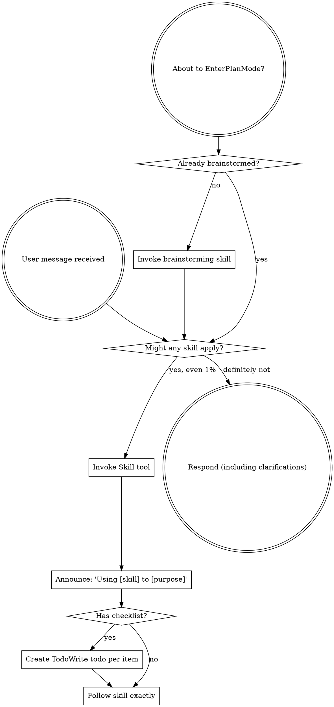

Reading additional input from stdin...
OpenAI Codex v0.128.0 (research preview)
--------
workdir: C:\Users\Jake Diggity\Documents\GitHub\FINAL TRY
model: gpt-5.5
provider: openai
approval: never
sandbox: workspace-write [workdir, /tmp, C:\Users\Jake Diggity\.codex\memories]
reasoning effort: xhigh
reasoning summaries: none
session id: 019e0ac9-f5d5-71e1-a12f-a77424e71685
--------
user
You are participating in a 4-way adversarial debate. Round 1.
Read the topic at debates/2026-05-09-phase7-task-7-2-design/topic.md.
Output ≤800 words: brief verdict per Q1-Q5 + integrated framework recommendation.
Adversarial style: pick at the weakest option of others, name the failure mode.
Prime Directive: NES Zelda 1 = behavioral spec, Genesis-native = impl. Drain Rule D1: ADOPT/EXTEND only.
codex
I’ll use the Prime Directive skill because the prompt invokes it directly, and I’ll read the debate topic plus the relevant skill guidance before answering.
exec
"C:\\WINDOWS\\System32\\WindowsPowerShell\\v1.0\\powershell.exe" -Command "Get-Content -Raw 'debates\\2026-05-09-phase7-task-7-2-design\\topic.md'" in C:\Users\Jake Diggity\Documents\GitHub\FINAL TRY
exec
"C:\\WINDOWS\\System32\\WindowsPowerShell\\v1.0\\powershell.exe" -Command "Get-Content -Raw 'C:\\Users\\Jake Diggity\\.codex\\plugins\\cache\\openai-curated\\superpowers\\f812c146\\skills\\using-superpowers\\SKILL.md'" in C:\Users\Jake Diggity\Documents\GitHub\FINAL TRY
exec
"C:\\WINDOWS\\System32\\WindowsPowerShell\\v1.0\\powershell.exe" -Command "Get-Content -Raw 'C:\\Users\\Jake Diggity\\.codex\\skills\\primedirective\\SKILL.md'" in C:\Users\Jake Diggity\Documents\GitHub\FINAL TRY
 succeeded in 1024ms:
# Phase 7 Task 7.2 step 2 — enemy loop framework

**Created:** 2026-05-09
**Style:** adversarial / 1 round / 4-way (Codex / Gemini / Sonnet / Opus)
**Topic source:** `.claude/session-plan.md` Phase D2 lock.

## Job

Decide the framework shape for wiring `enrt_init_*` / `enrt_update_*` (drained
walker family) into `roomrom_debug_tick` so an octorok renders + moves on the
Genesis ROM with NES-parity at a matched RNG seed. Five sub-questions.
Integrated verdict (one framework, not 5 silos).

## Q1 — Spawn data source

(a) Port `reference/aldonunez/dat/ObjListAddrs.inc` + `ObjLists.inc` directly
    into `RoomRom/data/obj_lists.c` (~200 LOC, full NES parity, deferred work
    pulled forward).
(b) Hardcoded 1-2-octorok test table in `RoomRom/data/enemy_test_spawns.c`
    (~40 LOC, fastest to first probe, throwaway).
(c) Extend existing `data/rooms/overworld.c` blob with enemy spawn arrays
    (uses existing data plumbing).

## Q2 — Iterator placement in `roomrom_debug_tick`

(a) Immediately after `level_chr_swap_tick`, before scroll state.
(b) After scroll-state finalize, before sprite draw.
(c) Inside scroll-stable branch only (no enemy ticks during transition —
    matches NES `IsSprite0CheckActive` at `Z_07.asm:496`).

## Q3 — Type dispatch shape

(a) Switch statement (compiler optimizes to jump table at -O2, easy extend).
(b) Function-pointer table indexed by `ENEMY_TYPE` (mirrors NES
    `InitObject_JumpTable` at `Z_07.asm:5601`, 70+ entries).
(c) Hybrid (switch on family — walker/flyer/jumper — table inside each).

## Q4 — First probe room

(a) Overworld $77 (Link spawn — easy reach, no enemies natively).
(b) L1 entrance with stalfos/goriya (UW, requires teleport debug).
(c) Overworld $7C (slow octorok column, simple walker, ~10 frames from spawn).

## Q5 — Substrate edit needed?

(a) None — RoomRom-only edits.
(b) Reserve enemy sprite-slot range in `roomrom_vram_map.h` (small adjacent edit).
(c) Add enemy-CHR bank dispatch hook (preempts PR-4b enemy_chr.c work).

## Context

- Task 7.1 framework landed (commit `83c00616`): `roomrom_enemy_state.h` +
  `roomrom_rng.{h,c}` + alias_table + parity_matrix.
- Task 7.2 step 1 landed (commit `b5026c1a`): walker-family drain (1340 LOC)
  linked into `Debug.md`.
- `roomrom_debug_tick` at `RoomRom/src/main.c:1231` — ZERO enemy logic exists.
- Drain Rule D1: ADOPT/EXTEND only. GREENFIELD banned.
- Sole build target `Debug.md`.
- CLAUDE.md priority: long-term outcome > coding practice > efficiency > NES.
- Risk: drain shims (`c_walker_move`, `z01_check_link_collision`,
  `z01_anim_set_sprite_desc_attrs`) may write Title-side OAM/SAT not
  RoomRom's SGDK-managed sprite list.

## Format expected

Brief verdict per sub-question (one or two sentences each) + integrated
framework recommendation (4-6 sentences). Adversarial: pick at the
weakest option of the others, name the failure mode. Under 800 words.

. : File C:\Users\Jake Diggity\Documents\WindowsPowerShell\Microsoft.PowerShell_profile.ps1 cannot be loaded because 
running scripts is disabled on this system. For more information, see about_Execution_Policies at 
https:/go.microsoft.com/fwlink/?LinkID=135170.
At line:1 char:3
+ . 'C:\Users\Jake Diggity\Documents\WindowsPowerShell\Microsoft.PowerS ...
+   ~~~~~~~~~~~~~~~~~~~~~~~~~~~~~~~~~~~~~~~~~~~~~~~~~~~~~~~~~~~~~~~~~~~
    + CategoryInfo          : SecurityError: (:) [], PSSecurityException
    + FullyQualifiedErrorId : UnauthorizedAccess

 succeeded in 1022ms:
---
name: using-superpowers
description: Use when starting any conversation - establishes how to find and use skills, requiring Skill tool invocation before ANY response including clarifying questions
---

<SUBAGENT-STOP>
If you were dispatched as a subagent to execute a specific task, skip this skill.
</SUBAGENT-STOP>

<EXTREMELY-IMPORTANT>
If you think there is even a 1% chance a skill might apply to what you are doing, you ABSOLUTELY MUST invoke the skill.

IF A SKILL APPLIES TO YOUR TASK, YOU DO NOT HAVE A CHOICE. YOU MUST USE IT.

This is not negotiable. This is not optional. You cannot rationalize your way out of this.
</EXTREMELY-IMPORTANT>

## Instruction Priority

Superpowers skills override default system prompt behavior, but **user instructions always take precedence**:

1. **User's explicit instructions** (CLAUDE.md, GEMINI.md, AGENTS.md, direct requests) — highest priority
2. **Superpowers skills** — override default system behavior where they conflict
3. **Default system prompt** — lowest priority

If CLAUDE.md, GEMINI.md, or AGENTS.md says "don't use TDD" and a skill says "always use TDD," follow the user's instructions. The user is in control.

## How to Access Skills

**In Claude Code:** Use the `Skill` tool. When you invoke a skill, its content is loaded and presented to you—follow it directly. Never use the Read tool on skill files.

**In Copilot CLI:** Use the `skill` tool. Skills are auto-discovered from installed plugins. The `skill` tool works the same as Claude Code's `Skill` tool.

**In Gemini CLI:** Skills activate via the `activate_skill` tool. Gemini loads skill metadata at session start and activates the full content on demand.

**In other environments:** Check your platform's documentation for how skills are loaded.

## Platform Adaptation

Skills use Claude Code tool names. Non-CC platforms: see `references/copilot-tools.md` (Copilot CLI), `references/codex-tools.md` (Codex) for tool equivalents. Gemini CLI users get the tool mapping loaded automatically via GEMINI.md.

# Using Skills

## The Rule

**Invoke relevant or requested skills BEFORE any response or action.** Even a 1% chance a skill might apply means that you should invoke the skill to check. If an invoked skill turns out to be wrong for the situation, you don't need to use it.



## Red Flags

These thoughts mean STOP—you're rationalizing:

| Thought | Reality |
|---------|---------|
| "This is just a simple question" | Questions are tasks. Check for skills. |
| "I need more context first" | Skill check comes BEFORE clarifying questions. |
| "Let me explore the codebase first" | Skills tell you HOW to explore. Check first. |
| "I can check git/files quickly" | Files lack conversation context. Check for skills. |
| "Let me gather information first" | Skills tell you HOW to gather information. |
| "This doesn't need a formal skill" | If a skill exists, use it. |
| "I remember this skill" | Skills evolve. Read current version. |
| "This doesn't count as a task" | Action = task. Check for skills. |
| "The skill is overkill" | Simple things become complex. Use it. |
| "I'll just do this one thing first" | Check BEFORE doing anything. |
| "This feels productive" | Undisciplined action wastes time. Skills prevent this. |
| "I know what that means" | Knowing the concept ≠ using the skill. Invoke it. |

## Skill Priority

When multiple skills could apply, use this order:

1. **Process skills first** (brainstorming, debugging) - these determine HOW to approach the task
2. **Implementation skills second** (frontend-design, mcp-builder) - these guide execution

"Let's build X" → brainstorming first, then implementation skills.
"Fix this bug" → debugging first, then domain-specific skills.

## Skill Types

**Rigid** (TDD, debugging): Follow exactly. Don't adapt away discipline.

**Flexible** (patterns): Adapt principles to context.

The skill itself tells you which.

## User Instructions

Instructions say WHAT, not HOW. "Add X" or "Fix Y" doesn't mean skip workflows.

. : File C:\Users\Jake Diggity\Documents\WindowsPowerShell\Microsoft.PowerShell_profile.ps1 cannot be loaded because 
running scripts is disabled on this system. For more information, see about_Execution_Policies at 
https:/go.microsoft.com/fwlink/?LinkID=135170.
At line:1 char:3
+ . 'C:\Users\Jake Diggity\Documents\WindowsPowerShell\Microsoft.PowerS ...
+   ~~~~~~~~~~~~~~~~~~~~~~~~~~~~~~~~~~~~~~~~~~~~~~~~~~~~~~~~~~~~~~~~~~~
    + CategoryInfo          : SecurityError: (:) [], PSSecurityException
    + FullyQualifiedErrorId : UnauthorizedAccess

 succeeded in 1023ms:
---
name: primedirective
description: |
  Sega Genesis Zelda 1 port Prime Directive enforcer and master-plan progress tracker.
  Use when about to edit project source under src/, RoomRom/, data/, build.bat,
  tools/builder/, when claiming phase progress, before running build.bat or closing a
  phase, or when the user says any of: phase close, what's blocking, next task,
  what phase, close phase, prime directive, pd, /primedirective, or $primedirective.
  Surfaces active phase and task, passed/pending close-gate steps, blockers,
  NES-ground-truth requirements, worktree safety, drain stance, and scope lock.
  Refuses to assert progress without a FRESH tracker.
---

# Prime Directive

Argument hint: `[status|refresh|gate|phase|task|why|--full|--brief]`

## Operating Contract

Run this sequence on every invocation.

1. Read the tracker:
   ```bash
   python tools/audit/primedirective/prime_status.py --brief
   ```
   Exit code 0 = FRESH. Exit code 1 = STALE. Exit code 2 = BLOCKED.

2. Refresh if STALE:
   ```bash
   python tools/audit/primedirective/prime_refresh.py
   python tools/audit/primedirective/prime_status.py --brief
   ```
   Never claim phase progress while STALE.

3. Emit the status surface. Use BRIEF for path-trigger. Use FULL for explicit keyword or phase-close requests.

4. Guard before high-risk edits or builds:
   ```bash
   python tools/gates/prime_guard.py --intent <edit|build|close-phase> --paths <p>
   ```
   Honor exit code 2 as BLOCK. Honor exit code 1 as WARN and proceed only with an explicit reason.

5. Cite tracker fields by name when claiming progress. Never paraphrase tracker claims.

6. Execute the next concrete action immediately. After emitting status, do not stop, ask, or present options. Identify `active.next_concrete_action`. If it is generic, derive the real next step from `phases[active].close_gate` first pending step combined with the master-plan "Current Next Action". Start that work in the same response: read relevant files, run probes, write code, and commit when done if the user requested commit behavior.

Stop only when:

- tracker is BLOCKED, exit 2, or `blockers[]` is non-empty
- a hard-rule refusal triggers: SGDK, WT, D1, whatif, or GREENFIELD-on-drain
- bug-detection branch fires
- the next action requires destructive shared-state operation: push, force-push, branch delete, external publish
- the user interrupts

Otherwise proceed without prompting. Pick the path with the best long-term outcome, coding practice, efficiency, and NES accuracy.

## Canonical Rule

NES Zelda 1 is the behavioral spec. Genesis-native is the implementation.

Match palette, layout, timing, RAM, sprite priority, scroll, and animation exactly unless explicitly told otherwise.

Decision priority:

1. Best long-term outcome
2. Best coding practice
3. Maximal efficiency
4. NES accuracy

When unclear, dump NES ROM ground truth before coding: CHR, OAM, nametable, PALRAM, RAM tables. Never guess layout, palette, timing, or animation cadence.

Do not ask multi-choice prompts. Do not ask "OK to proceed?". Pick and execute; the user will interrupt if needed.

## Hard Rules

### SGDK-1..5

- SGDK-1 Adapter boundary: code under `src/game/` and `src/frontend/` must not include `<genesis.h>` or write VDP registers directly. Route through `src/sgdk_adapter/`.
- SGDK-2 Version pin: `tools/sgdk_pin.json`. `build.bat` hard-fails on drift.
- SGDK-3 Hand-rolled VDP requires profiled hot path, at least 15% measured improvement, citation of replaced SGDK call, and an entry in `docs/handrolled_vdp.md`.
- SGDK-4 Audio migration trigger requires ADR plus 2-of-4 firing per `docs/audio_migration_trigger.md`.
- SGDK-5 Fork policy: project owner only; CVE, parity-blocker, reproducibility-break, or build-breaker only; under 200 LOC patch; lives at `vendor/sgdk-fork/`.

### WT-1..4

- WT-1 Substrate single-writer: `src/sgdk_adapter/`, `src/abi/`, `src/state/`, `data/`, and `src/audio_driver.asm` are edited from main worktree only. RoomRom worktrees rebase on main.
- WT-2 Active scope pointer: consult `docs/audit/active_scope.md` before any edit.
- WT-3 Frontend boundary: `src/game/` and `RoomRom/src/` must not include `src/frontend/` headers. Phase 12 promotion gate hard-fails.
- WT-4 No whatif emission: `build.bat` must emit only `Title.*`. `tools/gates/check_no_whatif.py` enforces.

### D1 Drain-First, NES-Disasm-Second

- Drained C in `src/game/<subsystem>/*_runtime.c` is primary implementation evidence.
- NES disasm in `reference/aldonunez/*.asm` and `src/zelda_translated/*.asm` is secondary and final authority; it wins ties.
- Every task touching a drained subsystem requires this header:
  ```markdown
  - **NES source**: <file>:<symbol>
  - **Drained C**:  <path>:<symbol> | NONE
  - **Coverage**:   FULL | PARTIAL(<missing>) | STALE(<changed>) | NONE
  - **Stance**:     ADOPT | EXTEND | REPLACE | GREENFIELD
  ```
- `Stance: GREENFIELD` is illegal when `tools/audit/drain_coverage.json` shows a candidate row.
- Three-gate verification: per-function diff every commit, per-RAM-cell trace at phase exit, per-scenario oracle at milestone tag.

## Status Surface

BRIEF, auto on path-trigger, max 72 chars:

```text
[PD] Ph{N} . task {T} . WT {worktree} . {p}/{t} gates . {n} blocking
```

Suffixes: `<- CHECK` if blocking > 0; `<- STALE` if freshness fails; `<- OUT-OF-PHASE` if active out-of-phase task.

FULL, explicit keyword or phase-close, max 25 lines:

Read `docs/superpowers/prime_directive_status.md`, rendered from tracker by `prime_refresh.py`.

## Auto-Activation Triggers

| Source | Tier |
|---|---|
| `/primedirective` or `$primedirective` | FULL |
| `/primedirective --brief` or `$primedirective --brief` | BRIEF |
| Keyword: phase close, what's blocking, next task, what phase, close phase, prime directive, pd | FULL |
| First tool call in session matching `src/**`, `RoomRom/**`, `data/**`, `tools/builder/**`, `build.bat`, `Title.md`, `RoomRom.md`, `Final.md`, `docs/superpowers/plans/**` | BRIEF |
| Conversation start | none unless first user message matches phase-relevant context |

## Refusals

- Refuse to claim a phase complete or task done without a FRESH tracker. Cite tracker fields by name.
- Refuse to edit substrate paths from a non-main worktree.
- Refuse to generate `whatif.*` output anywhere.
- Refuse `Stance: GREENFIELD` when drain coverage shows a candidate row.
- Refuse to skip steps in the 11-step phase-close gate.
- Refuse to read the entire 2171-line master plan inline. Load only the active phase section plus `references/phase-ladder.md` summary.

## Phase Close Gate

See `references/phase-close-gate.md` for the ordered 11-step checklist. Refuse to commit a phase-close until all 11 steps have artifacts in `phases[i].evidence[]`.

## Out-of-Phase Edits

When work in the active phase requires editing closed-phase code:

1. Emit BRIEF: `[PD] OUT-OF-PHASE Ph{target} <- Ph{active} . stance {S}`.
2. Stance must be `PARTIAL` or `REPLACE`. `GREENFIELD` and `ADOPT` are prohibited for closed-phase edits.
3. Run `python tools/run_regression_matrix.py` after the edit. This is mandatory before the next FRESH status.
4. Append entry to `out_of_phase_tasks[]` via `prime_refresh.py --record-out-of-phase`.

## Bug Detection Branch

When this skill detects a bug, do not attempt a direct fix. Bug symptoms include failing probe in tracker `phases[i].evidence[]`, `blockers[]` entry of kind `freshness|phase_close|drain_stance`, regression matrix red, parity oracle diff non-zero, build error, or user-reported broken behavior.

Required sequence:

1. Invoke `chuckle` and run the 4-step debugging protocol: Real Problem, Research, Structural Fix, Verification.
2. Invoke `octo:debate` if available with the proposed fix as the topic. If unavailable, state that the required reviewer is unavailable and treat that as blocked when the bug touches substrate, `src/game/`, parity oracle, or phase-close gate.
3. Apply the synthesized fix. Run phase-close gate steps 1-10 against the fix.
4. Record the bug and fix as a `deferrals[]` or `out_of_phase_tasks[]` entry via `prime_refresh.py`.

The pairing of `chuckle` and `octo:debate` is mandatory for bugs touching substrate, `src/game/`, parity oracle, or phase-close gate. Quick-patch shortcut is forbidden.

## Progressive References

Load only when the question demands depth:

- `references/prime-directive.md`: full canonical text.
- `references/phase-ladder.md`: phases 0..17 with one-line summaries and plan offsets.
- `references/hard-rules.md`: SGDK-1..5, WT-1..4, D1 with rationales.
- `references/phase-close-gate.md`: 11-step ordered checklist and artifact contracts.
- `references/targets.md`: `Title.md`, `RoomRom.md`, `Final.md`, `tools/builder/` scope.

## Skill And Tools Split

- Skill in Codex: behavioral contract. It tells the agent what to invoke, refuse, and cite.
- Project tools in `tools/audit/primedirective/` and `tools/gates/`: enforcement code callable from CI, pre-commit hooks, `build.bat`, and regression matrix.

The skill never writes the tracker. Only `prime_refresh.py` writes. Parallel sessions may read; only one refresh job writes at a time.

. : File C:\Users\Jake Diggity\Documents\WindowsPowerShell\Microsoft.PowerShell_profile.ps1 cannot be loaded because 
running scripts is disabled on this system. For more information, see about_Execution_Policies at 
https:/go.microsoft.com/fwlink/?LinkID=135170.
At line:1 char:3
+ . 'C:\Users\Jake Diggity\Documents\WindowsPowerShell\Microsoft.PowerS ...
+   ~~~~~~~~~~~~~~~~~~~~~~~~~~~~~~~~~~~~~~~~~~~~~~~~~~~~~~~~~~~~~~~~~~~
    + CategoryInfo          : SecurityError: (:) [], PSSecurityException
    + FullyQualifiedErrorId : UnauthorizedAccess

codex
The topic is a design verdict, not an edit, so I’m treating the tracker check as a guardrail and then answering the framework choice directly.
exec
"C:\\WINDOWS\\System32\\WindowsPowerShell\\v1.0\\powershell.exe" -Command 'python tools/audit/primedirective/prime_status.py --brief' in C:\Users\Jake Diggity\Documents\GitHub\FINAL TRY
2026-05-09T03:31:24.436218Z ERROR codex_core::tools::router: error=Exit code: 1
Wall time: 0.7 seconds
Output:
. : File C:\Users\Jake Diggity\Documents\WindowsPowerShell\Microsoft.PowerShell_profile.ps1 cannot be loaded because 
running scripts is disabled on this system. For more information, see about_Execution_Policies at 
https:/go.microsoft.com/fwlink/?LinkID=135170.
At line:1 char:3
+ . 'C:\Users\Jake Diggity\Documents\WindowsPowerShell\Microsoft.PowerS ...
+   ~~~~~~~~~~~~~~~~~~~~~~~~~~~~~~~~~~~~~~~~~~~~~~~~~~~~~~~~~~~~~~~~~~~
    + CategoryInfo          : SecurityError: (:) [], PSSecurityException
    + FullyQualifiedErrorId : UnauthorizedAccess
python : The term 'python' is not recognized as the name of a cmdlet, function, script file, or operable program. 
Check the spelling of the name, or if a path was included, verify that the path is correct and try again.
At line:2 char:1
+ python tools/audit/primedirective/prime_status.py --brief
+ ~~~~~~
    + CategoryInfo          : ObjectNotFound: (python:String) [], CommandNotFoundException
    + FullyQualifiedErrorId : CommandNotFoundException
 

 exited 1 in 664ms:
. : File C:\Users\Jake Diggity\Documents\WindowsPowerShell\Microsoft.PowerShell_profile.ps1 cannot be loaded because 
running scripts is disabled on this system. For more information, see about_Execution_Policies at 
https:/go.microsoft.com/fwlink/?LinkID=135170.
At line:1 char:3
+ . 'C:\Users\Jake Diggity\Documents\WindowsPowerShell\Microsoft.PowerS ...
+   ~~~~~~~~~~~~~~~~~~~~~~~~~~~~~~~~~~~~~~~~~~~~~~~~~~~~~~~~~~~~~~~~~~~
    + CategoryInfo          : SecurityError: (:) [], PSSecurityException
    + FullyQualifiedErrorId : UnauthorizedAccess
python : The term 'python' is not recognized as the name of a cmdlet, function, script file, or operable program. 
Check the spelling of the name, or if a path was included, verify that the path is correct and try again.
At line:2 char:1
+ python tools/audit/primedirective/prime_status.py --brief
+ ~~~~~~
    + CategoryInfo          : ObjectNotFound: (python:String) [], CommandNotFoundException
    + FullyQualifiedErrorId : CommandNotFoundException
 

codex
The tracker command could not run through `python` because this Windows shell has no `python` executable on PATH. I’m checking the launcher before deciding whether the tracker is actually stale or just blocked by the environment.
exec
"C:\\WINDOWS\\System32\\WindowsPowerShell\\v1.0\\powershell.exe" -Command 'Get-Command py -ErrorAction SilentlyContinue | Select-Object -ExpandProperty Source' in C:\Users\Jake Diggity\Documents\GitHub\FINAL TRY
exec
"C:\\WINDOWS\\System32\\WindowsPowerShell\\v1.0\\powershell.exe" -Command 'Get-Command python -ErrorAction SilentlyContinue | Select-Object -ExpandProperty Source' in C:\Users\Jake Diggity\Documents\GitHub\FINAL TRY
exec
"C:\\WINDOWS\\System32\\WindowsPowerShell\\v1.0\\powershell.exe" -Command 'Get-Command python3 -ErrorAction SilentlyContinue | Select-Object -ExpandProperty Source' in C:\Users\Jake Diggity\Documents\GitHub\FINAL TRY
2026-05-09T03:31:29.854956Z ERROR codex_core::tools::router: error=Exit code: 1
Wall time: 0.8 seconds
Output:
. : File C:\Users\Jake Diggity\Documents\WindowsPowerShell\Microsoft.PowerShell_profile.ps1 cannot be loaded because 
running scripts is disabled on this system. For more information, see about_Execution_Policies at 
https:/go.microsoft.com/fwlink/?LinkID=135170.
At line:1 char:3
+ . 'C:\Users\Jake Diggity\Documents\WindowsPowerShell\Microsoft.PowerS ...
+   ~~~~~~~~~~~~~~~~~~~~~~~~~~~~~~~~~~~~~~~~~~~~~~~~~~~~~~~~~~~~~~~~~~~
    + CategoryInfo          : SecurityError: (:) [], PSSecurityException
    + FullyQualifiedErrorId : UnauthorizedAccess

 exited 1 in 823ms:
. : File C:\Users\Jake Diggity\Documents\WindowsPowerShell\Microsoft.PowerShell_profile.ps1 cannot be loaded because 
running scripts is disabled on this system. For more information, see about_Execution_Policies at 
https:/go.microsoft.com/fwlink/?LinkID=135170.
At line:1 char:3
+ . 'C:\Users\Jake Diggity\Documents\WindowsPowerShell\Microsoft.PowerS ...
+   ~~~~~~~~~~~~~~~~~~~~~~~~~~~~~~~~~~~~~~~~~~~~~~~~~~~~~~~~~~~~~~~~~~~
    + CategoryInfo          : SecurityError: (:) [], PSSecurityException
    + FullyQualifiedErrorId : UnauthorizedAccess

2026-05-09T03:31:29.876771Z ERROR codex_core::tools::router: error=Exit code: 1
Wall time: 0.8 seconds
Output:
. : File C:\Users\Jake Diggity\Documents\WindowsPowerShell\Microsoft.PowerShell_profile.ps1 cannot be loaded because 
running scripts is disabled on this system. For more information, see about_Execution_Policies at 
https:/go.microsoft.com/fwlink/?LinkID=135170.
At line:1 char:3
+ . 'C:\Users\Jake Diggity\Documents\WindowsPowerShell\Microsoft.PowerS ...
+   ~~~~~~~~~~~~~~~~~~~~~~~~~~~~~~~~~~~~~~~~~~~~~~~~~~~~~~~~~~~~~~~~~~~
    + CategoryInfo          : SecurityError: (:) [], PSSecurityException
    + FullyQualifiedErrorId : UnauthorizedAccess

 exited 1 in 812ms:
. : File C:\Users\Jake Diggity\Documents\WindowsPowerShell\Microsoft.PowerShell_profile.ps1 cannot be loaded because 
running scripts is disabled on this system. For more information, see about_Execution_Policies at 
https:/go.microsoft.com/fwlink/?LinkID=135170.
At line:1 char:3
+ . 'C:\Users\Jake Diggity\Documents\WindowsPowerShell\Microsoft.PowerS ...
+   ~~~~~~~~~~~~~~~~~~~~~~~~~~~~~~~~~~~~~~~~~~~~~~~~~~~~~~~~~~~~~~~~~~~
    + CategoryInfo          : SecurityError: (:) [], PSSecurityException
    + FullyQualifiedErrorId : UnauthorizedAccess

 exited 1 in 822ms:
. : File C:\Users\Jake Diggity\Documents\WindowsPowerShell\Microsoft.PowerShell_profile.ps1 cannot be loaded because 
running scripts is disabled on this system. For more information, see about_Execution_Policies at 
https:/go.microsoft.com/fwlink/?LinkID=135170.
At line:1 char:3
+ . 'C:\Users\Jake Diggity\Documents\WindowsPowerShell\Microsoft.PowerS ...
+   ~~~~~~~~~~~~~~~~~~~~~~~~~~~~~~~~~~~~~~~~~~~~~~~~~~~~~~~~~~~~~~~~~~~
    + CategoryInfo          : SecurityError: (:) [], PSSecurityException
    + FullyQualifiedErrorId : UnauthorizedAccess

2026-05-09T03:31:29.886732Z ERROR codex_core::tools::router: error=Exit code: 1
Wall time: 0.8 seconds
Output:
. : File C:\Users\Jake Diggity\Documents\WindowsPowerShell\Microsoft.PowerShell_profile.ps1 cannot be loaded because 
running scripts is disabled on this system. For more information, see about_Execution_Policies at 
https:/go.microsoft.com/fwlink/?LinkID=135170.
At line:1 char:3
+ . 'C:\Users\Jake Diggity\Documents\WindowsPowerShell\Microsoft.PowerS ...
+   ~~~~~~~~~~~~~~~~~~~~~~~~~~~~~~~~~~~~~~~~~~~~~~~~~~~~~~~~~~~~~~~~~~~
    + CategoryInfo          : SecurityError: (:) [], PSSecurityException
    + FullyQualifiedErrorId : UnauthorizedAccess

codex
I’m going to inspect the tick function and nearby RoomRom data shape, because the weakest options here hinge on where state already exists versus where they would invent parallel state.
exec
"C:\\WINDOWS\\System32\\WindowsPowerShell\\v1.0\\powershell.exe" -Command '$p='"'RoomRom\\src\\main.c'; "'$lines=Get-Content $p; $start=1180; $end=1285; for($i=$start;$i -le $end;$i++){ if($i -le $lines.Count){ '"'{0,5}: {1}' -f "'$i,$lines[$i-1] }}' in C:\Users\Jake Diggity\Documents\GitHub\FINAL TRY
exec
"C:\\WINDOWS\\System32\\WindowsPowerShell\\v1.0\\powershell.exe" -Command 'rg --files RoomRom data | rg "(overworld|enemy|roomrom_vram_map|enemy_state|rng|alias_table|parity_matrix)"' in C:\Users\Jake Diggity\Documents\GitHub\FINAL TRY
exec
"C:\\WINDOWS\\System32\\WindowsPowerShell\\v1.0\\powershell.exe" -Command "Get-Content -Raw 'RoomRom\\src\\roomrom_vram_map.h'" in C:\Users\Jake Diggity\Documents\GitHub\FINAL TRY
exec
"C:\\WINDOWS\\System32\\WindowsPowerShell\\v1.0\\powershell.exe" -Command "Get-Content -Raw 'RoomRom\\src\\roomrom_enemy_state.h'" in C:\Users\Jake Diggity\Documents\GitHub\FINAL TRY
 succeeded in 836ms:
#ifndef ROOMROM_ENEMY_STATE_H
#define ROOMROM_ENEMY_STATE_H

/* Phase 7 Task 7.1 framework. Re-export of src/state/enemy_state.h enemy
 * slice for RoomRom-rooted family agents (7.2-7.7). Aliasing IS the spec
 * per reference/aldonunez/ObjVars.inc — same NES scratch byte means
 * different things per enemy family. Documented alias clusters live in
 * docs/audit/enemy_alias_table.md.
 *
 * Debate 2026-05-09 verdict Q1=(c): flat byte-slot + accessor macros.
 *   Codex / Gemini / Sonnet / Opus 4-of-4 unanimous. See
 *   debates/2026-05-09-phase7-task-7-1-framework/synthesis.md.
 *
 * Drain Rule D1 stance: EXTEND. Primary evidence is drained
 * src/state/enemy_state.h (134 OBJ(0x0412) collisions) — re-exported
 * here so RoomRom family code never depends on substrate paths
 * directly. NES asm wins ties.
 */

#include "platform_abi.h"
#include "../../src/state/enemy_state.h"

/* Compile-time collision proofs. NES Random[13] lives at $0018..$0024.
 * Object scratch bytes live at $0380..$04FF. Verify scratch_state /
 * enemy_state header math hasn't drifted. */
_Static_assert(sizeof(unsigned char) == 1,
               "enemy_state.h byte-slot model assumes 8-bit char");

/* Alias-cluster invariants (NES scratch overlay, intentional):
 *   $0412 = ENEMY_PUSH_TIMER
 *         | ENEMY_FLYER_SPEED_FRAC
 *         | ENEMY_JUMPER_VSPEED_HI
 *         | ENEMY_GOHMA_DIST_TRAVELED
 *   $041F = ENEMY_AIR_SPEED
 *         | ENEMY_JUMPER_VSPEED_LO
 *         | ENEMY_GOHMA_MOVE_ACCUM
 *   $0444 = ENEMY_AI_STATE
 *         | ENEMY_JUMPER_TARGET_Y
 *         | ENEMY_GOHMA_OPEN_EYE_TIMER
 *   $0451 = ENEMY_JUMPER_REVERSALS
 *         | ENEMY_MANHANDLA_FRAME_ACCUM
 *         | ENEMY_GOHMA_GO_STRAIGHT
 *   $0478 = ENEMY_BOUNCE_FLAGS
 *         | ENEMY_FLYER_Y_FINE
 *         | ENEMY_MANHANDLA_FRAME_ATTR
 *         | ENEMY_GOHMA_CLOSED_EYE_CNTR
 * Family agents MUST grep this table before claiming a byte. */

#endif

. : File C:\Users\Jake Diggity\Documents\WindowsPowerShell\Microsoft.PowerShell_profile.ps1 cannot be loaded because 
running scripts is disabled on this system. For more information, see about_Execution_Policies at 
https:/go.microsoft.com/fwlink/?LinkID=135170.
At line:1 char:3
+ . 'C:\Users\Jake Diggity\Documents\WindowsPowerShell\Microsoft.PowerS ...
+   ~~~~~~~~~~~~~~~~~~~~~~~~~~~~~~~~~~~~~~~~~~~~~~~~~~~~~~~~~~~~~~~~~~~
    + CategoryInfo          : SecurityError: (:) [], PSSecurityException
    + FullyQualifiedErrorId : UnauthorizedAccess

 succeeded in 878ms:
 1180:     }
 1181:     /* P5: scene-load coordinator handles variant selection + sprite CHR
 1182:      * upload.  combat redux is not a CHR-load concern, kept separate. */
 1183:     roomrom_scene_load(
 1184:         (s_scene == SCENE_UW) ? ROOMROM_SCENE_UW_L1 : ROOMROM_SCENE_OVERWORLD,
 1185:         current_redux_flag());
 1186:     roomrom_combat_set_redux(current_redux_flag());
 1187:     load_room(s_room_id);                  /* loads BG pal + sprite PAL1 */
 1188:     roomrom_sprites_spawn_link(players[0].x, players[0].y);
 1189:     roomrom_combat_init();                 /* S7: clear sword sprite slot */
 1190:     roomrom_combat_set_uw(s_scene == SCENE_UW);  /* sword Y bias for UW */
 1191:     roomrom_boomerang_init();              /* S7 v6: clear boomerang slot */
 1192:     roomrom_arrow_init();                  /* S7 v7: clear arrow slot */
 1193:     roomrom_bomb_init();                   /* S7 v8: clear bomb + explosion slots */
 1194:     roomrom_link_damage_init();            /* Task 6.11.1: clear invincibility timer */
 1195:     roomrom_world_transition_init();       /* Task 5.4: warp coordinator */
 1196:     roomrom_pushblock_init();              /* Task 5.7: push-block state machine */
 1197:     roomrom_candle_fire_init();            /* Task 5.8.1: candle fire slot 8 */
 1198:     roomrom_magic_shot_init();             /* magic rod shot slot 9 */
 1199:     roomrom_probe_metadata_run();          /* Task 5.4 Gate D: in-ROM probe */
 1200: 
 1201:     /* debate 006 D2 native cave smoke: prove cave_init / cave_tick /
 1202:      * cave_exit link cleanly into RoomRom + execute without crash.
 1203:      * No visible effect yet (cave_tick is a stub); future commits add
 1204:      * SCENE_CAVE dispatch + render. cave_id 0x6A = first valid cave
 1205:      * room type per NES Z_01.asm:80. */
 1206:     cave_init((cave_id_t)0x6A);
 1207:     cave_tick();
 1208:     cave_exit();
 1209: }
 1210: 
 1211: unsigned char roomrom_debug_get_scene(void)
 1212: {
 1213:     return (unsigned char)s_scene;
 1214: }
 1215: 
 1216: unsigned char roomrom_debug_get_room_id(void)
 1217: {
 1218:     return s_room_id;
 1219: }
 1220: 
 1221: short roomrom_debug_get_link_x(void)
 1222: {
 1223:     return players[0].x;
 1224: }
 1225: 
 1226: short roomrom_debug_get_link_y(void)
 1227: {
 1228:     return players[0].y;
 1229: }
 1230: 
 1231: void roomrom_debug_tick(void)
 1232: {
 1233:         SYS_doVBlankProcess();
 1234:         s_frame_counter++;
 1235:         roomrom_palette_tick_frame(s_frame_counter);
 1236:         /* PR-4a: advance scene-bank DMA state machine. Runs after
 1237:          * SYS_doVBlankProcess so the SGDK DMA queue is drained before
 1238:          * we issue our own ops. PR-5: boss state machine ticks in
 1239:          * parallel; the two share SCENE_OBJ slot but are naturally
 1240:          * serialized by request ordering (boss requested only on
 1241:          * boss-room entry, after enemy DMA has reached READY). */
 1242:         /* PR-5 probe trigger: probe pokes a scene_id (1 byte) into
 1243:          * $FF73FE; we enqueue a boss request and clear the cell. The
 1244:          * matching ack byte at $FF73FF tracks how many requests we have
 1245:          * fired (probe can read it to know the request landed). Used
 1246:          * solely by tools/debug/probe_boss_bank_dispatch.lua. */
 1247:         {
 1248:             volatile unsigned char *trig = (volatile unsigned char *)0x00FF73FEUL;
 1249:             volatile unsigned char *ack  = (volatile unsigned char *)0x00FF73FFUL;
 1250:             unsigned char req = *trig;
 1251:             if (req != 0u) {
 1252:                 level_chr_boss_request((roomrom_scene_id_t)req);
 1253:                 *trig = 0u;
 1254:                 *ack = (unsigned char)(*ack + 1u);
 1255:             }
 1256:         }
 1257:         level_chr_swap_tick();
 1258:         level_chr_boss_tick();
 1259:         if (s_scene == SCENE_UW) uw_door_state_tick();
 1260: 
 1261:         /* S6.6 transition state machine. */
 1262:         if (s_scroll_state != SCROLL_NONE) {
 1263:             int num = (int)(s_scroll_frame + 1u);
 1264:             int den = (int)s_scroll_total_frames;
 1265:             short h_scroll;
 1266:             short v_scroll;
 1267:             s_joy_prev = 0u;     /* swallow input across transition */
 1268: 
 1269:             h_scroll = (short)(s_scroll_start_x +
 1270:                 (((int)s_scroll_target_x - (int)s_scroll_start_x) * num) / den);
 1271:             v_scroll = (short)(s_scroll_start_y +
 1272:                 (((int)s_scroll_target_y - (int)s_scroll_start_y) * num) / den);
 1273:             set_bg_scroll(h_scroll, v_scroll);
 1274:             /* PR-2b: BG_B follows BG_A's V scroll with a fixed offset
 1275:              * (-176 for V_DOWN, +176 for V_UP) so its incoming room
 1276:              * starts off-screen and slides in as BG_A scrolls out. */
 1277:             if (s_scroll_state == SCROLL_V_DOWN ||
 1278:                 s_scroll_state == SCROLL_V_UP) {
 1279:                 VDP_setVerticalScroll(BG_B,
 1280:                     (short)(v_scroll + s_scroll_v_offset));
 1281:                 VDP_setHorizontalScroll(BG_B, h_scroll);
 1282:             }
 1283: 
 1284:             /* NES Z1 UW: Link is drawn behind door tiles during the
 1285:              * scroll (Z_07.asm ShowLinkSpritesBehindHorizontalDoors).
. : File C:\Users\Jake Diggity\Documents\WindowsPowerShell\Microsoft.PowerShell_profile.ps1 cannot be loaded because 
running scripts is disabled on this system. For more information, see about_Execution_Policies at 
https:/go.microsoft.com/fwlink/?LinkID=135170.
At line:1 char:3
+ . 'C:\Users\Jake Diggity\Documents\WindowsPowerShell\Microsoft.PowerS ...
+   ~~~~~~~~~~~~~~~~~~~~~~~~~~~~~~~~~~~~~~~~~~~~~~~~~~~~~~~~~~~~~~~~~~~
    + CategoryInfo          : SecurityError: (:) [], PSSecurityException
    + FullyQualifiedErrorId : UnauthorizedAccess

 succeeded in 888ms:
#ifndef ROOMROM_VRAM_MAP_H
#define ROOMROM_VRAM_MAP_H

#include "atlas/items_chr_x4.h"

/* RoomRom VRAM tile map -- single source of truth.
 *
 * Concrete numeric values committed after running
 * RoomRom/tools/audit_vram_tile_usage.py on the Phase 1 baseline trees.
 *
 * Pre-Phase-3 (current): only sub-pal 0 is populated; existing CHR
 * uploads land at the legacy hard-coded bases (HUD_TILE_BASE = 1,
 * SPRITE_VRAM_TILE_BASE = 512, COMMON_VRAM_TILE_BASE = 936). This header
 * defines the *target* post-expansion layout; Phase 3 relocates the
 * upload addresses + emits the 4 sub-pal tile copies to fill the bank.
 *
 * Layout (post-Phase-3, post-ITEM-bank, per `audit_vram_tile_usage.py`):
 *   tile 0                                  blank (transparent fallback)
 *   tile 1   .. 1 + 4*256 - 1 = 1024        BG bank (NES BG + HUD tiles,
 *                                            4 sub-pal copies x 256 tiles)
 *   tile 1025 .. 1025 + 312 - 1 = 1336      SPR bank (Link, sword body,
 *                                            common_chr sprite half --
 *                                            intentionally 1x: every
 *                                            sprite in this bank only
 *                                            uses NES sprite sub-pal 0)
 *   tile 1337 .. 1337 + 4*49 - 1 = 1532     ITEM bank (item atlas:
 *                                            sword, beam, boomerang,
 *                                            arrow, bomb, explosion,
 *                                            sword_diag -- 4 sub-pal
 *                                            copies x 49 tiles, NES
 *                                            DrawCloud/etc cite sub-pal
 *                                            1+ per tile)
 *   tile 1533 .. 1535                       reserved / future (3 tiles)
 *   tile 1536+                              VDP plane / window / SAT / HScroll
 *                                            tables (post-PR-2b 64x32 layout
 *                                            allocates $C000+ for tables;
 *                                            1536 = $C000 / 32).
 *
 * VRAM table addresses (PR-2b 64x32 mode, BGA/BGB overrides applied):
 *   plane A  = $C000  (tiles 1536..1663, 4 KB)
 *   window   = $D000  (tiles 1664..1791, 4 KB)
 *   plane B  = $E000  (tiles 1792..1919, 4 KB) -- V scroll staging
 *   hscroll  = $F000  (tiles 1920..1951, 1 KB)
 *   SAT      = $F400  (tiles 1952..1971, 640 B)
 *   free     = $F800-$FFFF                  (2 KB unused, future use)
 *
 * Tile bank ends at 1460 -- 75 tiles of headroom before the table region.
 * (+192 tiles vs pre-PR-2 64x64 mode which capped at $A800 = 1344 tiles.)
 * Audit command:  python RoomRom/tools/audit_vram_tile_usage.py
 *
 * Notes:
 * - SPR sub-pal stride = 312 covers common_chr full (238) + Link walk (32)
 *   + Link attack (16) + item atlas (26). sprites_chr (232 OW enemies) is
 *   NOT in the bank -- enemies are out-of-scope per RoomRom roadmap; they
 *   re-enter the bank when ported.
 * - SPR is intentionally 1x (sub-pal 0 only). The full SPR bank at 4x
 *   would be 549*4=2196 tiles and collide with the VDP table region at
 *   tile 1536. Items -- the only sprite category with non-trivial NES
 *   sub-pal variation -- live in the dedicated ITEM bank below with
 *   their own 4x sub-pal expansion.
 * - HUD shares the BG bank: HUD tiles ARE NES BG tiles, same expansion
 *   rule, same sub-pal stride.
 */

/* tile 0 is always blank (transparent fallback for any plane). */
#define ROOMROM_BLANK_TILE              0u

/* Per-sub-pal stride is 256 because NES BG addresses tiles by 8-bit NES
 * tile ID. OW renderer uploads common BG (112) + OW BG (130) + common
 * misc (14) = 256 distinct NES tile slots; redux automap (32) and secrets
 * (12) get patched into existing slots, not appended. HUD custom tiles
 * (3) likewise live at NES IDs $50..$52 (shared bank). */
#define ROOMROM_BG_TILE_BASE            1u
#define ROOMROM_BG_TILE_COUNT_PER_PAL   256u
#define ROOMROM_BG_SUBPAL_COUNT         4u
#define ROOMROM_SPR_TILE_BASE           1025u   /* 1 + 4*256 */
#define ROOMROM_SPR_TILE_COUNT_PER_PAL  287u    /* common(238)+walk(32)+attack(16)=286 used, 1 slack. Reduced from 312 (-25 tiles) to make ITEM bank fit at 56 tiles/sub-pal x4 = 224 tiles after 8x16 mode parity work (bomb +1 tile, explosion +6 tiles for 16x16 mirrored). ITEM end now exactly $C000 (tile 1536). Future Link/SPR expansion needs VDP table relocation. */
#define ROOMROM_SPR_SUBPAL_COUNT        1u      /* intentionally 1x: items use the dedicated ITEM bank below for sub-pal 1+ variation; SPR-bank sprites (Link, sword body, common) only ever use NES sprite sub-pal 0 */

#define ROOMROM_BG_TILE_BASE_PAL(s)  \
    (ROOMROM_BG_TILE_BASE  + (unsigned short)(s) * ROOMROM_BG_TILE_COUNT_PER_PAL)
#define ROOMROM_SPR_TILE_BASE_PAL(s) \
    (ROOMROM_SPR_TILE_BASE + (unsigned short)(s) * ROOMROM_SPR_TILE_COUNT_PER_PAL)
/* HUD tiles live in the BG bank (same NES BG content, same sub-pal stride). */
#define ROOMROM_HUD_TILE_BASE_PAL(s) \
    ROOMROM_BG_TILE_BASE_PAL(s)

/* Item atlas sub-bank: per-category 4x sub-pal expansion. NES Z1 draws
 * bomb / explosion with sprite sub-pal 1; future sword-level upgrades
 * use sub-pal 1 / 2 (Items inventory). Other persistent sprites
 * (Link, sword, beam, common) only ever use sub-pal 0 -- they stay in
 * the 1x SPR bank above.
 *
 * VRAM math: ITEM bank starts immediately after the SPR bank end and
 * holds 4 copies of the item atlas (sub-pal 0..3), each ITEM_TILE_COUNT
 * tiles wide. Total = 4 * ITEM_TILE_COUNT.
 *
 * ITEM_TILE_COUNT_PER_PAL is sourced from the generated header
 * atlas/items_chr_x4.h (ROOMROM_ATLAS_ITEMS_X4_TILE_COUNT). The verifier
 * tools/verify_vram_budget.py confirms ITEM bank does not overlap
 * with VDP table region or any other VRAM consumer. */
#define ROOMROM_ITEM_TILE_BASE          (ROOMROM_SPR_TILE_BASE + ROOMROM_SPR_TILE_COUNT_PER_PAL)
#define ROOMROM_ITEM_TILE_COUNT_PER_PAL ROOMROM_ATLAS_ITEMS_X4_TILE_COUNT
/* Sub-pal expansion factor. Was 4; reduced to 3 (drop unused sub-pal 3) on
 * 2026-05-08 to fund candle_fire/magic_shot/triforce 8x16 mode fixes. NES
 * Z1 sprite usage audit confirmed: items consume sub-pal 0 (Link), 1 (bomb/
 * explosion), 2 (candle frame 2). None use sub-pal 3 in current scope. */
#define ROOMROM_ITEM_SUBPAL_COUNT       3u
#define ROOMROM_ITEM_TILE_BASE_PAL(s) \
    (ROOMROM_ITEM_TILE_BASE + (unsigned short)(s) * ROOMROM_ITEM_TILE_COUNT_PER_PAL)

/* PR-5 CHR-BOSSES: per-level boss CHR. NES Z1 mirrors this exactly --
 * z_03.asm:91 FetchPatternBlockUWBoss writes the boss bank into PPU
 * $0C00, which is the same 4 KB sprite half as the per-level enemy bank
 * at $09E0; on Genesis we reuse the SCENE_OBJ slot at
 * (SPR_TILE_BASE + 44u) because boss rooms have no enemies (NES parity).
 * Boss banks are 64 NES tiles, 1x sub-pal -- well under the 136-tile
 * SCENE_OBJ slot capacity. Three banks dispatched by CurLevel per
 * z_03.asm:24-34 BossPatternBlockSrcAddrs:
 *   UWSPBoss1257 -> L1, L2, L5, L7   (Aquamentus / Dodongo)
 *   UWSPBoss3468 -> L3, L4, L6, L8   (Manhandla / Gleeok / Digdogger / Gohma-style)
 *   UWSPBoss9    -> L9               (Ganon)
 */
#define ROOMROM_BOSS_TILE_BASE          (ROOMROM_SPR_TILE_BASE + 44u)
#define ROOMROM_BOSS_TILE_COUNT         64u
#define ROOMROM_BOSS_SUBPAL_COUNT       1u

#endif

. : File C:\Users\Jake Diggity\Documents\WindowsPowerShell\Microsoft.PowerShell_profile.ps1 cannot be loaded because 
running scripts is disabled on this system. For more information, see about_Execution_Policies at 
https:/go.microsoft.com/fwlink/?LinkID=135170.
At line:1 char:3
+ . 'C:\Users\Jake Diggity\Documents\WindowsPowerShell\Microsoft.PowerS ...
+   ~~~~~~~~~~~~~~~~~~~~~~~~~~~~~~~~~~~~~~~~~~~~~~~~~~~~~~~~~~~~~~~~~~~
    + CategoryInfo          : SecurityError: (:) [], PSSecurityException
    + FullyQualifiedErrorId : UnauthorizedAccess

 succeeded in 1158ms:
data\chr\overworld_bg.c
RoomRom\out\enemy_dispatch.o
data\rooms\overworld_offsets.h
data\rooms\overworld.c
RoomRom\src\roomrom_enemy_state.h
RoomRom\src\redux_overworld_bg.c
RoomRom\src\redux_overworld.c
RoomRom\src\atlas\enemy_chr.h
RoomRom\src\atlas\enemy_chr.c
RoomRom\src\atlas\bg_overworld_chr.h
RoomRom\src\atlas\bg_overworld_chr.c
RoomRom\src\roomrom_vram_map.h
RoomRom\src\roomrom_rng.h
RoomRom\src\roomrom_rng.c
RoomRom\out\overworld_bg.o
RoomRom\out\overworld.o
RoomRom\out\redux_overworld_bg.o
RoomRom\out\redux_overworld.o
. : File C:\Users\Jake Diggity\Documents\WindowsPowerShell\Microsoft.PowerShell_profile.ps1 cannot be loaded because 
running scripts is disabled on this system. For more information, see about_Execution_Policies at 
https:/go.microsoft.com/fwlink/?LinkID=135170.
At line:1 char:3
+ . 'C:\Users\Jake Diggity\Documents\WindowsPowerShell\Microsoft.PowerS ...
+   ~~~~~~~~~~~~~~~~~~~~~~~~~~~~~~~~~~~~~~~~~~~~~~~~~~~~~~~~~~~~~~~~~~~
    + CategoryInfo          : SecurityError: (:) [], PSSecurityException
    + FullyQualifiedErrorId : UnauthorizedAccess

exec
"C:\\WINDOWS\\System32\\WindowsPowerShell\\v1.0\\powershell.exe" -Command '$p='"'RoomRom\\src\\main.c'; "'$lines=Get-Content $p; $start=1286; $end=1425; for($i=$start;$i -le $end;$i++){ if($i -le $lines.Count){ '"'{0,5}: {1}' -f "'$i,$lines[$i-1] }}' in C:\Users\Jake Diggity\Documents\GitHub\FINAL TRY
exec
"C:\\WINDOWS\\System32\\WindowsPowerShell\\v1.0\\powershell.exe" -Command "Get-Content -Raw 'data\\rooms\\overworld.c'" in C:\Users\Jake Diggity\Documents\GitHub\FINAL TRY
exec
"C:\\WINDOWS\\System32\\WindowsPowerShell\\v1.0\\powershell.exe" -Command 'rg "enrt_|walker|octorok|ObjList|ObjLists|InitObject|IsSprite0CheckActive|sprite0" -n RoomRom src reference data docs debates | Select-Object -First 120' in C:\Users\Jake Diggity\Documents\GitHub\FINAL TRY
 succeeded in 777ms:
/* Auto-generated by tools/extract_rooms.py - do not edit. */
const unsigned long rooms_overworld_size = 4114UL;
const unsigned char rooms_overworld[4114] = {
    0xa3, 0x93, 0x63, 0x73, 0xc3, 0x53, 0xb3, 0xa3, 0x03, 0x93, 0x2b, 0x73, 0x83, 0x93, 0x57, 0x87,
    0x93, 0x53, 0x83, 0x23, 0xc3, 0xc3, 0x63, 0x0b, 0xcb, 0x4b, 0x6b, 0x93, 0x33, 0x27, 0xcf, 0x67,
    0x50, 0x50, 0x73, 0x43, 0x03, 0xa3, 0x3b, 0xeb, 0xeb, 0xb3, 0x03, 0xb3, 0x93, 0x5f, 0x0f, 0x60,
    0x70, 0x70, 0x03, 0xa3, 0x43, 0x0b, 0x0b, 0x73, 0x0b, 0x03, 0xc3, 0x63, 0x72, 0x92, 0x0f, 0x0f,
    0x00, 0x00, 0x63, 0x03, 0x4b, 0x83, 0x8a, 0xba, 0xba, 0x32, 0xb2, 0xc2, 0x02, 0xc2, 0x72, 0x0f,
    0x00, 0xa3, 0x03, 0x83, 0x0a, 0x0a, 0xba, 0x02, 0xc2, 0x0a, 0x0a, 0x32, 0x02, 0x02, 0x72, 0x0f,
    0xc3, 0x03, 0x63, 0x73, 0x72, 0x0a, 0x72, 0x72, 0x32, 0x0a, 0xda, 0x52, 0x42, 0x62, 0xc2, 0x3f,
    0xb3, 0x53, 0x43, 0x03, 0x82, 0x2a, 0x62, 0x42, 0x52, 0x63, 0x03, 0x9f, 0x6f, 0x6f, 0x0f, 0x0f,
    0x27, 0x5f, 0x6b, 0x5f, 0x6b, 0x27, 0x47, 0x5f, 0x03, 0x4f, 0x4b, 0x17, 0x7b, 0x6b, 0x63, 0x8b,
    0x5b, 0x63, 0x7f, 0x87, 0x5f, 0x7b, 0x5b, 0x03, 0x6b, 0x1f, 0x6f, 0x17, 0x57, 0x53, 0x5f, 0x5a,
    0x44, 0x4c, 0x18, 0x53, 0x03, 0x77, 0x7f, 0x6b, 0x86, 0x6b, 0x03, 0x8f, 0x47, 0x87, 0x03, 0x44,
    0x18, 0x00, 0x03, 0x68, 0x83, 0x03, 0x03, 0x07, 0x03, 0x02, 0x47, 0x03, 0x0a, 0x86, 0x03, 0x03,
    0x00, 0x00, 0x1f, 0x02, 0x76, 0x12, 0x7e, 0x46, 0x86, 0x52, 0x76, 0x6a, 0x02, 0x7e, 0x8e, 0x03,
    0x00, 0x8f, 0x03, 0x8a, 0x02, 0x02, 0x8e, 0x02, 0x86, 0x02, 0x02, 0x8e, 0x02, 0x02, 0x7a, 0x03,
    0x5b, 0x03, 0x8b, 0x5f, 0x6a, 0x03, 0x7b, 0x86, 0x5e, 0x02, 0x5e, 0x8a, 0x22, 0x22, 0x8e, 0x77,
    0x73, 0x87, 0x5f, 0x03, 0x0f, 0x66, 0x5a, 0x42, 0x6a, 0x53, 0x03, 0x47, 0x5b, 0x5f, 0x03, 0x03,
    0x00, 0x42, 0x42, 0x1f, 0xc1, 0xe6, 0xe4, 0x02, 0x1f, 0x00, 0x01, 0x10, 0xce, 0xce, 0x00, 0x00,
    0x41, 0xe4, 0xc1, 0x65, 0x42, 0xe4, 0x1f, 0x1f, 0x1f, 0x1f, 0xce, 0x00, 0x00, 0xda, 0xce, 0xda,
    0x21, 0x21, 0x02, 0x42, 0x00, 0x5a, 0xda, 0xda, 0xda, 0x50, 0xcf, 0xe7, 0x4e, 0xaa, 0x49, 0x00,
    0x21, 0x21, 0xe4, 0x00, 0x4f, 0x00, 0x00, 0x08, 0xe8, 0x2f, 0xe7, 0x4f, 0x0a, 0x43, 0xaa, 0x09,
    0x21, 0x21, 0x04, 0x2f, 0x47, 0x1a, 0x00, 0x00, 0x50, 0xe8, 0xcd, 0xc4, 0xaa, 0x43, 0x43, 0xab,
    0x82, 0x83, 0x63, 0xa2, 0x69, 0x07, 0x47, 0x69, 0x69, 0x5a, 0x47, 0x63, 0x43, 0x43, 0x83, 0xaa,
    0xe4, 0x83, 0x83, 0xec, 0xaa, 0x69, 0x69, 0x47, 0x47, 0x47, 0x69, 0xec, 0x44, 0x44, 0xec, 0xa8,
    0x5a, 0x83, 0x62, 0x43, 0x0e, 0xe7, 0x4e, 0x00, 0x47, 0x8d, 0x4d, 0xd0, 0xd0, 0x49, 0x48, 0x09,
    0x00, 0x01, 0x02, 0x03, 0x04, 0x85, 0x86, 0x07, 0x06, 0x08, 0x09, 0x0a, 0x0b, 0x0c, 0x0d, 0x0e,
    0x0f, 0x90, 0x11, 0x92, 0x13, 0x94, 0x15, 0x16, 0x17, 0x18, 0x19, 0x1a, 0x1b, 0x1c, 0x1d, 0x1e,
    0x1f, 0x20, 0x21, 0x22, 0x23, 0x24, 0x25, 0x26, 0x27, 0x28, 0x29, 0xaa, 0x2b, 0xac, 0x2d, 0x2e,
    0x2f, 0x30, 0xb1, 0x32, 0x33, 0x34, 0x35, 0x36, 0xb7, 0x38, 0xb9, 0x3a, 0x0a, 0x3b, 0xbc, 0x3d,
    0x3e, 0x3f, 0x38, 0x38, 0x40, 0x41, 0x42, 0x43, 0x44, 0xc5, 0x46, 0x47, 0xc8, 0x49, 0x4a, 0xcb,
    0x4c, 0x4d, 0xce, 0xcf, 0xd0, 0x51, 0x52, 0xd3, 0xd4, 0x55, 0x56, 0xd7, 0x58, 0x59, 0x5a, 0xcb,
    0xdb, 0x5c, 0x5d, 0xde, 0xdf, 0xe0, 0xe1, 0x62, 0x63, 0x64, 0xe5, 0xe6, 0x67, 0x68, 0xe9, 0xea,
    0x6b, 0x6c, 0xed, 0x6e, 0x6f, 0xf0, 0x71, 0x72, 0x73, 0x74, 0x06, 0x75, 0x76, 0x76, 0x77, 0x78,
    0x3f, 0x01, 0x7f, 0x20, 0x3f, 0x5a, 0x7f, 0x02, 0x7f, 0x7f, 0x03, 0x7f, 0x3f, 0x3f, 0x3f, 0x3f,
    0x3f, 0x3f, 0x98, 0x98, 0xd8, 0x3f, 0x3f, 0x3f, 0x3f, 0x15, 0x7f, 0x3f, 0x3f, 0x3f, 0x1f, 0x3f,
    0xe0, 0x98, 0x58, 0xd8, 0x98, 0x58, 0xd8, 0x1c, 0x00, 0xc8, 0x1c, 0x19, 0xc6, 0x1c, 0x04, 0xe2,
    0x19, 0x12, 0xc4, 0x3f, 0x98, 0x7f, 0x3f, 0x98, 0x7f, 0x3f, 0x98, 0x7f, 0x00, 0x00, 0x00, 0x00,
    0x00, 0x00, 0x00, 0x00, 0x00, 0x00, 0x00, 0x00, 0x00, 0x00, 0x00, 0x00, 0x00, 0x00, 0x0a, 0x0a,
    0x0a, 0x00, 0x00, 0x00, 0x00, 0x00, 0x00, 0x00, 0x00, 0x00, 0x28, 0x00, 0x44, 0x05, 0x0a, 0x14,
    0x0a, 0x1e, 0x32, 0x82, 0x14, 0x50, 0xa0, 0x64, 0x3c, 0x5a, 0x64, 0x0a, 0x50, 0xfa, 0x3c, 0x00,
    0x1e, 0x00, 0x00, 0x64, 0x00, 0x00, 0x0a, 0x00, 0xff, 0xff, 0xff, 0xff, 0xff, 0xff, 0xff, 0xff,
    0x83, 0x00, 0x83, 0x03, 0x00, 0x45, 0x84, 0x03, 0x00, 0xa4, 0x00, 0x03, 0x00, 0x00, 0x0b, 0x03,
    0x00, 0xa4, 0x00, 0x00, 0x00, 0x80, 0x00, 0x00, 0x82, 0x82, 0x03, 0xa4, 0x02, 0x02, 0x00, 0x03,
    0xb3, 0x62, 0x03, 0x11, 0x00, 0x00, 0x00, 0x40, 0x05, 0x84, 0x00, 0x84, 0x45, 0x00, 0x00, 0x03,
    0x84, 0x04, 0x00, 0x00, 0x02, 0x00, 0x00, 0x03, 0x00, 0x80, 0x84, 0x02, 0x03, 0x02, 0x00, 0x00,
    0x00, 0x00, 0x01, 0x00, 0x00, 0x03, 0x06, 0x45, 0x02, 0x02, 0x00, 0x09, 0x00, 0x0c, 0x0a, 0x00,
    0x00, 0x05, 0x08, 0x85, 0x00, 0x00, 0x06, 0x08, 0x8c, 0x00, 0x00, 0x0d, 0x08, 0x08, 0x00, 0x00,
    0x84, 0x08, 0x4b, 0x05, 0x00, 0x00, 0x00, 0x40, 0x0c, 0x00, 0x05, 0x4d, 0x89, 0x49, 0x84, 0x00,
    0x00, 0x48, 0x8c, 0x08, 0x03, 0x00, 0x00, 0x00, 0x0c, 0x22, 0x00, 0x40, 0x00, 0x00, 0x00, 0x00,
    0x3f, 0x00, 0x20, 0x0f, 0x30, 0x00, 0x12, 0x0f, 0x16, 0x27, 0x36, 0x0f, 0x1a, 0x37, 0x12, 0x0f,
    0x17, 0x37, 0x12, 0x0f, 0x29, 0x27, 0x17, 0x0f, 0x02, 0x22, 0x30, 0x0f, 0x16, 0x27, 0x30, 0x0f,
    0x0c, 0x1c, 0x2c, 0xff, 0x01, 0x04, 0x05, 0x06, 0x8d, 0x57, 0x49, 0x99, 0x69, 0x00, 0x00, 0x77,
    0x2a, 0x7f, 0x06, 0x00, 0x1d, 0x23, 0x49, 0x79, 0xff, 0xff, 0xff, 0xff, 0xff, 0xff, 0x2a, 0xff,
    0xff, 0xff, 0xff, 0xff, 0xff, 0xff, 0xff, 0xff, 0xff, 0xff, 0xff, 0xff, 0xff, 0xff, 0xff, 0x20,
    0x62, 0x48, 0xf5, 0x20, 0x82, 0x48, 0xf5, 0x20, 0xa2, 0x48, 0xf5, 0x20, 0xc2, 0x48, 0xf5, 0xff,
    0xff, 0xff, 0xff, 0xff, 0xff, 0xff, 0xff, 0xff, 0xff, 0xff, 0xff, 0xff, 0xff, 0xff, 0xff, 0xff,
    0xff, 0xff, 0xff, 0xff, 0xff, 0xff, 0xff, 0xff, 0xff, 0xff, 0xff, 0xff, 0xff, 0xff, 0xff, 0xff,
    0xff, 0xff, 0xff, 0xff, 0xff, 0xff, 0xff, 0xff, 0xff, 0xff, 0xff, 0xff, 0xff, 0xff, 0xff, 0xff,
    0xff, 0xff, 0xff, 0xff, 0xff, 0xff, 0xff, 0xff, 0xff, 0xff, 0xff, 0xff, 0xff, 0xff, 0xff, 0xff,
    0xff, 0xff, 0xff, 0xff, 0xff, 0xff, 0xff, 0xff, 0xff, 0xff, 0xff, 0xff, 0xff, 0xff, 0xff, 0xff,
    0xff, 0xff, 0xff, 0xff, 0xff, 0xff, 0xff, 0xff, 0xff, 0xff, 0xff, 0xff, 0xff, 0xff, 0xff, 0xff,
    0xff, 0xff, 0xff, 0xff, 0xff, 0xff, 0xff, 0xff, 0xff, 0xff, 0xff, 0xff, 0xff, 0xff, 0xff, 0xff,
    0xff, 0xff, 0xff, 0xff, 0xff, 0xff, 0xff, 0xff, 0xff, 0xff, 0xff, 0xff, 0x0f, 0x06, 0x17, 0x16,
    0x0f, 0x06, 0x17, 0x16, 0x0f, 0x07, 0x06, 0x16, 0x0f, 0x07, 0x06, 0x16, 0x0f, 0x0f, 0x07, 0x06,
    0x0f, 0x0f, 0x07, 0x06, 0x0f, 0x0f, 0x0f, 0x0f, 0x0f, 0x0f, 0x0f, 0x0f, 0x3f, 0x00, 0x20, 0x0f,
    0x0f, 0x0f, 0x0f, 0xff, 0x20, 0x42, 0x07, 0x15, 0x0e, 0x1f, 0x0e, 0x15, 0x62, 0x00, 0xff, 0xd8,
    0x9b, 0x0d, 0x9c, 0x3e, 0x9c, 0x80, 0x9c, 0xc4, 0x9c, 0xf6, 0x9c, 0x32, 0x9d, 0x6d, 0x9d, 0xa8,
    0x9d, 0xe6, 0x9d, 0x27, 0x9e, 0x6c, 0x9e, 0xa9, 0x9e, 0xdf, 0x9e, 0x21, 0x9f, 0x55, 0x9f, 0x2a,
    0xee, 0x04, 0xed, 0xe9, 0xea, 0xee, 0xff, 0x2b, 0x0d, 0x06, 0xed, 0xe9, 0x24, 0x24, 0xea, 0xee,
    0xff, 0x2b, 0x2c, 0x08, 0xed, 0xe9, 0x24, 0x24, 0x24, 0x24, 0xea, 0xee, 0xff, 0x2b, 0x4b, 0x0a,
    0xed, 0xe9, 0x24, 0x24, 0x24, 0x24, 0x24, 0x24, 0xea, 0xee, 0xff, 0x2b, 0xac, 0x08, 0x1d, 0x1b,
    0x12, 0x0f, 0x18, 0x1b, 0x0c, 0x0e, 0xff, 0xff, 0xff, 0xff, 0xff, 0xff, 0xff, 0xff, 0xff, 0xff,
    0xff, 0xff, 0xff, 0xff, 0xff, 0xff, 0xff, 0xff, 0xff, 0xff, 0xff, 0xff, 0xff, 0xff, 0xff, 0xff,
    0xff, 0xff, 0xff, 0xff, 0xff, 0xff, 0xff, 0xff, 0xff, 0xff, 0xff, 0xff, 0xff, 0xff, 0x00, 0x00,
    0x00, 0x00, 0x00, 0x00, 0x00, 0x50, 0x01, 0x01, 0x81, 0x01, 0x01, 0x01, 0x01, 0x01, 0x01, 0xf1,
    0xc8, 0xa0, 0xa1, 0xa0, 0x06, 0x38, 0xa1, 0xd2, 0xa5, 0xa4, 0xa2, 0xa3, 0xf0, 0xa6, 0x01, 0x01,
    0x01, 0x50, 0x01, 0x01, 0x81, 0x01, 0x01, 0xa7, 0xa9, 0xc8, 0xc7, 0xa0, 0x06, 0x06, 0xa1, 0xa5,
    0xa4, 0xa8, 0xf0, 0xa6, 0x01, 0x81, 0x01, 0x01, 0x50, 0x00, 0x00, 0x00, 0x00, 0x00, 0x00, 0xe6,
    0x06, 0x06, 0xa1, 0xa0, 0xe7, 0xe6, 0xa1, 0x84, 0x90, 0x02, 0x10, 0x02, 0x02, 0xa8, 0xa9, 0xa8,
    0xa9, 0x03, 0x05, 0xe4, 0x24, 0x02, 0x02, 0x03, 0x05, 0x22, 0x24, 0x02, 0xa8, 0xa6, 0xa7, 0xa6,
    0xa7, 0xf1, 0xa9, 0xa8, 0xa9, 0xa2, 0xa3, 0xa8, 0xa6, 0xa7, 0xa6, 0xa7, 0xa6, 0x01, 0x01, 0x01,
    0x01, 0x01, 0x50, 0x01, 0xa7, 0xf1, 0xf0, 0xa6, 0x81, 0x01, 0xa7, 0xa6, 0x01, 0x01, 0xa7, 0xa9,
    0xa8, 0xa9, 0x71, 0x32, 0x33, 0x02, 0x34, 0x02, 0x34, 0x02, 0x34, 0xa8, 0xf0, 0x00, 0x00, 0xa9,
    0x10, 0x53, 0x54, 0xb1, 0x55, 0xb2, 0x54, 0x54, 0x54, 0x56, 0x02, 0xb5, 0xa8, 0x00, 0x00, 0xf1,
    0xa9, 0xb7, 0x02, 0xb7, 0x67, 0x68, 0x70, 0xb7, 0x02, 0xb7, 0xa5, 0xa4, 0xa8, 0x00, 0x00, 0x00,
    0x00, 0x00, 0x00, 0x50, 0xa7, 0xa9, 0x10, 0x02, 0xa2, 0xa3, 0xf0, 0xf1, 0xa9, 0x02, 0x02, 0x02,
    0xa8, 0xf0, 0xf1, 0xa9, 0xa5, 0xa4, 0x02, 0xd2, 0xc8, 0xc7, 0xa0, 0x38, 0xe7, 0x00, 0x80, 0x80,
    0x80, 0x80, 0x80, 0x96, 0x80, 0x80, 0x80, 0x80, 0x13, 0x13, 0x13, 0x13, 0x13, 0x13, 0x13, 0x00,
    0x02, 0x02, 0x67, 0x70, 0x02, 0x67, 0xd7, 0x70, 0x02, 0x67, 0x70, 0x02, 0x00, 0x13, 0x00, 0xf1,
    0xa9, 0x02, 0x33, 0x02, 0x32, 0xb6, 0x34, 0xd2, 0x02, 0x64, 0xf2, 0xf3, 0x02, 0x64, 0x66, 0x02,
    0xe5, 0xd8, 0x66, 0x02, 0x02, 0xb6, 0x71, 0x02, 0x32, 0x02, 0x33, 0x02, 0xa8, 0x00, 0x00, 0xe6,
    0x06, 0x83, 0x06, 0xa1, 0x84, 0x90, 0xd2, 0x64, 0xf2, 0xf3, 0x64, 0xf2, 0xf3, 0x64, 0x66, 0x02,
    0xd2, 0xc8, 0xc7, 0xa0, 0x06, 0x06, 0x06, 0x06, 0x83, 0x06, 0xa1, 0x84, 0x90, 0x02, 0x02, 0xa2,
    0xa3, 0xb7, 0x02, 0x02, 0xb7, 0x02, 0x02, 0xb7, 0xb5, 0x02, 0xd2, 0xb7, 0xc8, 0xa0, 0x06, 0xe7,
    0xe6, 0x38, 0x06, 0xe7, 0xe6, 0xa1, 0xa2, 0xa3, 0xa8, 0xa9, 0xd2, 0xb5, 0xa8, 0xa9, 0xa8, 0xa9,
    0xa2, 0xa3, 0xa8, 0xa9, 0xd2, 0x02, 0xa0, 0x06, 0xa1, 0xa6, 0xa7, 0xf1, 0xa9, 0x02, 0xa5, 0xa4,
    0xc8, 0xa0, 0x83, 0x06, 0xb4, 0xb0, 0xb0, 0xb0, 0xb0, 0x73, 0x73, 0x73, 0x73, 0x73, 0x73, 0x73,
    0x73, 0x73, 0x73, 0x73, 0x73, 0x73, 0x72, 0x72, 0x72, 0x72, 0xd4, 0x72, 0x72, 0x72, 0x72, 0x72,
    0x72, 0x72, 0xd4, 0x72, 0x72, 0x72, 0x72, 0x72, 0x72, 0x72, 0x72, 0x72, 0x72, 0x72, 0x72, 0x72,
    0x72, 0x72, 0x72, 0x72, 0xc1, 0x06, 0x06, 0x06, 0x06, 0x06, 0x06, 0x83, 0x06, 0x01, 0x01, 0xa7,
    0xa9, 0x32, 0x02, 0x33, 0x02, 0x11, 0x32, 0x02, 0x32, 0x02, 0x71, 0xa8, 0xa6, 0x01, 0xa7, 0xa9,
    0x02, 0xb5, 0x02, 0xb6, 0x02, 0xb7, 0x02, 0xb7, 0x02, 0xb7, 0x02, 0xb7, 0x02, 0x02, 0x02, 0x02,
    0xb5, 0x71, 0xa8, 0x00, 0xe6, 0x04, 0x04, 0xd6, 0x97, 0x91, 0x51, 0xb8, 0x51, 0x51, 0x51, 0x51,
    0x51, 0x51, 0x51, 0xb8, 0x51, 0x01, 0x01, 0x90, 0x02, 0x02, 0xd2, 0x02, 0x02, 0x02, 0x02, 0x02,
    0x64, 0x66, 0xe5, 0xd8, 0x65, 0x66, 0xe5, 0xf3, 0x64, 0xf2, 0xf3, 0x02, 0x00, 0x13, 0x00, 0x00,
    0xe2, 0x82, 0x07, 0x07, 0x88, 0x07, 0x07, 0x82, 0x07, 0x07, 0x82, 0x07, 0x02, 0x02, 0x02, 0x02,
    0x07, 0x82, 0x07, 0x07, 0x82, 0x07, 0x07, 0x88, 0x07, 0x07, 0x82, 0x07, 0x15, 0x15, 0x00, 0x00,
    0x02, 0xb7, 0xb7, 0xb7, 0x67, 0xd7, 0xf5, 0x70, 0xb7, 0xb7, 0xb7, 0x02, 0x00, 0x00, 0x00, 0xa9,
    0x02, 0x71, 0x32, 0x34, 0xb5, 0xa8, 0x00, 0x00, 0xa9, 0x02, 0x02, 0xb5, 0x02, 0x02, 0x02, 0x02,
    0xb7, 0xa8, 0xa9, 0xb7, 0xa2, 0xa3, 0xb7, 0x02, 0xb6, 0xb7, 0xa2, 0xa3, 0xb7, 0x02, 0x02, 0x02,
    0xb7, 0xb6, 0xb5, 0xb7, 0xa2, 0xa3, 0xb7, 0x02, 0x10, 0xb7, 0x02, 0xb6, 0xa8, 0x00, 0x00, 0xa9,
    0x07, 0xd3, 0x02, 0xa8, 0xf0, 0xf1, 0xa9, 0x39, 0x91, 0x51, 0x97, 0x91, 0x51, 0x97, 0x91, 0x51,
    0x97, 0x91, 0x51, 0x97, 0x13, 0xc3, 0x58, 0x58, 0x58, 0x91, 0x51, 0x97, 0x85, 0x47, 0x61, 0x61,
    0x61, 0x61, 0x61, 0x61, 0x60, 0x76, 0x76, 0x17, 0x17, 0x26, 0x17, 0x31, 0x28, 0x17, 0xf9, 0xf9,
    0xf9, 0xf9, 0xf9, 0xf9, 0xf9, 0xf9, 0xf9, 0xf9, 0xf9, 0xf9, 0xf9, 0xf9, 0xf9, 0xf9, 0xf9, 0xf9,
    0xc4, 0xc4, 0xc4, 0xc4, 0xc4, 0xc4, 0xc4, 0xc4, 0xc4, 0xc4, 0xc4, 0xc4, 0xc4, 0xf9, 0xf9, 0xc4,
    0xc4, 0xc4, 0xc4, 0xc4, 0xc4, 0xc4, 0xc4, 0xc4, 0xc4, 0xc4, 0xc4, 0xc4, 0xf9, 0xf9, 0x02, 0x02,
    0x02, 0xb6, 0x02, 0x03, 0x05, 0x21, 0x21, 0xe4, 0x24, 0x02, 0xa0, 0x06, 0x06, 0x06, 0x06, 0x06,
    0x83, 0xa1, 0x02, 0xd2, 0xa2, 0x18, 0x18, 0x35, 0x36, 0x36, 0x36, 0x36, 0x36, 0x36, 0x36, 0x36,
    0x52, 0x52, 0x52, 0x52, 0x52, 0x52, 0x86, 0xe1, 0x13, 0x13, 0x13, 0x13, 0x13, 0x13, 0x00, 0x02,
    0x67, 0x70, 0x02, 0x67, 0x87, 0x70, 0x02, 0x67, 0x70, 0x02, 0x02, 0x00, 0x00, 0x00, 0x00, 0x00,
    0x18, 0x94, 0x18, 0x18, 0x94, 0x18, 0x18, 0x94, 0x18, 0x18, 0x94, 0x18, 0xa3, 0x02, 0x02, 0xa2,
    0x18, 0x94, 0x18, 0x18, 0x94, 0x18, 0x18, 0x94, 0x18, 0x18, 0x94, 0x18, 0x16, 0x16, 0xf0, 0xf1,
    0xa9, 0xc8, 0xc7, 0xa0, 0x06, 0x83, 0xa1, 0xa5, 0xa4, 0xc8, 0xc7, 0xa6, 0x01, 0x01, 0x01, 0xa7,
    0x02, 0xb7, 0x02, 0xb7, 0xb6, 0xb7, 0x02, 0xb7, 0xd2, 0xb7, 0x02, 0xb6, 0x00, 0x00, 0x00, 0xa9,
    0xb7, 0x02, 0xb7, 0x02, 0xb7, 0x02, 0x07, 0x39, 0x47, 0x47, 0x47, 0x47, 0x91, 0x78, 0x78, 0x78,
    0x78, 0x78, 0xb8, 0x51, 0x97, 0x91, 0x51, 0x51, 0x51, 0x97, 0x91, 0x51, 0x51, 0x97, 0x91, 0x97,
    0x58, 0x58, 0x91, 0x51, 0x97, 0x91, 0x97, 0x13, 0x13, 0x13, 0x13, 0x13, 0x13, 0x13, 0x13, 0x00,
    0x02, 0x64, 0xf2, 0xf3, 0x64, 0x65, 0x66, 0xe5, 0xd8, 0x66, 0x02, 0x02, 0x01, 0x12, 0x12, 0x12,
    0x12, 0x12, 0x12, 0x12, 0x44, 0x18, 0x18, 0x17, 0x28, 0x17, 0x25, 0x17, 0x17, 0x15, 0x00, 0xa9,
    0x02, 0x77, 0x02, 0x53, 0x54, 0xd1, 0xd1, 0x54, 0x56, 0x02, 0x77, 0x02, 0xa8, 0x00, 0x00, 0x00,
    0xc6, 0xc6, 0xc6, 0xc6, 0xc6, 0xc5, 0xc5, 0xc6, 0xc6, 0xc6, 0xc6, 0xc6, 0xc6, 0xf9, 0xf9, 0xc6,
    0xc6, 0xc6, 0xc6, 0xc6, 0xc6, 0xc6, 0xc6, 0xc6, 0xc6, 0xc6, 0xc5, 0xc5, 0x00, 0x00, 0x15, 0x76,
    0x26, 0x76, 0x26, 0x76, 0x49, 0x18, 0x18, 0x49, 0x76, 0x26, 0x76, 0x25, 0x76, 0x15, 0x00, 0x00,
    0xd5, 0x08, 0x08, 0x08, 0x08, 0x08, 0x08, 0x35, 0x36, 0x36, 0x36, 0x36, 0x36, 0x36, 0x36, 0x36,
    0x36, 0x36, 0x36, 0x52, 0xd0, 0x52, 0x86, 0xe1, 0x13, 0x13, 0x13, 0x13, 0x13, 0x13, 0x00, 0x00,
    0xd5, 0x93, 0x08, 0x08, 0x93, 0x08, 0x08, 0x93, 0x08, 0x08, 0x93, 0x08, 0xb5, 0x02, 0x02, 0x02,
    0x08, 0x93, 0x08, 0x08, 0x93, 0x08, 0x08, 0x93, 0x08, 0x08, 0x93, 0x08, 0x15, 0x15, 0x00, 0xa9,
    0x02, 0x77, 0x10, 0x77, 0x02, 0x07, 0x18, 0x45, 0x13, 0x13, 0x13, 0x13, 0x13, 0x13, 0x13, 0x00,
    0x02, 0x02, 0x67, 0x70, 0x02, 0x67, 0xd7, 0x70, 0x02, 0x67, 0x70, 0x02, 0x00, 0x13, 0x13, 0x13,
    0x13, 0x13, 0x13, 0x13, 0x43, 0x92, 0x52, 0xf7, 0x62, 0x62, 0x62, 0x62, 0x62, 0x62, 0x62, 0x62,
    0x62, 0x62, 0x62, 0x62, 0x62, 0x62, 0x62, 0x62, 0x62, 0xf7, 0x62, 0x62, 0x62, 0x62, 0x62, 0x62,
    0x62, 0x48, 0x48, 0x48, 0x41, 0x18, 0x18, 0x17, 0x17, 0x17, 0x17, 0x14, 0x15, 0x15, 0x15, 0x15,
    0x17, 0x75, 0x17, 0x16, 0x16, 0x18, 0x18, 0x16, 0x16, 0x16, 0x16, 0x16, 0x16, 0x16, 0xf0, 0xf1,
    0xa9, 0xa2, 0xa3, 0x77, 0x02, 0x08, 0x08, 0x02, 0x77, 0x10, 0x02, 0xa8, 0xf0, 0xf1, 0x16, 0x76,
    0x27, 0x76, 0x76, 0x76, 0x26, 0x76, 0x25, 0x76, 0x15, 0x14, 0x18, 0x18, 0x15, 0x15, 0x00, 0xf1,
    0xa2, 0xa3, 0xa2, 0xa3, 0xa0, 0x83, 0x06, 0x06, 0xa1, 0xa2, 0xa3, 0xa6, 0x01, 0xa7, 0x16, 0x23,
    0x25, 0x18, 0x25, 0x23, 0x26, 0x23, 0x23, 0x25, 0x23, 0x26, 0x18, 0x31, 0x23, 0x16, 0x16, 0x28,
    0x17, 0x17, 0x17, 0x49, 0x17, 0x17, 0x17, 0x17, 0x49, 0x17, 0x17, 0x17, 0x28, 0x15, 0x00, 0x00,
    0xe6, 0xa1, 0xa2, 0x18, 0x18, 0x18, 0x18, 0x45, 0x12, 0x13, 0x12, 0x13, 0x13, 0x13, 0x00, 0x00,
    0x04, 0x04, 0x04, 0x04, 0x04, 0x04, 0x04, 0x04, 0x04, 0x04, 0x04, 0x04, 0x83, 0x00, 0x15, 0x28,
    0x17, 0x25, 0x17, 0x25, 0x17, 0x25, 0x17, 0x31, 0x76, 0x76, 0x16, 0x16, 0x16, 0x16, 0x16, 0x16,
    0x17, 0x17, 0x30, 0x57, 0x57, 0x74, 0x74, 0x57, 0x57, 0x57, 0x57, 0x57, 0x30, 0x30, 0x30, 0x30,
    0x17, 0x17, 0x76, 0x76, 0x31, 0x18, 0x18, 0x76, 0x27, 0x76, 0x17, 0x76, 0x28, 0x16, 0x16, 0x16,
    0x17, 0x76, 0x76, 0x26, 0x17, 0x23, 0x23, 0x46, 0x52, 0x48, 0x48, 0x52, 0x37, 0x37, 0x37, 0x37,
    0x52, 0x52, 0x86, 0x13, 0x13, 0x92, 0xd0, 0x52, 0x36, 0x52, 0x36, 0x52, 0x37, 0x37, 0x37, 0x37,
    0x37, 0x48, 0x48, 0x48, 0x41, 0x23, 0x23, 0x17, 0x31, 0x17, 0x25, 0x25, 0x17, 0x17, 0x17, 0x17,
    0x17, 0x27, 0x17, 0x27, 0x17, 0x26, 0x17, 0x26, 0x17, 0x27, 0x17, 0x26, 0x17, 0x26, 0x26, 0x17,
    0x26, 0x76, 0x27, 0x76, 0x26, 0x18, 0x18, 0x26, 0x76, 0x26, 0x76, 0x27, 0x76, 0x16, 0x16, 0x16,
    0x16, 0x16, 0x16, 0x16, 0x16, 0x18, 0x18, 0x63, 0x42, 0x42, 0x42, 0x42, 0x42, 0x42, 0x42, 0x42,
    0x42, 0x61, 0x61, 0x61, 0x60, 0x76, 0x76, 0x76, 0x76, 0x17, 0x17, 0x25, 0x76, 0x17, 0x17, 0x18,
    0x31, 0x18, 0x18, 0x18, 0x25, 0x18, 0x25, 0x18, 0x26, 0x17, 0x18, 0x23, 0x17, 0x30, 0x30, 0x30,
    0x30, 0x30, 0x57, 0x29, 0x29, 0x29, 0x29, 0x29, 0x29, 0x29, 0x76, 0x16, 0x16, 0x16, 0x16, 0x16,
    0x16, 0x18, 0x16, 0x16, 0x16, 0x16, 0x16, 0x16, 0x16, 0x16, 0x18, 0x16, 0x16, 0x16, 0xf1, 0xa9,
    0x02, 0x02, 0x77, 0xa2, 0xa3, 0x10, 0xa8, 0xf0, 0xf1, 0xa9, 0x77, 0x02, 0xa8, 0x00, 0x15, 0x15,
    0x23, 0x23, 0x23, 0x23, 0x23, 0x23, 0x23, 0x23, 0x23, 0x23, 0x23, 0x23, 0x28, 0x16, 0x16, 0x16,
    0x16, 0x16, 0x16, 0x16, 0x16, 0x16, 0x16, 0x16, 0x18, 0x18, 0x16, 0x16, 0x16, 0x16, 0x16, 0x16,
    0x16, 0x16, 0x16, 0x19, 0x18, 0x76, 0x14, 0x19, 0x19, 0x19, 0x19, 0x19, 0x28, 0x28, 0x28, 0x28,
    0x17, 0x26, 0x23, 0x23, 0x31, 0x18, 0x18, 0x18, 0x26, 0x18, 0x27, 0x18, 0x28, 0x16, 0xf0, 0xf1,
    0xa9, 0x08, 0x08, 0xa4, 0x77, 0x10, 0xa5, 0x08, 0x08, 0xa4, 0xa5, 0x08, 0xa4, 0x02, 0x02, 0xa5,
    0x08, 0xe3, 0x18, 0x12, 0x12, 0x08, 0x08, 0x08, 0x33, 0x08, 0x32, 0x08, 0xa4, 0x02, 0x02, 0x02,
    0x02, 0x33, 0x33, 0x33, 0x33, 0x10, 0x32, 0x32, 0x32, 0xe8, 0x07, 0x07, 0xa8, 0xf0, 0xf1, 0xa9,
    0x02, 0x33, 0x02, 0x33, 0x02, 0xd3, 0x07, 0xa8, 0xa9, 0x02, 0x33, 0x02, 0xa8, 0xf0, 0xf1, 0xa9,
    0x31, 0x18, 0x26, 0x18, 0x27, 0x18, 0x18, 0x26, 0x18, 0x27, 0x18, 0x26, 0x18, 0x16, 0x16, 0x28,
    0x25, 0x17, 0x17, 0x26, 0x17, 0x23, 0x23, 0x40, 0x48, 0x48, 0x48, 0x48, 0x48, 0x48, 0x48, 0x48,
    0x48, 0x48, 0x48, 0x48, 0x41, 0x23, 0x23, 0x23, 0x23, 0x17, 0x31, 0x17, 0x23, 0x17, 0x17, 0x23,
    0x25, 0x23, 0x23, 0x23, 0x25, 0x23, 0x31, 0x23, 0x26, 0x76, 0x18, 0x76, 0x28, 0x16, 0x16, 0x16,
    0x16, 0x16, 0x19, 0x14, 0x28, 0x17, 0x17, 0x17, 0x17, 0x17, 0x23, 0x30, 0x30, 0x30, 0x30, 0x30,
    0x17, 0x23, 0x29, 0x29, 0x29, 0x29, 0x29, 0x29, 0x14, 0x29, 0x19, 0x16, 0x16, 0x16, 0x16, 0x28,
    0x17, 0x26, 0x26, 0x26, 0x17, 0x27, 0x27, 0x17, 0x25, 0x25, 0x25, 0x25, 0x17, 0x17, 0xa3, 0x02,
    0x02, 0x10, 0xa2, 0x18, 0x18, 0x18, 0x18, 0x45, 0x13, 0x13, 0x13, 0x13, 0x13, 0x13, 0x00, 0xa7,
    0xf1, 0xa9, 0x02, 0x64, 0xf2, 0xf3, 0x64, 0xf2, 0xf3, 0x10, 0x02, 0x02, 0x02, 0x02, 0x02, 0x02,
    0x02, 0xa5, 0xa4, 0xd2, 0x02, 0x02, 0x02, 0xa5, 0x08, 0x08, 0xa4, 0xa8, 0xf0, 0xf1, 0x16, 0x16,
    0xf4, 0xf4, 0xf4, 0xf4, 0x74, 0x74, 0x30, 0x30, 0x30, 0x30, 0x30, 0x30, 0x30, 0x30, 0x30, 0x30,
    0x30, 0x30, 0x30, 0x30, 0x30, 0x23, 0x23, 0x23, 0x27, 0x23, 0x17, 0x23, 0x28, 0x16, 0xf1, 0xa9,
    0x02, 0x02, 0xb7, 0x02, 0xb7, 0x67, 0xf5, 0x70, 0xb7, 0x02, 0xb7, 0x02, 0xa8, 0x00, 0x00, 0xa9,
    0x10, 0xc0, 0xe3, 0x13, 0x13, 0xa3, 0x33, 0x02, 0x32, 0x02, 0x33, 0x02, 0x02, 0x02, 0x02, 0x02,
    0x34, 0x02, 0x02, 0x34, 0xd2, 0x02, 0x33, 0x02, 0x32, 0xa5, 0x08, 0x08, 0xf0, 0xa6, 0x01, 0xa7,
    0x84, 0x90, 0x10, 0x02, 0xa5, 0x08, 0x08, 0xa0, 0x06, 0x06, 0x06, 0x06, 0x01, 0x01, 0xa7, 0xf1,
    0x25, 0x23, 0x31, 0x23, 0x26, 0x23, 0x23, 0x26, 0x23, 0x26, 0x23, 0x26, 0x23, 0x17, 0xa3, 0xc8,
    0xc7, 0xa0, 0xe7, 0xe6, 0xa2, 0xa3, 0x71, 0x32, 0x34, 0x02, 0xa8, 0xa6, 0x01, 0x01, 0x01, 0xa7,
    0xa6, 0x01, 0xa7, 0xf1, 0xa9, 0x39, 0x47, 0x85, 0x47, 0x58, 0x58, 0x58, 0x47, 0x47, 0x47, 0x47,
    0x47, 0x47, 0x47, 0x47, 0x85, 0x47, 0x47, 0x47, 0x47, 0x47, 0x47, 0x47, 0x47, 0x47, 0x47, 0x47,
    0x91, 0x51, 0x97, 0x91, 0x51, 0x51, 0x51, 0x97, 0x91, 0x51, 0x97, 0x91, 0x97, 0x91, 0x97, 0x91,
    0x51, 0x51, 0x97, 0x58, 0x58, 0x58, 0xf6, 0xe0, 0x13, 0x13, 0x13, 0x13, 0x13, 0x13, 0x00, 0x00,
    0x95, 0x95, 0x95, 0x95, 0x95, 0xc2, 0xc2, 0x95, 0x95, 0x95, 0x95, 0x95, 0x00, 0x00, 0x00, 0x00,
    0x95, 0x95, 0x95, 0xf8, 0x95, 0xc2, 0xf8, 0x95, 0x95, 0xf8, 0x95, 0x95, 0x00, 0x00, 0x00, 0xa9,
    0x64, 0x66, 0x02, 0x53, 0x54, 0xd1, 0x54, 0x54, 0x56, 0x02, 0x64, 0x66, 0xa8, 0x00, 0xdb, 0x5b,
    0x5b, 0xdb, 0x5b, 0x1b, 0x0e, 0x1a, 0x5b, 0xdb, 0x4e, 0x4e, 0x4e, 0x0e, 0x1a, 0x1b, 0xdb, 0x4e,
    0x32, 0x1b, 0x34, 0x4e, 0x1a, 0x1b, 0xdb, 0x5b, 0x1b, 0x4e, 0x4e, 0x4e, 0xdb, 0x0e, 0x32, 0x5b,
    0x1b, 0x4e, 0x1a, 0x1b, 0xdb, 0x5b, 0x1b, 0x4e, 0x4e, 0x1a, 0x1b, 0xdb, 0xce, 0x4e, 0x4e, 0x4e,
    0x0e, 0x1a, 0x1b, 0x9b, 0x0c, 0x4e, 0x4e, 0x4e, 0x0e, 0x1a, 0x1b, 0xca, 0x4e, 0x0e, 0x4e, 0x4e,
    0x4a, 0xc5, 0x45, 0x05, 0x0b, 0xc5, 0x45, 0x05, 0x45, 0x45, 0x45, 0xd9, 0x28, 0x59, 0xd9, 0x59,
    0x59, 0x19, 0xd9, 0x59, 0x4e, 0x0e, 0x59, 0xd9, 0x4e, 0x4e, 0x4e, 0x0e, 0x59, 0x8e, 0x4e, 0x4e,
    0xce, 0x4e, 0x4e, 0x0e, 0xd9, 0x59, 0x0e, 0x4e, 0x4e, 0x4e, 0xdb, 0x0e, 0x5b, 0x5b, 0x4e, 0x1a,
    0x1b, 0xdb, 0x0e, 0x33, 0x5b, 0x1b, 0x4e, 0x1a, 0x1b, 0xce, 0x4e, 0x4e, 0x4e, 0x0e, 0x59, 0xdb,
    0x4e, 0x33, 0x1b, 0x35, 0x4e, 0x1a, 0x1b, 0xd9, 0x4e, 0x19, 0x0e, 0x19, 0x4e, 0xd9, 0x0e, 0x19,
    0x0e, 0x19, 0x0e, 0x19, 0x0e, 0xd9, 0x4e, 0x0e, 0x19, 0x0e, 0x4e, 0xd9, 0x19, 0x4e, 0x4e, 0x0e,
    0x19, 0xd9, 0x0e, 0x59, 0x59, 0x59, 0xd9, 0x0e, 0x59, 0x59, 0x19, 0x0e, 0xd9, 0x4e, 0x19, 0x0e,
    0x28, 0x4e, 0x59, 0xdb, 0x4e, 0x13, 0x0e, 0x13, 0x4e, 0x1a, 0x1b, 0xdb, 0x0e, 0x13, 0x0e, 0x13,
    0x0e, 0x13, 0x0e, 0x1a, 0x1b, 0xdb, 0x4e, 0x0e, 0x13, 0x4e, 0x0e, 0x1a, 0x1b, 0xc8, 0x48, 0x17,
    0x4e, 0x4e, 0x1a, 0x1b, 0xc5, 0x45, 0x07, 0x4e, 0x4e, 0x1a, 0x1b, 0xc5, 0x45, 0x07, 0x0e, 0x1a,
    0xdb, 0x5b, 0x1b, 0x4e, 0x4e, 0x4a, 0xdb, 0x4e, 0x4e, 0x15, 0xc8, 0x48, 0x17, 0x4e, 0x4e, 0x59,
    0xc9, 0x49, 0x18, 0x4e, 0x4e, 0xd9, 0x59, 0x4e, 0x06, 0xc5, 0x45, 0x45, 0xc9, 0x49, 0x09, 0x0b,
    0x49, 0x49, 0x09, 0xc8, 0x48, 0x08, 0x48, 0xc8, 0x48, 0x17, 0x4e, 0x4e, 0x4e, 0xdb, 0x4e, 0x4e,
    0x06, 0xc5, 0x45, 0x07, 0x4e, 0x4e, 0xd9, 0x4e, 0x2c, 0x4e, 0x4e, 0x59, 0xdb, 0x5b, 0x1b, 0x0e,
    0x4a, 0x4a, 0x0a, 0xdb, 0x5b, 0x4e, 0x06, 0xc5, 0x45, 0x07, 0x4e, 0x4e, 0x4e, 0xdb, 0x0e, 0x15,
    0x48, 0x17, 0x4e, 0x1a, 0x1b, 0xdb, 0x0e, 0x06, 0x45, 0x07, 0x4e, 0x1a, 0x1b, 0xdb, 0x0e, 0x06,
    0x05, 0x45, 0x45, 0x45, 0xdb, 0x0e, 0x16, 0x49, 0x18, 0x4e, 0x1a, 0x1b, 0xd9, 0x0e, 0x59, 0x59,
    0x19, 0x0e, 0xce, 0x4e, 0x4e, 0x06, 0x45, 0x45, 0xd9, 0x4e, 0x4e, 0x16, 0x49, 0x49, 0xd9, 0x4e,
    0x4e, 0x06, 0xc5, 0x45, 0x07, 0x4e, 0xd9, 0x59, 0x4e, 0x15, 0x48, 0x48, 0xdb, 0x0e, 0x1c, 0x1f,
    0x4e, 0x4e, 0x1a, 0x1b, 0xdb, 0x0e, 0x1d, 0x0c, 0x4e, 0x4e, 0x1a, 0x1b, 0xdb, 0x0e, 0x1e, 0x20,
    0x4e, 0x4e, 0x1a, 0x1b, 0xdb, 0x0e, 0x21, 0x24, 0x4e, 0x4e, 0x1a, 0x1b, 0xdb, 0x0e, 0x22, 0x0c,
    0x4e, 0x4e, 0x4a, 0xdb, 0x0e, 0x23, 0x25, 0x4e, 0x4e, 0x1a, 0x1b, 0xdb, 0x4e, 0x0e, 0x26, 0x4e,
    0x0e, 0x1a, 0x1b, 0xdb, 0x5b, 0x07, 0x4e, 0x1a, 0x1b, 0xdb, 0x5b, 0x07, 0x4e, 0x4e, 0x1a, 0x1b,
    0xce, 0x0e, 0x59, 0x59, 0x19, 0x0e, 0xd9, 0x4e, 0x0e, 0x26, 0x4e, 0x0e, 0xd9, 0x4e, 0x4e, 0x4e,
    0x4e, 0x0e, 0xdb, 0x4e, 0x19, 0x0e, 0x19, 0x4e, 0x1a, 0x1b, 0xdb, 0x5b, 0x5b, 0x45, 0xc5, 0x05,
    0x5b, 0x5b, 0xdb, 0x5b, 0x27, 0x0e, 0x1a, 0x5b, 0xdb, 0x0e, 0x14, 0x0e, 0x14, 0x0e, 0x14, 0x4e,
    0x0e, 0xca, 0x4a, 0x0a, 0x4e, 0x4e, 0x1a, 0x1b, 0xdb, 0x1b, 0x35, 0x4e, 0x4e, 0x0e, 0x1a, 0x1b,
    0x9b, 0x27, 0x4e, 0x4e, 0x06, 0xc5, 0x45, 0x05, 0x2f, 0x4e, 0x4e, 0x0e, 0xdb, 0x0e, 0x22, 0x0c,
    0x4e, 0x4e, 0x4a, 0xdb, 0x0e, 0x14, 0x0e, 0x29, 0x0e, 0x14, 0x4e, 0x0e, 0xdb, 0x35, 0x4e, 0x4e,
    0x4e, 0x1a, 0x1b, 0xdb, 0x1b, 0x34, 0x4e, 0x06, 0xc5, 0x45, 0x05, 0x2e, 0x4e, 0x4e, 0x0e, 0xce,
    0x0e, 0x14, 0x0e, 0x14, 0x0e, 0x14, 0x0e, 0x1a, 0x1b, 0xce, 0x0e, 0x14, 0x0e, 0x14, 0x0e, 0x14,
    0x4e, 0x0e, 0xdb, 0x4d, 0x4d, 0x4d, 0x0d, 0x1a, 0x1b, 0xc5, 0x05, 0x1b, 0x0c, 0x4e, 0x0e, 0x4a,
    0x0a, 0xdb, 0x1b, 0x35, 0x4e, 0x06, 0x45, 0xc5, 0x4e, 0x4e, 0x4e, 0x0e, 0x45, 0xdb, 0x5b, 0x34,
    0x4e, 0x4e, 0x1a, 0x1b, 0xdb, 0x5b, 0x35, 0x4e, 0x4e, 0x1a, 0x1b, 0x9b, 0x35, 0x4e, 0x4e, 0x4e,
    0x0e, 0x33, 0x1b, 0x9b, 0x34, 0x4e, 0x4e, 0x4e, 0x0e, 0x32, 0x1b, 0x9b, 0x34, 0x4e, 0x4e, 0x4e,
    0x0e, 0x1a, 0x1b, 0x9b, 0x35, 0x4e, 0x4e, 0x4e, 0x0e, 0x1a, 0x1b, 0xdb, 0x5b, 0x34, 0x0e, 0x32,
    0xdb, 0x5b, 0x35, 0x0e, 0x33, 0x5b, 0xdb, 0x34, 0x4e, 0x4e, 0x0e, 0x32, 0xdb, 0x35, 0x4e, 0x4e,
    0x0e, 0x33, 0xdb, 0x5b, 0x07, 0x4e, 0x4e, 0x4e, 0xdb, 0x0e, 0x06, 0x05, 0x45, 0x2f, 0x0e, 0x1a,
    0x1b, 0xdb, 0x0e, 0x06, 0x05, 0x45, 0x2e, 0x0e, 0x1a, 0x1b, 0xca, 0x4a, 0x0a, 0x0e, 0x1a, 0xdb,
    0x5b, 0x15, 0x45, 0x45, 0x45, 0xdb, 0x4e, 0x4e, 0x4e, 0x0e, 0xca, 0x4e, 0x4e, 0x4e, 0x0e, 0x1a,
    0x1b, 0xdb, 0x4e, 0x2c, 0x0e, 0x2c, 0x4e, 0x1a, 0x1b, 0xca, 0x4a, 0x4e, 0x06, 0x45, 0x45, 0x9b,
    0x35, 0x4e, 0x0e, 0x13, 0x4e, 0x0e, 0x1a, 0x1b, 0xf6, 0x76, 0x0f, 0x4e, 0x1a, 0x1b, 0x5b, 0xdb,
    0x4d, 0x4d, 0x4d, 0x4d, 0x0d, 0xce, 0x4e, 0x0e, 0x30, 0x45, 0x45, 0x05, 0xdb, 0xf7, 0xf7, 0x77,
    0x77, 0x37, 0x77, 0x1a, 0x1b, 0xdb, 0x1b, 0x34, 0x4e, 0x4e, 0x0e, 0x1a, 0x1b, 0xdb, 0x34, 0x0e,
    0x4e, 0x4e, 0x0e, 0x1a, 0x1b, 0xc5, 0x45, 0x0b, 0x4e, 0x4e, 0x4e, 0xdb, 0x0e, 0x06, 0x45, 0x07,
    0x4e, 0x4e, 0x9b, 0x27, 0x4e, 0x4e, 0x4e, 0x0e, 0x1a, 0x1b, 0x9b, 0x27, 0x4e, 0x4e, 0x4e, 0x4e,
    0x0e, 0xdb, 0x1b, 0x27, 0x07, 0x4e, 0x1a, 0x5b, 0x1b, 0xce, 0x4e, 0x4e, 0x4e, 0x33, 0x5b, 0xdb,
    0x5b, 0x1b, 0x0e, 0x15, 0x48, 0x48, 0xdb, 0x0e, 0x2d, 0x0c, 0x4e, 0x4e, 0x4a, 0xdb, 0x0e, 0x1c,
    0x1f, 0x0e, 0x1e, 0x20, 0x0e, 0x1a, 0x1b, 0xc8, 0x48, 0x08, 0xc5, 0x45, 0x45, 0x08, 0x48, 0x48,
    0xdb, 0x35, 0xce, 0x4e, 0x4e, 0x4e, 0x0e, 0x33, 0x1b, 0xdb, 0x0e, 0x33, 0x5b, 0x27, 0x4e, 0x1a,
    0x1b, 0xdb, 0x4e, 0x4e, 0x1c, 0x1f, 0x0e, 0x1a, 0x1b, 0xdb, 0x5b, 0x1b, 0x35, 0x4e, 0x33, 0xdb,
    0x5b, 0x1b, 0x34, 0x4e, 0x32, 0xdb, 0x4e, 0x4e, 0x4e, 0x0e, 0x33, 0x9b, 0x5b, 0x34, 0x4e, 0x0e,
    0x32, 0xdb, 0x1b, 0x35, 0x4e, 0x0e, 0x33, 0x1b, 0xdb, 0x0e, 0x1e, 0x20, 0x0e, 0x1c, 0x1f, 0x0e,
    0x1a, 0x1b, 0xdb, 0x4e, 0x4e, 0x1e, 0x20, 0x0e, 0x1a, 0x1b, 0xd9, 0x59, 0x19, 0x4e, 0x4e, 0x59,
    0xdb, 0x0e, 0x2d, 0x0c, 0x4e, 0x4e, 0x1a, 0x1b, 0xce, 0x4e, 0x0e, 0x31, 0x05, 0xc5, 0x45, 0x07,
    0x4e, 0x28, 0x59, 0x19, 0xdb, 0x4d, 0x4d, 0x12, 0x4d, 0x1a, 0x1b, 0xdb, 0x77, 0x77, 0x77, 0x37,
    0x1a, 0x1b
};

. : File C:\Users\Jake Diggity\Documents\WindowsPowerShell\Microsoft.PowerShell_profile.ps1 cannot be loaded because 
running scripts is disabled on this system. For more information, see about_Execution_Policies at 
https:/go.microsoft.com/fwlink/?LinkID=135170.
At line:1 char:3
+ . 'C:\Users\Jake Diggity\Documents\WindowsPowerShell\Microsoft.PowerS ...
+   ~~~~~~~~~~~~~~~~~~~~~~~~~~~~~~~~~~~~~~~~~~~~~~~~~~~~~~~~~~~~~~~~~~~
    + CategoryInfo          : SecurityError: (:) [], PSSecurityException
    + FullyQualifiedErrorId : UnauthorizedAccess

 succeeded in 802ms:
 1286:              * We approximate by hiding the sprite off-screen for the
 1287:              * scroll duration, then snapping to the new-room entry
 1288:              * position on finalize. */
 1289:             roomrom_sprites_set_link_pose((short)-32, (short)-32,
 1290:                                           players[0].face, 0u);
 1291: 
 1292:             if (s_scroll_frame >= s_scroll_total_frames - 1u) {
 1293:                 u8 was_v_scroll = (u8)(s_scroll_state == SCROLL_V_DOWN ||
 1294:                                        s_scroll_state == SCROLL_V_UP);
 1295:                 if (s_scroll_state == SCROLL_H_RIGHT ||
 1296:                     s_scroll_state == SCROLL_H_LEFT) {
 1297:                     s_active_slot_x ^= 1u;
 1298:                     s_active_scroll_x = s_scroll_target_x;
 1299:                     s_active_scroll_y = s_scroll_target_y;
 1300:                 } else {
 1301:                     /* PR-2b V finalize: incoming room is fully visible
 1302:                      * via BG_B at this point. Re-render it into BG_A
 1303:                      * (active plane) so subsequent H scrolls and tile
 1304:                      * mutations land in the right place. Then clear BG_B
 1305:                      * and reset both planes to scroll 0. */
 1306:                     s_active_row_base = 0u;
 1307:                     s_active_scroll_x = 0;
 1308:                     s_active_scroll_y = 0;
 1309:                 }
 1310:                 s_room_id = s_transition_target;
 1311:                 players[0].x  = s_transition_link_x;
 1312:                 players[0].y  = s_transition_link_y;
 1313:                 if (s_scene == SCENE_UW) {
 1314:                     roomrom_uw_room_render_load_palette(s_room_id);
 1315:                     roomrom_hud_draw(roomrom_uw_room_render_get_map(), s_room_id, 1u);
 1316:                     uw_door_state_room_init(roomrom_uw_room_render_get_level(),
 1317:                                             roomrom_uw_room_render_get_quest(),
 1318:                                             s_room_id);
 1319:                 } else {
 1320:                     roomrom_ow_room_render_load_palette(s_room_id);
 1321:                     roomrom_hud_draw(roomrom_ow_room_render_get_map(), s_room_id, 0u);
 1322:                     /* Task 5.4: scroll-staging populated the raw-tile
 1323:                      * cache during edge_load_or_clamp. Cache was keyed
 1324:                      * by src col so it now reflects the new active
 1325:                      * room. Mark it stable so the warp coordinator's
 1326:                      * rule-5 check can fire. */
 1327:                     roomrom_ow_room_render_mark_stable();
 1328:                 }
 1329:                 roomrom_sprites_load_palette();
 1330:                 if (was_v_scroll) {
 1331:                     /* Re-render incoming into BG_A (target_plane=0 is
 1332:                      * the default after the V scroll start sequence). */
 1333:                     if (s_scene == SCENE_UW) {
 1334:                         roomrom_uw_room_render_set_target_plane(0u);
 1335:                     } else {
 1336:                         roomrom_ow_room_render_set_target_plane(0u);
 1337:                         roomrom_ow_room_render_begin_full_fill();
 1338:                     }
 1339:                     render_room_into_slot(s_room_id, s_active_slot_x, 0u);
 1340:                     if (s_scene == SCENE_OW) {
 1341:                         roomrom_ow_room_render_mark_stable();
 1342:                     }
 1343:                     /* Drop staged BG_B content, reset both planes to 0. */
 1344:                     VDP_clearPlane(BG_B, TRUE);
 1345:                     VDP_setHorizontalScroll(BG_B, 0);
 1346:                     VDP_setVerticalScroll(BG_B, 0);
 1347:                     VDP_setHorizontalScroll(BG_A, 0);
 1348:                     VDP_setVerticalScroll(BG_A, 0);
 1349:                     s_scroll_v_offset = 0;
 1350:                 } else {
 1351:                     anchor_active_slot();
 1352:                 }
 1353:                 s_scroll_state = SCROLL_NONE;
 1354:             } else {
 1355:                 s_scroll_frame++;
 1356:             }
 1357:             return;
 1358:         }
 1359: 
 1360:         /* Task 6.10.2: NES Z_07.asm:472 gates per-frame gameplay update on
 1361:          * `Paused != 0`. Mirror that here — projectile/combat ticks freeze
 1362:          * while paused (voluntary or involuntary). Cave + scroll handling
 1363:          * already returned above; only the in-room update path is gated. */
 1364:         if (!roomrom_pause_is_active()) {
 1365:             /* S7: tick combat (sword timer + draw/clear sword sprite slot 1).
 1366:              * Runs every frame so the swing completes even in TELEPORT mode. */
 1367:             roomrom_combat_update(players[0].x, players[0].y, players[0].face);
 1368:             /* S7 v6: tick boomerang (slot 3). Independent of combat lock —
 1369:              * NES Z1 lets Link move while boomerang is in flight. */
 1370:             roomrom_boomerang_update(players[0].x, players[0].y);
 1371:             /* S7 v7: tick arrow (slot 4). Single-frame, flies straight. */
 1372:             roomrom_arrow_update();
 1373:             /* S7 v8: tick bomb (slot 5) + explosion (slot 6). */
 1374:             roomrom_bomb_update();
 1375:             /* Task 5.8.1: tick candle fire (slot 8). */
 1376:             roomrom_candle_fire_update();
 1377:             /* Magic rod shot (slot 9). */
 1378:             roomrom_magic_shot_update();
 1379:             /* Task 6.11.3: ObjInvincibilityTimer 2-frame countdown
 1380:              * (NES Z_07.asm:5756 DecrementInvincibilityTimer). */
 1381:             roomrom_link_damage_tick((unsigned char)s_frame_counter);
 1382:             /* Task 6.10.10: RupeesToAdd/Sub rolling tick
 1383:              * (NES Z_01.asm:2812 World_ChangeRupees). */
 1384:             inventory_rupee_tick((unsigned char)s_frame_counter);
 1385:             /* Task 6.10.6 Step A: live HUD overlay of count + heart
 1386:              * cells from g_inventory. Cheap (~15 VDP writes); makes
 1387:              * the rupee tick + future damage path observable. */
 1388:             roomrom_hud_refresh_dynamic();
 1389:         }
 1390: 
 1391:         u16 joy = JOY_readJoypad(JOY_1);
 1392:         u16 pressed = joy & ~s_joy_prev;
 1393:         s_joy_prev = joy;
 1394: 
 1395:         /* SCENE_CAVE harness: tick the native cave gamemode each frame.
 1396:          * Only the C+START exit chord is honored — all other input is
 1397:          * swallowed so the chord toggle behavior stays unambiguous. */
 1398:         if (s_scene == SCENE_CAVE) {
 1399:             cave_tick();
 1400:             if ((pressed & BUTTON_START) && (joy & BUTTON_C)) {
 1401:                 cave_exit();
 1402:                 s_scene = SCENE_OW;
 1403:             }
 1404:             return;
 1405:         }
 1406: 
 1407:         if (pressed & BUTTON_X) {
 1408:             s_mode = (s_mode == MODE_WALK) ? MODE_TELEPORT : MODE_WALK;
 1409:             return;
 1410:         }
 1411: 
 1412:         if (pressed & BUTTON_Y) {
 1413:             s_move_style = (s_move_style == MOVE_STYLE_NES)
 1414:                          ? MOVE_STYLE_ALTTP : MOVE_STYLE_NES;
 1415:             /* Reset sub-pixel/grid state so style switch is clean. */
 1416:             s_link_pos_frac = 0u;
 1417:             s_link_subx = 0u;
 1418:             s_link_suby = 0u;
 1419:             s_link_grid_offset = 0;
 1420:             s_link_dir = LINK_DIR_NONE;
 1421:             return;
 1422:         }
 1423: 
 1424:         /* Task 5.5 debug stubs (UW only): exercise shutter / bombable
 1425:          * door state without combat or bomb projectile.
. : File C:\Users\Jake Diggity\Documents\WindowsPowerShell\Microsoft.PowerShell_profile.ps1 cannot be loaded because 
running scripts is disabled on this system. For more information, see about_Execution_Policies at 
https:/go.microsoft.com/fwlink/?LinkID=135170.
At line:1 char:3
+ . 'C:\Users\Jake Diggity\Documents\WindowsPowerShell\Microsoft.PowerS ...
+   ~~~~~~~~~~~~~~~~~~~~~~~~~~~~~~~~~~~~~~~~~~~~~~~~~~~~~~~~~~~~~~~~~~~
    + CategoryInfo          : SecurityError: (:) [], PSSecurityException
    + FullyQualifiedErrorId : UnauthorizedAccess

2026-05-09T03:31:49.648378Z ERROR codex_core::tools::router: error=Exit code: 1
Wall time: 1.2 seconds
Output:
src\abi\platform_abi.h:57:/* NES-RAM offsets used by the walker / MoveObject path. Kept in one
debates\2026-05-09-phase7-task-7-2-design\topic.md:9:Decide the framework shape for wiring `enrt_init_*` / `enrt_update_*` (drained
debates\2026-05-09-phase7-task-7-2-design\topic.md:10:walker family) into `roomrom_debug_tick` so an octorok renders + moves on the
debates\2026-05-09-phase7-task-7-2-design\topic.md:16:(a) Port `reference/aldonunez/dat/ObjListAddrs.inc` + `ObjLists.inc` directly
debates\2026-05-09-phase7-task-7-2-design\topic.md:19:(b) Hardcoded 1-2-octorok test table in `RoomRom/data/enemy_test_spawns.c`
debates\2026-05-09-phase7-task-7-2-design\topic.md:29:    matches NES `IsSprite0CheckActive` at `Z_07.asm:496`).
debates\2026-05-09-phase7-task-7-2-design\topic.md:35:    `InitObject_JumpTable` at `Z_07.asm:5601`, 70+ entries).
debates\2026-05-09-phase7-task-7-2-design\topic.md:36:(c) Hybrid (switch on family — walker/flyer/jumper — table inside each).
debates\2026-05-09-phase7-task-7-2-design\topic.md:42:(c) Overworld $7C (slow octorok column, simple walker, ~10 frames from spawn).
debates\2026-05-09-phase7-task-7-2-design\topic.md:54:- Task 7.2 step 1 landed (commit `b5026c1a`): walker-family drain (1340 LOC)
debates\2026-05-09-phase7-task-7-2-design\topic.md:60:- Risk: drain shims (`c_walker_move`, `z01_check_link_collision`,
debates\2026-05-09-phase7-task-7-2-design\r1_codex.md:36:Decide the framework shape for wiring `enrt_init_*` / `enrt_update_*` (drained
debates\2026-05-09-phase7-task-7-2-design\r1_codex.md:37:walker family) into `roomrom_debug_tick` so an octorok renders + moves on the
debates\2026-05-09-phase7-task-7-2-design\r1_codex.md:43:(a) Port `reference/aldonunez/dat/ObjListAddrs.inc` + `ObjLists.inc` directly
debates\2026-05-09-phase7-task-7-2-design\r1_codex.md:46:(b) Hardcoded 1-2-octorok test table in `RoomRom/data/enemy_test_spawns.c`
debates\2026-05-09-phase7-task-7-2-design\r1_codex.md:56:    matches NES `IsSprite0CheckActive` at `Z_07.asm:496`).
debates\2026-05-09-phase7-task-7-2-design\r1_codex.md:62:    `InitObject_JumpTable` at `Z_07.asm:5601`, 70+ entries).
debates\2026-05-09-phase7-task-7-2-design\r1_codex.md:63:(c) Hybrid (switch on family — walker/flyer/jumper — table inside each).
debates\2026-05-09-phase7-task-7-2-design\r1_codex.md:69:(c) Overworld $7C (slow octorok column, simple walker, ~10 frames from spawn).
debates\2026-05-09-phase7-task-7-2-design\r1_codex.md:81:- Task 7.2 step 1 landed (commit `b5026c1a`): walker-family drain (1340 LOC)
debates\2026-05-09-phase7-task-7-2-design\r1_codex.md:87:- Risk: drain shims (`c_walker_move`, `z01_check_link_collision`,
debates\2026-05-09-phase7-task-7-2-design\r1_codex.md:898:"C:\\WINDOWS\\System32\\WindowsPowerShell\\v1.0\\powershell.exe" -Command 'rg "enrt_|walker|octorok|ObjList|ObjLists|InitObject|IsSprite0CheckActive|sprite0" -n RoomRom src reference data docs debates | Select-Object -First 120' in C:\Users\Jake Diggity\Documents\GitHub\FINAL TRY
debates\002-codebase-cleanup-prep\rounds\r001_codex.md:253:- Phase 7 enemies: one agent per behavior family (`walkers`, `flyers/jumpers`, `projectiles`, `special`, `aquatic/terrain`) after the enemy framework lands.
debates\002-codebase-cleanup-prep\rounds\r001_codex.md:1339:**Why:** Five parallel family agents (walkers, flyers, projectile, special, aquatic) cannot fan out until shared interfaces are committed. Without committed RNG header, each agent invents a local seed function and probes will desync. Without committed parity matrix, "probe each behavior" is unenforceable. Sonnet + Codex debate Tier 2.
debates\002-codebase-cleanup-prep\rounds\r001_codex.md:1360:- [ ] Implement octorok.
debates\002-codebase-cleanup-prep\rounds\r001_codex.md:1385:- [ ] Implement octorok rocks.
debates\002-codebase-cleanup-prep\rounds\r001_codex.md:1399:- [ ] Implement gibdo if not walker.
debates\002-codebase-cleanup-prep\rounds\r001_codex.md:3564:src\game\enemies\enemy_boss_runtime.c:262:    ENEMY_Y(slot) = (unsigned char)(ENEMY_Y(slot) + enrt_vire_jump_offsets[z01_abs(OBJ(0x0394, slot))]);
debates\002-codebase-cleanup-prep\rounds\r001_codex.md:3641:src\game\enemies\enemy_manhandla_runtime.c:63:            enrt_manhandla_set_all_segments_direction(RAM(0x0385u));
debates\002-codebase-cleanup-prep\rounds\r001_codex.md:3661:src\game\enemies\enemy_projectile_runtime.c:304:            OBJ(0x041F, slot) = enrt_fireball_qspeeds_x[idx];
debates\002-codebase-cleanup-prep\rounds\r001_codex.md:3662:src\game\enemies\enemy_projectile_runtime.c:305:            OBJ(0x0444, slot) = enrt_fireball_qspeeds_y[idx];
debates\002-codebase-cleanup-prep\rounds\r001_codex.md:3664:src\game\enemies\enemy_projectile_runtime.c:324:        OBJ(0x0451, slot) = enrt_fireball_move_one_axis(OBJ(0x041F, slot), OBJ(0x0451, slot), slot);
debates\002-codebase-cleanup-prep\rounds\r001_codex.md:3666:src\game\enemies\enemy_projectile_runtime.c:328:        OBJ(0x045E, slot) = enrt_fireball_move_one_axis(OBJ(0x0444, slot), OBJ(0x045E, slot), slot);
debates\002-codebase-cleanup-prep\rounds\r001_codex.md:3677:src\game\enemies\enemy_walker_runtime.c:104:        if ((OBJ(NES_OBJ_GRID_OFFSET, slot) & 0x0F) == 0)
debates\002-codebase-cleanup-prep\rounds\r001_codex.md:3678:src\game\enemies\enemy_walker_runtime.c:105:            OBJ(NES_OBJ_GRID_OFFSET, slot) = 0;
debates\002-codebase-cleanup-prep\rounds\r001_codex.md:3679:src\game\enemies\enemy_walker_runtime.c:109:            if (OBJ(NES_OBJ_GRID_OFFSET, slot) == 0)
debates\002-codebase-cleanup-prep\rounds\r001_codex.md:3680:src\game\enemies\enemy_walker_runtime.c:117:    if (ENEMY_WALK_SPEED(slot) == 0x20 && OBJ(NES_OBJ_GRID_OFFSET, slot) == 0) {
debates\002-codebase-cleanup-prep\rounds\r001_codex.md:3681:src\game\enemies\enemy_walker_runtime.c:194:        unsigned char cur = OBJ(0x0451, slot);
debates\002-codebase-cleanup-prep\rounds\r001_codex.md:3682:src\game\enemies\enemy_walker_runtime.c:197:        } else if (OBJ(0x0412, slot) == 0) {
debates\002-codebase-cleanup-prep\rounds\r001_codex.md:3683:src\game\enemies\enemy_walker_runtime.c:205:    OBJ(0x0451, slot) = new_timer;
debates\002-codebase-cleanup-prep\rounds\r001_codex.md:3684:src\game\enemies\enemy_walker_runtime.c:229:    OBJ(0x0437, slot) = (unsigned char)(OBJ(0x0437, slot) - 1);
debates\002-codebase-cleanup-prep\rounds\r001_codex.md:3685:src\game\enemies\enemy_walker_runtime.c:230:    OBJ(0x0412, slot) = 0;
debates\002-codebase-cleanup-prep\rounds\r001_codex.md:3686:src\game\enemies\enemy_walker_runtime.c:245:    RAM(0x0001) = 0x20;
debates\002-codebase-cleanup-prep\rounds\r001_codex.md:3687:src\game\enemies\enemy_walker_runtime.c:250:    if (OBJ(0x0451, slot) == 0 && ENEMY_RNG_A(slot) < 0xF8)
debates\002-codebase-cleanup-prep\rounds\r001_codex.md:3688:src\game\enemies\enemy_walker_runtime.c:258:    RAM(0x000D) = frame;
debates\002-codebase-cleanup-prep\rounds\r001_codex.md:3689:src\game\enemies\enemy_walker_runtime.c:261:        RAM(0x000D) = (unsigned char)(RAM(0x000D) + 1);
debates\002-codebase-cleanup-prep\rounds\r001_codex.md:3690:src\game\enemies\enemy_walker_runtime.c:263:            RAM(0x000F) = (unsigned char)(RAM(0x000F) + 1);
debates\002-codebase-cleanup-prep\rounds\r001_codex.md:3691:src\game\enemies\enemy_walker_runtime.c:267:            RAM(0x000F) = (unsigned char)(RAM(0x000F) + 1);
debates\002-codebase-cleanup-prep\rounds\r001_codex.md:3692:src\game\enemies\enemy_walker_runtime.c:270:    c_draw_object_not_mirrored_with_frame((unsigned int)RAM(0x000D), slot);
debates\002-codebase-cleanup-prep\rounds\r001_codex.md:3693:src\game\enemies\enemy_walker_runtime.c:281:        if (OBJ(0x034F, y) == 0x22) {
debates\002-codebase-cleanup-prep\rounds\r001_codex.md:3694:src\game\enemies\enemy_walker_runtime.c:282:            OBJ(0x0405, y) = 0x11;
debates\002-codebase-cleanup-prep\rounds\r001_codex.md:5145:tools\transpile_6502.py:5285:    # reference/aldonunez/dat/ObjListAddrs.inc was extracted from NES bank
debates\002-codebase-cleanup-prep\rounds\r001_codex.md:5689:C:\Users\Jake Diggity\Documents\GitHub\FINAL TRY\.pre-merge-backup\reference\aldonunez\dat\ObjLists.dat                
debates\002-codebase-cleanup-prep\rounds\r001_codex.md:5736:C:\Users\Jake Diggity\Documents\GitHub\FINAL TRY\.pre-merge-backup\reference\aldonunez\dat\ObjLists.dat                
debates\002-codebase-cleanup-prep\rounds\r001_codex.md:5780:.pre-merge-backup/reference/aldonunez/dat/ObjLists.dat
debates\001-prime-directive-plan-improvement\rounds\r001_codex.md:265:| Phase 7 (Enemy families) | Parallel | One agent per family: walkers, flyers, projectile users, special, aquatic. |
debates\001-prime-directive-plan-improvement\rounds\r001_codex.md:514:1. Simple walkers: octorok, moblin, stalfos, goriyas.
debates\001-prime-directive-plan-improvement\rounds\r001_codex.md:811:- Phase 7 enemies: one agent per behavior family (`walkers`, `flyers/jumpers`, `projectiles`, `special`, `aquatic/terrain`) after the enemy framework lands.
debates\001-prime-directive-plan-improvement\rounds\r001_codex.md:1735:- [ ] Implement octorok.
debates\001-prime-directive-plan-improvement\rounds\r001_codex.md:1760:- [ ] Implement octorok rocks.
debates\001-prime-directive-plan-improvement\rounds\r001_codex.md:1774:- [ ] Implement gibdo if not walker.
debates\001-prime-directive-plan-improvement\rounds\r001_codex.md:3238:- [ ] Implement octorok.
debates\001-prime-directive-plan-improvement\rounds\r001_codex.md:3263:- [ ] Implement octorok rocks.
debates\001-prime-directive-plan-improvement\rounds\r001_codex.md:3277:- [ ] Implement gibdo if not walker.
debates\001-prime-directive-plan-improvement\rounds\r001_sonnet.md:20:Task 7.1 says "define RNG interface" but the probe contract in the plan says "deterministic probes expose RNG seed injection or record the exact seeded state before first gameplay frame." There is no named harness, no API contract, and no shared enum for seeds before five parallel enemy-family agents fan out. When the walker agent and the flyer agent both implement "deterministic seed harness" independently, they will produce incompatible seeding — and you will not discover this until Task 7.7 tries to do the full room matrix. The RNG seed injection interface must exist as a committed header before Task 7.2 begins.
debates\001-prime-directive-plan-improvement\rounds\r001_sonnet.md:135:- `docs/superpowers/specs/2026-05-02-title-roomrom-full-port-roadmap-design.md` line 489: "one BizHawk launch per probe report per `feedback_one_big_probe`." The spec's verification strategy defines this as a hard rule but the Phase 7 parallel family dispatch (5 agents, each with their own probe) means 5 separate BizHawk launches in sequence. This is fine but the parent session integrating their reports must do a single full-room smoke, not 5 independent launches that each cover only their own family. If the integration re-launch is skipped, you will miss cross-family interactions (e.g., walker+projectile cross-collision) that only appear when both families are loaded in the same room.
docs\mathproblem.md:120:workaround). Once that's fixed, run walker_perf.lua at $73 with
docs\mathproblem.md:182:| 1 | ZP-indirect-Y/X      |    84 |   ~66 saveable | High (walker AI) |
docs\mathproblem.md:190:the biggest impact on walker/arrow AI — the hot loop on $73 and every
src\zelda_translated\z_07.asm:109:IsSprite0CheckActive                    equ $00E3  ; NES RAM offset
src\zelda_translated\z_07.asm:4315:    jmp     c_walker_alt_dir_get_random_perpendicular
src\zelda_translated\z_07.asm:4318:    jmp     c_walker_alt_dir_get_opposite
src\zelda_translated\z_07.asm:4324:    jmp     c_walker_alt_dir_end_loop
src\zelda_translated\z_07.asm:6863:    jmp     InitObject
src\zelda_translated\z_07.asm:7083:InitObject:
src\zelda_translated\z_07.asm:7095:    bne  _L_z07_InitObject_NormalSpawn
src\zelda_translated\z_07.asm:7098:    beq  _L_z07_InitObject_NormalSpawn
src\zelda_translated\z_07.asm:7102:    beq  _L_z07_InitObject_NormalSpawn
src\zelda_translated\z_07.asm:7104:    beq  _L_z07_InitObject_NormalSpawn
src\zelda_translated\z_07.asm:7106:    beq  _L_z07_InitObject_NormalSpawn
src\zelda_translated\z_07.asm:7108:    beq  _L_z07_InitObject_NormalSpawn
src\zelda_translated\z_07.asm:7110:    bcc  _L_z07_InitObject_NormalSpawn
src\zelda_translated\z_07.asm:7112:_L_z07_InitObject_UninitMonsterFromEdge:
src\zelda_translated\z_07.asm:7121:    bne     _L_z07_InitObject_UninitMonsterFromEdge_Gate
src\zelda_translated\z_07.asm:7125:    bne     _L_z07_InitObject_InitMonsterFromEdge
src\zelda_translated\z_07.asm:7128:    bne     _L_z07_InitObject_UninitMonsterFromEdge_Seed
src\zelda_translated\z_07.asm:7131:    beq     _L_z07_InitObject_InitMonsterFromEdge
src\zelda_translated\z_07.asm:7133:_L_z07_InitObject_UninitMonsterFromEdge_Seed:
src\zelda_translated\z_07.asm:7140:_L_z07_InitObject_UninitMonsterFromEdge_Gate:
src\zelda_translated\z_07.asm:7146:_L_z07_InitObject_InitMonsterFromEdge:
src\zelda_translated\z_07.asm:7268:    bcs  _L_z07_InitObject_UninitMonsterFromEdge
src\zelda_translated\z_07.asm:7276:_L_z07_InitObject_NormalSpawn:
src\zelda_translated\z_07.asm:7289:    beq  _L_z07_InitObject_FetchAttrs
src\zelda_translated\z_07.asm:7291:    beq  _L_z07_InitObject_FetchAttrs
src\zelda_translated\z_07.asm:7293:    bcc  _L_z07_InitObject_FetchAttrs
src\zelda_translated\z_07.asm:7297:_L_z07_InitObject_FetchAttrs:
src\zelda_translated\z_07.asm:7322:    bcs  _L_z07_InitObject_CheckTileObj
src\zelda_translated\z_07.asm:7328:_L_z07_InitObject_CheckTileObj:
src\zelda_translated\z_07.asm:7342:InitObject_JumpTable:
src\zelda_translated\z_05.asm:956:    jmp     c_write_and_enable_sprite0
src\zelda_translated\z_05.asm:1373:ObjLists:
src\zelda_translated\z_05.asm:1374:; .INCBIN dat/ObjLists.dat (201 bytes)
src\zelda_translated\z_05.asm:1390:ObjListAddrs:
src\zelda_translated\z_05.asm:1391:; [inlined] .INCLUDE "dat/ObjListAddrs.inc"
src\zelda_translated\z_05.asm:1393:    ; table now contains 30 valid (lo,hi) entries pointing to ObjList00..29 in bank 5.
src\zelda_translated\z_05.asm:1463:; [end inline] dat\ObjListAddrs.inc
src\zelda_translated\z_05.asm:1852:    lea     (ObjListAddrs).l,A0
src\zelda_translated\z_05.asm:1856:    lea     (ObjListAddrs).l,A0
src\zelda_translated\z_05.asm:3746:    beq  _L_z05_ModifyObjCountByHistoryOW_ResetObjList
src\zelda_translated\z_05.asm:3756:_L_z05_ModifyObjCountByHistoryOW_ResetObjList:
src\zelda_translated\z_04.asm:244:    jmp     c_init_walker
docs\best_practices.md:53:- enemy walker family
docs\best_practices.md:122:- `enemy_walker_runtime.c`
debates\2026-05-09-phase7-task-7-1-framework\r1_sonnet.md:58:lines, 5 leaf helpers + walker_alt_dir). Extend it to grep
debates\2026-05-09-phase7-task-7-1-framework\r1_codex.md:2136:src\oracle\enemies\enemy_walker_runtime.c:197:        } else if (OBJ(0x0412, slot) == 0) {
debates\2026-05-09-phase7-task-7-1-framework\r1_codex.md:2137:src\oracle\enemies\enemy_walker_runtime.c:230:    OBJ(0x0412, slot) = 0;
debates\2026-05-09-phase7-task-7-1-framework\r1_codex.md:2194:src\c_shims.asm:292:    xdef    c_walker_alt_dir_get_random_perpendicular
debates\2026-05-09-phase7-task-7-1-framework\r1_codex.md:2196:src\c_shims.asm:769:    xref    z07_walker_alt_dir_get_random_perpendicular
debates\2026-05-09-phase7-task-7-1-framework\r1_codex.md:2201:src\c_shims.asm:3094:c_walker_alt_dir_get_random_perpendicular:
debates\2026-05-09-phase7-task-7-1-framework\r1_codex.md:2202:src\c_shims.asm:3098:    jsr     z07_walker_alt_dir_get_random_perpendicular
. : File C:\Users\Jake Diggity\Documents\WindowsPowerShell\Microsoft.PowerShell_profile.ps1 cannot be loaded because 
running scripts is disabled on this system. For more information, see about_Execution_Policies at 
https:/go.microsoft.com/fwlink/?LinkID=135170.
At line:1 char:3
+ . 'C:\Users\Jake Diggity\Documents\WindowsPowerShell\Microsoft.PowerS ...
+   ~~~~~~~~~~~~~~~~~~~~~~~~~~~~~~~~~~~~~~~~~~~~~~~~~~~~~~~~~~~~~~~~~~~
    + CategoryInfo          : SecurityError: (:) [], PSSecurityException
    + FullyQualifiedErrorId : UnauthorizedAccess

 exited 1 in 1241ms:
src\abi\platform_abi.h:57:/* NES-RAM offsets used by the walker / MoveObject path. Kept in one
debates\2026-05-09-phase7-task-7-2-design\topic.md:9:Decide the framework shape for wiring `enrt_init_*` / `enrt_update_*` (drained
debates\2026-05-09-phase7-task-7-2-design\topic.md:10:walker family) into `roomrom_debug_tick` so an octorok renders + moves on the
debates\2026-05-09-phase7-task-7-2-design\topic.md:16:(a) Port `reference/aldonunez/dat/ObjListAddrs.inc` + `ObjLists.inc` directly
debates\2026-05-09-phase7-task-7-2-design\topic.md:19:(b) Hardcoded 1-2-octorok test table in `RoomRom/data/enemy_test_spawns.c`
debates\2026-05-09-phase7-task-7-2-design\topic.md:29:    matches NES `IsSprite0CheckActive` at `Z_07.asm:496`).
debates\2026-05-09-phase7-task-7-2-design\topic.md:35:    `InitObject_JumpTable` at `Z_07.asm:5601`, 70+ entries).
debates\2026-05-09-phase7-task-7-2-design\topic.md:36:(c) Hybrid (switch on family — walker/flyer/jumper — table inside each).
debates\2026-05-09-phase7-task-7-2-design\topic.md:42:(c) Overworld $7C (slow octorok column, simple walker, ~10 frames from spawn).
debates\2026-05-09-phase7-task-7-2-design\topic.md:54:- Task 7.2 step 1 landed (commit `b5026c1a`): walker-family drain (1340 LOC)
debates\2026-05-09-phase7-task-7-2-design\topic.md:60:- Risk: drain shims (`c_walker_move`, `z01_check_link_collision`,
debates\2026-05-09-phase7-task-7-2-design\r1_codex.md:36:Decide the framework shape for wiring `enrt_init_*` / `enrt_update_*` (drained
debates\2026-05-09-phase7-task-7-2-design\r1_codex.md:37:walker family) into `roomrom_debug_tick` so an octorok renders + moves on the
debates\2026-05-09-phase7-task-7-2-design\r1_codex.md:43:(a) Port `reference/aldonunez/dat/ObjListAddrs.inc` + `ObjLists.inc` directly
debates\2026-05-09-phase7-task-7-2-design\r1_codex.md:46:(b) Hardcoded 1-2-octorok test table in `RoomRom/data/enemy_test_spawns.c`
debates\2026-05-09-phase7-task-7-2-design\r1_codex.md:56:    matches NES `IsSprite0CheckActive` at `Z_07.asm:496`).
debates\2026-05-09-phase7-task-7-2-design\r1_codex.md:62:    `InitObject_JumpTable` at `Z_07.asm:5601`, 70+ entries).
debates\2026-05-09-phase7-task-7-2-design\r1_codex.md:63:(c) Hybrid (switch on family — walker/flyer/jumper — table inside each).
debates\2026-05-09-phase7-task-7-2-design\r1_codex.md:69:(c) Overworld $7C (slow octorok column, simple walker, ~10 frames from spawn).
debates\2026-05-09-phase7-task-7-2-design\r1_codex.md:81:- Task 7.2 step 1 landed (commit `b5026c1a`): walker-family drain (1340 LOC)
debates\2026-05-09-phase7-task-7-2-design\r1_codex.md:87:- Risk: drain shims (`c_walker_move`, `z01_check_link_collision`,
debates\2026-05-09-phase7-task-7-2-design\r1_codex.md:898:"C:\\WINDOWS\\System32\\WindowsPowerShell\\v1.0\\powershell.exe" -Command 'rg "enrt_|walker|octorok|ObjList|ObjLists|InitObject|IsSprite0CheckActive|sprite0" -n RoomRom src reference data docs debates | Select-Object -First 120' in C:\Users\Jake Diggity\Documents\GitHub\FINAL TRY
debates\002-codebase-cleanup-prep\rounds\r001_codex.md:253:- Phase 7 enemies: one agent per behavior family (`walkers`, `flyers/jumpers`, `projectiles`, `special`, `aquatic/terrain`) after the enemy framework lands.
debates\002-codebase-cleanup-prep\rounds\r001_codex.md:1339:**Why:** Five parallel family agents (walkers, flyers, projectile, special, aquatic) cannot fan out until shared interfaces are committed. Without committed RNG header, each agent invents a local seed function and probes will desync. Without committed parity matrix, "probe each behavior" is unenforceable. Sonnet + Codex debate Tier 2.
debates\002-codebase-cleanup-prep\rounds\r001_codex.md:1360:- [ ] Implement octorok.
debates\002-codebase-cleanup-prep\rounds\r001_codex.md:1385:- [ ] Implement octorok rocks.
debates\002-codebase-cleanup-prep\rounds\r001_codex.md:1399:- [ ] Implement gibdo if not walker.
debates\002-codebase-cleanup-prep\rounds\r001_codex.md:3564:src\game\enemies\enemy_boss_runtime.c:262:    ENEMY_Y(slot) = (unsigned char)(ENEMY_Y(slot) + enrt_vire_jump_offsets[z01_abs(OBJ(0x0394, slot))]);
debates\002-codebase-cleanup-prep\rounds\r001_codex.md:3641:src\game\enemies\enemy_manhandla_runtime.c:63:            enrt_manhandla_set_all_segments_direction(RAM(0x0385u));
debates\002-codebase-cleanup-prep\rounds\r001_codex.md:3661:src\game\enemies\enemy_projectile_runtime.c:304:            OBJ(0x041F, slot) = enrt_fireball_qspeeds_x[idx];
debates\002-codebase-cleanup-prep\rounds\r001_codex.md:3662:src\game\enemies\enemy_projectile_runtime.c:305:            OBJ(0x0444, slot) = enrt_fireball_qspeeds_y[idx];
debates\002-codebase-cleanup-prep\rounds\r001_codex.md:3664:src\game\enemies\enemy_projectile_runtime.c:324:        OBJ(0x0451, slot) = enrt_fireball_move_one_axis(OBJ(0x041F, slot), OBJ(0x0451, slot), slot);
debates\002-codebase-cleanup-prep\rounds\r001_codex.md:3666:src\game\enemies\enemy_projectile_runtime.c:328:        OBJ(0x045E, slot) = enrt_fireball_move_one_axis(OBJ(0x0444, slot), OBJ(0x045E, slot), slot);
debates\002-codebase-cleanup-prep\rounds\r001_codex.md:3677:src\game\enemies\enemy_walker_runtime.c:104:        if ((OBJ(NES_OBJ_GRID_OFFSET, slot) & 0x0F) == 0)
debates\002-codebase-cleanup-prep\rounds\r001_codex.md:3678:src\game\enemies\enemy_walker_runtime.c:105:            OBJ(NES_OBJ_GRID_OFFSET, slot) = 0;
debates\002-codebase-cleanup-prep\rounds\r001_codex.md:3679:src\game\enemies\enemy_walker_runtime.c:109:            if (OBJ(NES_OBJ_GRID_OFFSET, slot) == 0)
debates\002-codebase-cleanup-prep\rounds\r001_codex.md:3680:src\game\enemies\enemy_walker_runtime.c:117:    if (ENEMY_WALK_SPEED(slot) == 0x20 && OBJ(NES_OBJ_GRID_OFFSET, slot) == 0) {
debates\002-codebase-cleanup-prep\rounds\r001_codex.md:3681:src\game\enemies\enemy_walker_runtime.c:194:        unsigned char cur = OBJ(0x0451, slot);
debates\002-codebase-cleanup-prep\rounds\r001_codex.md:3682:src\game\enemies\enemy_walker_runtime.c:197:        } else if (OBJ(0x0412, slot) == 0) {
debates\002-codebase-cleanup-prep\rounds\r001_codex.md:3683:src\game\enemies\enemy_walker_runtime.c:205:    OBJ(0x0451, slot) = new_timer;
debates\002-codebase-cleanup-prep\rounds\r001_codex.md:3684:src\game\enemies\enemy_walker_runtime.c:229:    OBJ(0x0437, slot) = (unsigned char)(OBJ(0x0437, slot) - 1);
debates\002-codebase-cleanup-prep\rounds\r001_codex.md:3685:src\game\enemies\enemy_walker_runtime.c:230:    OBJ(0x0412, slot) = 0;
debates\002-codebase-cleanup-prep\rounds\r001_codex.md:3686:src\game\enemies\enemy_walker_runtime.c:245:    RAM(0x0001) = 0x20;
debates\002-codebase-cleanup-prep\rounds\r001_codex.md:3687:src\game\enemies\enemy_walker_runtime.c:250:    if (OBJ(0x0451, slot) == 0 && ENEMY_RNG_A(slot) < 0xF8)
debates\002-codebase-cleanup-prep\rounds\r001_codex.md:3688:src\game\enemies\enemy_walker_runtime.c:258:    RAM(0x000D) = frame;
debates\002-codebase-cleanup-prep\rounds\r001_codex.md:3689:src\game\enemies\enemy_walker_runtime.c:261:        RAM(0x000D) = (unsigned char)(RAM(0x000D) + 1);
debates\002-codebase-cleanup-prep\rounds\r001_codex.md:3690:src\game\enemies\enemy_walker_runtime.c:263:            RAM(0x000F) = (unsigned char)(RAM(0x000F) + 1);
debates\002-codebase-cleanup-prep\rounds\r001_codex.md:3691:src\game\enemies\enemy_walker_runtime.c:267:            RAM(0x000F) = (unsigned char)(RAM(0x000F) + 1);
debates\002-codebase-cleanup-prep\rounds\r001_codex.md:3692:src\game\enemies\enemy_walker_runtime.c:270:    c_draw_object_not_mirrored_with_frame((unsigned int)RAM(0x000D), slot);
debates\002-codebase-cleanup-prep\rounds\r001_codex.md:3693:src\game\enemies\enemy_walker_runtime.c:281:        if (OBJ(0x034F, y) == 0x22) {
debates\002-codebase-cleanup-prep\rounds\r001_codex.md:3694:src\game\enemies\enemy_walker_runtime.c:282:            OBJ(0x0405, y) = 0x11;
debates\002-codebase-cleanup-prep\rounds\r001_codex.md:5145:tools\transpile_6502.py:5285:    # reference/aldonunez/dat/ObjListAddrs.inc was extracted from NES bank
debates\002-codebase-cleanup-prep\rounds\r001_codex.md:5689:C:\Users\Jake Diggity\Documents\GitHub\FINAL TRY\.pre-merge-backup\reference\aldonunez\dat\ObjLists.dat                
debates\002-codebase-cleanup-prep\rounds\r001_codex.md:5736:C:\Users\Jake Diggity\Documents\GitHub\FINAL TRY\.pre-merge-backup\reference\aldonunez\dat\ObjLists.dat                
debates\002-codebase-cleanup-prep\rounds\r001_codex.md:5780:.pre-merge-backup/reference/aldonunez/dat/ObjLists.dat
debates\001-prime-directive-plan-improvement\rounds\r001_codex.md:265:| Phase 7 (Enemy families) | Parallel | One agent per family: walkers, flyers, projectile users, special, aquatic. |
debates\001-prime-directive-plan-improvement\rounds\r001_codex.md:514:1. Simple walkers: octorok, moblin, stalfos, goriyas.
debates\001-prime-directive-plan-improvement\rounds\r001_codex.md:811:- Phase 7 enemies: one agent per behavior family (`walkers`, `flyers/jumpers`, `projectiles`, `special`, `aquatic/terrain`) after the enemy framework lands.
debates\001-prime-directive-plan-improvement\rounds\r001_codex.md:1735:- [ ] Implement octorok.
debates\001-prime-directive-plan-improvement\rounds\r001_codex.md:1760:- [ ] Implement octorok rocks.
debates\001-prime-directive-plan-improvement\rounds\r001_codex.md:1774:- [ ] Implement gibdo if not walker.
debates\001-prime-directive-plan-improvement\rounds\r001_codex.md:3238:- [ ] Implement octorok.
debates\001-prime-directive-plan-improvement\rounds\r001_codex.md:3263:- [ ] Implement octorok rocks.
debates\001-prime-directive-plan-improvement\rounds\r001_codex.md:3277:- [ ] Implement gibdo if not walker.
debates\001-prime-directive-plan-improvement\rounds\r001_sonnet.md:20:Task 7.1 says "define RNG interface" but the probe contract in the plan says "deterministic probes expose RNG seed injection or record the exact seeded state before first gameplay frame." There is no named harness, no API contract, and no shared enum for seeds before five parallel enemy-family agents fan out. When the walker agent and the flyer agent both implement "deterministic seed harness" independently, they will produce incompatible seeding — and you will not discover this until Task 7.7 tries to do the full room matrix. The RNG seed injection interface must exist as a committed header before Task 7.2 begins.
debates\001-prime-directive-plan-improvement\rounds\r001_sonnet.md:135:- `docs/superpowers/specs/2026-05-02-title-roomrom-full-port-roadmap-design.md` line 489: "one BizHawk launch per probe report per `feedback_one_big_probe`." The spec's verification strategy defines this as a hard rule but the Phase 7 parallel family dispatch (5 agents, each with their own probe) means 5 separate BizHawk launches in sequence. This is fine but the parent session integrating their reports must do a single full-room smoke, not 5 independent launches that each cover only their own family. If the integration re-launch is skipped, you will miss cross-family interactions (e.g., walker+projectile cross-collision) that only appear when both families are loaded in the same room.
docs\mathproblem.md:120:workaround). Once that's fixed, run walker_perf.lua at $73 with
docs\mathproblem.md:182:| 1 | ZP-indirect-Y/X      |    84 |   ~66 saveable | High (walker AI) |
docs\mathproblem.md:190:the biggest impact on walker/arrow AI — the hot loop on $73 and every
src\zelda_translated\z_07.asm:109:IsSprite0CheckActive                    equ $00E3  ; NES RAM offset
src\zelda_translated\z_07.asm:4315:    jmp     c_walker_alt_dir_get_random_perpendicular
src\zelda_translated\z_07.asm:4318:    jmp     c_walker_alt_dir_get_opposite
src\zelda_translated\z_07.asm:4324:    jmp     c_walker_alt_dir_end_loop
src\zelda_translated\z_07.asm:6863:    jmp     InitObject
src\zelda_translated\z_07.asm:7083:InitObject:
src\zelda_translated\z_07.asm:7095:    bne  _L_z07_InitObject_NormalSpawn
src\zelda_translated\z_07.asm:7098:    beq  _L_z07_InitObject_NormalSpawn
src\zelda_translated\z_07.asm:7102:    beq  _L_z07_InitObject_NormalSpawn
src\zelda_translated\z_07.asm:7104:    beq  _L_z07_InitObject_NormalSpawn
src\zelda_translated\z_07.asm:7106:    beq  _L_z07_InitObject_NormalSpawn
src\zelda_translated\z_07.asm:7108:    beq  _L_z07_InitObject_NormalSpawn
src\zelda_translated\z_07.asm:7110:    bcc  _L_z07_InitObject_NormalSpawn
src\zelda_translated\z_07.asm:7112:_L_z07_InitObject_UninitMonsterFromEdge:
src\zelda_translated\z_07.asm:7121:    bne     _L_z07_InitObject_UninitMonsterFromEdge_Gate
src\zelda_translated\z_07.asm:7125:    bne     _L_z07_InitObject_InitMonsterFromEdge
src\zelda_translated\z_07.asm:7128:    bne     _L_z07_InitObject_UninitMonsterFromEdge_Seed
src\zelda_translated\z_07.asm:7131:    beq     _L_z07_InitObject_InitMonsterFromEdge
src\zelda_translated\z_07.asm:7133:_L_z07_InitObject_UninitMonsterFromEdge_Seed:
src\zelda_translated\z_07.asm:7140:_L_z07_InitObject_UninitMonsterFromEdge_Gate:
src\zelda_translated\z_07.asm:7146:_L_z07_InitObject_InitMonsterFromEdge:
src\zelda_translated\z_07.asm:7268:    bcs  _L_z07_InitObject_UninitMonsterFromEdge
src\zelda_translated\z_07.asm:7276:_L_z07_InitObject_NormalSpawn:
src\zelda_translated\z_07.asm:7289:    beq  _L_z07_InitObject_FetchAttrs
src\zelda_translated\z_07.asm:7291:    beq  _L_z07_InitObject_FetchAttrs
src\zelda_translated\z_07.asm:7293:    bcc  _L_z07_InitObject_FetchAttrs
src\zelda_translated\z_07.asm:7297:_L_z07_InitObject_FetchAttrs:
src\zelda_translated\z_07.asm:7322:    bcs  _L_z07_InitObject_CheckTileObj
src\zelda_translated\z_07.asm:7328:_L_z07_InitObject_CheckTileObj:
src\zelda_translated\z_07.asm:7342:InitObject_JumpTable:
src\zelda_translated\z_05.asm:956:    jmp     c_write_and_enable_sprite0
src\zelda_translated\z_05.asm:1373:ObjLists:
src\zelda_translated\z_05.asm:1374:; .INCBIN dat/ObjLists.dat (201 bytes)
src\zelda_translated\z_05.asm:1390:ObjListAddrs:
src\zelda_translated\z_05.asm:1391:; [inlined] .INCLUDE "dat/ObjListAddrs.inc"
src\zelda_translated\z_05.asm:1393:    ; table now contains 30 valid (lo,hi) entries pointing to ObjList00..29 in bank 5.
src\zelda_translated\z_05.asm:1463:; [end inline] dat\ObjListAddrs.inc
src\zelda_translated\z_05.asm:1852:    lea     (ObjListAddrs).l,A0
src\zelda_translated\z_05.asm:1856:    lea     (ObjListAddrs).l,A0
src\zelda_translated\z_05.asm:3746:    beq  _L_z05_ModifyObjCountByHistoryOW_ResetObjList
src\zelda_translated\z_05.asm:3756:_L_z05_ModifyObjCountByHistoryOW_ResetObjList:
src\zelda_translated\z_04.asm:244:    jmp     c_init_walker
docs\best_practices.md:53:- enemy walker family
docs\best_practices.md:122:- `enemy_walker_runtime.c`
debates\2026-05-09-phase7-task-7-1-framework\r1_sonnet.md:58:lines, 5 leaf helpers + walker_alt_dir). Extend it to grep
debates\2026-05-09-phase7-task-7-1-framework\r1_codex.md:2136:src\oracle\enemies\enemy_walker_runtime.c:197:        } else if (OBJ(0x0412, slot) == 0) {
debates\2026-05-09-phase7-task-7-1-framework\r1_codex.md:2137:src\oracle\enemies\enemy_walker_runtime.c:230:    OBJ(0x0412, slot) = 0;
debates\2026-05-09-phase7-task-7-1-framework\r1_codex.md:2194:src\c_shims.asm:292:    xdef    c_walker_alt_dir_get_random_perpendicular
debates\2026-05-09-phase7-task-7-1-framework\r1_codex.md:2196:src\c_shims.asm:769:    xref    z07_walker_alt_dir_get_random_perpendicular
debates\2026-05-09-phase7-task-7-1-framework\r1_codex.md:2201:src\c_shims.asm:3094:c_walker_alt_dir_get_random_perpendicular:
debates\2026-05-09-phase7-task-7-1-framework\r1_codex.md:2202:src\c_shims.asm:3098:    jsr     z07_walker_alt_dir_get_random_perpendicular
. : File C:\Users\Jake Diggity\Documents\WindowsPowerShell\Microsoft.PowerShell_profile.ps1 cannot be loaded because 
running scripts is disabled on this system. For more information, see about_Execution_Policies at 
https:/go.microsoft.com/fwlink/?LinkID=135170.
At line:1 char:3
+ . 'C:\Users\Jake Diggity\Documents\WindowsPowerShell\Microsoft.PowerS ...
+   ~~~~~~~~~~~~~~~~~~~~~~~~~~~~~~~~~~~~~~~~~~~~~~~~~~~~~~~~~~~~~~~~~~~
    + CategoryInfo          : SecurityError: (:) [], PSSecurityException
    + FullyQualifiedErrorId : UnauthorizedAccess

exec
"C:\\WINDOWS\\System32\\WindowsPowerShell\\v1.0\\powershell.exe" -Command "rg \"slot [0-9]|ROOMROM_.*SLOT|sprite slot|SPRITE\" -n RoomRom\\src | Select-Object -First 160" in C:\Users\Jake Diggity\Documents\GitHub\FINAL TRY
exec
"C:\\WINDOWS\\System32\\WindowsPowerShell\\v1.0\\powershell.exe" -Command "Get-Content -Raw 'RoomRom\\src\\atlas\\enemy_chr.h'" in C:\Users\Jake Diggity\Documents\GitHub\FINAL TRY
exec
"C:\\WINDOWS\\System32\\WindowsPowerShell\\v1.0\\powershell.exe" -Command "Get-Content -Raw 'RoomRom\\src\\atlas\\enemy_chr.c' | Select-Object -First 1" in C:\Users\Jake Diggity\Documents\GitHub\FINAL TRY
 succeeded in 890ms:
/* Auto-generated by RoomRom/tools/gen_atlas.py - do not edit. */
/* enemy_chr: UW per-level transient enemy banks (PR-4b).
 *
 * Three NES UWSP banks (127/358/469) covering all 9 UW levels per
 * z_03.asm:67-89 dispatch. Each bank holds 34 NES sprite tiles,
 * 4x sub-pal expanded for Genesis VDP (sub-pal 0..3 contiguous).
 *
 * Byte layout per bank: pal0||pal1||pal2||pal3, 32-byte tile rows.
 * Per-pal stride = 1088 bytes (34 Genesis tiles).
 * Pixel bias rule: out = (in==0) ? 0 : (sub_pal*4 + in).
 *
 * Consumed by RoomRom/src/atlas/level_chr_swap.c via DMA state
 * machine; resident at SCENE_OBJ tile_base = (SPR_BASE + 44).
 */
#ifndef ROOMROM_ATLAS_ENEMY_CHR_H
#define ROOMROM_ATLAS_ENEMY_CHR_H

#define ROOMROM_ATLAS_ENEMY_TILE_COUNT_PER_PAL 34u
#define ROOMROM_ATLAS_ENEMY_TILE_COUNT         136u
#define ROOMROM_ATLAS_ENEMY_PER_PAL_BYTES      1088u
#define ROOMROM_ATLAS_ENEMY_PER_BANK_BYTES     4352u
#define ROOMROM_ATLAS_ENEMY_OWSP_TILE_COUNT    114u
#define ROOMROM_ATLAS_ENEMY_OWSP_BANK_BYTES    3648u

extern const unsigned char roomrom_atlas_enemy_uwsp127[ROOMROM_ATLAS_ENEMY_PER_BANK_BYTES];
extern const unsigned char roomrom_atlas_enemy_uwsp358[ROOMROM_ATLAS_ENEMY_PER_BANK_BYTES];
extern const unsigned char roomrom_atlas_enemy_uwsp469[ROOMROM_ATLAS_ENEMY_PER_BANK_BYTES];
extern const unsigned char roomrom_atlas_enemy_owsp[ROOMROM_ATLAS_ENEMY_OWSP_BANK_BYTES];

#endif /* ROOMROM_ATLAS_ENEMY_CHR_H */


. : File C:\Users\Jake Diggity\Documents\WindowsPowerShell\Microsoft.PowerShell_profile.ps1 cannot be loaded because 
running scripts is disabled on this system. For more information, see about_Execution_Policies at 
https:/go.microsoft.com/fwlink/?LinkID=135170.
At line:1 char:3
+ . 'C:\Users\Jake Diggity\Documents\WindowsPowerShell\Microsoft.PowerS ...
+   ~~~~~~~~~~~~~~~~~~~~~~~~~~~~~~~~~~~~~~~~~~~~~~~~~~~~~~~~~~~~~~~~~~~
    + CategoryInfo          : SecurityError: (:) [], PSSecurityException
    + FullyQualifiedErrorId : UnauthorizedAccess

 succeeded in 1009ms:
/* Auto-generated by RoomRom/tools/gen_atlas.py - do not edit. */
#include "atlas/enemy_chr.h"

const unsigned char roomrom_atlas_enemy_uwsp127[ROOMROM_ATLAS_ENEMY_PER_BANK_BYTES] = {
    0x00, 0x00, 0x00, 0x00, 0x20, 0x00, 0x00, 0x00, 0x21, 0x22, 0x00, 0x00, 0x12, 0x22, 0x20, 0x00,
    0x22, 0x22, 0x22, 0x00, 0x22, 0x21, 0x12, 0x00, 0x22, 0x11, 0x21, 0x00, 0x22, 0x12, 0x21, 0x00,
    0x21, 0x12, 0x21, 0x00, 0x21, 0x22, 0x21, 0x00, 0x12, 0x22, 0x11, 0x00, 0x22, 0x22, 0x10, 0x00,
    0x22, 0x21, 0x10, 0x00, 0x22, 0x11, 0x00, 0x00, 0x11, 0x10, 0x00, 0x00, 0x11, 0x00, 0x00, 0x00,
    0x00, 0x00, 0x00, 0x02, 0x00, 0x00, 0x00, 0x22, 0x00, 0x00, 0x00, 0x22, 0x00, 0x00, 0x02, 0x22,
    0x00, 0x00, 0x22, 0x22, 0x00, 0x00, 0x22, 0x22, 0x00, 0x00, 0x22, 0x22, 0x00, 0x00, 0x02, 0x22,
    0x00, 0x00, 0x00, 0x02, 0x00, 0x00, 0x02, 0x00, 0x00, 0x00, 0x22, 0x20, 0x02, 0x00, 0x22, 0x20,
    0x00, 0x20, 0x23, 0x22, 0x00, 0x22, 0x30, 0x22, 0x00, 0x02, 0x30, 0x02, 0x00, 0x00, 0x00, 0x00,
    0x22, 0x20, 0x00, 0x00, 0x21, 0x12, 0x00, 0x00, 0x21, 0x11, 0x00, 0x00, 0x22, 0x11, 0x10, 0x00,
    0x22, 0x22, 0x22, 0x00, 0x22, 0x00, 0x30, 0x00, 0x20, 0x01, 0x11, 0x10, 0x22, 0x22, 0x20, 0x00,
    0x22, 0x20, 0x00, 0x00, 0x21, 0x10, 0x00, 0x00, 0x23, 0x32, 0x00, 0x00, 0x21, 0x12, 0x00, 0x00,
    0x23, 0x32, 0x00, 0x00, 0x21, 0x12, 0x00, 0x00, 0x33, 0x20, 0x00, 0x00, 0x00, 0x00, 0x00, 0x00,
    0x00, 0x00, 0x00, 0x00, 0x00, 0x00, 0x00, 0x00, 0x00, 0x00, 0x00, 0x00, 0x00, 0x00, 0x00, 0x00,
    0x00, 0x00, 0x00, 0x02, 0x00, 0x00, 0x00, 0x22, 0x00, 0x00, 0x00, 0x22, 0x00, 0x00, 0x00, 0x22,
    0x00, 0x00, 0x00, 0x02, 0x00, 0x00, 0x00, 0x00, 0x00, 0x00, 0x00, 0x00, 0x00, 0x00, 0x02, 0x22,
    0x00, 0x00, 0x22, 0x22, 0x02, 0x02, 0x20, 0x02, 0x00, 0x22, 0x00, 0x00, 0x00, 0x00, 0x00, 0x00,
    0x00, 0x00, 0x00, 0x00, 0x02, 0x22, 0x20, 0x00, 0x22, 0x21, 0x12, 0x00, 0x22, 0x21, 0x11, 0x00,
    0x22, 0x22, 0x11, 0x10, 0x22, 0x22, 0x22, 0x22, 0x22, 0x22, 0x00, 0x30, 0x22, 0x20, 0x00, 0x00,
    0x22, 0x22, 0x22, 0x20, 0x02, 0x22, 0x20, 0x00, 0x00, 0x21, 0x10, 0x00, 0x00, 0x22, 0x33, 0x00,
    0x22, 0x22, 0x11, 0x10, 0x22, 0x22, 0x23, 0x30, 0x02, 0x22, 0x11, 0x00, 0x00, 0x00, 0x00, 0x00,
    0x00, 0x00, 0x03, 0x33, 0x00, 0x00, 0x31, 0x13, 0x00, 0x00, 0x31, 0x33, 0x00, 0x00, 0x33, 0x31,
    0x00, 0x00, 0x03, 0x33, 0x00, 0x00, 0x03, 0x22, 0x00, 0x33, 0x32, 0x23, 0x03, 0x11, 0x22, 0x33,
    0x03, 0x12, 0x20, 0x03, 0x03, 0x12, 0x13, 0x33, 0x00, 0x31, 0x13, 0x03, 0x00, 0x00, 0x33, 0x33,
    0x00, 0x03, 0x30, 0x00, 0x03, 0x33, 0x30, 0x00, 0x00, 0x00, 0x00, 0x00, 0x00, 0x00, 0x00, 0x00,
    0x33, 0x00, 0x02, 0x00, 0x11, 0x30, 0x02, 0x20, 0x31, 0x30, 0x02, 0x20, 0x33, 0x30, 0x02, 0x20,
    0x33, 0x00, 0x02, 0x20, 0x33, 0x00, 0x02, 0x20, 0x03, 0x33, 0x11, 0x11, 0x33, 0x03, 0x33, 0x30,
    0x00, 0x00, 0x03, 0x30, 0x33, 0x00, 0x01, 0x10, 0x03, 0x00, 0x00, 0x00, 0x30, 0x00, 0x00, 0x00,
    0x03, 0x30, 0x00, 0x00, 0x00, 0x33, 0x00, 0x00, 0x00, 0x33, 0x00, 0x00, 0x00, 0x33, 0x33, 0x00,
    0x00, 0x00, 0x00, 0x00, 0x00, 0x02, 0x20, 0x22, 0x00, 0x22, 0x12, 0x22, 0x00, 0x21, 0x22, 0x21,
    0x02, 0x21, 0x22, 0x21, 0x03, 0x12, 0x22, 0x12, 0x02, 0x22, 0x22, 0x32, 0x32, 0x23, 0x22, 0x22,
    0x22, 0x22, 0x22, 0x22, 0x23, 0x22, 0x32, 0x22, 0x22, 0x22, 0x22, 0x21, 0x32, 0x23, 0x23, 0x22,
    0x22, 0x22, 0x22, 0x22, 0x02, 0x32, 0x22, 0x23, 0x00, 0x22, 0x23, 0x22, 0x00, 0x00, 0x21, 0x11,
    0x22, 0x02, 0x22, 0x10, 0x21, 0x22, 0x22, 0x21, 0x12, 0x22, 0x22, 0x21, 0x22, 0x22, 0x22, 0x21,
    0x22, 0x22, 0x12, 0x21, 0x22, 0x21, 0x02, 0x10, 0x22, 0x10, 0x00, 0x00, 0x21, 0x10, 0x02, 0x20,
    0x11, 0x00, 0x22, 0x21, 0x10, 0x00, 0x22, 0x21, 0x10, 0x02, 0x22, 0x11, 0x12, 0x22, 0x22, 0x10,
    0x22, 0x22, 0x21, 0x10, 0x22, 0x21, 0x10, 0x00, 0x11, 0x11, 0x00, 0x00, 0x11, 0x00, 0x00, 0x00,
    0x00, 0x22, 0x22, 0x00, 0x00, 0x00, 0x22, 0x11, 0x00, 0x00, 0x00, 0x11, 0x00, 0x00, 0x01, 0x33,
    0x00, 0x00, 0x11, 0x12, 0x00, 0x00, 0x13, 0x33, 0x00, 0x01, 0x33, 0x33, 0x00, 0x01, 0x32, 0x11,
    0x00, 0x11, 0x12, 0x22, 0x00, 0x11, 0x33, 0x22, 0x00, 0x13, 0x33, 0x21, 0x00, 0x13, 0x33, 0x11,
    0x00, 0x03, 0x32, 0x21, 0x00, 0x02, 0x22, 0x22, 0x00, 0x00, 0x11, 0x10, 0x00, 0x00, 0x00, 0x00,
    0x00, 0x02, 0x22, 0x20, 0x11, 0x12, 0x20, 0x00, 0x11, 0x10, 0x00, 0x00, 0x13, 0x31, 0x00, 0x00,
    0x22, 0x11, 0x10, 0x00, 0x33, 0x33, 0x11, 0x00, 0x33, 0x33, 0x31, 0x10, 0x11, 0x12, 0x31, 0x10,
    0x22, 0x22, 0x22, 0x10, 0x22, 0x22, 0x22, 0x10, 0x11, 0x22, 0x21, 0x00, 0x31, 0x11, 0x12, 0x00,
    0x11, 0x22, 0x22, 0x00, 0x22, 0x22, 0x20, 0x00, 0x00, 0x11, 0x10, 0x00, 0x00, 0x11, 0x10, 0x00,
    0x00, 0x22, 0x22, 0x00, 0x00, 0x00, 0x22, 0x11, 0x00, 0x00, 0x00, 0x11, 0x00, 0x00, 0x01, 0x11,
    0x00, 0x00, 0x11, 0x11, 0x00, 0x00, 0x11, 0x22, 0x00, 0x00, 0x02, 0x22, 0x00, 0x00, 0x12, 0x22,
    0x00, 0x01, 0x12, 0x22, 0x00, 0x01, 0x12, 0x22, 0x00, 0x01, 0x12, 0x22, 0x00, 0x01, 0x21, 0x11,
    0x00, 0x02, 0x22, 0x22, 0x00, 0x00, 0x22, 0x22, 0x00, 0x00, 0x11, 0x10, 0x00, 0x00, 0x00, 0x00,
    0x00, 0x02, 0x22, 0x20, 0x11, 0x12, 0x20, 0x00, 0x11, 0x10, 0x00, 0x00, 0x11, 0x11, 0x00, 0x00,
    0x11, 0x11, 0x10, 0x00, 0x22, 0x21, 0x13, 0x00, 0x22, 0x22, 0x21, 0x30, 0x22, 0x22, 0x21, 0x10,
    0x22, 0x22, 0x22, 0x10, 0x22, 0x22, 0x22, 0x10, 0x22, 0x22, 0x21, 0x00, 0x11, 0x11, 0x12, 0x00,
    0x22, 0x22, 0x22, 0x00, 0x22, 0x22, 0x20, 0x00, 0x00, 0x11, 0x10, 0x00, 0x00, 0x11, 0x10, 0x00,
    0x00, 0x00, 0x22, 0x21, 0x00, 0x00, 0x02, 0x22, 0x00, 0x00, 0x00, 0x11, 0x00, 0x00, 0x01, 0x11,
    0x00, 0x00, 0x11, 0x11, 0x00, 0x02, 0x11, 0x11, 0x00, 0x02, 0x22, 0x11, 0x00, 0x22, 0x22, 0x22,
    0x02, 0x22, 0x11, 0x11, 0x02, 0x21, 0x13, 0x33, 0x02, 0x21, 0x13, 0x33, 0x00, 0x22, 0x23, 0x33,
    0x00, 0x22, 0x22, 0x22, 0x00, 0x00, 0x22, 0x22, 0x00, 0x00, 0x01, 0x11, 0x00, 0x00, 0x01, 0x11,
    0x11, 0x00, 0x00, 0x00, 0x11, 0x11, 0x00, 0x00, 0x11, 0x33, 0x10, 0x00, 0x11, 0x11, 0x22, 0x00,
    0x13, 0x33, 0x33, 0x00, 0x33, 0x33, 0x33, 0x00, 0x31, 0x11, 0x10, 0x00, 0x11, 0x12, 0x00, 0x00,
    0x22, 0x22, 0x00, 0x00, 0x22, 0x22, 0x10, 0x00, 0x31, 0x11, 0x10, 0x00, 0x32, 0x22, 0x10, 0x00,
    0x22, 0x22, 0x20, 0x00, 0x22, 0x22, 0x00, 0x00, 0x10, 0x00, 0x00, 0x00, 0x11, 0x00, 0x00, 0x00,
    0x00, 0x00, 0x00, 0x00, 0x00, 0x00, 0x02, 0x22, 0x00, 0x00, 0x00, 0x22, 0x00, 0x00, 0x00, 0x01,
    0x00, 0x00, 0x00, 0x11, 0x00, 0x00, 0x01, 0x11, 0x00, 0x00, 0x21, 0x11, 0x00, 0x00, 0x22, 0x21,
    0x00, 0x02, 0x22, 0x22, 0x00, 0x02, 0x22, 0x21, 0x00, 0x02, 0x22, 0x21, 0x00, 0x02, 0x22, 0x21,
    0x00, 0x00, 0x22, 0x22, 0x00, 0x01, 0x10, 0x22, 0x00, 0x11, 0x12, 0x22, 0x00, 0x01, 0x11, 0x10,
    0x00, 0x00, 0x00, 0x00, 0x11, 0x10, 0x00, 0x00, 0x21, 0x11, 0x10, 0x00, 0x11, 0x13, 0x31, 0x00,
    0x11, 0x11, 0x12, 0x20, 0x11, 0x33, 0x33, 0x30, 0x13, 0x33, 0x33, 0x30, 0x13, 0x11, 0x11, 0x00,
    0x21, 0x11, 0x20, 0x00, 0x11, 0x11, 0x13, 0x33, 0x11, 0x11, 0x13, 0x33, 0x11, 0x11, 0x13, 0x30,
    0x11, 0x12, 0x22, 0x00, 0x22, 0x22, 0x22, 0x00, 0x22, 0x22, 0x21, 0x10, 0x00, 0x01, 0x11, 0x11,
    0x00, 0x00, 0x00, 0x00, 0x60, 0x00, 0x00, 0x00, 0x65, 0x66, 0x00, 0x00, 0x56, 0x66, 0x60, 0x00,
    0x66, 0x66, 0x66, 0x00, 0x66, 0x65, 0x56, 0x00, 0x66, 0x55, 0x65, 0x00, 0x66, 0x56, 0x65, 0x00,
    0x65, 0x56, 0x65, 0x00, 0x65, 0x66, 0x65, 0x00, 0x56, 0x66, 0x55, 0x00, 0x66, 0x66, 0x50, 0x00,
    0x66, 0x65, 0x50, 0x00, 0x66, 0x55, 0x00, 0x00, 0x55, 0x50, 0x00, 0x00, 0x55, 0x00, 0x00, 0x00,
    0x00, 0x00, 0x00, 0x06, 0x00, 0x00, 0x00, 0x66, 0x00, 0x00, 0x00, 0x66, 0x00, 0x00, 0x06, 0x66,
    0x00, 0x00, 0x66, 0x66, 0x00, 0x00, 0x66, 0x66, 0x00, 0x00, 0x66, 0x66, 0x00, 0x00, 0x06, 0x66,
    0x00, 0x00, 0x00, 0x06, 0x00, 0x00, 0x06, 0x00, 0x00, 0x00, 0x66, 0x60, 0x06, 0x00, 0x66, 0x60,
    0x00, 0x60, 0x67, 0x66, 0x00, 0x66, 0x70, 0x66, 0x00, 0x06, 0x70, 0x06, 0x00, 0x00, 0x00, 0x00,
    0x66, 0x60, 0x00, 0x00, 0x65, 0x56, 0x00, 0x00, 0x65, 0x55, 0x00, 0x00, 0x66, 0x55, 0x50, 0x00,
    0x66, 0x66, 0x66, 0x00, 0x66, 0x00, 0x70, 0x00, 0x60, 0x05, 0x55, 0x50, 0x66, 0x66, 0x60, 0x00,
    0x66, 0x60, 0x00, 0x00, 0x65, 0x50, 0x00, 0x00, 0x67, 0x76, 0x00, 0x00, 0x65, 0x56, 0x00, 0x00,
    0x67, 0x76, 0x00, 0x00, 0x65, 0x56, 0x00, 0x00, 0x77, 0x60, 0x00, 0x00, 0x00, 0x00, 0x00, 0x00,
    0x00, 0x00, 0x00, 0x00, 0x00, 0x00, 0x00, 0x00, 0x00, 0x00, 0x00, 0x00, 0x00, 0x00, 0x00, 0x00,
    0x00, 0x00, 0x00, 0x06, 0x00, 0x00, 0x00, 0x66, 0x00, 0x00, 0x00, 0x66, 0x00, 0x00, 0x00, 0x66,
    0x00, 0x00, 0x00, 0x06, 0x00, 0x00, 0x00, 0x00, 0x00, 0x00, 0x00, 0x00, 0x00, 0x00, 0x06, 0x66,
    0x00, 0x00, 0x66, 0x66, 0x06, 0x06, 0x60, 0x06, 0x00, 0x66, 0x00, 0x00, 0x00, 0x00, 0x00, 0x00,
    0x00, 0x00, 0x00, 0x00, 0x06, 0x66, 0x60, 0x00, 0x66, 0x65, 0x56, 0x00, 0x66, 0x65, 0x55, 0x00,
    0x66, 0x66, 0x55, 0x50, 0x66, 0x66, 0x66, 0x66, 0x66, 0x66, 0x00, 0x70, 0x66, 0x60, 0x00, 0x00,
    0x66, 0x66, 0x66, 0x60, 0x06, 0x66, 0x60, 0x00, 0x00, 0x65, 0x50, 0x00, 0x00, 0x66, 0x77, 0x00,
    0x66, 0x66, 0x55, 0x50, 0x66, 0x66, 0x67, 0x70, 0x06, 0x66, 0x55, 0x00, 0x00, 0x00, 0x00, 0x00,
    0x00, 0x00, 0x07, 0x77, 0x00, 0x00, 0x75, 0x57, 0x00, 0x00, 0x75, 0x77, 0x00, 0x00, 0x77, 0x75,
    0x00, 0x00, 0x07, 0x77, 0x00, 0x00, 0x07, 0x66, 0x00, 0x77, 0x76, 0x67, 0x07, 0x55, 0x66, 0x77,
    0x07, 0x56, 0x60, 0x07, 0x07, 0x56, 0x57, 0x77, 0x00, 0x75, 0x57, 0x07, 0x00, 0x00, 0x77, 0x77,
    0x00, 0x07, 0x70, 0x00, 0x07, 0x77, 0x70, 0x00, 0x00, 0x00, 0x00, 0x00, 0x00, 0x00, 0x00, 0x00,
    0x77, 0x00, 0x06, 0x00, 0x55, 0x70, 0x06, 0x60, 0x75, 0x70, 0x06, 0x60, 0x77, 0x70, 0x06, 0x60,
    0x77, 0x00, 0x06, 0x60, 0x77, 0x00, 0x06, 0x60, 0x07, 0x77, 0x55, 0x55, 0x77, 0x07, 0x77, 0x70,
    0x00, 0x00, 0x07, 0x70, 0x77, 0x00, 0x05, 0x50, 0x07, 0x00, 0x00, 0x00, 0x70, 0x00, 0x00, 0x00,
    0x07, 0x70, 0x00, 0x00, 0x00, 0x77, 0x00, 0x00, 0x00, 0x77, 0x00, 0x00, 0x00, 0x77, 0x77, 0x00,
    0x00, 0x00, 0x00, 0x00, 0x00, 0x06, 0x60, 0x66, 0x00, 0x66, 0x56, 0x66, 0x00, 0x65, 0x66, 0x65,
    0x06, 0x65, 0x66, 0x65, 0x07, 0x56, 0x66, 0x56, 0x06, 0x66, 0x66, 0x76, 0x76, 0x67, 0x66, 0x66,
    0x66, 0x66, 0x66, 0x66, 0x67, 0x66, 0x76, 0x66, 0x66, 0x66, 0x66, 0x65, 0x76, 0x67, 0x67, 0x66,
    0x66, 0x66, 0x66, 0x66, 0x06, 0x76, 0x66, 0x67, 0x00, 0x66, 0x67, 0x66, 0x00, 0x00, 0x65, 0x55,
    0x66, 0x06, 0x66, 0x50, 0x65, 0x66, 0x66, 0x65, 0x56, 0x66, 0x66, 0x65, 0x66, 0x66, 0x66, 0x65,
    0x66, 0x66, 0x56, 0x65, 0x66, 0x65, 0x06, 0x50, 0x66, 0x50, 0x00, 0x00, 0x65, 0x50, 0x06, 0x60,
    0x55, 0x00, 0x66, 0x65, 0x50, 0x00, 0x66, 0x65, 0x50, 0x06, 0x66, 0x55, 0x56, 0x66, 0x66, 0x50,
    0x66, 0x66, 0x65, 0x50, 0x66, 0x65, 0x50, 0x00, 0x55, 0x55, 0x00, 0x00, 0x55, 0x00, 0x00, 0x00,
    0x00, 0x66, 0x66, 0x00, 0x00, 0x00, 0x66, 0x55, 0x00, 0x00, 0x00, 0x55, 0x00, 0x00, 0x05, 0x77,
    0x00, 0x00, 0x55, 0x56, 0x00, 0x00, 0x57, 0x77, 0x00, 0x05, 0x77, 0x77, 0x00, 0x05, 0x76, 0x55,
    0x00, 0x55, 0x56, 0x66, 0x00, 0x55, 0x77, 0x66, 0x00, 0x57, 0x77, 0x65, 0x00, 0x57, 0x77, 0x55,
    0x00, 0x07, 0x76, 0x65, 0x00, 0x06, 0x66, 0x66, 0x00, 0x00, 0x55, 0x50, 0x00, 0x00, 0x00, 0x00,
    0x00, 0x06, 0x66, 0x60, 0x55, 0x56, 0x60, 0x00, 0x55, 0x50, 0x00, 0x00, 0x57, 0x75, 0x00, 0x00,
    0x66, 0x55, 0x50, 0x00, 0x77, 0x77, 0x55, 0x00, 0x77, 0x77, 0x75, 0x50, 0x55, 0x56, 0x75, 0x50,
    0x66, 0x66, 0x66, 0x50, 0x66, 0x66, 0x66, 0x50, 0x55, 0x66, 0x65, 0x00, 0x75, 0x55, 0x56, 0x00,
    0x55, 0x66, 0x66, 0x00, 0x66, 0x66, 0x60, 0x00, 0x00, 0x55, 0x50, 0x00, 0x00, 0x55, 0x50, 0x00,
    0x00, 0x66, 0x66, 0x00, 0x00, 0x00, 0x66, 0x55, 0x00, 0x00, 0x00, 0x55, 0x00, 0x00, 0x05, 0x55,
    0x00, 0x00, 0x55, 0x55, 0x00, 0x00, 0x55, 0x66, 0x00, 0x00, 0x06, 0x66, 0x00, 0x00, 0x56, 0x66,
    0x00, 0x05, 0x56, 0x66, 0x00, 0x05, 0x56, 0x66, 0x00, 0x05, 0x56, 0x66, 0x00, 0x05, 0x65, 0x55,
    0x00, 0x06, 0x66, 0x66, 0x00, 0x00, 0x66, 0x66, 0x00, 0x00, 0x55, 0x50, 0x00, 0x00, 0x00, 0x00,
    0x00, 0x06, 0x66, 0x60, 0x55, 0x56, 0x60, 0x00, 0x55, 0x50, 0x00, 0x00, 0x55, 0x55, 0x00, 0x00,
    0x55, 0x55, 0x50, 0x00, 0x66, 0x65, 0x57, 0x00, 0x66, 0x66, 0x65, 0x70, 0x66, 0x66, 0x65, 0x50,
    0x66, 0x66, 0x66, 0x50, 0x66, 0x66, 0x66, 0x50, 0x66, 0x66, 0x65, 0x00, 0x55, 0x55, 0x56, 0x00,
    0x66, 0x66, 0x66, 0x00, 0x66, 0x66, 0x60, 0x00, 0x00, 0x55, 0x50, 0x00, 0x00, 0x55, 0x50, 0x00,
    0x00, 0x00, 0x66, 0x65, 0x00, 0x00, 0x06, 0x66, 0x00, 0x00, 0x00, 0x55, 0x00, 0x00, 0x05, 0x55,
    0x00, 0x00, 0x55, 0x55, 0x00, 0x06, 0x55, 0x55, 0x00, 0x06, 0x66, 0x55, 0x00, 0x66, 0x66, 0x66,
    0x06, 0x66, 0x55, 0x55, 0x06, 0x65, 0x57, 0x77, 0x06, 0x65, 0x57, 0x77, 0x00, 0x66, 0x67, 0x77,
    0x00, 0x66, 0x66, 0x66, 0x00, 0x00, 0x66, 0x66, 0x00, 0x00, 0x05, 0x55, 0x00, 0x00, 0x05, 0x55,
    0x55, 0x00, 0x00, 0x00, 0x55, 0x55, 0x00, 0x00, 0x55, 0x77, 0x50, 0x00, 0x55, 0x55, 0x66, 0x00,
    0x57, 0x77, 0x77, 0x00, 0x77, 0x77, 0x77, 0x00, 0x75, 0x55, 0x50, 0x00, 0x55, 0x56, 0x00, 0x00,
    0x66, 0x66, 0x00, 0x00, 0x66, 0x66, 0x50, 0x00, 0x75, 0x55, 0x50, 0x00, 0x76, 0x66, 0x50, 0x00,
    0x66, 0x66, 0x60, 0x00, 0x66, 0x66, 0x00, 0x00, 0x50, 0x00, 0x00, 0x00, 0x55, 0x00, 0x00, 0x00,
    0x00, 0x00, 0x00, 0x00, 0x00, 0x00, 0x06, 0x66, 0x00, 0x00, 0x00, 0x66, 0x00, 0x00, 0x00, 0x05,
    0x00, 0x00, 0x00, 0x55, 0x00, 0x00, 0x05, 0x55, 0x00, 0x00, 0x65, 0x55, 0x00, 0x00, 0x66, 0x65,
    0x00, 0x06, 0x66, 0x66, 0x00, 0x06, 0x66, 0x65, 0x00, 0x06, 0x66, 0x65, 0x00, 0x06, 0x66, 0x65,
    0x00, 0x00, 0x66, 0x66, 0x00, 0x05, 0x50, 0x66, 0x00, 0x55, 0x56, 0x66, 0x00, 0x05, 0x55, 0x50,
    0x00, 0x00, 0x00, 0x00, 0x55, 0x50, 0x00, 0x00, 0x65, 0x55, 0x50, 0x00, 0x55, 0x57, 0x75, 0x00,
    0x55, 0x55, 0x56, 0x60, 0x55, 0x77, 0x77, 0x70, 0x57, 0x77, 0x77, 0x70, 0x57, 0x55, 0x55, 0x00,
    0x65, 0x55, 0x60, 0x00, 0x55, 0x55, 0x57, 0x77, 0x55, 0x55, 0x57, 0x77, 0x55, 0x55, 0x57, 0x70,
    0x55, 0x56, 0x66, 0x00, 0x66, 0x66, 0x66, 0x00, 0x66, 0x66, 0x65, 0x50, 0x00, 0x05, 0x55, 0x55,
    0x00, 0x00, 0x00, 0x00, 0xA0, 0x00, 0x00, 0x00, 0xA9, 0xAA, 0x00, 0x00, 0x9A, 0xAA, 0xA0, 0x00,
    0xAA, 0xAA, 0xAA, 0x00, 0xAA, 0xA9, 0x9A, 0x00, 0xAA, 0x99, 0xA9, 0x00, 0xAA, 0x9A, 0xA9, 0x00,
    0xA9, 0x9A, 0xA9, 0x00, 0xA9, 0xAA, 0xA9, 0x00, 0x9A, 0xAA, 0x99, 0x00, 0xAA, 0xAA, 0x90, 0x00,
    0xAA, 0xA9, 0x90, 0x00, 0xAA, 0x99, 0x00, 0x00, 0x99, 0x90, 0x00, 0x00, 0x99, 0x00, 0x00, 0x00,
    0x00, 0x00, 0x00, 0x0A, 0x00, 0x00, 0x00, 0xAA, 0x00, 0x00, 0x00, 0xAA, 0x00, 0x00, 0x0A, 0xAA,
    0x00, 0x00, 0xAA, 0xAA, 0x00, 0x00, 0xAA, 0xAA, 0x00, 0x00, 0xAA, 0xAA, 0x00, 0x00, 0x0A, 0xAA,
    0x00, 0x00, 0x00, 0x0A, 0x00, 0x00, 0x0A, 0x00, 0x00, 0x00, 0xAA, 0xA0, 0x0A, 0x00, 0xAA, 0xA0,
    0x00, 0xA0, 0xAB, 0xAA, 0x00, 0xAA, 0xB0, 0xAA, 0x00, 0x0A, 0xB0, 0x0A, 0x00, 0x00, 0x00, 0x00,
    0xAA, 0xA0, 0x00, 0x00, 0xA9, 0x9A, 0x00, 0x00, 0xA9, 0x99, 0x00, 0x00, 0xAA, 0x99, 0x90, 0x00,
    0xAA, 0xAA, 0xAA, 0x00, 0xAA, 0x00, 0xB0, 0x00, 0xA0, 0x09, 0x99, 0x90, 0xAA, 0xAA, 0xA0, 0x00,
    0xAA, 0xA0, 0x00, 0x00, 0xA9, 0x90, 0x00, 0x00, 0xAB, 0xBA, 0x00, 0x00, 0xA9, 0x9A, 0x00, 0x00,
    0xAB, 0xBA, 0x00, 0x00, 0xA9, 0x9A, 0x00, 0x00, 0xBB, 0xA0, 0x00, 0x00, 0x00, 0x00, 0x00, 0x00,
    0x00, 0x00, 0x00, 0x00, 0x00, 0x00, 0x00, 0x00, 0x00, 0x00, 0x00, 0x00, 0x00, 0x00, 0x00, 0x00,
    0x00, 0x00, 0x00, 0x0A, 0x00, 0x00, 0x00, 0xAA, 0x00, 0x00, 0x00, 0xAA, 0x00, 0x00, 0x00, 0xAA,
    0x00, 0x00, 0x00, 0x0A, 0x00, 0x00, 0x00, 0x00, 0x00, 0x00, 0x00, 0x00, 0x00, 0x00, 0x0A, 0xAA,
    0x00, 0x00, 0xAA, 0xAA, 0x0A, 0x0A, 0xA0, 0x0A, 0x00, 0xAA, 0x00, 0x00, 0x00, 0x00, 0x00, 0x00,
    0x00, 0x00, 0x00, 0x00, 0x0A, 0xAA, 0xA0, 0x00, 0xAA, 0xA9, 0x9A, 0x00, 0xAA, 0xA9, 0x99, 0x00,
    0xAA, 0xAA, 0x99, 0x90, 0xAA, 0xAA, 0xAA, 0xAA, 0xAA, 0xAA, 0x00, 0xB0, 0xAA, 0xA0, 0x00, 0x00,
    0xAA, 0xAA, 0xAA, 0xA0, 0x0A, 0xAA, 0xA0, 0x00, 0x00, 0xA9, 0x90, 0x00, 0x00, 0xAA, 0xBB, 0x00,
    0xAA, 0xAA, 0x99, 0x90, 0xAA, 0xAA, 0xAB, 0xB0, 0x0A, 0xAA, 0x99, 0x00, 0x00, 0x00, 0x00, 0x00,
    0x00, 0x00, 0x0B, 0xBB, 0x00, 0x00, 0xB9, 0x9B, 0x00, 0x00, 0xB9, 0xBB, 0x00, 0x00, 0xBB, 0xB9,
    0x00, 0x00, 0x0B, 0xBB, 0x00, 0x00, 0x0B, 0xAA, 0x00, 0xBB, 0xBA, 0xAB, 0x0B, 0x99, 0xAA, 0xBB,
    0x0B, 0x9A, 0xA0, 0x0B, 0x0B, 0x9A, 0x9B, 0xBB, 0x00, 0xB9, 0x9B, 0x0B, 0x00, 0x00, 0xBB, 0xBB,
    0x00, 0x0B, 0xB0, 0x00, 0x0B, 0xBB, 0xB0, 0x00, 0x00, 0x00, 0x00, 0x00, 0x00, 0x00, 0x00, 0x00,
    0xBB, 0x00, 0x0A, 0x00, 0x99, 0xB0, 0x0A, 0xA0, 0xB9, 0xB0, 0x0A, 0xA0, 0xBB, 0xB0, 0x0A, 0xA0,
    0xBB, 0x00, 0x0A, 0xA0, 0xBB, 0x00, 0x0A, 0xA0, 0x0B, 0xBB, 0x99, 0x99, 0xBB, 0x0B, 0xBB, 0xB0,
    0x00, 0x00, 0x0B, 0xB0, 0xBB, 0x00, 0x09, 0x90, 0x0B, 0x00, 0x00, 0x00, 0xB0, 0x00, 0x00, 0x00,
    0x0B, 0xB0, 0x00, 0x00, 0x00, 0xBB, 0x00, 0x00, 0x00, 0xBB, 0x00, 0x00, 0x00, 0xBB, 0xBB, 0x00,
    0x00, 0x00, 0x00, 0x00, 0x00, 0x0A, 0xA0, 0xAA, 0x00, 0xAA, 0x9A, 0xAA, 0x00, 0xA9, 0xAA, 0xA9,
    0x0A, 0xA9, 0xAA, 0xA9, 0x0B, 0x9A, 0xAA, 0x9A, 0x0A, 0xAA, 0xAA, 0xBA, 0xBA, 0xAB, 0xAA, 0xAA,
    0xAA, 0xAA, 0xAA, 0xAA, 0xAB, 0xAA, 0xBA, 0xAA, 0xAA, 0xAA, 0xAA, 0xA9, 0xBA, 0xAB, 0xAB, 0xAA,
    0xAA, 0xAA, 0xAA, 0xAA, 0x0A, 0xBA, 0xAA, 0xAB, 0x00, 0xAA, 0xAB, 0xAA, 0x00, 0x00, 0xA9, 0x99,
    0xAA, 0x0A, 0xAA, 0x90, 0xA9, 0xAA, 0xAA, 0xA9, 0x9A, 0xAA, 0xAA, 0xA9, 0xAA, 0xAA, 0xAA, 0xA9,
    0xAA, 0xAA, 0x9A, 0xA9, 0xAA, 0xA9, 0x0A, 0x90, 0xAA, 0x90, 0x00, 0x00, 0xA9, 0x90, 0x0A, 0xA0,
    0x99, 0x00, 0xAA, 0xA9, 0x90, 0x00, 0xAA, 0xA9, 0x90, 0x0A, 0xAA, 0x99, 0x9A, 0xAA, 0xAA, 0x90,
    0xAA, 0xAA, 0xA9, 0x90, 0xAA, 0xA9, 0x90, 0x00, 0x99, 0x99, 0x00, 0x00, 0x99, 0x00, 0x00, 0x00,
    0x00, 0xAA, 0xAA, 0x00, 0x00, 0x00, 0xAA, 0x99, 0x00, 0x00, 0x00, 0x99, 0x00, 0x00, 0x09, 0xBB,
    0x00, 0x00, 0x99, 0x9A, 0x00, 0x00, 0x9B, 0xBB, 0x00, 0x09, 0xBB, 0xBB, 0x00, 0x09, 0xBA, 0x99,
    0x00, 0x99, 0x9A, 0xAA, 0x00, 0x99, 0xBB, 0xAA, 0x00, 0x9B, 0xBB, 0xA9, 0x00, 0x9B, 0xBB, 0x99,
    0x00, 0x0B, 0xBA, 0xA9, 0x00, 0x0A, 0xAA, 0xAA, 0x00, 0x00, 0x99, 0x90, 0x00, 0x00, 0x00, 0x00,
    0x00, 0x0A, 0xAA, 0xA0, 0x99, 0x9A, 0xA0, 0x00, 0x99, 0x90, 0x00, 0x00, 0x9B, 0xB9, 0x00, 0x00,
    0xAA, 0x99, 0x90, 0x00, 0xBB, 0xBB, 0x99, 0x00, 0xBB, 0xBB, 0xB9, 0x90, 0x99, 0x9A, 0xB9, 0x90,
    0xAA, 0xAA, 0xAA, 0x90, 0xAA, 0xAA, 0xAA, 0x90, 0x99, 0xAA, 0xA9, 0x00, 0xB9, 0x99, 0x9A, 0x00,
    0x99, 0xAA, 0xAA, 0x00, 0xAA, 0xAA, 0xA0, 0x00, 0x00, 0x99, 0x90, 0x00, 0x00, 0x99, 0x90, 0x00,
    0x00, 0xAA, 0xAA, 0x00, 0x00, 0x00, 0xAA, 0x99, 0x00, 0x00, 0x00, 0x99, 0x00, 0x00, 0x09, 0x99,
    0x00, 0x00, 0x99, 0x99, 0x00, 0x00, 0x99, 0xAA, 0x00, 0x00, 0x0A, 0xAA, 0x00, 0x00, 0x9A, 0xAA,
    0x00, 0x09, 0x9A, 0xAA, 0x00, 0x09, 0x9A, 0xAA, 0x00, 0x09, 0x9A, 0xAA, 0x00, 0x09, 0xA9, 0x99,
    0x00, 0x0A, 0xAA, 0xAA, 0x00, 0x00, 0xAA, 0xAA, 0x00, 0x00, 0x99, 0x90, 0x00, 0x00, 0x00, 0x00,
    0x00, 0x0A, 0xAA, 0xA0, 0x99, 0x9A, 0xA0, 0x00, 0x99, 0x90, 0x00, 0x00, 0x99, 0x99, 0x00, 0x00,
    0x99, 0x99, 0x90, 0x00, 0xAA, 0xA9, 0x9B, 0x00, 0xAA, 0xAA, 0xA9, 0xB0, 0xAA, 0xAA, 0xA9, 0x90,
    0xAA, 0xAA, 0xAA, 0x90, 0xAA, 0xAA, 0xAA, 0x90, 0xAA, 0xAA, 0xA9, 0x00, 0x99, 0x99, 0x9A, 0x00,
    0xAA, 0xAA, 0xAA, 0x00, 0xAA, 0xAA, 0xA0, 0x00, 0x00, 0x99, 0x90, 0x00, 0x00, 0x99, 0x90, 0x00,
    0x00, 0x00, 0xAA, 0xA9, 0x00, 0x00, 0x0A, 0xAA, 0x00, 0x00, 0x00, 0x99, 0x00, 0x00, 0x09, 0x99,
    0x00, 0x00, 0x99, 0x99, 0x00, 0x0A, 0x99, 0x99, 0x00, 0x0A, 0xAA, 0x99, 0x00, 0xAA, 0xAA, 0xAA,
    0x0A, 0xAA, 0x99, 0x99, 0x0A, 0xA9, 0x9B, 0xBB, 0x0A, 0xA9, 0x9B, 0xBB, 0x00, 0xAA, 0xAB, 0xBB,
    0x00, 0xAA, 0xAA, 0xAA, 0x00, 0x00, 0xAA, 0xAA, 0x00, 0x00, 0x09, 0x99, 0x00, 0x00, 0x09, 0x99,
    0x99, 0x00, 0x00, 0x00, 0x99, 0x99, 0x00, 0x00, 0x99, 0xBB, 0x90, 0x00, 0x99, 0x99, 0xAA, 0x00,
    0x9B, 0xBB, 0xBB, 0x00, 0xBB, 0xBB, 0xBB, 0x00, 0xB9, 0x99, 0x90, 0x00, 0x99, 0x9A, 0x00, 0x00,
    0xAA, 0xAA, 0x00, 0x00, 0xAA, 0xAA, 0x90, 0x00, 0xB9, 0x99, 0x90, 0x00, 0xBA, 0xAA, 0x90, 0x00,
    0xAA, 0xAA, 0xA0, 0x00, 0xAA, 0xAA, 0x00, 0x00, 0x90, 0x00, 0x00, 0x00, 0x99, 0x00, 0x00, 0x00,
    0x00, 0x00, 0x00, 0x00, 0x00, 0x00, 0x0A, 0xAA, 0x00, 0x00, 0x00, 0xAA, 0x00, 0x00, 0x00, 0x09,
    0x00, 0x00, 0x00, 0x99, 0x00, 0x00, 0x09, 0x99, 0x00, 0x00, 0xA9, 0x99, 0x00, 0x00, 0xAA, 0xA9,
    0x00, 0x0A, 0xAA, 0xAA, 0x00, 0x0A, 0xAA, 0xA9, 0x00, 0x0A, 0xAA, 0xA9, 0x00, 0x0A, 0xAA, 0xA9,
    0x00, 0x00, 0xAA, 0xAA, 0x00, 0x09, 0x90, 0xAA, 0x00, 0x99, 0x9A, 0xAA, 0x00, 0x09, 0x99, 0x90,
    0x00, 0x00, 0x00, 0x00, 0x99, 0x90, 0x00, 0x00, 0xA9, 0x99, 0x90, 0x00, 0x99, 0x9B, 0xB9, 0x00,
    0x99, 0x99, 0x9A, 0xA0, 0x99, 0xBB, 0xBB, 0xB0, 0x9B, 0xBB, 0xBB, 0xB0, 0x9B, 0x99, 0x99, 0x00,
    0xA9, 0x99, 0xA0, 0x00, 0x99, 0x99, 0x9B, 0xBB, 0x99, 0x99, 0x9B, 0xBB, 0x99, 0x99, 0x9B, 0xB0,
    0x99, 0x9A, 0xAA, 0x00, 0xAA, 0xAA, 0xAA, 0x00, 0xAA, 0xAA, 0xA9, 0x90, 0x00, 0x09, 0x99, 0x99,
    0x00, 0x00, 0x00, 0x00, 0xE0, 0x00, 0x00, 0x00, 0xED, 0xEE, 0x00, 0x00, 0xDE, 0xEE, 0xE0, 0x00,
    0xEE, 0xEE, 0xEE, 0x00, 0xEE, 0xED, 0xDE, 0x00, 0xEE, 0xDD, 0xED, 0x00, 0xEE, 0xDE, 0xED, 0x00,
    0xED, 0xDE, 0xED, 0x00, 0xED, 0xEE, 0xED, 0x00, 0xDE, 0xEE, 0xDD, 0x00, 0xEE, 0xEE, 0xD0, 0x00,
    0xEE, 0xED, 0xD0, 0x00, 0xEE, 0xDD, 0x00, 0x00, 0xDD, 0xD0, 0x00, 0x00, 0xDD, 0x00, 0x00, 0x00,
    0x00, 0x00, 0x00, 0x0E, 0x00, 0x00, 0x00, 0xEE, 0x00, 0x00, 0x00, 0xEE, 0x00, 0x00, 0x0E, 0xEE,
    0x00, 0x00, 0xEE, 0xEE, 0x00, 0x00, 0xEE, 0xEE, 0x00, 0x00, 0xEE, 0xEE, 0x00, 0x00, 0x0E, 0xEE,
    0x00, 0x00, 0x00, 0x0E, 0x00, 0x00, 0x0E, 0x00, 0x00, 0x00, 0xEE, 0xE0, 0x0E, 0x00, 0xEE, 0xE0,
    0x00, 0xE0, 0xEF, 0xEE, 0x00, 0xEE, 0xF0, 0xEE, 0x00, 0x0E, 0xF0, 0x0E, 0x00, 0x00, 0x00, 0x00,
    0xEE, 0xE0, 0x00, 0x00, 0xED, 0xDE, 0x00, 0x00, 0xED, 0xDD, 0x00, 0x00, 0xEE, 0xDD, 0xD0, 0x00,
    0xEE, 0xEE, 0xEE, 0x00, 0xEE, 0x00, 0xF0, 0x00, 0xE0, 0x0D, 0xDD, 0xD0, 0xEE, 0xEE, 0xE0, 0x00,
    0xEE, 0xE0, 0x00, 0x00, 0xED, 0xD0, 0x00, 0x00, 0xEF, 0xFE, 0x00, 0x00, 0xED, 0xDE, 0x00, 0x00,
    0xEF, 0xFE, 0x00, 0x00, 0xED, 0xDE, 0x00, 0x00, 0xFF, 0xE0, 0x00, 0x00, 0x00, 0x00, 0x00, 0x00,
    0x00, 0x00, 0x00, 0x00, 0x00, 0x00, 0x00, 0x00, 0x00, 0x00, 0x00, 0x00, 0x00, 0x00, 0x00, 0x00,
    0x00, 0x00, 0x00, 0x0E, 0x00, 0x00, 0x00, 0xEE, 0x00, 0x00, 0x00, 0xEE, 0x00, 0x00, 0x00, 0xEE,
    0x00, 0x00, 0x00, 0x0E, 0x00, 0x00, 0x00, 0x00, 0x00, 0x00, 0x00, 0x00, 0x00, 0x00, 0x0E, 0xEE,
    0x00, 0x00, 0xEE, 0xEE, 0x0E, 0x0E, 0xE0, 0x0E, 0x00, 0xEE, 0x00, 0x00, 0x00, 0x00, 0x00, 0x00,
    0x00, 0x00, 0x00, 0x00, 0x0E, 0xEE, 0xE0, 0x00, 0xEE, 0xED, 0xDE, 0x00, 0xEE, 0xED, 0xDD, 0x00,
    0xEE, 0xEE, 0xDD, 0xD0, 0xEE, 0xEE, 0xEE, 0xEE, 0xEE, 0xEE, 0x00, 0xF0, 0xEE, 0xE0, 0x00, 0x00,
    0xEE, 0xEE, 0xEE, 0xE0, 0x0E, 0xEE, 0xE0, 0x00, 0x00, 0xED, 0xD0, 0x00, 0x00, 0xEE, 0xFF, 0x00,
    0xEE, 0xEE, 0xDD, 0xD0, 0xEE, 0xEE, 0xEF, 0xF0, 0x0E, 0xEE, 0xDD, 0x00, 0x00, 0x00, 0x00, 0x00,
    0x00, 0x00, 0x0F, 0xFF, 0x00, 0x00, 0xFD, 0xDF, 0x00, 0x00, 0xFD, 0xFF, 0x00, 0x00, 0xFF, 0xFD,
    0x00, 0x00, 0x0F, 0xFF, 0x00, 0x00, 0x0F, 0xEE, 0x00, 0xFF, 0xFE, 0xEF, 0x0F, 0xDD, 0xEE, 0xFF,
    0x0F, 0xDE, 0xE0, 0x0F, 0x0F, 0xDE, 0xDF, 0xFF, 0x00, 0xFD, 0xDF, 0x0F, 0x00, 0x00, 0xFF, 0xFF,
    0x00, 0x0F, 0xF0, 0x00, 0x0F, 0xFF, 0xF0, 0x00, 0x00, 0x00, 0x00, 0x00, 0x00, 0x00, 0x00, 0x00,
    0xFF, 0x00, 0x0E, 0x00, 0xDD, 0xF0, 0x0E, 0xE0, 0xFD, 0xF0, 0x0E, 0xE0, 0xFF, 0xF0, 0x0E, 0xE0,
    0xFF, 0x00, 0x0E, 0xE0, 0xFF, 0x00, 0x0E, 0xE0, 0x0F, 0xFF, 0xDD, 0xDD, 0xFF, 0x0F, 0xFF, 0xF0,
    0x00, 0x00, 0x0F, 0xF0, 0xFF, 0x00, 0x0D, 0xD0, 0x0F, 0x00, 0x00, 0x00, 0xF0, 0x00, 0x00, 0x00,
    0x0F, 0xF0, 0x00, 0x00, 0x00, 0xFF, 0x00, 0x00, 0x00, 0xFF, 0x00, 0x00, 0x00, 0xFF, 0xFF, 0x00,
    0x00, 0x00, 0x00, 0x00, 0x00, 0x0E, 0xE0, 0xEE, 0x00, 0xEE, 0xDE, 0xEE, 0x00, 0xED, 0xEE, 0xED,
    0x0E, 0xED, 0xEE, 0xED, 0x0F, 0xDE, 0xEE, 0xDE, 0x0E, 0xEE, 0xEE, 0xFE, 0xFE, 0xEF, 0xEE, 0xEE,
    0xEE, 0xEE, 0xEE, 0xEE, 0xEF, 0xEE, 0xFE, 0xEE, 0xEE, 0xEE, 0xEE, 0xED, 0xFE, 0xEF, 0xEF, 0xEE,
    0xEE, 0xEE, 0xEE, 0xEE, 0x0E, 0xFE, 0xEE, 0xEF, 0x00, 0xEE, 0xEF, 0xEE, 0x00, 0x00, 0xED, 0xDD,
    0xEE, 0x0E, 0xEE, 0xD0, 0xED, 0xEE, 0xEE, 0xED, 0xDE, 0xEE, 0xEE, 0xED, 0xEE, 0xEE, 0xEE, 0xED,
    0xEE, 0xEE, 0xDE, 0xED, 0xEE, 0xED, 0x0E, 0xD0, 0xEE, 0xD0, 0x00, 0x00, 0xED, 0xD0, 0x0E, 0xE0,
    0xDD, 0x00, 0xEE, 0xED, 0xD0, 0x00, 0xEE, 0xED, 0xD0, 0x0E, 0xEE, 0xDD, 0xDE, 0xEE, 0xEE, 0xD0,
    0xEE, 0xEE, 0xED, 0xD0, 0xEE, 0xED, 0xD0, 0x00, 0xDD, 0xDD, 0x00, 0x00, 0xDD, 0x00, 0x00, 0x00,
    0x00, 0xEE, 0xEE, 0x00, 0x00, 0x00, 0xEE, 0xDD, 0x00, 0x00, 0x00, 0xDD, 0x00, 0x00, 0x0D, 0xFF,
    0x00, 0x00, 0xDD, 0xDE, 0x00, 0x00, 0xDF, 0xFF, 0x00, 0x0D, 0xFF, 0xFF, 0x00, 0x0D, 0xFE, 0xDD,
    0x00, 0xDD, 0xDE, 0xEE, 0x00, 0xDD, 0xFF, 0xEE, 0x00, 0xDF, 0xFF, 0xED, 0x00, 0xDF, 0xFF, 0xDD,
    0x00, 0x0F, 0xFE, 0xED, 0x00, 0x0E, 0xEE, 0xEE, 0x00, 0x00, 0xDD, 0xD0, 0x00, 0x00, 0x00, 0x00,
    0x00, 0x0E, 0xEE, 0xE0, 0xDD, 0xDE, 0xE0, 0x00, 0xDD, 0xD0, 0x00, 0x00, 0xDF, 0xFD, 0x00, 0x00,
    0xEE, 0xDD, 0xD0, 0x00, 0xFF, 0xFF, 0xDD, 0x00, 0xFF, 0xFF, 0xFD, 0xD0, 0xDD, 0xDE, 0xFD, 0xD0,
    0xEE, 0xEE, 0xEE, 0xD0, 0xEE, 0xEE, 0xEE, 0xD0, 0xDD, 0xEE, 0xED, 0x00, 0xFD, 0xDD, 0xDE, 0x00,
    0xDD, 0xEE, 0xEE, 0x00, 0xEE, 0xEE, 0xE0, 0x00, 0x00, 0xDD, 0xD0, 0x00, 0x00, 0xDD, 0xD0, 0x00,
    0x00, 0xEE, 0xEE, 0x00, 0x00, 0x00, 0xEE, 0xDD, 0x00, 0x00, 0x00, 0xDD, 0x00, 0x00, 0x0D, 0xDD,
    0x00, 0x00, 0xDD, 0xDD, 0x00, 0x00, 0xDD, 0xEE, 0x00, 0x00, 0x0E, 0xEE, 0x00, 0x00, 0xDE, 0xEE,
    0x00, 0x0D, 0xDE, 0xEE, 0x00, 0x0D, 0xDE, 0xEE, 0x00, 0x0D, 0xDE, 0xEE, 0x00, 0x0D, 0xED, 0xDD,
    0x00, 0x0E, 0xEE, 0xEE, 0x00, 0x00, 0xEE, 0xEE, 0x00, 0x00, 0xDD, 0xD0, 0x00, 0x00, 0x00, 0x00,
    0x00, 0x0E, 0xEE, 0xE0, 0xDD, 0xDE, 0xE0, 0x00, 0xDD, 0xD0, 0x00, 0x00, 0xDD, 0xDD, 0x00, 0x00,
    0xDD, 0xDD, 0xD0, 0x00, 0xEE, 0xED, 0xDF, 0x00, 0xEE, 0xEE, 0xED, 0xF0, 0xEE, 0xEE, 0xED, 0xD0,
    0xEE, 0xEE, 0xEE, 0xD0, 0xEE, 0xEE, 0xEE, 0xD0, 0xEE, 0xEE, 0xED, 0x00, 0xDD, 0xDD, 0xDE, 0x00,
    0xEE, 0xEE, 0xEE, 0x00, 0xEE, 0xEE, 0xE0, 0x00, 0x00, 0xDD, 0xD0, 0x00, 0x00, 0xDD, 0xD0, 0x00,
    0x00, 0x00, 0xEE, 0xED, 0x00, 0x00, 0x0E, 0xEE, 0x00, 0x00, 0x00, 0xDD, 0x00, 0x00, 0x0D, 0xDD,
    0x00, 0x00, 0xDD, 0xDD, 0x00, 0x0E, 0xDD, 0xDD, 0x00, 0x0E, 0xEE, 0xDD, 0x00, 0xEE, 0xEE, 0xEE,
    0x0E, 0xEE, 0xDD, 0xDD, 0x0E, 0xED, 0xDF, 0xFF, 0x0E, 0xED, 0xDF, 0xFF, 0x00, 0xEE, 0xEF, 0xFF,
    0x00, 0xEE, 0xEE, 0xEE, 0x00, 0x00, 0xEE, 0xEE, 0x00, 0x00, 0x0D, 0xDD, 0x00, 0x00, 0x0D, 0xDD,
    0xDD, 0x00, 0x00, 0x00, 0xDD, 0xDD, 0x00, 0x00, 0xDD, 0xFF, 0xD0, 0x00, 0xDD, 0xDD, 0xEE, 0x00,
    0xDF, 0xFF, 0xFF, 0x00, 0xFF, 0xFF, 0xFF, 0x00, 0xFD, 0xDD, 0xD0, 0x00, 0xDD, 0xDE, 0x00, 0x00,
    0xEE, 0xEE, 0x00, 0x00, 0xEE, 0xEE, 0xD0, 0x00, 0xFD, 0xDD, 0xD0, 0x00, 0xFE, 0xEE, 0xD0, 0x00,
    0xEE, 0xEE, 0xE0, 0x00, 0xEE, 0xEE, 0x00, 0x00, 0xD0, 0x00, 0x00, 0x00, 0xDD, 0x00, 0x00, 0x00,
    0x00, 0x00, 0x00, 0x00, 0x00, 0x00, 0x0E, 0xEE, 0x00, 0x00, 0x00, 0xEE, 0x00, 0x00, 0x00, 0x0D,
    0x00, 0x00, 0x00, 0xDD, 0x00, 0x00, 0x0D, 0xDD, 0x00, 0x00, 0xED, 0xDD, 0x00, 0x00, 0xEE, 0xED,
    0x00, 0x0E, 0xEE, 0xEE, 0x00, 0x0E, 0xEE, 0xED, 0x00, 0x0E, 0xEE, 0xED, 0x00, 0x0E, 0xEE, 0xED,
    0x00, 0x00, 0xEE, 0xEE, 0x00, 0x0D, 0xD0, 0xEE, 0x00, 0xDD, 0xDE, 0xEE, 0x00, 0x0D, 0xDD, 0xD0,
    0x00, 0x00, 0x00, 0x00, 0xDD, 0xD0, 0x00, 0x00, 0xED, 0xDD, 0xD0, 0x00, 0xDD, 0xDF, 0xFD, 0x00,
    0xDD, 0xDD, 0xDE, 0xE0, 0xDD, 0xFF, 0xFF, 0xF0, 0xDF, 0xFF, 0xFF, 0xF0, 0xDF, 0xDD, 0xDD, 0x00,
    0xED, 0xDD, 0xE0, 0x00, 0xDD, 0xDD, 0xDF, 0xFF, 0xDD, 0xDD, 0xDF, 0xFF, 0xDD, 0xDD, 0xDF, 0xF0,
    0xDD, 0xDE, 0xEE, 0x00, 0xEE, 0xEE, 0xEE, 0x00, 0xEE, 0xEE, 0xED, 0xD0, 0x00, 0x0D, 0xDD, 0xDD
};

const unsigned char roomrom_atlas_enemy_uwsp358[ROOMROM_ATLAS_ENEMY_PER_BANK_BYTES] = {
    0x00, 0x00, 0x00, 0x00, 0x00, 0x00, 0x00, 0x00, 0x00, 0x00, 0x00, 0x00, 0x00, 0x00, 0x00, 0x00,
    0x00, 0x00, 0x00, 0x00, 0x00, 0x00, 0x00, 0x00, 0x00, 0x00, 0x00, 0x00, 0x00, 0x00, 0x00, 0x00,
    0x00, 0x00, 0x00, 0x00, 0x00, 0x00, 0x00, 0x00, 0x00, 0x00, 0x00, 0x00, 0x00, 0x00, 0x00, 0x00,
    0x00, 0x00, 0x00, 0x00, 0x00, 0x00, 0x00, 0x00, 0x00, 0x00, 0x00, 0x00, 0x00, 0x00, 0x00, 0x00,
    0x00, 0x00, 0x00, 0x00, 0x02, 0x20, 0x00, 0x00, 0x02, 0x22, 0x00, 0x00, 0x02, 0x22, 0x20, 0x00,
    0x02, 0x23, 0x20, 0x00, 0x02, 0x23, 0x22, 0x00, 0x02, 0x22, 0x32, 0x32, 0x02, 0x22, 0x32, 0x22,
    0x00, 0x22, 0x32, 0x22, 0x00, 0x23, 0x22, 0x22, 0x00, 0x03, 0x22, 0x32, 0x11, 0x11, 0x12, 0x32,
    0x00, 0x02, 0x22, 0x32, 0x11, 0x11, 0x12, 0x22, 0x03, 0x22, 0x22, 0x22, 0x22, 0x22, 0x22, 0x22,
    0x22, 0x00, 0x00, 0x00, 0x22, 0x22, 0x00, 0x00, 0x22, 0x22, 0x20, 0x00, 0x22, 0x23, 0x20, 0x00,
    0x22, 0x23, 0x22, 0x00, 0x22, 0x22, 0x32, 0x32, 0x02, 0x22, 0x32, 0x22, 0x02, 0x22, 0x32, 0x22,
    0x02, 0x22, 0x22, 0x22, 0x00, 0x32, 0x22, 0x32, 0x11, 0x11, 0x12, 0x32, 0x00, 0x02, 0x22, 0x32,
    0x11, 0x11, 0x12, 0x22, 0x00, 0x32, 0x22, 0x22, 0x03, 0x22, 0x22, 0x22, 0x02, 0x22, 0x00, 0x22,
    0x00, 0x00, 0x00, 0x23, 0x22, 0x00, 0x02, 0x11, 0x33, 0x30, 0x21, 0x31, 0x22, 0x20, 0x21, 0x11,
    0x03, 0x33, 0x32, 0x22, 0x00, 0x22, 0x23, 0x33, 0x00, 0x03, 0x32, 0x22, 0x00, 0x02, 0x23, 0x33,
    0x00, 0x03, 0x32, 0x22, 0x00, 0x02, 0x22, 0x33, 0x00, 0x03, 0x33, 0x22, 0x00, 0x02, 0x22, 0x23,
    0x00, 0x03, 0x33, 0x30, 0x00, 0x02, 0x22, 0x00, 0x03, 0x33, 0x33, 0x00, 0x02, 0x22, 0x22, 0x00,
    0x23, 0x00, 0x00, 0x33, 0x12, 0x20, 0x02, 0x22, 0x31, 0x30, 0x33, 0x33, 0x11, 0x23, 0x22, 0x20,
    0x22, 0x33, 0x33, 0x00, 0x33, 0x22, 0x20, 0x00, 0x22, 0x33, 0x00, 0x00, 0x33, 0x22, 0x00, 0x00,
    0x22, 0x33, 0x00, 0x00, 0x33, 0x22, 0x00, 0x00, 0x22, 0x23, 0x30, 0x00, 0x33, 0x33, 0x20, 0x00,
    0x02, 0x22, 0x33, 0x30, 0x00, 0x03, 0x22, 0x20, 0x00, 0x00, 0x00, 0x00, 0x00, 0x00, 0x00, 0x00,
    0x00, 0x00, 0x00, 0x11, 0x00, 0x00, 0x01, 0x11, 0x00, 0x00, 0x01, 0x31, 0x00, 0x00, 0x01, 0x31,
    0x00, 0x00, 0x11, 0x31, 0x00, 0x00, 0x11, 0x11, 0x00, 0x00, 0x11, 0x11, 0x00, 0x01, 0x11, 0x11,
    0x00, 0x01, 0x11, 0x11, 0x00, 0x11, 0x11, 0x11, 0x00, 0x11, 0x11, 0x11, 0x00, 0x11, 0x11, 0x11,
    0x00, 0x11, 0x11, 0x11, 0x00, 0x11, 0x11, 0x11, 0x00, 0x01, 0x11, 0x11, 0x00, 0x00, 0x11, 0x11,
    0x00, 0x00, 0x00, 0x00, 0x00, 0x00, 0x00, 0x00, 0x00, 0x00, 0x00, 0x11, 0x00, 0x00, 0x01, 0x11,
    0x00, 0x00, 0x01, 0x31, 0x00, 0x00, 0x11, 0x31, 0x00, 0x00, 0x11, 0x31, 0x00, 0x00, 0x11, 0x11,
    0x00, 0x01, 0x11, 0x11, 0x00, 0x11, 0x11, 0x11, 0x01, 0x11, 0x11, 0x11, 0x01, 0x11, 0x11, 0x11,
    0x01, 0x11, 0x11, 0x11, 0x01, 0x11, 0x11, 0x11, 0x00, 0x11, 0x11, 0x11, 0x00, 0x01, 0x11, 0x11,
    0x00, 0x00, 0x30, 0x01, 0x00, 0x00, 0x32, 0x21, 0x00, 0x00, 0x32, 0x22, 0x00, 0x00, 0x02, 0x11,
    0x00, 0x00, 0x02, 0x21, 0x00, 0x00, 0x02, 0x21, 0x22, 0x22, 0x21, 0x11, 0x22, 0x12, 0x21, 0x22,
    0x21, 0x11, 0x21, 0x22, 0x22, 0x12, 0x21, 0x11, 0x22, 0x12, 0x21, 0x12, 0x22, 0x12, 0x21, 0x11,
    0x22, 0x22, 0x21, 0x22, 0x11, 0x11, 0x11, 0x22, 0x00, 0x00, 0x11, 0x10, 0x00, 0x00, 0x11, 0x10,
    0x10, 0x03, 0x00, 0x00, 0x22, 0x33, 0x00, 0x00, 0x22, 0x33, 0x00, 0x00, 0x11, 0x22, 0x00, 0x00,
    0x22, 0x22, 0x00, 0x00, 0x22, 0x12, 0x00, 0x00, 0x11, 0x23, 0x30, 0x00, 0x22, 0x22, 0x33, 0x00,
    0x22, 0x12, 0x22, 0x00, 0x12, 0x21, 0x11, 0x10, 0x11, 0x13, 0x33, 0x10, 0x12, 0x23, 0x33, 0x00,
    0x22, 0x23, 0x33, 0x00, 0x21, 0x13, 0x33, 0x00, 0x01, 0x13, 0x33, 0x00, 0x00, 0x00, 0x30, 0x00,
    0x00, 0x00, 0x30, 0x00, 0x00, 0x00, 0x33, 0x22, 0x00, 0x00, 0x33, 0x22, 0x00, 0x00, 0x02, 0x11,
    0x00, 0x00, 0x02, 0x22, 0x00, 0x00, 0x01, 0x22, 0x02, 0x22, 0x22, 0x11, 0x02, 0x21, 0x22, 0x12,
    0x02, 0x11, 0x12, 0x12, 0x02, 0x21, 0x22, 0x11, 0x02, 0x21, 0x22, 0x11, 0x02, 0x21, 0x22, 0x11,
    0x02, 0x22, 0x22, 0x12, 0x01, 0x11, 0x11, 0x11, 0x00, 0x00, 0x11, 0x10, 0x00, 0x00, 0x00, 0x00,
    0x10, 0x00, 0x30, 0x00, 0x12, 0x22, 0x30, 0x00, 0x22, 0x22, 0x30, 0x00, 0x11, 0x12, 0x00, 0x00,
    0x12, 0x22, 0x00, 0x00, 0x12, 0x23, 0x30, 0x00, 0x11, 0x12, 0x33, 0x00, 0x22, 0x21, 0x22, 0x20,
    0x22, 0x22, 0x11, 0x11, 0x11, 0x22, 0x33, 0x31, 0x21, 0x11, 0x33, 0x30, 0x11, 0x22, 0x33, 0x30,
    0x22, 0x22, 0x33, 0x30, 0x22, 0x22, 0x33, 0x30, 0x01, 0x11, 0x03, 0x00, 0x01, 0x11, 0x00, 0x00,
    0x00, 0x00, 0x30, 0x00, 0x00, 0x00, 0x33, 0x22, 0x00, 0x00, 0x32, 0x22, 0x00, 0x00, 0x02, 0x22,
    0x00, 0x00, 0x02, 0x22, 0x00, 0x00, 0x00, 0x22, 0x00, 0x33, 0x11, 0x11, 0x00, 0x01, 0x11, 0x11,
    0x00, 0x11, 0x11, 0x11, 0x00, 0x11, 0x11, 0x11, 0x01, 0x11, 0x11, 0x11, 0x01, 0x11, 0x11, 0x11,
    0x01, 0x11, 0x11, 0x11, 0x00, 0x01, 0x11, 0x11, 0x00, 0x00, 0x22, 0x20, 0x00, 0x00, 0x00, 0x00,
    0x10, 0x00, 0x30, 0x00, 0x12, 0x23, 0x30, 0x00, 0x22, 0x22, 0x30, 0x00, 0x22, 0x22, 0x00, 0x00,
    0x22, 0x22, 0x00, 0x00, 0x22, 0x20, 0x00, 0x00, 0x11, 0x11, 0x33, 0x00, 0x11, 0x11, 0x10, 0x00,
    0x11, 0x11, 0x10, 0x00, 0x11, 0x11, 0x11, 0x00, 0x11, 0x11, 0x11, 0x00, 0x11, 0x11, 0x11, 0x10,
    0x11, 0x11, 0x11, 0x10, 0x11, 0x11, 0x11, 0x11, 0x00, 0x22, 0x20, 0x00, 0x00, 0x22, 0x20, 0x00,
    0x00, 0x00, 0x00, 0x31, 0x00, 0x00, 0x01, 0x33, 0x00, 0x00, 0x02, 0x33, 0x00, 0x00, 0x02, 0x22,
    0x00, 0x00, 0x22, 0x22, 0x00, 0x00, 0x22, 0x33, 0x00, 0x00, 0x13, 0x33, 0x00, 0x01, 0x21, 0x12,
    0x00, 0x01, 0x21, 0x22, 0x00, 0x11, 0x11, 0x22, 0x00, 0x11, 0x22, 0x11, 0x01, 0x11, 0x22, 0x22,
    0x01, 0x11, 0x12, 0x22, 0x11, 0x11, 0x11, 0x11, 0x00, 0x00, 0x00, 0x11, 0x00, 0x00, 0x00, 0x11,
    0x11, 0x11, 0x00, 0x00, 0x22, 0x21, 0x00, 0x00, 0x22, 0x22, 0x00, 0x00, 0x21, 0x11, 0x00, 0x00,
    0x22, 0x21, 0x00, 0x00, 0x22, 0x21, 0x21, 0x00, 0x32, 0x11, 0x21, 0x00, 0x11, 0x11, 0x21, 0x00,
    0x11, 0x33, 0x33, 0x30, 0x11, 0x33, 0x33, 0x33, 0x11, 0x33, 0x33, 0x30, 0x21, 0x20, 0x21, 0x00,
    0x22, 0x00, 0x21, 0x00, 0x11, 0x00, 0x21, 0x00, 0x11, 0x00, 0x00, 0x00, 0x11, 0x10, 0x00, 0x00,
    0x00, 0x00, 0x00, 0x00, 0x00, 0x00, 0x00, 0x31, 0x00, 0x00, 0x01, 0x33, 0x00, 0x00, 0x02, 0x33,
    0x00, 0x00, 0x02, 0x22, 0x00, 0x00, 0x22, 0x22, 0x00, 0x00, 0x22, 0x33, 0x00, 0x00, 0x13, 0x33,
    0x00, 0x01, 0x21, 0x12, 0x00, 0x11, 0x21, 0x22, 0x00, 0x11, 0x11, 0x22, 0x01, 0x11, 0x22, 0x11,
    0x11, 0x11, 0x22, 0x22, 0x00, 0x11, 0x12, 0x22, 0x00, 0x01, 0x11, 0x00, 0x00, 0x01, 0x11, 0x10,
    0x00, 0x00, 0x00, 0x00, 0x11, 0x11, 0x00, 0x00, 0x22, 0x21, 0x00, 0x00, 0x22, 0x22, 0x00, 0x00,
    0x21, 0x11, 0x00, 0x00, 0x22, 0x21, 0x21, 0x00, 0x22, 0x21, 0x21, 0x00, 0x32, 0x11, 0x21, 0x00,
    0x11, 0x11, 0x21, 0x00, 0x11, 0x33, 0x33, 0x30, 0x11, 0x33, 0x33, 0x33, 0x11, 0x33, 0x33, 0x30,
    0x21, 0x20, 0x21, 0x00, 0x22, 0x11, 0x11, 0x00, 0x11, 0x11, 0x00, 0x00, 0x01, 0x10, 0x00, 0x00,
    0x00, 0x00, 0x00, 0x00, 0x00, 0x00, 0x00, 0x00, 0x00, 0x00, 0x00, 0x00, 0x00, 0x00, 0x00, 0x00,
    0x00, 0x00, 0x00, 0x00, 0x00, 0x00, 0x00, 0x00, 0x00, 0x00, 0x00, 0x00, 0x00, 0x00, 0x00, 0x00,
    0x00, 0x00, 0x00, 0x00, 0x00, 0x00, 0x00, 0x00, 0x00, 0x00, 0x00, 0x00, 0x00, 0x00, 0x00, 0x00,
    0x00, 0x00, 0x00, 0x00, 0x00, 0x00, 0x00, 0x00, 0x00, 0x00, 0x00, 0x00, 0x00, 0x00, 0x00, 0x00,
    0x00, 0x00, 0x00, 0x00, 0x06, 0x60, 0x00, 0x00, 0x06, 0x66, 0x00, 0x00, 0x06, 0x66, 0x60, 0x00,
    0x06, 0x67, 0x60, 0x00, 0x06, 0x67, 0x66, 0x00, 0x06, 0x66, 0x76, 0x76, 0x06, 0x66, 0x76, 0x66,
    0x00, 0x66, 0x76, 0x66, 0x00, 0x67, 0x66, 0x66, 0x00, 0x07, 0x66, 0x76, 0x55, 0x55, 0x56, 0x76,
    0x00, 0x06, 0x66, 0x76, 0x55, 0x55, 0x56, 0x66, 0x07, 0x66, 0x66, 0x66, 0x66, 0x66, 0x66, 0x66,
    0x66, 0x00, 0x00, 0x00, 0x66, 0x66, 0x00, 0x00, 0x66, 0x66, 0x60, 0x00, 0x66, 0x67, 0x60, 0x00,
    0x66, 0x67, 0x66, 0x00, 0x66, 0x66, 0x76, 0x76, 0x06, 0x66, 0x76, 0x66, 0x06, 0x66, 0x76, 0x66,
    0x06, 0x66, 0x66, 0x66, 0x00, 0x76, 0x66, 0x76, 0x55, 0x55, 0x56, 0x76, 0x00, 0x06, 0x66, 0x76,
    0x55, 0x55, 0x56, 0x66, 0x00, 0x76, 0x66, 0x66, 0x07, 0x66, 0x66, 0x66, 0x06, 0x66, 0x00, 0x66,
    0x00, 0x00, 0x00, 0x67, 0x66, 0x00, 0x06, 0x55, 0x77, 0x70, 0x65, 0x75, 0x66, 0x60, 0x65, 0x55,
    0x07, 0x77, 0x76, 0x66, 0x00, 0x66, 0x67, 0x77, 0x00, 0x07, 0x76, 0x66, 0x00, 0x06, 0x67, 0x77,
    0x00, 0x07, 0x76, 0x66, 0x00, 0x06, 0x66, 0x77, 0x00, 0x07, 0x77, 0x66, 0x00, 0x06, 0x66, 0x67,
    0x00, 0x07, 0x77, 0x70, 0x00, 0x06, 0x66, 0x00, 0x07, 0x77, 0x77, 0x00, 0x06, 0x66, 0x66, 0x00,
    0x67, 0x00, 0x00, 0x77, 0x56, 0x60, 0x06, 0x66, 0x75, 0x70, 0x77, 0x77, 0x55, 0x67, 0x66, 0x60,
    0x66, 0x77, 0x77, 0x00, 0x77, 0x66, 0x60, 0x00, 0x66, 0x77, 0x00, 0x00, 0x77, 0x66, 0x00, 0x00,
    0x66, 0x77, 0x00, 0x00, 0x77, 0x66, 0x00, 0x00, 0x66, 0x67, 0x70, 0x00, 0x77, 0x77, 0x60, 0x00,
    0x06, 0x66, 0x77, 0x70, 0x00, 0x07, 0x66, 0x60, 0x00, 0x00, 0x00, 0x00, 0x00, 0x00, 0x00, 0x00,
    0x00, 0x00, 0x00, 0x55, 0x00, 0x00, 0x05, 0x55, 0x00, 0x00, 0x05, 0x75, 0x00, 0x00, 0x05, 0x75,
    0x00, 0x00, 0x55, 0x75, 0x00, 0x00, 0x55, 0x55, 0x00, 0x00, 0x55, 0x55, 0x00, 0x05, 0x55, 0x55,
    0x00, 0x05, 0x55, 0x55, 0x00, 0x55, 0x55, 0x55, 0x00, 0x55, 0x55, 0x55, 0x00, 0x55, 0x55, 0x55,
    0x00, 0x55, 0x55, 0x55, 0x00, 0x55, 0x55, 0x55, 0x00, 0x05, 0x55, 0x55, 0x00, 0x00, 0x55, 0x55,
    0x00, 0x00, 0x00, 0x00, 0x00, 0x00, 0x00, 0x00, 0x00, 0x00, 0x00, 0x55, 0x00, 0x00, 0x05, 0x55,
    0x00, 0x00, 0x05, 0x75, 0x00, 0x00, 0x55, 0x75, 0x00, 0x00, 0x55, 0x75, 0x00, 0x00, 0x55, 0x55,
    0x00, 0x05, 0x55, 0x55, 0x00, 0x55, 0x55, 0x55, 0x05, 0x55, 0x55, 0x55, 0x05, 0x55, 0x55, 0x55,
    0x05, 0x55, 0x55, 0x55, 0x05, 0x55, 0x55, 0x55, 0x00, 0x55, 0x55, 0x55, 0x00, 0x05, 0x55, 0x55,
    0x00, 0x00, 0x70, 0x05, 0x00, 0x00, 0x76, 0x65, 0x00, 0x00, 0x76, 0x66, 0x00, 0x00, 0x06, 0x55,
    0x00, 0x00, 0x06, 0x65, 0x00, 0x00, 0x06, 0x65, 0x66, 0x66, 0x65, 0x55, 0x66, 0x56, 0x65, 0x66,
    0x65, 0x55, 0x65, 0x66, 0x66, 0x56, 0x65, 0x55, 0x66, 0x56, 0x65, 0x56, 0x66, 0x56, 0x65, 0x55,
    0x66, 0x66, 0x65, 0x66, 0x55, 0x55, 0x55, 0x66, 0x00, 0x00, 0x55, 0x50, 0x00, 0x00, 0x55, 0x50,
    0x50, 0x07, 0x00, 0x00, 0x66, 0x77, 0x00, 0x00, 0x66, 0x77, 0x00, 0x00, 0x55, 0x66, 0x00, 0x00,
    0x66, 0x66, 0x00, 0x00, 0x66, 0x56, 0x00, 0x00, 0x55, 0x67, 0x70, 0x00, 0x66, 0x66, 0x77, 0x00,
    0x66, 0x56, 0x66, 0x00, 0x56, 0x65, 0x55, 0x50, 0x55, 0x57, 0x77, 0x50, 0x56, 0x67, 0x77, 0x00,
    0x66, 0x67, 0x77, 0x00, 0x65, 0x57, 0x77, 0x00, 0x05, 0x57, 0x77, 0x00, 0x00, 0x00, 0x70, 0x00,
    0x00, 0x00, 0x70, 0x00, 0x00, 0x00, 0x77, 0x66, 0x00, 0x00, 0x77, 0x66, 0x00, 0x00, 0x06, 0x55,
    0x00, 0x00, 0x06, 0x66, 0x00, 0x00, 0x05, 0x66, 0x06, 0x66, 0x66, 0x55, 0x06, 0x65, 0x66, 0x56,
    0x06, 0x55, 0x56, 0x56, 0x06, 0x65, 0x66, 0x55, 0x06, 0x65, 0x66, 0x55, 0x06, 0x65, 0x66, 0x55,
    0x06, 0x66, 0x66, 0x56, 0x05, 0x55, 0x55, 0x55, 0x00, 0x00, 0x55, 0x50, 0x00, 0x00, 0x00, 0x00,
    0x50, 0x00, 0x70, 0x00, 0x56, 0x66, 0x70, 0x00, 0x66, 0x66, 0x70, 0x00, 0x55, 0x56, 0x00, 0x00,
    0x56, 0x66, 0x00, 0x00, 0x56, 0x67, 0x70, 0x00, 0x55, 0x56, 0x77, 0x00, 0x66, 0x65, 0x66, 0x60,
    0x66, 0x66, 0x55, 0x55, 0x55, 0x66, 0x77, 0x75, 0x65, 0x55, 0x77, 0x70, 0x55, 0x66, 0x77, 0x70,
    0x66, 0x66, 0x77, 0x70, 0x66, 0x66, 0x77, 0x70, 0x05, 0x55, 0x07, 0x00, 0x05, 0x55, 0x00, 0x00,
    0x00, 0x00, 0x70, 0x00, 0x00, 0x00, 0x77, 0x66, 0x00, 0x00, 0x76, 0x66, 0x00, 0x00, 0x06, 0x66,
    0x00, 0x00, 0x06, 0x66, 0x00, 0x00, 0x00, 0x66, 0x00, 0x77, 0x55, 0x55, 0x00, 0x05, 0x55, 0x55,
    0x00, 0x55, 0x55, 0x55, 0x00, 0x55, 0x55, 0x55, 0x05, 0x55, 0x55, 0x55, 0x05, 0x55, 0x55, 0x55,
    0x05, 0x55, 0x55, 0x55, 0x00, 0x05, 0x55, 0x55, 0x00, 0x00, 0x66, 0x60, 0x00, 0x00, 0x00, 0x00,
    0x50, 0x00, 0x70, 0x00, 0x56, 0x67, 0x70, 0x00, 0x66, 0x66, 0x70, 0x00, 0x66, 0x66, 0x00, 0x00,
    0x66, 0x66, 0x00, 0x00, 0x66, 0x60, 0x00, 0x00, 0x55, 0x55, 0x77, 0x00, 0x55, 0x55, 0x50, 0x00,
    0x55, 0x55, 0x50, 0x00, 0x55, 0x55, 0x55, 0x00, 0x55, 0x55, 0x55, 0x00, 0x55, 0x55, 0x55, 0x50,
    0x55, 0x55, 0x55, 0x50, 0x55, 0x55, 0x55, 0x55, 0x00, 0x66, 0x60, 0x00, 0x00, 0x66, 0x60, 0x00,
    0x00, 0x00, 0x00, 0x75, 0x00, 0x00, 0x05, 0x77, 0x00, 0x00, 0x06, 0x77, 0x00, 0x00, 0x06, 0x66,
    0x00, 0x00, 0x66, 0x66, 0x00, 0x00, 0x66, 0x77, 0x00, 0x00, 0x57, 0x77, 0x00, 0x05, 0x65, 0x56,
    0x00, 0x05, 0x65, 0x66, 0x00, 0x55, 0x55, 0x66, 0x00, 0x55, 0x66, 0x55, 0x05, 0x55, 0x66, 0x66,
    0x05, 0x55, 0x56, 0x66, 0x55, 0x55, 0x55, 0x55, 0x00, 0x00, 0x00, 0x55, 0x00, 0x00, 0x00, 0x55,
    0x55, 0x55, 0x00, 0x00, 0x66, 0x65, 0x00, 0x00, 0x66, 0x66, 0x00, 0x00, 0x65, 0x55, 0x00, 0x00,
    0x66, 0x65, 0x00, 0x00, 0x66, 0x65, 0x65, 0x00, 0x76, 0x55, 0x65, 0x00, 0x55, 0x55, 0x65, 0x00,
    0x55, 0x77, 0x77, 0x70, 0x55, 0x77, 0x77, 0x77, 0x55, 0x77, 0x77, 0x70, 0x65, 0x60, 0x65, 0x00,
    0x66, 0x00, 0x65, 0x00, 0x55, 0x00, 0x65, 0x00, 0x55, 0x00, 0x00, 0x00, 0x55, 0x50, 0x00, 0x00,
    0x00, 0x00, 0x00, 0x00, 0x00, 0x00, 0x00, 0x75, 0x00, 0x00, 0x05, 0x77, 0x00, 0x00, 0x06, 0x77,
    0x00, 0x00, 0x06, 0x66, 0x00, 0x00, 0x66, 0x66, 0x00, 0x00, 0x66, 0x77, 0x00, 0x00, 0x57, 0x77,
    0x00, 0x05, 0x65, 0x56, 0x00, 0x55, 0x65, 0x66, 0x00, 0x55, 0x55, 0x66, 0x05, 0x55, 0x66, 0x55,
    0x55, 0x55, 0x66, 0x66, 0x00, 0x55, 0x56, 0x66, 0x00, 0x05, 0x55, 0x00, 0x00, 0x05, 0x55, 0x50,
    0x00, 0x00, 0x00, 0x00, 0x55, 0x55, 0x00, 0x00, 0x66, 0x65, 0x00, 0x00, 0x66, 0x66, 0x00, 0x00,
    0x65, 0x55, 0x00, 0x00, 0x66, 0x65, 0x65, 0x00, 0x66, 0x65, 0x65, 0x00, 0x76, 0x55, 0x65, 0x00,
    0x55, 0x55, 0x65, 0x00, 0x55, 0x77, 0x77, 0x70, 0x55, 0x77, 0x77, 0x77, 0x55, 0x77, 0x77, 0x70,
    0x65, 0x60, 0x65, 0x00, 0x66, 0x55, 0x55, 0x00, 0x55, 0x55, 0x00, 0x00, 0x05, 0x50, 0x00, 0x00,
    0x00, 0x00, 0x00, 0x00, 0x00, 0x00, 0x00, 0x00, 0x00, 0x00, 0x00, 0x00, 0x00, 0x00, 0x00, 0x00,
    0x00, 0x00, 0x00, 0x00, 0x00, 0x00, 0x00, 0x00, 0x00, 0x00, 0x00, 0x00, 0x00, 0x00, 0x00, 0x00,
    0x00, 0x00, 0x00, 0x00, 0x00, 0x00, 0x00, 0x00, 0x00, 0x00, 0x00, 0x00, 0x00, 0x00, 0x00, 0x00,
    0x00, 0x00, 0x00, 0x00, 0x00, 0x00, 0x00, 0x00, 0x00, 0x00, 0x00, 0x00, 0x00, 0x00, 0x00, 0x00,
    0x00, 0x00, 0x00, 0x00, 0x0A, 0xA0, 0x00, 0x00, 0x0A, 0xAA, 0x00, 0x00, 0x0A, 0xAA, 0xA0, 0x00,
    0x0A, 0xAB, 0xA0, 0x00, 0x0A, 0xAB, 0xAA, 0x00, 0x0A, 0xAA, 0xBA, 0xBA, 0x0A, 0xAA, 0xBA, 0xAA,
    0x00, 0xAA, 0xBA, 0xAA, 0x00, 0xAB, 0xAA, 0xAA, 0x00, 0x0B, 0xAA, 0xBA, 0x99, 0x99, 0x9A, 0xBA,
    0x00, 0x0A, 0xAA, 0xBA, 0x99, 0x99, 0x9A, 0xAA, 0x0B, 0xAA, 0xAA, 0xAA, 0xAA, 0xAA, 0xAA, 0xAA,
    0xAA, 0x00, 0x00, 0x00, 0xAA, 0xAA, 0x00, 0x00, 0xAA, 0xAA, 0xA0, 0x00, 0xAA, 0xAB, 0xA0, 0x00,
    0xAA, 0xAB, 0xAA, 0x00, 0xAA, 0xAA, 0xBA, 0xBA, 0x0A, 0xAA, 0xBA, 0xAA, 0x0A, 0xAA, 0xBA, 0xAA,
    0x0A, 0xAA, 0xAA, 0xAA, 0x00, 0xBA, 0xAA, 0xBA, 0x99, 0x99, 0x9A, 0xBA, 0x00, 0x0A, 0xAA, 0xBA,
    0x99, 0x99, 0x9A, 0xAA, 0x00, 0xBA, 0xAA, 0xAA, 0x0B, 0xAA, 0xAA, 0xAA, 0x0A, 0xAA, 0x00, 0xAA,
    0x00, 0x00, 0x00, 0xAB, 0xAA, 0x00, 0x0A, 0x99, 0xBB, 0xB0, 0xA9, 0xB9, 0xAA, 0xA0, 0xA9, 0x99,
    0x0B, 0xBB, 0xBA, 0xAA, 0x00, 0xAA, 0xAB, 0xBB, 0x00, 0x0B, 0xBA, 0xAA, 0x00, 0x0A, 0xAB, 0xBB,
    0x00, 0x0B, 0xBA, 0xAA, 0x00, 0x0A, 0xAA, 0xBB, 0x00, 0x0B, 0xBB, 0xAA, 0x00, 0x0A, 0xAA, 0xAB,
    0x00, 0x0B, 0xBB, 0xB0, 0x00, 0x0A, 0xAA, 0x00, 0x0B, 0xBB, 0xBB, 0x00, 0x0A, 0xAA, 0xAA, 0x00,
    0xAB, 0x00, 0x00, 0xBB, 0x9A, 0xA0, 0x0A, 0xAA, 0xB9, 0xB0, 0xBB, 0xBB, 0x99, 0xAB, 0xAA, 0xA0,
    0xAA, 0xBB, 0xBB, 0x00, 0xBB, 0xAA, 0xA0, 0x00, 0xAA, 0xBB, 0x00, 0x00, 0xBB, 0xAA, 0x00, 0x00,
    0xAA, 0xBB, 0x00, 0x00, 0xBB, 0xAA, 0x00, 0x00, 0xAA, 0xAB, 0xB0, 0x00, 0xBB, 0xBB, 0xA0, 0x00,
    0x0A, 0xAA, 0xBB, 0xB0, 0x00, 0x0B, 0xAA, 0xA0, 0x00, 0x00, 0x00, 0x00, 0x00, 0x00, 0x00, 0x00,
    0x00, 0x00, 0x00, 0x99, 0x00, 0x00, 0x09, 0x99, 0x00, 0x00, 0x09, 0xB9, 0x00, 0x00, 0x09, 0xB9,
    0x00, 0x00, 0x99, 0xB9, 0x00, 0x00, 0x99, 0x99, 0x00, 0x00, 0x99, 0x99, 0x00, 0x09, 0x99, 0x99,
    0x00, 0x09, 0x99, 0x99, 0x00, 0x99, 0x99, 0x99, 0x00, 0x99, 0x99, 0x99, 0x00, 0x99, 0x99, 0x99,
    0x00, 0x99, 0x99, 0x99, 0x00, 0x99, 0x99, 0x99, 0x00, 0x09, 0x99, 0x99, 0x00, 0x00, 0x99, 0x99,
    0x00, 0x00, 0x00, 0x00, 0x00, 0x00, 0x00, 0x00, 0x00, 0x00, 0x00, 0x99, 0x00, 0x00, 0x09, 0x99,
    0x00, 0x00, 0x09, 0xB9, 0x00, 0x00, 0x99, 0xB9, 0x00, 0x00, 0x99, 0xB9, 0x00, 0x00, 0x99, 0x99,
    0x00, 0x09, 0x99, 0x99, 0x00, 0x99, 0x99, 0x99, 0x09, 0x99, 0x99, 0x99, 0x09, 0x99, 0x99, 0x99,
    0x09, 0x99, 0x99, 0x99, 0x09, 0x99, 0x99, 0x99, 0x00, 0x99, 0x99, 0x99, 0x00, 0x09, 0x99, 0x99,
    0x00, 0x00, 0xB0, 0x09, 0x00, 0x00, 0xBA, 0xA9, 0x00, 0x00, 0xBA, 0xAA, 0x00, 0x00, 0x0A, 0x99,
    0x00, 0x00, 0x0A, 0xA9, 0x00, 0x00, 0x0A, 0xA9, 0xAA, 0xAA, 0xA9, 0x99, 0xAA, 0x9A, 0xA9, 0xAA,
    0xA9, 0x99, 0xA9, 0xAA, 0xAA, 0x9A, 0xA9, 0x99, 0xAA, 0x9A, 0xA9, 0x9A, 0xAA, 0x9A, 0xA9, 0x99,
    0xAA, 0xAA, 0xA9, 0xAA, 0x99, 0x99, 0x99, 0xAA, 0x00, 0x00, 0x99, 0x90, 0x00, 0x00, 0x99, 0x90,
    0x90, 0x0B, 0x00, 0x00, 0xAA, 0xBB, 0x00, 0x00, 0xAA, 0xBB, 0x00, 0x00, 0x99, 0xAA, 0x00, 0x00,
    0xAA, 0xAA, 0x00, 0x00, 0xAA, 0x9A, 0x00, 0x00, 0x99, 0xAB, 0xB0, 0x00, 0xAA, 0xAA, 0xBB, 0x00,
    0xAA, 0x9A, 0xAA, 0x00, 0x9A, 0xA9, 0x99, 0x90, 0x99, 0x9B, 0xBB, 0x90, 0x9A, 0xAB, 0xBB, 0x00,
    0xAA, 0xAB, 0xBB, 0x00, 0xA9, 0x9B, 0xBB, 0x00, 0x09, 0x9B, 0xBB, 0x00, 0x00, 0x00, 0xB0, 0x00,
    0x00, 0x00, 0xB0, 0x00, 0x00, 0x00, 0xBB, 0xAA, 0x00, 0x00, 0xBB, 0xAA, 0x00, 0x00, 0x0A, 0x99,
    0x00, 0x00, 0x0A, 0xAA, 0x00, 0x00, 0x09, 0xAA, 0x0A, 0xAA, 0xAA, 0x99, 0x0A, 0xA9, 0xAA, 0x9A,
    0x0A, 0x99, 0x9A, 0x9A, 0x0A, 0xA9, 0xAA, 0x99, 0x0A, 0xA9, 0xAA, 0x99, 0x0A, 0xA9, 0xAA, 0x99,
    0x0A, 0xAA, 0xAA, 0x9A, 0x09, 0x99, 0x99, 0x99, 0x00, 0x00, 0x99, 0x90, 0x00, 0x00, 0x00, 0x00,
    0x90, 0x00, 0xB0, 0x00, 0x9A, 0xAA, 0xB0, 0x00, 0xAA, 0xAA, 0xB0, 0x00, 0x99, 0x9A, 0x00, 0x00,
    0x9A, 0xAA, 0x00, 0x00, 0x9A, 0xAB, 0xB0, 0x00, 0x99, 0x9A, 0xBB, 0x00, 0xAA, 0xA9, 0xAA, 0xA0,
    0xAA, 0xAA, 0x99, 0x99, 0x99, 0xAA, 0xBB, 0xB9, 0xA9, 0x99, 0xBB, 0xB0, 0x99, 0xAA, 0xBB, 0xB0,
    0xAA, 0xAA, 0xBB, 0xB0, 0xAA, 0xAA, 0xBB, 0xB0, 0x09, 0x99, 0x0B, 0x00, 0x09, 0x99, 0x00, 0x00,
    0x00, 0x00, 0xB0, 0x00, 0x00, 0x00, 0xBB, 0xAA, 0x00, 0x00, 0xBA, 0xAA, 0x00, 0x00, 0x0A, 0xAA,
    0x00, 0x00, 0x0A, 0xAA, 0x00, 0x00, 0x00, 0xAA, 0x00, 0xBB, 0x99, 0x99, 0x00, 0x09, 0x99, 0x99,
    0x00, 0x99, 0x99, 0x99, 0x00, 0x99, 0x99, 0x99, 0x09, 0x99, 0x99, 0x99, 0x09, 0x99, 0x99, 0x99,
    0x09, 0x99, 0x99, 0x99, 0x00, 0x09, 0x99, 0x99, 0x00, 0x00, 0xAA, 0xA0, 0x00, 0x00, 0x00, 0x00,
    0x90, 0x00, 0xB0, 0x00, 0x9A, 0xAB, 0xB0, 0x00, 0xAA, 0xAA, 0xB0, 0x00, 0xAA, 0xAA, 0x00, 0x00,
    0xAA, 0xAA, 0x00, 0x00, 0xAA, 0xA0, 0x00, 0x00, 0x99, 0x99, 0xBB, 0x00, 0x99, 0x99, 0x90, 0x00,
    0x99, 0x99, 0x90, 0x00, 0x99, 0x99, 0x99, 0x00, 0x99, 0x99, 0x99, 0x00, 0x99, 0x99, 0x99, 0x90,
    0x99, 0x99, 0x99, 0x90, 0x99, 0x99, 0x99, 0x99, 0x00, 0xAA, 0xA0, 0x00, 0x00, 0xAA, 0xA0, 0x00,
    0x00, 0x00, 0x00, 0xB9, 0x00, 0x00, 0x09, 0xBB, 0x00, 0x00, 0x0A, 0xBB, 0x00, 0x00, 0x0A, 0xAA,
    0x00, 0x00, 0xAA, 0xAA, 0x00, 0x00, 0xAA, 0xBB, 0x00, 0x00, 0x9B, 0xBB, 0x00, 0x09, 0xA9, 0x9A,
    0x00, 0x09, 0xA9, 0xAA, 0x00, 0x99, 0x99, 0xAA, 0x00, 0x99, 0xAA, 0x99, 0x09, 0x99, 0xAA, 0xAA,
    0x09, 0x99, 0x9A, 0xAA, 0x99, 0x99, 0x99, 0x99, 0x00, 0x00, 0x00, 0x99, 0x00, 0x00, 0x00, 0x99,
    0x99, 0x99, 0x00, 0x00, 0xAA, 0xA9, 0x00, 0x00, 0xAA, 0xAA, 0x00, 0x00, 0xA9, 0x99, 0x00, 0x00,
    0xAA, 0xA9, 0x00, 0x00, 0xAA, 0xA9, 0xA9, 0x00, 0xBA, 0x99, 0xA9, 0x00, 0x99, 0x99, 0xA9, 0x00,
    0x99, 0xBB, 0xBB, 0xB0, 0x99, 0xBB, 0xBB, 0xBB, 0x99, 0xBB, 0xBB, 0xB0, 0xA9, 0xA0, 0xA9, 0x00,
    0xAA, 0x00, 0xA9, 0x00, 0x99, 0x00, 0xA9, 0x00, 0x99, 0x00, 0x00, 0x00, 0x99, 0x90, 0x00, 0x00,
    0x00, 0x00, 0x00, 0x00, 0x00, 0x00, 0x00, 0xB9, 0x00, 0x00, 0x09, 0xBB, 0x00, 0x00, 0x0A, 0xBB,
    0x00, 0x00, 0x0A, 0xAA, 0x00, 0x00, 0xAA, 0xAA, 0x00, 0x00, 0xAA, 0xBB, 0x00, 0x00, 0x9B, 0xBB,
    0x00, 0x09, 0xA9, 0x9A, 0x00, 0x99, 0xA9, 0xAA, 0x00, 0x99, 0x99, 0xAA, 0x09, 0x99, 0xAA, 0x99,
    0x99, 0x99, 0xAA, 0xAA, 0x00, 0x99, 0x9A, 0xAA, 0x00, 0x09, 0x99, 0x00, 0x00, 0x09, 0x99, 0x90,
    0x00, 0x00, 0x00, 0x00, 0x99, 0x99, 0x00, 0x00, 0xAA, 0xA9, 0x00, 0x00, 0xAA, 0xAA, 0x00, 0x00,
    0xA9, 0x99, 0x00, 0x00, 0xAA, 0xA9, 0xA9, 0x00, 0xAA, 0xA9, 0xA9, 0x00, 0xBA, 0x99, 0xA9, 0x00,
    0x99, 0x99, 0xA9, 0x00, 0x99, 0xBB, 0xBB, 0xB0, 0x99, 0xBB, 0xBB, 0xBB, 0x99, 0xBB, 0xBB, 0xB0,
    0xA9, 0xA0, 0xA9, 0x00, 0xAA, 0x99, 0x99, 0x00, 0x99, 0x99, 0x00, 0x00, 0x09, 0x90, 0x00, 0x00,
    0x00, 0x00, 0x00, 0x00, 0x00, 0x00, 0x00, 0x00, 0x00, 0x00, 0x00, 0x00, 0x00, 0x00, 0x00, 0x00,
    0x00, 0x00, 0x00, 0x00, 0x00, 0x00, 0x00, 0x00, 0x00, 0x00, 0x00, 0x00, 0x00, 0x00, 0x00, 0x00,
    0x00, 0x00, 0x00, 0x00, 0x00, 0x00, 0x00, 0x00, 0x00, 0x00, 0x00, 0x00, 0x00, 0x00, 0x00, 0x00,
    0x00, 0x00, 0x00, 0x00, 0x00, 0x00, 0x00, 0x00, 0x00, 0x00, 0x00, 0x00, 0x00, 0x00, 0x00, 0x00,
    0x00, 0x00, 0x00, 0x00, 0x0E, 0xE0, 0x00, 0x00, 0x0E, 0xEE, 0x00, 0x00, 0x0E, 0xEE, 0xE0, 0x00,
    0x0E, 0xEF, 0xE0, 0x00, 0x0E, 0xEF, 0xEE, 0x00, 0x0E, 0xEE, 0xFE, 0xFE, 0x0E, 0xEE, 0xFE, 0xEE,
    0x00, 0xEE, 0xFE, 0xEE, 0x00, 0xEF, 0xEE, 0xEE, 0x00, 0x0F, 0xEE, 0xFE, 0xDD, 0xDD, 0xDE, 0xFE,
    0x00, 0x0E, 0xEE, 0xFE, 0xDD, 0xDD, 0xDE, 0xEE, 0x0F, 0xEE, 0xEE, 0xEE, 0xEE, 0xEE, 0xEE, 0xEE,
    0xEE, 0x00, 0x00, 0x00, 0xEE, 0xEE, 0x00, 0x00, 0xEE, 0xEE, 0xE0, 0x00, 0xEE, 0xEF, 0xE0, 0x00,
    0xEE, 0xEF, 0xEE, 0x00, 0xEE, 0xEE, 0xFE, 0xFE, 0x0E, 0xEE, 0xFE, 0xEE, 0x0E, 0xEE, 0xFE, 0xEE,
    0x0E, 0xEE, 0xEE, 0xEE, 0x00, 0xFE, 0xEE, 0xFE, 0xDD, 0xDD, 0xDE, 0xFE, 0x00, 0x0E, 0xEE, 0xFE,
    0xDD, 0xDD, 0xDE, 0xEE, 0x00, 0xFE, 0xEE, 0xEE, 0x0F, 0xEE, 0xEE, 0xEE, 0x0E, 0xEE, 0x00, 0xEE,
    0x00, 0x00, 0x00, 0xEF, 0xEE, 0x00, 0x0E, 0xDD, 0xFF, 0xF0, 0xED, 0xFD, 0xEE, 0xE0, 0xED, 0xDD,
    0x0F, 0xFF, 0xFE, 0xEE, 0x00, 0xEE, 0xEF, 0xFF, 0x00, 0x0F, 0xFE, 0xEE, 0x00, 0x0E, 0xEF, 0xFF,
    0x00, 0x0F, 0xFE, 0xEE, 0x00, 0x0E, 0xEE, 0xFF, 0x00, 0x0F, 0xFF, 0xEE, 0x00, 0x0E, 0xEE, 0xEF,
    0x00, 0x0F, 0xFF, 0xF0, 0x00, 0x0E, 0xEE, 0x00, 0x0F, 0xFF, 0xFF, 0x00, 0x0E, 0xEE, 0xEE, 0x00,
    0xEF, 0x00, 0x00, 0xFF, 0xDE, 0xE0, 0x0E, 0xEE, 0xFD, 0xF0, 0xFF, 0xFF, 0xDD, 0xEF, 0xEE, 0xE0,
    0xEE, 0xFF, 0xFF, 0x00, 0xFF, 0xEE, 0xE0, 0x00, 0xEE, 0xFF, 0x00, 0x00, 0xFF, 0xEE, 0x00, 0x00,
    0xEE, 0xFF, 0x00, 0x00, 0xFF, 0xEE, 0x00, 0x00, 0xEE, 0xEF, 0xF0, 0x00, 0xFF, 0xFF, 0xE0, 0x00,
    0x0E, 0xEE, 0xFF, 0xF0, 0x00, 0x0F, 0xEE, 0xE0, 0x00, 0x00, 0x00, 0x00, 0x00, 0x00, 0x00, 0x00,
    0x00, 0x00, 0x00, 0xDD, 0x00, 0x00, 0x0D, 0xDD, 0x00, 0x00, 0x0D, 0xFD, 0x00, 0x00, 0x0D, 0xFD,
    0x00, 0x00, 0xDD, 0xFD, 0x00, 0x00, 0xDD, 0xDD, 0x00, 0x00, 0xDD, 0xDD, 0x00, 0x0D, 0xDD, 0xDD,
    0x00, 0x0D, 0xDD, 0xDD, 0x00, 0xDD, 0xDD, 0xDD, 0x00, 0xDD, 0xDD, 0xDD, 0x00, 0xDD, 0xDD, 0xDD,
    0x00, 0xDD, 0xDD, 0xDD, 0x00, 0xDD, 0xDD, 0xDD, 0x00, 0x0D, 0xDD, 0xDD, 0x00, 0x00, 0xDD, 0xDD,
    0x00, 0x00, 0x00, 0x00, 0x00, 0x00, 0x00, 0x00, 0x00, 0x00, 0x00, 0xDD, 0x00, 0x00, 0x0D, 0xDD,
    0x00, 0x00, 0x0D, 0xFD, 0x00, 0x00, 0xDD, 0xFD, 0x00, 0x00, 0xDD, 0xFD, 0x00, 0x00, 0xDD, 0xDD,
    0x00, 0x0D, 0xDD, 0xDD, 0x00, 0xDD, 0xDD, 0xDD, 0x0D, 0xDD, 0xDD, 0xDD, 0x0D, 0xDD, 0xDD, 0xDD,
    0x0D, 0xDD, 0xDD, 0xDD, 0x0D, 0xDD, 0xDD, 0xDD, 0x00, 0xDD, 0xDD, 0xDD, 0x00, 0x0D, 0xDD, 0xDD,
    0x00, 0x00, 0xF0, 0x0D, 0x00, 0x00, 0xFE, 0xED, 0x00, 0x00, 0xFE, 0xEE, 0x00, 0x00, 0x0E, 0xDD,
    0x00, 0x00, 0x0E, 0xED, 0x00, 0x00, 0x0E, 0xED, 0xEE, 0xEE, 0xED, 0xDD, 0xEE, 0xDE, 0xED, 0xEE,
    0xED, 0xDD, 0xED, 0xEE, 0xEE, 0xDE, 0xED, 0xDD, 0xEE, 0xDE, 0xED, 0xDE, 0xEE, 0xDE, 0xED, 0xDD,
    0xEE, 0xEE, 0xED, 0xEE, 0xDD, 0xDD, 0xDD, 0xEE, 0x00, 0x00, 0xDD, 0xD0, 0x00, 0x00, 0xDD, 0xD0,
    0xD0, 0x0F, 0x00, 0x00, 0xEE, 0xFF, 0x00, 0x00, 0xEE, 0xFF, 0x00, 0x00, 0xDD, 0xEE, 0x00, 0x00,
    0xEE, 0xEE, 0x00, 0x00, 0xEE, 0xDE, 0x00, 0x00, 0xDD, 0xEF, 0xF0, 0x00, 0xEE, 0xEE, 0xFF, 0x00,
    0xEE, 0xDE, 0xEE, 0x00, 0xDE, 0xED, 0xDD, 0xD0, 0xDD, 0xDF, 0xFF, 0xD0, 0xDE, 0xEF, 0xFF, 0x00,
    0xEE, 0xEF, 0xFF, 0x00, 0xED, 0xDF, 0xFF, 0x00, 0x0D, 0xDF, 0xFF, 0x00, 0x00, 0x00, 0xF0, 0x00,
    0x00, 0x00, 0xF0, 0x00, 0x00, 0x00, 0xFF, 0xEE, 0x00, 0x00, 0xFF, 0xEE, 0x00, 0x00, 0x0E, 0xDD,
    0x00, 0x00, 0x0E, 0xEE, 0x00, 0x00, 0x0D, 0xEE, 0x0E, 0xEE, 0xEE, 0xDD, 0x0E, 0xED, 0xEE, 0xDE,
    0x0E, 0xDD, 0xDE, 0xDE, 0x0E, 0xED, 0xEE, 0xDD, 0x0E, 0xED, 0xEE, 0xDD, 0x0E, 0xED, 0xEE, 0xDD,
    0x0E, 0xEE, 0xEE, 0xDE, 0x0D, 0xDD, 0xDD, 0xDD, 0x00, 0x00, 0xDD, 0xD0, 0x00, 0x00, 0x00, 0x00,
    0xD0, 0x00, 0xF0, 0x00, 0xDE, 0xEE, 0xF0, 0x00, 0xEE, 0xEE, 0xF0, 0x00, 0xDD, 0xDE, 0x00, 0x00,
    0xDE, 0xEE, 0x00, 0x00, 0xDE, 0xEF, 0xF0, 0x00, 0xDD, 0xDE, 0xFF, 0x00, 0xEE, 0xED, 0xEE, 0xE0,
    0xEE, 0xEE, 0xDD, 0xDD, 0xDD, 0xEE, 0xFF, 0xFD, 0xED, 0xDD, 0xFF, 0xF0, 0xDD, 0xEE, 0xFF, 0xF0,
    0xEE, 0xEE, 0xFF, 0xF0, 0xEE, 0xEE, 0xFF, 0xF0, 0x0D, 0xDD, 0x0F, 0x00, 0x0D, 0xDD, 0x00, 0x00,
    0x00, 0x00, 0xF0, 0x00, 0x00, 0x00, 0xFF, 0xEE, 0x00, 0x00, 0xFE, 0xEE, 0x00, 0x00, 0x0E, 0xEE,
    0x00, 0x00, 0x0E, 0xEE, 0x00, 0x00, 0x00, 0xEE, 0x00, 0xFF, 0xDD, 0xDD, 0x00, 0x0D, 0xDD, 0xDD,
    0x00, 0xDD, 0xDD, 0xDD, 0x00, 0xDD, 0xDD, 0xDD, 0x0D, 0xDD, 0xDD, 0xDD, 0x0D, 0xDD, 0xDD, 0xDD,
    0x0D, 0xDD, 0xDD, 0xDD, 0x00, 0x0D, 0xDD, 0xDD, 0x00, 0x00, 0xEE, 0xE0, 0x00, 0x00, 0x00, 0x00,
    0xD0, 0x00, 0xF0, 0x00, 0xDE, 0xEF, 0xF0, 0x00, 0xEE, 0xEE, 0xF0, 0x00, 0xEE, 0xEE, 0x00, 0x00,
    0xEE, 0xEE, 0x00, 0x00, 0xEE, 0xE0, 0x00, 0x00, 0xDD, 0xDD, 0xFF, 0x00, 0xDD, 0xDD, 0xD0, 0x00,
    0xDD, 0xDD, 0xD0, 0x00, 0xDD, 0xDD, 0xDD, 0x00, 0xDD, 0xDD, 0xDD, 0x00, 0xDD, 0xDD, 0xDD, 0xD0,
    0xDD, 0xDD, 0xDD, 0xD0, 0xDD, 0xDD, 0xDD, 0xDD, 0x00, 0xEE, 0xE0, 0x00, 0x00, 0xEE, 0xE0, 0x00,
    0x00, 0x00, 0x00, 0xFD, 0x00, 0x00, 0x0D, 0xFF, 0x00, 0x00, 0x0E, 0xFF, 0x00, 0x00, 0x0E, 0xEE,
    0x00, 0x00, 0xEE, 0xEE, 0x00, 0x00, 0xEE, 0xFF, 0x00, 0x00, 0xDF, 0xFF, 0x00, 0x0D, 0xED, 0xDE,
    0x00, 0x0D, 0xED, 0xEE, 0x00, 0xDD, 0xDD, 0xEE, 0x00, 0xDD, 0xEE, 0xDD, 0x0D, 0xDD, 0xEE, 0xEE,
    0x0D, 0xDD, 0xDE, 0xEE, 0xDD, 0xDD, 0xDD, 0xDD, 0x00, 0x00, 0x00, 0xDD, 0x00, 0x00, 0x00, 0xDD,
    0xDD, 0xDD, 0x00, 0x00, 0xEE, 0xED, 0x00, 0x00, 0xEE, 0xEE, 0x00, 0x00, 0xED, 0xDD, 0x00, 0x00,
    0xEE, 0xED, 0x00, 0x00, 0xEE, 0xED, 0xED, 0x00, 0xFE, 0xDD, 0xED, 0x00, 0xDD, 0xDD, 0xED, 0x00,
    0xDD, 0xFF, 0xFF, 0xF0, 0xDD, 0xFF, 0xFF, 0xFF, 0xDD, 0xFF, 0xFF, 0xF0, 0xED, 0xE0, 0xED, 0x00,
    0xEE, 0x00, 0xED, 0x00, 0xDD, 0x00, 0xED, 0x00, 0xDD, 0x00, 0x00, 0x00, 0xDD, 0xD0, 0x00, 0x00,
    0x00, 0x00, 0x00, 0x00, 0x00, 0x00, 0x00, 0xFD, 0x00, 0x00, 0x0D, 0xFF, 0x00, 0x00, 0x0E, 0xFF,
    0x00, 0x00, 0x0E, 0xEE, 0x00, 0x00, 0xEE, 0xEE, 0x00, 0x00, 0xEE, 0xFF, 0x00, 0x00, 0xDF, 0xFF,
    0x00, 0x0D, 0xED, 0xDE, 0x00, 0xDD, 0xED, 0xEE, 0x00, 0xDD, 0xDD, 0xEE, 0x0D, 0xDD, 0xEE, 0xDD,
    0xDD, 0xDD, 0xEE, 0xEE, 0x00, 0xDD, 0xDE, 0xEE, 0x00, 0x0D, 0xDD, 0x00, 0x00, 0x0D, 0xDD, 0xD0,
    0x00, 0x00, 0x00, 0x00, 0xDD, 0xDD, 0x00, 0x00, 0xEE, 0xED, 0x00, 0x00, 0xEE, 0xEE, 0x00, 0x00,
    0xED, 0xDD, 0x00, 0x00, 0xEE, 0xED, 0xED, 0x00, 0xEE, 0xED, 0xED, 0x00, 0xFE, 0xDD, 0xED, 0x00,
    0xDD, 0xDD, 0xED, 0x00, 0xDD, 0xFF, 0xFF, 0xF0, 0xDD, 0xFF, 0xFF, 0xFF, 0xDD, 0xFF, 0xFF, 0xF0,
    0xED, 0xE0, 0xED, 0x00, 0xEE, 0xDD, 0xDD, 0x00, 0xDD, 0xDD, 0x00, 0x00, 0x0D, 0xD0, 0x00, 0x00
};

const unsigned char roomrom_atlas_enemy_uwsp469[ROOMROM_ATLAS_ENEMY_PER_BANK_BYTES] = {
    0x00, 0x00, 0x00, 0x00, 0x33, 0x00, 0x00, 0x33, 0x03, 0x22, 0x22, 0x30, 0x02, 0x22, 0x22, 0x20,
    0x02, 0x23, 0x32, 0x20, 0x22, 0x33, 0x33, 0x22, 0x22, 0x31, 0x13, 0x22, 0x22, 0x31, 0x13, 0x22,
    0x22, 0x31, 0x13, 0x22, 0x22, 0x31, 0x13, 0x22, 0x22, 0x33, 0x33, 0x22, 0x02, 0x23, 0x32, 0x20,
    0x02, 0x22, 0x22, 0x20, 0x03, 0x22, 0x22, 0x30, 0x33, 0x00, 0x00, 0x33, 0x00, 0x00, 0x00, 0x00,
    0x00, 0x00, 0x00, 0x00, 0x00, 0x00, 0x00, 0x00, 0x00, 0x10, 0x11, 0x00, 0x01, 0x11, 0x11, 0x10,
    0x01, 0x21, 0x21, 0x10, 0x11, 0x12, 0x22, 0x11, 0x01, 0x22, 0x22, 0x10, 0x11, 0x12, 0x21, 0x11,
    0x11, 0x22, 0x22, 0x11, 0x01, 0x12, 0x22, 0x10, 0x11, 0x22, 0x21, 0x11, 0x01, 0x12, 0x12, 0x10,
    0x01, 0x11, 0x11, 0x10, 0x00, 0x11, 0x01, 0x00, 0x00, 0x00, 0x00, 0x00, 0x00, 0x00, 0x00, 0x00,
    0x00, 0x00, 0x22, 0x22, 0x00, 0x22, 0x11, 0x11, 0x02, 0x11, 0x11, 0x11, 0x22, 0x11, 0x11, 0x11,
    0x22, 0x21, 0x11, 0x11, 0x22, 0x32, 0x22, 0x32, 0x22, 0x32, 0x22, 0x22, 0x02, 0x22, 0x11, 0x22,
    0x21, 0x11, 0x22, 0x11, 0x22, 0x32, 0x22, 0x32, 0x22, 0x32, 0x22, 0x22, 0x02, 0x22, 0x21, 0x11,
    0x21, 0x11, 0x12, 0x22, 0x22, 0x32, 0x22, 0x32, 0x22, 0x32, 0x22, 0x32, 0x02, 0x22, 0x00, 0x22,
    0x00, 0x00, 0x00, 0x00, 0x00, 0x00, 0x22, 0x22, 0x00, 0x22, 0x11, 0x11, 0x02, 0x11, 0x11, 0x11,
    0x22, 0x11, 0x11, 0x11, 0x22, 0x21, 0x11, 0x11, 0x22, 0x32, 0x22, 0x32, 0x22, 0x32, 0x22, 0x22,
    0x02, 0x22, 0x11, 0x22, 0x21, 0x11, 0x22, 0x11, 0x22, 0x32, 0x22, 0x32, 0x12, 0x32, 0x21, 0x11,
    0x21, 0x11, 0x12, 0x32, 0x02, 0x32, 0x00, 0x22, 0x00, 0x00, 0x00, 0x00, 0x00, 0x00, 0x00, 0x00,
    0x00, 0x00, 0x00, 0x00, 0x00, 0x00, 0x00, 0x00, 0x00, 0x00, 0x22, 0x22, 0x00, 0x22, 0x11, 0x11,
    0x02, 0x11, 0x11, 0x11, 0x22, 0x11, 0x11, 0x11, 0x22, 0x21, 0x11, 0x11, 0x22, 0x32, 0x22, 0x32,
    0x22, 0x32, 0x22, 0x22, 0x12, 0x22, 0x11, 0x22, 0x21, 0x11, 0x22, 0x11, 0x02, 0x32, 0x20, 0x00,
    0x00, 0x00, 0x00, 0x00, 0x00, 0x00, 0x00, 0x00, 0x00, 0x00, 0x00, 0x00, 0x00, 0x00, 0x00, 0x00,
    0x00, 0x00, 0x00, 0x11, 0x00, 0x00, 0x01, 0x11, 0x00, 0x00, 0x01, 0x31, 0x00, 0x00, 0x01, 0x31,
    0x00, 0x00, 0x11, 0x31, 0x00, 0x00, 0x11, 0x11, 0x00, 0x00, 0x11, 0x11, 0x00, 0x01, 0x11, 0x11,
    0x00, 0x01, 0x11, 0x11, 0x00, 0x11, 0x11, 0x11, 0x00, 0x11, 0x11, 0x11, 0x00, 0x11, 0x11, 0x11,
    0x00, 0x11, 0x11, 0x11, 0x00, 0x11, 0x11, 0x11, 0x00, 0x01, 0x11, 0x11, 0x00, 0x00, 0x11, 0x11,
    0x00, 0x00, 0x00, 0x00, 0x00, 0x00, 0x00, 0x00, 0x00, 0x00, 0x00, 0x11, 0x00, 0x00, 0x01, 0x11,
    0x00, 0x00, 0x01, 0x31, 0x00, 0x00, 0x11, 0x31, 0x00, 0x00, 0x11, 0x31, 0x00, 0x00, 0x11, 0x11,
    0x00, 0x01, 0x11, 0x11, 0x00, 0x11, 0x11, 0x11, 0x01, 0x11, 0x11, 0x11, 0x01, 0x11, 0x11, 0x11,
    0x01, 0x11, 0x11, 0x11, 0x01, 0x11, 0x11, 0x11, 0x00, 0x11, 0x11, 0x11, 0x00, 0x01, 0x11, 0x11,
    0x00, 0x10, 0x22, 0x00, 0x00, 0x11, 0x02, 0x22, 0x01, 0x11, 0x02, 0x32, 0x01, 0x11, 0x12, 0x22,
    0x01, 0x11, 0x22, 0x32, 0x11, 0x02, 0x21, 0x22, 0x10, 0x02, 0x22, 0x11, 0x00, 0x22, 0x22, 0x22,
    0x00, 0x22, 0x12, 0x22, 0x20, 0x22, 0x21, 0x22, 0x22, 0x12, 0x22, 0x12, 0x22, 0x21, 0x22, 0x12,
    0x22, 0x22, 0x11, 0x22, 0x22, 0x22, 0x22, 0x22, 0x00, 0x00, 0x00, 0x00, 0x00, 0x00, 0x00, 0x00,
    0x00, 0x00, 0x00, 0x00, 0x00, 0x01, 0x22, 0x00, 0x00, 0x01, 0x12, 0x22, 0x00, 0x01, 0x12, 0x32,
    0x00, 0x01, 0x12, 0x22, 0x00, 0x11, 0x22, 0x32, 0x00, 0x12, 0x21, 0x22, 0x00, 0x12, 0x22, 0x11,
    0x00, 0x22, 0x22, 0x22, 0x00, 0x22, 0x12, 0x22, 0x00, 0x22, 0x21, 0x22, 0x00, 0x02, 0x22, 0x12,
    0x00, 0x01, 0x22, 0x12, 0x00, 0x02, 0x11, 0x22, 0x00, 0x02, 0x22, 0x20, 0x00, 0x22, 0x22, 0x20,
    0x00, 0x10, 0x22, 0x00, 0x00, 0x11, 0x02, 0x22, 0x01, 0x11, 0x02, 0x22, 0x01, 0x11, 0x12, 0x22,
    0x01, 0x11, 0x11, 0x22, 0x11, 0x12, 0x21, 0x22, 0x10, 0x02, 0x22, 0x22, 0x00, 0x22, 0x22, 0x22,
    0x00, 0x22, 0x22, 0x22, 0x20, 0x11, 0x22, 0x22, 0x22, 0x22, 0x22, 0x22, 0x22, 0x22, 0x22, 0x22,
    0x22, 0x22, 0x22, 0x22, 0x22, 0x22, 0x22, 0x22, 0x00, 0x00, 0x00, 0x00, 0x00, 0x00, 0x00, 0x00,
    0x00, 0x00, 0x00, 0x00, 0x00, 0x01, 0x22, 0x00, 0x00, 0x01, 0x12, 0x22, 0x00, 0x11, 0x12, 0x22,
    0x00, 0x11, 0x11, 0x22, 0x00, 0x11, 0x11, 0x22, 0x01, 0x11, 0x22, 0x22, 0x01, 0x22, 0x22, 0x22,
    0x00, 0x22, 0x22, 0x22, 0x00, 0x22, 0x22, 0x22, 0x00, 0x21, 0x22, 0x22, 0x00, 0x01, 0x22, 0x22,
    0x00, 0x00, 0x22, 0x22, 0x00, 0x00, 0x22, 0x22, 0x00, 0x00, 0x22, 0x20, 0x00, 0x02, 0x22, 0x20,
    0x00, 0x00, 0x02, 0x22, 0x00, 0x02, 0x22, 0x22, 0x00, 0x22, 0x22, 0x22, 0x03, 0x32, 0x22, 0x21,
    0x03, 0x31, 0x22, 0x11, 0x02, 0x31, 0x12, 0x11, 0x00, 0x21, 0x22, 0x22, 0x00, 0x21, 0x22, 0x22,
    0x00, 0x21, 0x22, 0x22, 0x00, 0x02, 0x22, 0x22, 0x00, 0x02, 0x21, 0x22, 0x00, 0x02, 0x21, 0x22,
    0x00, 0x00, 0x21, 0x22, 0x00, 0x00, 0x12, 0x22, 0x00, 0x01, 0x22, 0x22, 0x00, 0x02, 0x22, 0x22,
    0x22, 0x00, 0x00, 0x00, 0x22, 0x20, 0x00, 0x00, 0x22, 0x22, 0x00, 0x30, 0x11, 0x12, 0x02, 0x30,
    0x31, 0x31, 0x22, 0x10, 0x31, 0x31, 0x22, 0x10, 0x22, 0x22, 0x22, 0x00, 0x22, 0x22, 0x22, 0x00,
    0x23, 0x22, 0x22, 0x00, 0x31, 0x32, 0x20, 0x00, 0x23, 0x22, 0x20, 0x00, 0x22, 0x22, 0x20, 0x00,
    0x22, 0x22, 0x22, 0x00, 0x22, 0x22, 0x22, 0x00, 0x22, 0x22, 0x22, 0x20, 0x22, 0x22, 0x22, 0x20,
    0x00, 0x00, 0x00, 0x00, 0x00, 0x00, 0x02, 0x22, 0x00, 0x02, 0x22, 0x22, 0x00, 0x22, 0x22, 0x22,
    0x03, 0x32, 0x22, 0x21, 0x03, 0x31, 0x22, 0x11, 0x02, 0x31, 0x12, 0x11, 0x00, 0x21, 0x22, 0x22,
    0x00, 0x21, 0x22, 0x22, 0x00, 0x21, 0x22, 0x22, 0x00, 0x02, 0x22, 0x22, 0x00, 0x02, 0x21, 0x22,
    0x00, 0x02, 0x21, 0x22, 0x00, 0x00, 0x21, 0x22, 0x00, 0x00, 0x12, 0x22, 0x00, 0x22, 0x22, 0x22,
    0x00, 0x00, 0x00, 0x00, 0x22, 0x00, 0x00, 0x00, 0x22, 0x20, 0x00, 0x00, 0x22, 0x22, 0x00, 0x30,
    0x11, 0x12, 0x02, 0x30, 0x31, 0x31, 0x22, 0x10, 0x31, 0x31, 0x22, 0x10, 0x22, 0x22, 0x22, 0x00,
    0x22, 0x22, 0x22, 0x00, 0x23, 0x22, 0x22, 0x00, 0x31, 0x32, 0x20, 0x00, 0x23, 0x22, 0x20, 0x00,
    0x22, 0x22, 0x20, 0x00, 0x22, 0x22, 0x22, 0x00, 0x22, 0x22, 0x22, 0x00, 0x22, 0x22, 0x22, 0x22,
    0x00, 0x00, 0x00, 0x22, 0x33, 0x00, 0x02, 0x22, 0x32, 0x20, 0x22, 0x22, 0x32, 0x21, 0x22, 0x22,
    0x02, 0x21, 0x22, 0x22, 0x02, 0x21, 0x22, 0x22, 0x02, 0x22, 0x12, 0x22, 0x00, 0x22, 0x12, 0x22,
    0x00, 0x22, 0x21, 0x22, 0x00, 0x22, 0x22, 0x12, 0x00, 0x22, 0x22, 0x21, 0x00, 0x21, 0x22, 0x22,
    0x00, 0x21, 0x22, 0x22, 0x00, 0x02, 0x22, 0x22, 0x00, 0x22, 0x22, 0x22, 0x00, 0x22, 0x22, 0x22,
    0x00, 0x00, 0x00, 0x00, 0x00, 0x00, 0x00, 0x22, 0x33, 0x00, 0x02, 0x22, 0x32, 0x20, 0x22, 0x22,
    0x32, 0x21, 0x22, 0x22, 0x02, 0x21, 0x22, 0x22, 0x02, 0x21, 0x22, 0x22, 0x02, 0x22, 0x12, 0x22,
    0x00, 0x22, 0x12, 0x22, 0x00, 0x22, 0x21, 0x22, 0x00, 0x22, 0x22, 0x12, 0x00, 0x22, 0x22, 0x21,
    0x00, 0x21, 0x22, 0x22, 0x00, 0x21, 0x22, 0x22, 0x00, 0x02, 0x22, 0x22, 0x02, 0x22, 0x22, 0x22,
    0x00, 0x00, 0x00, 0x00, 0x77, 0x00, 0x00, 0x77, 0x07, 0x66, 0x66, 0x70, 0x06, 0x66, 0x66, 0x60,
    0x06, 0x67, 0x76, 0x60, 0x66, 0x77, 0x77, 0x66, 0x66, 0x75, 0x57, 0x66, 0x66, 0x75, 0x57, 0x66,
    0x66, 0x75, 0x57, 0x66, 0x66, 0x75, 0x57, 0x66, 0x66, 0x77, 0x77, 0x66, 0x06, 0x67, 0x76, 0x60,
    0x06, 0x66, 0x66, 0x60, 0x07, 0x66, 0x66, 0x70, 0x77, 0x00, 0x00, 0x77, 0x00, 0x00, 0x00, 0x00,
    0x00, 0x00, 0x00, 0x00, 0x00, 0x00, 0x00, 0x00, 0x00, 0x50, 0x55, 0x00, 0x05, 0x55, 0x55, 0x50,
    0x05, 0x65, 0x65, 0x50, 0x55, 0x56, 0x66, 0x55, 0x05, 0x66, 0x66, 0x50, 0x55, 0x56, 0x65, 0x55,
    0x55, 0x66, 0x66, 0x55, 0x05, 0x56, 0x66, 0x50, 0x55, 0x66, 0x65, 0x55, 0x05, 0x56, 0x56, 0x50,
    0x05, 0x55, 0x55, 0x50, 0x00, 0x55, 0x05, 0x00, 0x00, 0x00, 0x00, 0x00, 0x00, 0x00, 0x00, 0x00,
    0x00, 0x00, 0x66, 0x66, 0x00, 0x66, 0x55, 0x55, 0x06, 0x55, 0x55, 0x55, 0x66, 0x55, 0x55, 0x55,
    0x66, 0x65, 0x55, 0x55, 0x66, 0x76, 0x66, 0x76, 0x66, 0x76, 0x66, 0x66, 0x06, 0x66, 0x55, 0x66,
    0x65, 0x55, 0x66, 0x55, 0x66, 0x76, 0x66, 0x76, 0x66, 0x76, 0x66, 0x66, 0x06, 0x66, 0x65, 0x55,
    0x65, 0x55, 0x56, 0x66, 0x66, 0x76, 0x66, 0x76, 0x66, 0x76, 0x66, 0x76, 0x06, 0x66, 0x00, 0x66,
    0x00, 0x00, 0x00, 0x00, 0x00, 0x00, 0x66, 0x66, 0x00, 0x66, 0x55, 0x55, 0x06, 0x55, 0x55, 0x55,
    0x66, 0x55, 0x55, 0x55, 0x66, 0x65, 0x55, 0x55, 0x66, 0x76, 0x66, 0x76, 0x66, 0x76, 0x66, 0x66,
    0x06, 0x66, 0x55, 0x66, 0x65, 0x55, 0x66, 0x55, 0x66, 0x76, 0x66, 0x76, 0x56, 0x76, 0x65, 0x55,
    0x65, 0x55, 0x56, 0x76, 0x06, 0x76, 0x00, 0x66, 0x00, 0x00, 0x00, 0x00, 0x00, 0x00, 0x00, 0x00,
    0x00, 0x00, 0x00, 0x00, 0x00, 0x00, 0x00, 0x00, 0x00, 0x00, 0x66, 0x66, 0x00, 0x66, 0x55, 0x55,
    0x06, 0x55, 0x55, 0x55, 0x66, 0x55, 0x55, 0x55, 0x66, 0x65, 0x55, 0x55, 0x66, 0x76, 0x66, 0x76,
    0x66, 0x76, 0x66, 0x66, 0x56, 0x66, 0x55, 0x66, 0x65, 0x55, 0x66, 0x55, 0x06, 0x76, 0x60, 0x00,
    0x00, 0x00, 0x00, 0x00, 0x00, 0x00, 0x00, 0x00, 0x00, 0x00, 0x00, 0x00, 0x00, 0x00, 0x00, 0x00,
    0x00, 0x00, 0x00, 0x55, 0x00, 0x00, 0x05, 0x55, 0x00, 0x00, 0x05, 0x75, 0x00, 0x00, 0x05, 0x75,
    0x00, 0x00, 0x55, 0x75, 0x00, 0x00, 0x55, 0x55, 0x00, 0x00, 0x55, 0x55, 0x00, 0x05, 0x55, 0x55,
    0x00, 0x05, 0x55, 0x55, 0x00, 0x55, 0x55, 0x55, 0x00, 0x55, 0x55, 0x55, 0x00, 0x55, 0x55, 0x55,
    0x00, 0x55, 0x55, 0x55, 0x00, 0x55, 0x55, 0x55, 0x00, 0x05, 0x55, 0x55, 0x00, 0x00, 0x55, 0x55,
    0x00, 0x00, 0x00, 0x00, 0x00, 0x00, 0x00, 0x00, 0x00, 0x00, 0x00, 0x55, 0x00, 0x00, 0x05, 0x55,
    0x00, 0x00, 0x05, 0x75, 0x00, 0x00, 0x55, 0x75, 0x00, 0x00, 0x55, 0x75, 0x00, 0x00, 0x55, 0x55,
    0x00, 0x05, 0x55, 0x55, 0x00, 0x55, 0x55, 0x55, 0x05, 0x55, 0x55, 0x55, 0x05, 0x55, 0x55, 0x55,
    0x05, 0x55, 0x55, 0x55, 0x05, 0x55, 0x55, 0x55, 0x00, 0x55, 0x55, 0x55, 0x00, 0x05, 0x55, 0x55,
    0x00, 0x50, 0x66, 0x00, 0x00, 0x55, 0x06, 0x66, 0x05, 0x55, 0x06, 0x76, 0x05, 0x55, 0x56, 0x66,
    0x05, 0x55, 0x66, 0x76, 0x55, 0x06, 0x65, 0x66, 0x50, 0x06, 0x66, 0x55, 0x00, 0x66, 0x66, 0x66,
    0x00, 0x66, 0x56, 0x66, 0x60, 0x66, 0x65, 0x66, 0x66, 0x56, 0x66, 0x56, 0x66, 0x65, 0x66, 0x56,
    0x66, 0x66, 0x55, 0x66, 0x66, 0x66, 0x66, 0x66, 0x00, 0x00, 0x00, 0x00, 0x00, 0x00, 0x00, 0x00,
    0x00, 0x00, 0x00, 0x00, 0x00, 0x05, 0x66, 0x00, 0x00, 0x05, 0x56, 0x66, 0x00, 0x05, 0x56, 0x76,
    0x00, 0x05, 0x56, 0x66, 0x00, 0x55, 0x66, 0x76, 0x00, 0x56, 0x65, 0x66, 0x00, 0x56, 0x66, 0x55,
    0x00, 0x66, 0x66, 0x66, 0x00, 0x66, 0x56, 0x66, 0x00, 0x66, 0x65, 0x66, 0x00, 0x06, 0x66, 0x56,
    0x00, 0x05, 0x66, 0x56, 0x00, 0x06, 0x55, 0x66, 0x00, 0x06, 0x66, 0x60, 0x00, 0x66, 0x66, 0x60,
    0x00, 0x50, 0x66, 0x00, 0x00, 0x55, 0x06, 0x66, 0x05, 0x55, 0x06, 0x66, 0x05, 0x55, 0x56, 0x66,
    0x05, 0x55, 0x55, 0x66, 0x55, 0x56, 0x65, 0x66, 0x50, 0x06, 0x66, 0x66, 0x00, 0x66, 0x66, 0x66,
    0x00, 0x66, 0x66, 0x66, 0x60, 0x55, 0x66, 0x66, 0x66, 0x66, 0x66, 0x66, 0x66, 0x66, 0x66, 0x66,
    0x66, 0x66, 0x66, 0x66, 0x66, 0x66, 0x66, 0x66, 0x00, 0x00, 0x00, 0x00, 0x00, 0x00, 0x00, 0x00,
    0x00, 0x00, 0x00, 0x00, 0x00, 0x05, 0x66, 0x00, 0x00, 0x05, 0x56, 0x66, 0x00, 0x55, 0x56, 0x66,
    0x00, 0x55, 0x55, 0x66, 0x00, 0x55, 0x55, 0x66, 0x05, 0x55, 0x66, 0x66, 0x05, 0x66, 0x66, 0x66,
    0x00, 0x66, 0x66, 0x66, 0x00, 0x66, 0x66, 0x66, 0x00, 0x65, 0x66, 0x66, 0x00, 0x05, 0x66, 0x66,
    0x00, 0x00, 0x66, 0x66, 0x00, 0x00, 0x66, 0x66, 0x00, 0x00, 0x66, 0x60, 0x00, 0x06, 0x66, 0x60,
    0x00, 0x00, 0x06, 0x66, 0x00, 0x06, 0x66, 0x66, 0x00, 0x66, 0x66, 0x66, 0x07, 0x76, 0x66, 0x65,
    0x07, 0x75, 0x66, 0x55, 0x06, 0x75, 0x56, 0x55, 0x00, 0x65, 0x66, 0x66, 0x00, 0x65, 0x66, 0x66,
    0x00, 0x65, 0x66, 0x66, 0x00, 0x06, 0x66, 0x66, 0x00, 0x06, 0x65, 0x66, 0x00, 0x06, 0x65, 0x66,
    0x00, 0x00, 0x65, 0x66, 0x00, 0x00, 0x56, 0x66, 0x00, 0x05, 0x66, 0x66, 0x00, 0x06, 0x66, 0x66,
    0x66, 0x00, 0x00, 0x00, 0x66, 0x60, 0x00, 0x00, 0x66, 0x66, 0x00, 0x70, 0x55, 0x56, 0x06, 0x70,
    0x75, 0x75, 0x66, 0x50, 0x75, 0x75, 0x66, 0x50, 0x66, 0x66, 0x66, 0x00, 0x66, 0x66, 0x66, 0x00,
    0x67, 0x66, 0x66, 0x00, 0x75, 0x76, 0x60, 0x00, 0x67, 0x66, 0x60, 0x00, 0x66, 0x66, 0x60, 0x00,
    0x66, 0x66, 0x66, 0x00, 0x66, 0x66, 0x66, 0x00, 0x66, 0x66, 0x66, 0x60, 0x66, 0x66, 0x66, 0x60,
    0x00, 0x00, 0x00, 0x00, 0x00, 0x00, 0x06, 0x66, 0x00, 0x06, 0x66, 0x66, 0x00, 0x66, 0x66, 0x66,
    0x07, 0x76, 0x66, 0x65, 0x07, 0x75, 0x66, 0x55, 0x06, 0x75, 0x56, 0x55, 0x00, 0x65, 0x66, 0x66,
    0x00, 0x65, 0x66, 0x66, 0x00, 0x65, 0x66, 0x66, 0x00, 0x06, 0x66, 0x66, 0x00, 0x06, 0x65, 0x66,
    0x00, 0x06, 0x65, 0x66, 0x00, 0x00, 0x65, 0x66, 0x00, 0x00, 0x56, 0x66, 0x00, 0x66, 0x66, 0x66,
    0x00, 0x00, 0x00, 0x00, 0x66, 0x00, 0x00, 0x00, 0x66, 0x60, 0x00, 0x00, 0x66, 0x66, 0x00, 0x70,
    0x55, 0x56, 0x06, 0x70, 0x75, 0x75, 0x66, 0x50, 0x75, 0x75, 0x66, 0x50, 0x66, 0x66, 0x66, 0x00,
    0x66, 0x66, 0x66, 0x00, 0x67, 0x66, 0x66, 0x00, 0x75, 0x76, 0x60, 0x00, 0x67, 0x66, 0x60, 0x00,
    0x66, 0x66, 0x60, 0x00, 0x66, 0x66, 0x66, 0x00, 0x66, 0x66, 0x66, 0x00, 0x66, 0x66, 0x66, 0x66,
    0x00, 0x00, 0x00, 0x66, 0x77, 0x00, 0x06, 0x66, 0x76, 0x60, 0x66, 0x66, 0x76, 0x65, 0x66, 0x66,
    0x06, 0x65, 0x66, 0x66, 0x06, 0x65, 0x66, 0x66, 0x06, 0x66, 0x56, 0x66, 0x00, 0x66, 0x56, 0x66,
    0x00, 0x66, 0x65, 0x66, 0x00, 0x66, 0x66, 0x56, 0x00, 0x66, 0x66, 0x65, 0x00, 0x65, 0x66, 0x66,
    0x00, 0x65, 0x66, 0x66, 0x00, 0x06, 0x66, 0x66, 0x00, 0x66, 0x66, 0x66, 0x00, 0x66, 0x66, 0x66,
    0x00, 0x00, 0x00, 0x00, 0x00, 0x00, 0x00, 0x66, 0x77, 0x00, 0x06, 0x66, 0x76, 0x60, 0x66, 0x66,
    0x76, 0x65, 0x66, 0x66, 0x06, 0x65, 0x66, 0x66, 0x06, 0x65, 0x66, 0x66, 0x06, 0x66, 0x56, 0x66,
    0x00, 0x66, 0x56, 0x66, 0x00, 0x66, 0x65, 0x66, 0x00, 0x66, 0x66, 0x56, 0x00, 0x66, 0x66, 0x65,
    0x00, 0x65, 0x66, 0x66, 0x00, 0x65, 0x66, 0x66, 0x00, 0x06, 0x66, 0x66, 0x06, 0x66, 0x66, 0x66,
    0x00, 0x00, 0x00, 0x00, 0xBB, 0x00, 0x00, 0xBB, 0x0B, 0xAA, 0xAA, 0xB0, 0x0A, 0xAA, 0xAA, 0xA0,
    0x0A, 0xAB, 0xBA, 0xA0, 0xAA, 0xBB, 0xBB, 0xAA, 0xAA, 0xB9, 0x9B, 0xAA, 0xAA, 0xB9, 0x9B, 0xAA,
    0xAA, 0xB9, 0x9B, 0xAA, 0xAA, 0xB9, 0x9B, 0xAA, 0xAA, 0xBB, 0xBB, 0xAA, 0x0A, 0xAB, 0xBA, 0xA0,
    0x0A, 0xAA, 0xAA, 0xA0, 0x0B, 0xAA, 0xAA, 0xB0, 0xBB, 0x00, 0x00, 0xBB, 0x00, 0x00, 0x00, 0x00,
    0x00, 0x00, 0x00, 0x00, 0x00, 0x00, 0x00, 0x00, 0x00, 0x90, 0x99, 0x00, 0x09, 0x99, 0x99, 0x90,
    0x09, 0xA9, 0xA9, 0x90, 0x99, 0x9A, 0xAA, 0x99, 0x09, 0xAA, 0xAA, 0x90, 0x99, 0x9A, 0xA9, 0x99,
    0x99, 0xAA, 0xAA, 0x99, 0x09, 0x9A, 0xAA, 0x90, 0x99, 0xAA, 0xA9, 0x99, 0x09, 0x9A, 0x9A, 0x90,
    0x09, 0x99, 0x99, 0x90, 0x00, 0x99, 0x09, 0x00, 0x00, 0x00, 0x00, 0x00, 0x00, 0x00, 0x00, 0x00,
    0x00, 0x00, 0xAA, 0xAA, 0x00, 0xAA, 0x99, 0x99, 0x0A, 0x99, 0x99, 0x99, 0xAA, 0x99, 0x99, 0x99,
    0xAA, 0xA9, 0x99, 0x99, 0xAA, 0xBA, 0xAA, 0xBA, 0xAA, 0xBA, 0xAA, 0xAA, 0x0A, 0xAA, 0x99, 0xAA,
    0xA9, 0x99, 0xAA, 0x99, 0xAA, 0xBA, 0xAA, 0xBA, 0xAA, 0xBA, 0xAA, 0xAA, 0x0A, 0xAA, 0xA9, 0x99,
    0xA9, 0x99, 0x9A, 0xAA, 0xAA, 0xBA, 0xAA, 0xBA, 0xAA, 0xBA, 0xAA, 0xBA, 0x0A, 0xAA, 0x00, 0xAA,
    0x00, 0x00, 0x00, 0x00, 0x00, 0x00, 0xAA, 0xAA, 0x00, 0xAA, 0x99, 0x99, 0x0A, 0x99, 0x99, 0x99,
    0xAA, 0x99, 0x99, 0x99, 0xAA, 0xA9, 0x99, 0x99, 0xAA, 0xBA, 0xAA, 0xBA, 0xAA, 0xBA, 0xAA, 0xAA,
    0x0A, 0xAA, 0x99, 0xAA, 0xA9, 0x99, 0xAA, 0x99, 0xAA, 0xBA, 0xAA, 0xBA, 0x9A, 0xBA, 0xA9, 0x99,
    0xA9, 0x99, 0x9A, 0xBA, 0x0A, 0xBA, 0x00, 0xAA, 0x00, 0x00, 0x00, 0x00, 0x00, 0x00, 0x00, 0x00,
    0x00, 0x00, 0x00, 0x00, 0x00, 0x00, 0x00, 0x00, 0x00, 0x00, 0xAA, 0xAA, 0x00, 0xAA, 0x99, 0x99,
    0x0A, 0x99, 0x99, 0x99, 0xAA, 0x99, 0x99, 0x99, 0xAA, 0xA9, 0x99, 0x99, 0xAA, 0xBA, 0xAA, 0xBA,
    0xAA, 0xBA, 0xAA, 0xAA, 0x9A, 0xAA, 0x99, 0xAA, 0xA9, 0x99, 0xAA, 0x99, 0x0A, 0xBA, 0xA0, 0x00,
    0x00, 0x00, 0x00, 0x00, 0x00, 0x00, 0x00, 0x00, 0x00, 0x00, 0x00, 0x00, 0x00, 0x00, 0x00, 0x00,
    0x00, 0x00, 0x00, 0x99, 0x00, 0x00, 0x09, 0x99, 0x00, 0x00, 0x09, 0xB9, 0x00, 0x00, 0x09, 0xB9,
    0x00, 0x00, 0x99, 0xB9, 0x00, 0x00, 0x99, 0x99, 0x00, 0x00, 0x99, 0x99, 0x00, 0x09, 0x99, 0x99,
    0x00, 0x09, 0x99, 0x99, 0x00, 0x99, 0x99, 0x99, 0x00, 0x99, 0x99, 0x99, 0x00, 0x99, 0x99, 0x99,
    0x00, 0x99, 0x99, 0x99, 0x00, 0x99, 0x99, 0x99, 0x00, 0x09, 0x99, 0x99, 0x00, 0x00, 0x99, 0x99,
    0x00, 0x00, 0x00, 0x00, 0x00, 0x00, 0x00, 0x00, 0x00, 0x00, 0x00, 0x99, 0x00, 0x00, 0x09, 0x99,
    0x00, 0x00, 0x09, 0xB9, 0x00, 0x00, 0x99, 0xB9, 0x00, 0x00, 0x99, 0xB9, 0x00, 0x00, 0x99, 0x99,
    0x00, 0x09, 0x99, 0x99, 0x00, 0x99, 0x99, 0x99, 0x09, 0x99, 0x99, 0x99, 0x09, 0x99, 0x99, 0x99,
    0x09, 0x99, 0x99, 0x99, 0x09, 0x99, 0x99, 0x99, 0x00, 0x99, 0x99, 0x99, 0x00, 0x09, 0x99, 0x99,
    0x00, 0x90, 0xAA, 0x00, 0x00, 0x99, 0x0A, 0xAA, 0x09, 0x99, 0x0A, 0xBA, 0x09, 0x99, 0x9A, 0xAA,
    0x09, 0x99, 0xAA, 0xBA, 0x99, 0x0A, 0xA9, 0xAA, 0x90, 0x0A, 0xAA, 0x99, 0x00, 0xAA, 0xAA, 0xAA,
    0x00, 0xAA, 0x9A, 0xAA, 0xA0, 0xAA, 0xA9, 0xAA, 0xAA, 0x9A, 0xAA, 0x9A, 0xAA, 0xA9, 0xAA, 0x9A,
    0xAA, 0xAA, 0x99, 0xAA, 0xAA, 0xAA, 0xAA, 0xAA, 0x00, 0x00, 0x00, 0x00, 0x00, 0x00, 0x00, 0x00,
    0x00, 0x00, 0x00, 0x00, 0x00, 0x09, 0xAA, 0x00, 0x00, 0x09, 0x9A, 0xAA, 0x00, 0x09, 0x9A, 0xBA,
    0x00, 0x09, 0x9A, 0xAA, 0x00, 0x99, 0xAA, 0xBA, 0x00, 0x9A, 0xA9, 0xAA, 0x00, 0x9A, 0xAA, 0x99,
    0x00, 0xAA, 0xAA, 0xAA, 0x00, 0xAA, 0x9A, 0xAA, 0x00, 0xAA, 0xA9, 0xAA, 0x00, 0x0A, 0xAA, 0x9A,
    0x00, 0x09, 0xAA, 0x9A, 0x00, 0x0A, 0x99, 0xAA, 0x00, 0x0A, 0xAA, 0xA0, 0x00, 0xAA, 0xAA, 0xA0,
    0x00, 0x90, 0xAA, 0x00, 0x00, 0x99, 0x0A, 0xAA, 0x09, 0x99, 0x0A, 0xAA, 0x09, 0x99, 0x9A, 0xAA,
    0x09, 0x99, 0x99, 0xAA, 0x99, 0x9A, 0xA9, 0xAA, 0x90, 0x0A, 0xAA, 0xAA, 0x00, 0xAA, 0xAA, 0xAA,
    0x00, 0xAA, 0xAA, 0xAA, 0xA0, 0x99, 0xAA, 0xAA, 0xAA, 0xAA, 0xAA, 0xAA, 0xAA, 0xAA, 0xAA, 0xAA,
    0xAA, 0xAA, 0xAA, 0xAA, 0xAA, 0xAA, 0xAA, 0xAA, 0x00, 0x00, 0x00, 0x00, 0x00, 0x00, 0x00, 0x00,
    0x00, 0x00, 0x00, 0x00, 0x00, 0x09, 0xAA, 0x00, 0x00, 0x09, 0x9A, 0xAA, 0x00, 0x99, 0x9A, 0xAA,
    0x00, 0x99, 0x99, 0xAA, 0x00, 0x99, 0x99, 0xAA, 0x09, 0x99, 0xAA, 0xAA, 0x09, 0xAA, 0xAA, 0xAA,
    0x00, 0xAA, 0xAA, 0xAA, 0x00, 0xAA, 0xAA, 0xAA, 0x00, 0xA9, 0xAA, 0xAA, 0x00, 0x09, 0xAA, 0xAA,
    0x00, 0x00, 0xAA, 0xAA, 0x00, 0x00, 0xAA, 0xAA, 0x00, 0x00, 0xAA, 0xA0, 0x00, 0x0A, 0xAA, 0xA0,
    0x00, 0x00, 0x0A, 0xAA, 0x00, 0x0A, 0xAA, 0xAA, 0x00, 0xAA, 0xAA, 0xAA, 0x0B, 0xBA, 0xAA, 0xA9,
    0x0B, 0xB9, 0xAA, 0x99, 0x0A, 0xB9, 0x9A, 0x99, 0x00, 0xA9, 0xAA, 0xAA, 0x00, 0xA9, 0xAA, 0xAA,
    0x00, 0xA9, 0xAA, 0xAA, 0x00, 0x0A, 0xAA, 0xAA, 0x00, 0x0A, 0xA9, 0xAA, 0x00, 0x0A, 0xA9, 0xAA,
    0x00, 0x00, 0xA9, 0xAA, 0x00, 0x00, 0x9A, 0xAA, 0x00, 0x09, 0xAA, 0xAA, 0x00, 0x0A, 0xAA, 0xAA,
    0xAA, 0x00, 0x00, 0x00, 0xAA, 0xA0, 0x00, 0x00, 0xAA, 0xAA, 0x00, 0xB0, 0x99, 0x9A, 0x0A, 0xB0,
    0xB9, 0xB9, 0xAA, 0x90, 0xB9, 0xB9, 0xAA, 0x90, 0xAA, 0xAA, 0xAA, 0x00, 0xAA, 0xAA, 0xAA, 0x00,
    0xAB, 0xAA, 0xAA, 0x00, 0xB9, 0xBA, 0xA0, 0x00, 0xAB, 0xAA, 0xA0, 0x00, 0xAA, 0xAA, 0xA0, 0x00,
    0xAA, 0xAA, 0xAA, 0x00, 0xAA, 0xAA, 0xAA, 0x00, 0xAA, 0xAA, 0xAA, 0xA0, 0xAA, 0xAA, 0xAA, 0xA0,
    0x00, 0x00, 0x00, 0x00, 0x00, 0x00, 0x0A, 0xAA, 0x00, 0x0A, 0xAA, 0xAA, 0x00, 0xAA, 0xAA, 0xAA,
    0x0B, 0xBA, 0xAA, 0xA9, 0x0B, 0xB9, 0xAA, 0x99, 0x0A, 0xB9, 0x9A, 0x99, 0x00, 0xA9, 0xAA, 0xAA,
    0x00, 0xA9, 0xAA, 0xAA, 0x00, 0xA9, 0xAA, 0xAA, 0x00, 0x0A, 0xAA, 0xAA, 0x00, 0x0A, 0xA9, 0xAA,
    0x00, 0x0A, 0xA9, 0xAA, 0x00, 0x00, 0xA9, 0xAA, 0x00, 0x00, 0x9A, 0xAA, 0x00, 0xAA, 0xAA, 0xAA,
    0x00, 0x00, 0x00, 0x00, 0xAA, 0x00, 0x00, 0x00, 0xAA, 0xA0, 0x00, 0x00, 0xAA, 0xAA, 0x00, 0xB0,
    0x99, 0x9A, 0x0A, 0xB0, 0xB9, 0xB9, 0xAA, 0x90, 0xB9, 0xB9, 0xAA, 0x90, 0xAA, 0xAA, 0xAA, 0x00,
    0xAA, 0xAA, 0xAA, 0x00, 0xAB, 0xAA, 0xAA, 0x00, 0xB9, 0xBA, 0xA0, 0x00, 0xAB, 0xAA, 0xA0, 0x00,
    0xAA, 0xAA, 0xA0, 0x00, 0xAA, 0xAA, 0xAA, 0x00, 0xAA, 0xAA, 0xAA, 0x00, 0xAA, 0xAA, 0xAA, 0xAA,
    0x00, 0x00, 0x00, 0xAA, 0xBB, 0x00, 0x0A, 0xAA, 0xBA, 0xA0, 0xAA, 0xAA, 0xBA, 0xA9, 0xAA, 0xAA,
    0x0A, 0xA9, 0xAA, 0xAA, 0x0A, 0xA9, 0xAA, 0xAA, 0x0A, 0xAA, 0x9A, 0xAA, 0x00, 0xAA, 0x9A, 0xAA,
    0x00, 0xAA, 0xA9, 0xAA, 0x00, 0xAA, 0xAA, 0x9A, 0x00, 0xAA, 0xAA, 0xA9, 0x00, 0xA9, 0xAA, 0xAA,
    0x00, 0xA9, 0xAA, 0xAA, 0x00, 0x0A, 0xAA, 0xAA, 0x00, 0xAA, 0xAA, 0xAA, 0x00, 0xAA, 0xAA, 0xAA,
    0x00, 0x00, 0x00, 0x00, 0x00, 0x00, 0x00, 0xAA, 0xBB, 0x00, 0x0A, 0xAA, 0xBA, 0xA0, 0xAA, 0xAA,
    0xBA, 0xA9, 0xAA, 0xAA, 0x0A, 0xA9, 0xAA, 0xAA, 0x0A, 0xA9, 0xAA, 0xAA, 0x0A, 0xAA, 0x9A, 0xAA,
    0x00, 0xAA, 0x9A, 0xAA, 0x00, 0xAA, 0xA9, 0xAA, 0x00, 0xAA, 0xAA, 0x9A, 0x00, 0xAA, 0xAA, 0xA9,
    0x00, 0xA9, 0xAA, 0xAA, 0x00, 0xA9, 0xAA, 0xAA, 0x00, 0x0A, 0xAA, 0xAA, 0x0A, 0xAA, 0xAA, 0xAA,
    0x00, 0x00, 0x00, 0x00, 0xFF, 0x00, 0x00, 0xFF, 0x0F, 0xEE, 0xEE, 0xF0, 0x0E, 0xEE, 0xEE, 0xE0,
    0x0E, 0xEF, 0xFE, 0xE0, 0xEE, 0xFF, 0xFF, 0xEE, 0xEE, 0xFD, 0xDF, 0xEE, 0xEE, 0xFD, 0xDF, 0xEE,
    0xEE, 0xFD, 0xDF, 0xEE, 0xEE, 0xFD, 0xDF, 0xEE, 0xEE, 0xFF, 0xFF, 0xEE, 0x0E, 0xEF, 0xFE, 0xE0,
    0x0E, 0xEE, 0xEE, 0xE0, 0x0F, 0xEE, 0xEE, 0xF0, 0xFF, 0x00, 0x00, 0xFF, 0x00, 0x00, 0x00, 0x00,
    0x00, 0x00, 0x00, 0x00, 0x00, 0x00, 0x00, 0x00, 0x00, 0xD0, 0xDD, 0x00, 0x0D, 0xDD, 0xDD, 0xD0,
    0x0D, 0xED, 0xED, 0xD0, 0xDD, 0xDE, 0xEE, 0xDD, 0x0D, 0xEE, 0xEE, 0xD0, 0xDD, 0xDE, 0xED, 0xDD,
    0xDD, 0xEE, 0xEE, 0xDD, 0x0D, 0xDE, 0xEE, 0xD0, 0xDD, 0xEE, 0xED, 0xDD, 0x0D, 0xDE, 0xDE, 0xD0,
    0x0D, 0xDD, 0xDD, 0xD0, 0x00, 0xDD, 0x0D, 0x00, 0x00, 0x00, 0x00, 0x00, 0x00, 0x00, 0x00, 0x00,
    0x00, 0x00, 0xEE, 0xEE, 0x00, 0xEE, 0xDD, 0xDD, 0x0E, 0xDD, 0xDD, 0xDD, 0xEE, 0xDD, 0xDD, 0xDD,
    0xEE, 0xED, 0xDD, 0xDD, 0xEE, 0xFE, 0xEE, 0xFE, 0xEE, 0xFE, 0xEE, 0xEE, 0x0E, 0xEE, 0xDD, 0xEE,
    0xED, 0xDD, 0xEE, 0xDD, 0xEE, 0xFE, 0xEE, 0xFE, 0xEE, 0xFE, 0xEE, 0xEE, 0x0E, 0xEE, 0xED, 0xDD,
    0xED, 0xDD, 0xDE, 0xEE, 0xEE, 0xFE, 0xEE, 0xFE, 0xEE, 0xFE, 0xEE, 0xFE, 0x0E, 0xEE, 0x00, 0xEE,
    0x00, 0x00, 0x00, 0x00, 0x00, 0x00, 0xEE, 0xEE, 0x00, 0xEE, 0xDD, 0xDD, 0x0E, 0xDD, 0xDD, 0xDD,
    0xEE, 0xDD, 0xDD, 0xDD, 0xEE, 0xED, 0xDD, 0xDD, 0xEE, 0xFE, 0xEE, 0xFE, 0xEE, 0xFE, 0xEE, 0xEE,
    0x0E, 0xEE, 0xDD, 0xEE, 0xED, 0xDD, 0xEE, 0xDD, 0xEE, 0xFE, 0xEE, 0xFE, 0xDE, 0xFE, 0xED, 0xDD,
    0xED, 0xDD, 0xDE, 0xFE, 0x0E, 0xFE, 0x00, 0xEE, 0x00, 0x00, 0x00, 0x00, 0x00, 0x00, 0x00, 0x00,
    0x00, 0x00, 0x00, 0x00, 0x00, 0x00, 0x00, 0x00, 0x00, 0x00, 0xEE, 0xEE, 0x00, 0xEE, 0xDD, 0xDD,
    0x0E, 0xDD, 0xDD, 0xDD, 0xEE, 0xDD, 0xDD, 0xDD, 0xEE, 0xED, 0xDD, 0xDD, 0xEE, 0xFE, 0xEE, 0xFE,
    0xEE, 0xFE, 0xEE, 0xEE, 0xDE, 0xEE, 0xDD, 0xEE, 0xED, 0xDD, 0xEE, 0xDD, 0x0E, 0xFE, 0xE0, 0x00,
    0x00, 0x00, 0x00, 0x00, 0x00, 0x00, 0x00, 0x00, 0x00, 0x00, 0x00, 0x00, 0x00, 0x00, 0x00, 0x00,
    0x00, 0x00, 0x00, 0xDD, 0x00, 0x00, 0x0D, 0xDD, 0x00, 0x00, 0x0D, 0xFD, 0x00, 0x00, 0x0D, 0xFD,
    0x00, 0x00, 0xDD, 0xFD, 0x00, 0x00, 0xDD, 0xDD, 0x00, 0x00, 0xDD, 0xDD, 0x00, 0x0D, 0xDD, 0xDD,
    0x00, 0x0D, 0xDD, 0xDD, 0x00, 0xDD, 0xDD, 0xDD, 0x00, 0xDD, 0xDD, 0xDD, 0x00, 0xDD, 0xDD, 0xDD,
    0x00, 0xDD, 0xDD, 0xDD, 0x00, 0xDD, 0xDD, 0xDD, 0x00, 0x0D, 0xDD, 0xDD, 0x00, 0x00, 0xDD, 0xDD,
    0x00, 0x00, 0x00, 0x00, 0x00, 0x00, 0x00, 0x00, 0x00, 0x00, 0x00, 0xDD, 0x00, 0x00, 0x0D, 0xDD,
    0x00, 0x00, 0x0D, 0xFD, 0x00, 0x00, 0xDD, 0xFD, 0x00, 0x00, 0xDD, 0xFD, 0x00, 0x00, 0xDD, 0xDD,
    0x00, 0x0D, 0xDD, 0xDD, 0x00, 0xDD, 0xDD, 0xDD, 0x0D, 0xDD, 0xDD, 0xDD, 0x0D, 0xDD, 0xDD, 0xDD,
    0x0D, 0xDD, 0xDD, 0xDD, 0x0D, 0xDD, 0xDD, 0xDD, 0x00, 0xDD, 0xDD, 0xDD, 0x00, 0x0D, 0xDD, 0xDD,
    0x00, 0xD0, 0xEE, 0x00, 0x00, 0xDD, 0x0E, 0xEE, 0x0D, 0xDD, 0x0E, 0xFE, 0x0D, 0xDD, 0xDE, 0xEE,
    0x0D, 0xDD, 0xEE, 0xFE, 0xDD, 0x0E, 0xED, 0xEE, 0xD0, 0x0E, 0xEE, 0xDD, 0x00, 0xEE, 0xEE, 0xEE,
    0x00, 0xEE, 0xDE, 0xEE, 0xE0, 0xEE, 0xED, 0xEE, 0xEE, 0xDE, 0xEE, 0xDE, 0xEE, 0xED, 0xEE, 0xDE,
    0xEE, 0xEE, 0xDD, 0xEE, 0xEE, 0xEE, 0xEE, 0xEE, 0x00, 0x00, 0x00, 0x00, 0x00, 0x00, 0x00, 0x00,
    0x00, 0x00, 0x00, 0x00, 0x00, 0x0D, 0xEE, 0x00, 0x00, 0x0D, 0xDE, 0xEE, 0x00, 0x0D, 0xDE, 0xFE,
    0x00, 0x0D, 0xDE, 0xEE, 0x00, 0xDD, 0xEE, 0xFE, 0x00, 0xDE, 0xED, 0xEE, 0x00, 0xDE, 0xEE, 0xDD,
    0x00, 0xEE, 0xEE, 0xEE, 0x00, 0xEE, 0xDE, 0xEE, 0x00, 0xEE, 0xED, 0xEE, 0x00, 0x0E, 0xEE, 0xDE,
    0x00, 0x0D, 0xEE, 0xDE, 0x00, 0x0E, 0xDD, 0xEE, 0x00, 0x0E, 0xEE, 0xE0, 0x00, 0xEE, 0xEE, 0xE0,
    0x00, 0xD0, 0xEE, 0x00, 0x00, 0xDD, 0x0E, 0xEE, 0x0D, 0xDD, 0x0E, 0xEE, 0x0D, 0xDD, 0xDE, 0xEE,
    0x0D, 0xDD, 0xDD, 0xEE, 0xDD, 0xDE, 0xED, 0xEE, 0xD0, 0x0E, 0xEE, 0xEE, 0x00, 0xEE, 0xEE, 0xEE,
    0x00, 0xEE, 0xEE, 0xEE, 0xE0, 0xDD, 0xEE, 0xEE, 0xEE, 0xEE, 0xEE, 0xEE, 0xEE, 0xEE, 0xEE, 0xEE,
    0xEE, 0xEE, 0xEE, 0xEE, 0xEE, 0xEE, 0xEE, 0xEE, 0x00, 0x00, 0x00, 0x00, 0x00, 0x00, 0x00, 0x00,
    0x00, 0x00, 0x00, 0x00, 0x00, 0x0D, 0xEE, 0x00, 0x00, 0x0D, 0xDE, 0xEE, 0x00, 0xDD, 0xDE, 0xEE,
    0x00, 0xDD, 0xDD, 0xEE, 0x00, 0xDD, 0xDD, 0xEE, 0x0D, 0xDD, 0xEE, 0xEE, 0x0D, 0xEE, 0xEE, 0xEE,
    0x00, 0xEE, 0xEE, 0xEE, 0x00, 0xEE, 0xEE, 0xEE, 0x00, 0xED, 0xEE, 0xEE, 0x00, 0x0D, 0xEE, 0xEE,
    0x00, 0x00, 0xEE, 0xEE, 0x00, 0x00, 0xEE, 0xEE, 0x00, 0x00, 0xEE, 0xE0, 0x00, 0x0E, 0xEE, 0xE0,
    0x00, 0x00, 0x0E, 0xEE, 0x00, 0x0E, 0xEE, 0xEE, 0x00, 0xEE, 0xEE, 0xEE, 0x0F, 0xFE, 0xEE, 0xED,
    0x0F, 0xFD, 0xEE, 0xDD, 0x0E, 0xFD, 0xDE, 0xDD, 0x00, 0xED, 0xEE, 0xEE, 0x00, 0xED, 0xEE, 0xEE,
    0x00, 0xED, 0xEE, 0xEE, 0x00, 0x0E, 0xEE, 0xEE, 0x00, 0x0E, 0xED, 0xEE, 0x00, 0x0E, 0xED, 0xEE,
    0x00, 0x00, 0xED, 0xEE, 0x00, 0x00, 0xDE, 0xEE, 0x00, 0x0D, 0xEE, 0xEE, 0x00, 0x0E, 0xEE, 0xEE,
    0xEE, 0x00, 0x00, 0x00, 0xEE, 0xE0, 0x00, 0x00, 0xEE, 0xEE, 0x00, 0xF0, 0xDD, 0xDE, 0x0E, 0xF0,
    0xFD, 0xFD, 0xEE, 0xD0, 0xFD, 0xFD, 0xEE, 0xD0, 0xEE, 0xEE, 0xEE, 0x00, 0xEE, 0xEE, 0xEE, 0x00,
    0xEF, 0xEE, 0xEE, 0x00, 0xFD, 0xFE, 0xE0, 0x00, 0xEF, 0xEE, 0xE0, 0x00, 0xEE, 0xEE, 0xE0, 0x00,
    0xEE, 0xEE, 0xEE, 0x00, 0xEE, 0xEE, 0xEE, 0x00, 0xEE, 0xEE, 0xEE, 0xE0, 0xEE, 0xEE, 0xEE, 0xE0,
    0x00, 0x00, 0x00, 0x00, 0x00, 0x00, 0x0E, 0xEE, 0x00, 0x0E, 0xEE, 0xEE, 0x00, 0xEE, 0xEE, 0xEE,
    0x0F, 0xFE, 0xEE, 0xED, 0x0F, 0xFD, 0xEE, 0xDD, 0x0E, 0xFD, 0xDE, 0xDD, 0x00, 0xED, 0xEE, 0xEE,
    0x00, 0xED, 0xEE, 0xEE, 0x00, 0xED, 0xEE, 0xEE, 0x00, 0x0E, 0xEE, 0xEE, 0x00, 0x0E, 0xED, 0xEE,
    0x00, 0x0E, 0xED, 0xEE, 0x00, 0x00, 0xED, 0xEE, 0x00, 0x00, 0xDE, 0xEE, 0x00, 0xEE, 0xEE, 0xEE,
    0x00, 0x00, 0x00, 0x00, 0xEE, 0x00, 0x00, 0x00, 0xEE, 0xE0, 0x00, 0x00, 0xEE, 0xEE, 0x00, 0xF0,
    0xDD, 0xDE, 0x0E, 0xF0, 0xFD, 0xFD, 0xEE, 0xD0, 0xFD, 0xFD, 0xEE, 0xD0, 0xEE, 0xEE, 0xEE, 0x00,
    0xEE, 0xEE, 0xEE, 0x00, 0xEF, 0xEE, 0xEE, 0x00, 0xFD, 0xFE, 0xE0, 0x00, 0xEF, 0xEE, 0xE0, 0x00,
    0xEE, 0xEE, 0xE0, 0x00, 0xEE, 0xEE, 0xEE, 0x00, 0xEE, 0xEE, 0xEE, 0x00, 0xEE, 0xEE, 0xEE, 0xEE,
    0x00, 0x00, 0x00, 0xEE, 0xFF, 0x00, 0x0E, 0xEE, 0xFE, 0xE0, 0xEE, 0xEE, 0xFE, 0xED, 0xEE, 0xEE,
    0x0E, 0xED, 0xEE, 0xEE, 0x0E, 0xED, 0xEE, 0xEE, 0x0E, 0xEE, 0xDE, 0xEE, 0x00, 0xEE, 0xDE, 0xEE,
    0x00, 0xEE, 0xED, 0xEE, 0x00, 0xEE, 0xEE, 0xDE, 0x00, 0xEE, 0xEE, 0xED, 0x00, 0xED, 0xEE, 0xEE,
    0x00, 0xED, 0xEE, 0xEE, 0x00, 0x0E, 0xEE, 0xEE, 0x00, 0xEE, 0xEE, 0xEE, 0x00, 0xEE, 0xEE, 0xEE,
    0x00, 0x00, 0x00, 0x00, 0x00, 0x00, 0x00, 0xEE, 0xFF, 0x00, 0x0E, 0xEE, 0xFE, 0xE0, 0xEE, 0xEE,
    0xFE, 0xED, 0xEE, 0xEE, 0x0E, 0xED, 0xEE, 0xEE, 0x0E, 0xED, 0xEE, 0xEE, 0x0E, 0xEE, 0xDE, 0xEE,
    0x00, 0xEE, 0xDE, 0xEE, 0x00, 0xEE, 0xED, 0xEE, 0x00, 0xEE, 0xEE, 0xDE, 0x00, 0xEE, 0xEE, 0xED,
    0x00, 0xED, 0xEE, 0xEE, 0x00, 0xED, 0xEE, 0xEE, 0x00, 0x0E, 0xEE, 0xEE, 0x0E, 0xEE, 0xEE, 0xEE
};

const unsigned char roomrom_atlas_enemy_owsp[ROOMROM_ATLAS_ENEMY_OWSP_BANK_BYTES] = {
    0x22, 0x33, 0x33, 0x33, 0x23, 0x33, 0x23, 0x33, 0x23, 0x33, 0x23, 0x33, 0x23, 0x33, 0x33, 0x32,
    0x33, 0x33, 0x33, 0x22, 0x33, 0x33, 0x33, 0x22, 0x33, 0x23, 0x33, 0x23, 0x33, 0x22, 0x33, 0x23,
    0x33, 0x22, 0x33, 0x33, 0x33, 0x22, 0x23, 0x33, 0x33, 0x22, 0x23, 0x33, 0x33, 0x32, 0x33, 0x33,
    0x23, 0x32, 0x33, 0x33, 0x23, 0x32, 0x33, 0x23, 0x23, 0x33, 0x33, 0x23, 0x23, 0x33, 0x33, 0x23,
    0x00, 0x00, 0x00, 0x01, 0x00, 0x00, 0x00, 0x33, 0x00, 0x00, 0x31, 0x32, 0x00, 0x03, 0x21, 0x22,
    0x00, 0x02, 0x11, 0x12, 0x00, 0x31, 0x13, 0x12, 0x00, 0x22, 0x32, 0x21, 0x02, 0x23, 0x22, 0x21,
    0x02, 0x13, 0x22, 0x21, 0x02, 0x13, 0x22, 0x21, 0x03, 0x13, 0x22, 0x21, 0x03, 0x12, 0x22, 0x21,
    0x00, 0x21, 0x22, 0x11, 0x00, 0x02, 0x21, 0x12, 0x00, 0x00, 0x22, 0x22, 0x00, 0x00, 0x00, 0x11,
    0x11, 0x10, 0x00, 0x00, 0x22, 0x10, 0x00, 0x00, 0x22, 0x11, 0x10, 0x00, 0x22, 0x11, 0x10, 0x00,
    0x22, 0x21, 0x11, 0x00, 0x22, 0x21, 0x11, 0x00, 0x22, 0x21, 0x11, 0x10, 0x22, 0x21, 0x11, 0x10,
    0x12, 0x21, 0x11, 0x10, 0x12, 0x13, 0x21, 0x10, 0x12, 0x32, 0x22, 0x10, 0x12, 0x32, 0x21, 0x00,
    0x22, 0x22, 0x10, 0x00, 0x22, 0x22, 0x10, 0x00, 0x12, 0x21, 0x00, 0x00, 0x11, 0x10, 0x00, 0x00,
    0x00, 0x00, 0x00, 0x00, 0x00, 0x00, 0x00, 0x00, 0x00, 0x00, 0x02, 0x22, 0x20, 0x00, 0x00, 0x00,
    0x23, 0x33, 0x00, 0x00, 0x00, 0x00, 0x33, 0x33, 0x00, 0x00, 0x00, 0x22, 0x03, 0x02, 0x00, 0x33,
    0x00, 0x33, 0x22, 0x20, 0x00, 0x02, 0x30, 0x00, 0x00, 0x03, 0x22, 0x00, 0x00, 0x00, 0x00, 0x33,
    0x00, 0x22, 0x02, 0x20, 0x00, 0x00, 0x20, 0x30, 0x00, 0x00, 0x00, 0x00, 0x00, 0x00, 0x00, 0x33,
    0x33, 0x33, 0x30, 0x00, 0x00, 0x00, 0x03, 0x30, 0x00, 0x02, 0x00, 0x03, 0x00, 0x00, 0x22, 0x03,
    0x00, 0x00, 0x00, 0x00, 0x00, 0x00, 0x22, 0x30, 0x00, 0x22, 0x33, 0x20, 0x00, 0x33, 0x02, 0x00,
    0x20, 0x00, 0x00, 0x20, 0x33, 0x30, 0x02, 0x00, 0x22, 0x00, 0x03, 0x00, 0x00, 0x33, 0x22, 0x00,
    0x20, 0x02, 0x00, 0x00, 0x30, 0x20, 0x30, 0x00, 0x22, 0x33, 0x00, 0x00, 0x00, 0x20, 0x00, 0x00,
    0x00, 0x00, 0x02, 0x22, 0x00, 0x00, 0x32, 0x32, 0x00, 0x00, 0x22, 0x02, 0x00, 0x00, 0x22, 0x02,
    0x00, 0x00, 0x13, 0x22, 0x00, 0x01, 0x33, 0x33, 0x00, 0x11, 0x33, 0x00, 0x01, 0x13, 0x31, 0x33,
    0x21, 0x13, 0x11, 0x33, 0x21, 0x11, 0x11, 0x33, 0x21, 0x11, 0x01, 0x13, 0x01, 0x11, 0x01, 0x11,
    0x01, 0x11, 0x01, 0x11, 0x00, 0x10, 0x11, 0x11, 0x00, 0x00, 0x11, 0x11, 0x00, 0x01, 0x12, 0x21,
    0x00, 0x00, 0x01, 0x11, 0x00, 0x00, 0x11, 0x33, 0x00, 0x01, 0x13, 0x33, 0x00, 0x01, 0x33, 0x22,
    0x00, 0x01, 0x32, 0x02, 0x00, 0x01, 0x32, 0x22, 0x00, 0x11, 0x32, 0x02, 0x00, 0x11, 0x31, 0x20,
    0x01, 0x11, 0x31, 0x12, 0x01, 0x21, 0x31, 0x12, 0x01, 0x21, 0x11, 0x11, 0x01, 0x01, 0x11, 0x13,
    0x01, 0x01, 0x01, 0x13, 0x01, 0x10, 0x11, 0x11, 0x00, 0x10, 0x11, 0x11, 0x00, 0x10, 0x22, 0x21,
    0x00, 0x00, 0x33, 0x33, 0x00, 0x03, 0x33, 0x33, 0x00, 0x03, 0x32, 0x02, 0x00, 0x02, 0x32, 0x02,
    0x00, 0x02, 0x33, 0x22, 0x00, 0x32, 0x23, 0x22, 0x00, 0x31, 0x33, 0x33, 0x03, 0x31, 0x13, 0x33,
    0x03, 0x33, 0x11, 0x11, 0x03, 0x22, 0x11, 0x11, 0x03, 0x22, 0x21, 0x13, 0x02, 0x22, 0x33, 0x33,
    0x02, 0x21, 0x11, 0x13, 0x00, 0x03, 0x31, 0x11, 0x00, 0x03, 0x33, 0x30, 0x00, 0x00, 0x33, 0x00,
    0x00, 0x00, 0x00, 0x00, 0x00, 0x00, 0x00, 0x00, 0x00, 0x22, 0x30, 0x00, 0x03, 0x32, 0x23, 0x00,
    0x32, 0x32, 0x23, 0x30, 0x32, 0x22, 0x33, 0x30, 0x32, 0x32, 0x23, 0x23, 0x22, 0x23, 0x23, 0x23,
    0x22, 0x22, 0x33, 0x33, 0x23, 0x22, 0x33, 0x30, 0x03, 0x33, 0x33, 0x30, 0x00, 0x03, 0x30, 0x00,
    0x00, 0x00, 0x00, 0x00, 0x00, 0x00, 0x00, 0x00, 0x00, 0x00, 0x00, 0x00, 0x00, 0x00, 0x00, 0x00,
    0x00, 0x02, 0x10, 0x22, 0x00, 0x02, 0x12, 0x21, 0x00, 0x00, 0x22, 0x31, 0x00, 0x00, 0x22, 0x33,
    0x33, 0x33, 0x33, 0x12, 0x31, 0x33, 0x13, 0x11, 0x33, 0x33, 0x33, 0x12, 0x33, 0x33, 0x33, 0x12,
    0x33, 0x33, 0x33, 0x12, 0x33, 0x33, 0x33, 0x11, 0x33, 0x33, 0x33, 0x12, 0x33, 0x33, 0x33, 0x11,
    0x31, 0x33, 0x13, 0x12, 0x33, 0x33, 0x33, 0x12, 0x11, 0x11, 0x11, 0x10, 0x00, 0x02, 0x22, 0x20,
    0x22, 0x02, 0x10, 0x00, 0x12, 0x22, 0x13, 0x03, 0x13, 0x22, 0x03, 0x03, 0x33, 0x22, 0x03, 0x33,
    0x22, 0x22, 0x10, 0x30, 0x11, 0x11, 0x21, 0x30, 0x22, 0x22, 0x22, 0x30, 0x22, 0x22, 0x21, 0x10,
    0x22, 0x22, 0x11, 0x11, 0x11, 0x22, 0x21, 0x11, 0x21, 0x11, 0x11, 0x32, 0x11, 0x22, 0x22, 0x31,
    0x22, 0x21, 0x12, 0x31, 0x22, 0x12, 0x21, 0x30, 0x00, 0x22, 0x22, 0x30, 0x00, 0x00, 0x00, 0x30,
    0x00, 0x02, 0x10, 0x22, 0x00, 0x02, 0x12, 0x21, 0x00, 0x00, 0x22, 0x31, 0x00, 0x00, 0x22, 0x33,
    0x33, 0x33, 0x33, 0x12, 0x31, 0x33, 0x13, 0x11, 0x33, 0x33, 0x33, 0x12, 0x33, 0x33, 0x33, 0x12,
    0x33, 0x33, 0x33, 0x12, 0x33, 0x33, 0x33, 0x11, 0x33, 0x33, 0x33, 0x12, 0x33, 0x33, 0x33, 0x11,
    0x31, 0x33, 0x13, 0x12, 0x33, 0x33, 0x33, 0x12, 0x11, 0x11, 0x11, 0x10, 0x00, 0x00, 0x00, 0x00,
    0x22, 0x02, 0x13, 0x03, 0x12, 0x22, 0x13, 0x03, 0x13, 0x22, 0x03, 0x33, 0x33, 0x22, 0x00, 0x30,
    0x22, 0x22, 0x10, 0x30, 0x11, 0x11, 0x21, 0x30, 0x22, 0x22, 0x21, 0x10, 0x22, 0x22, 0x11, 0x11,
    0x22, 0x22, 0x21, 0x11, 0x11, 0x22, 0x21, 0x32, 0x21, 0x11, 0x12, 0x31, 0x11, 0x22, 0x22, 0x31,
    0x22, 0x22, 0x22, 0x30, 0x22, 0x21, 0x12, 0x30, 0x00, 0x12, 0x21, 0x30, 0x00, 0x22, 0x22, 0x00,
    0x00, 0x02, 0x10, 0x22, 0x30, 0x32, 0x12, 0x32, 0x30, 0x30, 0x23, 0x22, 0x33, 0x30, 0x23, 0x22,
    0x03, 0x00, 0x22, 0x22, 0x03, 0x00, 0x11, 0x11, 0x03, 0x12, 0x22, 0x22, 0x02, 0x12, 0x32, 0x22,
    0x02, 0x12, 0x32, 0x22, 0x22, 0x12, 0x22, 0x22, 0x22, 0x11, 0x11, 0x11, 0x21, 0x22, 0x22, 0x22,
    0x01, 0x22, 0x22, 0x22, 0x03, 0x12, 0x22, 0x22, 0x03, 0x22, 0x21, 0x00, 0x03, 0x00, 0x00, 0x00,
    0x21, 0x02, 0x10, 0x00, 0x22, 0x12, 0x10, 0x00, 0x22, 0x11, 0x00, 0x00, 0x22, 0x11, 0x00, 0x00,
    0x22, 0x11, 0x33, 0x31, 0x11, 0x13, 0x22, 0x31, 0x21, 0x11, 0x12, 0x31, 0x22, 0x11, 0x12, 0x21,
    0x22, 0x11, 0x11, 0x21, 0x22, 0x11, 0x11, 0x31, 0x11, 0x11, 0x11, 0x31, 0x22, 0x11, 0x11, 0x31,
    0x22, 0x11, 0x13, 0x31, 0x22, 0x11, 0x13, 0x31, 0x01, 0x11, 0x11, 0x11, 0x02, 0x22, 0x10, 0x00,
    0x30, 0x32, 0x10, 0x22, 0x30, 0x32, 0x12, 0x32, 0x33, 0x30, 0x23, 0x22, 0x03, 0x00, 0x23, 0x22,
    0x03, 0x00, 0x22, 0x22, 0x03, 0x00, 0x11, 0x11, 0x02, 0x12, 0x22, 0x22, 0x02, 0x12, 0x32, 0x22,
    0x22, 0x12, 0x32, 0x22, 0x22, 0x12, 0x22, 0x22, 0x21, 0x11, 0x11, 0x11, 0x03, 0x22, 0x22, 0x22,
    0x03, 0x22, 0x22, 0x22, 0x03, 0x02, 0x22, 0x22, 0x03, 0x11, 0x11, 0x00, 0x00, 0x22, 0x21, 0x00,
    0x21, 0x02, 0x10, 0x00, 0x22, 0x12, 0x10, 0x00, 0x22, 0x11, 0x00, 0x00, 0x22, 0x11, 0x00, 0x00,
    0x22, 0x11, 0x33, 0x31, 0x11, 0x13, 0x22, 0x31, 0x21, 0x11, 0x12, 0x31, 0x22, 0x11, 0x12, 0x21,
    0x22, 0x11, 0x11, 0x21, 0x22, 0x11, 0x11, 0x31, 0x11, 0x11, 0x11, 0x31, 0x22, 0x11, 0x11, 0x31,
    0x22, 0x11, 0x13, 0x31, 0x21, 0x11, 0x13, 0x31, 0x02, 0x22, 0x11, 0x11, 0x00, 0x00, 0x00, 0x00,
    0x00, 0x00, 0x01, 0x12, 0x00, 0x01, 0x12, 0x11, 0x11, 0x11, 0x11, 0x11, 0x01, 0x11, 0x11, 0x21,
    0x00, 0x11, 0x21, 0x11, 0x11, 0x11, 0x33, 0x11, 0x01, 0x13, 0x31, 0x33, 0x00, 0x13, 0x31, 0x13,
    0x01, 0x11, 0x31, 0x13, 0x01, 0x01, 0x33, 0x13, 0x00, 0x01, 0x11, 0x33, 0x00, 0x01, 0x10, 0x11,
    0x00, 0x00, 0x00, 0x11, 0x00, 0x00, 0x00, 0x11, 0x00, 0x00, 0x00, 0x11, 0x00, 0x00, 0x11, 0x11,
    0x00, 0x00, 0x01, 0x12, 0x11, 0x01, 0x12, 0x11, 0x01, 0x12, 0x11, 0x11, 0x00, 0x11, 0x11, 0x21,
    0x11, 0x11, 0x21, 0x11, 0x01, 0x11, 0x33, 0x11, 0x00, 0x13, 0x31, 0x33, 0x01, 0x13, 0x31, 0x13,
    0x11, 0x11, 0x31, 0x13, 0x00, 0x01, 0x33, 0x13, 0x00, 0x01, 0x11, 0x33, 0x00, 0x11, 0x00, 0x11,
    0x00, 0x00, 0x01, 0x11, 0x00, 0x00, 0x11, 0x11, 0x00, 0x00, 0x00, 0x00, 0x00, 0x00, 0x00, 0x00,
    0x00, 0x00, 0x00, 0x00, 0x00, 0x00, 0x00, 0x11, 0x00, 0x00, 0x00, 0x01, 0x00, 0x00, 0x11, 0x11,
    0x10, 0x00, 0x11, 0x33, 0x10, 0x00, 0x01, 0x31, 0x11, 0x11, 0x13, 0x11, 0x11, 0x11, 0x13, 0x33,
    0x11, 0x11, 0x13, 0x33, 0x11, 0x11, 0x13, 0x11, 0x10, 0x00, 0x01, 0x31, 0x10, 0x00, 0x11, 0x33,
    0x00, 0x00, 0x11, 0x11, 0x00, 0x00, 0x00, 0x01, 0x00, 0x00, 0x00, 0x11, 0x00, 0x00, 0x00, 0x00,
    0x00, 0x10, 0x01, 0x00, 0x01, 0x10, 0x11, 0x00, 0x11, 0x11, 0x11, 0x00, 0x33, 0x11, 0x11, 0x10,
    0x33, 0x32, 0x11, 0x10, 0x11, 0x31, 0x11, 0x21, 0x13, 0x11, 0x21, 0x11, 0x33, 0x11, 0x11, 0x12,
    0x33, 0x11, 0x11, 0x12, 0x13, 0x11, 0x21, 0x11, 0x11, 0x31, 0x11, 0x21, 0x33, 0x32, 0x11, 0x10,
    0x33, 0x11, 0x11, 0x10, 0x11, 0x11, 0x11, 0x00, 0x01, 0x10, 0x11, 0x00, 0x00, 0x10, 0x01, 0x00,
    0x00, 0x00, 0x00, 0x01, 0x00, 0x00, 0x00, 0x01, 0x00, 0x00, 0x10, 0x01, 0x00, 0x00, 0x11, 0x11,
    0x00, 0x10, 0x01, 0x33, 0x00, 0x11, 0x01, 0x31, 0x00, 0x11, 0x13, 0x11, 0x00, 0x11, 0x13, 0x33,
    0x00, 0x11, 0x13, 0x33, 0x00, 0x11, 0x13, 0x11, 0x00, 0x11, 0x01, 0x31, 0x00, 0x10, 0x01, 0x33,
    0x00, 0x00, 0x11, 0x11, 0x00, 0x00, 0x10, 0x01, 0x00, 0x00, 0x00, 0x01, 0x00, 0x00, 0x00, 0x01,
    0x00, 0x01, 0x00, 0x10, 0x10, 0x11, 0x01, 0x10, 0x11, 0x11, 0x11, 0x00, 0x33, 0x11, 0x11, 0x10,
    0x33, 0x32, 0x11, 0x10, 0x11, 0x31, 0x11, 0x21, 0x13, 0x11, 0x21, 0x11, 0x33, 0x11, 0x11, 0x12,
    0x33, 0x11, 0x11, 0x12, 0x13, 0x11, 0x21, 0x11, 0x11, 0x31, 0x11, 0x21, 0x33, 0x32, 0x11, 0x10,
    0x33, 0x11, 0x11, 0x10, 0x11, 0x11, 0x11, 0x00, 0x10, 0x11, 0x01, 0x10, 0x00, 0x01, 0x00, 0x10,
    0x00, 0x00, 0x00, 0x00, 0x00, 0x00, 0x00, 0x00, 0x00, 0x00, 0x00, 0x00, 0x00, 0x00, 0x00, 0x00,
    0x00, 0x00, 0x00, 0x00, 0x00, 0x00, 0x00, 0x00, 0x00, 0x00, 0x00, 0x00, 0x00, 0x00, 0x00, 0x00,
    0x00, 0x00, 0x00, 0x00, 0x00, 0x00, 0x00, 0x00, 0x00, 0x00, 0x00, 0x00, 0x00, 0x00, 0x00, 0x22,
    0x00, 0x00, 0x22, 0x02, 0x00, 0x22, 0x02, 0x22, 0x00, 0x00, 0x22, 0x20, 0x00, 0x00, 0x00, 0x00,
    0x00, 0x00, 0x00, 0x00, 0x00, 0x00, 0x00, 0x00, 0x00, 0x00, 0x00, 0x00, 0x00, 0x00, 0x00, 0x00,
    0x00, 0x00, 0x00, 0x00, 0x00, 0x00, 0x00, 0x00, 0x00, 0x00, 0x00, 0x00, 0x00, 0x00, 0x00, 0x00,
    0x00, 0x00, 0x00, 0x00, 0x00, 0x00, 0x00, 0x00, 0x00, 0x00, 0x00, 0x22, 0x00, 0x00, 0x02, 0x02,
    0x00, 0x00, 0x22, 0x22, 0x00, 0x02, 0x20, 0x20, 0x00, 0x00, 0x02, 0x22, 0x00, 0x00, 0x00, 0x00,
    0x00, 0x00, 0x00, 0x00, 0x00, 0x00, 0x00, 0x00, 0x00, 0x00, 0x00, 0x00, 0x00, 0x00, 0x00, 0x00,
    0x00, 0x00, 0x00, 0x00, 0x00, 0x00, 0x03, 0x00, 0x00, 0x00, 0x03, 0x30, 0x00, 0x00, 0x32, 0x11,
    0x00, 0x00, 0x31, 0x11, 0x00, 0x00, 0x33, 0x11, 0x00, 0x00, 0x33, 0x11, 0x00, 0x02, 0x33, 0x11,
    0x00, 0x02, 0x03, 0x11, 0x22, 0x02, 0x23, 0x21, 0x00, 0x22, 0x22, 0x02, 0x00, 0x00, 0x02, 0x22,
    0x00, 0x00, 0x03, 0x00, 0x00, 0x00, 0x03, 0x30, 0x00, 0x00, 0x32, 0x11, 0x00, 0x00, 0x31, 0x11,
    0x00, 0x00, 0x33, 0x11, 0x00, 0x00, 0x33, 0x11, 0x00, 0x00, 0x33, 0x11, 0x00, 0x00, 0x13, 0x11,
    0x00, 0x00, 0x13, 0x11, 0x00, 0x01, 0x12, 0x11, 0x00, 0x01, 0x11, 0x12, 0x02, 0x12, 0x11, 0x11,
    0x00, 0x11, 0x12, 0x11, 0x01, 0x21, 0x11, 0x12, 0x01, 0x11, 0x21, 0x11, 0x00, 0x01, 0x02, 0x10,
    0x00, 0x00, 0x00, 0x03, 0x00, 0x30, 0x00, 0x03, 0x00, 0x30, 0x00, 0x11, 0x00, 0x33, 0x01, 0x13,
    0x00, 0x33, 0x31, 0x13, 0x00, 0x03, 0x31, 0x13, 0x00, 0x03, 0x31, 0x13, 0x00, 0x00, 0x31, 0x13,
    0x00, 0x00, 0x11, 0x13, 0x00, 0x11, 0x21, 0x13, 0x00, 0x11, 0x11, 0x21, 0x01, 0x12, 0x11, 0x11,
    0x12, 0x11, 0x11, 0x12, 0x11, 0x11, 0x21, 0x11, 0x00, 0x21, 0x11, 0x21, 0x00, 0x00, 0x10, 0x01,
    0x00, 0x00, 0x00, 0x03, 0x00, 0x00, 0x00, 0x33, 0x00, 0x00, 0x00, 0x31, 0x03, 0x33, 0x33, 0x21,
    0x33, 0x33, 0x33, 0x31, 0x03, 0x33, 0x33, 0x23, 0x00, 0x00, 0x22, 0x23, 0x00, 0x12, 0x22, 0x33,
    0x01, 0x12, 0x22, 0x33, 0x00, 0x02, 0x22, 0x33, 0x00, 0x12, 0x22, 0x23, 0x00, 0x11, 0x22, 0x22,
    0x00, 0x00, 0x22, 0x22, 0x00, 0x01, 0x12, 0x22, 0x00, 0x00, 0x00, 0x11, 0x00, 0x00, 0x00, 0x10,
    0x00, 0x00, 0x00, 0x00, 0x00, 0x33, 0x30, 0x00, 0x03, 0x33, 0x33, 0x01, 0x00, 0x33, 0x33, 0x31,
    0x00, 0x00, 0x02, 0x31, 0x00, 0x00, 0x23, 0x32, 0x00, 0x03, 0x33, 0x32, 0x00, 0x33, 0x33, 0x22,
    0x00, 0x33, 0x33, 0x22, 0x03, 0x33, 0x32, 0x22, 0x00, 0x02, 0x22, 0x22, 0x00, 0x01, 0x22, 0x22,
    0x00, 0x11, 0x22, 0x22, 0x00, 0x00, 0x12, 0x22, 0x00, 0x00, 0x11, 0x01, 0x00, 0x00, 0x00, 0x01,
    0x00, 0x00, 0x00, 0x00, 0x00, 0x00, 0x00, 0x00, 0x00, 0x00, 0x00, 0x00, 0x00, 0x00, 0x00, 0x00,
    0x31, 0x10, 0x00, 0x22, 0x10, 0x11, 0x22, 0x12, 0x10, 0x02, 0x22, 0x22, 0x10, 0x22, 0x22, 0x22,
    0x10, 0x22, 0x12, 0x22, 0x00, 0x22, 0x22, 0x22, 0x31, 0x11, 0x23, 0x31, 0x10, 0x11, 0x23, 0x31,
    0x10, 0x00, 0x22, 0x33, 0x10, 0x00, 0x02, 0x22, 0x10, 0x00, 0x00, 0x30, 0x10, 0x00, 0x00, 0x00,
    0x00, 0x00, 0x00, 0x00, 0x00, 0x00, 0x00, 0x22, 0x00, 0x00, 0x22, 0x12, 0x00, 0x01, 0x22, 0x22,
    0x00, 0x12, 0x22, 0x22, 0x03, 0x12, 0x12, 0x22, 0x01, 0x22, 0x22, 0x22, 0x01, 0x22, 0x23, 0x31,
    0x10, 0x01, 0x23, 0x31, 0x00, 0x11, 0x22, 0x33, 0x01, 0x11, 0x02, 0x22, 0x03, 0x00, 0x00, 0x30,
    0x01, 0x00, 0x00, 0x00, 0x01, 0x00, 0x00, 0x00, 0x01, 0x00, 0x00, 0x00, 0x10, 0x00, 0x00, 0x00,
    0x00, 0x01, 0x11, 0x21, 0x00, 0x00, 0x01, 0x22, 0x00, 0x00, 0x11, 0x22, 0x00, 0x00, 0x00, 0x12,
    0x00, 0x00, 0x01, 0x12, 0x10, 0x00, 0x00, 0x22, 0x11, 0x00, 0x01, 0x22, 0x11, 0x11, 0x11, 0x12,
    0x01, 0x11, 0x11, 0x11, 0x01, 0x11, 0x11, 0x11, 0x00, 0x11, 0x11, 0x11, 0x01, 0x11, 0x11, 0x11,
    0x11, 0x11, 0x11, 0x11, 0x01, 0x11, 0x33, 0x33, 0x00, 0x10, 0x00, 0x00, 0x00, 0x00, 0x00, 0x00,
    0x11, 0x10, 0x00, 0x00, 0x11, 0x31, 0x00, 0x00, 0x12, 0x32, 0x20, 0x00, 0x12, 0x22, 0x00, 0x00,
    0x22, 0x21, 0x00, 0x00, 0x22, 0x13, 0x33, 0x30, 0x22, 0x13, 0x33, 0x33, 0x22, 0x13, 0x33, 0x30,
    0x11, 0x11, 0x00, 0x00, 0x11, 0x11, 0x00, 0x00, 0x11, 0x11, 0x10, 0x00, 0x11, 0x11, 0x11, 0x00,
    0x11, 0x11, 0x11, 0x00, 0x33, 0x11, 0x10, 0x00, 0x00, 0x01, 0x00, 0x00, 0x00, 0x00, 0x00, 0x00,
    0x00, 0x00, 0x00, 0x00, 0x00, 0x00, 0x11, 0x12, 0x00, 0x00, 0x00, 0x12, 0x00, 0x00, 0x01, 0x12,
    0x00, 0x00, 0x00, 0x01, 0x00, 0x00, 0x00, 0x11, 0x00, 0x00, 0x00, 0x22, 0x10, 0x00, 0x01, 0x22,
    0x11, 0x11, 0x11, 0x12, 0x11, 0x11, 0x11, 0x11, 0x01, 0x11, 0x11, 0x11, 0x00, 0x11, 0x11, 0x11,
    0x00, 0x11, 0x11, 0x11, 0x00, 0x01, 0x11, 0x11, 0x00, 0x01, 0x11, 0x31, 0x00, 0x01, 0x11, 0x01,
    0x00, 0x00, 0x00, 0x00, 0x11, 0x11, 0x00, 0x00, 0x21, 0x13, 0x10, 0x00, 0x21, 0x23, 0x22, 0x00,
    0x21, 0x22, 0x20, 0x00, 0x22, 0x22, 0x10, 0x00, 0x22, 0x13, 0x33, 0x30, 0x22, 0x13, 0x33, 0x33,
    0x22, 0x13, 0x33, 0x30, 0x11, 0x11, 0x00, 0x00, 0x11, 0x11, 0x00, 0x00, 0x11, 0x11, 0x00, 0x00,
    0x11, 0x11, 0x00, 0x00, 0x11, 0x10, 0x00, 0x00, 0x11, 0x10, 0x00, 0x00, 0x11, 0x00, 0x00, 0x00,
    0x00, 0x02, 0x01, 0x11, 0x00, 0x02, 0x11, 0x11, 0x00, 0x02, 0x11, 0x31, 0x00, 0x00, 0x12, 0x32,
    0x00, 0x00, 0x12, 0x22, 0x00, 0x22, 0x12, 0x11, 0x02, 0x22, 0x21, 0x22, 0x22, 0x22, 0x12, 0x11,
    0x22, 0x22, 0x12, 0x22, 0x11, 0x11, 0x21, 0x12, 0x13, 0x31, 0x11, 0x11, 0x03, 0x31, 0x11, 0x11,
    0x03, 0x31, 0x11, 0x11, 0x03, 0x31, 0x11, 0x11, 0x03, 0x31, 0x11, 0x00, 0x03, 0x00, 0x00, 0x00,
    0x11, 0x02, 0x00, 0x00, 0x11, 0x12, 0x00, 0x00, 0x31, 0x12, 0x00, 0x00, 0x32, 0x10, 0x00, 0x00,
    0x22, 0x12, 0x20, 0x00, 0x12, 0x12, 0x22, 0x00, 0x21, 0x22, 0x22, 0x00, 0x12, 0x21, 0x11, 0x10,
    0x22, 0x21, 0x33, 0x10, 0x11, 0x21, 0x33, 0x00, 0x11, 0x11, 0x33, 0x00, 0x11, 0x11, 0x33, 0x00,
    0x11, 0x11, 0x33, 0x00, 0x11, 0x11, 0x13, 0x00, 0x01, 0x11, 0x10, 0x00, 0x01, 0x11, 0x00, 0x00,
    0x00, 0x02, 0x01, 0x11, 0x00, 0x02, 0x11, 0x11, 0x00, 0x02, 0x11, 0x11, 0x00, 0x00, 0x11, 0x11,
    0x00, 0x00, 0x11, 0x11, 0x02, 0x22, 0x21, 0x22, 0x22, 0x22, 0x22, 0x22, 0x22, 0x22, 0x12, 0x21,
    0x22, 0x22, 0x12, 0x11, 0x02, 0x21, 0x22, 0x11, 0x00, 0x11, 0x11, 0x21, 0x00, 0x11, 0x11, 0x11,
    0x00, 0x11, 0x11, 0x11, 0x00, 0x11, 0x11, 0x11, 0x00, 0x01, 0x11, 0x00, 0x00, 0x00, 0x00, 0x00,
    0x11, 0x02, 0x00, 0x00, 0x11, 0x12, 0x00, 0x00, 0x11, 0x12, 0x00, 0x00, 0x11, 0x10, 0x00, 0x00,
    0x11, 0x12, 0x20, 0x00, 0x21, 0x22, 0x22, 0x00, 0x22, 0x22, 0x22, 0x00, 0x22, 0x22, 0x22, 0x00,
    0x12, 0x12, 0x20, 0x00, 0x12, 0x11, 0x00, 0x00, 0x21, 0x11, 0x10, 0x00, 0x11, 0x11, 0x10, 0x00,
    0x11, 0x11, 0x10, 0x00, 0x11, 0x11, 0x10, 0x00, 0x01, 0x11, 0x10, 0x00, 0x01, 0x11, 0x00, 0x00,
    0x00, 0x00, 0x00, 0x00, 0x00, 0x00, 0x00, 0x00, 0x00, 0x00, 0x00, 0x00, 0x00, 0x00, 0x00, 0x00,
    0x00, 0x22, 0x33, 0x00, 0x02, 0x23, 0x33, 0x30, 0x22, 0x33, 0x33, 0x33, 0x22, 0x33, 0x23, 0x33,
    0x22, 0x33, 0x23, 0x33, 0x22, 0x33, 0x33, 0x33, 0x02, 0x23, 0x33, 0x30, 0x00, 0x02, 0x33, 0x00,
    0x00, 0x00, 0x00, 0x00, 0x00, 0x00, 0x00, 0x00, 0x00, 0x00, 0x00, 0x00, 0x00, 0x00, 0x00, 0x00,
    0x00, 0x00, 0x03, 0x33, 0x30, 0x02, 0x22, 0x22, 0x30, 0x22, 0x11, 0x22, 0x33, 0x21, 0x11, 0x12,
    0x33, 0x33, 0x33, 0x33, 0x03, 0x12, 0x22, 0x11, 0x01, 0x11, 0x11, 0x11, 0x01, 0x11, 0x11, 0x11,
    0x01, 0x13, 0x33, 0x11, 0x00, 0x33, 0x33, 0x33, 0x00, 0x03, 0x33, 0x33, 0x00, 0x00, 0x33, 0x33,
    0x00, 0x00, 0x00, 0x33, 0x00, 0x01, 0x11, 0x11, 0x00, 0x11, 0x11, 0x11, 0x00, 0x00, 0x11, 0x11,
    0x33, 0x30, 0x00, 0x00, 0x13, 0x33, 0x20, 0x00, 0x21, 0x32, 0x00, 0x32, 0x13, 0x22, 0x33, 0x20,
    0x33, 0x33, 0x32, 0x00, 0x33, 0x33, 0x20, 0x00, 0x13, 0x32, 0x20, 0x00, 0x11, 0x32, 0x00, 0x00,
    0x11, 0x32, 0x00, 0x00, 0x33, 0x32, 0x00, 0x00, 0x33, 0x33, 0x20, 0x00, 0x33, 0x33, 0x20, 0x00,
    0x33, 0x33, 0x32, 0x00, 0x11, 0x33, 0x33, 0x20, 0x11, 0x11, 0x11, 0x11, 0x11, 0x11, 0x11, 0x10,
    0x00, 0x00, 0x00, 0x33, 0x00, 0x00, 0x33, 0x33, 0x33, 0x03, 0x33, 0x33, 0x03, 0x32, 0x33, 0x33,
    0x03, 0x32, 0x33, 0x33, 0x00, 0x33, 0x33, 0x33, 0x00, 0x23, 0x33, 0x33, 0x00, 0x03, 0x33, 0x33,
    0x00, 0x03, 0x33, 0x33, 0x00, 0x33, 0x33, 0x33, 0x00, 0x33, 0x33, 0x33, 0x03, 0x33, 0x33, 0x33,
    0x03, 0x33, 0x33, 0x32, 0x33, 0x32, 0x22, 0x21, 0x11, 0x11, 0x11, 0x11, 0x01, 0x11, 0x11, 0x11,
    0x32, 0x22, 0x00, 0x00, 0x33, 0x33, 0x20, 0x00, 0x33, 0x33, 0x32, 0x33, 0x33, 0x33, 0x23, 0x32,
    0x33, 0x32, 0x33, 0x20, 0x33, 0x33, 0x32, 0x00, 0x33, 0x33, 0x32, 0x00, 0x33, 0x33, 0x20, 0x00,
    0x33, 0x33, 0x20, 0x00, 0x33, 0x32, 0x00, 0x00, 0x33, 0x32, 0x00, 0x00, 0x33, 0x20, 0x00, 0x00,
    0x22, 0x00, 0x00, 0x00, 0x11, 0x11, 0x00, 0x00, 0x11, 0x11, 0x10, 0x00, 0x11, 0x11, 0x00, 0x00,
    0x00, 0x00, 0x00, 0x22, 0x00, 0x00, 0x32, 0x23, 0x00, 0x03, 0x21, 0x12, 0x00, 0x21, 0x32, 0x21,
    0x02, 0x13, 0x22, 0x11, 0x02, 0x12, 0x22, 0x13, 0x22, 0x22, 0x22, 0x13, 0x23, 0x22, 0x21, 0x11,
    0x32, 0x22, 0x11, 0x11, 0x32, 0x21, 0x32, 0x22, 0x02, 0x21, 0x22, 0x22, 0x03, 0x22, 0x22, 0x22,
    0x00, 0x32, 0x22, 0x22, 0x00, 0x03, 0x32, 0x22, 0x00, 0x00, 0x02, 0x22, 0x00, 0x00, 0x00, 0x01,
    0x33, 0x00, 0x00, 0x00, 0x22, 0x31, 0x00, 0x00, 0x22, 0x22, 0x10, 0x00, 0x22, 0x22, 0x10, 0x00,
    0x32, 0x21, 0x21, 0x00, 0x22, 0x22, 0x21, 0x10, 0x22, 0x22, 0x21, 0x10, 0x22, 0x22, 0x21, 0x10,
    0x12, 0x22, 0x21, 0x10, 0x11, 0x22, 0x21, 0x10, 0x21, 0x22, 0x21, 0x10, 0x21, 0x22, 0x11, 0x00,
    0x21, 0x22, 0x11, 0x00, 0x21, 0x11, 0x10, 0x00, 0x11, 0x10, 0x00, 0x00, 0x11, 0x00, 0x00, 0x00,
    0x31, 0x00, 0x00, 0x13, 0x13, 0x10, 0x01, 0x13, 0x13, 0x31, 0x12, 0x13, 0x13, 0x31, 0x21, 0x21,
    0x33, 0x31, 0x21, 0x12, 0x13, 0x31, 0x21, 0x31, 0x13, 0x31, 0x21, 0x31, 0x13, 0x31, 0x22, 0x22,
    0x33, 0x12, 0x23, 0x33, 0x13, 0x12, 0x33, 0x11, 0x13, 0x12, 0x31, 0x11, 0x33, 0x12, 0x33, 0x33,
    0x11, 0x21, 0x22, 0x22, 0x01, 0x20, 0x11, 0x22, 0x00, 0x12, 0x20, 0x11, 0x00, 0x01, 0x12, 0x22,
    0x31, 0x00, 0x00, 0x13, 0x13, 0x10, 0x01, 0x13, 0x13, 0x31, 0x12, 0x13, 0x13, 0x31, 0x22, 0x13,
    0x33, 0x33, 0x12, 0x13, 0x13, 0x33, 0x12, 0x13, 0x13, 0x33, 0x12, 0x13, 0x13, 0x33, 0x12, 0x13,
    0x33, 0x33, 0x13, 0x03, 0x13, 0x33, 0x13, 0x03, 0x13, 0x31, 0x22, 0x13, 0x33, 0x12, 0x22, 0x13,
    0x11, 0x21, 0x22, 0x13, 0x01, 0x20, 0x11, 0x13, 0x00, 0x12, 0x20, 0x11, 0x00, 0x01, 0x12, 0x22,
    0x00, 0x00, 0x00, 0x22, 0x00, 0x00, 0x00, 0x02, 0x00, 0x00, 0x11, 0x11, 0x00, 0x01, 0x11, 0x12,
    0x00, 0x11, 0x11, 0x12, 0x00, 0x11, 0x11, 0x11, 0x01, 0x11, 0x12, 0x22, 0x03, 0x11, 0x12, 0x22,
    0x01, 0x33, 0x22, 0x21, 0x01, 0x11, 0x22, 0x22, 0x03, 0x33, 0x32, 0x22, 0x01, 0x11, 0x12, 0x21,
    0x22, 0x11, 0x11, 0x11, 0x00, 0x12, 0x22, 0x11, 0x00, 0x22, 0x22, 0x22, 0x00, 0x22, 0x22, 0x23,
    0x22, 0x20, 0x00, 0x00, 0x22, 0x21, 0x20, 0x00, 0x22, 0x23, 0x12, 0x00, 0x22, 0x23, 0x31, 0x10,
    0x22, 0x22, 0x22, 0x20, 0x22, 0x22, 0x32, 0x11, 0x12, 0x22, 0x31, 0x22, 0x12, 0x21, 0x22, 0x22,
    0x11, 0x22, 0x22, 0x20, 0x11, 0x22, 0x22, 0x20, 0x33, 0x33, 0x32, 0x00, 0x11, 0x11, 0x22, 0x00,
    0x11, 0x11, 0x00, 0x00, 0x11, 0x11, 0x00, 0x00, 0x11, 0x12, 0x22, 0x00, 0x02, 0x22, 0x23, 0x00,
    0x00, 0x00, 0x00, 0x00, 0x00, 0x00, 0x00, 0x22, 0x00, 0x00, 0x00, 0x02, 0x00, 0x00, 0x11, 0x11,
    0x00, 0x01, 0x11, 0x12, 0x00, 0x11, 0x11, 0x12, 0x00, 0x11, 0x11, 0x11, 0x01, 0x11, 0x12, 0x21,
    0x03, 0x11, 0x12, 0x22, 0x01, 0x33, 0x12, 0x22, 0x01, 0x11, 0x11, 0x22, 0x01, 0x13, 0x33, 0x32,
    0x01, 0x11, 0x11, 0x11, 0x22, 0x11, 0x11, 0x22, 0x00, 0x11, 0x12, 0x22, 0x00, 0x00, 0x02, 0x22,
    0x00, 0x00, 0x00, 0x00, 0x22, 0x20, 0x00, 0x00, 0x22, 0x21, 0x20, 0x00, 0x22, 0x23, 0x12, 0x00,
    0x22, 0x23, 0x31, 0x10, 0x22, 0x22, 0x22, 0x20, 0x22, 0x22, 0x32, 0x11, 0x12, 0x22, 0x31, 0x22,
    0x12, 0x21, 0x22, 0x22, 0x21, 0x22, 0x22, 0x20, 0x22, 0x22, 0x22, 0x20, 0x22, 0x23, 0x33, 0x33,
    0x22, 0x21, 0x22, 0x00, 0x21, 0x11, 0x00, 0x00, 0x22, 0x21, 0x00, 0x00, 0x22, 0x30, 0x00, 0x00,
    0x00, 0x22, 0x22, 0x00, 0x00, 0x01, 0x21, 0x22, 0x00, 0x00, 0x03, 0x12, 0x03, 0x01, 0x23, 0x31,
    0x03, 0x12, 0x22, 0x21, 0x02, 0x12, 0x23, 0x22, 0x02, 0x12, 0x23, 0x11, 0x22, 0x12, 0x21, 0x22,
    0x22, 0x21, 0x22, 0x21, 0x23, 0x21, 0x22, 0x22, 0x03, 0x11, 0x12, 0x22, 0x03, 0x13, 0x11, 0x11,
    0x00, 0x11, 0x33, 0x11, 0x00, 0x22, 0x21, 0x33, 0x02, 0x22, 0x22, 0x11, 0x03, 0x23, 0x23, 0x00,
    0x00, 0x22, 0x22, 0x00, 0x22, 0x12, 0x30, 0x00, 0x21, 0x30, 0x00, 0x00, 0x13, 0x32, 0x00, 0x00,
    0x12, 0x22, 0x20, 0x00, 0x22, 0x32, 0x21, 0x30, 0x11, 0x32, 0x21, 0x20, 0x22, 0x12, 0x21, 0x20,
    0x12, 0x22, 0x12, 0x20, 0x22, 0x22, 0x12, 0x22, 0x22, 0x21, 0x22, 0x22, 0x11, 0x11, 0x22, 0x22,
    0x11, 0x13, 0x23, 0x20, 0x33, 0x31, 0x13, 0x00, 0x11, 0x12, 0x23, 0x20, 0x00, 0x00, 0x00, 0x00,
    0x00, 0x22, 0x22, 0x00, 0x00, 0x02, 0x22, 0x22, 0x00, 0x00, 0x02, 0x22, 0x00, 0x30, 0x21, 0x11,
    0x00, 0x20, 0x11, 0x11, 0x02, 0x21, 0x11, 0x11, 0x02, 0x21, 0x11, 0x11, 0x02, 0x11, 0x11, 0x11,
    0x02, 0x11, 0x11, 0x11, 0x03, 0x11, 0x11, 0x11, 0x03, 0x13, 0x31, 0x11, 0x03, 0x11, 0x13, 0x33,
    0x00, 0x01, 0x11, 0x11, 0x00, 0x02, 0x21, 0x12, 0x00, 0x22, 0x22, 0x11, 0x00, 0x22, 0x22, 0x00,
    0x00, 0x22, 0x22, 0x00, 0x22, 0x22, 0x20, 0x00, 0x22, 0x20, 0x00, 0x00, 0x11, 0x12, 0x00, 0x00,
    0x11, 0x11, 0x03, 0x00, 0x11, 0x11, 0x22, 0x00, 0x11, 0x11, 0x22, 0x20, 0x11, 0x11, 0x22, 0x20,
    0x11, 0x11, 0x22, 0x20, 0x11, 0x11, 0x12, 0x20, 0x11, 0x33, 0x12, 0x30, 0x33, 0x11, 0x11, 0x30,
    0x11, 0x11, 0x11, 0x30, 0x11, 0x11, 0x12, 0x30, 0x11, 0x11, 0x22, 0x20, 0x00, 0x00, 0x00, 0x00
};


. : File C:\Users\Jake Diggity\Documents\WindowsPowerShell\Microsoft.PowerShell_profile.ps1 cannot be loaded because 
running scripts is disabled on this system. For more information, see about_Execution_Policies at 
https:/go.microsoft.com/fwlink/?LinkID=135170.
At line:1 char:3
+ . 'C:\Users\Jake Diggity\Documents\WindowsPowerShell\Microsoft.PowerS ...
+   ~~~~~~~~~~~~~~~~~~~~~~~~~~~~~~~~~~~~~~~~~~~~~~~~~~~~~~~~~~~~~~~~~~~
    + CategoryInfo          : SecurityError: (:) [], PSSecurityException
    + FullyQualifiedErrorId : UnauthorizedAccess

 succeeded in 1569ms:
RoomRom\src\atlas\atlas_dispatch.h:17:    unsigned char w;                       /* SGDK SPRITE_SIZE width tiles */
RoomRom\src\atlas\atlas_dispatch.h:18:    unsigned char h;                       /* SGDK SPRITE_SIZE height tiles */
RoomRom\src\atlas\atlas_dispatch.h:23: * SPRITE_SIZE matches the registry dispatch for 'name'.
RoomRom\src\atlas\atlas_dispatch.h:35:        #name " SPRITE_SIZE mismatch vs registry dispatch")
RoomRom\src\main.c:144:#define ROOMROM_SLOT_TILES 32u
RoomRom\src\main.c:145:#define ROOMROM_SLOT_PIXELS ((short)(ROOMROM_SLOT_TILES * 8u))
RoomRom\src\main.c:199:    return slot ? (short)-ROOMROM_SLOT_PIXELS : 0;
RoomRom\src\main.c:1172:     * invisible. SCENE_OBJ slot 1069..1204 lives inside common range —
RoomRom\src\main.c:1189:    roomrom_combat_init();                 /* S7: clear sword sprite slot */
RoomRom\src\main.c:1197:    roomrom_candle_fire_init();            /* Task 5.8.1: candle fire slot 8 */
RoomRom\src\main.c:1198:    roomrom_magic_shot_init();             /* magic rod shot slot 9 */
RoomRom\src\main.c:1365:            /* S7: tick combat (sword timer + draw/clear sword sprite slot 1).
RoomRom\src\main.c:1368:            /* S7 v6: tick boomerang (slot 3). Independent of combat lock —
RoomRom\src\main.c:1371:            /* S7 v7: tick arrow (slot 4). Single-frame, flies straight. */
RoomRom\src\main.c:1373:            /* S7 v8: tick bomb (slot 5) + explosion (slot 6). */
RoomRom\src\main.c:1375:            /* Task 5.8.1: tick candle fire (slot 8). */
RoomRom\src\main.c:1377:            /* Magic rod shot (slot 9). */
RoomRom\src\main.c:1547:                 * via dedicated module (slot 8, explosion-glyph
RoomRom\src\main.c:1563:                 * Genesis: spawn at slot 9 directly, sub-pal flashes
RoomRom\src\atlas\bg_overworld_chr.h:11:#define ROOMROM_ATLAS_BG_OVERWORLD_BG_COMMONSPRITEPATTERNS_OFFSET 0u  /* stub */
RoomRom\src\atlas\bg_overworld_chr.h:14:#define ROOMROM_ATLAS_BG_OVERWORLD_BG_DEMOSPRITEPATTERNS_OFFSET 0u  /* stub */
RoomRom\src\ow_room_render_roomrom.c:313:     * a logical room snapshot that is independent of slot 0 vs 1. */
RoomRom\src\roomrom_arrow.c:14:/* NES: UpdateRodOrArrow (Z_07.asm:4322) -> arrow item slot 2, base attr 0
RoomRom\src\roomrom_bomb.h:14: *              — wide 16x16 used as SPRITE_SIZE(2,2)
RoomRom\src\roomrom_candle_fire.c:78:                      SPRITE_SIZE(2, 2),
RoomRom\src\roomrom_candle_fire.c:137:                      SPRITE_SIZE(2, 2),
RoomRom\src\roomrom_candle_fire.c:139:                      9);  /* link to slot 9 (magic_shot) — chain end at 9 */
RoomRom\src\roomrom_candle_fire.h:12: * Sprite slot 8 (avoids conflict with arrow slot 4 + room-item slot 7).
RoomRom\src\roomrom_boomerang.h:26: *   - SAT slot 3 (after sword=1, beam=2).
RoomRom\src\roomrom_link_damage.c:4:/* ObjInvincibilityTimer mirror — Link is slot 0. NES Z_07.asm:5757 reads
RoomRom\src\roomrom_hud.c:24: * SPRITE_SIZE widths, but this renderer uses VDP_setTileMapXY (BG tile maps),
RoomRom\src\atlas\link_chr.h:24:/* Dispatch W/H defines: all Link poses are SPRITE_SIZE(2,2) on
RoomRom\src\atlas\title_chr.h:10:#define ROOMROM_ATLAS_TITLE_TITLE_SPRITE_00_TILECA_OFFSET 0u
RoomRom\src\atlas\title_chr.h:11:#define ROOMROM_ATLAS_TITLE_TITLE_SPRITE_01_TILECC_OFFSET 32u
RoomRom\src\atlas\title_chr.h:12:#define ROOMROM_ATLAS_TITLE_TITLE_SPRITE_08_TILECE_OFFSET 64u
RoomRom\src\atlas\title_chr.h:13:#define ROOMROM_ATLAS_TITLE_TITLE_SPRITE_09_TILED0_OFFSET 96u
RoomRom\src\atlas\title_chr.h:14:#define ROOMROM_ATLAS_TITLE_TITLE_SPRITE_10_TILED2_OFFSET 128u
RoomRom\src\atlas\title_chr.h:15:#define ROOMROM_ATLAS_TITLE_TITLE_SPRITE_14_TILED4_OFFSET 160u
RoomRom\src\atlas\title_chr.h:16:#define ROOMROM_ATLAS_TITLE_TITLE_SPRITE_18_TILED6_OFFSET 192u
RoomRom\src\atlas\title_chr.h:17:#define ROOMROM_ATLAS_TITLE_TITLE_SPRITE_22_TILEA0_OFFSET 224u
RoomRom\src\atlas\title_chr.h:37:#define W_TITLE_SPRITE_00_TILECA  2u
RoomRom\src\atlas\title_chr.h:38:#define H_TITLE_SPRITE_00_TILECA  1u
RoomRom\src\atlas\title_chr.h:39:#define ATLAS_TITLE_SPRITE_00_TILECA_DISPATCH  { 2u, 1u, NES_FLIPPABLE }
RoomRom\src\atlas\title_chr.h:40:#define W_TITLE_SPRITE_01_TILECC  2u
RoomRom\src\atlas\title_chr.h:41:#define H_TITLE_SPRITE_01_TILECC  1u
RoomRom\src\atlas\title_chr.h:42:#define ATLAS_TITLE_SPRITE_01_TILECC_DISPATCH  { 2u, 1u, NES_FLIPPABLE }
RoomRom\src\atlas\title_chr.h:43:#define W_TITLE_SPRITE_08_TILECE  2u
RoomRom\src\atlas\title_chr.h:44:#define H_TITLE_SPRITE_08_TILECE  1u
RoomRom\src\atlas\title_chr.h:45:#define ATLAS_TITLE_SPRITE_08_TILECE_DISPATCH  { 2u, 1u, NES_FLIPPABLE }
RoomRom\src\atlas\title_chr.h:46:#define W_TITLE_SPRITE_09_TILED0  2u
RoomRom\src\atlas\title_chr.h:47:#define H_TITLE_SPRITE_09_TILED0  1u
RoomRom\src\atlas\title_chr.h:48:#define ATLAS_TITLE_SPRITE_09_TILED0_DISPATCH  { 2u, 1u, NES_FLIPPABLE }
RoomRom\src\atlas\title_chr.h:49:#define W_TITLE_SPRITE_10_TILED2  2u
RoomRom\src\atlas\title_chr.h:50:#define H_TITLE_SPRITE_10_TILED2  1u
RoomRom\src\atlas\title_chr.h:51:#define ATLAS_TITLE_SPRITE_10_TILED2_DISPATCH  { 2u, 1u, NES_FLIPPABLE }
RoomRom\src\atlas\title_chr.h:52:#define W_TITLE_SPRITE_14_TILED4  2u
RoomRom\src\atlas\title_chr.h:53:#define H_TITLE_SPRITE_14_TILED4  1u
RoomRom\src\atlas\title_chr.h:54:#define ATLAS_TITLE_SPRITE_14_TILED4_DISPATCH  { 2u, 1u, NES_FLIPPABLE }
RoomRom\src\atlas\title_chr.h:55:#define W_TITLE_SPRITE_18_TILED6  2u
RoomRom\src\atlas\title_chr.h:56:#define H_TITLE_SPRITE_18_TILED6  1u
RoomRom\src\atlas\title_chr.h:57:#define ATLAS_TITLE_SPRITE_18_TILED6_DISPATCH  { 2u, 1u, NES_FLIPPABLE }
RoomRom\src\atlas\title_chr.h:58:#define W_TITLE_SPRITE_22_TILEA0  2u
RoomRom\src\atlas\title_chr.h:59:#define H_TITLE_SPRITE_22_TILEA0  1u
RoomRom\src\atlas\title_chr.h:60:#define ATLAS_TITLE_SPRITE_22_TILEA0_DISPATCH  { 2u, 1u, NES_FLIPPABLE }
RoomRom\src\roomrom_sprites.c:18: * BOMB       -> SPRITE_SIZE(1,2): tiles $34 (top: fuse) + $35 (bottom: body)
RoomRom\src\roomrom_sprites.c:19: * BOOMERANG3 -> SPRITE_SIZE(1,2): in-flight $36/$38/$3A/$3C paired with
RoomRom\src\roomrom_sprites.c:139:#ifndef COMMON_SPRITE_PATTERN_TILE_COUNT
RoomRom\src\roomrom_sprites.c:145:#define COMMON_SPRITE_PATTERN_TILE_COUNT 112u
RoomRom\src\roomrom_sprites.c:155:        if (pose->nes_ids[t] >= COMMON_SPRITE_PATTERN_TILE_COUNT) {
RoomRom\src\roomrom_sprites.c:244:                      SPRITE_SIZE(2, 2),
RoomRom\src\roomrom_sprites.c:257:                      SPRITE_SIZE(2, 2),
RoomRom\src\roomrom_sprites.c:269:                      SPRITE_SIZE(1, 2),
RoomRom\src\roomrom_sprites.c:275:                      SPRITE_SIZE(1, 1),
RoomRom\src\roomrom_sprites.c:281:                      SPRITE_SIZE(1, 1),
RoomRom\src\roomrom_sprites.c:287:                      SPRITE_SIZE(1, 2),
RoomRom\src\roomrom_sprites.c:293:                      SPRITE_SIZE(1, 1),
RoomRom\src\roomrom_sprites.c:299:                      SPRITE_SIZE(2, 2),
RoomRom\src\roomrom_sprites.c:301:                      7);  /* link to slot 7 (room_item) — was 0 (terminator) */
RoomRom\src\roomrom_sprites.c:302:    /* Slot 7 = room_item placeholder, slot 8 = candle_fire. Both must be in
RoomRom\src\roomrom_sprites.c:307:                      SPRITE_SIZE(1, 1),
RoomRom\src\roomrom_sprites.c:313:                      SPRITE_SIZE(2, 2),
RoomRom\src\roomrom_sprites.c:323:                      SPRITE_SIZE(2, 2),
RoomRom\src\roomrom_sprites.c:344:                      SPRITE_SIZE(1, 2),
RoomRom\src\roomrom_sprites.c:358:                      SPRITE_SIZE(2, 2),
RoomRom\src\roomrom_sprites.c:369:                      SPRITE_SIZE(1, 2),
RoomRom\src\roomrom_sprites.c:388:                      SPRITE_SIZE(1, 2),
RoomRom\src\roomrom_sprites.c:394:/* S7 v5 sword beam (slot 2). NES Z1 sword shot draws via the same
RoomRom\src\roomrom_sprites.c:414: * Vertical beam = SPRITE_SIZE(1, 1) (8x8, NES-faithful single tile).
RoomRom\src\roomrom_sprites.c:415: * Horizontal beam keeps SPRITE_SIZE(2, 2): in column-major SGDK
RoomRom\src\roomrom_sprites.c:434:                          SPRITE_SIZE(1, 1),
RoomRom\src\roomrom_sprites.c:442:                          SPRITE_SIZE(2, 2),
RoomRom\src\roomrom_sprites.c:455:                      SPRITE_SIZE(1, 1),
RoomRom\src\roomrom_sprites.c:461:/* S7 v6 boomerang (slot 3). NES Z1 draws boomerang as a SINGLE 8x8
RoomRom\src\roomrom_sprites.c:468: * Earlier code rendered SPRITE_SIZE(2,2) which packed 4 sequential
RoomRom\src\roomrom_sprites.c:495:     * so SPRITE_SIZE(1,2) consumes both via column-major fetch. */
RoomRom\src\roomrom_sprites.c:499:                      SPRITE_SIZE(1, 2),
RoomRom\src\roomrom_sprites.c:510:                      SPRITE_SIZE(1, 2),
RoomRom\src\roomrom_sprites.c:526:                      SPRITE_SIZE(1, 1),
RoomRom\src\roomrom_sprites.c:537:                      SPRITE_SIZE(1, 1),
RoomRom\src\roomrom_sprites.c:543:/* S7 v7 arrow (slot 4). Vertical 8x16 for UP/DOWN, horizontal 16x16
RoomRom\src\roomrom_sprites.c:558:        VDP_setSpriteFull(4, (s16)x, (s16)y, SPRITE_SIZE(1, 2),
RoomRom\src\roomrom_sprites.c:563:        VDP_setSpriteFull(4, (s16)x, (s16)y, SPRITE_SIZE(1, 2),
RoomRom\src\roomrom_sprites.c:570:        VDP_setSpriteFull(4, (s16)x, (s16)y, SPRITE_SIZE(2, 2),
RoomRom\src\roomrom_sprites.c:575:        VDP_setSpriteFull(4, (s16)x, (s16)y, SPRITE_SIZE(2, 2),
RoomRom\src\roomrom_sprites.c:591:                      SPRITE_SIZE(1, 2),
RoomRom\src\roomrom_sprites.c:597:/* S7 v8 bomb (slot 5). NES Z1 DrawBomb (Z_07.asm:4869) -> DrawCloud ->
RoomRom\src\roomrom_sprites.c:603: * in items_chr_x4 post-manifest-update; SPRITE_SIZE(1,2) consumes both via
RoomRom\src\roomrom_sprites.c:612:                      SPRITE_SIZE(1, 2),
RoomRom\src\roomrom_sprites.c:623:                      SPRITE_SIZE(1, 2),
RoomRom\src\roomrom_sprites.c:629:/* S7 v8 explosion (slot 6). NES Z1 cloud cluster uses item slot $01
RoomRom\src\roomrom_sprites.c:644: * SGDK column-major SPRITE_SIZE(2,2) fetch order is LT, LB, RT, RB —
RoomRom\src\roomrom_sprites.c:668:                      SPRITE_SIZE(2, 2),
RoomRom\src\roomrom_sprites.c:679:                      SPRITE_SIZE(2, 2),
RoomRom\src\roomrom_sprites.c:681:                      7);  /* link to slot 7 — keeps slots 7/8 in chain */
RoomRom\src\roomrom_sprites.c:685:/* Magic rod shot — slot 9. NES UpdateSwordShotOrMagicShot (Z_07.asm:3437)
RoomRom\src\roomrom_sprites.c:695:     * with $7D/$7F as 8x16 bottoms). Both = SPRITE_SIZE(2,2). */
RoomRom\src\roomrom_sprites.c:702:        VDP_setSpriteFull(9, (s16)x, (s16)y, SPRITE_SIZE(2, 2),
RoomRom\src\roomrom_sprites.c:706:        VDP_setSpriteFull(9, (s16)x, (s16)y, SPRITE_SIZE(2, 2),
RoomRom\src\roomrom_sprites.c:710:        VDP_setSpriteFull(9, (s16)x, (s16)y, SPRITE_SIZE(2, 2),
RoomRom\src\roomrom_sprites.c:714:        VDP_setSpriteFull(9, (s16)x, (s16)y, SPRITE_SIZE(2, 2),
RoomRom\src\roomrom_sprites.c:718:        VDP_setSpriteFull(9, (s16)-32, (s16)-32, SPRITE_SIZE(2, 2),
RoomRom\src\roomrom_sprites.c:729:    VDP_setSpriteFull(9, (s16)-32, (s16)-32, SPRITE_SIZE(2, 2),
RoomRom\src\roomrom_sprites.h:1:#ifndef ROOMROM_SPRITES_H
RoomRom\src\roomrom_sprites.h:2:#define ROOMROM_SPRITES_H
RoomRom\src\roomrom_sprites.h:7: * dynamically by the sword-beam color flash. Renders Link as slot 0 +
RoomRom\src\roomrom_sprites.h:8: * sword as slot 1.
RoomRom\src\roomrom_sprites.h:63:/* S7 v5 beam: sword shot projectile (slot 2). NES Z1 draws sword shot
RoomRom\src\roomrom_sprites.h:82:/* S7 v6 boomerang (slot 3). 8-phase rotation cycle from
RoomRom\src\roomrom_sprites.h:94:/* S7 v7 arrow (slot 4). vertical 8x16 (UP/DOWN, vflip on DOWN). LEFT
RoomRom\src\roomrom_sprites.h:97: * UpdateRodOrArrow (Z_07.asm:4322) -> arrow item slot 2 -> frame 0/1
RoomRom\src\roomrom_sprites.h:103:/* S7 v8 bomb (slot 5) + explosion (slot 6).
RoomRom\src\roomrom_sprites.h:113:/* Task 5.9.1 room-item sprite (slot 7). Single 16x16 sprite at the
RoomRom\src\roomrom_sprites.h:120:/* Magic rod shot (slot 9). Vertical 8x16 (UP/DOWN) or horizontal 16x16
RoomRom\src\roomrom_vram_map.h:13: * SPRITE_VRAM_TILE_BASE = 512, COMMON_VRAM_TILE_BASE = 936). This header
RoomRom\src\uw_room_render_roomrom.c:343:     * the metatile-grain query matches BG-grain in slot 1 scroll. */
. : File C:\Users\Jake Diggity\Documents\WindowsPowerShell\Microsoft.PowerShell_profile.ps1 cannot be loaded because 
running scripts is disabled on this system. For more information, see about_Execution_Policies at 
https:/go.microsoft.com/fwlink/?LinkID=135170.
At line:1 char:3
+ . 'C:\Users\Jake Diggity\Documents\WindowsPowerShell\Microsoft.PowerS ...
+   ~~~~~~~~~~~~~~~~~~~~~~~~~~~~~~~~~~~~~~~~~~~~~~~~~~~~~~~~~~~~~~~~~~~
    + CategoryInfo          : SecurityError: (:) [], PSSecurityException
    + FullyQualifiedErrorId : UnauthorizedAccess

exec
"C:\\WINDOWS\\System32\\WindowsPowerShell\\v1.0\\powershell.exe" -Command "Get-Content -Raw 'RoomRom\\src\\atlas\\level_chr_swap.c'" in C:\Users\Jake Diggity\Documents\GitHub\FINAL TRY
exec
"C:\\WINDOWS\\System32\\WindowsPowerShell\\v1.0\\powershell.exe" -Command "rg \"level_chr|SCENE_OBJ|enemy_owsp|roomrom_atlas_enemy\" -n RoomRom\\src\\atlas RoomRom\\src | Select-Object -First 120" in C:\Users\Jake Diggity\Documents\GitHub\FINAL TRY
 succeeded in 804ms:
/* PR-4a CHR-TRANSIENT-SCENE state machine — framework.
 *
 * See level_chr_swap.h for state semantics.
 *
 * Stance (D1): EXTEND — the upload steps reuse SGDK VDP_loadTileData,
 * but the multi-VBlank scheduling + BLANK collapse + ready-gate are
 * Genesis-native (no NES analog; NES PPU CHR-RAM banks swap in a single
 * scanline). Drained-C reference: src/game/world/draw_dispatch.c +
 * src/game/enemies/enemy_dispatch.c sub-pal attr lookup is consumed
 * here only as the eventual *content* selector; the residency state
 * machine itself is a Genesis-side resource manager.
 */
#include <genesis.h>
#include "level_chr_swap.h"
#include "enemy_chr.h"
#include "boss_chr.h"
#include "../roomrom_vram_map.h"

/* Per-scene contract resolver. PR-4b wires UW enemy banks via
 * PatternBlockUWSP{127,358,469}. OW NPC / cave-dweller hooks land
 * in PR-4c. */
static const roomrom_vram_contract_t *contract_for_scene(roomrom_scene_id_t s)
{
    switch (s) {
    case ROOMROM_SCENE_UW_L1: return &roomrom_vram_contract_uw_l1_enemies;
    case ROOMROM_SCENE_UW_L2: return &roomrom_vram_contract_uw_l2_enemies;
    case ROOMROM_SCENE_UW_L3: return &roomrom_vram_contract_uw_l3_enemies;
    case ROOMROM_SCENE_UW_L4: return &roomrom_vram_contract_uw_l4_enemies;
    case ROOMROM_SCENE_UW_L5: return &roomrom_vram_contract_uw_l5_enemies;
    case ROOMROM_SCENE_UW_L6: return &roomrom_vram_contract_uw_l6_enemies;
    case ROOMROM_SCENE_UW_L7: return &roomrom_vram_contract_uw_l7_enemies;
    case ROOMROM_SCENE_UW_L8: return &roomrom_vram_contract_uw_l8_enemies;
    case ROOMROM_SCENE_UW_L9: return &roomrom_vram_contract_uw_l9_enemies;
    case ROOMROM_SCENE_OVERWORLD: return &roomrom_vram_contract_overworld_enemies;
    default: return 0;
    }
}

/* Per-scene CHR blob resolver. NES UW levels share three banks per
 * z_03.asm:67-89 dispatch:
 *   UWSP127 → L1, L2, L7
 *   UWSP358 → L3, L5, L8
 *   UWSP469 → L4, L6, L9
 * PR-4c: OW NPC + cave-dweller bank = single OWSP block (z_03.asm:42),
 * 1x sub-pal (sprites use NES sprite sub-pal 0..3 via per-OBJ ObjAttr,
 * not via CHR replication). */
static const unsigned char *enemy_blob_for_scene(roomrom_scene_id_t s)
{
    switch (s) {
    case ROOMROM_SCENE_UW_L1:
    case ROOMROM_SCENE_UW_L2:
    case ROOMROM_SCENE_UW_L7:
        return roomrom_atlas_enemy_uwsp127;
    case ROOMROM_SCENE_UW_L3:
    case ROOMROM_SCENE_UW_L5:
    case ROOMROM_SCENE_UW_L8:
        return roomrom_atlas_enemy_uwsp358;
    case ROOMROM_SCENE_UW_L4:
    case ROOMROM_SCENE_UW_L6:
    case ROOMROM_SCENE_UW_L9:
        return roomrom_atlas_enemy_uwsp469;
    case ROOMROM_SCENE_OVERWORLD:
        return roomrom_atlas_enemy_owsp;
    default:
        return 0;
    }
}

/* SCENE_OBJ slot is sized for the largest contract (4x UWSP = 136 tiles).
 * BLANK clears the full slot before every DMA so smaller contracts (OW
 * 114 tiles) don't leave stale tail bytes from the previous scene. */
#define SCENE_OBJ_SLOT_TILES 136u

static level_chr_swap_state_t s_state = LEVEL_CHR_SWAP_IDLE;
static roomrom_scene_id_t      s_target = ROOMROM_SCENE_BOOT;
static roomrom_scene_id_t      s_active = ROOMROM_SCENE_BOOT;
static const roomrom_vram_contract_t *s_target_contract = 0;

static unsigned long  s_total_bytes_dma = 0u;
static unsigned short s_request_count = 0u;

/* PR-5 boss state machine — declared up here so level_chr_swap_init()
 * can reset both at once. Definitions of *_for_scene helpers + the
 * tick body live below the enemy machine. */
static level_chr_swap_state_t s_boss_state = LEVEL_CHR_SWAP_IDLE;
static roomrom_scene_id_t      s_boss_target = ROOMROM_SCENE_BOOT;
static roomrom_scene_id_t      s_boss_active = ROOMROM_SCENE_BOOT;
static const roomrom_vram_contract_t *s_boss_target_contract = 0;

static unsigned long  s_boss_total_bytes_dma = 0u;
static unsigned short s_boss_request_count = 0u;

void level_chr_swap_init(void)
{
    s_state = LEVEL_CHR_SWAP_IDLE;
    s_target = ROOMROM_SCENE_BOOT;
    s_active = ROOMROM_SCENE_BOOT;
    s_target_contract = 0;
    s_total_bytes_dma = 0u;
    s_request_count = 0u;

    /* PR-5: boss state machine shares the SCENE_OBJ slot. */
    s_boss_state = LEVEL_CHR_SWAP_IDLE;
    s_boss_target = ROOMROM_SCENE_BOOT;
    s_boss_active = ROOMROM_SCENE_BOOT;
    s_boss_target_contract = 0;
    s_boss_total_bytes_dma = 0u;
    s_boss_request_count = 0u;
}

void level_chr_swap_request(roomrom_scene_id_t scene)
{
    /* Same scene already READY → no-op. */
    if (s_active == scene && s_state == LEVEL_CHR_SWAP_READY) {
        return;
    }

    s_target = scene;
    s_target_contract = contract_for_scene(scene);
    s_state = LEVEL_CHR_SWAP_REQUESTED;
    s_request_count = (unsigned short)(s_request_count + 1u);
}

void level_chr_swap_tick(void)
{
    const roomrom_vram_contract_t *c = s_target_contract;

    switch (s_state) {
    case LEVEL_CHR_SWAP_IDLE:
    case LEVEL_CHR_SWAP_READY:
        return;

    case LEVEL_CHR_SWAP_REQUESTED: {
        if (c == 0 || c->tile_count == 0u || c->blob_bytes == 0u) {
            /* Empty contract: collapse to READY in one tick. */
            s_active = s_target;
            s_state = LEVEL_CHR_SWAP_READY;
            return;
        }
        s_state = LEVEL_CHR_SWAP_BLANK;
        return;
    }

    case LEVEL_CHR_SWAP_BLANK: {
        /* Zero-fill the FULL SCENE_OBJ slot, not just c->tile_count.
         * Codex P0-2: prevents stale sub-pal aliases from showing during
         * the half-DMA gap when bank shrinks (e.g. UW 136 → OW 114 leaves
         * 22 stale tiles unless we BLANK the full slot). CPU fill (no
         * DMA queue cost). */
        if (c != 0 && c->tile_count > 0u) {
            VDP_fillTileData(0u, c->tile_base, SCENE_OBJ_SLOT_TILES, FALSE);
            s_total_bytes_dma += (unsigned long)SCENE_OBJ_SLOT_TILES * 32ul;
        }
        s_state = LEVEL_CHR_SWAP_DMA_SCENE_A;
        return;
    }

    case LEVEL_CHR_SWAP_DMA_SCENE_A: {
        const unsigned char *blob = enemy_blob_for_scene(s_target);
        if (c != 0 && blob != 0 && c->tile_count > 0u) {
            unsigned short half_a = (unsigned short)(c->tile_count >> 1);
            if (half_a > 0u) {
                VDP_loadTileData((const u32 *)(blob + c->blob_offset),
                                 c->tile_base, half_a, TRUE);
                s_total_bytes_dma += (unsigned long)half_a * 32ul;
            }
        }
        s_state = LEVEL_CHR_SWAP_DMA_SCENE_B;
        return;
    }

    case LEVEL_CHR_SWAP_DMA_SCENE_B: {
        const unsigned char *blob = enemy_blob_for_scene(s_target);
        if (c != 0 && blob != 0 && c->tile_count > 0u) {
            unsigned short half_a = (unsigned short)(c->tile_count >> 1);
            unsigned short half_b = (unsigned short)(c->tile_count - half_a);
            if (half_b > 0u) {
                unsigned long off = (unsigned long)c->blob_offset
                                  + (unsigned long)half_a * 32ul;
                VDP_loadTileData((const u32 *)(blob + off),
                                 (unsigned short)(c->tile_base + half_a),
                                 half_b, TRUE);
                s_total_bytes_dma += (unsigned long)half_b * 32ul;
            }
        }
        s_active = s_target;
        s_state = LEVEL_CHR_SWAP_READY;
        return;
    }

    default:
        s_state = LEVEL_CHR_SWAP_IDLE;
        return;
    }
}

level_chr_swap_state_t level_chr_swap_state(void)        { return s_state; }
roomrom_scene_id_t     level_chr_swap_active_scene(void) { return s_active; }
unsigned char level_chr_swap_is_ready(void)
{
    return (unsigned char)(s_state == LEVEL_CHR_SWAP_READY ? 1u : 0u);
}
unsigned long  level_chr_swap_total_bytes_dma(void) { return s_total_bytes_dma; }
unsigned short level_chr_swap_request_count(void)   { return s_request_count; }

/* ============================================================
 * PR-5 CHR-BOSSES: parallel state machine for boss bank.
 * Same DMA framework as enemy state machine, sharing the
 * SCENE_OBJ slot (NES parity per z_03.asm:91). Distinct state
 * vars + stats so probes can observe both independently.
 * ============================================================ */

/* Per-level boss bank resolver per z_03.asm:24-34
 * BossPatternBlockSrcAddrs:
 *   L1, L2, L5, L7 -> UWSPBoss1257
 *   L3, L4, L6, L8 -> UWSPBoss3468
 *   L9             -> UWSPBoss9
 * Non-UW scenes return 0 (no boss bank). */
static const unsigned char *boss_blob_for_scene(roomrom_scene_id_t s)
{
    switch (s) {
    case ROOMROM_SCENE_UW_L1:
    case ROOMROM_SCENE_UW_L2:
    case ROOMROM_SCENE_UW_L5:
    case ROOMROM_SCENE_UW_L7:
        return roomrom_atlas_boss_uwspboss1257;
    case ROOMROM_SCENE_UW_L3:
    case ROOMROM_SCENE_UW_L4:
    case ROOMROM_SCENE_UW_L6:
    case ROOMROM_SCENE_UW_L8:
        return roomrom_atlas_boss_uwspboss3468;
    case ROOMROM_SCENE_UW_L9:
        return roomrom_atlas_boss_uwspboss9;
    default:
        return 0;
    }
}

/* Boss contract resolver: same scene -> contract mapping as enemies,
 * but using the per-scene "bosses" contract row from gen_atlas.py
 * SCENE_CONTRACTS. */
static const roomrom_vram_contract_t *boss_contract_for_scene(roomrom_scene_id_t s)
{
    switch (s) {
    case ROOMROM_SCENE_UW_L1: return &roomrom_vram_contract_uw_l1_bosses;
    case ROOMROM_SCENE_UW_L2: return &roomrom_vram_contract_uw_l2_bosses;
    case ROOMROM_SCENE_UW_L3: return &roomrom_vram_contract_uw_l3_bosses;
    case ROOMROM_SCENE_UW_L4: return &roomrom_vram_contract_uw_l4_bosses;
    case ROOMROM_SCENE_UW_L5: return &roomrom_vram_contract_uw_l5_bosses;
    case ROOMROM_SCENE_UW_L6: return &roomrom_vram_contract_uw_l6_bosses;
    case ROOMROM_SCENE_UW_L7: return &roomrom_vram_contract_uw_l7_bosses;
    case ROOMROM_SCENE_UW_L8: return &roomrom_vram_contract_uw_l8_bosses;
    case ROOMROM_SCENE_UW_L9: return &roomrom_vram_contract_uw_l9_bosses;
    default:                  return 0;
    }
}

void level_chr_boss_request(roomrom_scene_id_t scene)
{
    if (s_boss_active == scene && s_boss_state == LEVEL_CHR_SWAP_READY) {
        return;
    }

    s_boss_target = scene;
    s_boss_target_contract = boss_contract_for_scene(scene);
    s_boss_state = LEVEL_CHR_SWAP_REQUESTED;
    s_boss_request_count = (unsigned short)(s_boss_request_count + 1u);
}

void level_chr_boss_tick(void)
{
    const roomrom_vram_contract_t *c = s_boss_target_contract;

    switch (s_boss_state) {
    case LEVEL_CHR_SWAP_IDLE:
    case LEVEL_CHR_SWAP_READY:
        return;

    case LEVEL_CHR_SWAP_REQUESTED: {
        if (c == 0 || c->tile_count == 0u || c->blob_bytes == 0u) {
            s_boss_active = s_boss_target;
            s_boss_state = LEVEL_CHR_SWAP_READY;
            return;
        }
        s_boss_state = LEVEL_CHR_SWAP_BLANK;
        return;
    }

    case LEVEL_CHR_SWAP_BLANK: {
        /* Clear FULL SCENE_OBJ slot to avoid stale-tail aliasing when
         * the smaller boss bank (64 tiles) lands on top of the larger
         * enemy bank (136 tiles) -- Codex P0-2. */
        if (c != 0 && c->tile_count > 0u) {
            VDP_fillTileData(0u, c->tile_base, SCENE_OBJ_SLOT_TILES, FALSE);
            s_boss_total_bytes_dma += (unsigned long)SCENE_OBJ_SLOT_TILES * 32ul;
        }
        s_boss_state = LEVEL_CHR_SWAP_DMA_SCENE_A;
        return;
    }

    case LEVEL_CHR_SWAP_DMA_SCENE_A: {
        const unsigned char *blob = boss_blob_for_scene(s_boss_target);
        if (c != 0 && blob != 0 && c->tile_count > 0u) {
            unsigned short half_a = (unsigned short)(c->tile_count >> 1);
            if (half_a > 0u) {
                VDP_loadTileData((const u32 *)(blob + c->blob_offset),
                                 c->tile_base, half_a, TRUE);
                s_boss_total_bytes_dma += (unsigned long)half_a * 32ul;
            }
        }
        s_boss_state = LEVEL_CHR_SWAP_DMA_SCENE_B;
        return;
    }

    case LEVEL_CHR_SWAP_DMA_SCENE_B: {
        const unsigned char *blob = boss_blob_for_scene(s_boss_target);
        if (c != 0 && blob != 0 && c->tile_count > 0u) {
            unsigned short half_a = (unsigned short)(c->tile_count >> 1);
            unsigned short half_b = (unsigned short)(c->tile_count - half_a);
            if (half_b > 0u) {
                unsigned long off = (unsigned long)c->blob_offset
                                  + (unsigned long)half_a * 32ul;
                VDP_loadTileData((const u32 *)(blob + off),
                                 (unsigned short)(c->tile_base + half_a),
                                 half_b, TRUE);
                s_boss_total_bytes_dma += (unsigned long)half_b * 32ul;
            }
        }
        s_boss_active = s_boss_target;
        s_boss_state = LEVEL_CHR_SWAP_READY;
        return;
    }

    default:
        s_boss_state = LEVEL_CHR_SWAP_IDLE;
        return;
    }
}

level_chr_swap_state_t level_chr_boss_state(void)        { return s_boss_state; }
roomrom_scene_id_t     level_chr_boss_active_scene(void) { return s_boss_active; }
unsigned char level_chr_boss_is_ready(void)
{
    return (unsigned char)(s_boss_state == LEVEL_CHR_SWAP_READY ? 1u : 0u);
}
unsigned long  level_chr_boss_total_bytes_dma(void) { return s_boss_total_bytes_dma; }
unsigned short level_chr_boss_request_count(void)   { return s_boss_request_count; }

. : File C:\Users\Jake Diggity\Documents\WindowsPowerShell\Microsoft.PowerShell_profile.ps1 cannot be loaded because 
running scripts is disabled on this system. For more information, see about_Execution_Policies at 
https:/go.microsoft.com/fwlink/?LinkID=135170.
At line:1 char:3
+ . 'C:\Users\Jake Diggity\Documents\WindowsPowerShell\Microsoft.PowerS ...
+   ~~~~~~~~~~~~~~~~~~~~~~~~~~~~~~~~~~~~~~~~~~~~~~~~~~~~~~~~~~~~~~~~~~~
    + CategoryInfo          : SecurityError: (:) [], PSSecurityException
    + FullyQualifiedErrorId : UnauthorizedAccess

 succeeded in 838ms:
RoomRom\src\main.c:30:#include "atlas/level_chr_swap.h"        /* PR-4a: scene-bank DMA state machine */
RoomRom\src\main.c:740:        unsigned short rc = level_chr_swap_request_count();
RoomRom\src\main.c:741:        unsigned long  bd = level_chr_swap_total_bytes_dma();
RoomRom\src\main.c:742:        p[112] = (unsigned char)level_chr_swap_state();
RoomRom\src\main.c:743:        p[113] = (unsigned char)level_chr_swap_active_scene();
RoomRom\src\main.c:1167:    level_chr_swap_init();
RoomRom\src\main.c:1172:     * invisible. SCENE_OBJ slot 1069..1204 lives inside common range —
RoomRom\src\main.c:1174:     * level_chr_swap_tick on subsequent frames (last-writer wins). Link
RoomRom\src\main.c:1175:     * tiles 1263+ are outside SCENE_OBJ and survive. */
RoomRom\src\main.c:1239:         * parallel; the two share SCENE_OBJ slot but are naturally
RoomRom\src\main.c:1252:                level_chr_boss_request((roomrom_scene_id_t)req);
RoomRom\src\main.c:1257:        level_chr_swap_tick();
RoomRom\src\main.c:1258:        level_chr_boss_tick();
RoomRom\src\roomrom_debug_runtime.h:133: *   112  1     level_chr_swap_state (0=IDLE,1=REQUESTED,2=BLANK,
RoomRom\src\roomrom_debug_runtime.h:135: *   113  1     level_chr_swap_active_scene (roomrom_scene_id_t)
RoomRom\src\roomrom_debug_runtime.h:136: *   114  2     level_chr_swap_request_count (u16, BE)
RoomRom\src\roomrom_debug_runtime.h:137: *   116  4     level_chr_swap_total_bytes_dma (u32, BE)
RoomRom\src\atlas\boss_chr.h:11: * Consumed by RoomRom/src/atlas/level_chr_swap.c via parallel boss
RoomRom\src\atlas\enemy_chr.h:12: * Consumed by RoomRom/src/atlas/level_chr_swap.c via DMA state
RoomRom\src\atlas\enemy_chr.h:13: * machine; resident at SCENE_OBJ tile_base = (SPR_BASE + 44).
RoomRom\src\atlas\enemy_chr.h:25:extern const unsigned char roomrom_atlas_enemy_uwsp127[ROOMROM_ATLAS_ENEMY_PER_BANK_BYTES];
RoomRom\src\atlas\enemy_chr.h:26:extern const unsigned char roomrom_atlas_enemy_uwsp358[ROOMROM_ATLAS_ENEMY_PER_BANK_BYTES];
RoomRom\src\atlas\enemy_chr.h:27:extern const unsigned char roomrom_atlas_enemy_uwsp469[ROOMROM_ATLAS_ENEMY_PER_BANK_BYTES];
RoomRom\src\atlas\enemy_chr.h:28:extern const unsigned char roomrom_atlas_enemy_owsp[ROOMROM_ATLAS_ENEMY_OWSP_BANK_BYTES];
RoomRom\src\atlas\enemy_chr.c:4:const unsigned char roomrom_atlas_enemy_uwsp127[ROOMROM_ATLAS_ENEMY_PER_BANK_BYTES] = {
RoomRom\src\atlas\enemy_chr.c:279:const unsigned char roomrom_atlas_enemy_uwsp358[ROOMROM_ATLAS_ENEMY_PER_BANK_BYTES] = {
RoomRom\src\atlas\enemy_chr.c:554:const unsigned char roomrom_atlas_enemy_uwsp469[ROOMROM_ATLAS_ENEMY_PER_BANK_BYTES] = {
RoomRom\src\atlas\enemy_chr.c:829:const unsigned char roomrom_atlas_enemy_owsp[ROOMROM_ATLAS_ENEMY_OWSP_BANK_BYTES] = {
RoomRom\src\atlas\enemy_chr.c:4:const unsigned char roomrom_atlas_enemy_uwsp127[ROOMROM_ATLAS_ENEMY_PER_BANK_BYTES] = {
RoomRom\src\atlas\enemy_chr.c:279:const unsigned char roomrom_atlas_enemy_uwsp358[ROOMROM_ATLAS_ENEMY_PER_BANK_BYTES] = {
RoomRom\src\atlas\enemy_chr.c:554:const unsigned char roomrom_atlas_enemy_uwsp469[ROOMROM_ATLAS_ENEMY_PER_BANK_BYTES] = {
RoomRom\src\atlas\enemy_chr.c:829:const unsigned char roomrom_atlas_enemy_owsp[ROOMROM_ATLAS_ENEMY_OWSP_BANK_BYTES] = {
RoomRom\src\atlas\boss_chr.h:11: * Consumed by RoomRom/src/atlas/level_chr_swap.c via parallel boss
RoomRom\src\atlas\enemy_chr.h:12: * Consumed by RoomRom/src/atlas/level_chr_swap.c via DMA state
RoomRom\src\atlas\enemy_chr.h:13: * machine; resident at SCENE_OBJ tile_base = (SPR_BASE + 44).
RoomRom\src\atlas\enemy_chr.h:25:extern const unsigned char roomrom_atlas_enemy_uwsp127[ROOMROM_ATLAS_ENEMY_PER_BANK_BYTES];
RoomRom\src\atlas\enemy_chr.h:26:extern const unsigned char roomrom_atlas_enemy_uwsp358[ROOMROM_ATLAS_ENEMY_PER_BANK_BYTES];
RoomRom\src\atlas\enemy_chr.h:27:extern const unsigned char roomrom_atlas_enemy_uwsp469[ROOMROM_ATLAS_ENEMY_PER_BANK_BYTES];
RoomRom\src\atlas\enemy_chr.h:28:extern const unsigned char roomrom_atlas_enemy_owsp[ROOMROM_ATLAS_ENEMY_OWSP_BANK_BYTES];
RoomRom\src\roomrom_scene_load.c:4:#include "atlas/level_chr_swap.h"
RoomRom\src\roomrom_scene_load.c:16:    level_chr_swap_request(scene_id);
RoomRom\src\roomrom_scene_load.c:31:         * stays at boot upload — re-uploading clobbers SCENE_OBJ region
RoomRom\src\roomrom_scene_load.c:32:         * (1069..1204) populated by level_chr_swap. PR-4 fix. */
RoomRom\src\atlas\level_chr_swap.c:3: * See level_chr_swap.h for state semantics.
RoomRom\src\atlas\level_chr_swap.c:14:#include "level_chr_swap.h"
RoomRom\src\atlas\level_chr_swap.c:53:        return roomrom_atlas_enemy_uwsp127;
RoomRom\src\atlas\level_chr_swap.c:57:        return roomrom_atlas_enemy_uwsp358;
RoomRom\src\atlas\level_chr_swap.c:61:        return roomrom_atlas_enemy_uwsp469;
RoomRom\src\atlas\level_chr_swap.c:63:        return roomrom_atlas_enemy_owsp;
RoomRom\src\atlas\level_chr_swap.c:69:/* SCENE_OBJ slot is sized for the largest contract (4x UWSP = 136 tiles).
RoomRom\src\atlas\level_chr_swap.c:72:#define SCENE_OBJ_SLOT_TILES 136u
RoomRom\src\atlas\level_chr_swap.c:74:static level_chr_swap_state_t s_state = LEVEL_CHR_SWAP_IDLE;
RoomRom\src\atlas\level_chr_swap.c:82:/* PR-5 boss state machine — declared up here so level_chr_swap_init()
RoomRom\src\atlas\level_chr_swap.c:85:static level_chr_swap_state_t s_boss_state = LEVEL_CHR_SWAP_IDLE;
RoomRom\src\atlas\level_chr_swap.c:93:void level_chr_swap_init(void)
RoomRom\src\atlas\level_chr_swap.c:102:    /* PR-5: boss state machine shares the SCENE_OBJ slot. */
RoomRom\src\atlas\level_chr_swap.c:111:void level_chr_swap_request(roomrom_scene_id_t scene)
RoomRom\src\atlas\level_chr_swap.c:124:void level_chr_swap_tick(void)
RoomRom\src\atlas\level_chr_swap.c:145:        /* Zero-fill the FULL SCENE_OBJ slot, not just c->tile_count.
RoomRom\src\atlas\level_chr_swap.c:151:            VDP_fillTileData(0u, c->tile_base, SCENE_OBJ_SLOT_TILES, FALSE);
RoomRom\src\atlas\level_chr_swap.c:152:            s_total_bytes_dma += (unsigned long)SCENE_OBJ_SLOT_TILES * 32ul;
RoomRom\src\atlas\level_chr_swap.c:197:level_chr_swap_state_t level_chr_swap_state(void)        { return s_state; }
RoomRom\src\atlas\level_chr_swap.c:198:roomrom_scene_id_t     level_chr_swap_active_scene(void) { return s_active; }
RoomRom\src\atlas\level_chr_swap.c:199:unsigned char level_chr_swap_is_ready(void)
RoomRom\src\atlas\level_chr_swap.c:203:unsigned long  level_chr_swap_total_bytes_dma(void) { return s_total_bytes_dma; }
RoomRom\src\atlas\level_chr_swap.c:204:unsigned short level_chr_swap_request_count(void)   { return s_request_count; }
RoomRom\src\atlas\level_chr_swap.c:209: * SCENE_OBJ slot (NES parity per z_03.asm:91). Distinct state
RoomRom\src\atlas\level_chr_swap.c:258:void level_chr_boss_request(roomrom_scene_id_t scene)
RoomRom\src\atlas\level_chr_swap.c:270:void level_chr_boss_tick(void)
RoomRom\src\atlas\level_chr_swap.c:290:        /* Clear FULL SCENE_OBJ slot to avoid stale-tail aliasing when
RoomRom\src\atlas\level_chr_swap.c:294:            VDP_fillTileData(0u, c->tile_base, SCENE_OBJ_SLOT_TILES, FALSE);
RoomRom\src\atlas\level_chr_swap.c:295:            s_boss_total_bytes_dma += (unsigned long)SCENE_OBJ_SLOT_TILES * 32ul;
RoomRom\src\atlas\level_chr_swap.c:340:level_chr_swap_state_t level_chr_boss_state(void)        { return s_boss_state; }
RoomRom\src\atlas\level_chr_swap.c:341:roomrom_scene_id_t     level_chr_boss_active_scene(void) { return s_boss_active; }
RoomRom\src\atlas\level_chr_swap.c:342:unsigned char level_chr_boss_is_ready(void)
RoomRom\src\atlas\level_chr_swap.c:346:unsigned long  level_chr_boss_total_bytes_dma(void) { return s_boss_total_bytes_dma; }
RoomRom\src\atlas\level_chr_swap.c:347:unsigned short level_chr_boss_request_count(void)   { return s_boss_request_count; }
RoomRom\src\roomrom_sprites.c:206:     * Items live at ROOMROM_ITEM_TILE_BASE — outside the SCENE_OBJ
RoomRom\src\roomrom_sprites.h:32: * 1025..1310 — overlaps SCENE_OBJ at 1069..1204. Re-uploading on every
RoomRom\src\roomrom_sprites.h:33: * scene change clobbers level_chr_swap output. Boot calls _persistent +
RoomRom\src\roomrom_vram_map.h:115: * at $09E0; on Genesis we reuse the SCENE_OBJ slot at
RoomRom\src\roomrom_vram_map.h:118: * SCENE_OBJ slot capacity. Three banks dispatched by CurLevel per
RoomRom\src\atlas\level_chr_swap.c:3: * See level_chr_swap.h for state semantics.
RoomRom\src\atlas\level_chr_swap.c:14:#include "level_chr_swap.h"
RoomRom\src\atlas\level_chr_swap.c:53:        return roomrom_atlas_enemy_uwsp127;
RoomRom\src\atlas\level_chr_swap.c:57:        return roomrom_atlas_enemy_uwsp358;
RoomRom\src\atlas\level_chr_swap.c:61:        return roomrom_atlas_enemy_uwsp469;
RoomRom\src\atlas\level_chr_swap.c:63:        return roomrom_atlas_enemy_owsp;
RoomRom\src\atlas\level_chr_swap.c:69:/* SCENE_OBJ slot is sized for the largest contract (4x UWSP = 136 tiles).
RoomRom\src\atlas\level_chr_swap.c:72:#define SCENE_OBJ_SLOT_TILES 136u
RoomRom\src\atlas\level_chr_swap.c:74:static level_chr_swap_state_t s_state = LEVEL_CHR_SWAP_IDLE;
RoomRom\src\atlas\level_chr_swap.c:82:/* PR-5 boss state machine — declared up here so level_chr_swap_init()
RoomRom\src\atlas\level_chr_swap.c:85:static level_chr_swap_state_t s_boss_state = LEVEL_CHR_SWAP_IDLE;
RoomRom\src\atlas\level_chr_swap.c:93:void level_chr_swap_init(void)
RoomRom\src\atlas\level_chr_swap.c:102:    /* PR-5: boss state machine shares the SCENE_OBJ slot. */
RoomRom\src\atlas\level_chr_swap.c:111:void level_chr_swap_request(roomrom_scene_id_t scene)
RoomRom\src\atlas\level_chr_swap.c:124:void level_chr_swap_tick(void)
RoomRom\src\atlas\level_chr_swap.c:145:        /* Zero-fill the FULL SCENE_OBJ slot, not just c->tile_count.
RoomRom\src\atlas\level_chr_swap.c:151:            VDP_fillTileData(0u, c->tile_base, SCENE_OBJ_SLOT_TILES, FALSE);
RoomRom\src\atlas\level_chr_swap.c:152:            s_total_bytes_dma += (unsigned long)SCENE_OBJ_SLOT_TILES * 32ul;
RoomRom\src\atlas\level_chr_swap.c:197:level_chr_swap_state_t level_chr_swap_state(void)        { return s_state; }
RoomRom\src\atlas\level_chr_swap.c:198:roomrom_scene_id_t     level_chr_swap_active_scene(void) { return s_active; }
RoomRom\src\atlas\level_chr_swap.c:199:unsigned char level_chr_swap_is_ready(void)
RoomRom\src\atlas\level_chr_swap.c:203:unsigned long  level_chr_swap_total_bytes_dma(void) { return s_total_bytes_dma; }
RoomRom\src\atlas\level_chr_swap.c:204:unsigned short level_chr_swap_request_count(void)   { return s_request_count; }
RoomRom\src\atlas\level_chr_swap.c:209: * SCENE_OBJ slot (NES parity per z_03.asm:91). Distinct state
RoomRom\src\atlas\level_chr_swap.c:258:void level_chr_boss_request(roomrom_scene_id_t scene)
RoomRom\src\atlas\level_chr_swap.c:270:void level_chr_boss_tick(void)
RoomRom\src\atlas\level_chr_swap.c:290:        /* Clear FULL SCENE_OBJ slot to avoid stale-tail aliasing when
RoomRom\src\atlas\level_chr_swap.c:294:            VDP_fillTileData(0u, c->tile_base, SCENE_OBJ_SLOT_TILES, FALSE);
RoomRom\src\atlas\level_chr_swap.c:295:            s_boss_total_bytes_dma += (unsigned long)SCENE_OBJ_SLOT_TILES * 32ul;
RoomRom\src\atlas\level_chr_swap.c:340:level_chr_swap_state_t level_chr_boss_state(void)        { return s_boss_state; }
RoomRom\src\atlas\level_chr_swap.c:341:roomrom_scene_id_t     level_chr_boss_active_scene(void) { return s_boss_active; }
RoomRom\src\atlas\level_chr_swap.c:342:unsigned char level_chr_boss_is_ready(void)
RoomRom\src\atlas\level_chr_swap.c:346:unsigned long  level_chr_boss_total_bytes_dma(void) { return s_boss_total_bytes_dma; }
RoomRom\src\atlas\level_chr_swap.c:347:unsigned short level_chr_boss_request_count(void)   { return s_boss_request_count; }
RoomRom\src\atlas\level_chr_swap.h:5: * Owns the SCENE_OBJ region (transient slot inside the SPR bank, after
RoomRom\src\atlas\level_chr_swap.h:15: *   BLANK        zero-fill the SCENE_OBJ tile range (collapses sub-pal
RoomRom\src\atlas\level_chr_swap.h:22: * level_chr_swap_tick(). Empty contracts (tile_count == 0) collapse
RoomRom\src\atlas\level_chr_swap.h:25: * Gate: level_chr_swap_is_ready() must return non-zero before the
. : File C:\Users\Jake Diggity\Documents\WindowsPowerShell\Microsoft.PowerShell_profile.ps1 cannot be loaded because 
running scripts is disabled on this system. For more information, see about_Execution_Policies at 
https:/go.microsoft.com/fwlink/?LinkID=135170.
At line:1 char:3
+ . 'C:\Users\Jake Diggity\Documents\WindowsPowerShell\Microsoft.PowerS ...
+   ~~~~~~~~~~~~~~~~~~~~~~~~~~~~~~~~~~~~~~~~~~~~~~~~~~~~~~~~~~~~~~~~~~~
    + CategoryInfo          : SecurityError: (:) [], PSSecurityException
    + FullyQualifiedErrorId : UnauthorizedAccess

exec
"C:\\WINDOWS\\System32\\WindowsPowerShell\\v1.0\\powershell.exe" -Command "rg \"roomrom_vram_contract_overworld_enemies|contract_.*enemies|SCENE_OBJ|ENEMY\" -n RoomRom\\src\\roomrom_vram_map.h RoomRom\\src\\atlas\\level_chr_swap.h" in C:\Users\Jake Diggity\Documents\GitHub\FINAL TRY
 succeeded in 674ms:
RoomRom\src\roomrom_vram_map.h:115: * at $09E0; on Genesis we reuse the SCENE_OBJ slot at
RoomRom\src\roomrom_vram_map.h:118: * SCENE_OBJ slot capacity. Three banks dispatched by CurLevel per
RoomRom\src\atlas\level_chr_swap.h:5: * Owns the SCENE_OBJ region (transient slot inside the SPR bank, after
RoomRom\src\atlas\level_chr_swap.h:10: * a single ENEMY bank can be 8 KB → split across 2 VBlanks).
RoomRom\src\atlas\level_chr_swap.h:15: *   BLANK        zero-fill the SCENE_OBJ tile range (collapses sub-pal
RoomRom\src\atlas\level_chr_swap.h:26: * gameplay loop trusts SCENE_OBJ tiles. (Wired in PR-4b once a probe
RoomRom\src\atlas\level_chr_swap.h:67:/* PR-5 CHR-BOSSES: parallel state machine sharing the SCENE_OBJ slot
. : File C:\Users\Jake Diggity\Documents\WindowsPowerShell\Microsoft.PowerShell_profile.ps1 cannot be loaded because 
running scripts is disabled on this system. For more information, see about_Execution_Policies at 
https:/go.microsoft.com/fwlink/?LinkID=135170.
At line:1 char:3
+ . 'C:\Users\Jake Diggity\Documents\WindowsPowerShell\Microsoft.PowerS ...
+   ~~~~~~~~~~~~~~~~~~~~~~~~~~~~~~~~~~~~~~~~~~~~~~~~~~~~~~~~~~~~~~~~~~~
    + CategoryInfo          : SecurityError: (:) [], PSSecurityException
    + FullyQualifiedErrorId : UnauthorizedAccess

codex
[PD] tracker check blocked: `python` not on PATH; no phase progress claimed.

**Q1: (a) Port NES ObjLists.** Hardcoded test spawns are a parity trap: the failure mode is “probe passes against fiction.” Extending `overworld.c` also smuggles enemy semantics into room-render data; direct ObjList import is the only ADOPT-shaped source.

**Q2: (c) Scroll-stable only.** Ticking enemies before or during scroll burns RNG and movement frames while NES would gate activity. Failure mode: transition desync that only shows up when comparing seeded traces.

**Q3: (b) Function-pointer table by enemy type.** The hybrid family switch invents a second taxonomy; that will rot when an enemy’s init/update does not fit the family bucket cleanly. Mirror the NES jump table shape, with unsupported entries stubbed explicitly.

**Q4: (c) OW $7C.** $77 is a sterile lab room, not a parity room. L1 adds UW, teleport, and non-octorok variables; $7C gives native octorok data and a fast visible walker probe.

**Q5: (b) Reserve the enemy sprite/VRAM lane.** “RoomRom-only, no reservation” ignores the known failure mode: drained draw shims writing into Title-side OAM/SAT or colliding with Link/item slots. The CHR dispatch hook is too much scope; use the existing scene CHR machinery and only reserve the lane needed for enemies to render safely.

Integrated recommendation: build one RoomRom enemy loop around imported NES object-list data, current room spawn decode, a stable-branch tick gate, and a type-indexed init/update table. Spawn on room entry/finalized transition, then tick only when scroll is inactive, pause allows gameplay, and enemy CHR is ready. Route all drawing through a RoomRom enemy sprite adapter backed by the reserved slot range; do not let drained shims touch Title OAM/SAT directly. First proof is OW $7C with fixed RNG, comparing enemy RAM position/state/frame cadence against NES. This is ADOPT where NES owns behavior and EXTEND only where Genesis-native rendering/resource management is unavoidable.
tokens used
101,165
[PD] tracker check blocked: `python` not on PATH; no phase progress claimed.

**Q1: (a) Port NES ObjLists.** Hardcoded test spawns are a parity trap: the failure mode is “probe passes against fiction.” Extending `overworld.c` also smuggles enemy semantics into room-render data; direct ObjList import is the only ADOPT-shaped source.

**Q2: (c) Scroll-stable only.** Ticking enemies before or during scroll burns RNG and movement frames while NES would gate activity. Failure mode: transition desync that only shows up when comparing seeded traces.

**Q3: (b) Function-pointer table by enemy type.** The hybrid family switch invents a second taxonomy; that will rot when an enemy’s init/update does not fit the family bucket cleanly. Mirror the NES jump table shape, with unsupported entries stubbed explicitly.

**Q4: (c) OW $7C.** $77 is a sterile lab room, not a parity room. L1 adds UW, teleport, and non-octorok variables; $7C gives native octorok data and a fast visible walker probe.

**Q5: (b) Reserve the enemy sprite/VRAM lane.** “RoomRom-only, no reservation” ignores the known failure mode: drained draw shims writing into Title-side OAM/SAT or colliding with Link/item slots. The CHR dispatch hook is too much scope; use the existing scene CHR machinery and only reserve the lane needed for enemies to render safely.

Integrated recommendation: build one RoomRom enemy loop around imported NES object-list data, current room spawn decode, a stable-branch tick gate, and a type-indexed init/update table. Spawn on room entry/finalized transition, then tick only when scroll is inactive, pause allows gameplay, and enemy CHR is ready. Route all drawing through a RoomRom enemy sprite adapter backed by the reserved slot range; do not let drained shims touch Title OAM/SAT directly. First proof is OW $7C with fixed RNG, comparing enemy RAM position/state/frame cadence against NES. This is ADOPT where NES owns behavior and EXTEND only where Genesis-native rendering/resource management is unavoidable.
